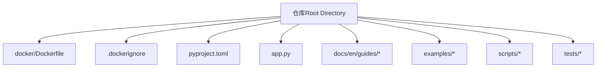
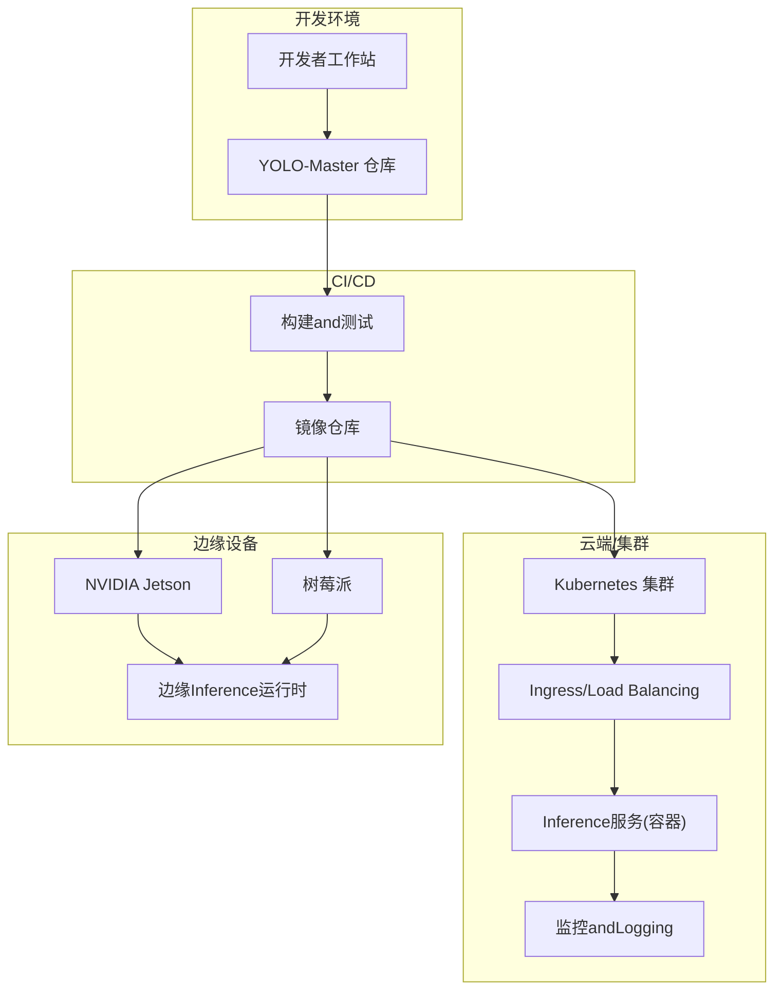
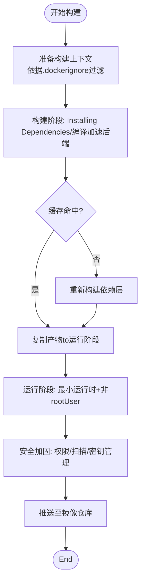
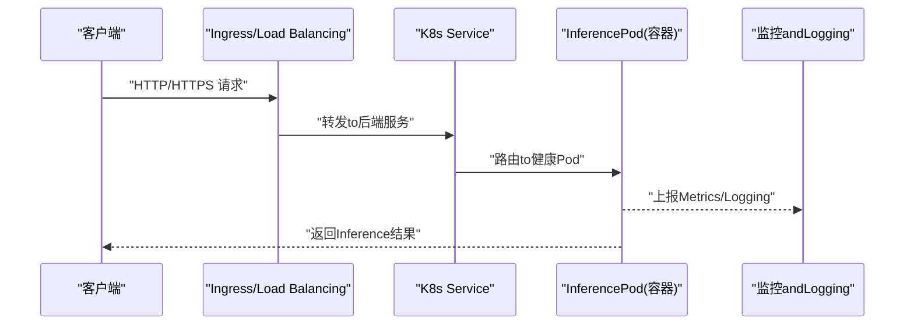
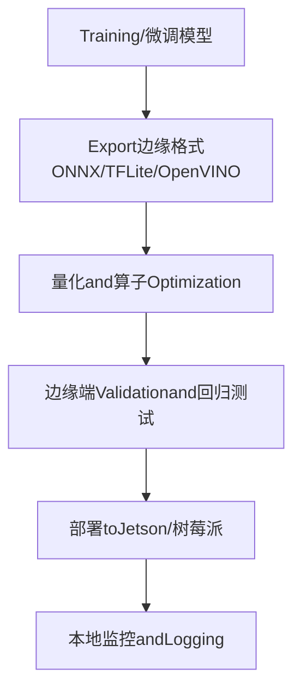
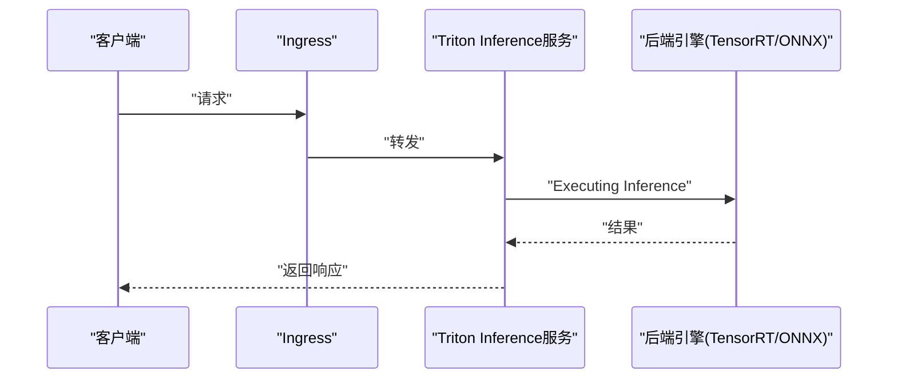
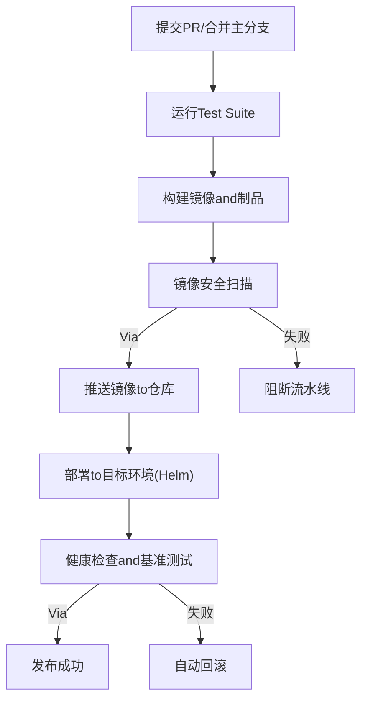
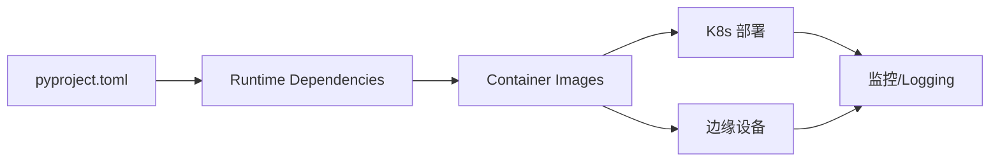

# Deployment and Containerization Examples

<cite>
**Files Referenced in This Document**
- [Dockerfile](file://docker/Dockerfile)
- [.dockerignore](file://.dockerignore)
- [pyproject.toml](file://pyproject.toml)
- [app.py](file://app.py)
- [README.md](file://README.md)
- [mkdocs.yml](file://mkdocs.yml)
- [docs/en/guides/docker-quickstart.md](file://docs/en/guides/docker-quickstart.md)
- [docs/en/guides/model-deployment-options.md](file://docs/en/guides/model-deployment-options.md)
- [docs/en/guides/triton-inference-server.md](file://docs/en/guides/triton-inference-server.md)
- [docs/en/guides/nvidia-jetson.md](file://docs/en/guides/nvidia-jetson.md)
- [docs/en/guides/raspberry-pi.md](file://docs/en/guides/raspberry-pi.md)
- [examples/YOLO-Master-Cross-Platform-Edge-Deployment/TECHNICAL_REPORT.md](file://examples/YOLO-Master-Cross-Platform-Edge-Deployment/TECHNICAL_REPORT.md)
- [examples/YOLO-Master-Cross-Platform-Edge-Deployment/jetson/README.md](file://examples/YOLO-Master-Cross-Platform-Edge-Deployment/jetson/README.md)
- [examples/YOLO-Master-Edge-Deployment/export_edge_models.py](file://examples/YOLO-Master-Edge-Deployment/export_edge_models.py)
- [examples/YOLO-Master-Edge-Deployment/edge_utils.py](file://examples/YOLO-Master-Edge-Deployment/edge_utils.py)
- [scripts/setup_k8s_env.sh](file://scripts/setup_k8s_env.sh)
- [scripts/run_planner_train_compare.py](file://scripts/run_planner_train_compare.py)
- [tests/test_cli.py](file://tests/test_cli.py)
- [tests/test_python.py](file://tests/test_python.py)
</cite>

## Table of Contents
1. [Introduction](#Introduction)
2. [Project Structure](#Project Structure)
3. [Core Components](#Core Components)
4. [Architecture Overview](#Architecture Overview)
5. [Detailed Component Analysis](#Detailed Component Analysis)
6. [Dependency Analysis](#Dependency Analysis)
7. [Performance Considerations](#Performance Considerations)
8. [Troubleshooting Guide](#Troubleshooting Guide)
9. [Conclusion](#Conclusion)
10. [Appendix](#Appendix)

## Introduction
本指南targeting希望将 YOLO-Master 进行Production-Grade Deployment的Engineers，covering from Docker 容器化、镜像Optimizationand安全加固，to Kubernetes 集群部署（含 Helm Chart 配置思路、Load Balancing、自动扩缩容andMonitoring and Alerting）、边缘设备（Jetson、树莓派）适配andOptimization，Centered onand CI/CD 流水线构建脚本and云原生最佳实践。Documentation同时provides性能调优and资源限制的配置建议，帮助while不同环境中稳定高效地运行Inferenceand服务。

## Project Structure
仓库中and部署和容器化直接相关的顶层文件andTable of Contents包括：
- docker/Dockerfile：Container Images构建定义
- .dockerignore：构建上下文过滤规则
- pyproject.toml：Python 包and依赖声明
- app.py：应用入口（such as Web 服务或 CLI 启动）
- docs/en/guides/*：官方部署and平台指南
- examples/*：跨平台andEdge DeploymentExamples
- scripts/*：Environment Preparationand自动化脚本
- tests/*：基础测试用例

**Figure Source**
- [Dockerfile](file://docker/Dockerfile)
- [.dockerignore](file://.dockerignore)
- [pyproject.toml](file://pyproject.toml)
- [app.py](file://app.py)

**Section Source**
- [README.md](file://README.md)
- [mkdocs.yml](file://mkdocs.yml)

## Core Components
- Container Images构建：基于 docker/Dockerfile and .dockerignore，Combining pyproject.toml 的依赖声明，完成可复现的 Python 运行时and模型Inference环境的打包。
- 应用入口：app.py 作for服务或 CLI 的Unified entry point，便于while容器中Centered on单进程方式启动。
- 平台and部署指南：docs/en/guides 下的多篇文章provides Docker Quick Start、Triton Inference服务器、NVIDIA Jetson and树莓派etc.平台的具体步骤。
- Edge DeploymentExamples：examples 下包含跨平台andEdge Deployment的技术报告and脚本，用于ExportandValidation边缘模型。
- 自动化andEnvironment Preparation：scripts provides K8s 环境初始化脚本etc.；tests provides基础 CLI and Python capabilities校验。

**Section Source**
- [Dockerfile](file://docker/Dockerfile)
- [.dockerignore](file://.dockerignore)
- [pyproject.toml](file://pyproject.toml)
- [app.py](file://app.py)
- [docs/en/guides/docker-quickstart.md](file://docs/en/guides/docker-quickstart.md)
- [docs/en/guides/triton-inference-server.md](file://docs/en/guides/triton-inference-server.md)
- [docs/en/guides/nvidia-jetson.md](file://docs/en/guides/nvidia-jetson.md)
- [docs/en/guides/raspberry-pi.md](file://docs/en/guides/raspberry-pi.md)
- [examples/YOLO-Master-Cross-Platform-Edge-Deployment/TECHNICAL_REPORT.md](file://examples/YOLO-Master-Cross-Platform-Edge-Deployment/TECHNICAL_REPORT.md)
- [examples/YOLO-Master-Edge-Deployment/export_edge_models.py](file://examples/YOLO-Master-Edge-Deployment/export_edge_models.py)
- [examples/YOLO-Master-Edge-Deployment/edge_utils.py](file://examples/YOLO-Master-Edge-Deployment/edge_utils.py)
- [scripts/setup_k8s_env.sh](file://scripts/setup_k8s_env.sh)
- [tests/test_cli.py](file://tests/test_cli.py)
- [tests/test_python.py](file://tests/test_python.py)

## Architecture Overview
下图展示从代码to容器、再to云端and边缘的整体部署路径。该图for概念性架构图，不直接映射具体源码文件。

[无需Figure Source，因for此图for概念性架构示意]

## Detailed Component Analysis

### Docker 容器化and镜像Optimization
- 多阶段构建策略
  - 构建阶段：安装系统依赖、编译Optional加速后端、生成缓存层，减少最终镜像体积。
  - 运行阶段：仅包含最小运行时and必要库，Uses非 root User运行，提升安全性。
- 镜像Optimization要点
  - 利用 .dockerignore 排除无关文件，缩小构建上下文。
  - 合并 RUN 指令、合理排序依赖安装顺序Centered on提升缓存命中率。
  - 选择精简的基础镜像（such as slim/alpine），按需启用 GPU/CUDA 运行时。
- 安全加固
  - 非 root User运行、只读文件系统、最小权限原则。
  - 定期扫描镜像漏洞并更新基础镜像。
  - Via环境变量注入敏感配置，避免硬编码。

**Section Source**
- [Dockerfile](file://docker/Dockerfile)
- [.dockerignore](file://.dockerignore)
- [pyproject.toml](file://pyproject.toml)
- [docs/en/guides/docker-quickstart.md](file://docs/en/guides/docker-quickstart.md)

### Kubernetes 集群部署方案
- 部署形态
  - Uses Deployment 管理副本，Service 暴露端口，Ingress provides外部访问and TLS 终止。
  - Via ConfigMap/Secret 管理配置and密钥，implementing配置and镜像解耦。
- 自动扩缩容
  - 基于 CPU/GPU 利用率或自定义Metrics（such as QPS、延迟）触发 HPA。
  - 针对批处理Taskscan use VPA 辅助调整资源请求and限制。
- 监控and告警
  - 采集容器Metrics（Prometheus）、Logging（EFK/Loki）、链路追踪（OpenTelemetry）。
  - 设置 SLO/SLI and告警规则，覆盖错误率、延迟、饱和度。
- Helm Chart 配置思路
  - 将副本数、资源限制、探针、环境变量、存储卷etc.参数化。
  - provides dev/staging/prod 多环境 values 文件，统一版本and变更管理。

[无需Figure Source，因for此图for概念性流程示意]

**Section Source**
- [scripts/setup_k8s_env.sh](file://scripts/setup_k8s_env.sh)

### Edge Device Deployment实践（Jetson、树莓派）
- NVIDIA Jetson
  - Uses官方 JetPack and TensorRT 加速，Combining ONNX/TensorRT Model Export。
  - Refer to Jetson 平台指南and跨平台Edge Deployment技术报告，了解drivers are installed、CUDA/TensorRT 版本匹配and内存Optimization。
- 树莓派
  - Uses轻量运行时（such as OpenVINO、ONNX Runtime）and量化模型，降低 CPU 占用and内存消耗。
  - Refer to树莓派平台指南，关注交叉编译and依赖管理。
- 边缘Model ExportandValidation
  - UsesExamples脚本Export边缘格式（ONNX/TFLite/OpenVINO），并进行输出一致性校验。

**Section Source**
- [docs/en/guides/nvidia-jetson.md](file://docs/en/guides/nvidia-jetson.md)
- [docs/en/guides/raspberry-pi.md](file://docs/en/guides/raspberry-pi.md)
- [examples/YOLO-Master-Cross-Platform-Edge-Deployment/TECHNICAL_REPORT.md](file://examples/YOLO-Master-Cross-Platform-Edge-Deployment/TECHNICAL_REPORT.md)
- [examples/YOLO-Master-Cross-Platform-Edge-Deployment/jetson/README.md](file://examples/YOLO-Master-Cross-Platform-Edge-Deployment/jetson/README.md)
- [examples/YOLO-Master-Edge-Deployment/export_edge_models.py](file://examples/YOLO-Master-Edge-Deployment/export_edge_models.py)
- [examples/YOLO-Master-Edge-Deployment/edge_utils.py](file://examples/YOLO-Master-Edge-Deployment/edge_utils.py)

### Triton Inference服务器集成
- Uses Triton 作for高性能Inference服务后端，Supporting动态批处理、并发and多种后端（TensorRT、ONNX、PyTorch）。
- 将 YOLO-Master Model Exportfor Triton 兼容格式，并Via Model Repository 管理版本and配置。
- Combining K8s 部署 Triton 服务，Combined with Ingress and HPA implementing弹性伸缩。

**Section Source**
- [docs/en/guides/triton-inference-server.md](file://docs/en/guides/triton-inference-server.md)
- [docs/en/guides/model-deployment-options.md](file://docs/en/guides/model-deployment-options.md)

### CI/CD 流水线构建脚本
- 构建and测试
  - while CI 中拉取代码，Installing Dependencies，运行单元测试and端to端冒烟测试。
  - 构建 Docker 镜像并推送to镜像仓库，记录构建元数据and制品。
- 部署and回滚
  - 根据分支and标签发布to不同环境（dev/staging/prod），Uses Helm 升级and回滚。
  - 部署后执行健康检查and基准测试，确保质量门禁。

**Section Source**
- [scripts/run_planner_train_compare.py](file://scripts/run_planner_train_compare.py)
- [tests/test_cli.py](file://tests/test_cli.py)
- [tests/test_python.py](file://tests/test_python.py)

### 云原生最佳实践
- 服务网格
  - Uses Istio/Linkerd implementing流量治理、熔断、重试and灰度发布。
- 配置管理
  - Uses ConfigMap/Secret 管理配置，Combining GitOps（ArgoCD/Flux）implementing声明式部署。
- 故障恢复
  - 配置 Liveness/Readiness 探针，Combining PodDisruptionBudget 保障可用性。
  - 设计幂etc.接口and重试策略，避免级联故障。

[This section provides general guidance and does not directly analyze specific files]

## Dependency Analysis
- 构建期依赖
  - Python 包依赖由 pyproject.toml 声明，建议while构建阶段锁定版本并生成锁文件，保证可复现。
- 运行期依赖
  - Container Images仅包含运行时所需的最小依赖集，GPU/CUDA/TensorRT 按需引入。
- 外部集成点
  - Inference后端（Triton、ONNX Runtime、OpenVINO）、监控系统（Prometheus/Grafana）、Logging系统（EFK/Loki）。

**Section Source**
- [pyproject.toml](file://pyproject.toml)

## Performance Considerations
- 模型层面
  - 量化（INT8/FP16）、图Optimization（剪枝、融合）、算子替换（TensorRT/ONNX）。
- 服务层面
  - 动态批处理、并发线程数、内存池and零拷贝。
- 资源限制
  - Set appropriately CPU/GPU 请求and限制，避免过度分配and抖动。
- 监控and调优
  - 基于延迟分位、吞吐and资源利用率持续调优，Combining压测基线Evaluation改进效果。

[This section provides general guidance and does not directly analyze specific files]

## Troubleshooting Guide
- 常见问题定位
  - 容器启动失败：检查入口命令、环境变量and依赖完整性。
  - Inference异常：核对模型版本、输入尺寸and数据类型，查看后端Logging。
  - 性能退化：观察资源争用、GC 行forand网络bottlenecks。
- 诊断工具
  - Uses kubectl logs/exec 进入容器调试，Combining Prometheus Metricsand分布式追踪定位问题。
  - while CI 中增加回归测试and基准对比，防止性能回退。

**Section Source**
- [app.py](file://app.py)
- [tests/test_cli.py](file://tests/test_cli.py)
- [tests/test_python.py](file://tests/test_python.py)

## Conclusion
Via将 YOLO-Master 容器化并while Kubernetes and边缘设备上标准化部署，可implementing高可用、可扩展and可观测的生产级Inference服务。Combining CI/CD 自动化and云原生最佳实践，能够持续提升交付效率and系统稳定性。建议while生产环境中持续进行性能基准and容量规划，确保while不同负载and硬件条件下均能达成预期 SLA。

## Appendix
- 快速Refer to
  - Docker Quick Start：Refer to官方指南获取基本用法and常见陷阱。
  - 模型部署选项：了解不同后端and平台的权衡。
  - Triton Inference服务器：掌握模型管理and服务编排。
  - 平台指南：Jetson and树莓派的适配要点and注意事项。

**Section Source**
- [docs/en/guides/docker-quickstart.md](file://docs/en/guides/docker-quickstart.md)
- [docs/en/guides/model-deployment-options.md](file://docs/en/guides/model-deployment-options.md)
- [docs/en/guides/triton-inference-server.md](file://docs/en/guides/triton-inference-server.md)
- [docs/en/guides/nvidia-jetson.md](file://docs/en/guides/nvidia-jetson.md)
- [docs/en/guides/raspberry-pi.md](file://docs/en/guides/raspberry-pi.md)