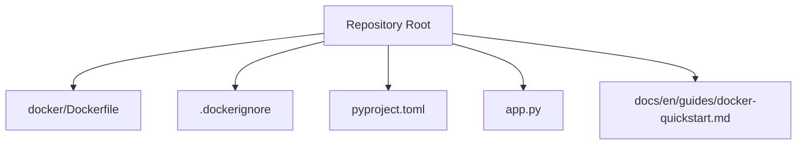
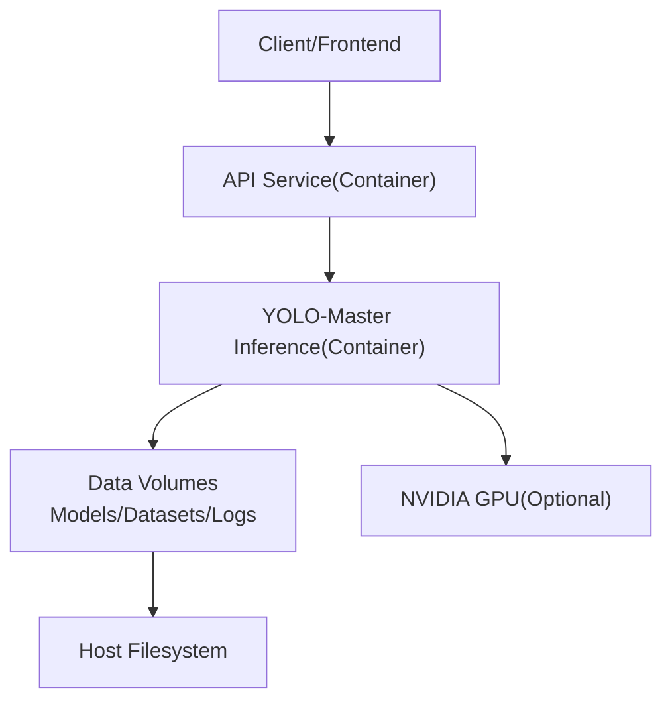
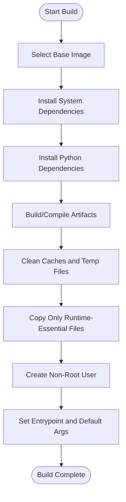
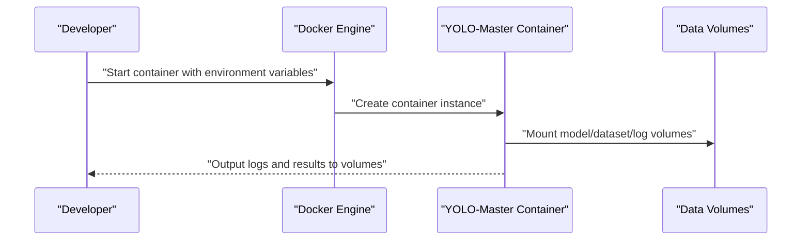
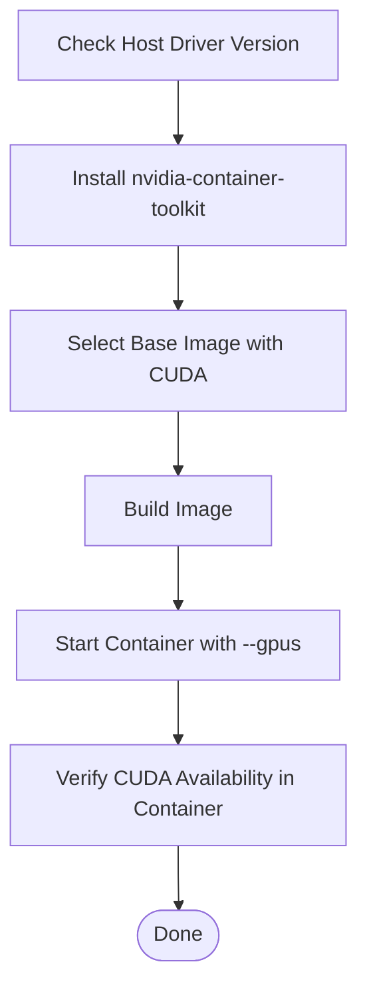
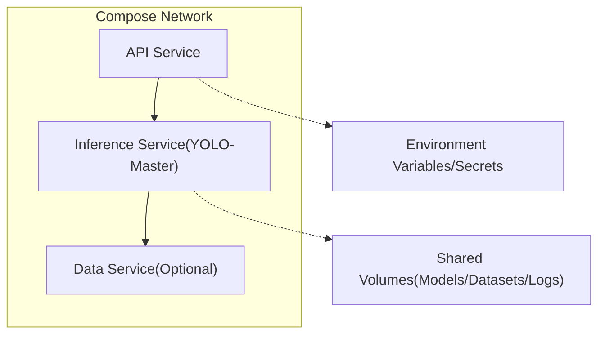
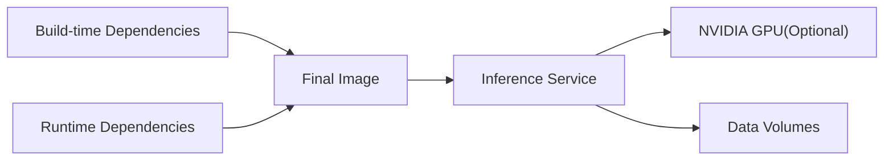

# Docker Containerized Deployment

<cite>
**Files referenced in this document**
- [docker/Dockerfile](file://docker/Dockerfile)
- [.dockerignore](file://.dockerignore)
- [pyproject.toml](file://pyproject.toml)
- [app.py](file://app.py)
- [docs/en/guides/docker-quickstart.md](file://docs/en/guides/docker-quickstart.md)
</cite>

## Table of Contents
1. [Introduction](#introduction)
2. [Project Structure](#project-structure)
3. [Core Components](#core-components)
4. [Architecture Overview](#architecture-overview)
5. [Detailed Component Analysis](#detailed-component-analysis)
6. [Dependency Analysis](#dependency-analysis)
7. [Performance Considerations](#performance-considerations)
8. [Troubleshooting Guide](#troubleshooting-guide)
9. [Conclusion](#conclusion)
10. [Appendix](#appendix)

## Introduction
This guide is intended for engineers and operations personnel who wish to run YOLO-Master in containers in production environments, providing a comprehensive walkthrough from multi-stage builds, image size optimization, GPU support to security hardening and orchestration deployment. The document is systematically organized based on the existing Dockerfile, ignore rules, Python project configuration, and official quickstart documentation in the repository, with actionable best practice recommendations.

## Project Structure
The top-level files directly related to containerization are as follows:
- docker/Dockerfile: Container image build definition
- .dockerignore: Build context filtering to reduce image size and build time
- pyproject.toml: Python package metadata and dependency declarations (used to infer runtime dependencies)
- app.py: Application entry script (can serve as a reference for container startup commands)
- docs/en/guides/docker-quickstart.md: Official Docker quickstart documentation

**Diagram sources**
- [docker/Dockerfile](file://docker/Dockerfile)
- [.dockerignore](file://.dockerignore)
- [pyproject.toml](file://pyproject.toml)
- [app.py](file://app.py)
- [docs/en/guides/docker-quickstart.md](file://docs/en/guides/docker-quickstart.md)

**Section sources**
- [docker/Dockerfile](file://docker/Dockerfile)
- [.dockerignore](file://.dockerignore)
- [pyproject.toml](file://pyproject.toml)
- [app.py](file://app.py)
- [docs/en/guides/docker-quickstart.md](file://docs/en/guides/docker-quickstart.md)

## Core Components
- Multi-stage Builds: By separating build-time and runtime, compilation/installation artifacts remain in the build stage, and only necessary files are copied to the final image, significantly reducing image size.
- Base Image Selection: Prefer minimal and secure distributions as base images; for GPU acceleration, choose base images that include CUDA/cuDNN or are compatible with NVIDIA Container Toolkit.
- Dependency Installation Optimization: Leverage cache layers, merge RUN instructions, install system and Python dependencies as needed, avoiding redundant downloads and unnecessary packages.
- Image Minimization Strategy: Clean package manager caches, remove temporary files, strip development toolchains, retain only runtime-required binaries and libraries.
- Environment Variable Management: Inject configuration via ENV/ARG, combined with .env or orchestration platform environment variable mechanisms for flexible configuration.
- Volume Mounts and Persistence: Map model weights, datasets, logs, and result outputs to host directories, ensuring data reusability and observability.
- GPU Support: Install NVIDIA drivers and nvidia-container-toolkit on the host, and pass --gpus parameter at container startup or use Compose's deploy.resources.reservations.devices configuration.
- Security Best Practices: Run as non-root user, enable read-only root filesystem, restrict capability sets, regularly scan images for vulnerabilities and patch promptly.
- Orchestration Example: Use Docker Compose to define services, networks, volumes, and resource limits, enabling multi-service coordination and elastic scaling.

**Section sources**
- [docker/Dockerfile](file://docker/Dockerfile)
- [docs/en/guides/docker-quickstart.md](file://docs/en/guides/docker-quickstart.md)

## Architecture Overview
The following diagram shows a typical production deployment architecture after containerization: external requests enter the API service, the API calls the YOLO-Master inference service, the inference service accesses local or remote models and data volumes, with GPU acceleration when needed.

[This diagram is a conceptual architecture diagram, not directly mapped to specific source files]

## Detailed Component Analysis

### Multi-Stage Builds and Image Minimization
- Build Stage: Install system dependencies, Python dependencies, compile native extensions, etc.; artifacts from this stage do not enter the final image.
- Runtime Stage: Copy only necessary executables, Python packages, and configuration files; set working directory, environment variables, and non-root user.
- Key Optimization Points:
  - Layer Caching: Copy dependency manifests before code to fully leverage Docker layer caching.
  - Cache Cleanup: Clean package manager caches and build intermediate files immediately after installation.
  - Minimal Base Image: Choose alpine/minimal distributions, or use official slim image variants when CUDA is needed.
  - Single Process Model: Run only a single main process inside the container for horizontal scaling and resource isolation.

[This flowchart shows a general multi-stage build strategy, not directly mapped to specific source files]

**Section sources**
- [docker/Dockerfile](file://docker/Dockerfile)

### Base Image and Dependency Installation Optimization
- Base Image Selection:
  - CPU-only: Recommend lightweight Linux distribution images to reduce attack surface and size.
  - GPU: Choose images with CUDA/cuDNN included, ensuring compatibility with host driver versions.
- Dependency Installation Optimization:
  - Merge RUN instructions to reduce layer count.
  - Use virtual environments or pip caching to improve build speed.
  - Trim dependencies by function, avoiding unnecessary heavy packages.
  - Use pre-compiled wheels or offline sources for large third-party libraries.

**Section sources**
- [docker/Dockerfile](file://docker/Dockerfile)
- [pyproject.toml](file://pyproject.toml)

### Environment Variable Management and Volume Mounts
- Environment Variables:
  - Define defaults via ENV, override at runtime via -e or orchestration platform.
  - Use secret management services or orchestration platform Secret mechanisms for sensitive information.
- Volume Mounts:
  - Model weights: Mount trained weight directories as read-only volumes to avoid re-downloading.
  - Datasets: Mount dataset directories as read-only volumes to improve I/O efficiency.
  - Logs and results: Mount logs and exported results as read-write volumes for collection and analysis.

[This sequence diagram shows typical environment variable and volume mount interactions, not directly mapped to specific source files]

**Section sources**
- [docker/Dockerfile](file://docker/Dockerfile)

### GPU Support Configuration (NVIDIA Container Toolkit)
- Prerequisites:
  - Matching NVIDIA drivers installed on the host.
  - nvidia-container-toolkit installed and enabled.
- Container Startup:
  - Use --gpus all or specify device IDs.
  - Use the devices field in Compose to declare GPU resources.
- Verification:
  - Check CUDA availability and device enumeration inside the container.
  - Run a lightweight inference task to confirm the GPU path is working.

[This flowchart shows end-to-end GPU support steps, not directly mapped to specific source files]

**Section sources**
- [docs/en/guides/docker-quickstart.md](file://docs/en/guides/docker-quickstart.md)

### Security Best Practices
- Non-Root User Execution: Create a dedicated user in the image and start processes as that user.
- Least Privilege: Expose only necessary ports, disable unnecessary capability sets.
- Read-Only Root Filesystem: Write mutable data to volumes, keeping the image immutable.
- Image Scanning and Patching:
  - Use tools like Trivy, Snyk to scan images for vulnerabilities.
  - Update base images and dependencies promptly, close unused ports and services.
- Secret Management: Avoid hardcoding secrets in images; use orchestration platform Secrets or external secret services.

**Section sources**
- [docker/Dockerfile](file://docker/Dockerfile)

### Application Entry and Startup Commands
- Entry Script: Refer to app.py as a reference implementation for container startup commands.
- Startup Parameters: Pass model path, input/output directories, concurrency level, and other parameters based on business requirements.
- Health Checks: Configure health check probes in the orchestration platform to ensure service availability.

**Section sources**
- [app.py](file://app.py)

### Docker Compose Orchestration Example (Multi-Service Deployment)
- Service Division:
  - API Service: Exposes REST/gRPC interfaces externally.
  - Inference Service: Encapsulates YOLO-Master inference logic, supports GPU.
  - Data Service (optional): Provides object storage or database access.
- Networks and Volumes:
  - Use custom networks to isolate inter-service communication.
  - Shared volumes for models, datasets, and logs.
- Resource Limits:
  - Set CPU/memory/GPU quotas for each service to prevent resource contention.
- Environment Variables and Secrets:
  - Use .env files or orchestration platform Secrets to manage configuration and secrets.

[This diagram is a conceptual orchestration architecture diagram, not directly mapped to specific source files]

**Section sources**
- [docs/en/guides/docker-quickstart.md](file://docs/en/guides/docker-quickstart.md)

## Dependency Analysis
- Build-time Dependencies: System package manager dependencies, Python dependencies, compilation toolchain.
- Runtime Dependencies: Retain only runtime-required binaries and libraries, strip build tools and debug symbols.
- External Integrations:
  - NVIDIA drivers and nvidia-container-toolkit (GPU scenarios).
  - Object storage or databases (data service scenarios).
- Coupling and Cohesion:
  - Inference service should be as stateless as possible for horizontal scaling.
  - Decouple data and communication via volumes and networks to reduce inter-service coupling.

[This diagram is a conceptual dependency diagram, not directly mapped to specific source files]

**Section sources**
- [docker/Dockerfile](file://docker/Dockerfile)
- [pyproject.toml](file://pyproject.toml)

## Performance Considerations
- Build Performance:
  - Use cache layers appropriately, copy dependency manifests first.
  - Install dependencies in parallel (where applicable) to shorten build time.
- Runtime Performance:
  - Adjust batch size and thread count to match hardware resources.
  - Use GPU acceleration and TensorRT/ONNX optimization (where applicable).
  - Warm up models to reduce cold start latency.
- I/O Optimization:
  - Place datasets and models on high-performance storage (SSD/NVMe).
  - Use read-only volumes to reduce write amplification.

[This section provides general guidance, not directly analyzing specific files]

## Troubleshooting Guide
- Build Failures:
  - Check base image version and network connectivity.
  - Review dependency installation logs to locate missing system or Python packages.
- Runtime Errors:
  - Verify environment variables are correctly injected.
  - Check volume mount paths and permissions.
  - Confirm GPU driver and container toolkit version compatibility.
- Performance Issues:
  - Monitor CPU/GPU/memory/disk I/O metrics.
  - Adjust batch size, thread count, and concurrency level.
  - Analyze hot paths, consider model quantization or export optimization.

**Section sources**
- [docker/Dockerfile](file://docker/Dockerfile)
- [docs/en/guides/docker-quickstart.md](file://docs/en/guides/docker-quickstart.md)

## Conclusion
Through multi-stage builds, minimal base images, strict security policies, and proper orchestration design, YOLO-Master can run stably and efficiently in production environments. Combined with GPU acceleration and data volume persistence, it can meet high-throughput inference demands while ensuring data security and observability. It is recommended to integrate image scanning and security hardening into the CI/CD pipeline, continuously optimizing image size and startup performance.

[This section is summary content, not directly analyzing specific files]

## Appendix
- Common Command Reference:
  - Build image: Execute build command at repository root.
  - Run container: Pass environment variables and volume mounts, enable GPU as needed.
  - Orchestration deployment: Use Compose to start multi-service combinations.
- Reference Documentation:
  - Official Docker Quickstart: docs/en/guides/docker-quickstart.md

**Section sources**
- [docs/en/guides/docker-quickstart.md](file://docs/en/guides/docker-quickstart.md)
