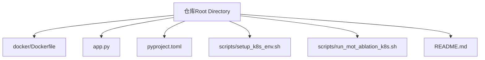
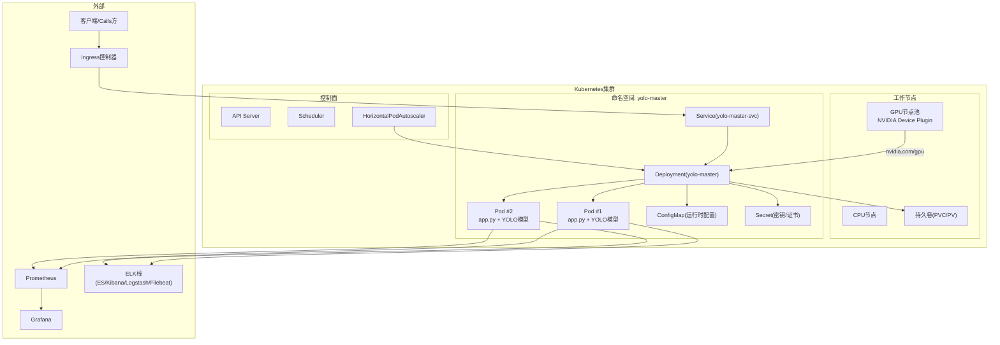
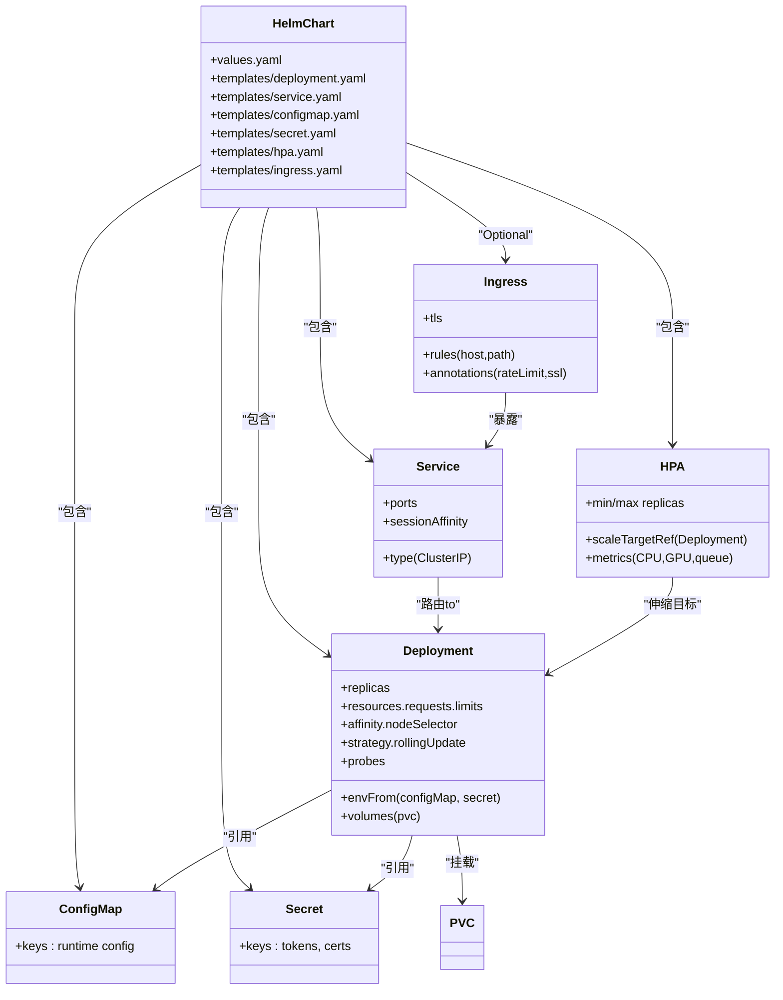
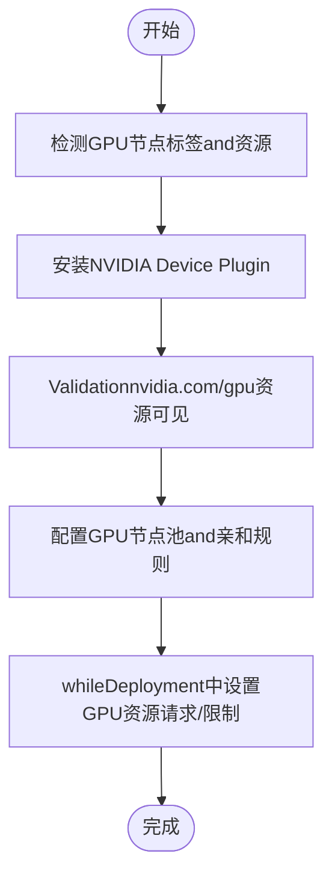
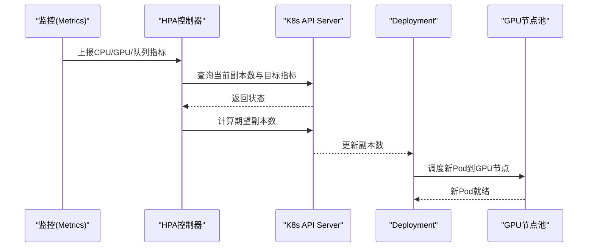
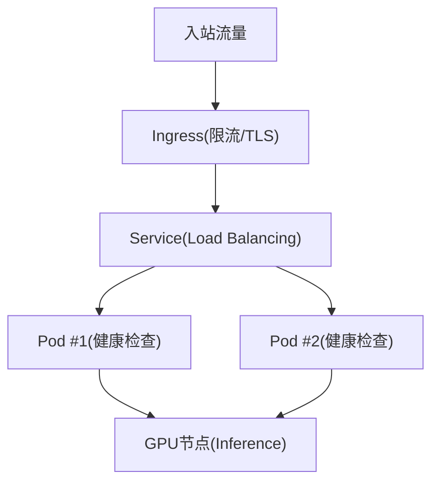
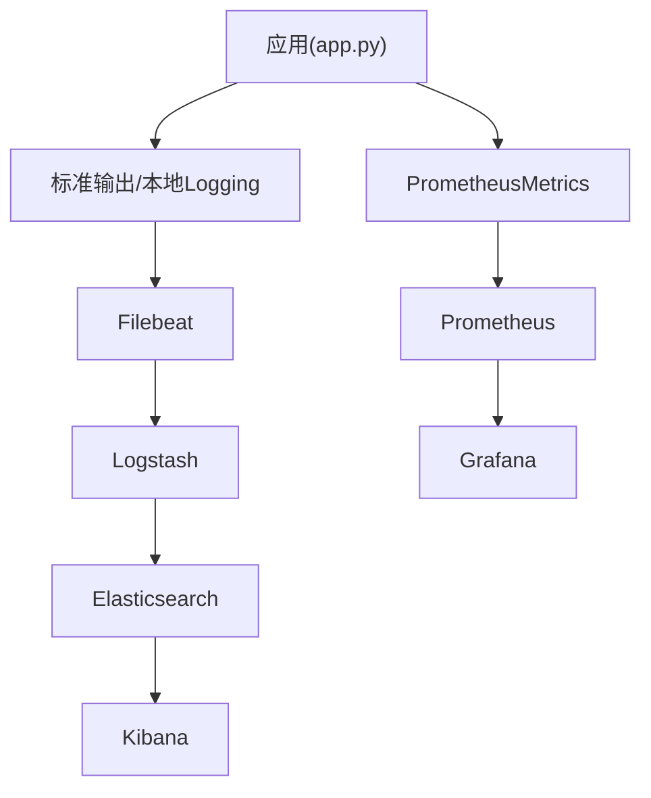
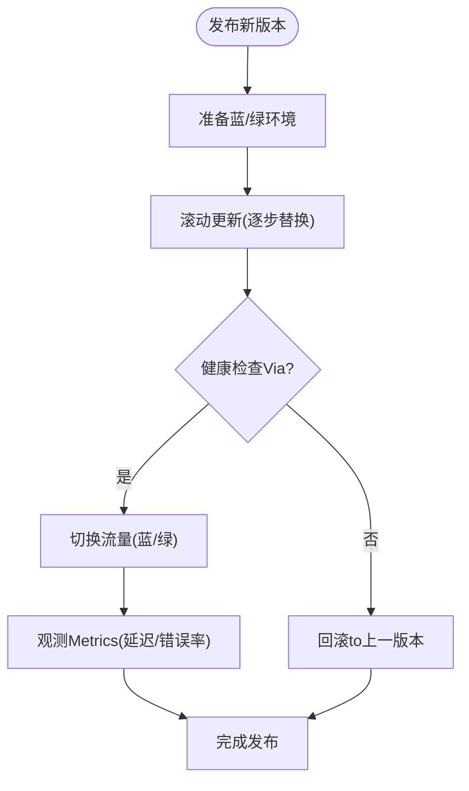
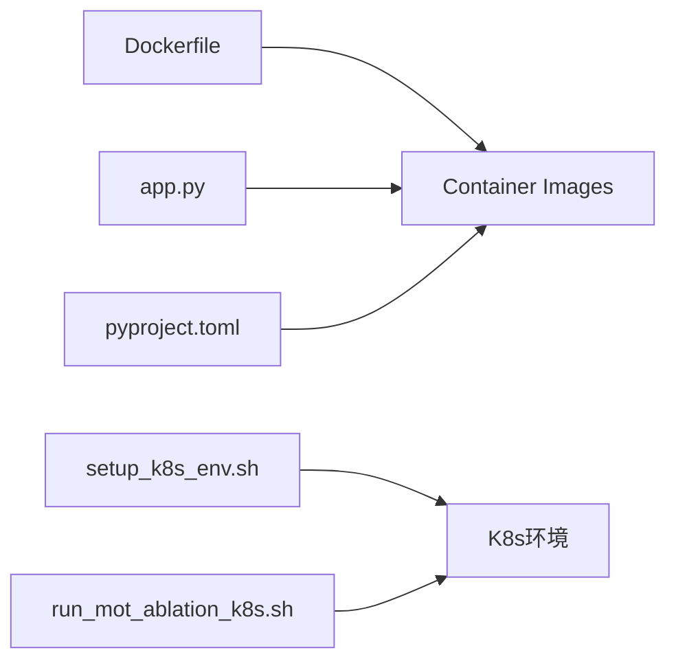

# Kubernetes集群部署

<cite>
**Files Referenced in This Document**
- [Dockerfile](file://docker/Dockerfile)
- [app.py](file://app.py)
- [pyproject.toml](file://pyproject.toml)
- [README.md](file://README.md)
- [setup_k8s_env.sh](file://scripts/setup_k8s_env.sh)
- [run_mot_ablation_k8s.sh](file://scripts/run_mot_ablation_k8s.sh)
</cite>

## Table of Contents
1. [Introduction](#Introduction)
2. [Project Structure](#Project Structure)
3. [Core Components](#Core Components)
4. [Architecture Overview](#Architecture Overview)
5. [Detailed Component Analysis](#Detailed Component Analysis)
6. [Dependency Analysis](#Dependency Analysis)
7. [Performance Considerations](#Performance Considerations)
8. [Troubleshooting Guide](#Troubleshooting Guide)
9. [Conclusion](#Conclusion)
10. [Appendix](#Appendix)

## Introduction
本方案targetingwhileKubernetes集群中完整部署YOLO-MasterInference服务，provides基于Helm的标准化模板and最佳实践。内容覆盖：
- Helm Chart资源定义（Deployment、Service、ConfigMap、Secret）
- GPU节点池配置and设备插件安装、资源分配策略
- 水平自动扩缩容（HPA），基于CPU/GPUUses率and请求队列长度
- Load Balancingand高可用配置
- 监控andLogging收集（Prometheus、Grafana、ELK）
- 滚动更新and蓝绿发布策略，implementing零停机发布

说明：仓库未包含现成的Helm Chart或Kubernetes清单，本文给出可直接落地的模板and步骤，并Combining仓库中的Container Images构建入口and应用启动脚本进行适配。

## Project Structure
andKubernetes部署直接相关的仓库元素包括：
- Container Images构建入口：Dockerfile
- 应用主进程入口：app.py
- 依赖and环境声明：pyproject.toml
- K8sEnvironment PreparationandExamples运行脚本：scripts/setup_k8s_env.sh、scripts/run_mot_ablation_k8s.sh
- 项目概览andUses说明：README.md

**Figure Source**
- [Dockerfile](file://docker/Dockerfile)
- [app.py](file://app.py)
- [pyproject.toml](file://pyproject.toml)
- [setup_k8s_env.sh](file://scripts/setup_k8s_env.sh)
- [run_mot_ablation_k8s.sh](file://scripts/run_mot_ablation_k8s.sh)
- [README.md](file://README.md)

**Section Source**
- [Dockerfile](file://docker/Dockerfile)
- [app.py](file://app.py)
- [pyproject.toml](file://pyproject.toml)
- [setup_k8s_env.sh](file://scripts/setup_k8s_env.sh)
- [run_mot_ablation_k8s.sh](file://scripts/run_mot_ablation_k8s.sh)
- [README.md](file://README.md)

## Core Components
- Container Images构建
  - ViaDockerfile定义基础镜像、依赖安装and可执行入口，确保GPU运行时andCUDA/cuDNNetc.依赖正确打包。
- 应用服务
  - app.py作for服务入口，负责Load model、暴露HTTP/gRPC接口、处理并发InferenceTasks。
- 环境and依赖
  - pyproject.toml声明Python依赖and版本约束，便于while镜像构建阶段固定依赖树。
- K8sEnvironment Preparation
  - setup_k8s_env.sh用于初始化集群所需组件（such as设备插件、存储类、网络插件etc.）。
- Examples工作负载
  - run_mot_ablation_k8s.sh展示such as何whileK8s上提交作业/运行Tasks，可作forRefer toCentered on扩展for长期运行的Inference服务。

**Section Source**
- [Dockerfile](file://docker/Dockerfile)
- [app.py](file://app.py)
- [pyproject.toml](file://pyproject.toml)
- [setup_k8s_env.sh](file://scripts/setup_k8s_env.sh)
- [run_mot_ablation_k8s.sh](file://scripts/run_mot_ablation_k8s.sh)

## Architecture Overview
下图展示了whileKubernetes上的端to端部署架构，涵盖Ingress、Service、Deployment、HPA、GPU Device Plugin、持久化存储、监控andLogging采集etc.关键组件。

**Figure Source**
- [Dockerfile](file://docker/Dockerfile)
- [app.py](file://app.py)
- [setup_k8s_env.sh](file://scripts/setup_k8s_env.sh)

## Detailed Component Analysis

### Helm Chart模板设计
建议将Centered on下资源组织toHelm Chart中，按环境（dev/staging/prod）Viavalues.yaml区分参数。

- Deployment
  - 副本数：初始副本数and最小/最大副本数由HPA管理
  - 资源限制and请求：CPU/GPU显存/内存设置，确保调度to具备GPU的节点
  - 探针：liveness/readiness/startup探针保障健康检查and就绪判定
  - 亲和性and反亲和性：优先调度至GPU节点池；同节点多Pod反亲和提升可用性
  - 滚动更新策略：maxUnavailable/maxSurge保证零停机发布
  - 环境变量and挂载：从ConfigMap/Secret注入配置and密钥；挂载PVC用于模型权重and缓存
- Service
  - ClusterIP类型，暴露内部访问；such as需外部访问，CombiningIngress
  - 会话亲和：根据业务需求选择None或ClientIP
- ConfigMap
  - 存放非敏感配置（模型路径、批大小、超时、Logging级别etc.）
- Secret
  - 存放敏感信息（认证令牌、证书、数据库连接串etc.）
- HorizontalPodAutoscaler
  - Metrics源：CPU利用率、GPU利用率（需metrics-serverand自定义Metrics）、队列长度（自定义Metrics）
  - 目标：基于阈值触发扩缩容，避免过度伸缩
- Ingress
  - 对外暴露HTTPS入口，启用TLSand限流策略
- StorageClass & PVC
  - Uses高性能存储类承载模型权重and中间结果

**Figure Source**
- [Dockerfile](file://docker/Dockerfile)
- [app.py](file://app.py)

**Section Source**
- [Dockerfile](file://docker/Dockerfile)
- [app.py](file://app.py)

### GPU节点池and设备插件
- 节点池规划
  - 创建专用GPU节点池，标签化节点（such asnode-role=worker-gpu），ViaNodeSelector或NodeAffinity将Pod调度toGPU节点
- 设备插件安装
  - 安装NVIDIA Device Plugin，使Kubernetes识别并暴露nvidia.com/gpu资源
  - 确认kubeletand容器运行时已启用GPUSupporting
- 资源分配策略
  - whileDeployment中声明requests.limits的nvidia.com/gpu数量
  - Set appropriatelyCPU/内存/GPU显存请求，避免超卖导致抖动
  - UsesTopology ManagerandMIG（such as适用）Optimization多租户隔离

**Figure Source**
- [setup_k8s_env.sh](file://scripts/setup_k8s_env.sh)

**Section Source**
- [setup_k8s_env.sh](file://scripts/setup_k8s_env.sh)

### 自动扩缩容（HPA）
- Metrics来源
  - CPU利用率：Built-inMetrics
  - GPU利用率：需要metrics-serverand自定义MetricsExporter（例such asnvidia-dcgm-exporter）
  - 请求队列长度：while应用侧暴露自定义Metrics（such as队列深度、待处理Tasks数）
- 扩缩容策略
  - 基于CPU/GPU阈值的平均利用率目标
  - 基于队列长度的延迟敏感型扩容
  - 冷却时间and抖动抑制，避免频繁扩缩容

**Figure Source**
- [app.py](file://app.py)

**Section Source**
- [app.py](file://app.py)

### Load Balancingand高可用
- Load Balancing
  - UsesService对后端Pod进行轮询/会话亲和分发
  - CombiningIngress启用TLS、限流and熔断策略
- 高可用
  - 多副本部署，跨可用区分布
  - 反亲和规则避免单点故障
  - 健康检查and快速失败重试

**Figure Source**
- [app.py](file://app.py)

**Section Source**
- [app.py](file://app.py)

### 监控andLogging收集
- Metrics采集
  - 应用侧暴露PrometheusMetrics（QPS、延迟分位、错误率、队列长度、GPU利用率）
  - 集成metrics-serverandDCGM Exporter获取GPUMetrics
- Visualization
  - Grafana仪表盘展示系统and服务级Metrics
- Logging收集
  - Filebeat采集容器标准输出and本地Logging
  - Logstash解析and过滤，Elasticsearch聚合存储，Kibana检索and分析

**Figure Source**
- [app.py](file://app.py)

**Section Source**
- [app.py](file://app.py)

### 滚动更新and蓝绿部署
- 滚动更新
  - UsesRollingUpdate策略，逐步替换旧Pod，确保服务不中断
  - Combined with探针and就绪检查，确保新版本稳定后再继续
- 蓝绿部署
  - 维护两套相同的服务集（蓝/绿），ViaService或Ingress切换流量
  - 灰度发布时按比例分流，观察Metrics后全量切换

**Figure Source**
- [Dockerfile](file://docker/Dockerfile)
- [app.py](file://app.py)

**Section Source**
- [Dockerfile](file://docker/Dockerfile)
- [app.py](file://app.py)

## Dependency Analysis
- Container Images依赖
  - Dockerfile定义了基础镜像and依赖安装流程，确保GPU运行时andCUDA库可用
- 应用依赖
  - app.py作for服务入口，依赖Python生态andYOLO相关库
- 环境and工具
  - scripts/setup_k8s_env.sh用于集群环境初始化
  - scripts/run_mot_ablation_k8s.shprovidesK8s作业运行Examples

**Figure Source**
- [Dockerfile](file://docker/Dockerfile)
- [app.py](file://app.py)
- [pyproject.toml](file://pyproject.toml)
- [setup_k8s_env.sh](file://scripts/setup_k8s_env.sh)
- [run_mot_ablation_k8s.sh](file://scripts/run_mot_ablation_k8s.sh)

**Section Source**
- [Dockerfile](file://docker/Dockerfile)
- [app.py](file://app.py)
- [pyproject.toml](file://pyproject.toml)
- [setup_k8s_env.sh](file://scripts/setup_k8s_env.sh)
- [run_mot_ablation_k8s.sh](file://scripts/run_mot_ablation_k8s.sh)

## Performance Considerations
- 资源配额and限制
  - Set appropriatelyCPU/GPU/内存请求and限制，避免资源争用
- 批处理and并发
  - 调整批大小and并发度，平衡吞吐and延迟
- 模型预热and缓存
  - 启动预热减少冷启动延迟；利用PVC缓存常用模型and中间结果
- 网络andI/O
  - Uses高性能存储类and网络插件，降低I/Obottlenecks
- 弹性and稳定性
  - CombiningHPAand探针，动态扩缩容and快速故障恢复

[本节for通用指导，无需特定文件来源]

## Troubleshooting Guide
- 常见问题定位
  - GPU不可见：检查Device Plugin安装andnvidia.com/gpu资源是否被调度
  - 启动失败：查看Pod事件andLogging，确认依赖and模型路径
  - 扩缩容异常：核对HPAMetrics源and阈值配置
  - 性能抖动：检查资源限制and亲和/反亲和策略
- 诊断步骤
  - Useskubectl describe/pod logs查看问题上下文
  - ViaGrafanaandKibana关联MetricsandLogging定位根因
  - 逐步回滚或调整资源配置Validation修复效果

**Section Source**
- [setup_k8s_env.sh](file://scripts/setup_k8s_env.sh)
- [run_mot_ablation_k8s.sh](file://scripts/run_mot_ablation_k8s.sh)

## Conclusion
本方案provides了whileKubernetes集群中部署YOLO-Master的完整路径：从镜像构建、Helm模板设计、GPU节点池and设备插件、HPA自动扩缩容、Load Balancingand高可用，to监控Loggingand发布策略。Combining仓库中的Dockerfileandapp.py，可按本文模板快速落地Production-Grade Deployment，并Via持续Optimizationimplementing稳定高效的Inference服务。

[本节for总结，无需特定文件来源]

## Appendix
- 部署清单要点
  - Deployment：副本、资源、探针、亲和、滚动更新、环境变量and挂载
  - Service：ClusterIPand端口映射
  - ConfigMap/Secret：配置and密钥分离
  - HPA：CPU/GPU/队列Metricsand目标阈值
  - Ingress：TLS、限流and域名绑定
  - StorageClass/PVC：模型and数据持久化
- Refer to脚本
  - setup_k8s_env.sh：集群环境初始化
  - run_mot_ablation_k8s.sh：K8s作业运行Examples

**Section Source**
- [setup_k8s_env.sh](file://scripts/setup_k8s_env.sh)
- [run_mot_ablation_k8s.sh](file://scripts/run_mot_ablation_k8s.sh)