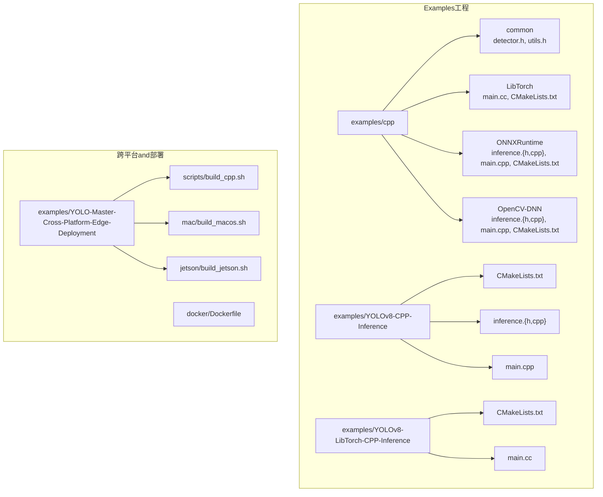
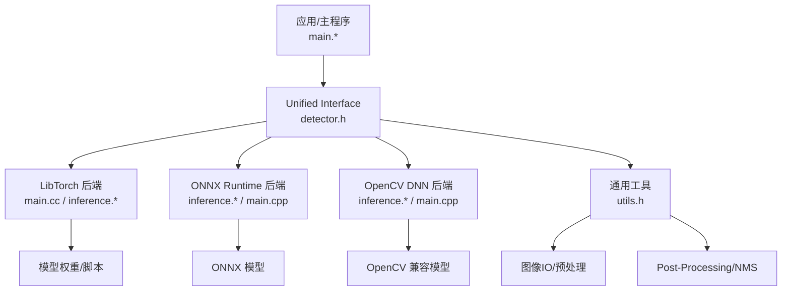
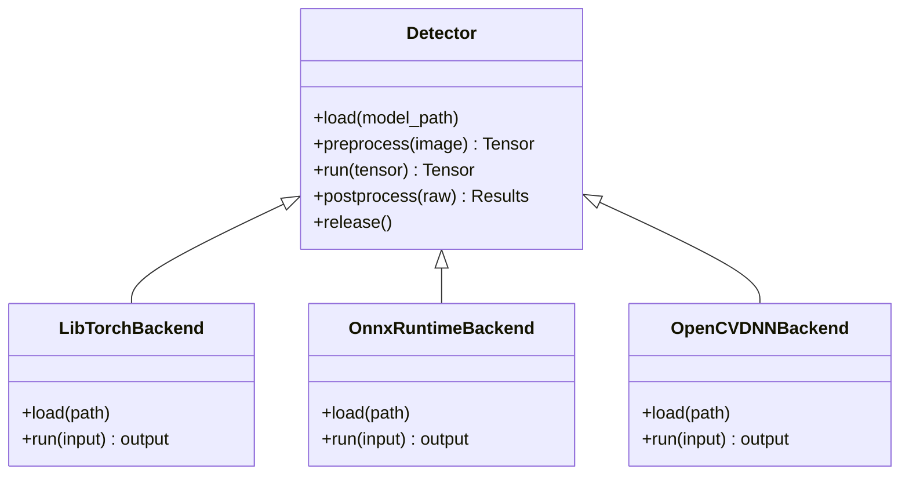
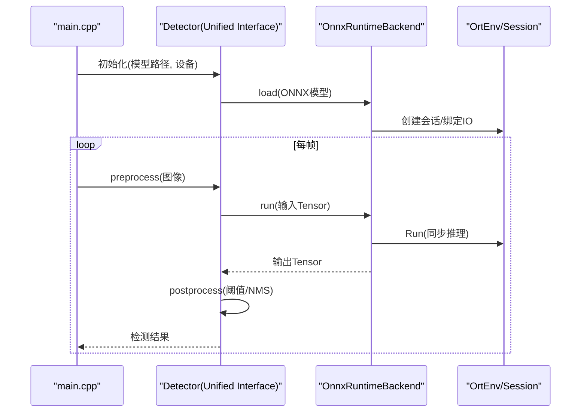
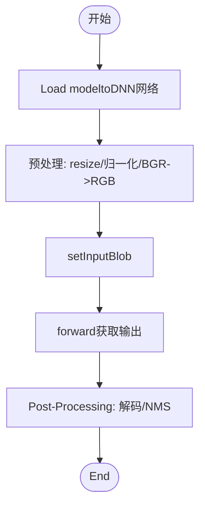
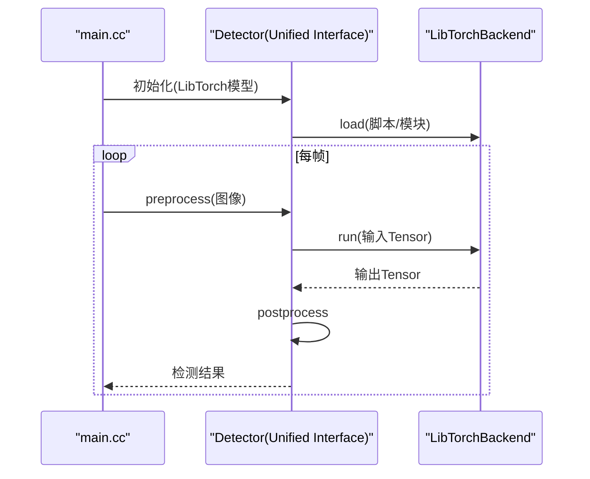

# C++高性能Inference集成

<cite>
**Files Referenced in This Document**
- [examples/cpp/README.md](file://examples/cpp/README.md)
- [examples/cpp/LibTorch/CMakeLists.txt](file://examples/cpp/LibTorch/CMakeLists.txt)
- [examples/cpp/LibTorch/main.cc](file://examples/cpp/LibTorch/main.cc)
- [examples/cpp/ONNXRuntime/CMakeLists.txt](file://examples/cpp/ONNXRuntime/CMakeLists.txt)
- [examples/cpp/ONNXRuntime/inference.cpp](file://examples/cpp/ONNXRuntime/inference.cpp)
- [examples/cpp/ONNXRuntime/inference.h](file://examples/cpp/ONNXRuntime/inference.h)
- [examples/cpp/ONNXRuntime/main.cpp](file://examples/cpp/ONNXRuntime/main.cpp)
- [examples/cpp/OpenCV-DNN/CMakeLists.txt](file://examples/cpp/OpenCV-DNN/CMakeLists.txt)
- [examples/cpp/OpenCV-DNN/inference.cpp](file://examples/cpp/OpenCV-DNN/inference.cpp)
- [examples/cpp/OpenCV-DNN/inference.h](file://examples/cpp/OpenCV-DNN/inference.h)
- [examples/cpp/OpenCV-DNN/main.cpp](file://examples/cpp/OpenCV-DNN/main.cpp)
- [examples/cpp/common/detector.h](file://examples/cpp/common/detector.h)
- [examples/cpp/common/utils.h](file://examples/cpp/common/utils.h)
- [examples/YOLOv8-CPP-Inference/CMakeLists.txt](file://examples/YOLOv8-CPP-Inference/CMakeLists.txt)
- [examples/YOLOv8-CPP-Inference/inference.h](file://examples/YOLOv8-CPP-Inference/inference.h)
- [examples/YOLOv8-CPP-Inference/inference.cpp](file://examples/YOLOv8-CPP-Inference/inference.cpp)
- [examples/YOLOv8-CPP-Inference/main.cpp](file://examples/YOLOv8-CPP-Inference/main.cpp)
- [examples/YOLOv8-LibTorch-CPP-Inference/CMakeLists.txt](file://examples/YOLOv8-LibTorch-CPP-Inference/CMakeLists.txt)
- [examples/YOLOv8-LibTorch-CPP-Inference/main.cc](file://examples/YOLOv8-LibTorch-CPP-Inference/main.cc)
- [examples/YOLO-Master-Cross-Platform-Edge-Deployment/TECHNICAL_REPORT.md](file://examples/YOLO-Master-Cross-Platform-Edge-Deployment/TECHNICAL_REPORT.md)
- [examples/YOLO-Master-Cross-Platform-Edge-Deployment/scripts/build_cpp.sh](file://examples/YOLO-Master-Cross-Platform-Edge-Deployment/scripts/build_cpp.sh)
- [examples/YOLO-Master-Cross-Platform-Edge-Deployment/mac/build_macos.sh](file://examples/YOLO-Master-Cross-Platform-Edge-Deployment/mac/build_macos.sh)
- [examples/YOLO-Master-Cross-Platform-Edge-Deployment/jetson/build_jetson.sh](file://examples/YOLO-Master-Cross-Platform-Edge-Deployment/jetson/build_jetson.sh)
- [docker/Dockerfile](file://docker/Dockerfile)
</cite>

## Table of Contents
1. [Introduction](#Introduction)
2. [Project Structure](#Project Structure)
3. [Core Components](#Core Components)
4. [Architecture Overview](#Architecture Overview)
5. [Detailed Component Analysis](#Detailed Component Analysis)
6. [依赖and构建配置](#依赖and构建配置)
7. [性能and并发](#性能and并发)
8. [跨平台编译指南](#跨平台编译指南)
9. [Containerized Deployment](#Containerized Deployment)
10. [故障排查and调试](#故障排查and调试)
11. [Conclusion](#Conclusion)
12. [Appendix：Examplesand脚本路径](#AppendixExamplesand脚本路径)

## Introduction
本文件targetingwhileC++环境中集成YOLO-Master进行高性能Inference的开发者，覆盖LibTorch、OpenCV DNN、ONNX Runtime C++ API三种后端的选择策略、工程组织、编译and依赖管理、内存and线程模型、异步处理、性能监控and调试技巧，Centered onand生产环境部署and跨平台构建方案。DocumentationCentered on仓库中现有C++Examplesfor基础，provides可复用的工程模板and最佳实践建议。

## Project Structure
仓库中andC++Inference相关的代码主要集中while examples Table of Contents下，按后端划分，并共享通用工具Modules；同时provides跨平台构建脚本andDocker镜像定义，便于while不同平台上快速搭建Inference服务。

Figure Source
- [examples/cpp/README.md](file://examples/cpp/README.md)
- [examples/cpp/common/detector.h](file://examples/cpp/common/detector.h)
- [examples/cpp/common/utils.h](file://examples/cpp/common/utils.h)
- [examples/cpp/LibTorch/CMakeLists.txt](file://examples/cpp/LibTorch/CMakeLists.txt)
- [examples/cpp/LibTorch/main.cc](file://examples/cpp/LibTorch/main.cc)
- [examples/cpp/ONNXRuntime/CMakeLists.txt](file://examples/cpp/ONNXRuntime/CMakeLists.txt)
- [examples/cpp/ONNXRuntime/inference.h](file://examples/cpp/ONNXRuntime/inference.h)
- [examples/cpp/ONNXRuntime/inference.cpp](file://examples/cpp/ONNXRuntime/inference.cpp)
- [examples/cpp/ONNXRuntime/main.cpp](file://examples/cpp/ONNXRuntime/main.cpp)
- [examples/cpp/OpenCV-DNN/CMakeLists.txt](file://examples/cpp/OpenCV-DNN/CMakeLists.txt)
- [examples/cpp/OpenCV-DNN/inference.h](file://examples/cpp/OpenCV-DNN/inference.h)
- [examples/cpp/OpenCV-DNN/inference.cpp](file://examples/cpp/OpenCV-DNN/inference.cpp)
- [examples/cpp/OpenCV-DNN/main.cpp](file://examples/cpp/OpenCV-DNN/main.cpp)
- [examples/YOLOv8-CPP-Inference/CMakeLists.txt](file://examples/YOLOv8-CPP-Inference/CMakeLists.txt)
- [examples/YOLOv8-CPP-Inference/inference.h](file://examples/YOLOv8-CPP-Inference/inference.h)
- [examples/YOLOv8-CPP-Inference/inference.cpp](file://examples/YOLOv8-CPP-Inference/inference.cpp)
- [examples/YOLOv8-CPP-Inference/main.cpp](file://examples/YOLOv8-CPP-Inference/main.cpp)
- [examples/YOLOv8-LibTorch-CPP-Inference/CMakeLists.txt](file://examples/YOLOv8-LibTorch-CPP-Inference/CMakeLists.txt)
- [examples/YOLOv8-LibTorch-CPP-Inference/main.cc](file://examples/YOLOv8-LibTorch-CPP-Inference/main.cc)
- [examples/YOLO-Master-Cross-Platform-Edge-Deployment/scripts/build_cpp.sh](file://examples/YOLO-Master-Cross-Platform-Edge-Deployment/scripts/build_cpp.sh)
- [examples/YOLO-Master-Cross-Platform-Edge-Deployment/mac/build_macos.sh](file://examples/YOLO-Master-Cross-Platform-Edge-Deployment/mac/build_macos.sh)
- [examples/YOLO-Master-Cross-Platform-Edge-Deployment/jetson/build_jetson.sh](file://examples/YOLO-Master-Cross-Platform-Edge-Deployment/jetson/build_jetson.sh)
- [docker/Dockerfile](file://docker/Dockerfile)

Section Source
- [examples/cpp/README.md](file://examples/cpp/README.md)

## Core Components
- 统一检测接口（common）
  - detector.h：抽象出统一的加载、预处理、Inference、Post-Processing接口，屏蔽不同后端差异。
  - utils.h：图像IO、尺寸缩放、归一化、NMSetc.General Utility Functions。
- 后端implementing
  - LibTorch：基于torch::jit或torch::nn的InferenceEncapsulates，适合GPU加速and动态形状场景。
  - ONNX Runtime：ViaORT Session执行Exporting toONNX的模型，具备良好跨平台性and生态Supporting。
  - OpenCV DNN：轻量级后端，无需额外运行时，适合CPU端快速集成。
- 入口程序
  - 各后端均providesmain入口，负责参数解析、模型加载、循环Inferenceand结果输出。

Section Source
- [examples/cpp/common/detector.h](file://examples/cpp/common/detector.h)
- [examples/cpp/common/utils.h](file://examples/cpp/common/utils.h)
- [examples/cpp/LibTorch/main.cc](file://examples/cpp/LibTorch/main.cc)
- [examples/cpp/ONNXRuntime/inference.h](file://examples/cpp/ONNXRuntime/inference.h)
- [examples/cpp/ONNXRuntime/inference.cpp](file://examples/cpp/ONNXRuntime/inference.cpp)
- [examples/cpp/ONNXRuntime/main.cpp](file://examples/cpp/ONNXRuntime/main.cpp)
- [examples/cpp/OpenCV-DNN/inference.h](file://examples/cpp/OpenCV-DNN/inference.h)
- [examples/cpp/OpenCV-DNN/inference.cpp](file://examples/cpp/OpenCV-DNN/inference.cpp)
- [examples/cpp/OpenCV-DNN/main.cpp](file://examples/cpp/OpenCV-DNN/main.cpp)

## Architecture Overview
下图展示了“Application Layer—Unified Interface—后端implementing—数据流”的整体架构。应用侧Calls统一检测接口，内部根据配置选择具体后端；数据从输入图像经预处理进入Inference引擎，再ViaPost-Processing得to检测结果。

Figure Source
- [examples/cpp/common/detector.h](file://examples/cpp/common/detector.h)
- [examples/cpp/common/utils.h](file://examples/cpp/common/utils.h)
- [examples/cpp/LibTorch/main.cc](file://examples/cpp/LibTorch/main.cc)
- [examples/cpp/ONNXRuntime/inference.h](file://examples/cpp/ONNXRuntime/inference.h)
- [examples/cpp/ONNXRuntime/inference.cpp](file://examples/cpp/ONNXRuntime/inference.cpp)
- [examples/cpp/ONNXRuntime/main.cpp](file://examples/cpp/ONNXRuntime/main.cpp)
- [examples/cpp/OpenCV-DNN/inference.h](file://examples/cpp/OpenCV-DNN/inference.h)
- [examples/cpp/OpenCV-DNN/inference.cpp](file://examples/cpp/OpenCV-DNN/inference.cpp)
- [examples/cpp/OpenCV-DNN/main.cpp](file://examples/cpp/OpenCV-DNN/main.cpp)

## Detailed Component Analysis

### 统一检测接口（common）
- 设计目标
  - 将模型加载、预处理、Inference、Post-Processing解耦，Exposing a consistentAPI。
  - Supporting多后端切换，便于基准测试and部署Migration。
- 关键职责
  - 初始化and资源管理：构造/析构、Device Selection、内存池。
  - 预处理：resize、归一化、通道顺序转换、数据类型转换。
  - Inference：Calls具体后端执行前向计算。
  - Post-Processing：Confidence Threshold过滤、NMS、坐标还原。
- 复杂度andOptimization
  - 预处理andPost-Processing通常forO(N·H·W)，可ViaSIMD/并行化Optimization。
  - 内存复用：预分配输入/输出缓冲区，减少频繁分配开销。

Figure Source
- [examples/cpp/common/detector.h](file://examples/cpp/common/detector.h)

Section Source
- [examples/cpp/common/detector.h](file://examples/cpp/common/detector.h)
- [examples/cpp/common/utils.h](file://examples/cpp/common/utils.h)

### ONNX Runtime 后端
- 典型流程
  - 创建OrtEnvandSession，设置执行provides者（CPU/GPU）。
  - 绑定输入输出张量名and形状，准备内存缓冲。
  - 循环Inference时复用会话and缓冲，避免重复初始化。
- 多线程and异步
  - 每个线程持有独立Session实例Centered on避免状态竞争。
  - UsesInferenceSession::Run进行同步Inference；such as需异步，可while上层队列+线程池组合。
- 性能要点
  - 启用图Optimization级别、线程数、内存池大小etc.选项。
  - 固定输入形状Centered on提升缓存命中and内核融合效果。

Figure Source
- [examples/cpp/ONNXRuntime/inference.h](file://examples/cpp/ONNXRuntime/inference.h)
- [examples/cpp/ONNXRuntime/inference.cpp](file://examples/cpp/ONNXRuntime/inference.cpp)
- [examples/cpp/ONNXRuntime/main.cpp](file://examples/cpp/ONNXRuntime/main.cpp)

Section Source
- [examples/cpp/ONNXRuntime/inference.h](file://examples/cpp/ONNXRuntime/inference.h)
- [examples/cpp/ONNXRuntime/inference.cpp](file://examples/cpp/ONNXRuntime/inference.cpp)
- [examples/cpp/ONNXRuntime/main.cpp](file://examples/cpp/ONNXRuntime/main.cpp)

### OpenCV DNN 后端
- 特点
  - 零依赖外部Inference运行时，易于打包and分发。
  - 对常见YOLO格式有较好Supporting，适合CPU端快速落地。
- 注意事项
  - 需确保Model Formatand输入维度符合OpenCV DNN期望。
  - 针对大分辨率图像，注意内存占用and预处理开销。

Figure Source
- [examples/cpp/OpenCV-DNN/inference.h](file://examples/cpp/OpenCV-DNN/inference.h)
- [examples/cpp/OpenCV-DNN/inference.cpp](file://examples/cpp/OpenCV-DNN/inference.cpp)
- [examples/cpp/OpenCV-DNN/main.cpp](file://examples/cpp/OpenCV-DNN/main.cpp)

Section Source
- [examples/cpp/OpenCV-DNN/inference.h](file://examples/cpp/OpenCV-DNN/inference.h)
- [examples/cpp/OpenCV-DNN/inference.cpp](file://examples/cpp/OpenCV-DNN/inference.cpp)
- [examples/cpp/OpenCV-DNN/main.cpp](file://examples/cpp/OpenCV-DNN/main.cpp)

### LibTorch 后端
- 特点
  - 原生PyTorch生态，Supporting动态形状and复杂算子。
  - 可CombiningCUDA/TensorRT提升性能。
- 关键点
  - Usestorch::jit::load加载脚本模型，或torch::nn::Module加载Modules化模型。
  - 注意设备放置and类型一致性（such asfloat32/int8）。
  - Batch Inference时尽量Uses连续内存布局。

Figure Source
- [examples/cpp/LibTorch/main.cc](file://examples/cpp/LibTorch/main.cc)

Section Source
- [examples/cpp/LibTorch/main.cc](file://examples/cpp/LibTorch/main.cc)

### YOLOv8 C++ Refer toimplementing
- provides完整CMake工程andInferenceEncapsulates，可作for模板直接复用。
- 包含预处理、Inference、Post-ProcessingandVisualization逻辑，适合快速上手。

Section Source
- [examples/YOLOv8-CPP-Inference/CMakeLists.txt](file://examples/YOLOv8-CPP-Inference/CMakeLists.txt)
- [examples/YOLOv8-CPP-Inference/inference.h](file://examples/YOLOv8-CPP-Inference/inference.h)
- [examples/YOLOv8-CPP-Inference/inference.cpp](file://examples/YOLOv8-CPP-Inference/inference.cpp)
- [examples/YOLOv8-CPP-Inference/main.cpp](file://examples/YOLOv8-CPP-Inference/main.cpp)

### YOLOv8 LibTorch C++ Refer toimplementing
- 展示LibTorch方式加载andInference的最小可用Examples。
- 适合作forLibTorch后端的入门模板。

Section Source
- [examples/YOLOv8-LibTorch-CPP-Inference/CMakeLists.txt](file://examples/YOLOv8-LibTorch-CPP-Inference/CMakeLists.txt)
- [examples/YOLOv8-LibTorch-CPP-Inference/main.cc](file://examples/YOLOv8-LibTorch-CPP-Inference/main.cc)

## 依赖and构建配置
- 构建系统
  - UsesCMake组织工程，按后端拆分子Table of Contents，便于选择性编译。
  - 各后端CMakeLists.txt中声明对应依赖库（OpenCV、ONNX Runtime、LibTorch）。
- 依赖管理建议
  - Uses包管理器（vcpkg/conan）或预编译二进制安装第三方库。
  - 固定版本andABI，确保跨机器一致。
- 链接and路径
  - 明确指定includeandlib路径，区分Debug/Release。
  - whileCI中缓存依赖下载and编译产物，缩短构建时间。

Section Source
- [examples/cpp/LibTorch/CMakeLists.txt](file://examples/cpp/LibTorch/CMakeLists.txt)
- [examples/cpp/ONNXRuntime/CMakeLists.txt](file://examples/cpp/ONNXRuntime/CMakeLists.txt)
- [examples/cpp/OpenCV-DNN/CMakeLists.txt](file://examples/cpp/OpenCV-DNN/CMakeLists.txt)
- [examples/YOLOv8-CPP-Inference/CMakeLists.txt](file://examples/YOLOv8-CPP-Inference/CMakeLists.txt)
- [examples/YOLOv8-LibTorch-CPP-Inference/CMakeLists.txt](file://examples/YOLOv8-LibTorch-CPP-Inference/CMakeLists.txt)

## 性能and并发
- 内存管理
  - 预分配输入/输出缓冲区，避免逐帧new/delete。
  - Uses对象池或内存池复用临时张量。
- 多线程Inference
  - 每个工作线程持有独立模型实例或会话，避免锁竞争。
  - 采用生产者-消费者队列，解耦I/OandInference。
- 异步处理
  - while上层引入Tasks队列and完成回调，implementing流水线吞吐。
  - 对于ONNX Runtime，可Combining批处理and固定形状进一步提升吞吐。
- 监控and调优
  - 统计端to端延迟、吞吐、CPU/GPU利用率、内存峰值。
  - Usesperf/VTune/NSysetc.工具定位热点。
  - 调整批大小、线程数、图Optimizationetc.级and内存池容量。

[This section provides general guidance and does not directly analyze specific files]

## 跨平台编译指南
- Windows
  - UsesMSVCandCMake生成Visual Studio工程，配置OpenCV/ORT/LibTorch路径。
  - 注意DLL依赖and运行时环境变量。
- Linux
  - UsesGCC/Clang，推荐静态链接关键库Centered on减少部署成本。
  - Set appropriatelyLD_LIBRARY_PATH或Usesrpath。
- macOS
  - UsesXcode或命令行CMake，注意Homebrew安装的库路径。
- Jetson/ARM
  - 交叉编译或原生编译，适配JetPackandCUDA/cuDNN版本。
- 自动化脚本
  - 仓库provides跨平台构建脚本，用于一键构建and打包。

Section Source
- [examples/YOLO-Master-Cross-Platform-Edge-Deployment/scripts/build_cpp.sh](file://examples/YOLO-Master-Cross-Platform-Edge-Deployment/scripts/build_cpp.sh)
- [examples/YOLO-Master-Cross-Platform-Edge-Deployment/mac/build_macos.sh](file://examples/YOLO-Master-Cross-Platform-Edge-Deployment/mac/build_macos.sh)
- [examples/YOLO-Master-Cross-Platform-Edge-Deployment/jetson/build_jetson.sh](file://examples/YOLO-Master-Cross-Platform-Edge-Deployment/jetson/build_jetson.sh)
- [examples/YOLO-Master-Cross-Platform-Edge-Deployment/TECHNICAL_REPORT.md](file://examples/YOLO-Master-Cross-Platform-Edge-Deployment/TECHNICAL_REPORT.md)

## Containerized Deployment
- Docker镜像
  - 基于官方基础镜像，安装CMake、编译器andInferenceRuntime Dependencies。
  - 将构建好的二进制and模型文件拷贝进镜像，暴露必要端口或命令。
- 最佳实践
  - 多阶段构建减小镜像体积。
  - Uses只读根文件系统and最小权限运行。
  - 健康检查andLogging收集。

Section Source
- [docker/Dockerfile](file://docker/Dockerfile)

## 故障排查and调试
- 常见问题
  - 模型路径错误或格式不匹配：确认Export格式and后端要求一致。
  - 输入尺寸不一致：固定输入形状或while运行时校验。
  - 内存泄漏：检查RAIIand析构释放，避免裸指针。
  - 线程安全：确保会话/模型实例不被多线程共享。
- 调试技巧
  - 打印中间张量形状and数值范围，Validation预处理正确性。
  - Uses断点andLogging分级，定位bottlenecksand异常分支。
  - 对比Python端输出，ValidationC++Post-Processingetc.价性。

[This section provides general guidance and does not directly analyze specific files]

## Conclusion
ViawhileC++工程中引入统一检测接口and多后端implementing，YOLO-Master可Centered onwhile不同硬件and部署环境下获得稳定且高性能的Inferencecapabilities。Combining合理的内存and并发设计、完善的构建and容器化方案，能够快速交付生产级服务。建议while生产环境优先EvaluationONNX RuntimeandLibTorch后端，并whileCPU受限场景下考虑OpenCV DNNCentered on获得更轻量的依赖。

[This section is summary content and does not directly analyze specific files]

## Appendix：Examplesand脚本路径
- Unified Interfaceand工具
  - [examples/cpp/common/detector.h](file://examples/cpp/common/detector.h)
  - [examples/cpp/common/utils.h](file://examples/cpp/common/utils.h)
- ONNX Runtime C++
  - [examples/cpp/ONNXRuntime/inference.h](file://examples/cpp/ONNXRuntime/inference.h)
  - [examples/cpp/ONNXRuntime/inference.cpp](file://examples/cpp/ONNXRuntime/inference.cpp)
  - [examples/cpp/ONNXRuntime/main.cpp](file://examples/cpp/ONNXRuntime/main.cpp)
  - [examples/cpp/ONNXRuntime/CMakeLists.txt](file://examples/cpp/ONNXRuntime/CMakeLists.txt)
- OpenCV DNN C++
  - [examples/cpp/OpenCV-DNN/inference.h](file://examples/cpp/OpenCV-DNN/inference.h)
  - [examples/cpp/OpenCV-DNN/inference.cpp](file://examples/cpp/OpenCV-DNN/inference.cpp)
  - [examples/cpp/OpenCV-DNN/main.cpp](file://examples/cpp/OpenCV-DNN/main.cpp)
  - [examples/cpp/OpenCV-DNN/CMakeLists.txt](file://examples/cpp/OpenCV-DNN/CMakeLists.txt)
- LibTorch C++
  - [examples/cpp/LibTorch/main.cc](file://examples/cpp/LibTorch/main.cc)
  - [examples/cpp/LibTorch/CMakeLists.txt](file://examples/cpp/LibTorch/CMakeLists.txt)
- YOLOv8 C++ Refer to
  - [examples/YOLOv8-CPP-Inference/CMakeLists.txt](file://examples/YOLOv8-CPP-Inference/CMakeLists.txt)
  - [examples/YOLOv8-CPP-Inference/inference.h](file://examples/YOLOv8-CPP-Inference/inference.h)
  - [examples/YOLOv8-CPP-Inference/inference.cpp](file://examples/YOLOv8-CPP-Inference/inference.cpp)
  - [examples/YOLOv8-CPP-Inference/main.cpp](file://examples/YOLOv8-CPP-Inference/main.cpp)
- YOLOv8 LibTorch C++ Refer to
  - [examples/YOLOv8-LibTorch-CPP-Inference/CMakeLists.txt](file://examples/YOLOv8-LibTorch-CPP-Inference/CMakeLists.txt)
  - [examples/YOLOv8-LibTorch-CPP-Inference/main.cc](file://examples/YOLOv8-LibTorch-CPP-Inference/main.cc)
- 跨平台构建脚本
  - [examples/YOLO-Master-Cross-Platform-Edge-Deployment/scripts/build_cpp.sh](file://examples/YOLO-Master-Cross-Platform-Edge-Deployment/scripts/build_cpp.sh)
  - [examples/YOLO-Master-Cross-Platform-Edge-Deployment/mac/build_macos.sh](file://examples/YOLO-Master-Cross-Platform-Edge-Deployment/mac/build_macos.sh)
  - [examples/YOLO-Master-Cross-Platform-Edge-Deployment/jetson/build_jetson.sh](file://examples/YOLO-Master-Cross-Platform-Edge-Deployment/jetson/build_jetson.sh)
  - [examples/YOLO-Master-Cross-Platform-Edge-Deployment/TECHNICAL_REPORT.md](file://examples/YOLO-Master-Cross-Platform-Edge-Deployment/TECHNICAL_REPORT.md)
- Container Images
  - [docker/Dockerfile](file://docker/Dockerfile)