# Framework Integration Examples

<cite>
**Files Referenced in This Document**
- [README.md](file://README.md)
- [pyproject.toml](file://pyproject.toml)
- [app.py](file://app.py)
- [engine/exporter.py](file://ultralytics/engine/exporter.py)
- [nn/autobackend.py](file://ultralytics/nn/autobackend.py)
- [utils/export/__init__.py](file://ultralytics/utils/export/__init__.py)
- [examples/YOLOv8-ONNXRuntime/main.py](file://examples/YOLOv8-ONNXRuntime/main.py)
- [examples/YOLOv8-OpenVINO-CPP-Inference/inference.h](file://examples/YOLOv8-OpenVINO-CPP-Inference/inference.h)
- [examples/YOLOv8-OpenVINO-CPP-Inference/inference.cc](file://examples/YOLOv8-OpenVINO-CPP-Inference/inference.cc)
- [examples/YOLOv8-TFLite-Python/main.py](file://examples/YOLOv8-TFLite-Python/main.py)
- [examples/YOLO-Series-ONNXRuntime-Rust/src/lib.rs](file://examples/YOLO-Series-ONNXRuntime-Rust/src/lib.rs)
- [examples/YOLOv8-ONNXRuntime-Rust/src/lib.rs](file://examples/YOLOv8-ONNXRuntime-Rust/src/lib.rs)
- [examples/YOLO11-Triton-CPP/inference.hpp](file://examples/YOLO11-Triton-CPP/inference.hpp)
- [examples/YOLO11-Triton-CPP/inference.cpp](file://examples/YOLO11-Triton-CPP/inference.cpp)
- [examples/YOLO11-Triton-CPP/main.cpp](file://examples/YOLO11-Triton-CPP/main.cpp)
- [examples/YOLO-Master-Cross-Platform-Edge-Deployment/cpp/main.cpp](file://examples/YOLO-Master-Cross-Platform-Edge-Deployment/cpp/main.cpp)
- [examples/YOLO-Master-Edge-Deployment/edge_utils.py](file://examples/YOLO-Master-Edge-Deployment/edge_utils.py)
- [examples/YOLO-Master-Edge-Deployment/export_edge_models.py](file://examples/YOLO-Master-Edge-Deployment/export_edge_models.py)
- [examples/YOLOv8-ONNXRuntime-CPP/inference.h](file://examples/YOLOv8-ONNXRuntime-CPP/inference.h)
- [examples/YOLOv8-ONNXRuntime-CPP/inference.cpp](file://examples/YOLOv8-ONNXRuntime-CPP/inference.cpp)
- [examples/YOLOv8-ONNXRuntime-CPP/main.cpp](file://examples/YOLOv8-ONNXRuntime-CPP/main.cpp)
- [examples/YOLOv8-LibTorch-CPP-Inference/main.cc](file://examples/YOLOv8-LibTorch-CPP-Inference/main.cc)
- [examples/YOLOv8-MNN-CPP/main.cpp](file://examples/YOLOv8-MNN-CPP/main.cpp)
- [examples/YOLOv8-OpenCV-ONNX-Python/main.py](file://examples/YOLOv8-OpenCV-ONNX-Python/main.py)
- [examples/YOLOv8-SAHI-Inference-Video/yolov8_sahi.py](file://examples/YOLOv8-SAHI-Inference-Video/yolov8_sahi.py)
- [examples/YOLOv8-Segmentation-ONNXRuntime-Python/main.py](file://examples/YOLOv8-Segmentation-ONNXRuntime-Python/main.py)
- [examples/YOLO-Axelera-Python/yolo11-seg.py](file://examples/YOLO-Axelera-Python/yolo11-seg.py)
- [examples/YOLO-Master-EsMoE-VisDrone-Edge/python/infer.py](file://examples/YOLO-Master-EsMoE-VisDrone-Edge/python/infer.py)
- [examples/YOLO-Master-EsMoE-VisDrone-Edge/scripts/run_export.sh](file://examples/YOLO-Master-EsMoE-VisDrone-Edge/scripts/run_export.sh)
- [examples/YOLO-Master-EsMoE-VisDrone-Edge/configs/esmoe.yaml](file://examples/YOLO-Master-EsMoE-VisDrone-Edge/configs/esmoe.yaml)
- [examples/YOLOv8-Region-Counter/yolov8_region_counter.py](file://examples/YOLOv8-Region-Counter/yolov8_region_counter.py)
- [examples/object_counting.ipynb](file://examples/object_counting.ipynb)
- [examples/tutorial.ipynb](file://examples/tutorial.ipynb)
- [benchmarks/suite.py](file://benchmarks/suite.py)
- [benchmarks/run.py](file://benchmarks/run.py)
- [scripts/smoke_test_coco2017.py](file://scripts/smoke_test_coco2017.py)
- [tests/test_autobackend_warmup.py](file://tests/test_autobackend_warmup.py)
- [tests/test_integrations.py](file://tests/test_integrations.py)
</cite>

## Table of Contents
1. [Introduction](#Introduction)
2. [Project Structure](#Project Structure)
3. [Core Components](#Core Components)
4. [Architecture Overview](#Architecture Overview)
5. [Detailed Component Analysis](#Detailed Component Analysis)
6. [Dependency Analysis](#Dependency Analysis)
7. [Performance Considerations](#Performance Considerations)
8. [Troubleshooting Guide](#Troubleshooting Guide)
9. [Conclusion](#Conclusion)
10. [Appendix](#Appendix)

## Introduction
本文件targeting生产环境，providesYOLO-Masterand主流Inference引擎（ONNX Runtime、OpenVINO、TensorFlow Lite）Centered onand高性能语言（C++、Rust）的完整集成指南。内容覆盖Model Exportand转换、部署配置、异步Inference、批量处理、连接池管理、Web服务化（Flask/FastAPI/Django）andgRPC微服务方案，并给出可直接复用的Examples路径and最佳实践。

## Project Structure
仓库采用“Core Library + Examples + Documentation”的组织方式：
- The core library is located in ultralytics/ 下，包含Exporter、自动后端选择、工具集etc.
- Examples位于 examples/ 下，按引擎/语言/Tasks分类，便于快速上手
- Documentation位于 docs/ 下，涵盖各引擎集成and部署实践
- 基准and测试位于 benchmarks/ and tests/ 下，用于Validationand回归

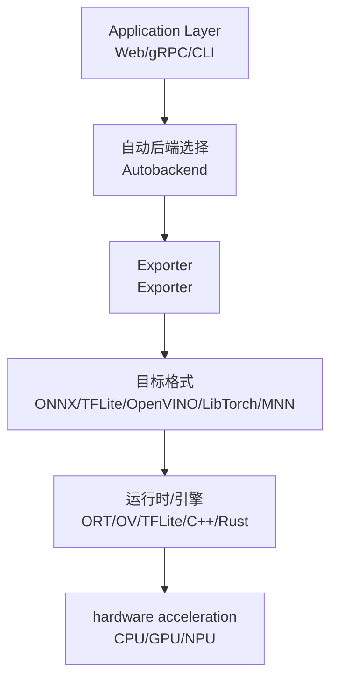

Figure Source
- [engine/exporter.py:1-200](file://ultralytics/engine/exporter.py#L1-200)
- [nn/autobackend.py:1-200](file://ultralytics/nn/autobackend.py#L1-200)

Section Source
- [README.md:1-120](file://README.md#L1-L120)
- [pyproject.toml:1-120](file://pyproject.toml#L1-L120)

## Core Components
- Exporter（Exporter）：统一Encapsulates从PyTorchto多格式的Export流程，Supporting动态形状、Optimization选项and校验。
- 自动后端（Autobackend）：根据可用环境andModel Format选择最优运行时，屏蔽底层差异。
- 工具and脚本：provides边缘端Export、Validation、基准and端to端Examples。

Section Source
- [engine/exporter.py:1-200](file://ultralytics/engine/exporter.py#L1-L200)
- [nn/autobackend.py:1-200](file://ultralytics/nn/autobackend.py#L1-L200)
- [utils/export/__init__.py:1-120](file://ultralytics/utils/export/__init__.py#L1-L120)

## Architecture Overview
下图展示从Training权重to多引擎部署的整体链路，包括Export、运行时加载and服务化。

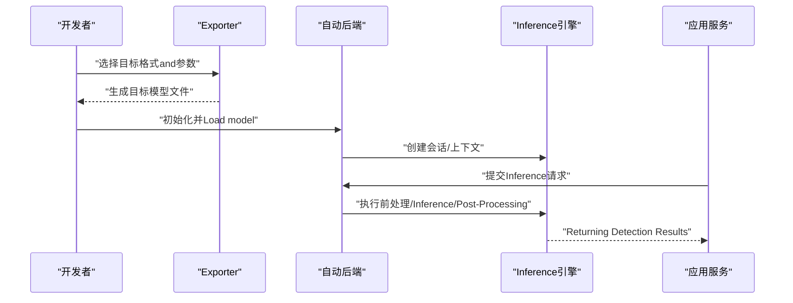

Figure Source
- [engine/exporter.py:1-200](file://ultralytics/engine/exporter.py#L1-L200)
- [nn/autobackend.py:1-200](file://ultralytics/nn/autobackend.py#L1-L200)

## Detailed Component Analysis

### ONNX Runtime 集成（Python/C++/Rust）
- PythonExamples：providesImage Preprocessing、模型加载、InferenceandVisualization全流程。
- C++Examples：基于ONNX Runtime C APIimplementing零拷贝输入输出and线程安全Calls。
- RustExamples：Via绑定或原生接口CallsONNX Runtime，适合高并发场景。

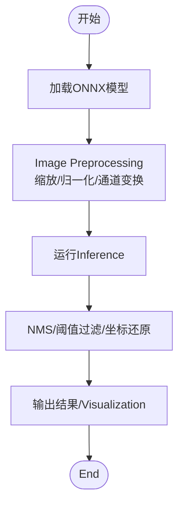

Figure Source
- [examples/YOLOv8-ONNXRuntime/main.py:1-200](file://examples/YOLOv8-ONNXRuntime/main.py#L1-L200)
- [examples/YOLOv8-ONNXRuntime-CPP/inference.h:1-120](file://examples/YOLOv8-ONNXRuntime-CPP/inference.h#L1-L120)
- [examples/YOLOv8-ONNXRuntime-CPP/inference.cpp:1-200](file://examples/YOLOv8-ONNXRuntime-CPP/inference.cpp#L1-L200)
- [examples/YOLO-Series-ONNXRuntime-Rust/src/lib.rs:1-200](file://examples/YOLO-Series-ONNXRuntime-Rust/src/lib.rs#L1-L200)
- [examples/YOLOv8-ONNXRuntime-Rust/src/lib.rs:1-200](file://examples/YOLOv8-ONNXRuntime-Rust/src/lib.rs#L1-L200)

Section Source
- [examples/YOLOv8-ONNXRuntime/main.py:1-200](file://examples/YOLOv8-ONNXRuntime/main.py#L1-L200)
- [examples/YOLOv8-ONNXRuntime-CPP/inference.h:1-120](file://examples/YOLOv8-ONNXRuntime-CPP/inference.h#L1-L120)
- [examples/YOLOv8-ONNXRuntime-CPP/inference.cpp:1-200](file://examples/YOLOv8-ONNXRuntime-CPP/inference.cpp#L1-L200)
- [examples/YOLO-Series-ONNXRuntime-Rust/src/lib.rs:1-200](file://examples/YOLO-Series-ONNXRuntime-Rust/src/lib.rs#L1-L200)
- [examples/YOLOv8-ONNXRuntime-Rust/src/lib.rs:1-200](file://examples/YOLOv8-ONNXRuntime-Rust/src/lib.rs#L1-L200)

### OpenVINO 集成（C++/Python）
- C++Examples：UsesOpenVINO C++ API进行模型加载、编译andInference，Supporting多线程andDevice Selection。
- PythonExamples：CombiningOpenVINO Python API完成端to端检测流程。

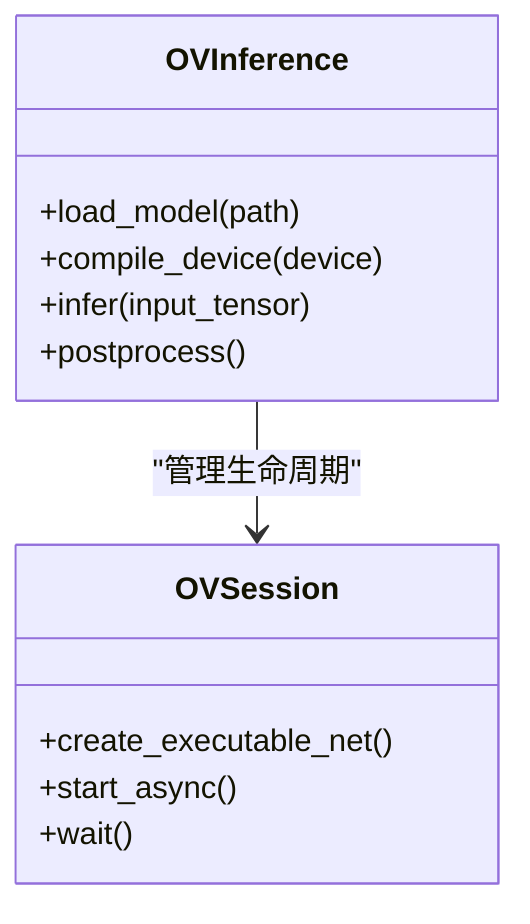

Figure Source
- [examples/YOLOv8-OpenVINO-CPP-Inference/inference.h:1-120](file://examples/YOLOv8-OpenVINO-CPP-Inference/inference.h#L1-L120)
- [examples/YOLOv8-OpenVINO-CPP-Inference/inference.cc:1-200](file://examples/YOLOv8-OpenVINO-CPP-Inference/inference.cc#L1-L200)

Section Source
- [examples/YOLOv8-OpenVINO-CPP-Inference/inference.h:1-120](file://examples/YOLOv8-OpenVINO-CPP-Inference/inference.h#L1-L120)
- [examples/YOLOv8-OpenVINO-CPP-Inference/inference.cc:1-200](file://examples/YOLOv8-OpenVINO-CPP-Inference/inference.cc#L1-L200)

### TensorFlow Lite 集成（Python）
- PythonExamples：将Model ExportforTFLite并UsesInterpreter进行Inference，适合移动端and嵌入式部署。

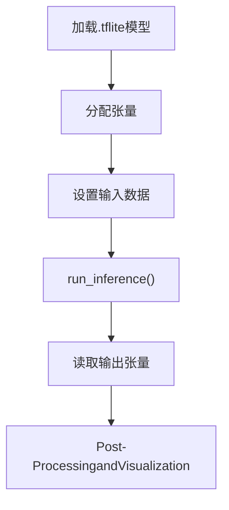

Figure Source
- [examples/YOLOv8-TFLite-Python/main.py:1-200](file://examples/YOLOv8-TFLite-Python/main.py#L1-L200)

Section Source
- [examples/YOLOv8-TFLite-Python/main.py:1-200](file://examples/YOLOv8-TFLite-Python/main.py#L1-L200)

### Triton Inference Server 集成（C++客户端）
- C++客户端Examples：ViagRPC/HTTPandTriton交互，Supporting批处理and异步Calls。

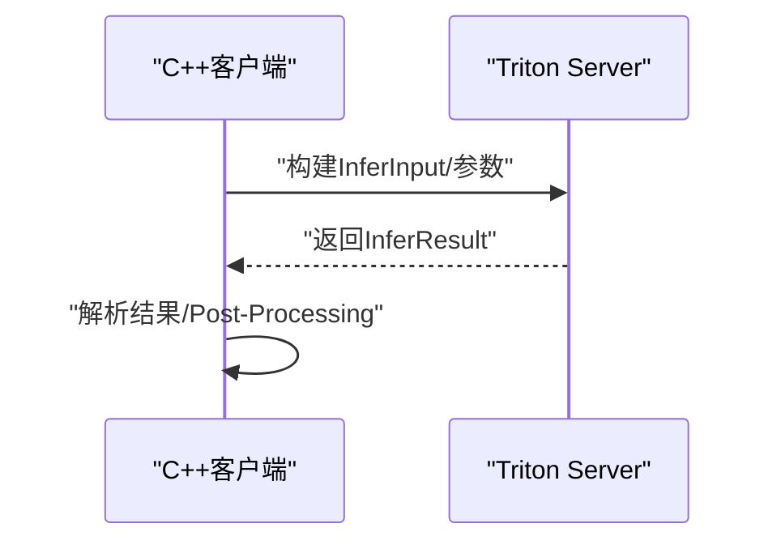

Figure Source
- [examples/YOLO11-Triton-CPP/inference.hpp:1-120](file://examples/YOLO11-Triton-CPP/inference.hpp#L1-L120)
- [examples/YOLO11-Triton-CPP/inference.cpp:1-200](file://examples/YOLO11-Triton-CPP/inference.cpp#L1-L200)
- [examples/YOLO11-Triton-CPP/main.cpp:1-120](file://examples/YOLO11-Triton-CPP/main.cpp#L1-L120)

Section Source
- [examples/YOLO11-Triton-CPP/inference.hpp:1-120](file://examples/YOLO11-Triton-CPP/inference.hpp#L1-L120)
- [examples/YOLO11-Triton-CPP/inference.cpp:1-200](file://examples/YOLO11-Triton-CPP/inference.cpp#L1-L200)
- [examples/YOLO11-Triton-CPP/main.cpp:1-120](file://examples/YOLO11-Triton-CPP/main.cpp#L1-L120)

### 跨平台Edge Deployment（C++/Python）
- 跨平台Examples：providesC++主程序andPython辅助脚本，适配多种边缘设备。
- 边缘工具：Export边缘模型、Validation输出一致性、自动化脚本。

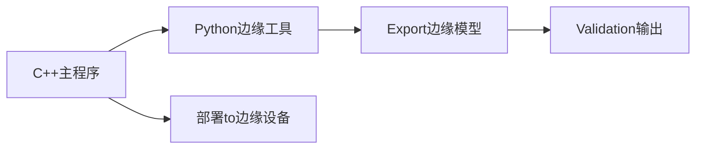

Figure Source
- [examples/YOLO-Master-Cross-Platform-Edge-Deployment/cpp/main.cpp:1-200](file://examples/YOLO-Master-Cross-Platform-Edge-Deployment/cpp/main.cpp#L1-L200)
- [examples/YOLO-Master-Edge-Deployment/edge_utils.py:1-200](file://examples/YOLO-Master-Edge-Deployment/edge_utils.py#L1-L200)
- [examples/YOLO-Master-Edge-Deployment/export_edge_models.py:1-200](file://examples/YOLO-Master-Edge-Deployment/export_edge_models.py#L1-L200)

Section Source
- [examples/YOLO-Master-Cross-Platform-Edge-Deployment/cpp/main.cpp:1-200](file://examples/YOLO-Master-Cross-Platform-Edge-Deployment/cpp/main.cpp#L1-L200)
- [examples/YOLO-Master-Edge-Deployment/edge_utils.py:1-200](file://examples/YOLO-Master-Edge-Deployment/edge_utils.py#L1-L200)
- [examples/YOLO-Master-Edge-Deployment/export_edge_models.py:1-200](file://examples/YOLO-Master-Edge-Deployment/export_edge_models.py#L1-L200)

### Web 服务化（REST API）
- Flask/FastAPI/Django：可将YOLOInferenceEncapsulatesforREST服务，Supporting图片上传、JSON结果返回and错误码规范。
- 建议模式：单例模型加载 + 线程池/进程池 + 限流and超时控制。

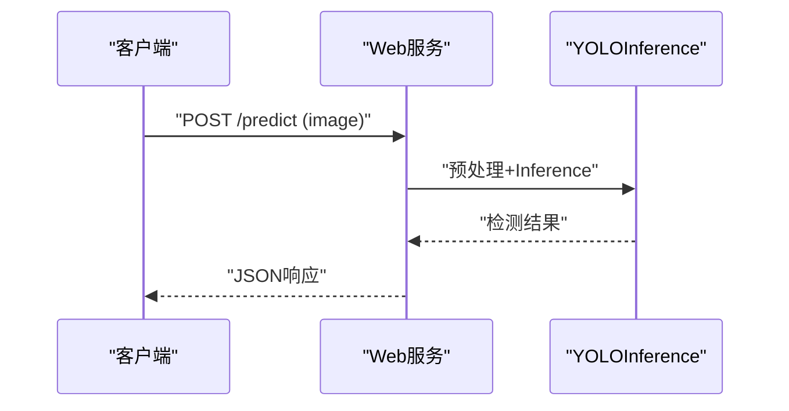

[此图for概念性流程图，不直接映射具体源码文件]

### gRPC 微服务架构
- 定义.proto接口，服务端implementingInference逻辑，客户端Centered ongRPCCalls，Supporting双向流and批处理。
- 可Combining连接池、重试and熔断策略提升稳定性。

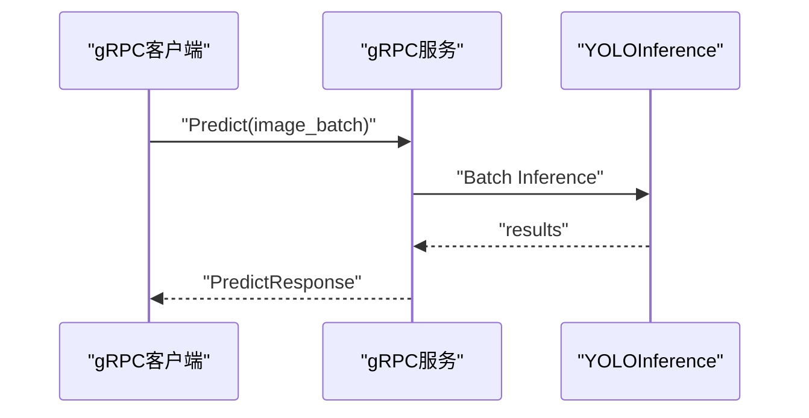

[此图for概念性流程图，不直接映射具体源码文件]

### 高级特性：异步Inference、批量处理and连接池
- 异步Inference：whileC++/Rust中利用引擎provides的异步API，避免阻塞；whilePython中Usesasyncioand线程池。
- 批量处理：合并小批次请求，提高吞吐；注意内存峰值and延迟权衡。
- 连接池：对Triton/远程服务建立持久连接，减少握手开销。

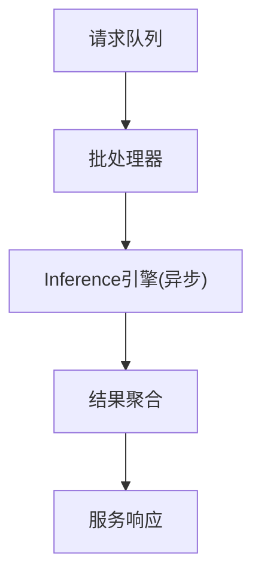

[此图for概念性流程图，不直接映射具体源码文件]

## Dependency Analysis
- Exporterand自动后端是核心耦合点：Exporter负责生成多格式模型，自动后端负责运行时选择and加载。
- Examples工程依赖各自引擎的SDKand头文件，需确保版本一致and环境正确。

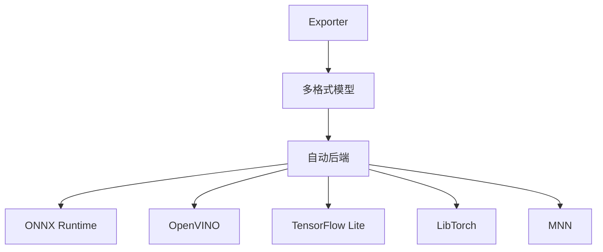

Figure Source
- [engine/exporter.py:1-200](file://ultralytics/engine/exporter.py#L1-L200)
- [nn/autobackend.py:1-200](file://ultralytics/nn/autobackend.py#L1-L200)

Section Source
- [engine/exporter.py:1-200](file://ultralytics/engine/exporter.py#L1-L200)
- [nn/autobackend.py:1-200](file://ultralytics/nn/autobackend.py#L1-L200)

## Performance Considerations
- 模型Optimization：启用INT8/FP16量化、算子融合、静态形状（such as适用）。
- 运行时调优：Set appropriately线程数、内存池大小、设备亲和性。
- 流水线并行：前Post-ProcessingandInference重叠，降低端to端延迟。
- 监控and基准：UsesBuilt-inBenchmark Suiteand自定义Metrics持续Evaluation。

Section Source
- [benchmarks/suite.py:1-200](file://benchmarks/suite.py#L1-L200)
- [benchmarks/run.py:1-200](file://benchmarks/run.py#L1-L200)

## Troubleshooting Guide
- 常见问题：Model Format不匹配、动态形状未配置、设备不可用、依赖缺失。
- 诊断步骤：检查ExportLogging、Validation模型元信息、最小化复现用例、对比Refer to输出。
- 回归测试：Uses端to端脚本and单元测试保障变更质量。

Section Source
- [scripts/smoke_test_coco2017.py:1-200](file://scripts/smoke_test_coco2017.py#L1-L200)
- [tests/test_autobackend_warmup.py:1-200](file://tests/test_autobackend_warmup.py#L1-L200)
- [tests/test_integrations.py:1-200](file://tests/test_integrations.py#L1-L200)

## Conclusion
through a unifiedExporterand自动后端，YOLO-Master能够高效对接多种Inference引擎and高性能语言。CombiningExamples工程and最佳实践，可while生产环境中implementing低延迟、高吞吐、易维护的视觉Inference服务。

## Appendix
- 更多Examples and Tutorials：
  - [examples/YOLOv8-OpenCV-ONNX-Python/main.py](file://examples/YOLOv8-OpenCV-ONNX-Python/main.py)
  - [examples/YOLOv8-SAHI-Inference-Video/yolov8_sahi.py](file://examples/YOLOv8-SAHI-Inference-Video/yolov8_sahi.py)
  - [examples/YOLOv8-Segmentation-ONNXRuntime-Python/main.py](file://examples/YOLOv8-Segmentation-ONNXRuntime-Python/main.py)
  - [examples/YOLO-Axelera-Python/yolo11-seg.py](file://examples/YOLO-Axelera-Python/yolo11-seg.py)
  - [examples/YOLO-Master-EsMoE-VisDrone-Edge/python/infer.py](file://examples/YOLO-Master-EsMoE-VisDrone-Edge/python/infer.py)
  - [examples/YOLO-Master-EsMoE-VisDrone-Edge/scripts/run_export.sh](file://examples/YOLO-Master-EsMoE-VisDrone-Edge/scripts/run_export.sh)
  - [examples/YOLO-Master-EsMoE-VisDrone-Edge/configs/esmoe.yaml](file://examples/YOLO-Master-EsMoE-VisDrone-Edge/configs/esmoe.yaml)
  - [examples/YOLOv8-Region-Counter/yolov8_region_counter.py](file://examples/YOLOv8-Region-Counter/yolov8_region_counter.py)
  - [examples/object_counting.ipynb](file://examples/object_counting.ipynb)
  - [examples/tutorial.ipynb](file://examples/tutorial.ipynb)
- 其他后端Examples：
  - [examples/YOLOv8-LibTorch-CPP-Inference/main.cc](file://examples/YOLOv8-LibTorch-CPP-Inference/main.cc)
  - [examples/YOLOv8-MNN-CPP/main.cpp](file://examples/YOLOv8-MNN-CPP/main.cpp)