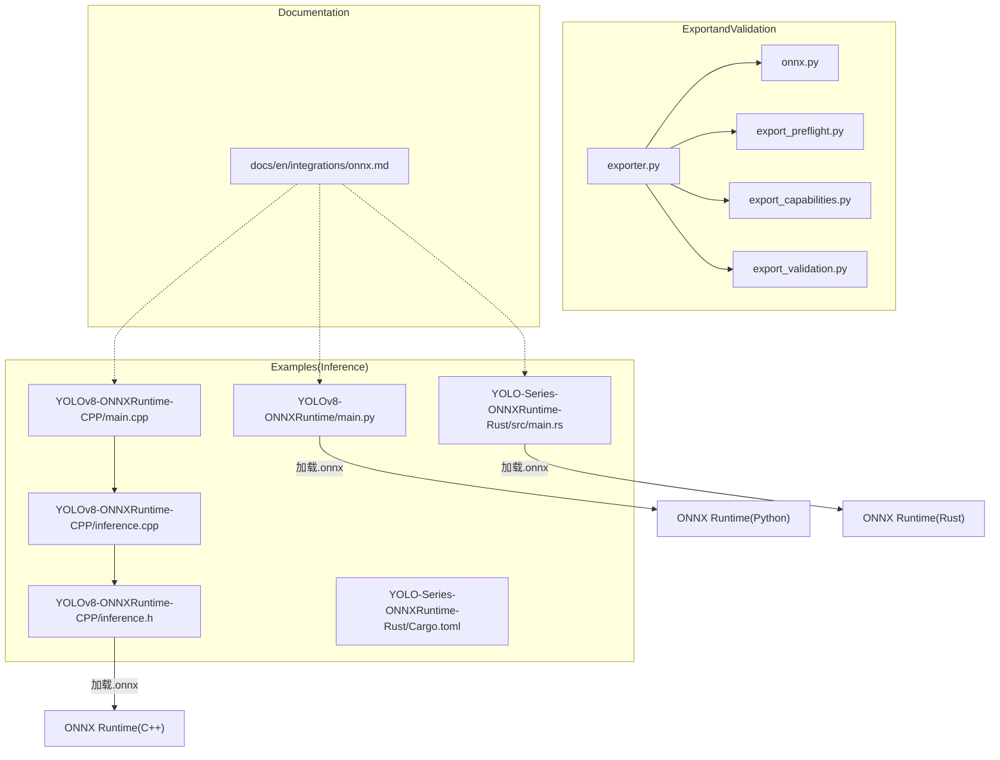
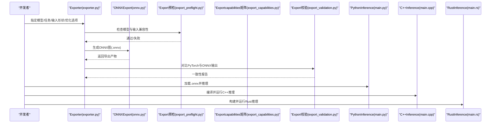
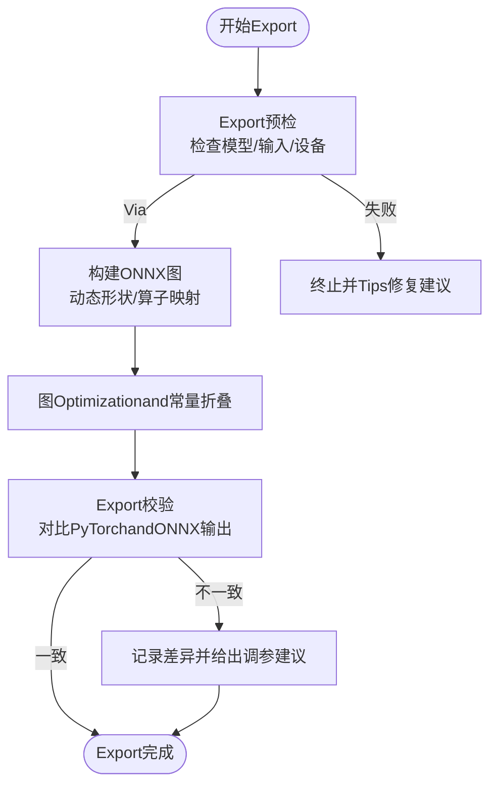
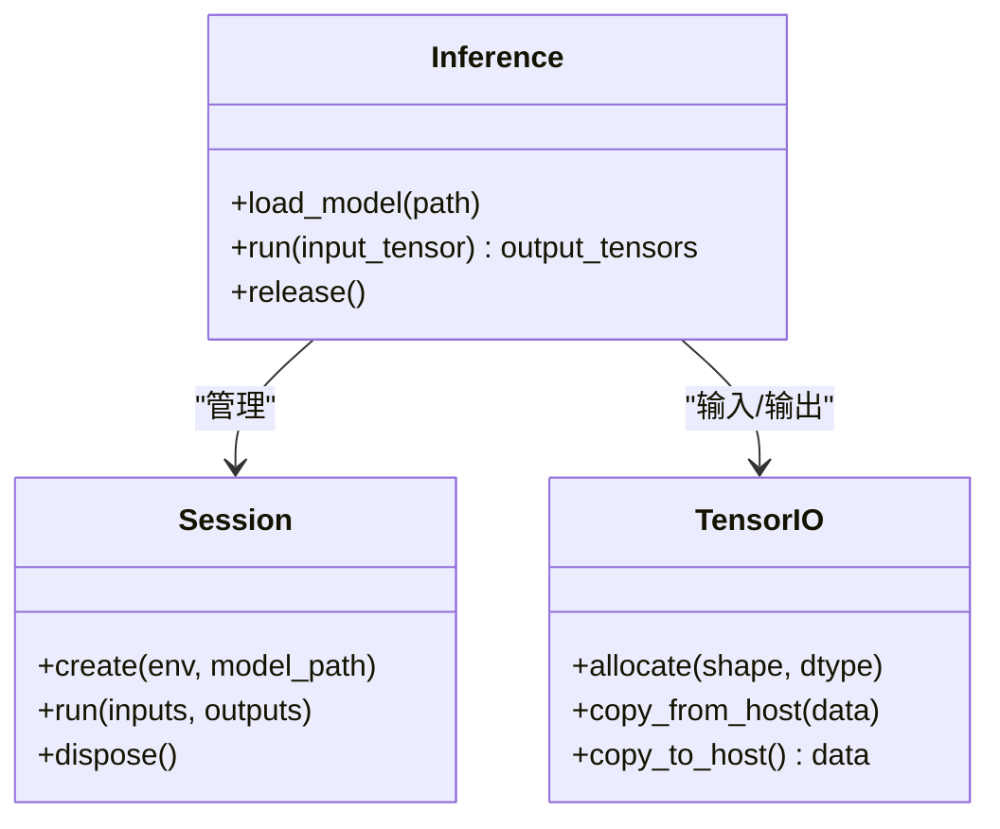
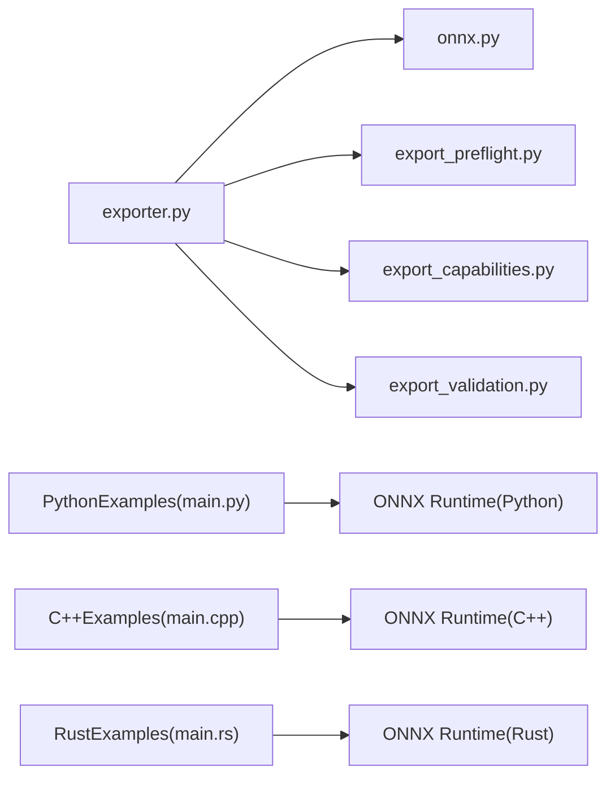

# ONNX Runtime集成

<cite>
**Files Referenced in This Document**
- [examples/YOLOv8-ONNXRuntime/main.py](file://examples/YOLOv8-ONNXRuntime/main.py)
- [examples/YOLOv8-ONNXRuntime/README.md](file://examples/YOLOv8-ONNXRuntime/README.md)
- [examples/YOLOv8-ONNXRuntime-CPP/inference.cpp](file://examples/YOLOv8-ONNXRuntime-CPP/inference.cpp)
- [examples/YOLOv8-ONNXRuntime-CPP/inference.h](file://examples/YOLOv8-ONNXRuntime-CPP/inference.h)
- [examples/YOLOv8-ONNXRuntime-CPP/main.cpp](file://examples/YOLOv8-ONNXRuntime-CPP/main.cpp)
- [examples/YOLO-Series-ONNXRuntime-Rust/src/main.rs](file://examples/YOLO-Series-ONNXRuntime-Rust/src/main.rs)
- [examples/YOLO-Series-ONNXRuntime-Rust/Cargo.toml](file://examples/YOLO-Series-ONNXRuntime-Rust/Cargo.toml)
- [examples/YOLO-Series-ONNXRuntime-Rust/README.md](file://examples/YOLO-Series-ONNXRuntime-Rust/README.md)
- [ultralytics/engine/exporter.py](file://ultralytics/engine/exporter.py)
- [ultralytics/utils/export/__init__.py](file://ultralytics/utils/export/__init__.py)
- [ultralytics/utils/export/onnx.py](file://ultralytics/utils/export/onnx.py)
- [ultralytics/utils/export_capabilities.py](file://ultralytics/utils/export_capabilities.py)
- [ultralytics/utils/export_preflight.py](file://ultralytics/utils/export_preflight.py)
- [ultralytics/utils/export_validation.py](file://ultralytics/utils/export_validation.py)
- [tests/test_onnx_export_fix.py](file://tests/test_onnx_export_fix.py)
- [tests/test_exports.py](file://tests/test_exports.py)
- [docs/en/integrations/onnx.md](file://docs/en/integrations/onnx.md)
</cite>

## Table of Contents
1. [Introduction](#Introduction)
2. [Project Structure](#Project Structure)
3. [Core Components](#Core Components)
4. [Architecture Overview](#Architecture Overview)
5. [Detailed Component Analysis](#Detailed Component Analysis)
6. [Dependency Analysis](#Dependency Analysis)
7. [Performance Considerations](#Performance Considerations)
8. [Troubleshooting Guide](#Troubleshooting Guide)
9. [Conclusion](#Conclusion)
10. [Appendix](#Appendix)

## Introduction
本文件targeting希望将YOLO-Master模型从PyTorchExporting toONNX，并whilePython、C++andRust环境中UsesONNX Runtime进行高效Inference的开发者。Documentation覆盖：
- Model Export流程and参数配置（动态形状、算子Supporting、Optimization选项）
- Python、C++、Rust三语言完整集成Examples路径
- 批处理、内存管理and多线程Inferenceetc.性能调优技巧
- 错误处理and异常恢复机制
- 生产环境部署最佳实践

## Project Structure
本项目while多个位置providesONNX相关capabilities：
- ExportandValidation：引擎Exporter、Export预检andExportcapabilities矩阵、Export校验脚本
- Examples代码：Python、C++、Rust三种语言的ONNX RuntimeInferenceExamples
- Documentation：ONNX集成说明and用法指引

Figure Source
- [ultralytics/engine/exporter.py](file://ultralytics/engine/exporter.py)
- [ultralytics/utils/export/onnx.py](file://ultralytics/utils/export/onnx.py)
- [ultralytics/utils/export_preflight.py](file://ultralytics/utils/export_preflight.py)
- [ultralytics/utils/export_capabilities.py](file://ultralytics/utils/export_capabilities.py)
- [ultralytics/utils/export_validation.py](file://ultralytics/utils/export_validation.py)
- [examples/YOLOv8-ONNXRuntime/main.py](file://examples/YOLOv8-ONNXRuntime/main.py)
- [examples/YOLOv8-ONNXRuntime-CPP/inference.h](file://examples/YOLOv8-ONNXRuntime-CPP/inference.h)
- [examples/YOLOv8-ONNXRuntime-CPP/inference.cpp](file://examples/YOLOv8-ONNXRuntime-CPP/inference.cpp)
- [examples/YOLOv8-ONNXRuntime-CPP/main.cpp](file://examples/YOLOv8-ONNXRuntime-CPP/main.cpp)
- [examples/YOLO-Series-ONNXRuntime-Rust/src/main.rs](file://examples/YOLO-Series-ONNXRuntime-Rust/src/main.rs)
- [examples/YOLO-Series-ONNXRuntime-Rust/Cargo.toml](file://examples/YOLO-Series-ONNXRuntime-Rust/Cargo.toml)
- [docs/en/integrations/onnx.md](file://docs/en/integrations/onnx.md)

Section Source
- [docs/en/integrations/onnx.md](file://docs/en/integrations/onnx.md)

## Core Components
- ExporterandONNX后端
  - 统一Export入口负责编排Export流程、Device Selection、动态形状andOptimization策略
  - ONNX专用ExportModulesimplementing具体Export逻辑、算子映射and图Optimization
  - Export前检查确保模型结构and输入规格满足目标运行时要求
  - Exportcapabilities矩阵用于Evaluation不同Tasks/模型对ONNX的Supporting度
  - Export后校验用于对比PyTorchandONNX输出一致性
- InferenceExamples
  - PythonExamples展示such as何加载.onnx并Executing Inference
  - C++ExamplesEncapsulates会话管理、张量I/Oand结果解析
  - RustExamplesVia绑定库CallsONNX Runtime完成Inference

Section Source
- [ultralytics/engine/exporter.py](file://ultralytics/engine/exporter.py)
- [ultralytics/utils/export/onnx.py](file://ultralytics/utils/export/onnx.py)
- [ultralytics/utils/export_preflight.py](file://ultralytics/utils/export_preflight.py)
- [ultralytics/utils/export_capabilities.py](file://ultralytics/utils/export_capabilities.py)
- [ultralytics/utils/export_validation.py](file://ultralytics/utils/export_validation.py)
- [examples/YOLOv8-ONNXRuntime/main.py](file://examples/YOLOv8-ONNXRuntime/main.py)
- [examples/YOLOv8-ONNXRuntime-CPP/inference.h](file://examples/YOLOv8-ONNXRuntime-CPP/inference.h)
- [examples/YOLOv8-ONNXRuntime-CPP/inference.cpp](file://examples/YOLOv8-ONNXRuntime-CPP/inference.cpp)
- [examples/YOLOv8-ONNXRuntime-CPP/main.cpp](file://examples/YOLOv8-ONNXRuntime-CPP/main.cpp)
- [examples/YOLO-Series-ONNXRuntime-Rust/src/main.rs](file://examples/YOLO-Series-ONNXRuntime-Rust/src/main.rs)
- [examples/YOLO-Series-ONNXRuntime-Rust/Cargo.toml](file://examples/YOLO-Series-ONNXRuntime-Rust/Cargo.toml)

## Architecture Overview
下图展示了从Training好的PyTorch模型toONNX RuntimeInference的整体流程，包括Export、校验and多语言Inference。

Figure Source
- [ultralytics/engine/exporter.py](file://ultralytics/engine/exporter.py)
- [ultralytics/utils/export/onnx.py](file://ultralytics/utils/export/onnx.py)
- [ultralytics/utils/export_preflight.py](file://ultralytics/utils/export_preflight.py)
- [ultralytics/utils/export_capabilities.py](file://ultralytics/utils/export_capabilities.py)
- [ultralytics/utils/export_validation.py](file://ultralytics/utils/export_validation.py)
- [examples/YOLOv8-ONNXRuntime/main.py](file://examples/YOLOv8-ONNXRuntime/main.py)
- [examples/YOLOv8-ONNXRuntime-CPP/main.cpp](file://examples/YOLOv8-ONNXRuntime-CPP/main.cpp)
- [examples/YOLO-Series-ONNXRuntime-Rust/src/main.rs](file://examples/YOLO-Series-ONNXRuntime-Rust/src/main.rs)

## Detailed Component Analysis

### ExporterandONNX后端
- 职责划分
  - exporter.py：统一Export入口，协调设备、形状、OptimizationandLogging
  - onnx.py：ONNXExportimplementing，包含动态形状、算子映射、常量折叠and图Optimization
  - export_preflight.py：Export前检查，避免不兼容配置导致失败
  - export_capabilities.py：维护不同Tasks/模型对ONNX的Supporting情况
  - export_validation.py：Export后一致性校验，比较数值误差and形状
- 关键流程
  - 预检：确认模型结构、输入维度、数据类型and目标运行时兼容性
  - Export：生成静态或动态形状的ONNX图，应用Optimization（such as常量折叠、算子融合）
  - 校验：Centered on相同输入对比PyTorchandONNX输出，记录差异and警告
- 典型问题定位
  - 若Export Failure，优先查看预检阶段报错andcapabilities矩阵中是否Supporting该Tasks/模型
  - 若Inference精度下降，检查Export后的校验报告and动态形状设置

Figure Source
- [ultralytics/utils/export_preflight.py](file://ultralytics/utils/export_preflight.py)
- [ultralytics/utils/export/onnx.py](file://ultralytics/utils/export/onnx.py)
- [ultralytics/utils/export_validation.py](file://ultralytics/utils/export_validation.py)
- [ultralytics/utils/export_capabilities.py](file://ultralytics/utils/export_capabilities.py)

Section Source
- [ultralytics/engine/exporter.py](file://ultralytics/engine/exporter.py)
- [ultralytics/utils/export/onnx.py](file://ultralytics/utils/export/onnx.py)
- [ultralytics/utils/export_preflight.py](file://ultralytics/utils/export_preflight.py)
- [ultralytics/utils/export_capabilities.py](file://ultralytics/utils/export_capabilities.py)
- [ultralytics/utils/export_validation.py](file://ultralytics/utils/export_validation.py)

### Python集成Examples
- 功能要点
  - 加载.onnx模型文件
  - 准备输入数据（尺寸、归一化、数据类型）
  - 创建ONNX Runtime会话并Executing Inference
  - 解析输出（边界框、类别、置信度etc.）
- Refer to路径
  - Examples入口：[examples/YOLOv8-ONNXRuntime/main.py](file://examples/YOLOv8-ONNXRuntime/main.py)
  - Uses说明：[examples/YOLOv8-ONNXRuntime/README.md](file://examples/YOLOv8-ONNXRuntime/README.md)

Section Source
- [examples/YOLOv8-ONNXRuntime/main.py](file://examples/YOLOv8-ONNXRuntime/main.py)
- [examples/YOLOv8-ONNXRuntime/README.md](file://examples/YOLOv8-ONNXRuntime/README.md)

### C++集成Examples
- 功能要点
  - EncapsulatesONNX Runtime会话生命周期管理
  - 输入/输出张量的分配and拷贝
  - 线程安全and资源释放
- Refer to路径
  - 头文件：[examples/YOLOv8-ONNXRuntime-CPP/inference.h](file://examples/YOLOv8-ONNXRuntime-CPP/inference.h)
  - implementing文件：[examples/YOLOv8-ONNXRuntime-CPP/inference.cpp](file://examples/YOLOv8-ONNXRuntime-CPP/inference.cpp)
  - 主程序：[examples/YOLOv8-ONNXRuntime-CPP/main.cpp](file://examples/YOLOv8-ONNXRuntime-CPP/main.cpp)

Figure Source
- [examples/YOLOv8-ONNXRuntime-CPP/inference.h](file://examples/YOLOv8-ONNXRuntime-CPP/inference.h)
- [examples/YOLOv8-ONNXRuntime-CPP/inference.cpp](file://examples/YOLOv8-ONNXRuntime-CPP/inference.cpp)
- [examples/YOLOv8-ONNXRuntime-CPP/main.cpp](file://examples/YOLOv8-ONNXRuntime-CPP/main.cpp)

Section Source
- [examples/YOLOv8-ONNXRuntime-CPP/inference.h](file://examples/YOLOv8-ONNXRuntime-CPP/inference.h)
- [examples/YOLOv8-ONNXRuntime-CPP/inference.cpp](file://examples/YOLOv8-ONNXRuntime-CPP/inference.cpp)
- [examples/YOLOv8-ONNXRuntime-CPP/main.cpp](file://examples/YOLOv8-ONNXRuntime-CPP/main.cpp)

### Rust集成Examples
- 功能要点
  - Via绑定库CallsONNX Runtime
  - 管理模型加载、会话and张量I/O
  - 错误类型and异常恢复
- Refer to路径
  - 源码：[examples/YOLO-Series-ONNXRuntime-Rust/src/main.rs](file://examples/YOLO-Series-ONNXRuntime-Rust/src/main.rs)
  - 依赖配置：[examples/YOLO-Series-ONNXRuntime-Rust/Cargo.toml](file://examples/YOLO-Series-ONNXRuntime-Rust/Cargo.toml)
  - Uses说明：[examples/YOLO-Series-ONNXRuntime-Rust/README.md](file://examples/YOLO-Series-ONNXRuntime-Rust/README.md)

Section Source
- [examples/YOLO-Series-ONNXRuntime-Rust/src/main.rs](file://examples/YOLO-Series-ONNXRuntime-Rust/src/main.rs)
- [examples/YOLO-Series-ONNXRuntime-Rust/Cargo.toml](file://examples/YOLO-Series-ONNXRuntime-Rust/Cargo.toml)
- [examples/YOLO-Series-ONNXRuntime-Rust/README.md](file://examples/YOLO-Series-ONNXRuntime-Rust/README.md)

## Dependency Analysis
- Export链路
  - exporter.py 依赖 onnx.py、export_preflight.py、export_capabilities.py、export_validation.py
- Inference链路
  - Python/C++/RustExamples均依赖各自平台的ONNX Runtime库
- External Dependencies
  - ONNX Runtime（Python/C++/Rust绑定）
  - NumPy/OpenCV（Data processing）
  - 平台特定加速后端（Optional）

Figure Source
- [ultralytics/engine/exporter.py](file://ultralytics/engine/exporter.py)
- [ultralytics/utils/export/onnx.py](file://ultralytics/utils/export/onnx.py)
- [ultralytics/utils/export_preflight.py](file://ultralytics/utils/export_preflight.py)
- [ultralytics/utils/export_capabilities.py](file://ultralytics/utils/export_capabilities.py)
- [ultralytics/utils/export_validation.py](file://ultralytics/utils/export_validation.py)
- [examples/YOLOv8-ONNXRuntime/main.py](file://examples/YOLOv8-ONNXRuntime/main.py)
- [examples/YOLOv8-ONNXRuntime-CPP/main.cpp](file://examples/YOLOv8-ONNXRuntime-CPP/main.cpp)
- [examples/YOLO-Series-ONNXRuntime-Rust/src/main.rs](file://examples/YOLO-Series-ONNXRuntime-Rust/src/main.rs)

Section Source
- [ultralytics/engine/exporter.py](file://ultralytics/engine/exporter.py)
- [ultralytics/utils/export/onnx.py](file://ultralytics/utils/export/onnx.py)
- [ultralytics/utils/export_preflight.py](file://ultralytics/utils/export_preflight.py)
- [ultralytics/utils/export_capabilities.py](file://ultralytics/utils/export_capabilities.py)
- [ultralytics/utils/export_validation.py](file://ultralytics/utils/export_validation.py)
- [examples/YOLOv8-ONNXRuntime/main.py](file://examples/YOLOv8-ONNXRuntime/main.py)
- [examples/YOLOv8-ONNXRuntime-CPP/main.cpp](file://examples/YOLOv8-ONNXRuntime-CPP/main.cpp)
- [examples/YOLO-Series-ONNXRuntime-Rust/src/main.rs](file://examples/YOLO-Series-ONNXRuntime-Rust/src/main.rs)

## Performance Considerations
- 批处理
  - Uses固定或分段的批量大小，减少会话创建and图编译开销
  - 注意动态形状场景下的内存峰值and缓存命中率
- 内存管理
  - 复用输入/输出缓冲区，避免频繁分配and拷贝
  - 控制中间张量生命周期，and时释放不再Uses的资源
- 多线程Inference
  - 每个线程持有独立会话或Uses线程安全的会话池
  - Set appropriately线程数，避免CPU/GPU争用导致抖动
- 图Optimization
  - 启用常量折叠、算子融合etc.Optimization选项（由ExporterandONNX后端provides）
  - 针对目标平台选择合适的Optimization级别and后端（such asCPU/GPU/NPU）
- 精度and速度权衡
  - 动态形状提升灵活性但可能影响性能；静态形状可进一步提升吞吐
  - Export校验报告用于Evaluation精度损失是否while可接受范围

[本节for通用指导，无需列出具体文件来源]

## Troubleshooting Guide
- Export Failure
  - 检查Export预检阶段的错误信息，确认模型结构and输入形状是否符合目标运行时要求
  - 查看Exportcapabilities矩阵，确认当前Tasks/模型是否被ONNXSupporting
- Inference精度异常
  - UsesExport校验工具对比PyTorchandONNX输出，关注最大误差and分布差异
  - 调整Export参数（such as动态形状、Optimization级别）并重试
- 运行时崩溃或内存泄漏
  - 确保会话and张量资源正确释放
  - whileC++/Rust中检查异常捕获and错误码处理路径
- Reference Test Cases
  - ONNXExport修复and回归测试：[tests/test_onnx_export_fix.py](file://tests/test_onnx_export_fix.py)
  - 通用ExportTest Suite：[tests/test_exports.py](file://tests/test_exports.py)

Section Source
- [tests/test_onnx_export_fix.py](file://tests/test_onnx_export_fix.py)
- [tests/test_exports.py](file://tests/test_exports.py)

## Conclusion
Via将YOLO-MasterModel ExportforONNX并UsesONNX Runtimewhile多语言环境中Inference，可Centered onWhile maintaining精度显著提升部署效率。建议while生产环境中：
- UsesExport预检andcapabilities矩阵规避不兼容配置
- 利用Export校验保障精度一致性
- Combining批处理、内存复用and多线程策略Optimization吞吐
- 建立完善的错误处理and监控机制，确保稳定性

[本节for总结性内容，无需列出具体文件来源]

## Appendix
- Quick Start
  - PythonExamplesand说明：[examples/YOLOv8-ONNXRuntime/README.md](file://examples/YOLOv8-ONNXRuntime/README.md)、[examples/YOLOv8-ONNXRuntime/main.py](file://examples/YOLOv8-ONNXRuntime/main.py)
  - C++Examplesand说明：[examples/YOLOv8-ONNXRuntime-CPP/README.md](file://examples/YOLOv8-ONNXRuntime-CPP/README.md)
  - RustExamplesand说明：[examples/YOLO-Series-ONNXRuntime-Rust/README.md](file://examples/YOLO-Series-ONNXRuntime-Rust/README.md)、[examples/YOLO-Series-ONNXRuntime-Rust/Cargo.toml](file://examples/YOLO-Series-ONNXRuntime-Rust/Cargo.toml)
- 官方Documentation
  - ONNX集成指南：[docs/en/integrations/onnx.md](file://docs/en/integrations/onnx.md)

Section Source
- [examples/YOLOv8-ONNXRuntime/README.md](file://examples/YOLOv8-ONNXRuntime/README.md)
- [examples/YOLOv8-ONNXRuntime/main.py](file://examples/YOLOv8-ONNXRuntime/main.py)
- [examples/YOLO-Series-ONNXRuntime-Rust/README.md](file://examples/YOLO-Series-ONNXRuntime-Rust/README.md)
- [examples/YOLO-Series-ONNXRuntime-Rust/Cargo.toml](file://examples/YOLO-Series-ONNXRuntime-Rust/Cargo.toml)
- [docs/en/integrations/onnx.md](file://docs/en/integrations/onnx.md)