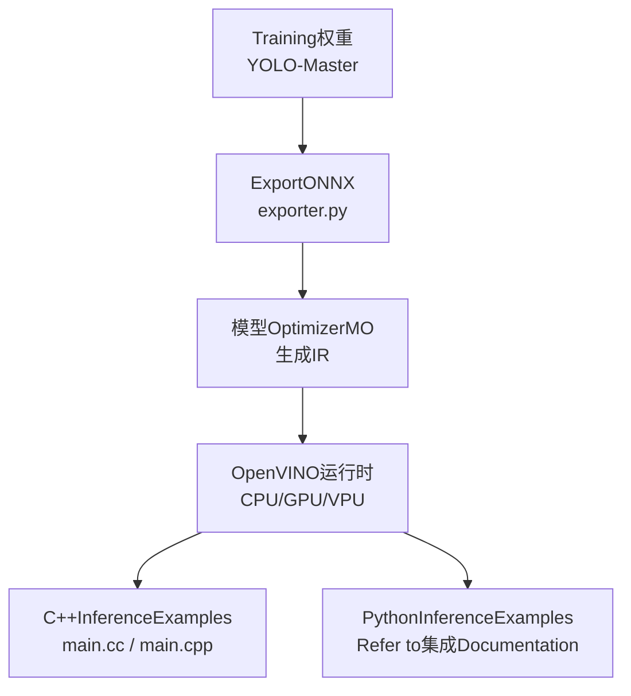
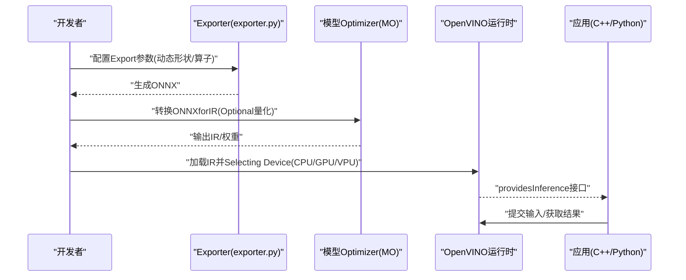
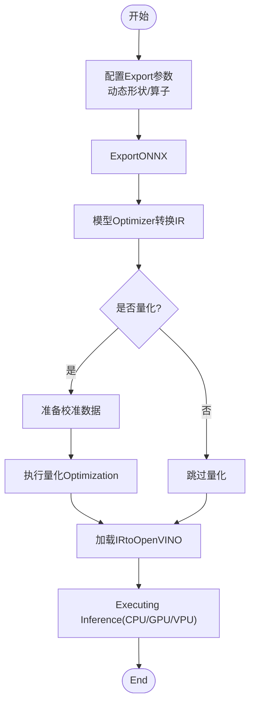
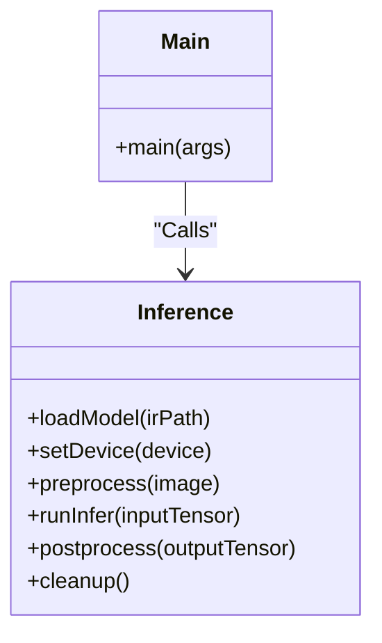
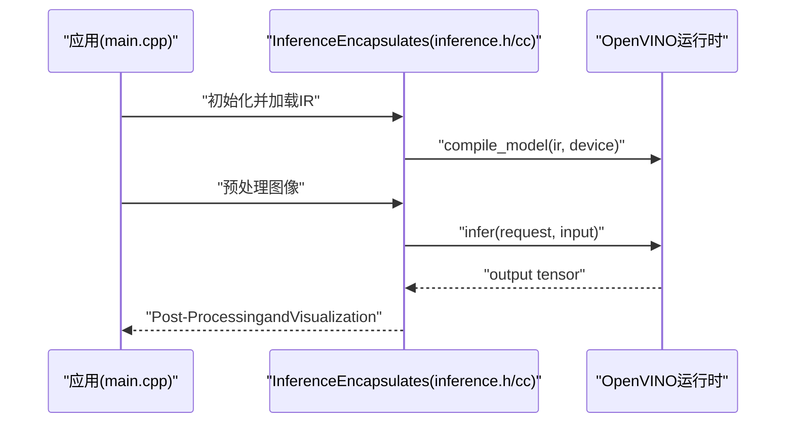
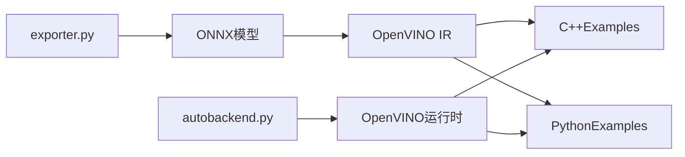

# OpenVINO集成

<cite>
**Files Referenced in This Document**
- [openvino.md](file://docs/en/integrations/openvino.md)
- [YOLOv8-OpenVINO-CPP-Inference/main.cc](file://examples/YOLOv8-OpenVINO-CPP-Inference/main.cc)
- [YOLOv8-OpenVINO-CPP-Inference/inference.cc](file://examples/YOLOv8-OpenVINO-CPP-Inference/inference.cc)
- [YOLOv8-OpenVINO-CPP-Inference/inference.h](file://examples/YOLOv8-OpenVINO-CPP-Inference/inference.h)
- [YOLOv8-OpenVINO-CPP-Inference/CMakeLists.txt](file://examples/YOLOv8-OpenVINO-CPP-Inference/CMakeLists.txt)
- [YOLOv8-OpenVINO-CPP-Inference/README.md](file://examples/YOLOv8-OpenVINO-CPP-Inference/README.md)
- [cpp/OpenVINO/main.cpp](file://examples/cpp/OpenVINO/main.cpp)
- [cpp/OpenVINO/inference.cpp](file://examples/cpp/OpenVINO/inference.cpp)
- [cpp/OpenVINO/inference.h](file://examples/cpp/OpenVINO/inference.h)
- [cpp/OpenVINO/CMakeLists.txt](file://examples/cpp/OpenVINO/CMakeLists.txt)
- [cpp/OpenVINO/README.md](file://examples/cpp/OpenVINO/README.md)
- [exporter.py](file://ultralytics/engine/exporter.py)
- [autobackend.py](file://ultralytics/nn/autobackend.py)
- [optimizing-openvino-latency-vs-throughput-modes.md](file://docs/en/guides/optimizing-openvino-latency-vs-throughput-modes.md)
</cite>

## Table of Contents
1. [Introduction](#Introduction)
2. [Project Structure](#Project Structure)
3. [Core Components](#Core Components)
4. [Architecture Overview](#Architecture Overview)
5. [Detailed Component Analysis](#Detailed Component Analysis)
6. [Dependency Analysis](#Dependency Analysis)
7. [性能考量](#性能考量)
8. [Troubleshooting Guide](#Troubleshooting Guide)
9. [Conclusion](#Conclusion)
10. [Appendix](#Appendix)

## Introduction
本文件targeting希望whileYOLO-Master项目中集成Intel OpenVINO的开发者，provides从Model ExporttoIR、量化Optimization、设备适配andInference部署的全流程说明。内容涵盖：
- 将YOLO-MasterModel ExportforONNX并转换forOpenVINO IR（含动态形状Supporting）
- whileCPU、GPU、VPU设备上运行Inference的C++andPythonExamples路径
- 异步Inference、批量处理and动态形状etc.Optimization策略
- Model Compressionand精度控制方法
- Edge Device Deployment注意事项and基准测试建议

## Project Structure
仓库中andOpenVINO相关的DocumentationandExamples主要分布whileCentered on下位置：
- 集成Documentation：docs/en/integrations/openvino.md
- 性能指南：docs/en/guides/optimizing-openvino-latency-vs-throughput-modes.md
- C++Examples（YOLOv8风格）：examples/YOLOv8-OpenVINO-CPP-Inference/*
- C++Examples（通用OpenVINO）：examples/cpp/OpenVINO/*
- Exportand自动后端选择：ultralytics/engine/exporter.py, ultralytics/nn/autobackend.py

Figure Source
- [exporter.py:1-200](file://ultralytics/engine/exporter.py#L1-200)
- [openvino.md:1-200](file://docs/en/integrations/openvino.md#L1-L200)

Section Source
- [openvino.md:1-200](file://docs/en/integrations/openvino.md#L1-L200)
- [optimizing-openvino-latency-vs-throughput-modes.md:1-200](file://docs/en/guides/optimizing-openvino-latency-vs-throughput-modes.md#L1-L200)

## Core Components
- Exporter（exporter.py）：负责将PyTorchModel ExportforONNX，并provides动态输入形状、算子兼容性andExportPost-Processing的配置入口。
- 自动后端（autobackend.py）：根据目标平台and可用库自动选择Inference后端（包含OpenVINO），简化Cross-Platform Deployment。
- OpenVINO集成Documentation（openvino.md）：providesOpenVINO安装、IR转换、Device Selectionand基本Inference流程说明。
- 性能指南（optimizing-openvino-latency-vs-throughput-modes.md）：对比延迟优先and吞吐优先模式，给出参数调优建议。
- C++Examples：
  - examples/YOLOv8-OpenVINO-CPP-Inference/*：基于YOLOv8风格的OpenVINO C++InferenceExamples，包含构建脚本and主程序。
  - examples/cpp/OpenVINO/*：通用OpenVINO C++InferenceExamples，展示加载IR、设置设备、Executing Inference的基本流程。

Section Source
- [exporter.py:1-200](file://ultralytics/engine/exporter.py#L1-L200)
- [autobackend.py:1-200](file://ultralytics/nn/autobackend.py#L1-L200)
- [openvino.md:1-200](file://docs/en/integrations/openvino.md#L1-L200)
- [YOLOv8-OpenVINO-CPP-Inference/README.md:1-200](file://examples/YOLOv8-OpenVINO-CPP-Inference/README.md#L1-L200)
- [cpp/OpenVINO/README.md:1-200](file://examples/cpp/OpenVINO/README.md#L1-L200)

## Architecture Overview
下图展示了从Training权重toOpenVINO IR再to多设备Inference的整体流程，Centered onand关键组件之间的交互关系。

Figure Source
- [exporter.py:1-200](file://ultralytics/engine/exporter.py#L1-L200)
- [openvino.md:1-200](file://docs/en/integrations/openvino.md#L1-L200)

## Detailed Component Analysis

### ExportandIR转换流程
- ONNXExport：ViaExporter配置输入形状（静态或动态）、算子版本andExport选项，确保后续能被OpenVINO正确解析。
- IR生成：Uses模型Optimizer将ONNX转换forOpenVINO IR（.xml/.bin），可开启量化Centered on减小体积and提升速度。
- 设备适配：while运行时指定设备字符串（such as“CPU”、“GPU”、“MYRIAD”），OpenVINO内部完成内核选择and内存布局Optimization。

Figure Source
- [exporter.py:1-200](file://ultralytics/engine/exporter.py#L1-L200)
- [openvino.md:1-200](file://docs/en/integrations/openvino.md#L1-L200)

Section Source
- [exporter.py:1-200](file://ultralytics/engine/exporter.py#L1-L200)
- [openvino.md:1-200](file://docs/en/integrations/openvino.md#L1-L200)

### C++InferenceExamples（YOLOv8风格）
该Examples展示了such as何whileC++中加载OpenVINO IR、预处理图像、Executing InferenceandPost-Processing结果。

Figure Source
- [YOLOv8-OpenVINO-CPP-Inference/inference.h:1-200](file://examples/YOLOv8-OpenVINO-CPP-Inference/inference.h#L1-L200)
- [YOLOv8-OpenVINO-CPP-Inference/inference.cc:1-200](file://examples/YOLOv8-OpenVINO-CPP-Inference/inference.cc#L1-L200)
- [YOLOv8-OpenVINO-CPP-Inference/main.cc:1-200](file://examples/YOLOv8-OpenVINO-CPP-Inference/main.cc#L1-L200)

Section Source
- [YOLOv8-OpenVINO-CPP-Inference/README.md:1-200](file://examples/YOLOv8-OpenVINO-CPP-Inference/README.md#L1-L200)
- [YOLOv8-OpenVINO-CPP-Inference/CMakeLists.txt:1-200](file://examples/YOLOv8-OpenVINO-CPP-Inference/CMakeLists.txt#L1-L200)
- [YOLOv8-OpenVINO-CPP-Inference/inference.h:1-200](file://examples/YOLOv8-OpenVINO-CPP-Inference/inference.h#L1-L200)
- [YOLOv8-OpenVINO-CPP-Inference/inference.cc:1-200](file://examples/YOLOv8-OpenVINO-CPP-Inference/inference.cc#L1-L200)
- [YOLOv8-OpenVINO-CPP-Inference/main.cc:1-200](file://examples/YOLOv8-OpenVINO-CPP-Inference/main.cc#L1-L200)

### C++InferenceExamples（通用OpenVINO）
通用Examples更贴近OpenVINO API原语，适合快速ValidationIR加载and设备切换。

Figure Source
- [cpp/OpenVINO/main.cpp:1-200](file://examples/cpp/OpenVINO/main.cpp#L1-L200)
- [cpp/OpenVINO/inference.h:1-200](file://examples/cpp/OpenVINO/inference.h#L1-L200)
- [cpp/OpenVINO/inference.cpp:1-200](file://examples/cpp/OpenVINO/inference.cpp#L1-L200)

Section Source
- [cpp/OpenVINO/README.md:1-200](file://examples/cpp/OpenVINO/README.md#L1-L200)
- [cpp/OpenVINO/CMakeLists.txt:1-200](file://examples/cpp/OpenVINO/CMakeLists.txt#L1-L200)
- [cpp/OpenVINO/main.cpp:1-200](file://examples/cpp/OpenVINO/main.cpp#L1-L200)
- [cpp/OpenVINO/inference.h:1-200](file://examples/cpp/OpenVINO/inference.h#L1-L200)
- [cpp/OpenVINO/inference.cpp:1-200](file://examples/cpp/OpenVINO/inference.cpp#L1-L200)

### Python集成要点
- Refer to集成Documentation中的PythonExamples路径and步骤，通常包括：
  - 安装OpenVINO相关包
  - 加载IR并创建编译模型
  - 设置设备（CPU/GPU/VPU）
  - 预处理输入、Executing Inference、Post-Processing结果
- such as需完整代码片段，请Refer toDocumentation中的Examples章节andExamples路径。

Section Source
- [openvino.md:1-200](file://docs/en/integrations/openvino.md#L1-L200)

## Dependency Analysis
- Exporterand自动后端：
  - exporter.pyprovidesExportcapabilities，autobackend.py根据环境选择合适后端（含OpenVINO）。
- Examplesand运行时：
  - C++Examples依赖OpenVINO C++ API；PythonExamples依赖OpenVINO Python API。
- Documentationand指南：
  - openvino.mdand性能指南for开发and调优provides权威Refer to。

Figure Source
- [exporter.py:1-200](file://ultralytics/engine/exporter.py#L1-L200)
- [autobackend.py:1-200](file://ultralytics/nn/autobackend.py#L1-L200)
- [openvino.md:1-200](file://docs/en/integrations/openvino.md#L1-L200)

Section Source
- [exporter.py:1-200](file://ultralytics/engine/exporter.py#L1-L200)
- [autobackend.py:1-200](file://ultralytics/nn/autobackend.py#L1-L200)
- [openvino.md:1-200](file://docs/en/integrations/openvino.md#L1-L200)

## 性能考量
- 延迟优先 vs 吞吐优先：
  - Refer to性能指南，针对低延迟场景and高吞吐场景分别调整批大小、线程数and缓存策略。
- 动态形状Supporting：
  - whileExport阶段启用动态输入维度，并while运行时按需设定具体形状，避免重复编译。
- 异步Inference：
  - UsesOpenVINO异步API提高流水线并行度，减少etc.待时间。
- 批量处理：
  - Set appropriatelybatch size，Combining设备特性（CPU多线程、GPU共享内存）进行权衡。
- 量化Optimization：
  - UsesINT8量化降低模型体积and加速Inference，需准备代表性校准数据集并Evaluation精度损失。

Section Source
- [optimizing-openvino-latency-vs-throughput-modes.md:1-200](file://docs/en/guides/optimizing-openvino-latency-vs-throughput-modes.md#L1-L200)
- [openvino.md:1-200](file://docs/en/integrations/openvino.md#L1-L200)

## Troubleshooting Guide
- 常见导入错误：
  - 检查OpenVINO版本and系统依赖是否匹配，确认IR文件完整性。
- 设备不可用：
  - 确认drivers are installedand固件已安装（尤其是VPU），Uses设备枚举命令Validation可用性。
- 精度异常：
  - 复核Export时的动态形状and算子兼容性，If necessary, fall back to静态形状或禁用特定Optimization。
- 性能不达预期：
  - 调整批大小、线程数and缓存策略，尝试不同Optimization模式（延迟/吞吐）。

Section Source
- [openvino.md:1-200](file://docs/en/integrations/openvino.md#L1-L200)
- [YOLOv8-OpenVINO-CPP-Inference/README.md:1-200](file://examples/YOLOv8-OpenVINO-CPP-Inference/README.md#L1-L200)
- [cpp/OpenVINO/README.md:1-200](file://examples/cpp/OpenVINO/README.md#L1-L200)

## Conclusion
Via将YOLO-MasterModel ExportforONNX并转换forOpenVINO IR，可whileCPU、GPUandVPU上获得高效的Inference Performance。Combining动态形状、异步Inferenceand批量处理，Centered onand合理的量化andOptimization策略，能够while多种硬件平台上implementing低延迟and高吞吐的目标。建议while实际部署前进行充分的基准测试and精度Validation，并根据业务需求选择合适的Optimization模式。

## Appendix
- Examples构建and运行：
  - C++Examples均providesCMakeLists.txtandREADME，便于本地构建and调试。
- Refer to路径：
  - 集成Documentationand性能指南位于docs/en/integrationsanddocs/en/guidesTable of Contents下。
  - Exportand自动后端逻辑位于ultralytics/engineandultralytics/nnTable of Contents。