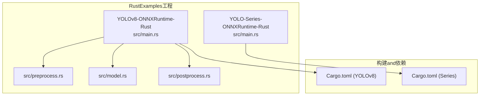
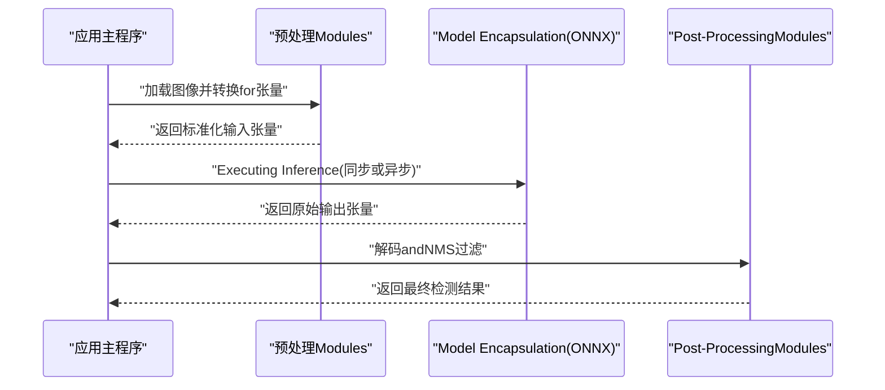
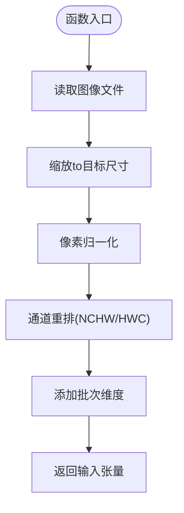
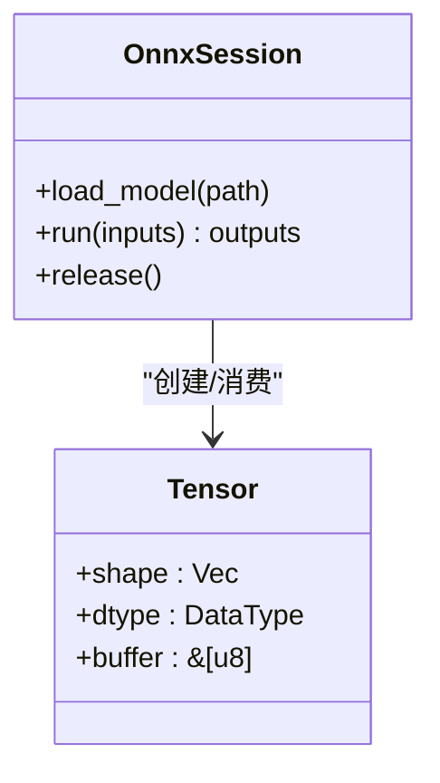
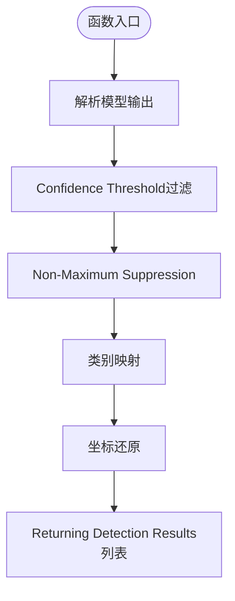
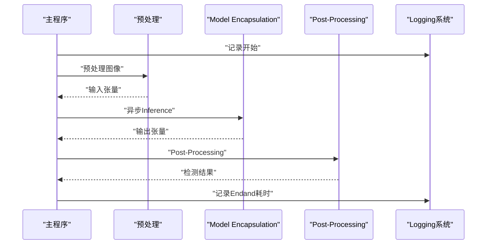
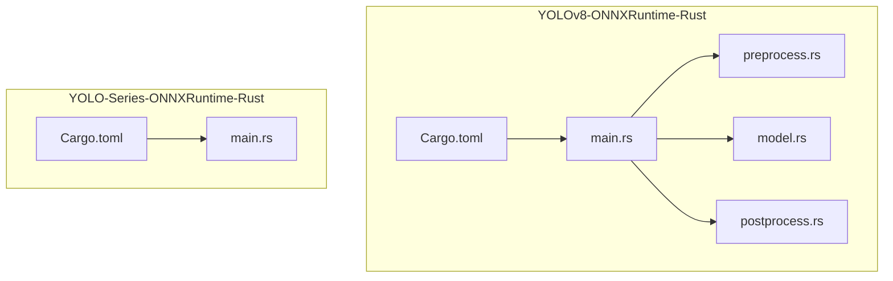

# Rust语言集成

<cite>
**Files Referenced in This Document**
- [examples/YOLO-Series-ONNXRuntime-Rust/Cargo.toml](file://examples/YOLO-Series-ONNXRuntime-Rust/Cargo.toml)
- [examples/YOLO-Series-ONNXRuntime-Rust/src/main.rs](file://examples/YOLO-Series-ONNXRuntime-Rust/src/main.rs)
- [examples/YOLOv8-ONNXRuntime-Rust/Cargo.toml](file://examples/YOLOv8-ONNXRuntime-Rust/Cargo.toml)
- [examples/YOLOv8-ONNXRuntime-Rust/src/main.rs](file://examples/YOLOv8-ONNXRuntime-Rust/src/main.rs)
- [examples/YOLOv8-ONNXRuntime-Rust/src/preprocess.rs](file://examples/YOLOv8-ONNXRuntime-Rust/src/preprocess.rs)
- [examples/YOLOv8-ONNXRuntime-Rust/src/postprocess.rs](file://examples/YOLOv8-ONNXRuntime-Rust/src/postprocess.rs)
- [examples/YOLOv8-ONNXRuntime-Rust/src/model.rs](file://examples/YOLOv8-ONNXRuntime-Rust/src/model.rs)
- [examples/YOLOv8-ONNXRuntime-Rust/README.md](file://examples/YOLOv8-ONNXRuntime-Rust/README.md)
</cite>

## Table of Contents
1. [Introduction](#Introduction)
2. [Project Structure](#Project Structure)
3. [Core Components](#Core Components)
4. [Architecture Overview](#Architecture Overview)
5. [Detailed Component Analysis](#Detailed Component Analysis)
6. [Dependency Analysis](#Dependency Analysis)
7. [Performance Considerations](#Performance Considerations)
8. [Troubleshooting Guide](#Troubleshooting Guide)
9. [Conclusion](#Conclusion)
10. [Appendix](#Appendix)

## Introduction
本文件targeting希望whileRust中集成YOLO-Master的开发者，聚焦于UsesONNX Runtime Rust绑定进行模型Inference。Documentation涵盖类型安全的Data processingand内存管理、完整的Cargo项目配置and构建流程、异步Inference、错误处理andLogging、Rust所有权模型while深度学习Inference中的应用、性能Optimization最佳实践、跨平台编译and部署，Centered onandandRust生态系统的集成方法。文中所有implementing细节均基于仓库内已有的RustExamples工程（YOLOv8 ONNX Runtime Rust and YOLO Series ONNX Runtime Rust），并provides可追溯的文件来源and图示。

## Project Structure
仓库中andRust集成相关的代码位于 examples Table of Contents下，主要包含两个独立的RustExamples工程：
- YOLOv8-ONNXRuntime-Rust：provides完整的预处理、模型加载andInference、Post-Processing流水线，适合作for端to端Refer toimplementing。
- YOLO-Series-ONNXRuntime-Rust：更通用的系列模型InferenceExamples，便于扩展至其他YOLO变体。

Figure Source
- [examples/YOLOv8-ONNXRuntime-Rust/src/main.rs](file://examples/YOLOv8-ONNXRuntime-Rust/src/main.rs)
- [examples/YOLOv8-ONNXRuntime-Rust/src/preprocess.rs](file://examples/YOLOv8-ONNXRuntime-Rust/src/preprocess.rs)
- [examples/YOLOv8-ONNXRuntime-Rust/src/model.rs](file://examples/YOLOv8-ONNXRuntime-Rust/src/model.rs)
- [examples/YOLOv8-ONNXRuntime-Rust/src/postprocess.rs](file://examples/YOLOv8-ONNXRuntime-Rust/src/postprocess.rs)
- [examples/YOLO-Series-ONNXRuntime-Rust/src/main.rs](file://examples/YOLO-Series-ONNXRuntime-Rust/src/main.rs)
- [examples/YOLOv8-ONNXRuntime-Rust/Cargo.toml](file://examples/YOLOv8-ONNXRuntime-Rust/Cargo.toml)
- [examples/YOLO-Series-ONNXRuntime-Rust/Cargo.toml](file://examples/YOLO-Series-ONNXRuntime-Rust/Cargo.toml)

Section Source
- [examples/YOLOv8-ONNXRuntime-Rust/README.md](file://examples/YOLOv8-ONNXRuntime-Rust/README.md)
- [examples/YOLOv8-ONNXRuntime-Rust/Cargo.toml](file://examples/YOLOv8-ONNXRuntime-Rust/Cargo.toml)
- [examples/YOLO-Series-ONNXRuntime-Rust/Cargo.toml](file://examples/YOLO-Series-ONNXRuntime-Rust/Cargo.toml)

## Core Components
- 预处理Modules：负责图像读取、缩放、归一化、通道重排and张量布局转换，确保输入符合ONNX模型的期望形状and数据类型。
- Model Encapsulation：EncapsulatesONNX会话创建、输入输出张量分配、运行and资源释放，暴露统一的Inference接口。
- Post-ProcessingModules：对模型原始输出进行解码、NMS过滤、Confidence Threshold筛选and坐标还原，生成最终检测结果。
- 主程序编排：串联预处理、InferenceandPost-Processing，组织错误处理andLogging，并演示同步/异步Calls方式。

Section Source
- [examples/YOLOv8-ONNXRuntime-Rust/src/preprocess.rs](file://examples/YOLOv8-ONNXRuntime-Rust/src/preprocess.rs)
- [examples/YOLOv8-ONNXRuntime-Rust/src/model.rs](file://examples/YOLOv8-ONNXRuntime-Rust/src/model.rs)
- [examples/YOLOv8-ONNXRuntime-Rust/src/postprocess.rs](file://examples/YOLOv8-ONNXRuntime-Rust/src/postprocess.rs)
- [examples/YOLOv8-ONNXRuntime-Rust/src/main.rs](file://examples/YOLOv8-ONNXRuntime-Rust/src/main.rs)

## Architecture Overview
下图展示了从输入图像to检测结果的完整数据流，Centered onand各Modules之间的交互关系。

Figure Source
- [examples/YOLOv8-ONNXRuntime-Rust/src/main.rs](file://examples/YOLOv8-ONNXRuntime-Rust/src/main.rs)
- [examples/YOLOv8-ONNXRuntime-Rust/src/preprocess.rs](file://examples/YOLOv8-ONNXRuntime-Rust/src/preprocess.rs)
- [examples/YOLOv8-ONNXRuntime-Rust/src/model.rs](file://examples/YOLOv8-ONNXRuntime-Rust/src/model.rs)
- [examples/YOLOv8-ONNXRuntime-Rust/src/postprocess.rs](file://examples/YOLOv8-ONNXRuntime-Rust/src/postprocess.rs)

## Detailed Component Analysis

### 预处理Modules分析
- 职责：将图像转换for模型所需的输入格式，包括尺寸调整、像素值归一化、通道顺序转换and批量维度添加。
- 类型安全：Via强类型表示图像缓冲区and张量形状，避免越界and类型不匹配。
- 内存管理：利用Rust的所有权and借用规则，确保输入缓冲区的生命周期and张量对象一致，减少拷贝and泄漏风险。
- 性能Optimization：尽量Uses零拷贝视图and预分配缓冲区；必要时采用SIMD指令集加速图像处理。

Figure Source
- [examples/YOLOv8-ONNXRuntime-Rust/src/preprocess.rs](file://examples/YOLOv8-ONNXRuntime-Rust/src/preprocess.rs)

Section Source
- [examples/YOLOv8-ONNXRuntime-Rust/src/preprocess.rs](file://examples/YOLOv8-ONNXRuntime-Rust/src/preprocess.rs)

### Model Encapsulation分析
- 职责：EncapsulatesONNX Runtime会话初始化、输入输出张量分配、Inference执行and资源清理。
- 类型安全：定义输入/输出张量的形状and数据类型，并while运行时校验，防止不兼容的模型版本。
- 内存管理：显式管理张量缓冲区and会话生命周期，遵循RAII原则，while作用域End时自动释放资源。
- 异步Inference：provides阻塞and非阻塞两种Calls方式，便于while高并发场景下提升吞吐。

Figure Source
- [examples/YOLOv8-ONNXRuntime-Rust/src/model.rs](file://examples/YOLOv8-ONNXRuntime-Rust/src/model.rs)

Section Source
- [examples/YOLOv8-ONNXRuntime-Rust/src/model.rs](file://examples/YOLOv8-ONNXRuntime-Rust/src/model.rs)

### Post-ProcessingModules分析
- 职责：对模型原始输出进行解码、类别映射、Confidence Threshold过滤andNMS去重，还原边界框坐标。
- 类型安全：严格定义输出张量的结构and字段含义，避免索引越界and语义误用。
- 内存管理：结果集合采用向量存储，按生命周期管理，避免悬垂引用。
- 性能Optimization：NMS算法可采用向量化implementing；提前剪枝低置信度PredictionCentered on减少计算量。

Figure Source
- [examples/YOLOv8-ONNXRuntime-Rust/src/postprocess.rs](file://examples/YOLOv8-ONNXRuntime-Rust/src/postprocess.rs)

Section Source
- [examples/YOLOv8-ONNXRuntime-Rust/src/postprocess.rs](file://examples/YOLOv8-ONNXRuntime-Rust/src/postprocess.rs)

### 主程序编排and错误处理
- 职责：协调预处理、InferenceandPost-Processing，组织错误处理andLogging，providesCLI或API入口。
- 错误处理：统一错误类型and传播策略，区分IO错误、模型加载失败、Inference异常andPost-Processing异常。
- Logging：Uses结构化Logging库，记录关键步骤and性能Metrics，便于问题定位and监控。
- 异步Supporting：while主程序中展示such as何Centered on异步方式CallsInference，CombiningTasks队列提升吞吐。

Figure Source
- [examples/YOLOv8-ONNXRuntime-Rust/src/main.rs](file://examples/YOLOv8-ONNXRuntime-Rust/src/main.rs)

Section Source
- [examples/YOLOv8-ONNXRuntime-Rust/src/main.rs](file://examples/YOLOv8-ONNXRuntime-Rust/src/main.rs)

## Dependency Analysis
- Cargo配置：每个Examples工程均有独立的Cargo.toml，声明ONNX Runtime绑定、图像处理andLoggingetc.依赖。
- External Dependencies：ONNX Runtimeprovides底层Inferencecapabilities；图像处理库用于读取and变换；Logging库用于结构化记录。
- 版本管理：建议固定ONNX Runtime版本Centered on确保跨平台一致性；根据目标平台选择CPU/GPU后端。

Figure Source
- [examples/YOLOv8-ONNXRuntime-Rust/Cargo.toml](file://examples/YOLOv8-ONNXRuntime-Rust/Cargo.toml)
- [examples/YOLOv8-ONNXRuntime-Rust/src/main.rs](file://examples/YOLOv8-ONNXRuntime-Rust/src/main.rs)
- [examples/YOLO-Series-ONNXRuntime-Rust/Cargo.toml](file://examples/YOLO-Series-ONNXRuntime-Rust/Cargo.toml)
- [examples/YOLO-Series-ONNXRuntime-Rust/src/main.rs](file://examples/YOLO-Series-ONNXRuntime-Rust/src/main.rs)

Section Source
- [examples/YOLOv8-ONNXRuntime-Rust/Cargo.toml](file://examples/YOLOv8-ONNXRuntime-Rust/Cargo.toml)
- [examples/YOLO-Series-ONNXRuntime-Rust/Cargo.toml](file://examples/YOLO-Series-ONNXRuntime-Rust/Cargo.toml)

## Performance Considerations
- 批处理：尽可能合并多帧输入Centered on提升GPU利用率and吞吐。
- 内存复用：重用输入/输出缓冲区，避免频繁分配and释放。
- 线程池：Uses工作窃取线程池并行处理多个请求，注意会话and资源的线程安全。
- 后端选择：CPU/GPU后端按需切换；while边缘设备上优先选择轻量后端。
- 数值精度：根据模型要求选择合适的浮点精度（FP32/FP16），权衡精度and速度。
- I/OOptimization：Uses异步I/Oand零拷贝路径，减少磁盘and网络延迟。

## Troubleshooting Guide
- 模型加载失败：检查模型路径、权限and格式兼容性；确认ONNX Runtime后端已正确安装。
- 输入形状不匹配：核对预处理输出的形状and数据类型是否and模型期望一致。
- Inference超时：Evaluation设备负载and批大小；必要时降低分辨率或启用异步模式。
- Post-Processing异常：ValidationNMS参数andConfidence Threshold；检查类别映射是否正确。
- Logging定位：开启详细Logging，记录关键步骤的时间戳and中间状态，快速定位bottlenecksand错误源。

Section Source
- [examples/YOLOv8-ONNXRuntime-Rust/src/main.rs](file://examples/YOLOv8-ONNXRuntime-Rust/src/main.rs)

## Conclusion
ViawhileRust中UsesONNX Runtime绑定，YOLO-Master可Centered onwhile类型安全、内存安全and高性能的前提下完成端to端Inference。借助Modules化设计（预处理、Model Encapsulation、Post-Processing）and清晰的错误处理andLogging，开发者可Centered on快速集成并扩展至生产环境。同时，遵循Rust所有权模型and性能Optimization最佳实践，可while不同平台上获得稳定且高效的Inference体验。

## Appendix
- 构建and运行：Refer to各Examples工程的READMEandCargo.toml，安装必要依赖后执行cargo buildandcargo run。
- Cross-Platform Deployment：针对不同Operating Systemand硬件后端选择合适的ONNX Runtime二进制包；while容器环境中固化依赖版本。
- 生态系统集成：可andTokio异步运行时、actix-web服务器、serde序列化、tracingLogging系统集成，构建高可用服务。