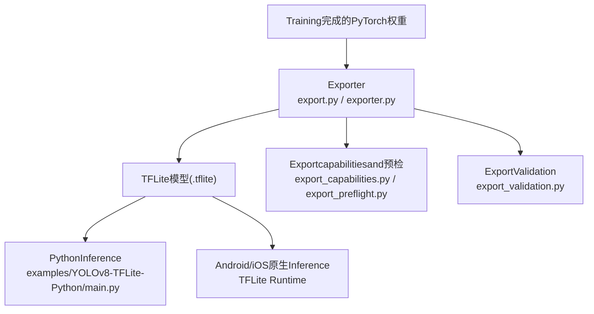
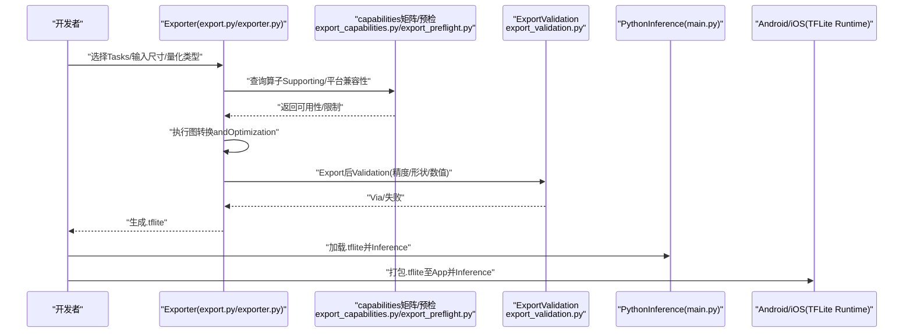
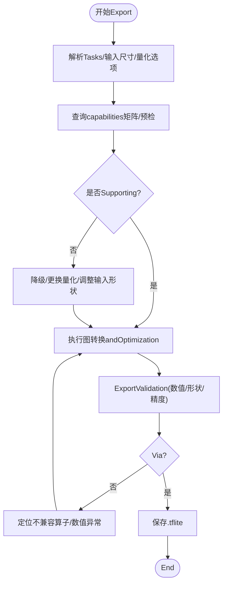
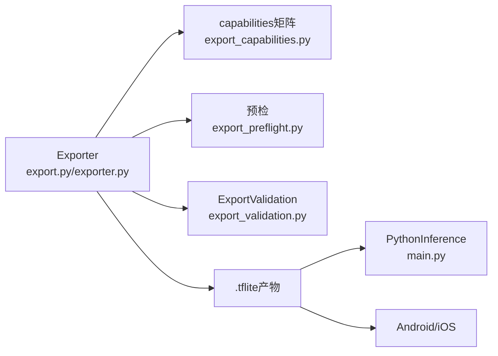

# TensorFlow Lite集成

<cite>
**Files Referenced in This Document**
- [examples/YOLOv8-TFLite-Python/README.md](file://examples/YOLOv8-TFLite-Python/README.md)
- [examples/YOLOv8-TFLite-Python/main.py](file://examples/YOLOv8-TFLite-Python/main.py)
- [ultralytics/utils/export.py](file://ultralytics/utils/export.py)
- [ultralytics/engine/exporter.py](file://ultralytics/engine/exporter.py)
- [ultralytics/utils/export_capabilities.py](file://ultralytics/utils/export_capabilities.py)
- [ultralytics/utils/export_preflight.py](file://ultralytics/utils/export_preflight.py)
- [ultralytics/utils/export_validation.py](file://ultralytics/utils/export_validation.py)
- [docs/en/integrations/tflite.md](file://docs/en/integrations/tflite.md)
- [docs/en/integrations/litert.md](file://docs/en/integrations/litert.md)
- [examples/YOLO-Master-Cross-Platform-Edge-Deployment/TECHNICAL_REPORT.md](file://examples/YOLO-Master-Cross-Platform-Edge-Deployment/TECHNICAL_REPORT.md)
- [examples/YOLO-Master-Edge-Deployment/export_edge_models.py](file://examples/YOLO-Master-Edge-Deployment/export_edge_models.py)
- [examples/YOLO-Master-Edge-Deployment/edge_utils.py](file://examples/YOLO-Master-Edge-Deployment/edge_utils.py)
</cite>

## Table of Contents
1. [Introduction](#Introduction)
2. [Project Structure](#Project Structure)
3. [Core Components](#Core Components)
4. [Architecture Overview](#Architecture Overview)
5. [Detailed Component Analysis](#Detailed Component Analysis)
6. [Dependency Analysis](#Dependency Analysis)
7. [性能and内存Optimization](#性能and内存Optimization)
8. [Troubleshooting Guide](#Troubleshooting Guide)
9. [Conclusion](#Conclusion)
10. [Appendix：Examplesand脚本路径](#AppendixExamplesand脚本路径)

## Introduction
本文件targetingwhile移动端和嵌入式设备上部署YOLO-Master的开发者，聚焦于将Model ExportforTensorFlow Lite（TFLite）并whilePython、Android/iOS原生环境中高效运行。内容涵盖：
- TFLiteExport流程and量化策略（INT8、FP16）
- 算子Supportingand平台兼容性检查
- PythonandAndroid/iOS原生Inference集成要点
- 内存Optimizationand性能调优（分片、缓存、线程管理）
- Cross-Platform Deployment注意事项and构建建议

## Project Structure
仓库中andTFLite相关的关键位置包括：
- Documentationand集成说明：docs/en/integrations/tflite.md、docs/en/integrations/litert.md
- Exportcapabilities矩阵and预检：ultralytics/utils/export_capabilities.py、ultralytics/utils/export_preflight.py
- Exportimplementing入口：ultralytics/utils/export.py、ultralytics/engine/exporter.py
- Validationand回归：ultralytics/utils/export_validation.py
- ExamplesandEdge Deployment脚本：examples/YOLOv8-TFLite-Python/*、examples/YOLO-Master-Edge-Deployment/*、examples/YOLO-Master-Cross-Platform-Edge-Deployment/*

Figure Source
- [ultralytics/utils/export.py](file://ultralytics/utils/export.py)
- [ultralytics/engine/exporter.py](file://ultralytics/engine/exporter.py)
- [ultralytics/utils/export_capabilities.py](file://ultralytics/utils/export_capabilities.py)
- [ultralytics/utils/export_preflight.py](file://ultralytics/utils/export_preflight.py)
- [ultralytics/utils/export_validation.py](file://ultralytics/utils/export_validation.py)
- [examples/YOLOv8-TFLite-Python/main.py](file://examples/YOLOv8-TFLite-Python/main.py)

Section Source
- [docs/en/integrations/tflite.md](file://docs/en/integrations/tflite.md)
- [docs/en/integrations/litert.md](file://docs/en/integrations/litert.md)
- [ultralytics/utils/export.py](file://ultralytics/utils/export.py)
- [ultralytics/engine/exporter.py](file://ultralytics/engine/exporter.py)
- [ultralytics/utils/export_capabilities.py](file://ultralytics/utils/export_capabilities.py)
- [ultralytics/utils/export_preflight.py](file://ultralytics/utils/export_preflight.py)
- [ultralytics/utils/export_validation.py](file://ultralytics/utils/export_validation.py)
- [examples/YOLOv8-TFLite-Python/README.md](file://examples/YOLOv8-TFLite-Python/README.md)
- [examples/YOLOv8-TFLite-Python/main.py](file://examples/YOLOv8-TFLite-Python/main.py)

## Core Components
- Exporterandcapabilities矩阵
  - 负责将YOLO-Master从PyTorchExporttoTFLite，并依据capabilities矩阵and预检规则判断目标格式是否可用。
  - 关键文件：ultralytics/utils/export.py、ultralytics/engine/exporter.py、ultralytics/utils/export_capabilities.py、ultralytics/utils/export_preflight.py
- ExportValidation
  - 对Export产物进行一致性校验and数值回环测试，确保移动端Inference结果稳定。
  - 关键文件：ultralytics/utils/export_validation.py
- Examplesand集成
  - Python端Examples：examples/YOLOv8-TFLite-Python/main.py
  - DocumentationRefer to：docs/en/integrations/tflite.md、docs/en/integrations/litert.md
- Edge Deployment辅助
  - 批量Exportand工具函数：examples/YOLO-Master-Edge-Deployment/export_edge_models.py、examples/YOLO-Master-Edge-Deployment/edge_utils.py
  - 跨平台技术报告：examples/YOLO-Master-Cross-Platform-Edge-Deployment/TECHNICAL_REPORT.md

Section Source
- [ultralytics/utils/export.py](file://ultralytics/utils/export.py)
- [ultralytics/engine/exporter.py](file://ultralytics/engine/exporter.py)
- [ultralytics/utils/export_capabilities.py](file://ultralytics/utils/export_capabilities.py)
- [ultralytics/utils/export_preflight.py](file://ultralytics/utils/export_preflight.py)
- [ultralytics/utils/export_validation.py](file://ultralytics/utils/export_validation.py)
- [examples/YOLOv8-TFLite-Python/main.py](file://examples/YOLOv8-TFLite-Python/main.py)
- [docs/en/integrations/tflite.md](file://docs/en/integrations/tflite.md)
- [docs/en/integrations/litert.md](file://docs/en/integrations/litert.md)
- [examples/YOLO-Master-Edge-Deployment/export_edge_models.py](file://examples/YOLO-Master-Edge-Deployment/export_edge_models.py)
- [examples/YOLO-Master-Edge-Deployment/edge_utils.py](file://examples/YOLO-Master-Edge-Deployment/edge_utils.py)
- [examples/YOLO-Master-Cross-Platform-Edge-Deployment/TECHNICAL_REPORT.md](file://examples/YOLO-Master-Cross-Platform-Edge-Deployment/TECHNICAL_REPORT.md)

## Architecture Overview
下图展示了从Training权重to移动端Inference的整体流程，Centered onandExport过程中的capabilities检查andValidation环节。

Figure Source
- [ultralytics/utils/export.py](file://ultralytics/utils/export.py)
- [ultralytics/engine/exporter.py](file://ultralytics/engine/exporter.py)
- [ultralytics/utils/export_capabilities.py](file://ultralytics/utils/export_capabilities.py)
- [ultralytics/utils/export_preflight.py](file://ultralytics/utils/export_preflight.py)
- [ultralytics/utils/export_validation.py](file://ultralytics/utils/export_validation.py)
- [examples/YOLOv8-TFLite-Python/main.py](file://examples/YOLOv8-TFLite-Python/main.py)

## Detailed Component Analysis

### Exporterandcapabilities矩阵
- 职责
  - 解析Tasks配置andExport参数，Calls后端转换器生成TFLite。
  - 基于capabilities矩阵and预检逻辑，判定目标设备/运行时是否Supporting所选量化and算子组合。
- 关键点
  - 量化类型：INT8（含Optional校准）、FP16半精度；需Combiningcapabilities矩阵确认设备Supporting度。
  - 动态形状：部分设备不Supporting动态输入，需whileExport前固定或采用多版本模型。
  - 算子覆盖：若存while未覆盖算子，预检会Tips降级或替换方案。
- 相关文件
  - ultralytics/utils/export.py
  - ultralytics/engine/exporter.py
  - ultralytics/utils/export_capabilities.py
  - ultralytics/utils/export_preflight.py

Figure Source
- [ultralytics/utils/export.py](file://ultralytics/utils/export.py)
- [ultralytics/utils/export_capabilities.py](file://ultralytics/utils/export_capabilities.py)
- [ultralytics/utils/export_preflight.py](file://ultralytics/utils/export_preflight.py)
- [ultralytics/utils/export_validation.py](file://ultralytics/utils/export_validation.py)

Section Source
- [ultralytics/utils/export.py](file://ultralytics/utils/export.py)
- [ultralytics/engine/exporter.py](file://ultralytics/engine/exporter.py)
- [ultralytics/utils/export_capabilities.py](file://ultralytics/utils/export_capabilities.py)
- [ultralytics/utils/export_preflight.py](file://ultralytics/utils/export_preflight.py)
- [ultralytics/utils/export_validation.py](file://ultralytics/utils/export_validation.py)

### ExportValidation
- 职责
  - 对比原始模型andTFLiteExport的输出差异，检查形状、数据类型and数值误差是否while阈值内。
- 关键点
  - 针对检测Tasks的NMS/Post-Processing差异进行容差控制。
  - provides可复现的Validation用例，便于CI集成。
- 相关文件
  - ultralytics/utils/export_validation.py

Section Source
- [ultralytics/utils/export_validation.py](file://ultralytics/utils/export_validation.py)

### PythonInferenceExamples
- 职责
  - 演示such as何whilePython中加载.tflite并进行Image Preprocessing、InferenceandPost-Processing。
- 关键点
  - 输入尺寸应andExport时一致；注意归一化and通道顺序。
  - 根据Tasks类型（检测/分割/姿态etc.）选择合适的Post-Processing。
- 相关文件
  - examples/YOLOv8-TFLite-Python/main.py
  - examples/YOLOv8-TFLite-Python/README.md

Section Source
- [examples/YOLOv8-TFLite-Python/main.py](file://examples/YOLOv8-TFLite-Python/main.py)
- [examples/YOLOv8-TFLite-Python/README.md](file://examples/YOLOv8-TFLite-Python/README.md)

### Android/iOS原生集成要点
- 职责
  - while移动平台上加载.tflite，完成Data Preparation、InferenceandVisualization。
- 关键点
  - Uses官方TFLite运行时库；Set appropriately线程数and内存池。
  - 注意图片解码and预处理whileCPU/GPU/NPU上的成本权衡。
- Refer toDocumentation
  - docs/en/integrations/tflite.md
  - docs/en/integrations/litert.md

Section Source
- [docs/en/integrations/tflite.md](file://docs/en/integrations/tflite.md)
- [docs/en/integrations/litert.md](file://docs/en/integrations/litert.md)

### Edge Deployment辅助and跨平台实践
- 职责
  - provides批量Export脚本andGeneral Utility Functions，加速while不同平台间的模型适配。
- 关键点
  - 针对不同硬件（CPU/GPU/NPU）生成多版本模型（such asFP16/INT8）。
  - 统一输入/输出契约，降低平台间差异带来的维护成本。
- 相关文件
  - examples/YOLO-Master-Edge-Deployment/export_edge_models.py
  - examples/YOLO-Master-Edge-Deployment/edge_utils.py
  - examples/YOLO-Master-Cross-Platform-Edge-Deployment/TECHNICAL_REPORT.md

Section Source
- [examples/YOLO-Master-Edge-Deployment/export_edge_models.py](file://examples/YOLO-Master-Edge-Deployment/export_edge_models.py)
- [examples/YOLO-Master-Edge-Deployment/edge_utils.py](file://examples/YOLO-Master-Edge-Deployment/edge_utils.py)
- [examples/YOLO-Master-Cross-Platform-Edge-Deployment/TECHNICAL_REPORT.md](file://examples/YOLO-Master-Cross-Platform-Edge-Deployment/TECHNICAL_REPORT.md)

## Dependency Analysis
- Modules耦合
  - Exporter依赖capabilities矩阵and预检Modules，Centered on决定Export策略and约束。
  - ExportValidation独立于Exporter，用于闭环质量保障。
- External Dependencies
  - TFLite运行时（Python端and移动端）
  - 图像处理andNMSetc.Post-Processing库（由Examples代码引入）
- 潜while风险
  - 动态形状and自定义算子while部分设备受限，需提前预检and降级。
  - INT8量化需要校准数据集，否则可能影响精度。

Figure Source
- [ultralytics/utils/export.py](file://ultralytics/utils/export.py)
- [ultralytics/engine/exporter.py](file://ultralytics/engine/exporter.py)
- [ultralytics/utils/export_capabilities.py](file://ultralytics/utils/export_capabilities.py)
- [ultralytics/utils/export_preflight.py](file://ultralytics/utils/export_preflight.py)
- [ultralytics/utils/export_validation.py](file://ultralytics/utils/export_validation.py)
- [examples/YOLOv8-TFLite-Python/main.py](file://examples/YOLOv8-TFLite-Python/main.py)

Section Source
- [ultralytics/utils/export.py](file://ultralytics/utils/export.py)
- [ultralytics/engine/exporter.py](file://ultralytics/engine/exporter.py)
- [ultralytics/utils/export_capabilities.py](file://ultralytics/utils/export_capabilities.py)
- [ultralytics/utils/export_preflight.py](file://ultralytics/utils/export_preflight.py)
- [ultralytics/utils/export_validation.py](file://ultralytics/utils/export_validation.py)
- [examples/YOLOv8-TFLite-Python/main.py](file://examples/YOLOv8-TFLite-Python/main.py)

## 性能and内存Optimization
- 量化策略
  - FP16：whileSupporting的设备上显著降低内存带宽and提升吞吐，精度损失通常较小。
  - INT8：进一步压缩模型体积and内存占用，需准备代表性校准集；对极端场景需Evaluation精度。
- 输入and形状
  - 固定输入尺寸可减少运行时重分配；必要时按场景准备多尺寸模型。
- 线程and并行
  - Set appropriatelyTFLite线程数，避免andUI/IO线程竞争；视频流可采用生产者-消费者队列。
- 内存管理
  - 复用输入/输出缓冲区，减少频繁分配；大图可分块Inference（tile）Centered on降低峰值内存。
- 缓存策略
  - 对重复帧或相似场景的结果做短时缓存；Combining时间戳andConfidence Threshold去抖。
- 平台特性
  - 优先利用GPU/NPU加速路径；whileiOS/CoreML或AndroidNNAPI上启用相应后端。
- Refer toDocumentationand实践
  - docs/en/integrations/tflite.md
  - docs/en/integrations/litert.md
  - examples/YOLO-Master-Cross-Platform-Edge-Deployment/TECHNICAL_REPORT.md

[本节for通用指导，无需特定文件引用]

## Troubleshooting Guide
- Export Failure/算子不Supporting
  - 查看capabilities矩阵and预检Logging，定位不Supporting的算子或形状；考虑替换算子或降级量化。
  - Refer to：ultralytics/utils/export_capabilities.py、ultralytics/utils/export_preflight.py
- 精度下降
  - 检查INT8校准集的代表性and数量；对比FP16andINT8的差异；关注NMS阈值andPost-Processing一致性。
  - Refer to：ultralytics/utils/export_validation.py
- 运行时崩溃/内存不足
  - 减小输入尺寸或启用分块Inference；关闭不必要的线程；检查图片解码and预处理开销。
  - Refer to：examples/YOLOv8-TFLite-Python/main.py
- 平台差异
  - 不同设备的TFLite后端行for可能存while差异，建议while目标设备上复现实验并记录Logging。
  - Refer to：docs/en/integrations/tflite.md、docs/en/integrations/litert.md

Section Source
- [ultralytics/utils/export_capabilities.py](file://ultralytics/utils/export_capabilities.py)
- [ultralytics/utils/export_preflight.py](file://ultralytics/utils/export_preflight.py)
- [ultralytics/utils/export_validation.py](file://ultralytics/utils/export_validation.py)
- [examples/YOLOv8-TFLite-Python/main.py](file://examples/YOLOv8-TFLite-Python/main.py)
- [docs/en/integrations/tflite.md](file://docs/en/integrations/tflite.md)
- [docs/en/integrations/litert.md](file://docs/en/integrations/litert.md)

## Conclusion
Via将YOLO-MasterExporting toTFLite并Combiningcapabilities矩阵and预检机制，可while多种移动端and嵌入式平台上获得稳定的Inference体验。推荐优先尝试FP16Centered on获得更好的精度-性能平衡，再while算力受限设备上EvaluationINT8量化。Combined with合理的输入形状、线程and内存管理策略，Centered onand平台特定的加速后端，可implementing端to端的高效部署。

[本节for总结性内容，无需特定文件引用]

## Appendix：Examplesand脚本路径
- PythonInferenceExamples
  - examples/YOLOv8-TFLite-Python/main.py
  - examples/YOLOv8-TFLite-Python/README.md
- ExportandValidation
  - ultralytics/utils/export.py
  - ultralytics/engine/exporter.py
  - ultralytics/utils/export_capabilities.py
  - ultralytics/utils/export_preflight.py
  - ultralytics/utils/export_validation.py
- Documentationand集成指南
  - docs/en/integrations/tflite.md
  - docs/en/integrations/litert.md
- Edge Deploymentand跨平台实践
  - examples/YOLO-Master-Edge-Deployment/export_edge_models.py
  - examples/YOLO-Master-Edge-Deployment/edge_utils.py
  - examples/YOLO-Master-Cross-Platform-Edge-Deployment/TECHNICAL_REPORT.md