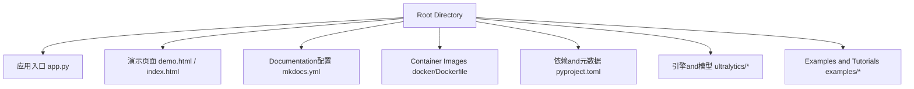
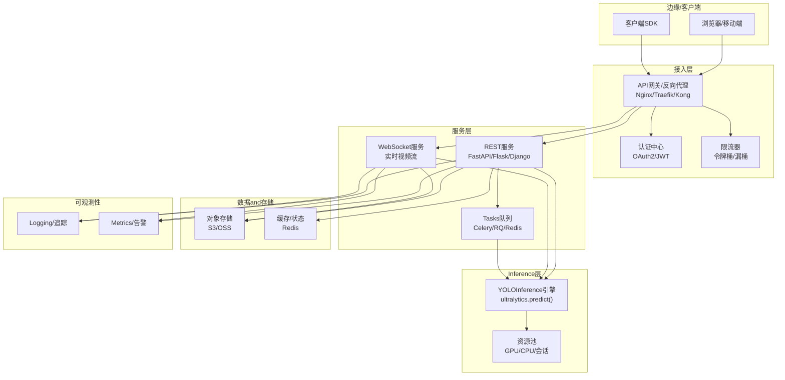
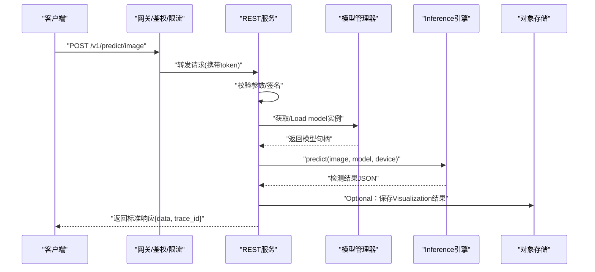
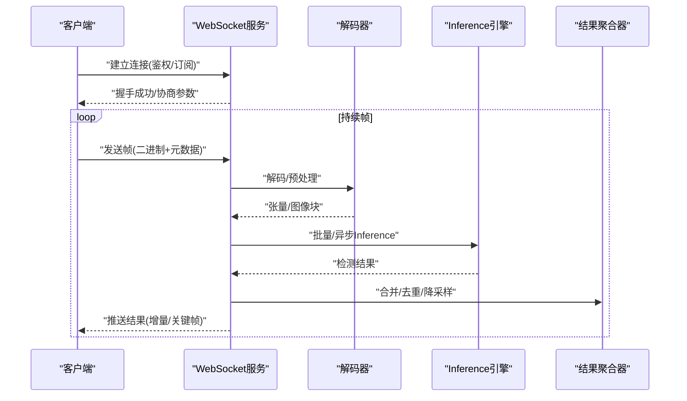
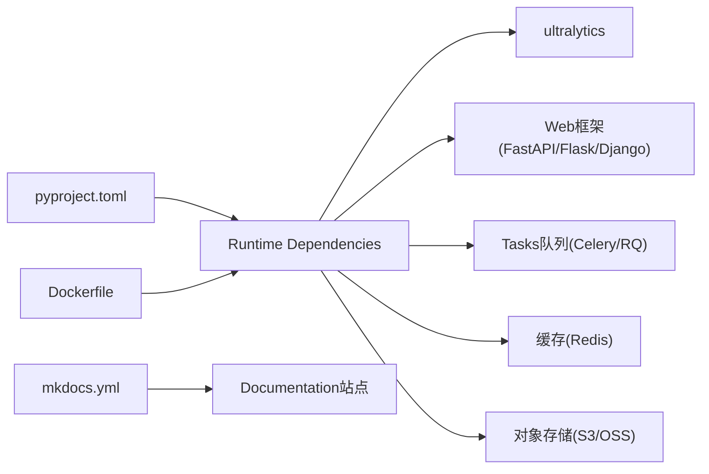

# Web API服务化集成

<cite>
**Files Referenced in This Document**
- [app.py](file://app.py)
- [demo.html](file://demo.html)
- [index.html](file://index.html)
- [Dockerfile](file://docker/Dockerfile)
- [README.md](file://README.md)
- [mkdocs.yml](file://mkdocs.yml)
- [pyproject.toml](file://pyproject.toml)
</cite>

## Table of Contents
1. [Introduction](#Introduction)
2. [Project Structure](#Project Structure)
3. [Core Components](#Core Components)
4. [Architecture Overview](#Architecture Overview)
5. [Detailed Component Analysis](#Detailed Component Analysis)
6. [Dependency Analysis](#Dependency Analysis)
7. [Performance Considerations](#Performance Considerations)
8. [Troubleshooting Guide](#Troubleshooting Guide)
9. [Conclusion](#Conclusion)
10. [Appendix](#Appendix)

## Introduction
本文件targeting将YOLO-MasterInferencecapabilitiesCentered onWeb API形式对外provides的需求，覆盖Centered on下目标：
- 基于Flask、FastAPIandDjango的REST API服务implementing思路（请求处理、响应格式化、错误处理）
- WebSocket实时Inference方案（视频流接入、帧级处理、结果推送）
- 认证授权、限流控制andLoad Balancing配置建议
- 异步Inference、连接池管理and资源Optimization要点
- 完整APIDocumentation、客户端SDKand前端集成Examples指引
- Containerized Deployment、微服务架构and云原生最佳实践

说明：当前仓库未包含可直接运行的Flask/FastAPI/Django服务端代码。本文while“Detailed Component Analysis”中给出可落地的Refer toimplementing路径andCalls点映射，所有and仓库直接相关的依据均标注来源；其余for通用工程实践建议。

## Project Structure
仓库Root Directory包含应用入口、Documentation构建配置、Container Images定义Centered onand大量模型Training/Inference/工具脚本。andWeb API服务化相关的关键位置such as下：
- 应用入口and演示页面：Root Directory下的Python入口andHTML演示页
- Documentation and References：mkdocs配置and英文Documentation集
- 容器化：docker/Dockerfile
- 依赖and元数据：pyproject.toml

Figure Source
- [app.py:1-200](file://app.py#L1-L200)
- [demo.html:1-200](file://demo.html#L1-L200)
- [index.html:1-200](file://index.html#L1-L200)
- [mkdocs.yml:1-200](file://mkdocs.yml#L1-L200)
- [Dockerfile:1-200](file://docker/Dockerfile#L1-L200)
- [pyproject.toml:1-200](file://pyproject.toml#L1-L200)

Section Source
- [README.md:1-200](file://README.md#L1-L200)
- [mkdocs.yml:1-200](file://mkdocs.yml#L1-L200)
- [pyproject.toml:1-200](file://pyproject.toml#L1-L200)
- [Dockerfile:1-200](file://docker/Dockerfile#L1-L200)

## Core Components
- Inference引擎Encapsulates：Viaultralytics包provides的Prediction接口完成图像/视频检测、分割、姿态and other tasks
- 服务层（Optional）：根据团队技术栈选择Flask/FastAPI/Django作forHTTP/WebSocket服务框架
- 资源管理：模型加载、设备分配、批处理队列、线程/进程隔离
- 安全and治理：鉴权、限流、LoggingandMetrics采集
- 部署and运维：Container Images、编排and监控

Section Source
- [app.py:1-200](file://app.py#L1-L200)
- [README.md:1-200](file://README.md#L1-L200)

## Architecture Overview
下图展示一个生产可用的YOLOInference服务总体架构：网关/反向代理负责鉴权、限流and路由；后端服务providesRESTandWebSocket接口；Inference引擎执行模型计算；对象存储用于输入输出；消息总线用于异步Tasksand事件通知；监控andLogging支撑可观测性。

Figure Source
- [app.py:1-200](file://app.py#L1-L200)
- [Dockerfile:1-200](file://docker/Dockerfile#L1-L200)

## Detailed Component Analysis

### REST API服务（Flask/FastAPI/Django）
- 设计要点
  - 统一请求体and响应体规范（含分页、时间戳、trace_id）
  - 错误码分层（业务错误/系统错误/校验错误）
  - 输入校验and参数白名单
  - 图片/视频上传Supporting本地或对象存储直传
- 关键端点建议
  - POST /v1/predict/image：单图检测
  - POST /v1/predict/video：异步视频处理（返回TasksID）
  - GET /v1/tasks/{task_id}：查询Tasks进度and结果
  - GET /v1/models：列出可用模型and版本
  - POST /v1/models/{model}/warmup：预热指定模型
- 错误处理
  - 标准化错误响应格式
  - 记录结构化Logging并附带trace_id
  - 对超时、OOM、设备不可用etc.异常进行降级and重试策略

Section Source
- [app.py:1-200](file://app.py#L1-L200)
- [README.md:1-200](file://README.md#L1-L200)

#### 序列图：单图检测请求流程

Figure Source
- [app.py:1-200](file://app.py#L1-L200)

### WebSocket实时Inference（视频流）
- Applicable Scenarios
  - 摄像头RTSP/HTTP-FLV/HLS拉流
  - 浏览器MediaRecorder/WebRTC推流
  - 低延迟Visualizationand框选叠加
- 协议建议
  - 握手阶段：鉴权、订阅通道、分辨率/帧率协商
  - 传输阶段：二进制帧+元数据（时间戳、帧号、TasksID）
  - 结果阶段：增量推送（仅变化区域/Confidence Threshold过滤）
- 资源and稳定性
  - 每路流独立解码线程
  - 帧缓冲and丢帧策略（按负载自适应）
  - 断线重连and心跳保活

Section Source
- [app.py:1-200](file://app.py#L1-L200)

#### 序列图：WebSocket视频流Inference

Figure Source
- [app.py:1-200](file://app.py#L1-L200)

### 认证授权and限流
- 认证
  - JWT无状态校验，网关侧统一验签
  - Optional：OAuth2/OIDC对接企业身份源
- 授权
  - 基于角色/资源的访问控制（RBAC/ABAC）
  - 模型/Tasks级别的权限隔离
- 限流
  - 全局and租户维度令牌桶/漏桶
  - 针对长连接（WebSocket）设置并发上限and空闲超时

Section Source
- [app.py:1-200](file://app.py#L1-L200)

### 异步InferenceandTasks队列
- Uses场景
  - 视频转码andBatch Inference
  - 大分辨率切片Inference（SAHI）
  - Post-ProcessingandVisualization渲染
- 推荐方案
  - Celery + Redis/RabbitMQ
  - Tasks幂etc.and重试策略（指数退避）
  - 结果回调and轮询双模式

Section Source
- [app.py:1-200](file://app.py#L1-L200)

### 连接池and资源Optimization
- GPU/CPU资源池
  - 模型实例复用、会话共享
  - 动态扩缩容（Kubernetes HPA/VPA）
- I/Oand网络
  - 对象存储分片上传/下载
  - HTTP/2and连接复用
- 内存and缓存
  - 热点结果缓存（Redis）
  - 帧级零拷贝and内存池

Section Source
- [app.py:1-200](file://app.py#L1-L200)

### Load Balancingand高可用
- 水平扩展
  - 多副本部署，无状态服务
  - 会话粘性（WebSocket需关注）
- 健康检查and优雅退出
  - 就绪探针and存活探针
  - 预取模型and冷启动加速
- 灰度and回滚
  - 蓝绿/金丝雀发布
  - 流量切分andA/B测试

Section Source
- [Dockerfile:1-200](file://docker/Dockerfile#L1-L200)

### 前端集成Examples
- 页面入口
  - 演示页面and主页位于Root Directory，可作for前端集成Refer to
- 交互建议
  - 图片上传预览and结果叠加
  - 视频流播放andWebSocket结果同步
  - 错误Tipsand重试机制

Section Source
- [demo.html:1-200](file://demo.html#L1-L200)
- [index.html:1-200](file://index.html#L1-L200)

## Dependency Analysis
- Runtime Dependencies
  - Python生态：ultralytics、web框架、Tasks队列、缓存and对象存储SDK
- 构建and打包
  - pyproject.toml声明依赖and脚本入口
  - Dockerfile定义基础镜像、依赖安装and服务启动命令
- Documentationand站点
  - mkdocs.ymldrivers are installedDocumentation生成and站点构建

Figure Source
- [pyproject.toml:1-200](file://pyproject.toml#L1-L200)
- [Dockerfile:1-200](file://docker/Dockerfile#L1-L200)
- [mkdocs.yml:1-200](file://mkdocs.yml#L1-L200)

Section Source
- [pyproject.toml:1-200](file://pyproject.toml#L1-L200)
- [Dockerfile:1-200](file://docker/Dockerfile#L1-L200)
- [mkdocs.yml:1-200](file://mkdocs.yml#L1-L200)

## Performance Considerations
- 模型and设备
  - 选择合适的模型尺寸and精度（FP16/INT8）
  - 多卡/多进程并行and批大小调优
- 预处理andPost-Processing
  - 流水线并行and零拷贝
  - NMSandVisualization分离to独立线程
- 吞吐and延迟权衡
  - 短连接REST走批处理提升吞吐
  - 长连接WebSocket降低端to端延迟
- 可观测性
  - 关键Metrics：P95/P99延迟、吞吐、GPU利用率、错误率
  - 链路追踪and采样Logging

[This section provides general guidance and does not directly analyze specific files]

## Troubleshooting Guide
- 常见问题定位
  - 模型加载失败：检查权重路径、设备可用性and显存
  - Inference超时：调整批大小、超时阈值and重试策略
  - WebSocket断开：检查心跳、带宽and反代配置
- 诊断手段
  - 结构化Loggingandtrace_id贯穿全链路
  - Metrics上报至监控系统，设置告警阈值
  - 压测and混沌注入Validation鲁棒性

Section Source
- [app.py:1-200](file://app.py#L1-L200)

## Conclusion
Via将YOLO-MasterInferencecapabilitiesEncapsulatesforRESTandWebSocket服务，并Combining鉴权、限流、队列andContainerized Deployment，可while保证稳定性获得良好的可Extensibilityand可维护性。建议while灰度环境先行Validation，逐步扩大规模并完善可观测性and自动化运维体系。

[This section is summary content and does not directly analyze specific files]

## Appendix

### APIDocumentationandOpenAPI/Swagger
- FastAPI自动Documentation：启用Built-in/docsand/redoc
- Flask：Usesflasgger或apispec生成Swagger
- Django：Usesdrf-spectacular或django-ninja自动生成

Section Source
- [app.py:1-200](file://app.py#L1-L200)

### 客户端SDKandExamples
- Python SDK：EncapsulatesHTTP/WebSocketCalls、重试and鉴权
- JS SDK：适配浏览器环境and媒体流
- Examples：Combiningdemo.html/index.html进行快速集成

Section Source
- [demo.html:1-200](file://demo.html#L1-L200)
- [index.html:1-200](file://index.html#L1-L200)

### 容器化and云原生部署
- 镜像构建：最小化基础镜像、多阶段构建、非root运行
- 编排：Kubernetes Deployment/Service/HPA/ConfigMap/Secret
- 发布：CI/CD流水线、镜像扫描、安全基线检查

Section Source
- [Dockerfile:1-200](file://docker/Dockerfile#L1-L200)