# Integration and Extension Examples

<cite>
**Files referenced in this document**
- [README.md](file://README.md)
- [pyproject.toml](file://pyproject.toml)
- [docker/Dockerfile](file://docker/Dockerfile)
- [examples/README.md](file://examples/README.md)
- [examples/YOLOv8-ONNXRuntime/main.py](file://examples/YOLOv8-ONNXRuntime/main.py)
- [examples/YOLOv8-ONNXRuntime/requirements.txt](file://examples/YOLOv8-ONNXRuntime/requirements.txt)
- [examples/YOLOv8-OpenVINO-CPP-Inference/inference.h](file://examples/YOLOv8-OpenVINO-CPP-Inference/inference.h)
- [examples/YOLOv8-OpenVINO-CPP-Inference/inference.cc](file://examples/YOLOv8-OpenVINO-CPP-Inference/inference.cc)
- [examples/YOLOv8-OpenVINO-CPP-Inference/main.cc](file://examples/YOLOv8-OpenVINO-CPP-Inference/main.cc)
- [examples/YOLO-Master-Cross-Platform-Edge-Deployment/TECHNICAL_REPORT.md](file://examples/YOLO-Master-Cross-Platform-Edge-Deployment/TECHNICAL_REPORT.md)
- [examples/YOLO-Series-ONNXRuntime-Rust/src/lib.rs](file://examples/YOLO-Series-ONNXRuntime-Rust/src/lib.rs)
- [examples/YOLO-Series-ONNXRuntime-Rust/Cargo.toml](file://examples/YOLO-Series-ONNXRuntime-Rust/Cargo.toml)
- [examples/YOLO11-Triton-CPP/inference.hpp](file://examples/YOLO11-Triton-CPP/inference.hpp)
- [examples/YOLO11-Triton-CPP/inference.cpp](file://examples/YOLO11-Triton-CPP/inference.cpp)
- [examples/YOLO11-Triton-CPP/main.cpp](file://examples/YOLO11-Triton-CPP/main.cpp)
- [ultralytics/engine/exporter.py](file://ultralytics/engine/exporter.py)
- [ultralytics/utils/export_capabilities.py](file://ultralytics/utils/export_capabilities.py)
- [ultralytics/utils/export_preflight.py](file://ultralytics/utils/export_preflight.py)
- [ultralytics/utils/export_validation.py](file://ultralytics/utils/export_validation.py)
- [ultralytics/models/yolo/detect/model.py](file://ultralytics/models/yolo/detect/model.py)
- [ultralytics/models/yolo/classify/model.py](file://ultralytics/models/yolo/classify/model.py)
- [ultralytics/models/yolo/segment/model.py](file://ultralytics/models/yolo/segment/model.py)
- [ultralytics/models/yolo/pose/model.py](file://ultralytics/models/yolo/pose/model.py)
- [ultralytics/models/yolo/obb/model.py](file://ultralytics/models/yolo/obb/model.py)
- [ultralytics/solutions/streamlit_inference.py](file://ultralytics/solutions/streamlit_inference.py)
- [ultralytics/solutions/queue_management.py](file://ultralytics/solutions/queue_management.py)
- [ultralytics/solutions/analytics.py](file://ultralytics/solutions/analytics.py)
- [scripts/setup_k8s_env.sh](file://scripts/setup_k8s_env.sh)
- [scripts/run_mot_ablation_k8s.sh](file://scripts/run_mot_ablation_k8s.sh)
- [tests/test_integrations.py](file://tests/test_integrations.py)
- [tests/test_export_capability_matrix.py](file://tests/test_export_capability_matrix.py)
- [tests/test_export_preflight.py](file://tests/test_export_preflight.py)
- [tests/test_export_roundtrip.py](file://tests/test_export_roundtrip.py)
- [tests/test_autobackend_warmup.py](file://tests/test_autobackend_warmup.py)
- [docs/en/integrations/index.md](file://docs/en/integrations/index.md)
- [docs/en/guides/docker-quickstart.md](file://docs/en/guides/docker-quickstart.md)
- [docs/en/guides/triton-inference-server.md](file://docs/en/guides/triton-inference-server.md)
- [docs/en/guides/model-deployment-options.md](file://docs/en/guides/model-deployment-options.md)
- [docs/en/guides/model-deployment-practices.md](file://docs/en/guides/model-deployment-practices.md)
- [docs/en/guides/model-monitoring-and-maintenance.md](file://docs/en/guides/model-monitoring-and-maintenance.md)
- [docs/en/platform/deploy/index.md](file://docs/en/platform/deploy/index.md)
</cite>

## Table of Contents
1. [Introduction](#introduction)
2. [Project Structure](#project-structure)
3. [Core Components](#core-components)
4. [Architecture Overview](#architecture-overview)
5. [Detailed Component Analysis](#detailed-component-analysis)
6. [Dependency Analysis](#dependency-analysis)
7. [Performance Considerations](#performance-considerations)
8. [Troubleshooting Guide](#troubleshooting-guide)
9. [Conclusion](#conclusion)
10. [Appendix](#appendix)

## Introduction
This document is intended for engineers looking to integrate YOLO-Master into different frameworks, platforms, and service environments, providing complete examples and best practices from model export, multi-backend inference (TensorFlow, PyTorch, ONNX Runtime, OpenVINO, Triton, etc.), high-performance language (C++, Rust) invocation, web service deployment, database and message queue integration, microservice practices, to containerization and Kubernetes orchestration, CI/CD pipelines and automated testing. The document is based on existing examples and tools in the repository, combined with official documentation guidance, helping readers quickly implement production-grade solutions.

## Project Structure
YOLO-Master provides rich examples and tools in the "model export - multi-backend inference - service deployment" chain:
- Example code is located in examples/, covering ONNX Runtime (Python/Rust/C++), OpenVINO (C++), Triton (C++), cross-platform edge deployment, etc.
- Export capabilities are concentrated in ultralytics/engine/exporter.py and the utils/export_* module series, uniformly encapsulating pre-export checks, capability matrix, export workflow, and post-export validation.
- The web and solution layer under ultralytics/solutions/ provides reusable components such as Streamlit inference, queue management, and analytics.
- Deployment and operations-related scripts and documentation are located under scripts/ and docs/, including Docker quickstart, Triton deployment guide, Kubernetes environment preparation and job execution scripts, etc.
- Tests cover export capability matrix, pre/post-export validation, auto backend warmup, integration use cases, etc., ensuring the stability of the export and inference chain.

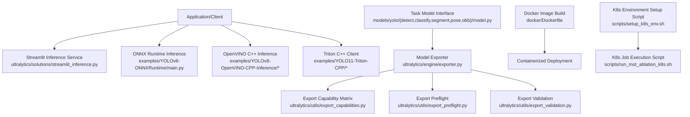

Diagram source
- [ultralytics/engine/exporter.py](file://ultralytics/engine/exporter.py)
- [ultralytics/utils/export_capabilities.py](file://ultralytics/utils/export_capabilities.py)
- [ultralytics/utils/export_preflight.py](file://ultralytics/utils/export_preflight.py)
- [ultralytics/utils/export_validation.py](file://ultralytics/utils/export_validation.py)
- [ultralytics/models/yolo/detect/model.py](file://ultralytics/models/yolo/detect/model.py)
- [ultralytics/models/yolo/classify/model.py](file://ultralytics/models/yolo/classify/model.py)
- [ultralytics/models/yolo/segment/model.py](file://ultralytics/models/yolo/segment/model.py)
- [ultralytics/models/yolo/pose/model.py](file://ultralytics/models/yolo/pose/model.py)
- [ultralytics/models/yolo/obb/model.py](file://ultralytics/models/yolo/obb/model.py)
- [examples/YOLOv8-ONNXRuntime/main.py](file://examples/YOLOv8-ONNXRuntime/main.py)
- [examples/YOLOv8-OpenVINO-CPP-Inference/inference.h](file://examples/YOLOv8-OpenVINO-CPP-Inference/inference.h)
- [examples/YOLOv8-OpenVINO-CPP-Inference/inference.cc](file://examples/YOLOv8-OpenVINO-CPP-Inference/inference.cc)
- [examples/YOLOv8-OpenVINO-CPP-Inference/main.cc](file://examples/YOLOv8-OpenVINO-CPP-Inference/main.cc)
- [examples/YOLO11-Triton-CPP/inference.hpp](file://examples/YOLO11-Triton-CPP/inference.hpp)
- [examples/YOLO11-Triton-CPP/inference.cpp](file://examples/YOLO11-Triton-CPP/inference.cpp)
- [examples/YOLO11-Triton-CPP/main.cpp](file://examples/YOLO11-Triton-CPP/main.cpp)
- [docker/Dockerfile](file://docker/Dockerfile)
- [scripts/setup_k8s_env.sh](file://scripts/setup_k8s_env.sh)
- [scripts/run_mot_ablation_k8s.sh](file://scripts/run_mot_ablation_k8s.sh)

Section source
- [README.md](file://README.md)
- [examples/README.md](file://examples/README.md)
- [docs/en/integrations/index.md](file://docs/en/integrations/index.md)

## Core Components
- Exporter and capability matrix
  - exporter.py provides a unified export entry, internally combining export preflight, capability matrix parsing, and post-export validation, abstracting backend differences.
  - export_capabilities.py maintains the export capability matrix for determining whether a specific task/model supports a backend format.
  - export_preflight.py handles pre-export environment and parameter validation to avoid invalid exports.
  - export_validation.py handles post-export result consistency or basic correctness validation.
- Task model interface
  - models/yolo/{detect, classify, segment, pose, obb}/model.py are model classes for different tasks, exposing unified interfaces for training, validation, prediction, and export, called by the exporter.
- Example inference
  - ONNX Runtime Python example: examples/YOLOv8-ONNXRuntime/main.py demonstrates loading an ONNX model for inference.
  - OpenVINO C++ example: examples/YOLOv8-OpenVINO-CPP-Inference/* demonstrates C++ inference using the OpenVINO runtime.
  - Triton C++ example: examples/YOLO11-Triton-CPP/* demonstrates client implementation interacting with Triton via gRPC/HTTP.
- Service and solutions
  - streamlit_inference.py provides a lightweight Streamlit-based web inference interface.
  - queue_management.py provides a queue management component for connecting to message queues or asynchronous processing.
  - analytics.py provides basic analytics metric collection and visualization assistance.

Section source
- [ultralytics/engine/exporter.py](file://ultralytics/engine/exporter.py)
- [ultralytics/utils/export_capabilities.py](file://ultralytics/utils/export_capabilities.py)
- [ultralytics/utils/export_preflight.py](file://ultralytics/utils/export_preflight.py)
- [ultralytics/utils/export_validation.py](file://ultralytics/utils/export_validation.py)
- [ultralytics/models/yolo/detect/model.py](file://ultralytics/models/yolo/detect/model.py)
- [ultralytics/models/yolo/classify/model.py](file://ultralytics/models/yolo/classify/model.py)
- [ultralytics/models/yolo/segment/model.py](file://ultralytics/models/yolo/segment/model.py)
- [ultralytics/models/yolo/pose/model.py](file://ultralytics/models/yolo/pose/model.py)
- [ultralytics/models/yolo/obb/model.py](file://ultralytics/models/yolo/obb/model.py)
- [examples/YOLOv8-ONNXRuntime/main.py](file://examples/YOLOv8-ONNXRuntime/main.py)
- [examples/YOLOv8-OpenVINO-CPP-Inference/inference.h](file://examples/YOLOv8-OpenVINO-CPP-Inference/inference.h)
- [examples/YOLOv8-OpenVINO-CPP-Inference/inference.cc](file://examples/YOLOv8-OpenVINO-CPP-Inference/inference.cc)
- [examples/YOLOv8-OpenVINO-CPP-Inference/main.cc](file://examples/YOLOv8-OpenVINO-CPP-Inference/main.cc)
- [examples/YOLO11-Triton-CPP/inference.hpp](file://examples/YOLO11-Triton-CPP/inference.hpp)
- [examples/YOLO11-Triton-CPP/inference.cpp](file://examples/YOLO11-Triton-CPP/inference.cpp)
- [examples/YOLO11-Triton-CPP/main.cpp](file://examples/YOLO11-Triton-CPP/main.cpp)
- [ultralytics/solutions/streamlit_inference.py](file://ultralytics/solutions/streamlit_inference.py)
- [ultralytics/solutions/queue_management.py](file://ultralytics/solutions/queue_management.py)
- [ultralytics/solutions/analytics.py](file://ultralytics/solutions/analytics.py)

## Architecture Overview
The following diagram shows the overall architecture from model export to multi-backend inference and service deployment. The exporter serves as the hub, coordinating task models and the export capability matrix to generate target formats; clients or servers select appropriate backends based on the deployment environment; the web and solution layer provides user-friendly interfaces and extension points.

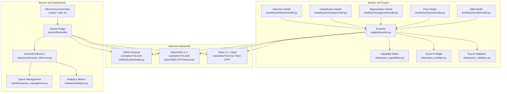

Diagram source
- [ultralytics/engine/exporter.py](file://ultralytics/engine/exporter.py)
- [ultralytics/utils/export_capabilities.py](file://ultralytics/utils/export_capabilities.py)
- [ultralytics/utils/export_preflight.py](file://ultralytics/utils/export_preflight.py)
- [ultralytics/utils/export_validation.py](file://ultralytics/utils/export_validation.py)
- [ultralytics/models/yolo/detect/model.py](file://ultralytics/models/yolo/detect/model.py)
- [ultralytics/models/yolo/classify/model.py](file://ultralytics/models/yolo/classify/model.py)
- [ultralytics/models/yolo/segment/model.py](file://ultralytics/models/yolo/segment/model.py)
- [ultralytics/models/yolo/pose/model.py](file://ultralytics/models/yolo/pose/model.py)
- [ultralytics/models/yolo/obb/model.py](file://ultralytics/models/yolo/obb/model.py)
- [examples/YOLOv8-ONNXRuntime/main.py](file://examples/YOLOv8-ONNXRuntime/main.py)
- [examples/YOLOv8-OpenVINO-CPP-Inference/inference.h](file://examples/YOLOv8-OpenVINO-CPP-Inference/inference.h)
- [examples/YOLOv8-OpenVINO-CPP-Inference/inference.cc](file://examples/YOLOv8-OpenVINO-CPP-Inference/inference.cc)
- [examples/YOLOv8-OpenVINO-CPP-Inference/main.cc](file://examples/YOLOv8-OpenVINO-CPP-Inference/main.cc)
- [examples/YOLO11-Triton-CPP/inference.hpp](file://examples/YOLO11-Triton-CPP/inference.hpp)
- [examples/YOLO11-Triton-CPP/inference.cpp](file://examples/YOLO11-Triton-CPP/inference.cpp)
- [examples/YOLO11-Triton-CPP/main.cpp](file://examples/YOLO11-Triton-CPP/main.cpp)
- [ultralytics/solutions/streamlit_inference.py](file://ultralytics/solutions/streamlit_inference.py)
- [ultralytics/solutions/queue_management.py](file://ultralytics/solutions/queue_management.py)
- [ultralytics/solutions/analytics.py](file://ultralytics/solutions/analytics.py)
- [docker/Dockerfile](file://docker/Dockerfile)
- [scripts/setup_k8s_env.sh](file://scripts/setup_k8s_env.sh)
- [scripts/run_mot_ablation_k8s.sh](file://scripts/run_mot_ablation_k8s.sh)

## Detailed Component Analysis

### Exporter and Capability Matrix (Export Pipeline)
The exporter integrates the task model interface and export capability matrix, executing pre-export preflight and post-export validation to ensure output format compatibility with the target backend.

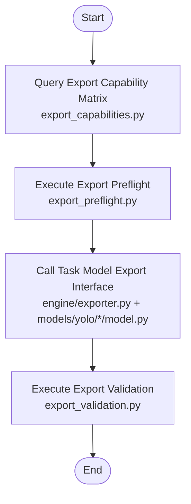

Diagram source
- [ultralytics/engine/exporter.py](file://ultralytics/engine/exporter.py)
- [ultralytics/utils/export_capabilities.py](file://ultralytics/utils/export_capabilities.py)
- [ultralytics/utils/export_preflight.py](file://ultralytics/utils/export_preflight.py)
- [ultralytics/utils/export_validation.py](file://ultralytics/utils/export_validation.py)
- [ultralytics/models/yolo/detect/model.py](file://ultralytics/models/yolo/detect/model.py)
- [ultralytics/models/yolo/classify/model.py](file://ultralytics/models/yolo/classify/model.py)
- [ultralytics/models/yolo/segment/model.py](file://ultralytics/models/yolo/segment/model.py)
- [ultralytics/models/yolo/pose/model.py](file://ultralytics/models/yolo/pose/model.py)
- [ultralytics/models/yolo/obb/model.py](file://ultralytics/models/yolo/obb/model.py)

Section source
- [ultralytics/engine/exporter.py](file://ultralytics/engine/exporter.py)
- [ultralytics/utils/export_capabilities.py](file://ultralytics/utils/export_capabilities.py)
- [ultralytics/utils/export_preflight.py](file://ultralytics/utils/export_preflight.py)
- [ultralytics/utils/export_validation.py](file://ultralytics/utils/export_validation.py)
- [ultralytics/models/yolo/detect/model.py](file://ultralytics/models/yolo/detect/model.py)
- [ultralytics/models/yolo/classify/model.py](file://ultralytics/models/yolo/classify/model.py)
- [ultralytics/models/yolo/segment/model.py](file://ultralytics/models/yolo/segment/model.py)
- [ultralytics/models/yolo/pose/model.py](file://ultralytics/models/yolo/pose/model.py)
- [ultralytics/models/yolo/obb/model.py](file://ultralytics/models/yolo/obb/model.py)

### ONNX Runtime Integration (Python)
The ONNX Runtime example demonstrates how to load an exported ONNX model and perform inference. This path is suitable for quick integration and validation in Python environments.

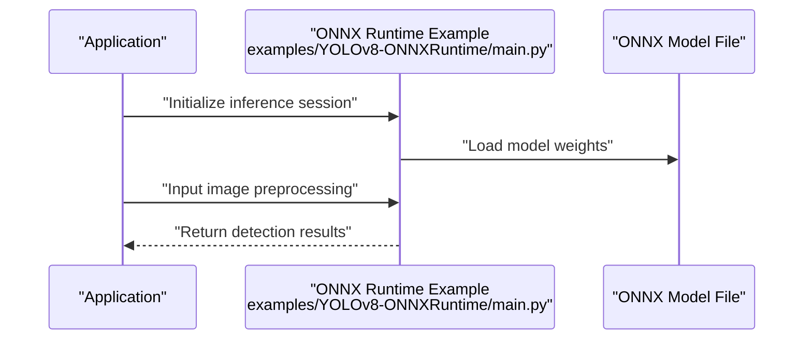

Diagram source
- [examples/YOLOv8-ONNXRuntime/main.py](file://examples/YOLOv8-ONNXRuntime/main.py)
- [examples/YOLOv8-ONNXRuntime/requirements.txt](file://examples/YOLOv8-ONNXRuntime/requirements.txt)

Section source
- [examples/YOLOv8-ONNXRuntime/main.py](file://examples/YOLOv8-ONNXRuntime/main.py)
- [examples/YOLOv8-ONNXRuntime/requirements.txt](file://examples/YOLOv8-ONNXRuntime/requirements.txt)

### OpenVINO C++ Integration
The OpenVINO C++ example demonstrates inference using the OpenVINO runtime in a C++ environment, suitable for embedded and low-latency scenarios.

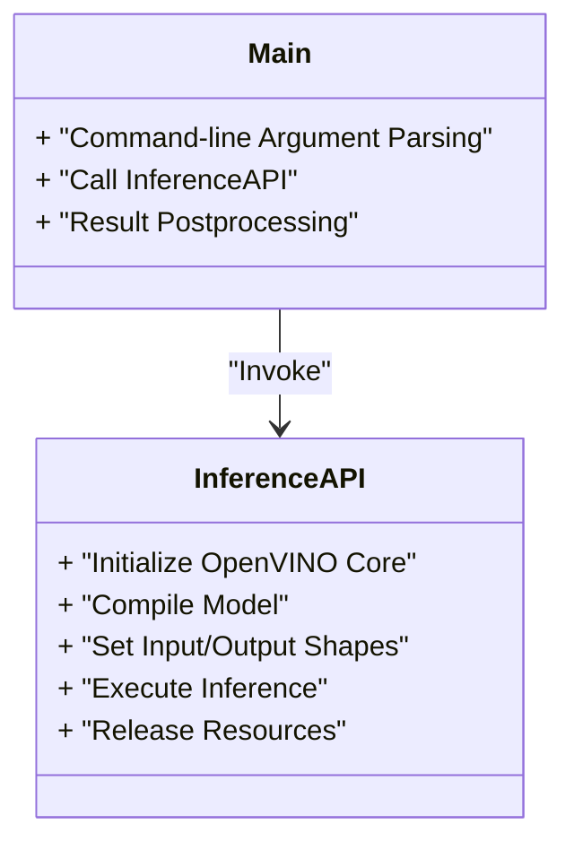

Diagram source
- [examples/YOLOv8-OpenVINO-CPP-Inference/inference.h](file://examples/YOLOv8-OpenVINO-CPP-Inference/inference.h)
- [examples/YOLOv8-OpenVINO-CPP-Inference/inference.cc](file://examples/YOLOv8-OpenVINO-CPP-Inference/inference.cc)
- [examples/YOLOv8-OpenVINO-CPP-Inference/main.cc](file://examples/YOLOv8-OpenVINO-CPP-Inference/main.cc)

Section source
- [examples/YOLOv8-OpenVINO-CPP-Inference/inference.h](file://examples/YOLOv8-OpenVINO-CPP-Inference/inference.h)
- [examples/YOLOv8-OpenVINO-CPP-Inference/inference.cc](file://examples/YOLOv8-OpenVINO-CPP-Inference/inference.cc)
- [examples/YOLOv8-OpenVINO-CPP-Inference/main.cc](file://examples/YOLOv8-OpenVINO-CPP-Inference/main.cc)

### Rust Integration (ONNX Runtime)
The Rust example demonstrates how to integrate ONNX Runtime for inference in a Rust project, suitable for scenarios with strict memory and performance requirements.

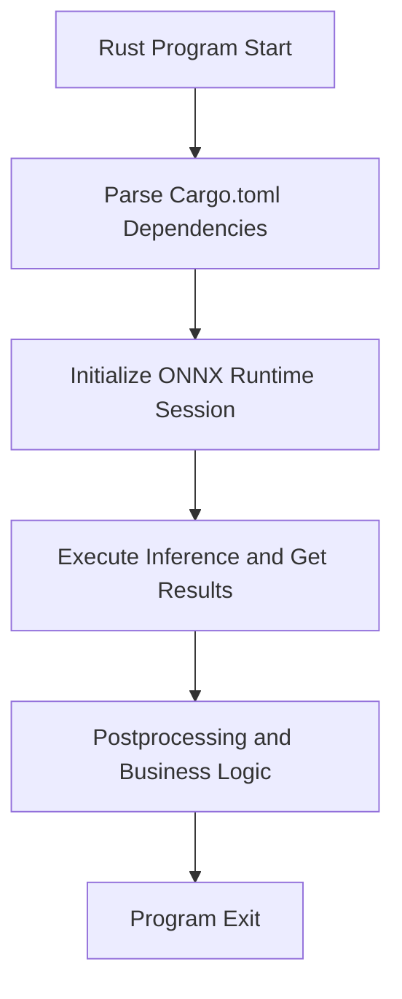

Diagram source
- [examples/YOLO-Series-ONNXRuntime-Rust/src/lib.rs](file://examples/YOLO-Series-ONNXRuntime-Rust/src/lib.rs)
- [examples/YOLO-Series-ONNXRuntime-Rust/Cargo.toml](file://examples/YOLO-Series-ONNXRuntime-Rust/Cargo.toml)

Section source
- [examples/YOLO-Series-ONNXRuntime-Rust/src/lib.rs](file://examples/YOLO-Series-ONNXRuntime-Rust/src/lib.rs)
- [examples/YOLO-Series-ONNXRuntime-Rust/Cargo.toml](file://examples/YOLO-Series-ONNXRuntime-Rust/Cargo.toml)

### Triton Integration (C++ Client)
The Triton example demonstrates how to interact with the Triton Inference Server via gRPC/HTTP, suitable for high-concurrency and distributed deployment.

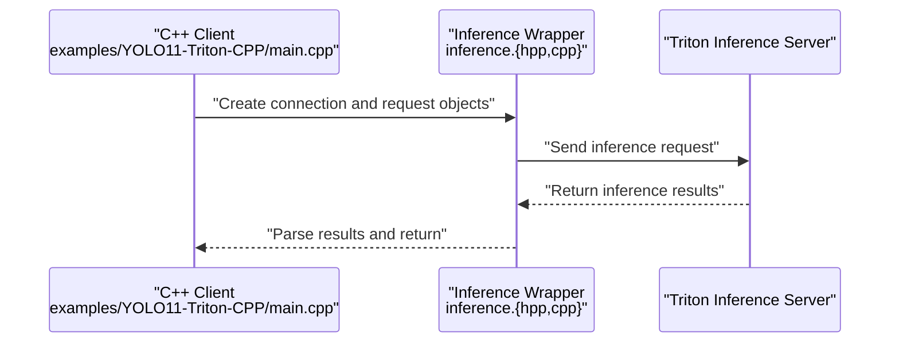

Diagram source
- [examples/YOLO11-Triton-CPP/main.cpp](file://examples/YOLO11-Triton-CPP/main.cpp)
- [examples/YOLO11-Triton-CPP/inference.hpp](file://examples/YOLO11-Triton-CPP/inference.hpp)
- [examples/YOLO11-Triton-CPP/inference.cpp](file://examples/YOLO11-Triton-CPP/inference.cpp)

Section source
- [examples/YOLO11-Triton-CPP/main.cpp](file://examples/YOLO11-Triton-CPP/main.cpp)
- [examples/YOLO11-Triton-CPP/inference.hpp](file://examples/YOLO11-Triton-CPP/inference.hpp)
- [examples/YOLO11-Triton-CPP/inference.cpp](file://examples/YOLO11-Triton-CPP/inference.cpp)

### Web Service and Solutions
Streamlit inference provides a lightweight web interface, combined with queue management and analytics metrics, for quickly building online inference services.

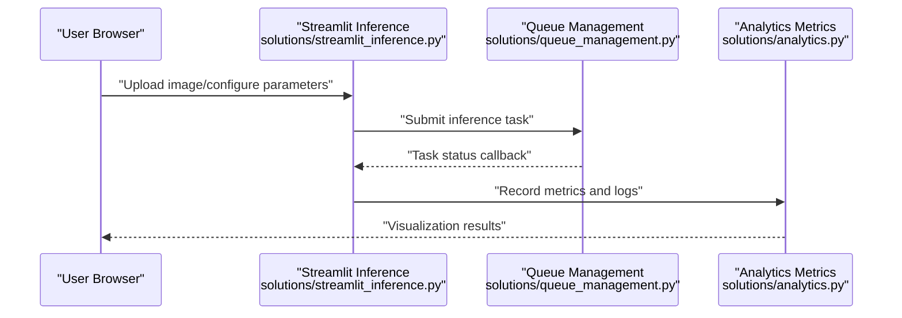

Diagram source
- [ultralytics/solutions/streamlit_inference.py](file://ultralytics/solutions/streamlit_inference.py)
- [ultralytics/solutions/queue_management.py](file://ultralytics/solutions/queue_management.py)
- [ultralytics/solutions/analytics.py](file://ultralytics/solutions/analytics.py)

Section source
- [ultralytics/solutions/streamlit_inference.py](file://ultralytics/solutions/streamlit_inference.py)
- [ultralytics/solutions/queue_management.py](file://ultralytics/solutions/queue_management.py)
- [ultralytics/solutions/analytics.py](file://ultralytics/solutions/analytics.py)

### Containerization and Kubernetes Orchestration
The Dockerfile provides the image build foundation, and K8s scripts are used for environment preparation and job execution, forming an end-to-end deployment closed loop.

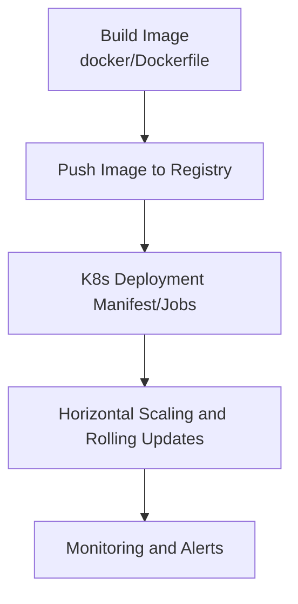

Diagram source
- [docker/Dockerfile](file://docker/Dockerfile)
- [scripts/setup_k8s_env.sh](file://scripts/setup_k8s_env.sh)
- [scripts/run_mot_ablation_k8s.sh](file://scripts/run_mot_ablation_k8s.sh)

Section source
- [docker/Dockerfile](file://docker/Dockerfile)
- [scripts/setup_k8s_env.sh](file://scripts/setup_k8s_env.sh)
- [scripts/run_mot_ablation_k8s.sh](file://scripts/run_mot_ablation_k8s.sh)

### CI/CD and Automated Testing
The repository includes tests for export capability matrix, pre/post-export validation, auto backend warmup, and integration use cases, which can serve as quality gates in CI/CD pipelines.

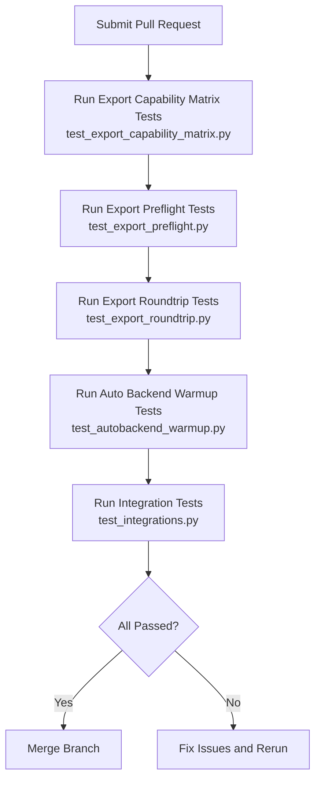

Diagram source
- [tests/test_export_capability_matrix.py](file://tests/test_export_capability_matrix.py)
- [tests/test_export_preflight.py](file://tests/test_export_preflight.py)
- [tests/test_export_roundtrip.py](file://tests/test_export_roundtrip.py)
- [tests/test_autobackend_warmup.py](file://tests/test_autobackend_warmup.py)
- [tests/test_integrations.py](file://tests/test_integrations.py)

Section source
- [tests/test_export_capability_matrix.py](file://tests/test_export_capability_matrix.py)
- [tests/test_export_preflight.py](file://tests/test_export_preflight.py)
- [tests/test_export_roundtrip.py](file://tests/test_export_roundtrip.py)
- [tests/test_autobackend_warmup.py](file://tests/test_autobackend_warmup.py)
- [tests/test_integrations.py](file://tests/test_integrations.py)

## Dependency Analysis
- The exporter depends on task model interfaces and the export capability matrix, ensuring consistency and maintainability of the export workflow.
- Example inference and solution layers depend on their respective backend libraries (e.g., ONNX Runtime, OpenVINO, Triton), declaring dependencies through requirements.txt or Cargo.toml.
- Deployment and operations scripts depend on system tools (e.g., docker, kubectl), with quickstart guides provided in the documentation.

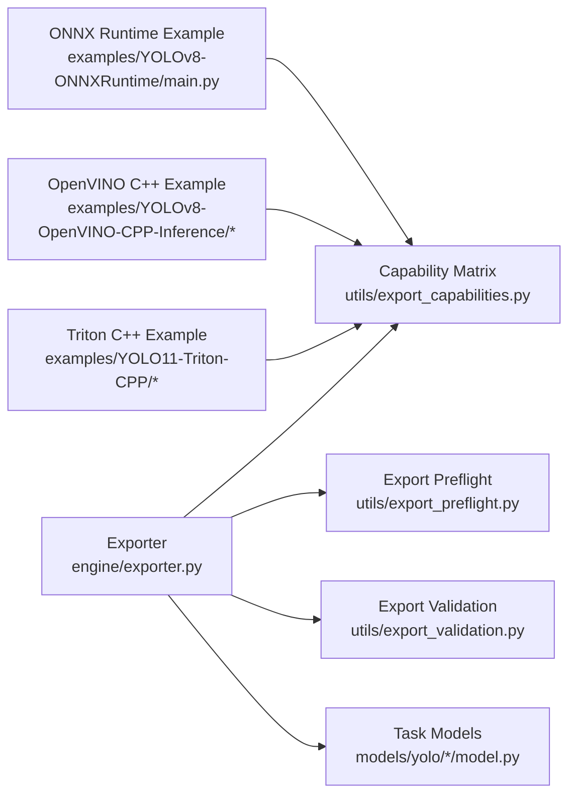

Diagram source
- [ultralytics/engine/exporter.py](file://ultralytics/engine/exporter.py)
- [ultralytics/utils/export_capabilities.py](file://ultralytics/utils/export_capabilities.py)
- [ultralytics/utils/export_preflight.py](file://ultralytics/utils/export_preflight.py)
- [ultralytics/utils/export_validation.py](file://ultralytics/utils/export_validation.py)
- [ultralytics/models/yolo/detect/model.py](file://ultralytics/models/yolo/detect/model.py)
- [ultralytics/models/yolo/classify/model.py](file://ultralytics/models/yolo/classify/model.py)
- [ultralytics/models/yolo/segment/model.py](file://ultralytics/models/yolo/segment/model.py)
- [ultralytics/models/yolo/pose/model.py](file://ultralytics/models/yolo/pose/model.py)
- [ultralytics/models/yolo/obb/model.py](file://ultralytics/models/yolo/obb/model.py)
- [examples/YOLOv8-ONNXRuntime/main.py](file://examples/YOLOv8-ONNXRuntime/main.py)
- [examples/YOLOv8-OpenVINO-CPP-Inference/inference.h](file://examples/YOLOv8-OpenVINO-CPP-Inference/inference.h)
- [examples/YOLOv8-OpenVINO-CPP-Inference/inference.cc](file://examples/YOLOv8-OpenVINO-CPP-Inference/inference.cc)
- [examples/YOLOv8-OpenVINO-CPP-Inference/main.cc](file://examples/YOLOv8-OpenVINO-CPP-Inference/main.cc)
- [examples/YOLO11-Triton-CPP/inference.hpp](file://examples/YOLO11-Triton-CPP/inference.hpp)
- [examples/YOLO11-Triton-CPP/inference.cpp](file://examples/YOLO11-Triton-CPP/inference.cpp)
- [examples/YOLO11-Triton-CPP/main.cpp](file://examples/YOLO11-Triton-CPP/main.cpp)

Section source
- [pyproject.toml](file://pyproject.toml)
- [examples/YOLOv8-ONNXRuntime/requirements.txt](file://examples/YOLOv8-ONNXRuntime/requirements.txt)
- [examples/YOLO-Series-ONNXRuntime-Rust/Cargo.toml](file://examples/YOLO-Series-ONNXRuntime-Rust/Cargo.toml)

## Performance Considerations
- Export phase
  - Use capability matrix and preflight to reduce invalid exports, improving iteration efficiency.
  - Select appropriate optimization options for different backends (e.g., graph operator fusion, quantization), referencing export validation results.
- Inference phase
  - ONNX Runtime: Properly set thread count and execution providers, utilize batching to improve throughput.
  - OpenVINO: Enable hardware acceleration and model caching to reduce cold start latency.
  - Triton: Configure instance count and dynamic batching, optimize network overhead with gRPC/HTTP protocol stack.
- Service and deployment
  - Use containerization to isolate dependencies, combined with K8s horizontal scaling and rolling updates to improve availability.
  - Introduce queue management and analytics metrics, monitor P95/P99 latency and error rates, scale or rollback promptly.

[This section provides general guidance and does not directly analyze specific files]

## Troubleshooting Guide
- Export failure
  - Check whether the export capability matrix supports the target backend and task type.
  - Review export preflight logs, confirming input shape, data type, and device compatibility.
  - Run export validation, comparing output consistency between the original and exported models.
- Inference anomalies
  - Verify backend version and dependencies (requirements.txt/Cargo.toml).
  - Check whether input preprocessing and postprocessing match the export configuration.
  - For Triton, confirm server-side model configuration matches client request format.
- Deployment issues
  - Validate Docker image build artifacts and environment variables.
  - Check K8s job logs and resource quotas, adjust replica count and resource limits if necessary.

Section source
- [ultralytics/utils/export_capabilities.py](file://ultralytics/utils/export_capabilities.py)
- [ultralytics/utils/export_preflight.py](file://ultralytics/utils/export_preflight.py)
- [ultralytics/utils/export_validation.py](file://ultralytics/utils/export_validation.py)
- [examples/YOLOv8-ONNXRuntime/requirements.txt](file://examples/YOLOv8-ONNXRuntime/requirements.txt)
- [examples/YOLO-Series-ONNXRuntime-Rust/Cargo.toml](file://examples/YOLO-Series-ONNXRuntime-Rust/Cargo.toml)
- [docker/Dockerfile](file://docker/Dockerfile)
- [scripts/setup_k8s_env.sh](file://scripts/setup_k8s_env.sh)

## Conclusion
YOLO-Master provides a complete ecosystem from model export to multi-backend inference and service deployment. With the unified exporter and capability matrix, developers can efficiently connect to TensorFlow, PyTorch, ONNX Runtime, OpenVINO, Triton, and other backends; through C++ and Rust examples, meet high-performance and low-latency requirements; combined with Streamlit, queue management, and analytics metrics, quickly build web services; leveraging Docker and K8s scripts, complete containerization and orchestration; and ensure quality with comprehensive test coverage. It is recommended to follow best practices of export preflight and validation, performance tuning, and monitoring/alerts in production environments, continuously iterating and optimizing.

[This section is a summary and does not directly analyze specific files]

## Appendix
- Official integration documentation
  - Integration index: docs/en/integrations/index.md
  - Docker quickstart: docs/en/guides/docker-quickstart.md
  - Triton Inference Server: docs/en/guides/triton-inference-server.md
  - Model deployment options and practices: docs/en/guides/model-deployment-options.md, docs/en/guides/model-deployment-practices.md
  - Model monitoring and maintenance: docs/en/guides/model-monitoring-and-maintenance.md
  - Platform deployment entry: docs/en/platform/deploy/index.md
- Examples and technical reports
  - Cross-platform edge deployment technical report: examples/YOLO-Master-Cross-Platform-Edge-Deployment/TECHNICAL_REPORT.md
  - Examples overview: examples/README.md

Section source
- [docs/en/integrations/index.md](file://docs/en/integrations/index.md)
- [docs/en/guides/docker-quickstart.md](file://docs/en/guides/docker-quickstart.md)
- [docs/en/guides/triton-inference-server.md](file://docs/en/guides/triton-inference-server.md)
- [docs/en/guides/model-deployment-options.md](file://docs/en/guides/model-deployment-options.md)
- [docs/en/guides/model-deployment-practices.md](file://docs/en/guides/model-deployment-practices.md)
- [docs/en/guides/model-monitoring-and-maintenance.md](file://docs/en/guides/model-monitoring-and-maintenance.md)
- [docs/en/platform/deploy/index.md](file://docs/en/platform/deploy/index.md)
- [examples/YOLO-Master-Cross-Platform-Edge-Deployment/TECHNICAL_REPORT.md](file://examples/YOLO-Master-Cross-Platform-Edge-Deployment/TECHNICAL_REPORT.md)
- [examples/README.md](file://examples/README.md)
