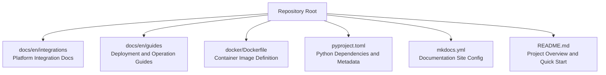
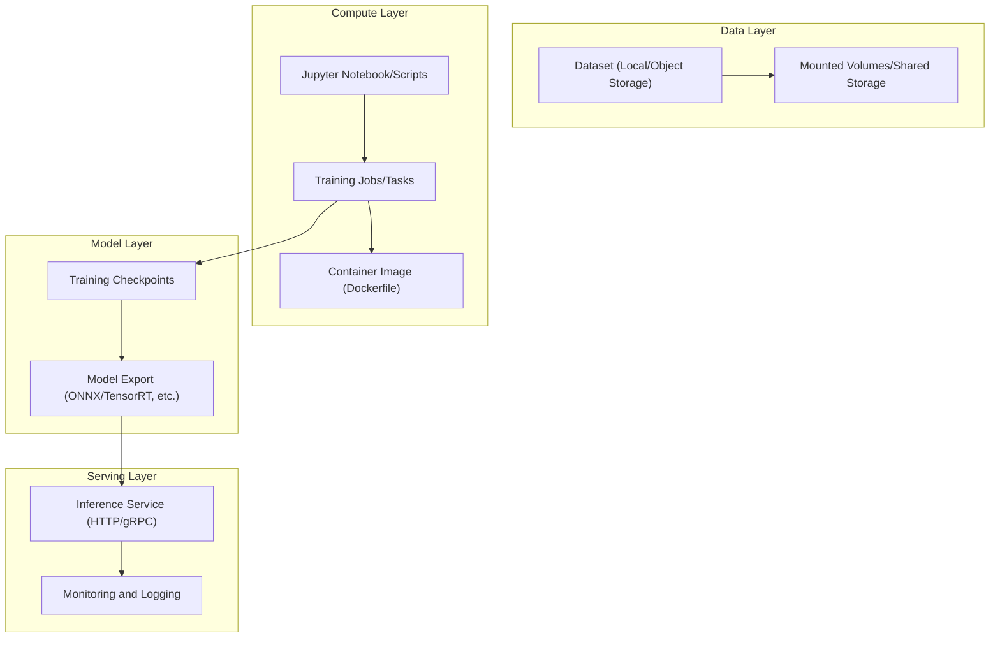
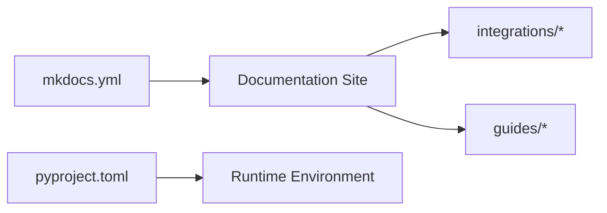

# Cloud Platform Integration

<cite>
**Files referenced in this document**
- [amazon-sagemaker.md](file://docs/en/integrations/amazon-sagemaker.md)
- [google-colab.md](file://docs/en/integrations/google-colab.md)
- [kaggle.md](file://docs/en/integrations/kaggle.md)
- [azureml-quickstart.md](file://docs/en/guides/azureml-quickstart.md)
- [vertex-ai-deployment-with-docker.md](file://docs/en/guides/vertex-ai-deployment-with-docker.md)
- [docker/Dockerfile](file://docker/Dockerfile)
- [mkdocs.yml](file://mkdocs.yml)
- [pyproject.toml](file://pyproject.toml)
- [README.md](file://README.md)
</cite>

## Table of Contents
1. [Introduction](#introduction)
2. [Project Structure](#project-structure)
3. [Core Components](#core-components)
4. [Architecture Overview](#architecture-overview)
5. [Detailed Component Analysis](#detailed-component-analysis)
6. [Dependency Analysis](#dependency-analysis)
7. [Performance Considerations](#performance-considerations)
8. [Troubleshooting Guide](#troubleshooting-guide)
9. [Conclusion](#conclusion)
10. [Appendix](#appendix)

## Introduction
This document is intended for engineers deploying and running YOLO-Master on mainstream cloud platforms, providing an end-to-end integration and deployment guide. The content covers configuration and usage workflows for platforms including AWS SageMaker, Google Vertex AI, Azure ML, Google Colab, and Kaggle, including data upload/download, model training, inference serving, GPU instance selection and optimization, cost optimization recommendations, error handling and debugging tips, along with reusable Jupyter Notebook examples and automation script paths.

## Project Structure
The YOLO-Master repository provides multi-platform integration documentation and container image build entry points for quickly setting up training and inference environments on various cloud platforms:
- Platform integration documentation is located under docs/en/integrations and docs/en/guides, corresponding to getting started and deployment guides for each cloud platform.
- Container image definitions are located at docker/Dockerfile, used for packaging training and inference dependencies.
- Project metadata and dependency declarations are in pyproject.toml; documentation site configuration is in mkdocs.yml.
- README.md provides overall description and quick start guidance.

Diagram source
- [mkdocs.yml](file://mkdocs.yml)
- [docker/Dockerfile](file://docker/Dockerfile)
- [pyproject.toml](file://pyproject.toml)
- [README.md](file://README.md)

Section source
- [README.md](file://README.md)
- [mkdocs.yml](file://mkdocs.yml)
- [pyproject.toml](file://pyproject.toml)
- [docker/Dockerfile](file://docker/Dockerfile)

## Core Components
- Platform Integration Documentation
  - AWS SageMaker: [amazon-sagemaker.md](file://docs/en/integrations/amazon-sagemaker.md)
  - Google Colab: [google-colab.md](file://docs/en/integrations/google-colab.md)
  - Kaggle: [kaggle.md](file://docs/en/integrations/kaggle.md)
  - Azure ML Quick Start: [azureml-quickstart.md](file://docs/en/guides/azureml-quickstart.md)
  - Vertex AI (Docker Deployment): [vertex-ai-deployment-with-docker.md](file://docs/en/guides/vertex-ai-deployment-with-docker.md)
- Container Image
  - Dockerfile: [docker/Dockerfile](file://docker/Dockerfile)
- Dependencies and Metadata
  - Python packages and dependencies: [pyproject.toml](file://pyproject.toml)
  - Documentation site configuration: [mkdocs.yml](file://mkdocs.yml)

Section source
- [amazon-sagemaker.md](file://docs/en/integrations/amazon-sagemaker.md)
- [google-colab.md](file://docs/en/integrations/google-colab.md)
- [kaggle.md](file://docs/en/integrations/kaggle.md)
- [azureml-quickstart.md](file://docs/en/guides/azureml-quickstart.md)
- [vertex-ai-deployment-with-docker.md](file://docs/en/guides/vertex-ai-deployment-with-docker.md)
- [docker/Dockerfile](file://docker/Dockerfile)
- [pyproject.toml](file://pyproject.toml)
- [mkdocs.yml](file://mkdocs.yml)

## Architecture Overview
The following diagram shows the common workflow on multi-cloud platforms: an end-to-end pipeline from data preparation to training, export, and inference serving. Different platforms drive the same codebase and container images through their respective CLI/console/Notebook interfaces.

Diagram source
- [docker/Dockerfile](file://docker/Dockerfile)
- [amazon-sagemaker.md](file://docs/en/integrations/amazon-sagemaker.md)
- [vertex-ai-deployment-with-docker.md](file://docs/en/guides/vertex-ai-deployment-with-docker.md)
- [azureml-quickstart.md](file://docs/en/guides/azureml-quickstart.md)
- [google-colab.md](file://docs/en/integrations/google-colab.md)
- [kaggle.md](file://docs/en/integrations/kaggle.md)

## Detailed Component Analysis

### AWS SageMaker Integration and Deployment
- Objective
  - Complete data preparation, training, export, and serving on SageMaker Notebook/Training/Endpoint.
- Key Steps
  - Prepare datasets and upload to S3; read or mount via SDK in Notebook.
  - Launch training using SageMaker Training Job, specifying GPU instance type and parallelism strategy.
  - Export training artifacts to deployment formats (e.g., ONNX/TensorRT) and upload to S3.
  - Create SageMaker Endpoint for online inference, or use Batch Transform for offline inference.
- Reference Documentation
  - Platform integration doc: [amazon-sagemaker.md](file://docs/en/integrations/amazon-sagemaker.md)
- Typical Resources
  - Training jobs, S3 buckets, Endpoints, IAM roles, VPC and security groups.
- Best Practices
  - Use GPU-enabled instance families combined with distributed training to improve throughput.
  - Set batch size and learning rate appropriately to avoid out-of-memory errors.
  - Apply quantization and graph optimization to exported models to reduce latency.
- Cost Optimization
  - On-demand + Spot mixed strategy; release Endpoints promptly after training completes.
  - Use tiered storage and lifecycle policies to manage S3 data.

Section source
- [amazon-sagemaker.md](file://docs/en/integrations/amazon-sagemaker.md)

### Google Vertex AI Integration and Deployment
- Objective
  - Use Vertex AI Notebooks, Custom Training Jobs, and Endpoints to complete the end-to-end workflow.
- Key Steps
  - Prepare environment and data (GCS) in Vertex AI Notebooks.
  - Submit Custom Training Job (GPU supported), outputting checkpoints to GCS.
  - Export model and package as container image (based on the Dockerfile in the repository).
  - Deploy as Vertex AI Endpoint for serving.
- Reference Documentation
  - Platform integration doc: [vertex-ai-deployment-with-docker.md](file://docs/en/guides/vertex-ai-deployment-with-docker.md)
- Typical Resources
  - GCS storage buckets, Vertex AI notebooks, custom training jobs, container image registry, Endpoints.
- Best Practices
  - Use pre-built images to accelerate cold starts; enable auto-scaling to handle traffic fluctuations.
  - Leverage TensorBoard and logging systems for observability.
- Cost Optimization
  - Use preemptible VMs for training; elastically scale inference services based on peak demand.

Section source
- [vertex-ai-deployment-with-docker.md](file://docs/en/guides/vertex-ai-deployment-with-docker.md)

### Azure ML Integration and Deployment
- Objective
  - Complete data registration, training, and deployment in Azure ML Workspace.
- Key Steps
  - Register datasets as Azure ML Datastore/Data Asset.
  - Run training scripts using Compute Instance/Cluster, specifying GPU specifications.
  - Register models to Model Registry and deploy as real-time inference services (Managed Online Endpoint).
- Reference Documentation
  - Quick start guide: [azureml-quickstart.md](file://docs/en/guides/azureml-quickstart.md)
- Typical Resources
  - Workspace, Compute, Datastore, Model Registry, Online Endpoint.
- Best Practices
  - Use AML Pipelines to orchestrate data preprocessing, training, and evaluation.
  - Apply serialization optimization and cache warm-up for models.
- Cost Optimization
  - Use Spot nodes for training; dynamically scale inference based on QPS.

Section source
- [azureml-quickstart.md](file://docs/en/guides/azureml-quickstart.md)

### Google Colab Integration and Usage
- Objective
  - Quickly validate and experiment in Colab Notebook, suitable for small-scale training and inference demonstrations.
- Key Steps
  - Install dependencies and clone the repository; mount Google Drive for data persistence.
  - Execute training and export in Notebook; save results to Drive.
- Reference Documentation
  - Platform integration doc: [google-colab.md](file://docs/en/integrations/google-colab.md)
- Notes
  - Be aware of session duration and quota limits; use cloud GPU instances for large model training.
- Best Practices
  - Use %tensorflow_version or pip to install specific versions; enable GPU runtime.
  - Save intermediate artifacts and final models to Drive to avoid loss.

Section source
- [google-colab.md](file://docs/en/integrations/google-colab.md)

### Kaggle Integration and Usage
- Objective
  - Train and share in Kaggle Notebook or Dataset environments.
- Key Steps
  - Create private/public datasets; mount and read in Notebook.
  - Install dependencies and execute training; submit or export results.
- Reference Documentation
  - Platform integration doc: [kaggle.md](file://docs/en/integrations/kaggle.md)
- Notes
  - Comply with network access and external library installation restrictions; prioritize using Kaggle-provided GPU quotas.
- Best Practices
  - Use Kaggle Secrets to manage credentials; split large data into shards to improve loading efficiency.

Section source
- [kaggle.md](file://docs/en/integrations/kaggle.md)

### Container Images and Cross-Platform Consistency
- Objective
  - Ensure consistent training and inference environments through a unified Dockerfile, reducing "works on my machine" issues.
- Key Steps
  - Based on official CUDA/cuDNN base images, install PyTorch and YOLO-Master dependencies.
  - Expose inference ports and provide health checks; place model weights and configuration files in the image or mounted volumes.
- Reference Files
  - Container image definition: [docker/Dockerfile](file://docker/Dockerfile)
- Best Practices
  - Use multi-stage builds to reduce image size; copy only necessary files.
  - Pin dependency versions in the image to ensure reproducibility.

Section source
- [docker/Dockerfile](file://docker/Dockerfile)

## Dependency Analysis
- Documentation Site and Dependencies
  - Documentation site configuration: [mkdocs.yml](file://mkdocs.yml)
  - Python packages and dependencies: [pyproject.toml](file://pyproject.toml)
- Platform Documentation Index
  - Platform integration documentation collection is located in docs/en/integrations and docs/en/guides for unified search and maintenance.

Diagram source
- [mkdocs.yml](file://mkdocs.yml)
- [pyproject.toml](file://pyproject.toml)

Section source
- [mkdocs.yml](file://mkdocs.yml)
- [pyproject.toml](file://pyproject.toml)

## Performance Considerations
- GPU Instance Selection
  - Training: Prioritize GPU instances with high memory and high bandwidth (e.g., A100/V100), combined with multi-GPU parallelism.
  - Inference: Select appropriate instances based on QPS and latency targets; use dedicated inference optimization engines (TensorRT/OpenVINO) when necessary.
- Data I/O
  - Use high-speed disks and parallel DataLoader; place data in nearby storage (S3/GCS/Azure Blob) to reduce cross-region latency.
- Model Export and Optimization
  - Export to ONNX/TensorRT with operator fusion and quantization; perform warm-up before inference.
- Concurrency and Batching
  - Adjust batch size and thread count to balance throughput and memory usage; use asynchronous request queues to improve stability.
- Monitoring and Tuning
  - Collect GPU utilization, memory, I/O wait, and network throughput; combine logs and metrics to locate bottlenecks.

## Troubleshooting Guide
- Common Issues
  - Dependency conflicts: Verify base image and dependency version consistency; pin versions in containers.
  - Out of memory: Reduce batch size, enable gradient accumulation, or decrease input resolution.
  - Slow data loading: Increase data parallelism, use memory mapping or prefetch mechanisms.
  - Inference timeout: Increase instance specifications, enable connection pooling and timeout retries.
- Debugging Tips
  - Execute step by step in Notebook and print key tensor shapes and device information.
  - Use platform logging systems (CloudWatch/Stackdriver/Azure Monitor) to collect training and inference logs.
  - Perform unit tests and regression tests on exported models to ensure frontend-backend consistency.
- Recovery Strategies
  - Periodically save checkpoints and upload to object storage; recover from the latest checkpoint on failure.
  - Enable health checks and auto-restart for inference services.

## Conclusion
By adopting unified container images and standardized workflows across major cloud platforms, YOLO-Master can be efficiently deployed on SageMaker, Vertex AI, Azure ML, Colab, and Kaggle. Following the configuration and best practices in this document enables stable training and low-latency inference while achieving a good balance between cost and performance.

## Appendix
- Quick Start
  - Project overview and quick start: [README.md](file://README.md)
- Related Documentation
  - Platform integration and deployment guides are all located in the docs/en/integrations and docs/en/guides directories, available for reference as needed.
