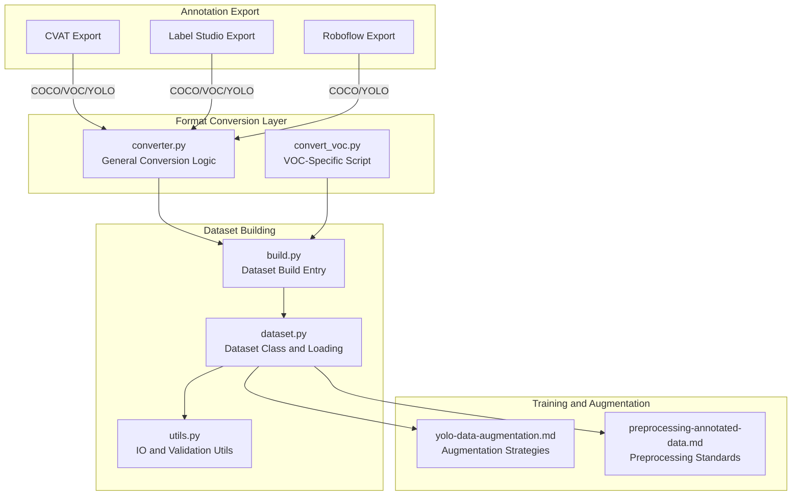
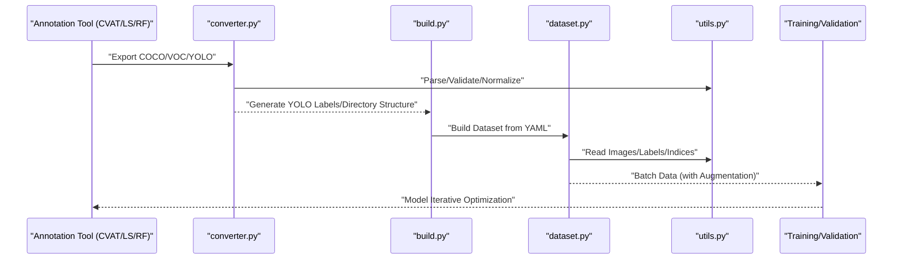
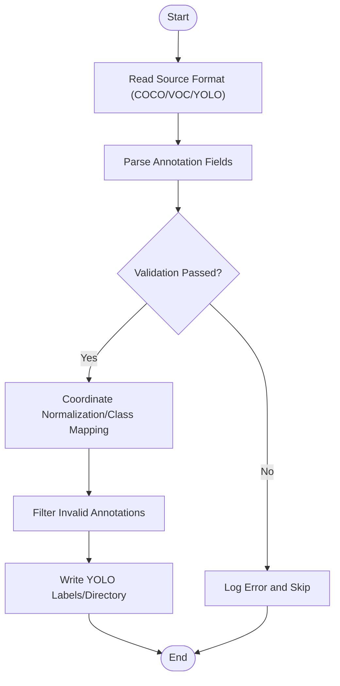
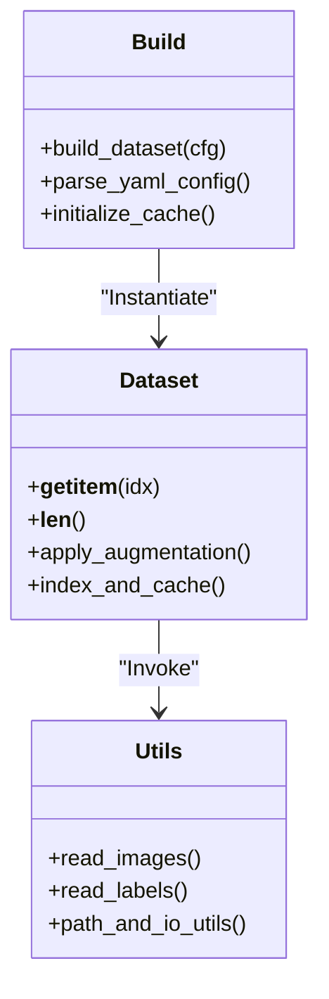
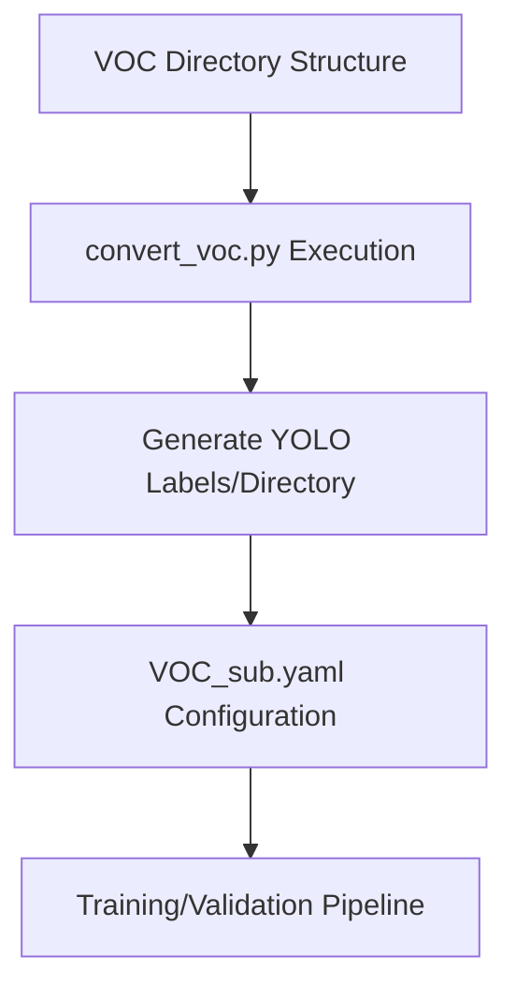
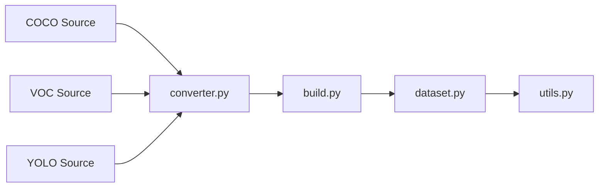

# Data Annotation Tool Integration

<cite>
**Files referenced in this document**
- [ultralytics/data/converter.py](file://ultralytics/data/converter.py)
- [ultralytics/data/dataset.py](file://ultralytics/data/dataset.py)
- [ultralytics/data/build.py](file://ultralytics/data/build.py)
- [ultralytics/data/utils.py](file://ultralytics/data/utils.py)
- [scripts/convert_voc.py](file://scripts/convert_voc.py)
- [scripts/VOC_sub.yaml](file://scripts/VOC_sub.yaml)
- [scripts/_voc_local.yaml](file://scripts/_voc_local.yaml)
- [scripts/_voc_local_v0_13_15.yaml](file://scripts/_voc_local_v0_13_15.yaml)
- [docs/en/guides/coco-to-yolo.md](file://docs/en/guides/coco-to-yolo.md)
- [docs/en/guides/preprocessing-annotated-data.md](file://docs/en/guides/preprocessing-annotated-data.md)
- [docs/en/guides/yolo-data-augmentation.md](file://docs/en/guides/yolo-data-augmentation.md)
- [docs/en/integrations/roboflow.md](file://docs/en/integrations/roboflow.md)
</cite>

## Table of Contents
1. [Introduction](#introduction)
2. [Project Structure](#project-structure)
3. [Core Components](#core-components)
4. [Architecture Overview](#architecture-overview)
5. [Detailed Component Analysis](#detailed-component-analysis)
6. [Dependency Analysis](#dependency-analysis)
7. [Performance Considerations](#performance-considerations)
8. [Troubleshooting Guide](#troubleshooting-guide)
9. [Conclusion](#conclusion)
10. [Appendix](#appendix)

## Introduction
This document focuses on the integration of YOLO-Master with mainstream data annotation tools, covering the conversion and processing workflows for common formats (COCO, Pascal VOC, YOLO) exported by tools such as CVAT, Label Studio, and Roboflow. The documentation provides batch data processing and validation methods, data quality inspection and cleaning recommendations, custom annotation format adaptation guides, and best practices for data augmentation and preprocessing. The content is based on existing implementations and documentation within the repository, helping readers quickly build an integrated data pipeline from annotation to training.

## Project Structure
The core code related to data annotation and format conversion is concentrated in the following locations:
- Data format conversion and general utilities: ultralytics/data/converter.py, ultralytics/data/utils.py
- Dataset loading and building: ultralytics/data/dataset.py, ultralytics/data/build.py
- Pascal VOC related scripts and configurations: scripts/convert_voc.py, scripts/VOC_sub.yaml, scripts/_voc_local*.yaml
- Official guides and best practices: docs/en/guides/coco-to-yolo.md, docs/en/guides/preprocessing-annotated-data.md, docs/en/guides/yolo-data-augmentation.md
- Roboflow integration documentation: docs/en/integrations/roboflow.md

Diagram source
- [ultralytics/data/converter.py](file://ultralytics/data/converter.py)
- [ultralytics/data/build.py](file://ultralytics/data/build.py)
- [ultralytics/data/dataset.py](file://ultralytics/data/dataset.py)
- [ultralytics/data/utils.py](file://ultralytics/data/utils.py)
- [scripts/convert_voc.py](file://scripts/convert_voc.py)
- [docs/en/guides/yolo-data-augmentation.md](file://docs/en/guides/yolo-data-augmentation.md)
- [docs/en/guides/preprocessing-annotated-data.md](file://docs/en/guides/preprocessing-annotated-data.md)

Section source
- [ultralytics/data/converter.py](file://ultralytics/data/converter.py)
- [ultralytics/data/build.py](file://ultralytics/data/build.py)
- [ultralytics/data/dataset.py](file://ultralytics/data/dataset.py)
- [ultralytics/data/utils.py](file://ultralytics/data/utils.py)
- [scripts/convert_voc.py](file://scripts/convert_voc.py)
- [docs/en/guides/coco-to-yolo.md](file://docs/en/guides/coco-to-yolo.md)
- [docs/en/guides/preprocessing-annotated-data.md](file://docs/en/guides/preprocessing-annotated-data.md)
- [docs/en/guides/yolo-data-augmentation.md](file://docs/en/guides/yolo-data-augmentation.md)
- [docs/en/integrations/roboflow.md](file://docs/en/integrations/roboflow.md)

## Core Components
- Format Converter (converter.py)
  - Responsible for uniformly converting external annotation formats (e.g., COCO, VOC, YOLO) into the data organization and label format expected internally by YOLO for subsequent training and evaluation.
  - Typically includes: reading source format, parsing annotation objects, coordinate normalization, class mapping, and outputting YOLO text labels or intermediate representations.
- Dataset Builder (build.py)
  - Serves as the unified entry point for dataset loading, parsing paths, task types, and class definitions from configuration files (YAML), and invoking underlying dataset classes for instantiation and cache management.
- Dataset Class (dataset.py)
  - Encapsulates image and label loading, batching, data augmentation pipeline integration, indexing and caching mechanisms, ensuring efficient access during training/validation phases.
- Utility Functions (utils.py)
  - Provides general I/O, path processing, basic validation, and visualization assistance, reused by converter and dataset modules.
- VOC-Specific Script (convert_voc.py)
  - A batch conversion script targeting Pascal VOC directory structure, facilitating migration from traditional VOC projects to YOLO format.
- Official Guides and Integration Documentation
  - coco-to-yolo.md: COCO to YOLO conversion workflow and considerations.
  - preprocessing-annotated-data.md: Preprocessing standards and common issues for annotated data.
  - yolo-data-augmentation.md: Data augmentation strategies and parameter recommendations.
  - roboflow.md: Practices for exporting and importing YOLO format through the Roboflow platform.

Section source
- [ultralytics/data/converter.py](file://ultralytics/data/converter.py)
- [ultralytics/data/build.py](file://ultralytics/data/build.py)
- [ultralytics/data/dataset.py](file://ultralytics/data/dataset.py)
- [ultralytics/data/utils.py](file://ultralytics/data/utils.py)
- [scripts/convert_voc.py](file://scripts/convert_voc.py)
- [docs/en/guides/coco-to-yolo.md](file://docs/en/guides/coco-to-yolo.md)
- [docs/en/guides/preprocessing-annotated-data.md](file://docs/en/guides/preprocessing-annotated-data.md)
- [docs/en/guides/yolo-data-augmentation.md](file://docs/en/guides/yolo-data-augmentation.md)
- [docs/en/integrations/roboflow.md](file://docs/en/integrations/roboflow.md)

## Architecture Overview
The following diagram shows the end-to-end data flow from annotation tool export to YOLO training, including format conversion, dataset building, augmentation, and preprocessing stages.

Diagram source
- [ultralytics/data/converter.py](file://ultralytics/data/converter.py)
- [ultralytics/data/build.py](file://ultralytics/data/build.py)
- [ultralytics/data/dataset.py](file://ultralytics/data/dataset.py)
- [ultralytics/data/utils.py](file://ultralytics/data/utils.py)

## Detailed Component Analysis

### Format Conversion Component (converter.py)
- Responsibilities
  - Uniformly handles multi-source annotation formats, outputting YOLO-compatible labels and directory structures.
  - Supports class mapping, coordinate normalization, bounding box validity filtering, duplicate removal, etc.
- Key Workflow
  - Input: COCO JSON / VOC XML / YOLO txt, etc.
  - Processing: Parse fields, validate geometry and classes, normalize coordinates, write YOLO labels
  - Output: YOLO directory structure (images/labels), class mapping file (optional)
- Complexity and Performance
  - Time complexity mainly depends on sample count and annotation density; throughput can be improved through parallel reading and batching.
  - Space complexity is affected by caching and intermediate representations; disk caching is recommended for large-scale data.
- Error Handling
  - Records and skips cases of missing fields, invalid coordinates, out-of-bounds bboxes, and non-existent classes, ensuring conversion robustness.

Diagram source
- [ultralytics/data/converter.py](file://ultralytics/data/converter.py)
- [ultralytics/data/utils.py](file://ultralytics/data/utils.py)

Section source
- [ultralytics/data/converter.py](file://ultralytics/data/converter.py)
- [ultralytics/data/utils.py](file://ultralytics/data/utils.py)

### Dataset Building and Loading (build.py + dataset.py)
- build.py
  - Serves as the unified entry point for dataset building, parsing YAML configuration (paths, tasks, classes) and creating corresponding dataset instances.
  - Responsible for caching strategy, sharding, and parallel loading configuration.
- dataset.py
  - Encapsulates image and label reading, indexing, batching, and augmentation pipeline integration.
  - Provides a unified interface for training/validation loop invocation.
- Typical Call Chain
  - Training script -> build() -> Dataset class -> utils reading -> return batch data

Diagram source
- [ultralytics/data/build.py](file://ultralytics/data/build.py)
- [ultralytics/data/dataset.py](file://ultralytics/data/dataset.py)
- [ultralytics/data/utils.py](file://ultralytics/data/utils.py)

Section source
- [ultralytics/data/build.py](file://ultralytics/data/build.py)
- [ultralytics/data/dataset.py](file://ultralytics/data/dataset.py)
- [ultralytics/data/utils.py](file://ultralytics/data/utils.py)

### Pascal VOC Specific Conversion (convert_voc.py and YAML Configuration)
- convert_voc.py
  - Performs batch conversion targeting VOC directory structure (JPEGImages/Annotations, etc.), outputting YOLO labels and directory layout.
  - Suitable for legacy project migration or teams continuing to use VOC workflows.
- VOC_sub.yaml / _voc_local*.yaml
  - Provides example configurations for VOC subsets or local paths, facilitating quick verification of conversion results and training pipelines.
- Usage Recommendations
  - First run the conversion script to generate YOLO format, then proceed with training/validation based on YAML configuration.
  - If class differences exist, adjust nc and names mappings in the YAML.

Diagram source
- [scripts/convert_voc.py](file://scripts/convert_voc.py)
- [scripts/VOC_sub.yaml](file://scripts/VOC_sub.yaml)
- [scripts/_voc_local.yaml](file://scripts/_voc_local.yaml)
- [scripts/_voc_local_v0_13_15.yaml](file://scripts/_voc_local_v0_13_15.yaml)

Section source
- [scripts/convert_voc.py](file://scripts/convert_voc.py)
- [scripts/VOC_sub.yaml](file://scripts/VOC_sub.yaml)
- [scripts/_voc_local.yaml](file://scripts/_voc_local.yaml)
- [scripts/_voc_local_v0_13_15.yaml](file://scripts/_voc_local_v0_13_15.yaml)

### COCO to YOLO Guide (coco-to-yolo.md)
- Key Points
  - Clearly defines the mapping rules from COCO fields to YOLO labels.
  - Emphasizes coordinate normalization, class ID to name mapping, and handling of empty annotations and invalid boxes.
  - Provides batch conversion commands and directory organization recommendations.
- Applicable Scenarios
  - Direct conversion after exporting from COCO standard datasets or platforms (e.g., CVAT/Label Studio/COCO API).

Section source
- [docs/en/guides/coco-to-yolo.md](file://docs/en/guides/coco-to-yolo.md)

### Preprocessing and Data Augmentation (preprocessing-annotated-data.md + yolo-data-augmentation.md)
- Preprocessing Standards
  - Image size uniformity, naming conventions, path consistency, missing value cleanup.
  - Annotation quality checks: overlapping boxes, overly small targets, class inconsistencies, etc.
- Augmentation Strategies
  - Geometric transforms (rotation, flipping, scaling), color transforms, Mosaic/MixUp and other combined augmentations.
  - Select augmentation intensity and probability based on task characteristics, avoiding damage to small targets or pose information.
- Best Practices
  - Disable or reduce augmentation on validation sets to ensure evaluation stability.
  - Use caching and prefetching to reduce IO bottlenecks.

Section source
- [docs/en/guides/preprocessing-annotated-data.md](file://docs/en/guides/preprocessing-annotated-data.md)
- [docs/en/guides/yolo-data-augmentation.md](file://docs/en/guides/yolo-data-augmentation.md)

### Roboflow Integration (roboflow.md)
- Export and Import
  - Export YOLO format through the Roboflow platform for direct use in YOLO-Master training.
  - Alternatively, export COCO/VOC and use built-in converters for secondary processing.
- Version and Compatibility
  - Note field differences across export versions; apply compatibility handling at the conversion layer when necessary.

Section source
- [docs/en/integrations/roboflow.md](file://docs/en/integrations/roboflow.md)

## Dependency Analysis
- Module Coupling
  - converter.py depends on utils.py for basic utilities; build.py drives dataset.py; dataset.py depends on utils.py for I/O.
- External Dependencies
  - Annotation tool export formats (COCO/VOC/YOLO) serve as upstream inputs; training/validation are downstream consumers.
- Potential Risks
  - Large JSON/XML parsing may cause memory pressure; attention to batching and streaming processing is needed.
  - Inconsistent class mappings will cause training failures; strict validation should be performed at the conversion stage.

Diagram source
- [ultralytics/data/converter.py](file://ultralytics/data/converter.py)
- [ultralytics/data/build.py](file://ultralytics/data/build.py)
- [ultralytics/data/dataset.py](file://ultralytics/data/dataset.py)
- [ultralytics/data/utils.py](file://ultralytics/data/utils.py)

Section source
- [ultralytics/data/converter.py](file://ultralytics/data/converter.py)
- [ultralytics/data/build.py](file://ultralytics/data/build.py)
- [ultralytics/data/dataset.py](file://ultralytics/data/dataset.py)
- [ultralytics/data/utils.py](file://ultralytics/data/utils.py)

## Performance Considerations
- I/O Optimization
  - Use caching and prefetching to reduce random disk reads; set workers and batch size appropriately.
- Conversion Efficiency
  - Use streaming parsing for large COCO JSON files; parallel traversal for VOC XML files.
- Memory Control
  - Avoid loading all images into memory at once; read and release on demand.
- Augmentation Overhead
  - Enable augmentation during training, but pay attention to CPU/GPU load balancing; use asynchronous augmentation pipelines when necessary.

[This section provides general guidance and does not directly analyze specific files]

## Troubleshooting Guide
- Conversion Failures
  - Check source format field completeness and coordinate ranges; verify class mapping consistency.
  - Review skip records in logs to locate abnormal samples.
- Training Errors
  - Verify YAML configuration (nc, names, paths); confirm YOLO label format correctness.
  - Validate that image resolution matches label normalization.
- Performance Issues
  - Increase workers, enable caching; check disk IO and network storage latency.
  - Adjust augmentation intensity and ratio to avoid convergence difficulties from overly aggressive augmentation.

Section source
- [ultralytics/data/converter.py](file://ultralytics/data/converter.py)
- [ultralytics/data/build.py](file://ultralytics/data/build.py)
- [ultralytics/data/dataset.py](file://ultralytics/data/dataset.py)
- [ultralytics/data/utils.py](file://ultralytics/data/utils.py)

## Conclusion
By uniformly converting COCO/VOC/YOLO formats exported from annotation tools such as CVAT, Label Studio, and Roboflow into the data organization and label format required by YOLO-Master, combined with strict preprocessing and augmentation strategies, a stable and efficient data pipeline can be built. It is recommended to introduce automated validation and monitoring in production environments to continuously ensure data quality and training stability.

[This section is summary content and does not directly analyze specific files]

## Appendix
- Common Commands and Configuration Examples
  - Refer to the steps and directory organization recommendations in coco-to-yolo.md.
  - Use VOC_sub.yaml and convert_voc.py to complete VOC migration.
- Custom Annotation Format Adaptation
  - Extend new parsers based on converter.py, following the fixed workflow of "parse-validate-normalize-output."
  - Register new format dataset classes in build.py and declare paths and classes in YAML.
- Data Quality Checklist
  - Image integrity, label validity, class consistency, coordinate normalization, duplicate and empty annotation cleanup.

Section source
- [docs/en/guides/coco-to-yolo.md](file://docs/en/guides/coco-to-yolo.md)
- [scripts/convert_voc.py](file://scripts/convert_voc.py)
- [scripts/VOC_sub.yaml](file://scripts/VOC_sub.yaml)
- [ultralytics/data/converter.py](file://ultralytics/data/converter.py)
- [ultralytics/data/build.py](file://ultralytics/data/build.py)
