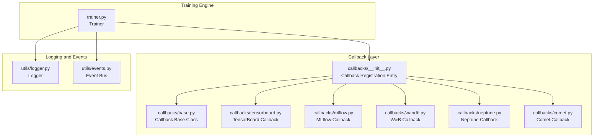
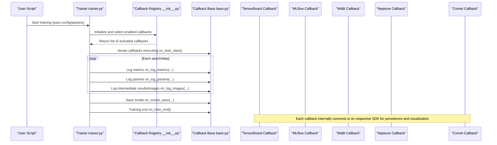
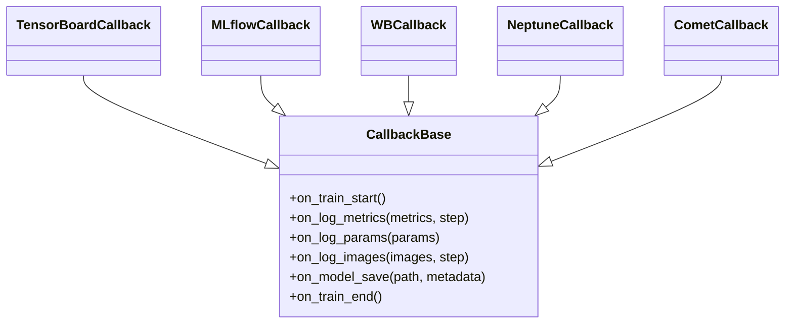
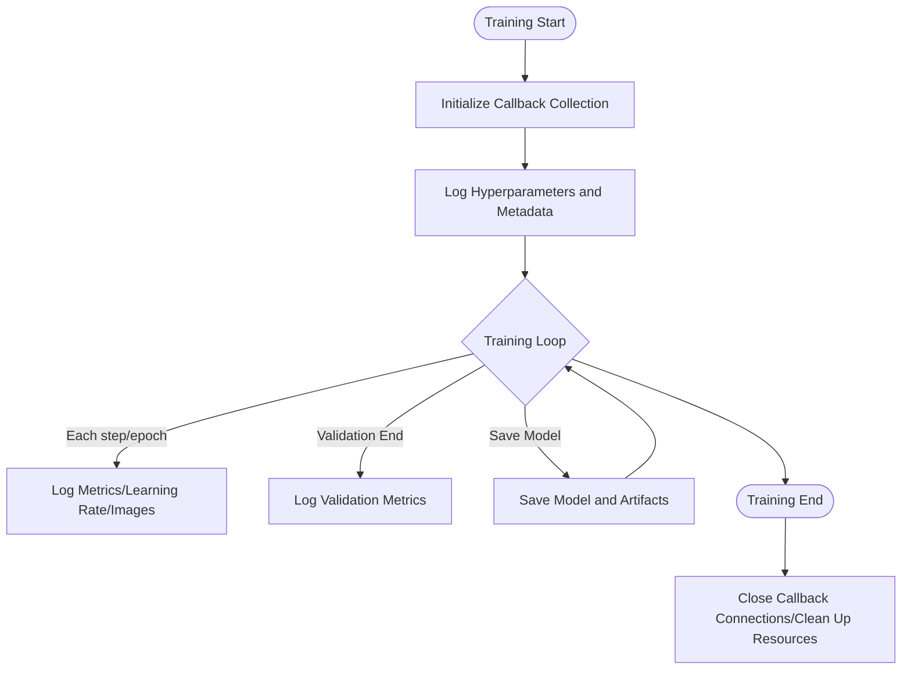
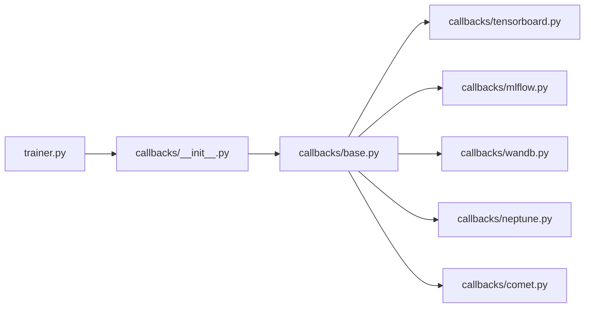

# MLOps Tool Integration

<cite>
**Files referenced in this document**
- [ultralytics/utils/callbacks/__init__.py](file://ultralytics/utils/callbacks/__init__.py)
- [ultralytics/utils/callbacks/base.py](file://ultralytics/utils/callbacks/base.py)
- [ultralytics/utils/callbacks/tensorboard.py](file://ultralytics/utils/callbacks/tensorboard.py)
- [ultralytics/utils/callbacks/mlflow.py](file://ultralytics/utils/callbacks/mlflow.py)
- [ultralytics/utils/callbacks/wandb.py](file://ultralytics/utils/callbacks/wandb.py)
- [ultralytics/utils/callbacks/neptune.py](file://ultralytics/utils/callbacks/neptune.py)
- [ultralytics/utils/callbacks/comet.py](file://ultralytics/utils/callbacks/comet.py)
- [ultralytics/engine/trainer.py](file://ultralytics/engine/trainer.py)
- [ultralytics/utils/logger.py](file://ultralytics/utils/logger.py)
- [ultralytics/utils/events.py](file://ultralytics/utils/events.py)
- [docs/en/integrations/index.md](file://docs/en/integrations/index.md)
- [docs/en/integrations/mlflow.md](file://docs/en/integrations/mlflow.md)
- [docs/en/integrations/weights-biases.md](file://docs/en/integrations/weights-biases.md)
- [docs/en/integrations/tensorboard.md](file://docs/en/integrations/tensorboard.md)
- [docs/en/integrations/neptune.md](file://docs/en/integrations/neptune.md)
- [docs/en/integrations/comet.md](file://docs/en/integrations/comet.md)
</cite>

## Table of Contents
1. [Introduction](#introduction)
2. [Project Structure](#project-structure)
3. [Core Components](#core-components)
4. [Architecture Overview](#architecture-overview)
5. [Detailed Component Analysis](#detailed-component-analysis)
6. [Dependency Analysis](#dependency-analysis)
7. [Performance Considerations](#performance-considerations)
8. [Troubleshooting Guide](#troubleshooting-guide)
9. [Conclusion](#conclusion)
10. [Appendix](#appendix)

## Introduction
This document covers the integration practices between YOLO-Master and mainstream MLOps tools, including experiment tracking and visualization platforms such as MLflow, Weights & Biases (W&B), TensorBoard, Neptune, and Comet. The documentation provides comprehensive guidance on system architecture, callback mechanisms, data flow, configuration and environment variables, cloud platform deployment authentication, monitoring metric extensions, log format customization, performance optimization, and troubleshooting. It also offers actionable example paths and flow diagrams to help readers quickly implement end-to-end training tracking and model version management.

## Project Structure
YOLO-Master decouples each MLOps platform integration in the form of "callbacks," uniformly triggered by the trainer at key lifecycle events. The main locations are as follows:
- The callback registration entry point and base class definitions are located in the callbacks package
- Specific platform callback implementations are in their respective files
- The trainer invokes callbacks during training, validation, saving, and other stages
- Documentation is located under docs/en/integrations, providing platform usage guides

Diagram source
- [ultralytics/engine/trainer.py](file://ultralytics/engine/trainer.py)
- [ultralytics/utils/callbacks/__init__.py](file://ultralytics/utils/callbacks/__init__.py)
- [ultralytics/utils/callbacks/base.py](file://ultralytics/utils/callbacks/base.py)
- [ultralytics/utils/callbacks/tensorboard.py](file://ultralytics/utils/callbacks/tensorboard.py)
- [ultralytics/utils/callbacks/mlflow.py](file://ultralytics/utils/callbacks/mlflow.py)
- [ultralytics/utils/callbacks/wandb.py](file://ultralytics/utils/callbacks/wandb.py)
- [ultralytics/utils/callbacks/neptune.py](file://ultralytics/utils/callbacks/neptune.py)
- [ultralytics/utils/callbacks/comet.py](file://ultralytics/utils/callbacks/comet.py)
- [ultralytics/utils/logger.py](file://ultralytics/utils/logger.py)
- [ultralytics/utils/events.py](file://ultralytics/utils/events.py)

Section source
- [ultralytics/utils/callbacks/__init__.py](file://ultralytics/utils/callbacks/__init__.py)
- [ultralytics/utils/callbacks/base.py](file://ultralytics/utils/callbacks/base.py)
- [ultralytics/engine/trainer.py](file://ultralytics/engine/trainer.py)
- [docs/en/integrations/index.md](file://docs/en/integrations/index.md)

## Core Components
- Callback Base Class and Registration Mechanism
  - All platform callbacks inherit from a unified callback base class, providing consistent interface conventions (e.g., initialization, metric logging, hyperparameter logging, model saving, etc.).
  - The callback registration entry point is responsible for dynamically enabling the appropriate callback instances based on configuration, avoiding unnecessary dependency loading.
- Trainer Integration Points
  - The trainer invokes callback methods at key nodes such as training start, each step/epoch, validation end, model save, and training end, ensuring metrics, weights, hyperparameters, and logs are consistently persisted or reported.
- Logging and Events
  - The logging module is used for structured output of training information; the events module can be used for cross-module notifications, facilitating custom callback extensions.

Section source
- [ultralytics/utils/callbacks/base.py](file://ultralytics/utils/callbacks/base.py)
- [ultralytics/utils/callbacks/__init__.py](file://ultralytics/utils/callbacks/__init__.py)
- [ultralytics/engine/trainer.py](file://ultralytics/engine/trainer.py)
- [ultralytics/utils/logger.py](file://ultralytics/utils/logger.py)
- [ultralytics/utils/events.py](file://ultralytics/utils/events.py)

## Architecture Overview
The following diagram shows the interaction flow between the trainer and multi-platform callbacks, as well as the flow of metrics, hyperparameters, and model artifacts.

Diagram source
- [ultralytics/engine/trainer.py](file://ultralytics/engine/trainer.py)
- [ultralytics/utils/callbacks/__init__.py](file://ultralytics/utils/callbacks/__init__.py)
- [ultralytics/utils/callbacks/base.py](file://ultralytics/utils/callbacks/base.py)
- [ultralytics/utils/callbacks/tensorboard.py](file://ultralytics/utils/callbacks/tensorboard.py)
- [ultralytics/utils/callbacks/mlflow.py](file://ultralytics/utils/callbacks/mlflow.py)
- [ultralytics/utils/callbacks/wandb.py](file://ultralytics/utils/callbacks/wandb.py)
- [ultralytics/utils/callbacks/neptune.py](file://ultralytics/utils/callbacks/neptune.py)
- [ultralytics/utils/callbacks/comet.py](file://ultralytics/utils/callbacks/comet.py)

## Detailed Component Analysis

### Callback Base Class and Registration Mechanism
- Design Principles
  - Unified Interface: Provides consistent hook methods for different platforms, such as initialization, metric logging, hyperparameter logging, image logging, model saving, and termination.
  - Conditional Activation: Controls whether to load specific callbacks through configuration switches, reducing runtime overhead and external dependencies.
  - Error Isolation: A single callback exception should not affect the main training flow.
- Typical Usage
  - Enable desired callbacks in the training configuration, e.g., enable only TensorBoard or simultaneously enable multiple platforms.
  - Automatically complete environment initialization, metadata writing, and resource cleanup before and after training.

Section source
- [ultralytics/utils/callbacks/base.py](file://ultralytics/utils/callbacks/base.py)
- [ultralytics/utils/callbacks/__init__.py](file://ultralytics/utils/callbacks/__init__.py)

#### Class Diagram (Callback System)

Diagram source
- [ultralytics/utils/callbacks/base.py](file://ultralytics/utils/callbacks/base.py)
- [ultralytics/utils/callbacks/tensorboard.py](file://ultralytics/utils/callbacks/tensorboard.py)
- [ultralytics/utils/callbacks/mlflow.py](file://ultralytics/utils/callbacks/mlflow.py)
- [ultralytics/utils/callbacks/wandb.py](file://ultralytics/utils/callbacks/wandb.py)
- [ultralytics/utils/callbacks/neptune.py](file://ultralytics/utils/callbacks/neptune.py)
- [ultralytics/utils/callbacks/comet.py](file://ultralytics/utils/callbacks/comet.py)

### TensorBoard Integration
- Feature Scope
  - Records scalar metrics such as loss, accuracy, and mAP
  - Records training curves such as learning rate and gradient norms
  - Optionally records prediction images, confusion matrices, and other visualizations
- Configuration Key Points
  - Specify log directory and refresh frequency
  - Enable image/histogram and other compute-intensive items as needed
- Usage Example Paths
  - Reference documentation: [docs/en/integrations/tensorboard.md](file://docs/en/integrations/tensorboard.md)
  - Code implementation: [ultralytics/utils/callbacks/tensorboard.py](file://ultralytics/utils/callbacks/tensorboard.py)

Section source
- [docs/en/integrations/tensorboard.md](file://docs/en/integrations/tensorboard.md)
- [ultralytics/utils/callbacks/tensorboard.py](file://ultralytics/utils/callbacks/tensorboard.py)

### MLflow Integration
- Feature Scope
  - Records hyperparameters and run metadata
  - Records training metrics and evaluation metrics
  - Automatically registers model versions (if enabled)
- Configuration Key Points
  - Set tracking server address or local path
  - Configure experiment name, run name, and tags
- Usage Example Paths
  - Reference documentation: [docs/en/integrations/mlflow.md](file://docs/en/integrations/mlflow.md)
  - Code implementation: [ultralytics/utils/callbacks/mlflow.py](file://ultralytics/utils/callbacks/mlflow.py)

Section source
- [docs/en/integrations/mlflow.md](file://docs/en/integrations/mlflow.md)
- [ultralytics/utils/callbacks/mlflow.py](file://ultralytics/utils/callbacks/mlflow.py)

### Weights & Biases (W&B) Integration
- Feature Scope
  - Records hyperparameters, metrics, and intermediate results
  - Visualizes training curves, confusion matrices, and prediction samples
  - Supports hyperparameter search and workflow orchestration
- Configuration Key Points
  - Set API key and entity/project
  - Configure sync strategy and sampling frequency
- Usage Example Paths
  - Reference documentation: [docs/en/integrations/weights-biases.md](file://docs/en/integrations/weights-biases.md)
  - Code implementation: [ultralytics/utils/callbacks/wandb.py](file://ultralytics/utils/callbacks/wandb.py)

Section source
- [docs/en/integrations/weights-biases.md](file://docs/en/integrations/weights-biases.md)
- [ultralytics/utils/callbacks/wandb.py](file://ultralytics/utils/callbacks/wandb.py)

### Neptune Integration
- Feature Scope
  - Records hyperparameters, metrics, and artifacts (model weights, dataset indices, etc.)
  - Visualizes training progress and comparative analysis
- Configuration Key Points
  - Set API token and project namespace
  - Configure artifact upload strategy and size limits
- Usage Example Paths
  - Reference documentation: [docs/en/integrations/neptune.md](file://docs/en/integrations/neptune.md)
  - Code implementation: [ultralytics/utils/callbacks/neptune.py](file://ultralytics/utils/callbacks/neptune.py)

Section source
- [docs/en/integrations/neptune.md](file://docs/en/integrations/neptune.md)
- [ultralytics/utils/callbacks/neptune.py](file://ultralytics/utils/callbacks/neptune.py)

### Comet Integration
- Feature Scope
  - Records hyperparameters, metrics, code snapshots, and environment information
  - Visualizes training curves and comparative experiments
- Configuration Key Points
  - Set API key and project name
  - Configure log level and sampling interval
- Usage Example Paths
  - Reference documentation: [docs/en/integrations/comet.md](file://docs/en/integrations/comet.md)
  - Code implementation: [ultralytics/utils/callbacks/comet.py](file://ultralytics/utils/callbacks/comet.py)

Section source
- [docs/en/integrations/comet.md](file://docs/en/integrations/comet.md)
- [ultralytics/utils/callbacks/comet.py](file://ultralytics/utils/callbacks/comet.py)

### Callback Invocation Flow in the Trainer
The trainer triggers callbacks at the following stages:
- Training Start: Initialize all callbacks, write hyperparameters and environment information
- Training Loop: Record metrics, learning rate, and intermediate visualizations per step/epoch
- Validation Phase: Record validation metrics and confusion matrices
- Model Save: Submit weights and metadata to each platform
- Training End: Close connections and release resources

Diagram source
- [ultralytics/engine/trainer.py](file://ultralytics/engine/trainer.py)
- [ultralytics/utils/callbacks/base.py](file://ultralytics/utils/callbacks/base.py)

Section source
- [ultralytics/engine/trainer.py](file://ultralytics/engine/trainer.py)

## Dependency Analysis
- Coupling and Cohesion
  - The callback layer is loosely coupled with the trainer: the trainer only depends on the callback base class interface, and specific implementations are pluggable.
  - Platform SDKs are only imported in their corresponding callbacks, avoiding global dependency pollution.
- External Dependencies
  - Each callback depends on the corresponding platform's Python SDK (e.g., mlflow, wandb, neptune-client, comet_ml, tensorboard).
- Potential Circular Dependencies
  - There are no direct mutual references between callbacks; they all collaborate indirectly through the base class and trainer, reducing circular dependency risks.

Diagram source
- [ultralytics/engine/trainer.py](file://ultralytics/engine/trainer.py)
- [ultralytics/utils/callbacks/__init__.py](file://ultralytics/utils/callbacks/__init__.py)
- [ultralytics/utils/callbacks/base.py](file://ultralytics/utils/callbacks/base.py)
- [ultralytics/utils/callbacks/tensorboard.py](file://ultralytics/utils/callbacks/tensorboard.py)
- [ultralytics/utils/callbacks/mlflow.py](file://ultralytics/utils/callbacks/mlflow.py)
- [ultralytics/utils/callbacks/wandb.py](file://ultralytics/utils/callbacks/wandb.py)
- [ultralytics/utils/callbacks/neptune.py](file://ultralytics/utils/callbacks/neptune.py)
- [ultralytics/utils/callbacks/comet.py](file://ultralytics/utils/callbacks/comet.py)

Section source
- [ultralytics/utils/callbacks/__init__.py](file://ultralytics/utils/callbacks/__init__.py)
- [ultralytics/utils/callbacks/base.py](file://ultralytics/utils/callbacks/base.py)
- [ultralytics/engine/trainer.py](file://ultralytics/engine/trainer.py)

## Performance Considerations
- Sampling and Batching
  - Set metric recording frequency appropriately to avoid training bottlenecks caused by high-frequency I/O.
  - Use downsampling or deferred recording strategies for compute-intensive items such as images/histograms.
- Asynchronous and Buffering
  - Prefer asynchronous write or batch submission interfaces provided by platform SDKs (if available).
  - Cache temporary results locally and periodically merge and upload.
- Resource Isolation
  - In multi-GPU or multi-process environments, ensure callback initialization and write thread safety.
- Storage and Network
  - Use high-performance disks for local log directories; pay attention to bandwidth and retry strategies for remote services.

## Troubleshooting Guide
- Common Authentication Issues
  - Check whether environment variables are correctly set (e.g., API keys, entity/project names, tracking server addresses).
  - Verify network reachability and proxy configuration.
- Permissions and Paths
  - Ensure log/artifact directories have write permissions.
  - Verify that remote platform project namespaces and access tokens have write permissions.
- Missing Dependencies
  - Not installing the corresponding platform SDK will cause callback initialization failure; install the minimal dependency set as needed.
- Exception Isolation
  - A single callback exception should not interrupt training; check logs to locate the specific callback's error stack.
- Debugging Suggestions
  - First enable a single callback for minimal reproduction, then gradually add other callbacks.
  - Reduce recording frequency and disable images/histograms to locate performance issues.

Section source
- [ultralytics/utils/logger.py](file://ultralytics/utils/logger.py)
- [ultralytics/utils/callbacks/base.py](file://ultralytics/utils/callbacks/base.py)

## Conclusion
YOLO-Master decouples the trainer from multiple MLOps platforms through a unified callback mechanism, ensuring both extensibility and reduced integration costs. With the help of documentation and example paths, users can quickly complete the configuration and usage of MLflow, W&B, TensorBoard, Neptune, and Comet, and run stably in cloud platform environments. Combined with the performance optimization and troubleshooting suggestions in this document, users can achieve comprehensive experiment tracking and model version management capabilities while maintaining training efficiency.

## Appendix

### Environment Variables and Authentication Checklist (By Platform)
- MLflow
  - Tracking server address or local path
  - Experiment name, run name, tags
  - Reference: [docs/en/integrations/mlflow.md](file://docs/en/integrations/mlflow.md)
- W&B
  - API key, entity/project name
  - Sync strategy and sampling frequency
  - Reference: [docs/en/integrations/weights-biases.md](file://docs/en/integrations/weights-biases.md)
- TensorBoard
  - Log directory, refresh frequency
  - Reference: [docs/en/integrations/tensorboard.md](file://docs/en/integrations/tensorboard.md)
- Neptune
  - API token, project namespace
  - Artifact upload strategy
  - Reference: [docs/en/integrations/neptune.md](file://docs/en/integrations/neptune.md)
- Comet
  - API key, project name
  - Log level and sampling interval
  - Reference: [docs/en/integrations/comet.md](file://docs/en/integrations/comet.md)

### Custom Monitoring Metrics and Log Formats
- Custom Metrics
  - Append custom fields in the recording interface defined by the callback base class, ensuring the trainer invokes them at appropriate times.
  - Reference callback base class and registration entry: [ultralytics/utils/callbacks/base.py](file://ultralytics/utils/callbacks/base.py), [ultralytics/utils/callbacks/__init__.py](file://ultralytics/utils/callbacks/__init__.py)
- Log Format
  - Output structured information uniformly through the logging module for easy parsing and aggregation.
  - Reference: [ultralytics/utils/logger.py](file://ultralytics/utils/logger.py)
- Event Extensions
  - Use the event bus to publish/subscribe to training state changes, driving additional callback logic.
  - Reference: [ultralytics/utils/events.py](file://ultralytics/utils/events.py)

### Cloud Platform Deployment Considerations
- Container Images
  - Pre-install required platform SDKs and system dependencies to reduce cold start time.
- Environment Variable Injection
  - Inject authentication information through platform Secrets or configuration centers, avoiding hardcoding.
- Network and Security
  - Configure outbound whitelists and proxies to ensure access to platform APIs.
- Resource Quotas
  - Adjust concurrency and batch size to avoid failures caused by exceeding platform quotas.
