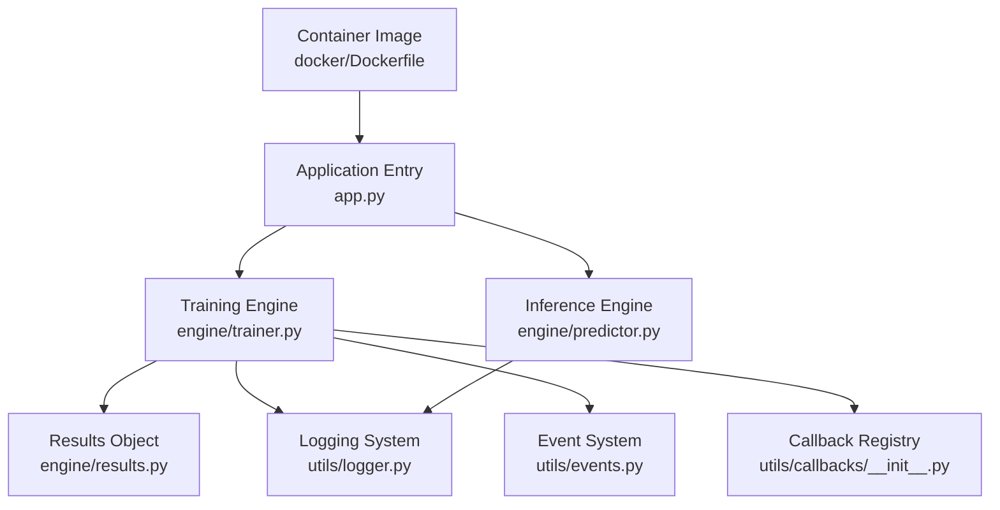
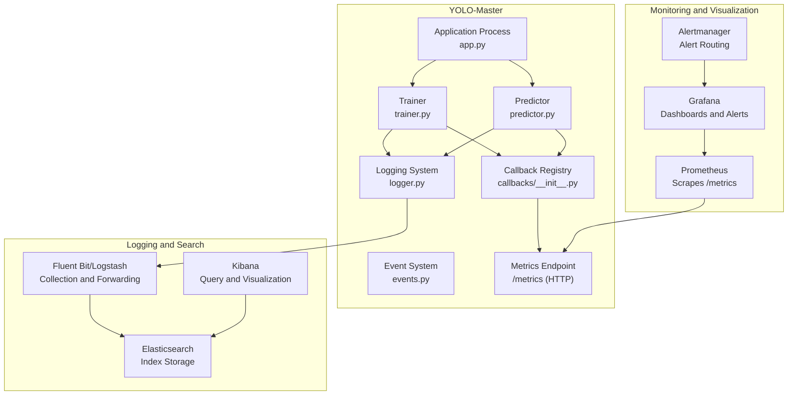
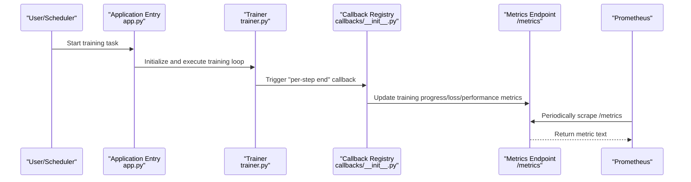
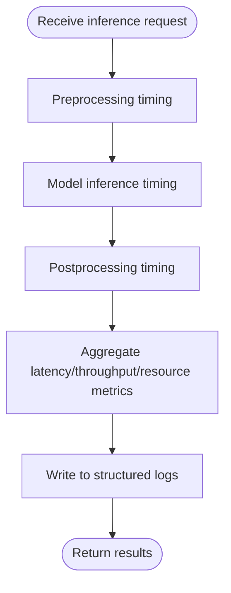
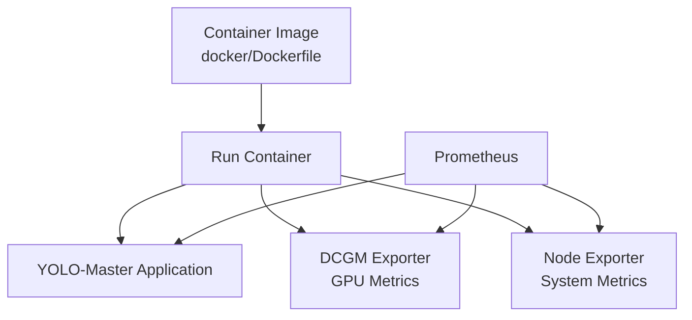
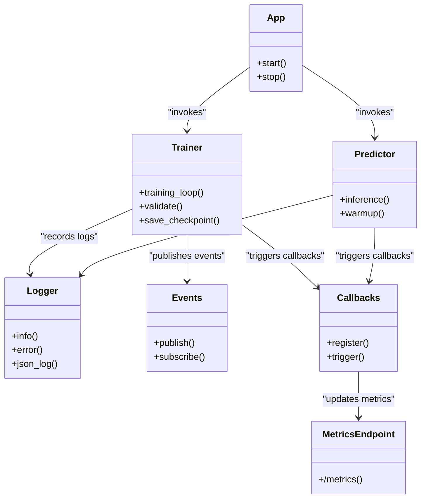

# Monitoring System Integration

<cite>
**Files referenced in this document**
- [app.py](file://app.py)
- [Dockerfile](file://docker/Dockerfile)
- [pyproject.toml](file://pyproject.toml)
- [README.md](file://README.md)
- [model_monitoring_and_maintenance.md](file://docs/en/guides/model-monitoring-and-maintenance.md)
- [yolo_performance_metrics.md](file://docs/en/guides/yolo-performance-metrics.md)
- [trainer.py](file://ultralytics/engine/trainer.py)
- [predictor.py](file://ultralytics/engine/predictor.py)
- [results.py](file://ultralytics/engine/results.py)
- [logger.py](file://ultralytics/utils/logger.py)
- [events.py](file://ultralytics/utils/events.py)
- [callbacks/__init__.py](file://ultralytics/utils/callbacks/__init__.py)
</cite>

## Table of Contents
1. [Introduction](#introduction)
2. [Project Structure](#project-structure)
3. [Core Components](#core-components)
4. [Architecture Overview](#architecture-overview)
5. [Detailed Component Analysis](#detailed-component-analysis)
6. [Dependency Analysis](#dependency-analysis)
7. [Performance Considerations](#performance-considerations)
8. [Troubleshooting Guide](#troubleshooting-guide)
9. [Conclusion](#conclusion)
10. [Appendix](#appendix)

## Introduction
This document covers the integration of YOLO-Master with monitoring systems, aiming to provide a production-ready integration solution for Prometheus, Grafana, and ELK Stack (Elasticsearch, Logstash/Fluent Bit, Kibana). The content covers:
- Key metric collection: GPU utilization, VRAM usage, CPU/memory, training progress, inference latency and throughput, etc.
- Custom metric definition and exposure methods (HTTP /metrics)
- Alert rule configuration recommendations (Prometheus Alertmanager)
- Production environment performance monitoring and troubleshooting methods
- Monitoring configuration examples for containerized deployment (based on the repository's Dockerfile)
- Log management and analysis best practices (structured logging, centralized collection, indexing strategies)

## Project Structure
From the repository perspective, key locations related to monitoring include:
- Application entry and process management: The main application script is located at the root directory
- Training and inference engines: The engine module contains core runtimes such as trainer and predictor
- Logging and events: utils/logger.py and utils/events.py provide logging and event capabilities
- Callback mechanism: utils/callbacks is used to inject hooks during training/validation/export phases
- Documentation: guides contains model monitoring and maintenance, performance metrics, and related descriptions
- Container image build: docker/Dockerfile is used to package the runtime environment

Diagram sources
- [app.py](file://app.py)
- [trainer.py](file://ultralytics/engine/trainer.py)
- [predictor.py](file://ultralytics/engine/predictor.py)
- [results.py](file://ultralytics/engine/results.py)
- [logger.py](file://ultralytics/utils/logger.py)
- [events.py](file://ultralytics/utils/events.py)
- [callbacks/__init__.py](file://ultralytics/utils/callbacks/__init__.py)
- [Dockerfile](file://docker/Dockerfile)

Section sources
- [README.md](file://README.md)
- [model_monitoring_and_maintenance.md](file://docs/en/guides/model-monitoring-and-maintenance.md)
- [yolo_performance_metrics.md](file://docs/en/guides/yolo-performance-metrics.md)

## Core Components
- Trainer (trainer.py): Responsible for the training lifecycle, batch iteration, evaluation, and checkpoint saving. Suitable for instrumenting training progress, loss convergence, learning rate changes, per-step timing, and other metrics.
- Predictor (predictor.py): Responsible for the inference pipeline, suitable for instrumenting inference latency, throughput, input size distribution, batch size changes, and other metrics.
- Results object (results.py): Encapsulates results from a single inference or validation, facilitating correlation of metrics with samples and output to logs or external systems.
- Logging system (logger.py): Unified logging interface supporting structured output, easily collected by Fluent Bit/Logstash.
- Event system (events.py): Provides event publish/subscribe capabilities, useful for decoupling metric reporting logic.
- Callback mechanism (callbacks/__init__.py): Inserts custom logic during training/validation/export phases, serving as an ideal entry point for Prometheus metric reporting.

Section sources
- [trainer.py](file://ultralytics/engine/trainer.py)
- [predictor.py](file://ultralytics/engine/predictor.py)
- [results.py](file://ultralytics/engine/results.py)
- [logger.py](file://ultralytics/utils/logger.py)
- [events.py](file://ultralytics/utils/events.py)
- [callbacks/__init__.py](file://ultralytics/utils/callbacks/__init__.py)

## Architecture Overview
The following diagram shows the overall integration between YOLO-Master and the monitoring stack: the application collects metrics during training/inference via callbacks and the event system; Prometheus periodically scrapes the HTTP /metrics endpoint; Grafana consumes Prometheus data to form dashboards; ELK centrally collects structured logs and provides search and analysis.

Diagram sources
- [app.py](file://app.py)
- [trainer.py](file://ultralytics/engine/trainer.py)
- [predictor.py](file://ultralytics/engine/predictor.py)
- [logger.py](file://ultralytics/utils/logger.py)
- [events.py](file://ultralytics/utils/events.py)
- [callbacks/__init__.py](file://ultralytics/utils/callbacks/__init__.py)

## Detailed Component Analysis

### Training Phase Metric Collection and Callback Integration
- Target metrics
  - Training progress: Current epoch, total epochs, steps, estimated time remaining
  - Loss and metrics: Per-task losses, mAP, precision, recall
  - Resource usage: GPU utilization, VRAM peak, CPU/memory usage, I/O wait
  - Performance: Per-step time, throughput (samples/sec), batch size, learning rate
- Integration points
  - Register hooks in the callback registry for training start, per-step end, per-epoch end, validation complete, etc.
  - Publish training events in the event system for metric reporting modules to subscribe to
  - Output structured logs via the logging system for ELK collection
- Metric exposure
  - Start a lightweight HTTP service within the application, exposing the /metrics endpoint following Prometheus text format
  - Set appropriate labels for each metric (e.g., task type, dataset, device, batch size)

Diagram sources
- [app.py](file://app.py)
- [trainer.py](file://ultralytics/engine/trainer.py)
- [callbacks/__init__.py](file://ultralytics/utils/callbacks/__init__.py)

Section sources
- [trainer.py](file://ultralytics/engine/trainer.py)
- [callbacks/__init__.py](file://ultralytics/utils/callbacks/__init__.py)

### Inference Phase Metric Collection and Latency Tracking
- Target metrics
  - Latency: End-to-end latency, preprocessing/model inference/postprocessing segment latencies
  - Throughput: QPS, concurrency, batch size
  - Resources: GPU/CPU utilization, VRAM usage, memory peak
  - Quality: Confidence distribution, class distribution, failure rate
- Integration points
  - Record request entry/exit times in the predictor, calculating latency percentiles
  - Dynamically adjust batch size based on input dimensions in callbacks, recording adaptive behavior
  - Write key information from the results object (results.py) into structured logs

Diagram sources
- [predictor.py](file://ultralytics/engine/predictor.py)
- [results.py](file://ultralytics/engine/results.py)
- [logger.py](file://ultralytics/utils/logger.py)

Section sources
- [predictor.py](file://ultralytics/engine/predictor.py)
- [results.py](file://ultralytics/engine/results.py)
- [logger.py](file://ultralytics/utils/logger.py)

### Logging System and ELK Integration
- Structured logging
  - Use a unified logging interface to output JSON format, including fields: timestamp, level, module, task ID, metric key-value pairs
  - Avoid outputting sensitive information in logs (keys, full image paths, etc.)
- Collection and forwarding
  - Install Fluent Bit or Logstash in containers, monitoring application log directories or stdout/stderr
  - Forward logs to Elasticsearch, creating indices by date or business dimension
- Visualization and analysis
  - Create dashboards in Kibana, aggregating error rates, latency distributions, resource anomalies, etc.
  - Set alert rules to notify operations when error rates or latency exceed thresholds

Diagram sources
- [logger.py](file://ultralytics/utils/logger.py)

Section sources
- [logger.py](file://ultralytics/utils/logger.py)

### Containerized Deployment Monitoring Configuration Example
- Image build
  - Extend based on the repository's Dockerfile, installing necessary monitoring agents (e.g., node_exporter, nvidia-dcgm-exporter)
  - Expose application metrics endpoint and system metrics endpoint to Prometheus
- Environment variables and ports
  - Control metric sampling frequency, log level, and monitoring enablement via environment variables
  - Ensure container networking allows Prometheus to access the /metrics port
- Health checks and readiness probes
  - Configure liveness/readiness probes in orchestration platforms (e.g., Kubernetes), combining with the metrics endpoint to determine service status

Diagram sources
- [Dockerfile](file://docker/Dockerfile)

Section sources
- [Dockerfile](file://docker/Dockerfile)

## Dependency Analysis
- Internal dependencies
  - Application entry depends on trainer and predictor, both of which depend on the logging and event systems
  - The callback registry serves as a cross-cutting concern, spanning training and inference flows
- External dependencies
  - Prometheus scrapes the HTTP /metrics endpoint
  - Fluent Bit/Logstash collects logs and forwards to Elasticsearch
  - Grafana connects to Prometheus and Elasticsearch for visualization
- Coupling and cohesion
  - Reduce coupling between metric reporting and core logic via callbacks and the event system
  - Unified logging abstraction improves observability consistency

Diagram sources
- [app.py](file://app.py)
- [trainer.py](file://ultralytics/engine/trainer.py)
- [predictor.py](file://ultralytics/engine/predictor.py)
- [logger.py](file://ultralytics/utils/logger.py)
- [events.py](file://ultralytics/utils/events.py)
- [callbacks/__init__.py](file://ultralytics/utils/callbacks/__init__.py)

Section sources
- [app.py](file://app.py)
- [trainer.py](file://ultralytics/engine/trainer.py)
- [predictor.py](file://ultralytics/engine/predictor.py)
- [logger.py](file://ultralytics/utils/logger.py)
- [events.py](file://ultralytics/utils/events.py)
- [callbacks/__init__.py](file://ultralytics/utils/callbacks/__init__.py)

## Performance Considerations
- Metric sampling frequency
  - Training phase: Report once per step or every N steps, avoiding excessive frequency impacting training throughput
  - Inference phase: Report latency per request granularity, aggregated into sliding window statistics
- Label cardinality control
  - Add necessary labels to metrics (task, dataset, device), but avoid high-cardinality fields (e.g., random IDs)
- Resource overhead
  - Metric reporting should be asynchronous to avoid blocking the main flow
  - Log writing should use batch or async mode to reduce IO jitter
- Capacity planning
  - Estimate metric count and retention period, properly configure Prometheus storage and rolling strategies
  - Log indices roll daily, set hot-cold tiering and TTL policies

[This section provides general guidance and does not directly analyze specific files]

## Troubleshooting Guide
- Common issue identification
  - Low GPU utilization: Check batch size, data loading bottlenecks, model parallelism strategy
  - VRAM leak: Observe if VRAM curve monotonically increases, investigate unreleased tensors or caches
  - Training instability: Monitor loss oscillation, gradient explosion/vanishing, excessive learning rate
  - Sudden inference latency spike: Check queue backlog, GC pauses, disk IO contention
- Diagnostic steps
  - View Grafana dashboards: Compare against historical baselines, identify anomalous periods
  - Search Kibana logs: Filter by error level and key modules, locate stack traces
  - Verify Prometheus metrics: Confirm metrics endpoint reachability and data freshness
  - Reproduce experiments: Fix random seeds and input distributions, narrow down the problem scope
- Alert recommendations
  - Training loss continuously rising or stagnating
  - Inference P99 latency exceeding threshold
  - GPU VRAM usage approaching limit
  - Error rate or retry rate abnormally increasing

Section sources
- [model_monitoring_and_maintenance.md](file://docs/en/guides/model-monitoring-and-maintenance.md)
- [yolo_performance_metrics.md](file://docs/en/guides/yolo-performance-metrics.md)

## Conclusion
By integrating callbacks and the event system at critical training and inference paths, combined with structured logging and HTTP metrics endpoints, YOLO-Master can seamlessly connect with Prometheus, Grafana, and ELK Stack to achieve comprehensive observability. In production environments, it is recommended to strictly control metric label cardinality and sampling frequency, combined with appropriate alert rules and log indexing strategies, to ensure stability and maintainability.

[This section is a summary and does not directly analyze specific files]

## Appendix
- Recommended metric inventory
  - Training: epoch, step, loss_*, map, precision, recall, lr, step_time, throughput, gpu_util, gpu_mem_used, cpu_usage, mem_usage
  - Inference: latency_p50/p90/p99, qps, batch_size, input_shape, confidence_dist, failure_rate
- Alert rule examples (descriptive)
  - Trigger when training loss exceeds threshold for N consecutive minutes with no downward trend
  - Trigger when inference P99 latency exceeds 1.5x SLO for M consecutive minutes
  - Trigger when GPU VRAM usage exceeds 90% of threshold for K consecutive minutes
- Containerization key points
  - Install necessary Exporters and log collectors in the image
  - Control monitoring switches and parameters via environment variables
  - Configure probes and resource limits in the orchestration platform

[This section is supplementary information and does not directly analyze specific files]
