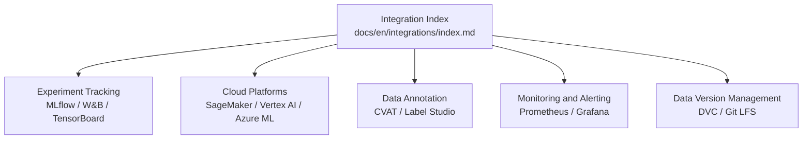
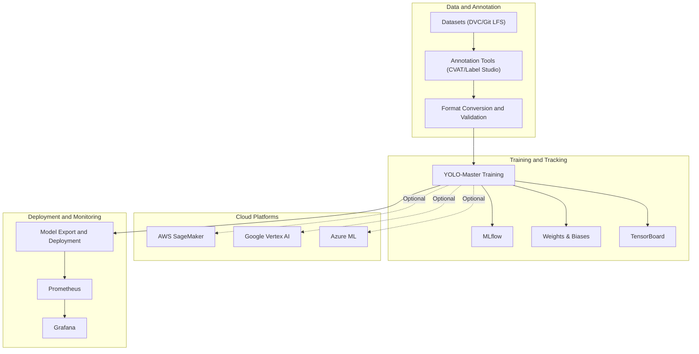
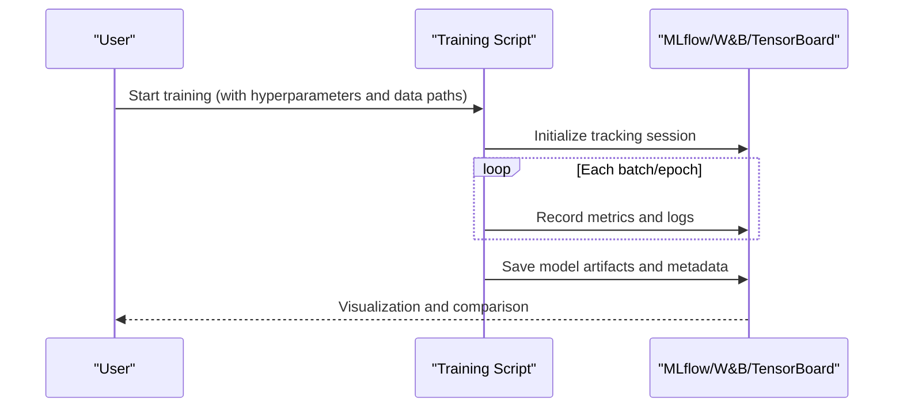
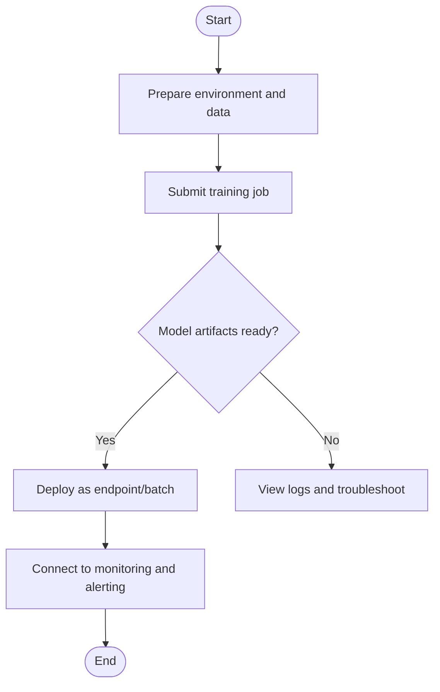
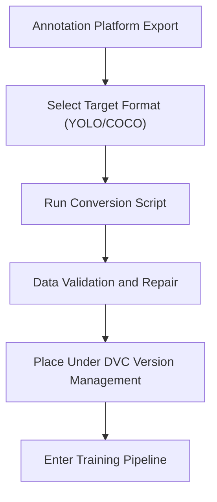
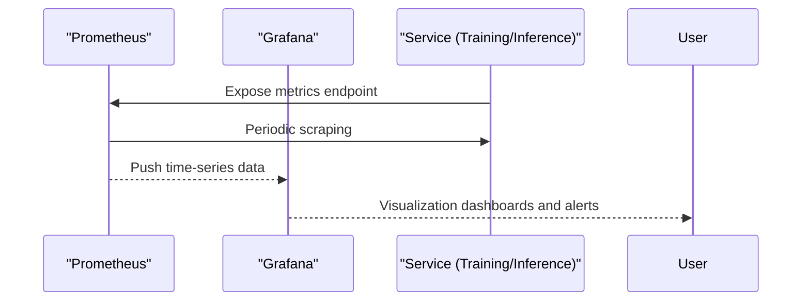
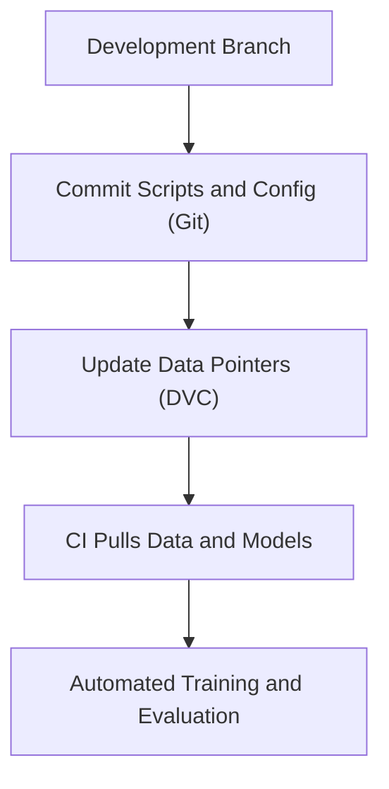
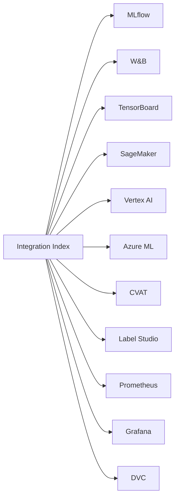

# Third-Party Tool Integration

<cite>
**Files referenced in this document**
- [integrations/index.md](file://docs/en/integrations/index.md)
- [mlflow.md](file://docs/en/integrations/mlflow.md)
- [tensorboard.md](file://docs/en/integrations/tensorboard.md)
- [weights-biases.md](file://docs/en/integrations/weights-biases.md)
- [amazon-sagemaker.md](file://docs/en/integrations/amazon-sagemaker.md)
- [vertex-ai-deployment-with-docker.md](file://docs/en/guides/vertex-ai-deployment-with-docker.md)
- [azureml-quickstart.md](file://docs/en/guides/azureml-quickstart.md)
- [dvc.md](file://docs/en/integrations/dvc.md)
- [model-monitoring-and-maintenance.md](file://docs/en/guides/model-monitoring-and-maintenance.md)
- [data-collection-and-annotation.md](file://docs/en/guides/data-collection-and-annotation.md)
- [prometheus.md](file://docs/en/integrations/prometheus.md)
- [grafana.md](file://docs/en/integrations/grafana.md)
- [cvat.md](file://docs/en/integrations/cvat.md)
- [label-studio.md](file://docs/en/integrations/label-studio.md)
</cite>

## Table of Contents
1. [Introduction](#introduction)
2. [Project Structure](#project-structure)
3. [Core Components](#core-components)
4. [Architecture Overview](#architecture-overview)
5. [Detailed Component Analysis](#detailed-component-analysis)
6. [Dependency Analysis](#dependency-analysis)
7. [Performance Considerations](#performance-considerations)
8. [Troubleshooting Guide](#troubleshooting-guide)
9. [Conclusion](#conclusion)
10. [Appendix](#appendix)

## Introduction
This document is intended for engineers and researchers who wish to introduce mainstream MLOps, cloud platforms, data annotation, and monitoring tools into the YOLO-Master workflow, providing end-to-end integration guides. The content covers:
- Experiment tracking and visualization: MLflow, Weights & Biases, TensorBoard
- Cloud platform training and deployment: AWS SageMaker, Google Vertex AI, Azure ML
- Data annotation tools: CVAT, Label Studio data format conversion and processing workflows
- Monitoring and alerting: Prometheus, Grafana metric collection and alert configuration
- Version control and collaboration: Git LFS, DVC data management solutions
- Complete configuration examples and common troubleshooting

## Project Structure
YOLO-Master provides rich integration documentation at the documentation layer for quick onboarding and deep customization. Key locations are as follows:
- Integration index and entry: docs/en/integrations/index.md
- MLOps and visualization: docs/en/integrations/mlflow.md, docs/en/integrations/weights-biases.md, docs/en/integrations/tensorboard.md
- Cloud platforms: docs/en/integrations/amazon-sagemaker.md, docs/en/guides/vertex-ai-deployment-with-docker.md, docs/en/guides/azureml-quickstart.md
- Data annotation: docs/en/guides/data-collection-and-annotation.md (combined with each annotation platform's documentation)
- Monitoring and observability: docs/en/guides/model-monitoring-and-maintenance.md (combined with Prometheus/Grafana documentation)
- Data version management: docs/en/integrations/dvc.md

[This section is an overview description and does not directly analyze specific code files]

## Core Components
- Experiment tracking and visualization
  - MLflow: Records hyperparameters, metrics, model artifacts, supports tracking comparison and model registry
  - Weights & Biases: Real-time visualization of training curves, parameter sweeps, result sharing
  - TensorBoard: Training log visualization, suitable for local or cluster environments
- Cloud platform training and deployment
  - AWS SageMaker: Managed training and inference, supports containerization and elastic scaling
  - Google Vertex AI: Unified machine learning platform, supports Notebooks, training jobs, and endpoint deployment
  - Azure ML: Enterprise-grade cloud ML service, supports dataset versioning, pipelines, and model registry
- Data annotation and format conversion
  - CVAT, Label Studio: Conversion and validation from annotation output to YOLO format
- Monitoring and alerting
  - Prometheus + Grafana: Collects system metrics like GPU/CPU/memory and business metrics, sets threshold alerts
- Data version management
  - DVC: Large file and dataset versioning; Git LFS: Binary large object storage

**Section sources**
- [integrations/index.md](file://docs/en/integrations/index.md)

## Architecture Overview
The following diagram shows the overall integration view from data preparation, training, evaluation, export to deployment and monitoring.

[This diagram is a conceptual architecture diagram and is not mapped to specific source code files]

## Detailed Component Analysis

### Experiment Tracking and Visualization (MLflow, Weights & Biases, TensorBoard)
- Goals
  - Record hyperparameters, metrics, logs, and model weights for each training run
  - Support multi-experiment comparison, reproduction, and archiving
- Typical workflow
  - Initialize tracker when starting training
  - Record metrics and intermediate artifacts per step/epoch
  - Upload model artifacts and metadata after training completes
- Visualization
  - MLflow UI: Experiment list, parameter-metric scatter plots, model registry
  - W&B Dashboard: Real-time curves, hyperparameter search, report export
  - TensorBoard: Loss curves, confusion matrices, distribution histograms, etc.

**Section sources**
- [mlflow.md](file://docs/en/integrations/mlflow.md)
- [weights-biases.md](file://docs/en/integrations/weights-biases.md)
- [tensorboard.md](file://docs/en/integrations/tensorboard.md)

### Cloud Platform Integration (AWS SageMaker, Google Vertex AI, Azure ML)
- Goals
  - Complete data preparation, distributed training, model registration, and online/offline deployment in the cloud
- General steps
  - Prepare container image or runtime environment
  - Define training jobs and resource specifications
  - Mount datasets to training instances
  - Output model artifacts to cloud storage
  - Create inference endpoints or batch processing tasks
- Platform key points
  - SageMaker: Use built-in algorithms or custom containers, with S3 for data and model storage
  - Vertex AI: Run via Notebook or Training Job, Artifact Registry manages images
  - Azure ML: Use dataset versioning, Compute Target, and Pipeline orchestration

**Section sources**
- [amazon-sagemaker.md](file://docs/en/integrations/amazon-sagemaker.md)
- [vertex-ai-deployment-with-docker.md](file://docs/en/guides/vertex-ai-deployment-with-docker.md)
- [azureml-quickstart.md](file://docs/en/guides/azureml-quickstart.md)

### Data Annotation Tool Integration (CVAT, Label Studio)
- Goals
  - Convert annotations exported from CVAT/Label Studio to YOLO format and perform consistency validation
- Typical workflow
  - Export dataset from annotation platform (e.g., COCO/JSON/YOLO)
  - Run format conversion script to generate image and label directory structure required by YOLO
  - Perform data validation (class mapping, bounding box validity, missing checks)
  - Place converted data under DVC version management
- Considerations
  - Ensure class IDs and names are consistent
  - Handle empty labels and anomalous samples
  - Maintain stable train/validation/test splits

**Section sources**
- [data-collection-and-annotation.md](file://docs/en/guides/data-collection-and-annotation.md)
- [cvat.md](file://docs/en/integrations/cvat.md)
- [label-studio.md](file://docs/en/integrations/label-studio.md)

### Monitoring and Alerting (Prometheus, Grafana)
- Goals
  - Collect system metrics and business metrics during training and inference phases, establish visualization dashboards and alert rules
- Metric scope
  - System: CPU, memory, GPU utilization, VRAM usage, I/O throughput
  - Training: Loss, learning rate, gradient norm, throughput
  - Inference: QPS, latency percentiles, error rate, cache hit rate
- Implementation key points
  - Expose metrics endpoint in training/inference processes
  - Prometheus scrapes metrics, Grafana builds dashboards
  - Set alerts based on thresholds and trends (email/Slack/DingTalk)

**Section sources**
- [model-monitoring-and-maintenance.md](file://docs/en/guides/model-monitoring-and-maintenance.md)
- [prometheus.md](file://docs/en/integrations/prometheus.md)
- [grafana.md](file://docs/en/integrations/grafana.md)

### Data Version Management and Collaboration (DVC, Git LFS)
- Goals
  - Version-manage large-scale datasets and model weights, ensuring reproducibility and team collaboration
- Practice recommendations
  - Use DVC to manage data and intermediate artifacts, Git retains only metadata and scripts
  - Use Git LFS to manage large binary files (e.g., pretrained weights)
  - Pull specified versions of data and models in CI/CD to ensure consistency

**Section sources**
- [dvc.md](file://docs/en/integrations/dvc.md)

## Dependency Analysis
- Integration entry and navigation
  - The integration index page aggregates usage guides for all external tools, serving as a unified entry point
- Module coupling relationships
  - Training phase is loosely coupled with trackers: Enable different tracking backends via callbacks or CLI parameters
  - Cloud platforms decouple via container/job form: Image and job definitions are independent of training code
  - Monitoring decouples via metrics endpoint: Can be connected without invading core logic
- Potential risks
  - Network and permissions: Cloud access keys, storage bucket policies, image registry authentication
  - Data consistency: Cross-platform path and naming convention differences
  - Version drift: Dependency library and framework versions need to be locked

**Section sources**
- [integrations/index.md](file://docs/en/integrations/index.md)

## Performance Considerations
- Training phase
  - Properly set batch size and mixed precision to avoid OOM
  - Use data parallelism and async I/O to improve throughput
  - Enable early stopping and learning rate scheduling to reduce wasted computation
- Monitoring phase
  - Balance sampling frequency and metric granularity, avoid excessive collection impacting performance
  - Downsample and aggregate high-frequency metrics
- Deployment phase
  - Model quantization and operator optimization to reduce latency
  - Batch processing and dynamic batching to improve throughput
  - Cache hot data and intermediate results

[This section provides general guidance and does not directly analyze specific code files]

## Troubleshooting Guide
- Experiment tracking
  - Cannot connect to tracking backend: Check network, proxy, and credentials
  - Missing metrics: Confirm recording timing and event write permissions
- Cloud platforms
  - Training failure: Check job logs, resource quotas, and disk space
  - Deployment failure: Check image reachability, ports, and environment variables
- Data annotation
  - Format inconsistency: Verify class mapping and coordinate normalization
  - Missing files: Validate paths and filename case sensitivity
- Monitoring alerts
  - Metrics not reported: Confirm endpoint reachability and scrape interval
  - Too many false positives: Adjust thresholds and window lengths

**Section sources**
- [model-monitoring-and-maintenance.md](file://docs/en/guides/model-monitoring-and-maintenance.md)

## Conclusion
By integrating YOLO-Master with mainstream MLOps, cloud platforms, annotation tools, and monitoring systems, experiment efficiency, reproducibility, and engineering maturity can be significantly improved. It is recommended to start with a "minimum viable integration," gradually improving data versioning, monitoring, and deployment closed loops, and accumulating best practices and templates within the team.

[This section is a summary and does not directly analyze specific code files]

## Appendix
- Common commands and configuration checklist (categorized by platform and tool)
- Reference links and official documentation index
- Glossary and symbol conventions

[This section is supplementary information and does not directly analyze specific code files]
