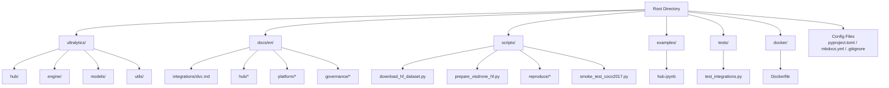
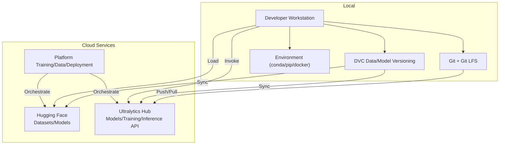
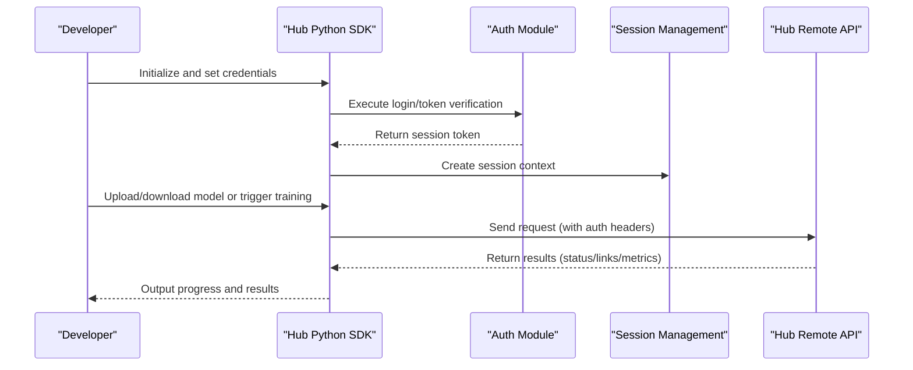
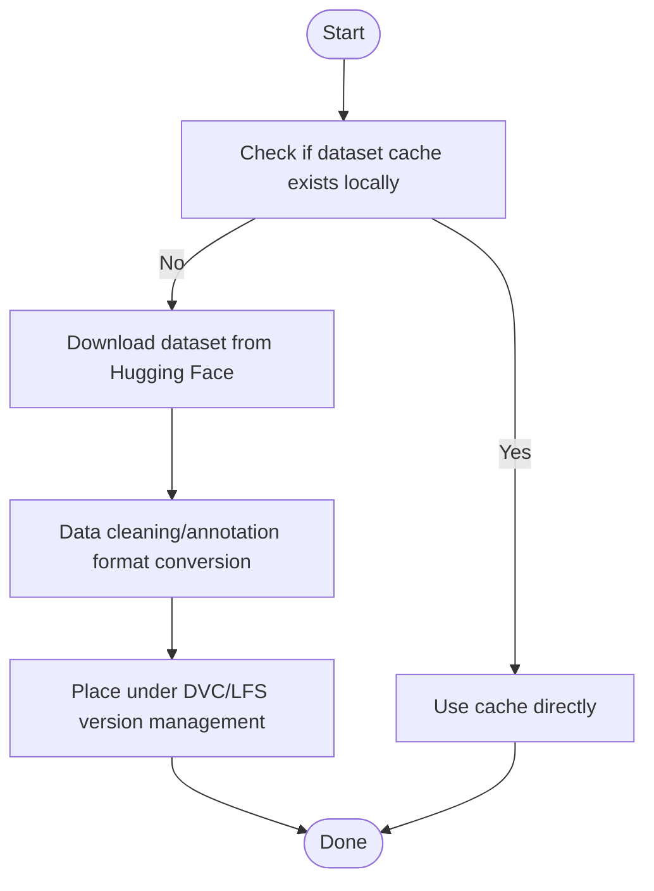
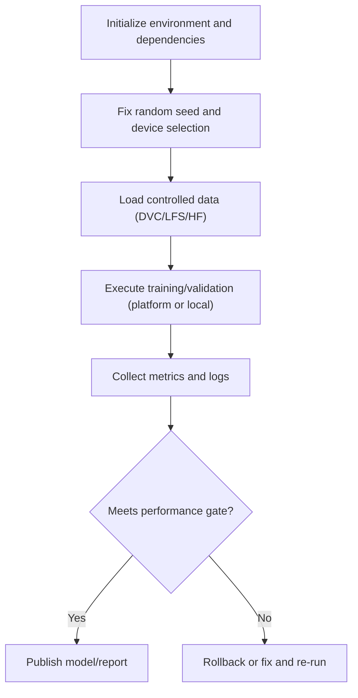
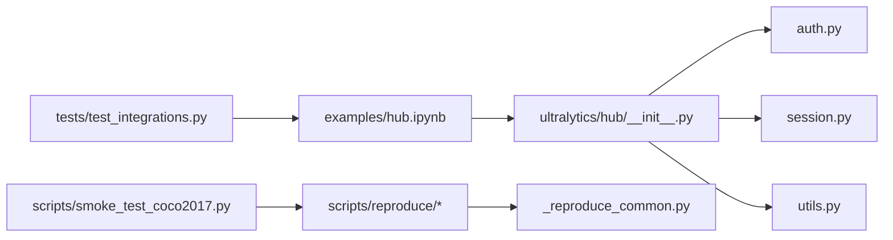

# Version Control and Collaboration Tools

<cite>
**Files referenced in this document**
- [README.md](file://README.md)
- [.gitignore](file://.gitignore)
- [pyproject.toml](file://pyproject.toml)
- [mkdocs.yml](file://mkdocs.yml)
- [docker/Dockerfile](file://docker/Dockerfile)
- [examples/hub.ipynb](file://examples/hub.ipynb)
- [ultralytics/hub/__init__.py](file://ultralytics/hub/__init__.py)
- [ultralytics/hub/auth.py](file://ultralytics/hub/auth.py)
- [ultralytics/hub/session.py](file://ultralytics/hub/session.py)
- [ultralytics/hub/utils.py](file://ultralytics/hub/utils.py)
- [scripts/download_hf_dataset.py](file://scripts/download_hf_dataset.py)
- [scripts/prepare_visdrone_hf.py](file://scripts/prepare_visdrone_hf.py)
- [docs/en/integrations/dvc.md](file://docs/en/integrations/dvc.md)
- [docs/en/hub/index.md](file://docs/en/hub/index.md)
- [docs/en/hub/quickstart.md](file://docs/en/hub/quickstart.md)
- [docs/en/hub/models.md](file://docs/en/hub/models.md)
- [docs/en/hub/datasets.md](file://docs/en/hub/datasets.md)
- [docs/en/hub/teams.md](file://docs/en/hub/teams.md)
- [docs/en/hub/cloud-training.md](file://docs/en/hub/cloud-training.md)
- [docs/en/platform/train/index.md](file://docs/en/platform/train/index.md)
- [docs/en/platform/data/index.md](file://docs/en/platform/data/index.md)
- [docs/en/platform/deploy/index.md](file://docs/en/platform/deploy/index.md)
- [docs/en/governance/baseline-20260716.md](file://docs/en/governance/baseline-20260716.md)
- [docs/en/governance/performance-gates.md](file://docs/en/governance/performance-gates.md)
- [scripts/reproduce/README.md](file://scripts/reproduce/README.md)
- [scripts/reproduce/_reproduce_common.py](file://scripts/reproduce/_reproduce_common.py)
- [scripts/reproduce/reproduce_visdrone.py](file://scripts/reproduce/reproduce_visdrone.py)
- [scripts/smoke_test_coco2017.py](file://scripts/smoke_test_coco2017.py)
- [tests/test_integrations.py](file://tests/test_integrations.py)
</cite>

## Table of Contents
1. [Introduction](#introduction)
2. [Project Structure](#project-structure)
3. [Core Components](#core-components)
4. [Architecture Overview](#architecture-overview)
5. [Detailed Component Analysis](#detailed-component-analysis)
6. [Dependency Analysis](#dependency-analysis)
7. [Performance Considerations](#performance-considerations)
8. [Troubleshooting Guide](#troubleshooting-guide)
9. [Conclusion](#conclusion)
10. [Appendix](#appendix)

## Introduction
This document is intended for the YOLO-Master team, providing a systematic explanation of how to combine Git, Git LFS, DVC, Ultralytics Hub, and Hugging Face for large-file version management, model weight management, dataset sharing, experiment reproduction, and environment consistency assurance. It also presents team collaboration workflows and best practices. The document covers integration points for platform-based training, data management, and deployment, helping the team strike a balance between engineering efficiency and reproducibility.

## Project Structure
The repository adopts a layered organization of "code + documentation + scripts + tests":
- The code core resides in the ultralytics subpackage, containing Hub client, engine, model, and utility modules
- Documentation is centralized in docs/en, covering integration guides (including DVC), Hub usage, platform-based training/data/deployment, and governance specifications
- Examples and scripts are concentrated in examples and scripts, providing Hub interaction, HF dataset download and preparation, experiment reproduction, and smoke tests
- Configuration and build related: pyproject.toml, mkdocs.yml, docker/Dockerfile, .gitignore

Diagram sources
- [pyproject.toml:1-200](file://pyproject.toml#L1-L200)
- [mkdocs.yml:1-200](file://mkdocs.yml#L1-L200)
- [docker/Dockerfile:1-200](file://docker/Dockerfile#L1-L200)
- [docs/en/integrations/dvc.md:1-200](file://docs/en/integrations/dvc.md#L1-L200)
- [docs/en/hub/index.md:1-200](file://docs/en/hub/index.md#L1-L200)
- [scripts/download_hf_dataset.py:1-200](file://scripts/download_hf_dataset.py#L1-L200)
- [scripts/prepare_visdrone_hf.py:1-200](file://scripts/prepare_visdrone_hf.py#L1-L200)
- [examples/hub.ipynb:1-200](file://examples/hub.ipynb#L1-L200)
- [tests/test_integrations.py:1-200](file://tests/test_integrations.py#L1-L200)

Section sources
- [README.md:1-200](file://README.md#L1-L200)
- [pyproject.toml:1-200](file://pyproject.toml#L1-L200)
- [mkdocs.yml:1-200](file://mkdocs.yml#L1-L200)
- [docker/Dockerfile:1-200](file://docker/Dockerfile#L1-L200)
- [.gitignore:1-200](file://.gitignore#L1-L200)

## Core Components
- Git + Git LFS: For version control and incremental synchronization of code and binary large files (weights, datasets)
- DVC: Data and model version management for machine learning, supporting external storage backends and pipeline tracking
- Ultralytics Hub: Model hosting, online training, inference API, and team collaboration (private spaces, team permissions)
- Hugging Face: Loading, sharing, and reusing datasets and models
- Platform capabilities: Platform-based training, data management, and deployment workflows (documentation-driven)
- Reproduction and governance: Baselines, performance gates, experiment reproduction scripts, and smoke tests

Section sources
- [docs/en/integrations/dvc.md:1-200](file://docs/en/integrations/dvc.md#L1-L200)
- [docs/en/hub/index.md:1-200](file://docs/en/hub/index.md#L1-L200)
- [docs/en/hub/quickstart.md:1-200](file://docs/en/hub/quickstart.md#L1-L200)
- [docs/en/hub/models.md:1-200](file://docs/en/hub/models.md#L1-L200)
- [docs/en/hub/datasets.md:1-200](file://docs/en/hub/datasets.md#L1-L200)
- [docs/en/hub/teams.md:1-200](file://docs/en/hub/teams.md#L1-L200)
- [docs/en/hub/cloud-training.md:1-200](file://docs/en/hub/cloud-training.md#L1-L200)
- [docs/en/platform/train/index.md:1-200](file://docs/en/platform/train/index.md#L1-L200)
- [docs/en/platform/data/index.md:1-200](file://docs/en/platform/data/index.md#L1-L200)
- [docs/en/platform/deploy/index.md:1-200](file://docs/en/platform/deploy/index.md#L1-L200)
- [docs/en/governance/baseline-20260716.md:1-200](file://docs/en/governance/baseline-20260716.md#L1-L200)
- [docs/en/governance/performance-gates.md:1-200](file://docs/en/governance/performance-gates.md#L1-L200)
- [scripts/reproduce/README.md:1-200](file://scripts/reproduce/README.md#L1-L200)
- [scripts/reproduce/_reproduce_common.py:1-200](file://scripts/reproduce/_reproduce_common.py#L1-L200)
- [scripts/reproduce/reproduce_visdrone.py:1-200](file://scripts/reproduce/reproduce_visdrone.py#L1-L200)
- [scripts/smoke_test_coco2017.py:1-200](file://scripts/smoke_test_coco2017.py#L1-L200)
- [tests/test_integrations.py:1-200](file://tests/test_integrations.py#L1-L200)

## Architecture Overview
The following diagram shows the overall pipeline from local development to cloud collaboration: code and configuration are managed via Git; large files (weights/datasets) are managed by Git LFS or DVC; models and datasets can be shared between Ultralytics Hub and Hugging Face; platform-based training and deployment are driven by documentation and scripts; reproduction and gates ensure quality.

Diagram sources
- [docs/en/integrations/dvc.md:1-200](file://docs/en/integrations/dvc.md#L1-L200)
- [docs/en/hub/index.md:1-200](file://docs/en/hub/index.md#L1-L200)
- [docs/en/hub/quickstart.md:1-200](file://docs/en/hub/quickstart.md#L1-L200)
- [docs/en/hub/models.md:1-200](file://docs/en/hub/models.md#L1-L200)
- [docs/en/hub/datasets.md:1-200](file://docs/en/hub/datasets.md#L1-L200)
- [docs/en/hub/teams.md:1-200](file://docs/en/hub/teams.md#L1-L200)
- [docs/en/hub/cloud-training.md:1-200](file://docs/en/hub/cloud-training.md#L1-L200)
- [docs/en/platform/train/index.md:1-200](file://docs/en/platform/train/index.md#L1-L200)
- [docs/en/platform/data/index.md:1-200](file://docs/en/platform/data/index.md#L1-L200)
- [docs/en/platform/deploy/index.md:1-200](file://docs/en/platform/deploy/index.md#L1-L200)
- [scripts/download_hf_dataset.py:1-200](file://scripts/download_hf_dataset.py#L1-L200)
- [scripts/prepare_visdrone_hf.py:1-200](file://scripts/prepare_visdrone_hf.py#L1-L200)

## Detailed Component Analysis

### Git + Git LFS Configuration and Practice
- Use cases: Code, configuration files, small weights, and small datasets; for large weights/large datasets, DVC or LFS is recommended
- Key practices:
  - Maintain .gitattributes in the repository to declare LFS tracking rules (e.g., *.pt, *.onnx, *.zip, etc.)
  - Use git lfs track / git lfs install for initialization and registration
  - Note the initial upload time when committing; caching LFS objects in CI is recommended
  - Branching strategy and tags: Tag important weights and datasets for easy rollback
- Integration with existing repository files:
  - .gitignore excludes local caches and temporary artifacts to avoid bloating the repository
  - pyproject.toml defines dependencies and build metadata, ensuring stable CI environments

Section sources
- [.gitignore:1-200](file://.gitignore#L1-L200)
- [pyproject.toml:1-200](file://pyproject.toml#L1-L200)

### DVC Integration and Usage
- Purpose: Data and model version management, supporting external storage (S3/GCS/OSS, etc.), working in conjunction with Git
- Typical workflow:
  - dvc init for initialization
  - dvc add to add data/models to version control (generates .dvc and .gitignore entries)
  - dvc push/pull to sync with remote storage
  - dvc exp / dvc stage to record experiments and pipelines
- Collaboration with Hub/HF:
  - DVC remote can point to Hub or HF Space/Repo as a storage backend
  - Reference DVC-managed weight/dataset paths in experiments to ensure reproducibility
- Reference documentation:
  - See docs/en/integrations/dvc.md for integration guide and best practices

Section sources
- [docs/en/integrations/dvc.md:1-200](file://docs/en/integrations/dvc.md#L1-L200)

### Ultralytics Hub Integration and Team Collaboration
- Feature overview:
  - Model hosting and versioning: Upload/download model weights, view metrics and comparisons
  - Online training: Launch tasks via platform-based training interface
  - Inference API: Convenient deployment and invocation
  - Team collaboration: Private spaces, member roles, and permission control
- Quick start and usage:
  - Authentication login, create projects/models, upload/download, view run results
  - Interact with Python SDK/Jupyter Notebook (examples/hub.ipynb)
- Platform-based training/data/deployment:
  - Platform training entry point and parameter descriptions
  - Data management and versioning
  - Deployment options and best practices

Diagram sources
- [ultralytics/hub/auth.py:1-200](file://ultralytics/hub/auth.py#L1-L200)
- [ultralytics/hub/session.py:1-200](file://ultralytics/hub/session.py#L1-L200)
- [ultralytics/hub/utils.py:1-200](file://ultralytics/hub/utils.py#L1-L200)
- [examples/hub.ipynb:1-200](file://examples/hub.ipynb#L1-L200)
- [docs/en/hub/quickstart.md:1-200](file://docs/en/hub/quickstart.md#L1-L200)
- [docs/en/hub/models.md:1-200](file://docs/en/hub/models.md#L1-L200)
- [docs/en/hub/datasets.md:1-200](file://docs/en/hub/datasets.md#L1-L200)
- [docs/en/hub/teams.md:1-200](file://docs/en/hub/teams.md#L1-L200)
- [docs/en/hub/cloud-training.md:1-200](file://docs/en/hub/cloud-training.md#L1-L200)

Section sources
- [docs/en/hub/index.md:1-200](file://docs/en/hub/index.md#L1-L200)
- [docs/en/hub/quickstart.md:1-200](file://docs/en/hub/quickstart.md#L1-L200)
- [docs/en/hub/models.md:1-200](file://docs/en/hub/models.md#L1-L200)
- [docs/en/hub/datasets.md:1-200](file://docs/en/hub/datasets.md#L1-L200)
- [docs/en/hub/teams.md:1-200](file://docs/en/hub/teams.md#L1-L200)
- [docs/en/hub/cloud-training.md:1-200](file://docs/en/hub/cloud-training.md#L1-L200)
- [examples/hub.ipynb:1-200](file://examples/hub.ipynb#L1-L200)
- [ultralytics/hub/__init__.py:1-200](file://ultralytics/hub/__init__.py#L1-L200)
- [ultralytics/hub/auth.py:1-200](file://ultralytics/hub/auth.py#L1-L200)
- [ultralytics/hub/session.py:1-200](file://ultralytics/hub/session.py#L1-L200)
- [ultralytics/hub/utils.py:1-200](file://ultralytics/hub/utils.py#L1-L200)

### Hugging Face Datasets and Models
- Dataset download and preparation:
  - Use scripts to download HF datasets and perform format conversion and preprocessing
  - Place processed data under DVC or LFS management to ensure reproducibility
- Model loading and sharing:
  - Load pretrained weights via HF Hub or publish custom models
  - Coordinate with DVC/LFS to maintain consistency between local and remote

Diagram sources
- [scripts/download_hf_dataset.py:1-200](file://scripts/download_hf_dataset.py#L1-L200)
- [scripts/prepare_visdrone_hf.py:1-200](file://scripts/prepare_visdrone_hf.py#L1-L200)
- [docs/en/integrations/dvc.md:1-200](file://docs/en/integrations/dvc.md#L1-L200)

Section sources
- [scripts/download_hf_dataset.py:1-200](file://scripts/download_hf_dataset.py#L1-L200)
- [scripts/prepare_visdrone_hf.py:1-200](file://scripts/prepare_visdrone_hf.py#L1-L200)
- [docs/en/integrations/dvc.md:1-200](file://docs/en/integrations/dvc.md#L1-L200)

### Model Weight Management and Version Control Strategy
- Layered strategy:
  - Base weights: Centrally managed via HF or Hub, team pulls uniformly
  - Fine-tuned weights: Tagged by task/dataset/hyperparameters, stored in DVC or Hub
  - Exported weights: Target formats like ONNX/TensorRT placed under DVC/LFS
- Naming and indexing:
  - Establish a model inventory (name, hash, source, purpose, owner)
  - Use semantic versioning (vX.Y.Z) with changelogs
- Security and compliance:
  - Desensitize sensitive data before committing
  - Access control and audit logging

Section sources
- [docs/en/hub/models.md:1-200](file://docs/en/hub/models.md#L1-L200)
- [docs/en/integrations/dvc.md:1-200](file://docs/en/integrations/dvc.md#L1-L200)

### Experiment Reproduction and Environment Consistency
- Environment consistency:
  - Use conda/pip to lock dependencies (pyproject.toml)
  - Docker images to solidify runtime (docker/Dockerfile)
- Experiment reproduction:
  - Use reproduction scripts with public datasets, fixing random seeds and hardware constraints
  - Record experiment metadata via platform-based training or local DVC pipelines
- Gates and baselines:
  - Performance gates and baseline reports to prevent regression

Diagram sources
- [scripts/reproduce/README.md:1-200](file://scripts/reproduce/README.md#L1-L200)
- [scripts/reproduce/_reproduce_common.py:1-200](file://scripts/reproduce/_reproduce_common.py#L1-L200)
- [scripts/reproduce/reproduce_visdrone.py:1-200](file://scripts/reproduce/reproduce_visdrone.py#L1-L200)
- [scripts/smoke_test_coco2017.py:1-200](file://scripts/smoke_test_coco2017.py#L1-L200)
- [docs/en/governance/baseline-20260716.md:1-200](file://docs/en/governance/baseline-20260716.md#L1-L200)
- [docs/en/governance/performance-gates.md:1-200](file://docs/en/governance/performance-gates.md#L1-L200)
- [docker/Dockerfile:1-200](file://docker/Dockerfile#L1-L200)
- [pyproject.toml:1-200](file://pyproject.toml#L1-L200)

Section sources
- [scripts/reproduce/README.md:1-200](file://scripts/reproduce/README.md#L1-L200)
- [scripts/reproduce/_reproduce_common.py:1-200](file://scripts/reproduce/_reproduce_common.py#L1-L200)
- [scripts/reproduce/reproduce_visdrone.py:1-200](file://scripts/reproduce/reproduce_visdrone.py#L1-L200)
- [scripts/smoke_test_coco2017.py:1-200](file://scripts/smoke_test_coco2017.py#L1-L200)
- [docs/en/governance/baseline-20260716.md:1-200](file://docs/en/governance/baseline-20260716.md#L1-L200)
- [docs/en/governance/performance-gates.md:1-200](file://docs/en/governance/performance-gates.md#L1-L200)
- [docker/Dockerfile:1-200](file://docker/Dockerfile#L1-L200)
- [pyproject.toml:1-200](file://pyproject.toml#L1-L200)

### Team Development and Collaboration Workflow
- Branching and PRs:
  - Main branch protection, feature branch development, PRs must pass gates and reproduction tests
- Permissions and spaces:
  - Hub private spaces and team role management, principle of least privilege
- Asset accumulation:
  - Unified archiving of models/data/experiment reports, forming a knowledge graph
- Automation:
  - CI/CD integration with DVC/LFS caching, HF download caching, Hub upload verification

Section sources
- [docs/en/hub/teams.md:1-200](file://docs/en/hub/teams.md#L1-L200)
- [docs/en/hub/cloud-training.md:1-200](file://docs/en/hub/cloud-training.md#L1-L200)
- [docs/en/platform/train/index.md:1-200](file://docs/en/platform/train/index.md#L1-L200)
- [docs/en/platform/data/index.md:1-200](file://docs/en/platform/data/index.md#L1-L200)
- [docs/en/platform/deploy/index.md:1-200](file://docs/en/platform/deploy/index.md#L1-L200)

## Dependency Analysis
- Code dependencies:
  - Hub client modules (auth, session, utils) are invoked by example Notebooks and upper-layer applications
  - Reproduction scripts depend on common reproduction utilities and smoke tests
- External dependencies:
  - Hugging Face dataset and model services
  - DVC remote storage (optional)
  - Hub remote API (authentication and sessions)

Diagram sources
- [ultralytics/hub/__init__.py:1-200](file://ultralytics/hub/__init__.py#L1-L200)
- [ultralytics/hub/auth.py:1-200](file://ultralytics/hub/auth.py#L1-L200)
- [ultralytics/hub/session.py:1-200](file://ultralytics/hub/session.py#L1-L200)
- [ultralytics/hub/utils.py:1-200](file://ultralytics/hub/utils.py#L1-L200)
- [examples/hub.ipynb:1-200](file://examples/hub.ipynb#L1-L200)
- [scripts/reproduce/_reproduce_common.py:1-200](file://scripts/reproduce/_reproduce_common.py#L1-L200)
- [scripts/reproduce/reproduce_visdrone.py:1-200](file://scripts/reproduce/reproduce_visdrone.py#L1-L200)
- [scripts/smoke_test_coco2017.py:1-200](file://scripts/smoke_test_coco2017.py#L1-L200)
- [tests/test_integrations.py:1-200](file://tests/test_integrations.py#L1-L200)

Section sources
- [ultralytics/hub/__init__.py:1-200](file://ultralytics/hub/__init__.py#L1-L200)
- [ultralytics/hub/auth.py:1-200](file://ultralytics/hub/auth.py#L1-L200)
- [ultralytics/hub/session.py:1-200](file://ultralytics/hub/session.py#L1-L200)
- [ultralytics/hub/utils.py:1-200](file://ultralytics/hub/utils.py#L1-L200)
- [examples/hub.ipynb:1-200](file://examples/hub.ipynb#L1-L200)
- [scripts/reproduce/_reproduce_common.py:1-200](file://scripts/reproduce/_reproduce_common.py#L1-L200)
- [scripts/reproduce/reproduce_visdrone.py:1-200](file://scripts/reproduce/reproduce_visdrone.py#L1-L200)
- [scripts/smoke_test_coco2017.py:1-200](file://scripts/smoke_test_coco2017.py#L1-L200)
- [tests/test_integrations.py:1-200](file://tests/test_integrations.py#L1-L200)

## Performance Considerations
- Network and caching:
  - Enable DVC/LFS/HF download caching to reduce redundant transfers
  - Use proper sharding and parallel downloads to improve large dataset retrieval efficiency
- Storage and I/O:
  - Use high-performance disks and SSDs, avoid network drive bottlenecks
  - Use local caching for frequently read/written intermediate artifacts
- Compute resources:
  - Platform-based training scales on demand, avoiding resource contention
  - Monitor GPU/CPU utilization and memory peaks, optimize batch size and precision

[This section provides general guidance and does not directly analyze specific files]

## Troubleshooting Guide
- Authentication and session issues:
  - Check Hub token validity, expiration time, and server reachability
  - Retry mechanisms and backoff strategies
- Missing data and models:
  - Verify DVC/LFS remote configuration and permissions
  - Validate file hashes and integrity
- Reproduction failures:
  - Check random seeds, hardware differences, and dependency versions
  - Use smoke tests and gate reports to locate deviations
- Common error identification:
  - Check Hub API response codes and error messages
  - Review logs and metric curves to identify anomalies

Section sources
- [ultralytics/hub/auth.py:1-200](file://ultralytics/hub/auth.py#L1-L200)
- [ultralytics/hub/session.py:1-200](file://ultralytics/hub/session.py#L1-L200)
- [ultralytics/hub/utils.py:1-200](file://ultralytics/hub/utils.py#L1-L200)
- [scripts/reproduce/_reproduce_common.py:1-200](file://scripts/reproduce/_reproduce_common.py#L1-L200)
- [scripts/smoke_test_coco2017.py:1-200](file://scripts/smoke_test_coco2017.py#L1-L200)
- [tests/test_integrations.py:1-200](file://tests/test_integrations.py#L1-L200)

## Conclusion
By organically combining Git/Git LFS, DVC, Ultralytics Hub, and Hugging Face, the YOLO-Master team can achieve full-pipeline versioning and collaboration from data and models to training and deployment. Combined with platform-based training, gates, and reproduction scripts, engineering efficiency and result reproducibility can be significantly improved. It is recommended to promote the workflows and best practices described in this document within the team, continuously improving asset governance and automation processes.

[This section is a summary and does not directly analyze specific files]

## Appendix
- Common command quick reference (conceptual):
  - Git LFS: Install, initialize, track, commit
  - DVC: Initialize, add, push/pull, experiment recording
  - Hub: Login, upload/download models, trigger training, view metrics
  - HF: Download datasets, load models, publish models
- Reference documentation paths:
  - DVC integration: docs/en/integrations/dvc.md
  - Hub quickstart and models/datasets/teams: docs/en/hub/*
  - Platform training/data/deployment: docs/en/platform/*
  - Governance and gates: docs/en/governance/*
  - Reproduction and smoke tests: scripts/reproduce/*, scripts/smoke_test_coco2017.py

[This section is supplementary information and does not directly analyze specific files]
