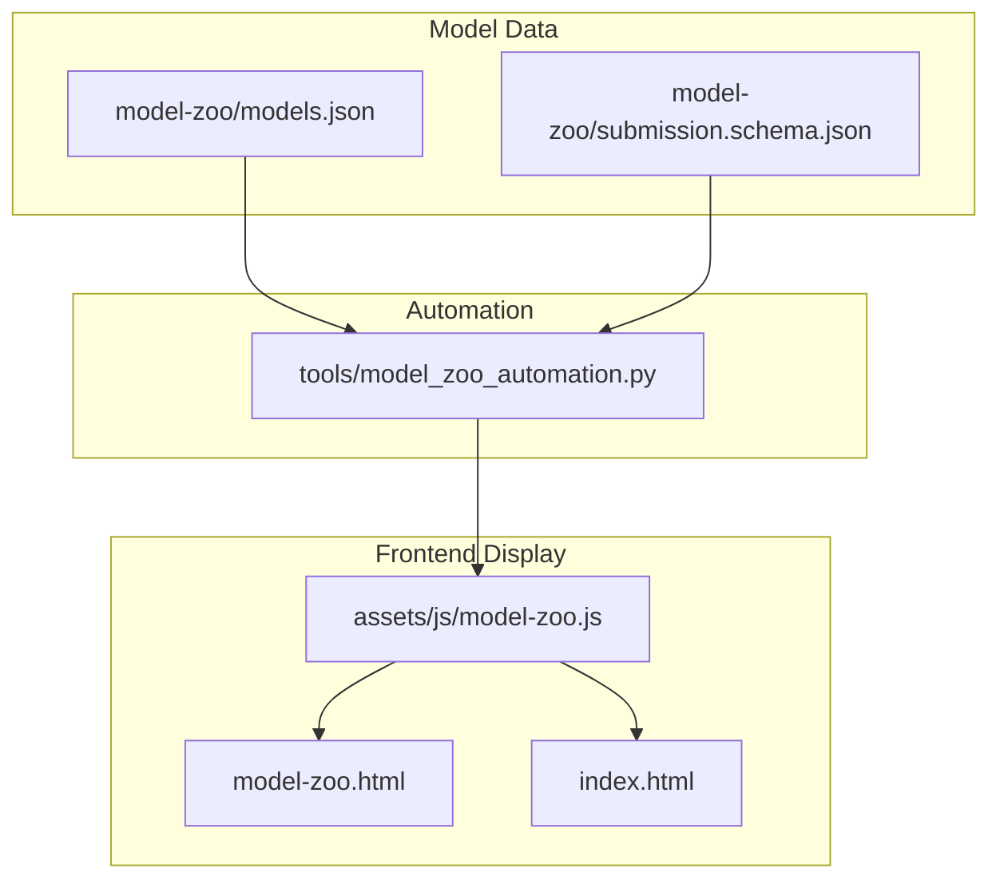
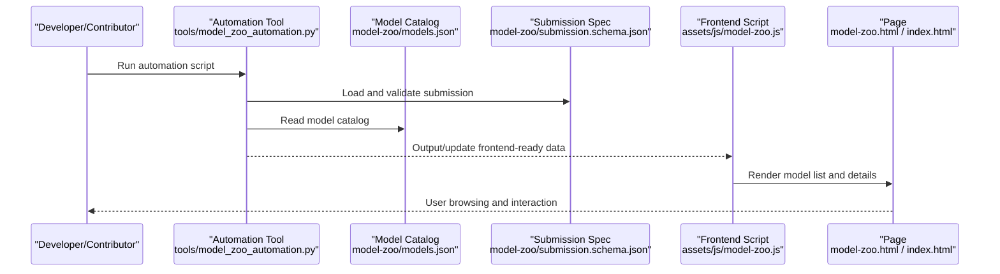
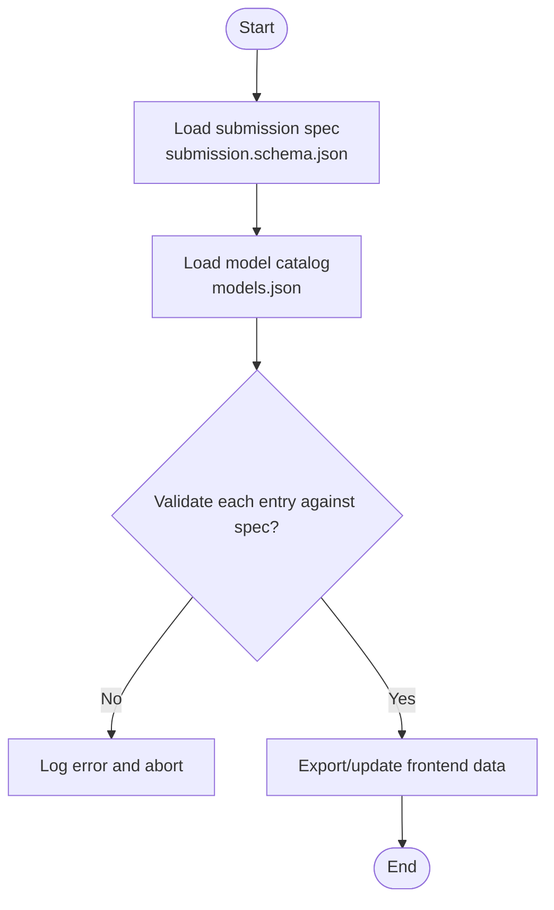
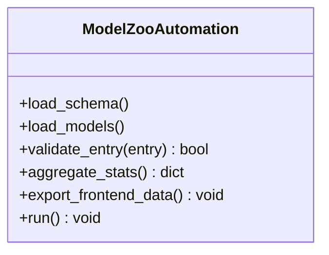
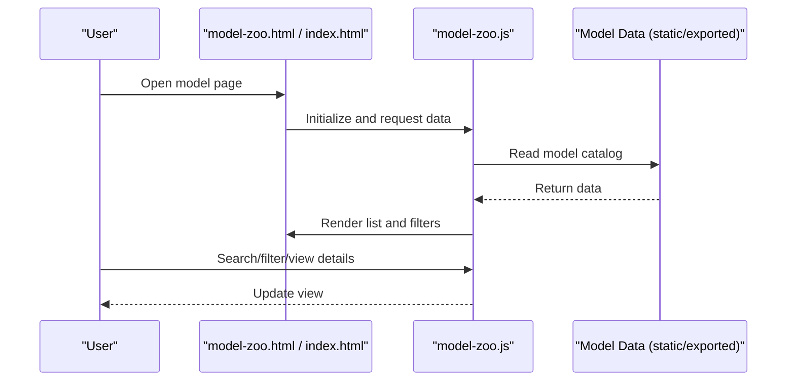
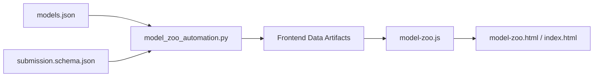

# Model Zoo System

<cite>
**Files referenced in this document**
- [model-zoo/models.json](file://model-zoo/models.json)
- [model-zoo/submission.schema.json](file://model-zoo/submission.schema.json)
- [tools/model_zoo_automation.py](file://tools/model_zoo_automation.py)
- [assets/js/model-zoo.js](file://assets/js/model-zoo.js)
- [index.html](file://index.html)
- [model-zoo.html](file://model-zoo.html)
- [app.py](file://app.py)
</cite>

## Table of Contents
1. [Introduction](#introduction)
2. [Project Structure](#project-structure)
3. [Core Components](#core-components)
4. [Architecture Overview](#architecture-overview)
5. [Detailed Component Analysis](#detailed-component-analysis)
6. [Dependency Analysis](#dependency-analysis)
7. [Performance and Scalability](#performance-and-scalability)
8. [Troubleshooting Guide](#troubleshooting-guide)
9. [Conclusion](#conclusion)
10. [Appendix](#appendix)

## Introduction
This document focuses on the implementation and usage of the "Model Zoo System," targeting the subsystem in the repository used for publishing, registering, validating, and displaying pretrained/fine-tuned models. The system is designed around the following goals:
- Provide a unified model catalog and metadata specification (JSON Schema)
- Automate generation and updating of model pages and indexes
- Provide structured data sources for the frontend display layer
- Support constraint validation for community submission and review workflows

The subsystem consists of data definitions (models.json), submission specifications (submission.schema.json), automation scripts (tools/model_zoo_automation.py), and frontend display (assets/js/model-zoo.js, HTML pages), forming a closed loop from "data—tools—display."

## Project Structure
Model Zoo related code and resources are primarily distributed in the following locations:
- model-zoo: Model catalog and submission specifications
- tools: Automation build and validation scripts
- assets/js: Frontend interaction logic
- HTML entries: Model pages and homepage integration

Diagram Sources
- [model-zoo/models.json](file://model-zoo/models.json)
- [model-zoo/submission.schema.json](file://model-zoo/submission.schema.json)
- [tools/model_zoo_automation.py](file://tools/model_zoo_automation.py)
- [assets/js/model-zoo.js](file://assets/js/model-zoo.js)
- [model-zoo.html](file://model-zoo.html)
- [index.html](file://index.html)

Section Sources
- [model-zoo/models.json](file://model-zoo/models.json)
- [model-zoo/submission.schema.json](file://model-zoo/submission.schema.json)
- [tools/model_zoo_automation.py](file://tools/model_zoo_automation.py)
- [assets/js/model-zoo.js](file://assets/js/model-zoo.js)
- [model-zoo.html](file://model-zoo.html)
- [index.html](file://index.html)

## Core Components
- Model Catalog models.json
  - Purpose: Centrally maintains all publishable model entries, including name, task type, weight path, metrics, license, and other metadata.
  - Characteristics: Serves as the Single Source of Truth (SSOT), consumed by both automation tools and frontend.
- Submission Specification submission.schema.json
  - Purpose: Defines the JSON Schema for adding or updating model entries, ensuring field completeness and value ranges.
  - Characteristics: Enforces strong validation at submission time to prevent dirty data from entering the catalog.
- Automation Script model_zoo_automation.py
  - Purpose: Reads catalog and specifications, performs validation, aggregation, export operations; generates intermediate artifacts for frontend consumption when necessary.
  - Characteristics: Connects "data—rules—artifacts," reducing manual maintenance costs.
- Frontend Script model-zoo.js
  - Purpose: Loads model data and renders list, filtering, search, detail display, and other interactions.
  - Characteristics: Decoupled from backend/static data, obtaining data through unified interfaces or static files.
- HTML Pages model-zoo.html and index.html
  - Purpose: Hosts the structure and layout of the Model Zoo page, integrating frontend scripts.
  - Characteristics: Lightweight view layer focused on display and interaction orchestration.

Section Sources
- [model-zoo/models.json](file://model-zoo/models.json)
- [model-zoo/submission.schema.json](file://model-zoo/submission.schema.json)
- [tools/model_zoo_automation.py](file://tools/model_zoo_automation.py)
- [assets/js/model-zoo.js](file://assets/js/model-zoo.js)
- [model-zoo.html](file://model-zoo.html)
- [index.html](file://index.html)

## Architecture Overview
The following diagram shows the data flow and responsibility boundaries of the Model Zoo: the data layer provides the authoritative catalog and specifications, the automation layer handles validation and artifact generation, and the frontend layer handles presentation and interaction.

Diagram Sources
- [tools/model_zoo_automation.py](file://tools/model_zoo_automation.py)
- [model-zoo/models.json](file://model-zoo/models.json)
- [model-zoo/submission.schema.json](file://model-zoo/submission.schema.json)
- [assets/js/model-zoo.js](file://assets/js/model-zoo.js)
- [model-zoo.html](file://model-zoo.html)
- [index.html](file://index.html)

## Detailed Component Analysis

### Data Layer: Model Catalog and Submission Specification
- models.json
  - Content: Array of model entries, each containing unique identifier, task type, weight path, evaluation metrics, license, author, and other information.
  - Usage: Serves as the data source for automation scripts and frontend.
- submission.schema.json
  - Content: Constrains field types, required fields, enum values, etc. for model entries.
  - Usage: Enforces strong validation at submission time to ensure data quality.

Diagram Sources
- [model-zoo/submission.schema.json](file://model-zoo/submission.schema.json)
- [model-zoo/models.json](file://model-zoo/models.json)

Section Sources
- [model-zoo/models.json](file://model-zoo/models.json)
- [model-zoo/submission.schema.json](file://model-zoo/submission.schema.json)

### Automation Layer: Model Catalog Automation Processing
- Key Features
  - Read models.json and submission.schema.json
  - Perform field validation, deduplication, sorting, filtering, etc.
  - Generate data files or caches for frontend use
  - Optional: Generate statistical summaries, changelogs
- Design Principles
  - Idempotent: Multiple runs produce consistent results
  - Observable: Clear logging and error location output
  - Extensible: New fields or rules require no frontend changes

Diagram Sources
- [tools/model_zoo_automation.py](file://tools/model_zoo_automation.py)

Section Sources
- [tools/model_zoo_automation.py](file://tools/model_zoo_automation.py)

### Frontend Layer: Model Display and Interaction
- Data Loading
  - Read model catalog from static data or files produced by automation tools
- Rendering and Interaction
  - List rendering, pagination, search, filtering (by task, size, accuracy, etc.)
  - Detail popups or navigation to weight download pages
- Error Handling
  - Network/data exception notifications
  - Empty state and degraded display

Diagram Sources
- [assets/js/model-zoo.js](file://assets/js/model-zoo.js)
- [model-zoo.html](file://model-zoo.html)
- [index.html](file://index.html)

Section Sources
- [assets/js/model-zoo.js](file://assets/js/model-zoo.js)
- [model-zoo.html](file://model-zoo.html)
- [index.html](file://index.html)

### Application Entry and Integration Points
- app.py
  - May handle local service startup, route dispatching, or integration with other modules
  - If present, can serve as the hosting entry or API gateway for the Model Zoo page

Section Sources
- [app.py](file://app.py)

## Dependency Analysis
- Internal Dependencies
  - Automation scripts depend on data definitions (models.json, submission.schema.json)
  - Frontend scripts depend on data produced by automation or static catalogs
- External Dependencies
  - Frontend typically depends on the browser environment
  - Automation scripts depend on Python standard library or third-party JSON/validation libraries (implementation-specific)

Diagram Sources
- [model-zoo/models.json](file://model-zoo/models.json)
- [model-zoo/submission.schema.json](file://model-zoo/submission.schema.json)
- [tools/model_zoo_automation.py](file://tools/model_zoo_automation.py)
- [assets/js/model-zoo.js](file://assets/js/model-zoo.js)
- [model-zoo.html](file://model-zoo.html)
- [index.html](file://index.html)

Section Sources
- [model-zoo/models.json](file://model-zoo/models.json)
- [model-zoo/submission.schema.json](file://model-zoo/submission.schema.json)
- [tools/model_zoo_automation.py](file://tools/model_zoo_automation.py)
- [assets/js/model-zoo.js](file://assets/js/model-zoo.js)
- [model-zoo.html](file://model-zoo.html)
- [index.html](file://index.html)

## Performance and Scalability
- Data Scale
  - When model entries are numerous, pagination and lazy loading strategies are recommended on the frontend to reduce initial render pressure
- Automation Efficiency
  - Incremental validation: Only validate and re-export changed entries
  - Parallel processing: Concurrent validation and export for batch entries
- Extensibility
  - Schema evolution for new fields while maintaining backward compatibility
  - Frontend configurable filter dimensions for rapid adaptation to new business requirements

[This section provides general guidance and does not directly analyze specific files]

## Troubleshooting Guide
- Submission Validation Failure
  - Check whether entries in models.json satisfy the constraints of submission.schema.json
  - Pay attention to error location information output by automation scripts
- Frontend Unable to Load Data
  - Confirm automation scripts have correctly exported data files
  - Check data paths and cross-origin policies in page scripts
- Page Rendering Anomalies
  - Check browser console error logs
  - Verify data format and field naming match frontend expectations

Section Sources
- [model-zoo/submission.schema.json](file://model-zoo/submission.schema.json)
- [tools/model_zoo_automation.py](file://tools/model_zoo_automation.py)
- [assets/js/model-zoo.js](file://assets/js/model-zoo.js)

## Conclusion
The Model Zoo System achieves standardized registration, automated governance, and visual display of model assets through a layered design of "data—rules—tools—frontend." Its core value lies in:
- Ensuring data quality with JSON Schema
- Reducing maintenance costs with automation scripts
- Improving user experience with clear frontend interactions

Recommended continuous improvements in future iterations:
- Add version management and change auditing
- Introduce richer filtering and comparison capabilities
- Optimize rendering and query performance under large data volumes

[This section is summary content and does not directly analyze specific files]

## Appendix
- Terminology
  - Model Catalog: A JSON file centrally describing model metadata
  - Submission Specification: A JSON Schema constraining model catalog fields
  - Automation Script: A tool program for validation, aggregation, and export
  - Frontend Script: A JavaScript module responsible for data loading and page rendering

[This section provides conceptual explanations and does not directly analyze specific files]
