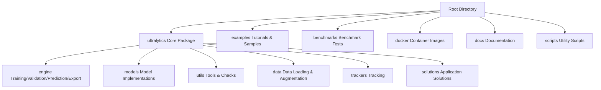
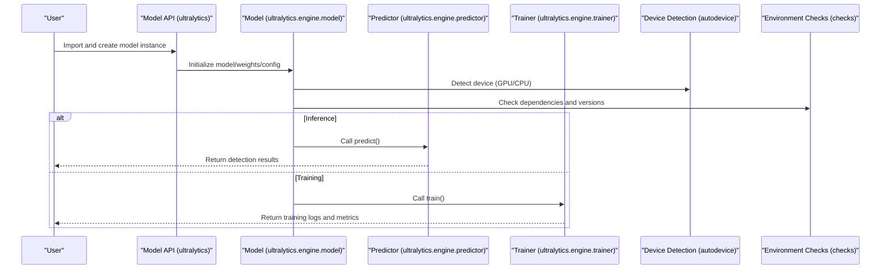
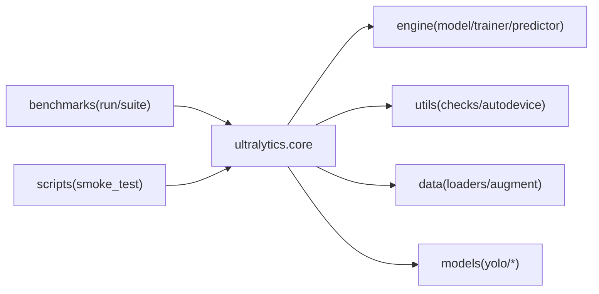

# Quick Start

<cite>
**Files referenced in this document**
- [README.md](file://README.md)
- [pyproject.toml](file://pyproject.toml)
- [ultralytics/__init__.py](file://ultralytics/__init__.py)
- [ultralytics/engine/model.py](file://ultralytics/engine/model.py)
- [ultralytics/engine/predictor.py](file://ultralytics/engine/predictor.py)
- [ultralytics/engine/trainer.py](file://ultralytics/engine/trainer.py)
- [ultralytics/utils/checks.py](file://ultralytics/utils/checks.py)
- [ultralytics/utils/autodevice.py](file://ultralytics/utils/autodevice.py)
- [examples/tutorial.ipynb](file://examples/tutorial.ipynb)
- [examples/hub.ipynb](file://examples/hub.ipynb)
- [benchmarks/run.py](file://benchmarks/run.py)
- [benchmarks/suite.py](file://benchmarks/suite.py)
- [scripts/smoke_test_coco2017.py](file://scripts/smoke_test_coco2017.py)
- [docker/Dockerfile](file://docker/Dockerfile)
</cite>

## Table of Contents
1. [Introduction](#introduction)
2. [Project Structure](#project-structure)
3. [Core Components](#core-components)
4. [Architecture Overview](#architecture-overview)
5. [Detailed Component Analysis](#detailed-component-analysis)
6. [Dependency Analysis](#dependency-analysis)
7. [Performance Considerations](#performance-considerations)
8. [Troubleshooting Guide](#troubleshooting-guide)
9. [Conclusion](#conclusion)
10. [Appendix](#appendix)

## Introduction
This Quick Start guide is intended for users who are new to YOLO-Master. The goal is to help you complete environment setup, installation and configuration, run your first training and inference examples, and master the basic usage of the command-line interface and Python API in the shortest possible time. It also provides instructions for setting up a Jupyter Notebook interactive development environment, accessing the pretrained model library, common problem solutions, and performance benchmarking and basic tuning recommendations.

## Project Structure
YOLO-Master adopts a modular design. Core functionality is concentrated in the ultralytics package, which includes modules for model definition, trainer, predictor, export tools, dataset loading, and evaluation; examples provides tutorials and sample scripts; benchmarks provides benchmark test suites; docker provides containerized builds; docs contains documentation resources.

[This section is a conceptual overview and does not directly analyze specific files]

## Core Components
- Model Entry & Unified Interface: Exposes high-level APIs through package-level initialization, enabling concise model loading, training, validation, and inference.
- Trainer: Encapsulates the training loop, optimizer, loss computation, logging, and callback mechanisms.
- Predictor: Encapsulates the inference pipeline, supporting automatic device selection, batch processing, visualization output, and result post-processing.
- Device & Environment Checks: Automatically detects GPU/CPU availability and performs driver and runtime compatibility validation.
- Benchmarking: Provides end-to-end benchmark tasks and metric statistics for horizontal comparison of different models or configurations.

Section Sources
- [ultralytics/__init__.py](file://ultralytics/__init__.py)
- [ultralytics/engine/trainer.py](file://ultralytics/engine/trainer.py)
- [ultralytics/engine/predictor.py](file://ultralytics/engine/predictor.py)
- [ultralytics/utils/checks.py](file://ultralytics/utils/checks.py)
- [ultralytics/utils/autodevice.py](file://ultralytics/utils/autodevice.py)

## Architecture Overview
The following diagram shows the critical path from user invocation to internal execution: the Python API or CLI enters the model object, which is then handled by the trainer or predictor, with underlying dependencies on device detection and utility functions for environment adaptation and data processing.

Diagram Sources
- [ultralytics/engine/model.py](file://ultralytics/engine/model.py)
- [ultralytics/engine/predictor.py](file://ultralytics/engine/predictor.py)
- [ultralytics/engine/trainer.py](file://ultralytics/engine/trainer.py)
- [ultralytics/utils/autodevice.py](file://ultralytics/utils/autodevice.py)
- [ultralytics/utils/checks.py](file://ultralytics/utils/checks.py)

## Detailed Component Analysis

### Environment Installation and Configuration
- Python Environment
  - Python 3.10+ is recommended; using conda or venv to manage virtual environments is advised.
  - Install dependencies using a package manager at the repository root (refer to pyproject.toml).
- GPU Drivers and CUDA
  - Ensure NVIDIA drivers and CUDA toolkit matching PyTorch are installed.
  - If using CPU only, CUDA-related steps can be skipped.
- Optional Acceleration Backends
  - Depending on deployment targets, ONNXRuntime, TensorRT, OpenVINO, etc. can be selected (see integration guides in examples and docs).
- Docker One-Click Environment
  - Use docker/Dockerfile to build images, suitable for isolation and reproducibility.

Section Sources
- [pyproject.toml](file://pyproject.toml)
- [docker/Dockerfile](file://docker/Dockerfile)

### First Model Training Demo (Based on Small Dataset)
- Prepare Data
  - Use the mini-detect sample data provided in the repository or prepare your own YOLO format dataset.
  - Write or reuse a dataset configuration file (e.g., mini_detect.yaml), specifying classes and paths.
- Start Training
  - Invoke the training interface via Python API or command line, specifying model name and data configuration.
  - The training process will output logs, save weights, and produce visualization results.
- View Results
  - After training completes, view weights, curves, and visualization images in the runs/train directory.

Section Sources
- [agent/assets/mini-detect/mini_detect.yaml](file://agent/assets/mini-detect/mini_detect.yaml)
- [ultralytics/engine/trainer.py](file://ultralytics/engine/trainer.py)

### First Model Inference Demo (Using Pretrained Model)
- Load Pretrained Model
  - Load official pretrained weights by model name or weight path.
- Run Inference
  - Perform object detection on a single image or video stream, setting confidence threshold and NMS parameters.
  - Supports batch inference and multi-device parallelism.
- Result Output
  - Returns detection results (bounding boxes, classes, confidence scores), with optional visualization image saving.

Section Sources
- [ultralytics/engine/model.py](file://ultralytics/engine/model.py)
- [ultralytics/engine/predictor.py](file://ultralytics/engine/predictor.py)

### Command-Line Interface (CLI) Basic Usage
- Common Commands
  - Train: yolo train ...
  - Validate: yolo val ...
  - Predict: yolo predict ...
  - Export: yolo export ...
  - Benchmark: yolo benchmark ...
- Key Parameters
  - Data configuration, model name, device selection, batch size, learning rate, iterations, etc.
- Example
  - Refer to the invocation style in scripts/smoke_test_coco2017.py for quick environment verification.

Section Sources
- [scripts/smoke_test_coco2017.py](file://scripts/smoke_test_coco2017.py)

### Python API Basic Usage
- Load Model
  - Create a model instance via the package-level API, specifying model name or weight path.
- Training and Validation
  - Call train()/val() interfaces, passing data configuration and hyperparameters.
- Inference
  - Call predict() interface, passing image path or array, setting thresholds and visualization options.
- Result Processing
  - Get the list of detection results, iterating over each target's class, confidence, and coordinates.

Section Sources
- [ultralytics/__init__.py](file://ultralytics/__init__.py)
- [ultralytics/engine/model.py](file://ultralytics/engine/model.py)
- [ultralytics/engine/predictor.py](file://ultralytics/engine/predictor.py)

### Jupyter Notebook Interactive Development
- Install Dependencies
  - Install notebook/jupyterlab and visualization dependencies.
- Run Tutorials
  - Open examples/tutorial.ipynb or examples/hub.ipynb and execute step by step.
- Debugging and Visualization
  - Leverage Notebook's step-by-step execution and plotting capabilities to quickly verify data and model performance.

Section Sources
- [examples/tutorial.ipynb](file://examples/tutorial.ipynb)
- [examples/hub.ipynb](file://examples/hub.ipynb)

### Pretrained Model Library Access and Usage
- Online Download
  - During first inference or training, official pretrained weights can be automatically downloaded by model name.
- Local Cache
  - Weights are cached to a local directory by default; subsequent loads can use the cache to avoid repeated downloads.
- Custom Weights
  - Supports directly specifying a local .pt weight path for inference or fine-tuning.

Section Sources
- [ultralytics/engine/model.py](file://ultralytics/engine/model.py)

### Performance Benchmarking and Basic Tuning
- Benchmarking
  - Use benchmarks/run.py and benchmarks/suite.py to execute end-to-end benchmark tasks and collect throughput and latency statistics.
- Basic Tuning Recommendations
  - Adjust batch size, input resolution, NMS threshold, and confidence threshold.
  - Enable mixed precision and compilation optimization (if applicable).
  - Increase data augmentation and sampling strategies for small objects.
- Monitoring and Logging
  - Monitor training curves and validation metrics, using logs to identify bottlenecks.

Section Sources
- [benchmarks/run.py](file://benchmarks/run.py)
- [benchmarks/suite.py](file://benchmarks/suite.py)

## Dependency Analysis
- Core Dependencies
  - PyTorch, NumPy, OpenCV, Pillow, tqdm, matplotlib, etc.
- Optional Dependencies
  - ONNXRuntime, TensorRT, OpenVINO, Gradio, Streamlit, etc. for export and deployment.
- Device and Runtime
  - autodevice handles device selection; checks handles environment and version validation.

Diagram Sources
- [ultralytics/engine/model.py](file://ultralytics/engine/model.py)
- [ultralytics/engine/trainer.py](file://ultralytics/engine/trainer.py)
- [ultralytics/engine/predictor.py](file://ultralytics/engine/predictor.py)
- [ultralytics/utils/checks.py](file://ultralytics/utils/checks.py)
- [ultralytics/utils/autodevice.py](file://ultralytics/utils/autodevice.py)
- [benchmarks/run.py](file://benchmarks/run.py)
- [benchmarks/suite.py](file://benchmarks/suite.py)
- [scripts/smoke_test_coco2017.py](file://scripts/smoke_test_coco2017.py)

Section Sources
- [pyproject.toml](file://pyproject.toml)

## Performance Considerations
- Hardware Selection
  - Prefer GPU for training and inference; CPU mode is suitable for lightweight scenarios.
- Memory and VRAM
  - Set batch size and input resolution appropriately to avoid OOM.
- Data Pipeline
  - Use multi-threading and caching to improve I/O efficiency; enable prefetching and preprocessing pipelines when necessary.
- Export and Deployment
  - Choose the appropriate export format (ONNX/TensorRT/OpenVINO) based on the target platform and perform end-to-end latency testing.

[This section provides general guidance and does not directly analyze specific files]

## Troubleshooting Guide
- GPU Not Detected
  - Check whether NVIDIA driver and CUDA versions match PyTorch.
  - Use autodevice and checks for self-diagnosis to confirm device status.
- Missing Dependencies or Version Conflicts
  - Reinstall dependencies, ensuring version compatibility as listed in pyproject.toml.
- Data Path Errors
  - Verify dataset configuration file paths are correct and labels correspond one-to-one with images.
- Abnormal Inference Results
  - Adjust confidence and NMS thresholds; check input dimensions and normalization.
- Benchmark Failures
  - Check network and cache directory permissions; confirm benchmark task data is available.

Section Sources
- [ultralytics/utils/autodevice.py](file://ultralytics/utils/autodevice.py)
- [ultralytics/utils/checks.py](file://ultralytics/utils/checks.py)
- [scripts/smoke_test_coco2017.py](file://scripts/smoke_test_coco2017.py)

## Conclusion
Through this guide, you have completed YOLO-Master environment setup, your first training and inference examples, basic CLI and Python API usage, and learned about Notebook development, pretrained model access, benchmarking, and common problem resolution. It is recommended to gradually introduce data augmentation, hyperparameter search, and export optimization in real projects based on business data and deployment targets for more stable and efficient performance.

## Appendix
- Reference Documentation
  - README.md provides project overview and usage instructions.
  - The docs directory contains detailed documentation for various tasks and modes.
- Examples and Scripts
  - examples and scripts provide rich practical cases and automation scripts.
- Community and Support
  - For issues, refer to docs/help and the issues feedback channel.

Section Sources
- [README.md](file://README.md)
