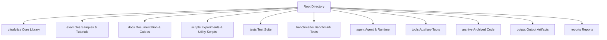
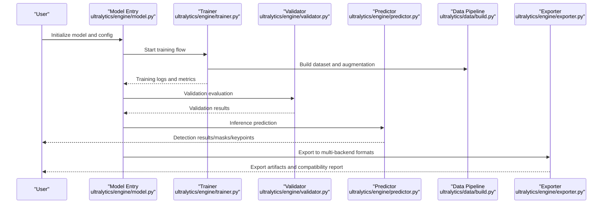
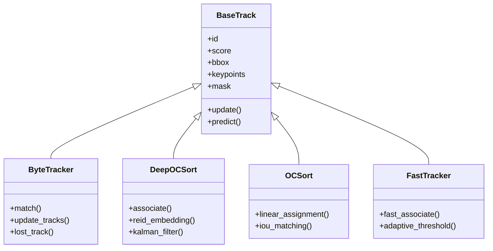
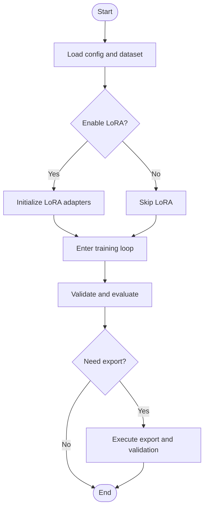
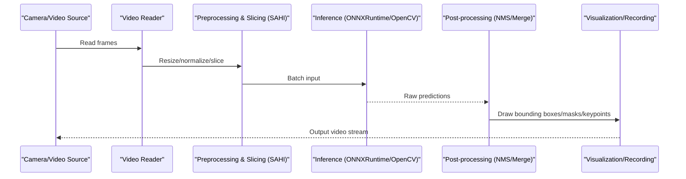
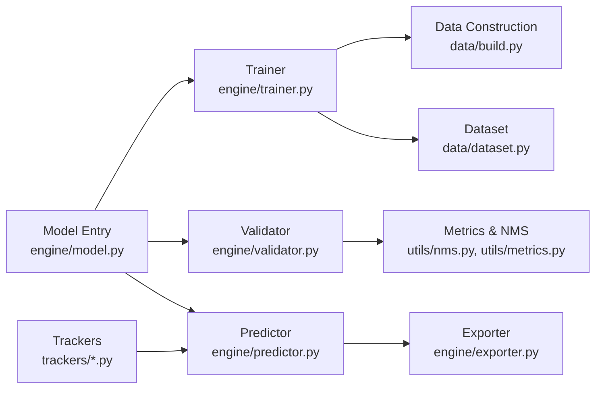

# Examples and Tutorials

<cite>
**Files referenced in this document**
- [README.md](file://README.md)
- [examples/tutorial.ipynb](file://examples/tutorial.ipynb)
- [examples/object_tracking.ipynb](file://examples/object_tracking.ipynb)
- [examples/object_counting.ipynb](file://examples/object_counting.ipynb)
- [examples/heatmaps.ipynb](file://examples/heatmaps.ipynb)
- [examples/hub.ipynb](file://examples/hub.ipynb)
- [examples/RTDETR-ONNXRuntime-Python/main.py](file://examples/RTDETR-ONNXRuntime-Python/main.py)
- [examples/YOLOv8-ONNXRuntime/main.py](file://examples/YOLOv8-ONNXRuntime/main.py)
- [examples/YOLOv8-OpenCV-ONNX-Python/main.py](file://examples/YOLOv8-OpenCV-ONNX-Python/main.py)
- [examples/YOLOv8-SAHI-Inference-Video/yolov8_sahi.py](file://examples/YOLOv8-SAHI-Inference-Video/yolov8_sahi.py)
- [examples/YOLOv8-Region-Counter/yolov8_region_counter.py](file://examples/YOLOv8-Region-Counter/yolov8_region_counter.py)
- [examples/YOLOv8-Action-Recognition/action_recognition.py](file://examples/YOLOv8-Action-Recognition/action_recognition.py)
- [examples/YOLO-Master-Cross-Platform-Edge-Deployment/TECHNICAL_REPORT.md](file://examples/YOLO-Master-Cross-Platform-Edge-Deployment/TECHNICAL_REPORT.md)
- [examples/YOLO-Master-Edge-Deployment/export_edge_models.py](file://examples/YOLO-Master-Edge-Deployment/export_edge_models.py)
- [examples/YOLO-Master-Edge-Deployment/edge_utils.py](file://examples/YOLO-Master-Edge-Deployment/edge_utils.py)
- [examples/YOLO-Master-EsMoE-VisDrone-Edge/python/infer.py](file://examples/YOLO-Master-EsMoE-VisDrone-Edge/python/infer.py)
- [examples/molora/basic_finetune.py](file://examples/molora/basic_finetune.py)
- [examples/lora_examples/run_yolo_master_lora_rank_sweep.py](file://examples/lora_examples/run_yolo_master_lora_rank_sweep.py)
- [examples/lora_examples/yolo_master_lora_README.md](file://examples/lora_examples/yolo_master_lora_README.md)
- [ultralytics/engine/predictor.py](file://ultralytics/engine/predictor.py)
- [ultralytics/engine/trainer.py](file://ultralytics/engine/trainer.py)
- [ultralytics/engine/validator.py](file://ultralytics/engine/validator.py)
- [ultralytics/engine/model.py](file://ultralytics/engine/model.py)
- [ultralytics/data/build.py](file://ultralytics/data/build.py)
- [ultralytics/data/dataset.py](file://ultralytics/data/dataset.py)
- [ultralytics/utils/export.py](file://ultralytics/utils/export.py)
- [ultralytics/solutions/streamlit_inference.py](file://ultralytics/solutions/streamlit_inference.py)
- [ultralytics/solutions/analytics.py](file://ultralytics/solutions/analytics.py)
- [ultralytics/trackers/track.py](file://ultralytics/trackers/track.py)
- [ultralytics/trackers/basetrack.py](file://ultralytics/trackers/basetrack.py)
- [ultralytics/trackers/byte_tracker.py](file://ultralytics/trackers/byte_tracker.py)
- [ultralytics/trackers/deep_oc_sort.py](file://ultralytics/trackers/deep_oc_sort.py)
- [ultralytics/trackers/oc_sort.py](file://ultralytics/trackers/oc_sort.py)
- [ultralytics/trackers/fast_tracker.py](file://ultralytics/trackers/fast_tracker.py)
- [ultralytics/trackers/track_tracker.py](file://ultralytics/trackers/track_tracker.py)
- [ultralytics/utils/lora/__init__.py](file://ultralytics/utils/lora/__init__.py)
- [ultralytics/vpeft/__init__.py](file://ultralytics/vpeft/__init__.py)
- [ultralytics/cfg/default.yaml](file://ultralytics/cfg/default.yaml)
- [ultralytics/models/yolo/model.py](file://ultralytics/models/yolo/model.py)
- [ultralytics/models/yolo/detect/model.py](file://ultralytics/models/yolo/detect/model.py)
- [ultralytics/models/yolo/pose/model.py](file://ultralytics/models/yolo/pose/model.py)
- [ultralytics/models/yolo/segment/model.py](file://ultralytics/models/yolo/segment/model.py)
- [ultralytics/models/yolo/classify/model.py](file://ultralytics/models/yolo/classify/model.py)
- [ultralytics/models/yolo/obb/model.py](file://ultralytics/models/yolo/obb/model.py)
- [ultralytics/models/yolo/val.py](file://ultralytics/models/yolo/val.py)
- [ultralytics/models/yolo/train.py](file://ultralytics/models/yolo/train.py)
- [ultralytics/models/yolo/predict.py](file://ultralytics/models/yolo/predict.py)
- [ultralytics/models/yolo/track.py](file://ultralytics/models/yolo/track.py)
- [ultralytics/models/yolo/export.py](file://ultralytics/models/yolo/export.py)
- [ultralytics/utils/tuner.py](file://ultralytics/utils/tuner.py)
- [ultralytics/utils/callbacks/__init__.py](file://ultralytics/utils/callbacks/__init__.py)
- [ultralytics/utils/logger.py](file://ultralytics/utils/logger.py)
- [ultralytics/utils/benchmarks.py](file://ultralytics/utils/benchmarks.py)
- [ultralytics/utils/nms.py](file://ultralytics/utils/nms.py)
- [ultralytics/utils/plotting.py](file://ultralytics/utils/plotting.py)
- [ultralytics/utils/ops.py](file://ultralytics/utils/ops.py)
- [ultralytics/utils/checks.py](file://ultralytics/utils/checks.py)
- [ultralytics/utils/files.py](file://ultralytics/utils/files.py)
- [ultralytics/utils/downloads.py](file://ultralytics/utils/downloads.py)
- [ultralytics/utils/errors.py](file://ultralytics/utils/errors.py)
- [ultralytics/utils/events.py](file://ultralytics/utils/events.py)
- [ultralytics/utils/autobatch.py](file://ultralytics/utils/autobatch.py)
- [ultralytics/utils/autodevice.py](file://ultralytics/utils/autodevice.py)
- [ultralytics/utils/dist.py](file://ultralytics/utils/dist.py)
- [ultralytics/utils/torchrun.py](file://ultralytics/utils/torchrun.py)
- [ultralytics/utils/tqdm.py](file://ultralytics/utils/tqdm.py)
- [ultralytics/utils/triton.py](file://ultralytics/utils/triton.py)
- [ultralytics/utils/export_capabilities.py](file://ultralytics/utils/export_capabilities.py)
- [ultralytics/utils/export_preflight.py](file://ultralytics/utils/export_preflight.py)
- [ultralytics/utils/export_validation.py](file://ultralytics/utils/export_validation.py)
</cite>

## Table of Contents
1. [Introduction](#introduction)
2. [Project Structure](#project-structure)
3. [Core Components](#core-components)
4. [Architecture Overview](#architecture-overview)
5. [Detailed Component Analysis](#detailed-component-analysis)
6. [Dependency Analysis](#dependency-analysis)
7. [Performance Considerations](#performance-considerations)
8. [Troubleshooting Guide](#troubleshooting-guide)
9. [Conclusion](#conclusion)
10. [Appendix](#appendix)

## Introduction
This chapter is intended for readers who want to start using YOLO-Master from scratch, providing a complete onboarding path and advanced practices. Content covers:
- Environment setup, first training and inference demos
- Object detection, instance segmentation, pose estimation, multi-object tracking task scenarios
- Advanced features: LoRA fine-tuning, MoE configuration, custom data loading
- Industrial applications: real-time video processing, batch inference services, model deployment
- Jupyter Notebook interactive development best practices
- Performance optimization and parameter tuning guide
- Common issues and troubleshooting methods
- Secondary development and customization recommendations
- Community contributions and third-party integration cases
- Continuous learning and advanced resource links

## Project Structure
The repository adopts a modular organization, with core capabilities concentrated in the ultralytics package, examples and tutorials in the examples directory, documentation in docs, and utility scripts in scripts.

**Diagram Sources**
- [README.md:1-50](file://README.md#L1-L50)

**Section Sources**
- [README.md:1-50](file://README.md#L1-L50)

## Core Components
- Models and Task Modules
  - Unified model entry and task adaptation layer, supporting detection, segmentation, pose, classification, oriented bounding box tasks.
  - Key files: [ultralytics/models/yolo/model.py](file://ultralytics/models/yolo/model.py), [ultralytics/models/yolo/detect/model.py](file://ultralytics/models/yolo/detect/model.py), [ultralytics/models/yolo/segment/model.py](file://ultralytics/models/yolo/segment/model.py), [ultralytics/models/yolo/pose/model.py](file://ultralytics/models/yolo/pose/model.py), [ultralytics/models/yolo/classify/model.py](file://ultralytics/models/yolo/classify/model.py), [ultralytics/models/yolo/obb/model.py](file://ultralytics/models/yolo/obb/model.py).
- Training, Validation, and Inference Engine
  - Trainer, validator, and predictor form the core execution flow; exporter handles multi-backend export.
  - Key files: [ultralytics/engine/trainer.py](file://ultralytics/engine/trainer.py), [ultralytics/engine/validator.py](file://ultralytics/engine/validator.py), [ultralytics/engine/predictor.py](file://ultralytics/engine/predictor.py), [ultralytics/engine/model.py](file://ultralytics/engine/model.py), [ultralytics/engine/exporter.py](file://ultralytics/engine/exporter.py).
- Data Pipeline
  - Dataset construction, augmentation, loading, and transformation.
  - Key files: [ultralytics/data/build.py](file://ultralytics/data/build.py), [ultralytics/data/dataset.py](file://ultralytics/data/dataset.py), [ultralytics/data/loaders.py](file://ultralytics/data/loaders.py), [ultralytics/data/augment.py](file://ultralytics/data/augment.py).
- Tracking Subsystem
  - Multiple tracking algorithms and base class abstractions for easy extension and combination.
  - Key files: [ultralytics/trackers/track.py](file://ultralytics/trackers/track.py), [ultralytics/trackers/basetrack.py](file://ultralytics/trackers/basetrack.py), [ultralytics/trackers/byte_tracker.py](file://ultralytics/trackers/byte_tracker.py), [ultralytics/trackers/deep_oc_sort.py](file://ultralytics/trackers/deep_oc_sort.py), [ultralytics/trackers/oc_sort.py](file://ultralytics/trackers/oc_sort.py), [ultralytics/trackers/fast_tracker.py](file://ultralytics/trackers/fast_tracker.py), [ultralytics/trackers/track_tracker.py](file://ultralytics/trackers/track_tracker.py).
- Solutions and Applications
  - Visualization and analytics tools for business scenarios.
  - Key files: [ultralytics/solutions/streamlit_inference.py](file://ultralytics/solutions/streamlit_inference.py), [ultralytics/solutions/analytics.py](file://ultralytics/solutions/analytics.py).
- LoRA and PEFT
  - Lightweight fine-tuning and parameter-efficient training capabilities.
  - Key files: [ultralytics/utils/lora/__init__.py](file://ultralytics/utils/lora/__init__.py), [ultralytics/vpeft/__init__.py](file://ultralytics/vpeft/__init__.py).
- Export and Deployment
  - Multi-backend export with pre-checks, capability matrix, and validation workflows.
  - Key files: [ultralytics/utils/export.py](file://ultralytics/utils/export.py), [ultralytics/utils/export_capabilities.py](file://ultralytics/utils/export_capabilities.py), [ultralytics/utils/export_preflight.py](file://ultralytics/utils/export_preflight.py), [ultralytics/utils/export_validation.py](file://ultralytics/utils/export_validation.py).

**Section Sources**
- [ultralytics/models/yolo/model.py:1-120](file://ultralytics/models/yolo/model.py#L1-L120)
- [ultralytics/engine/trainer.py:1-120](file://ultralytics/engine/trainer.py#L1-L120)
- [ultralytics/engine/validator.py:1-120](file://ultralytics/engine/validator.py#L1-L120)
- [ultralytics/engine/predictor.py:1-120](file://ultralytics/engine/predictor.py#L1-L120)
- [ultralytics/data/build.py:1-120](file://ultralytics/data/build.py#L1-L120)
- [ultralytics/data/dataset.py:1-120](file://ultralytics/data/dataset.py#L1-L120)
- [ultralytics/trackers/track.py:1-120](file://ultralytics/trackers/track.py#L1-L120)
- [ultralytics/solutions/streamlit_inference.py:1-120](file://ultralytics/solutions/streamlit_inference.py#L1-L120)
- [ultralytics/utils/export.py:1-120](file://ultralytics/utils/export.py#L1-L120)

## Architecture Overview
The core execution flow of YOLO-Master revolves around "model—training—validation—inference—export," with the data pipeline running throughout, and tracking and solutions layered as upper-level capabilities.

**Diagram Sources**
- [ultralytics/engine/model.py:1-120](file://ultralytics/engine/model.py#L1-L120)
- [ultralytics/engine/trainer.py:1-120](file://ultralytics/engine/trainer.py#L1-L120)
- [ultralytics/engine/validator.py:1-120](file://ultralytics/engine/validator.py#L1-L120)
- [ultralytics/engine/predictor.py:1-120](file://ultralytics/engine/predictor.py#L1-L120)
- [ultralytics/data/build.py:1-120](file://ultralytics/data/build.py#L1-L120)
- [ultralytics/engine/exporter.py:1-120](file://ultralytics/engine/exporter.py#L1-L120)

## Detailed Component Analysis

### Quick Start: From Environment to First Training and Inference
- Environment Preparation
  - Refer to repository README and documentation installation guides to ensure Python, PyTorch, and necessary dependencies are correctly installed.
  - Reference files: [README.md](file://README.md), [docs/en/quickstart.md](file://docs/en/quickstart.md).
- First Model Training
  - Train using built-in datasets or custom YAML configurations.
  - Reference files: [ultralytics/cfg/default.yaml](file://ultralytics/cfg/default.yaml), [ultralytics/engine/trainer.py](file://ultralytics/engine/trainer.py).
- Inference Demo
  - Use the predictor to perform inference on images/videos and visualize results.
  - Reference files: [ultralytics/engine/predictor.py](file://ultralytics/engine/predictor.py), [examples/tutorial.ipynb](file://examples/tutorial.ipynb).

**Section Sources**
- [README.md:1-50](file://README.md#L1-L50)
- [docs/en/quickstart.md:1-50](file://docs/en/quickstart.md#L1-L50)
- [ultralytics/cfg/default.yaml:1-50](file://ultralytics/cfg/default.yaml#L1-L50)
- [ultralytics/engine/trainer.py:1-120](file://ultralytics/engine/trainer.py#L1-L120)
- [ultralytics/engine/predictor.py:1-120](file://ultralytics/engine/predictor.py#L1-L120)
- [examples/tutorial.ipynb:1-120](file://examples/tutorial.ipynb#L1-L120)

### Application Scenarios: Object Detection, Instance Segmentation, Pose Estimation, Multi-Object Tracking
- Object Detection
  - Use detect task model and predictor for inference and evaluation.
  - Reference files: [ultralytics/models/yolo/detect/model.py](file://ultralytics/models/yolo/detect/model.py), [ultralytics/models/yolo/predict.py](file://ultralytics/models/yolo/predict.py), [ultralytics/models/yolo/val.py](file://ultralytics/models/yolo/val.py).
- Instance Segmentation
  - Use segment task model to output masks, combined with visualization and counting solutions.
  - Reference files: [ultralytics/models/yolo/segment/model.py](file://ultralytics/models/yolo/segment/model.py), [examples/object_counting.ipynb](file://examples/object_counting.ipynb).
- Pose Estimation
  - Use pose task model to output keypoints, combined with action recognition and trajectory analysis.
  - Reference files: [ultralytics/models/yolo/pose/model.py](file://ultralytics/models/yolo/pose/model.py), [examples/YOLOv8-Action-Recognition/action_recognition.py](file://examples/YOLOv8-Action-Recognition/action_recognition.py).
- Multi-Object Tracking
  - Use track task with multiple trackers (ByteTrack, DeepOC-SORT, OC-SORT, FastTracker, etc.).
  - Reference files: [ultralytics/models/yolo/track.py](file://ultralytics/models/yolo/track.py), [ultralytics/trackers/byte_tracker.py](file://ultralytics/trackers/byte_tracker.py), [ultralytics/trackers/deep_oc_sort.py](file://ultralytics/trackers/deep_oc_sort.py), [ultralytics/trackers/oc_sort.py](file://ultralytics/trackers/oc_sort.py), [ultralytics/trackers/fast_tracker.py](file://ultralytics/trackers/fast_tracker.py), [examples/object_tracking.ipynb](file://examples/object_tracking.ipynb).

**Diagram Sources**
- [ultralytics/trackers/basetrack.py:1-120](file://ultralytics/trackers/basetrack.py#L1-L120)
- [ultralytics/trackers/byte_tracker.py:1-120](file://ultralytics/trackers/byte_tracker.py#L1-L120)
- [ultralytics/trackers/deep_oc_sort.py:1-120](file://ultralytics/trackers/deep_oc_sort.py#L1-L120)
- [ultralytics/trackers/oc_sort.py:1-120](file://ultralytics/trackers/oc_sort.py#L1-L120)
- [ultralytics/trackers/fast_tracker.py:1-120](file://ultralytics/trackers/fast_tracker.py#L1-L120)

**Section Sources**
- [ultralytics/models/yolo/detect/model.py:1-120](file://ultralytics/models/yolo/detect/model.py#L1-L120)
- [ultralytics/models/yolo/segment/model.py:1-120](file://ultralytics/models/yolo/segment/model.py#L1-L120)
- [ultralytics/models/yolo/pose/model.py:1-120](file://ultralytics/models/yolo/pose/model.py#L1-L120)
- [ultralytics/models/yolo/track.py:1-120](file://ultralytics/models/yolo/track.py#L1-L120)
- [ultralytics/trackers/basetrack.py:1-120](file://ultralytics/trackers/basetrack.py#L1-L120)
- [ultralytics/trackers/byte_tracker.py:1-120](file://ultralytics/trackers/byte_tracker.py#L1-L120)
- [ultralytics/trackers/deep_oc_sort.py:1-120](file://ultralytics/trackers/deep_oc_sort.py#L1-L120)
- [ultralytics/trackers/oc_sort.py:1-120](file://ultralytics/trackers/oc_sort.py#L1-L120)
- [ultralytics/trackers/fast_tracker.py:1-120](file://ultralytics/trackers/fast_tracker.py#L1-L120)
- [examples/object_tracking.ipynb:1-120](file://examples/object_tracking.ipynb#L1-L120)
- [examples/object_counting.ipynb:1-120](file://examples/object_counting.ipynb#L1-L120)
- [examples/YOLOv8-Action-Recognition/action_recognition.py:1-120](file://examples/YOLOv8-Action-Recognition/action_recognition.py#L1-L120)

### Advanced Features: LoRA Fine-tuning, MoE Configuration, Custom Data Loading
- LoRA Fine-tuning
  - Use LoRA adapters for parameter-efficient fine-tuning, supporting rank sweep and comparative evaluation.
  - Reference files: [ultralytics/utils/lora/__init__.py](file://ultralytics/utils/lora/__init__.py), [examples/lora_examples/run_yolo_master_lora_rank_sweep.py](file://examples/lora_examples/run_yolo_master_lora_rank_sweep.py), [examples/lora_examples/yolo_master_lora_README.md](file://examples/lora_examples/yolo_master_lora_README.md).
- MoE Configuration
  - Mixture of Experts routing and dynamic scheduling for improved throughput and accuracy balance.
  - Reference files: [ultralytics/models/yolo/model.py](file://ultralytics/models/yolo/model.py), [ultralytics/utils/routing_interpreter.py](file://ultralytics/utils/routing_interpreter.py).
- Custom Data Loading
  - Extend custom data sources and augmentation strategies based on build and dataset modules.
  - Reference files: [ultralytics/data/build.py](file://ultralytics/data/build.py), [ultralytics/data/dataset.py](file://ultralytics/data/dataset.py), [ultralytics/data/augment.py](file://ultralytics/data/augment.py).

**Diagram Sources**
- [ultralytics/data/build.py:1-120](file://ultralytics/data/build.py#L1-L120)
- [ultralytics/data/dataset.py:1-120](file://ultralytics/data/dataset.py#L1-L120)
- [ultralytics/utils/lora/__init__.py:1-120](file://ultralytics/utils/lora/__init__.py#L1-L120)
- [ultralytics/engine/trainer.py:1-120](file://ultralytics/engine/trainer.py#L1-L120)
- [ultralytics/engine/validator.py:1-120](file://ultralytics/engine/validator.py#L1-L120)
- [ultralytics/utils/export.py:1-120](file://ultralytics/utils/export.py#L1-L120)

**Section Sources**
- [ultralytics/utils/lora/__init__.py:1-120](file://ultralytics/utils/lora/__init__.py#L1-L120)
- [examples/lora_examples/run_yolo_master_lora_rank_sweep.py:1-120](file://examples/lora_examples/run_yolo_master_lora_rank_sweep.py#L1-L120)
- [examples/lora_examples/yolo_master_lora_README.md:1-120](file://examples/lora_examples/yolo_master_lora_README.md#L1-L120)
- [ultralytics/models/yolo/model.py:1-120](file://ultralytics/models/yolo/model.py#L1-L120)
- [ultralytics/data/build.py:1-120](file://ultralytics/data/build.py#L1-L120)
- [ultralytics/data/dataset.py:1-120](file://ultralytics/data/dataset.py#L1-L120)
- [ultralytics/data/augment.py:1-120](file://ultralytics/data/augment.py#L1-L120)

### Industrial Applications: Real-time Video Processing, Batch Inference Services, Model Deployment
- Real-time Video Processing
  - Use SAHI sliced inference and OpenCV to read video streams for high-resolution real-time detection.
  - Reference files: [examples/YOLOv8-SAHI-Inference-Video/yolov8_sahi.py](file://examples/YOLOv8-SAHI-Inference-Video/yolov8_sahi.py), [examples/YOLOv8-OpenCV-ONNX-Python/main.py](file://examples/YOLOv8-OpenCV-ONNX-Python/main.py).
- Batch Inference Services
  - ONNXRuntime-based batch inference for improved throughput.
  - Reference files: [examples/YOLOv8-ONNXRuntime/main.py](file://examples/YOLOv8-ONNXRuntime/main.py), [examples/RTDETR-ONNXRuntime-Python/main.py](file://examples/RTDETR-ONNXRuntime-Python/main.py).
- Model Deployment
  - Edge device export and deployment, including CoreML, TensorRT, OpenVINO, TFLite, etc.
  - Reference files: [examples/YOLO-Master-Edge-Deployment/export_edge_models.py](file://examples/YOLO-Master-Edge-Deployment/export_edge_models.py), [examples/YOLO-Master-Edge-Deployment/edge_utils.py](file://examples/YOLO-Master-Edge-Deployment/edge_utils.py), [examples/YOLO-Master-Cross-Platform-Edge-Deployment/TECHNICAL_REPORT.md](file://examples/YOLO-Master-Cross-Platform-Edge-Deployment/TECHNICAL_REPORT.md), [ultralytics/utils/export.py](file://ultralytics/utils/export.py).

**Diagram Sources**
- [examples/YOLOv8-SAHI-Inference-Video/yolov8_sahi.py:1-120](file://examples/YOLOv8-SAHI-Inference-Video/yolov8_sahi.py#L1-L120)
- [examples/YOLOv8-OpenCV-ONNX-Python/main.py:1-120](file://examples/YOLOv8-OpenCV-ONNX-Python/main.py#L1-L120)
- [examples/YOLOv8-ONNXRuntime/main.py:1-120](file://examples/YOLOv8-ONNXRuntime/main.py#L1-L120)
- [examples/RTDETR-ONNXRuntime-Python/main.py:1-120](file://examples/RTDETR-ONNXRuntime-Python/main.py#L1-L120)
- [examples/YOLO-Master-Edge-Deployment/export_edge_models.py:1-120](file://examples/YOLO-Master-Edge-Deployment/export_edge_models.py#L1-L120)
- [ultralytics/utils/export.py:1-120](file://ultralytics/utils/export.py#L1-L120)

**Section Sources**
- [examples/YOLOv8-SAHI-Inference-Video/yolov8_sahi.py:1-120](file://examples/YOLOv8-SAHI-Inference-Video/yolov8_sahi.py#L1-L120)
- [examples/YOLOv8-OpenCV-ONNX-Python/main.py:1-120](file://examples/YOLOv8-OpenCV-ONNX-Python/main.py#L1-L120)
- [examples/YOLOv8-ONNXRuntime/main.py:1-120](file://examples/YOLOv8-ONNXRuntime/main.py#L1-L120)
- [examples/RTDETR-ONNXRuntime-Python/main.py:1-120](file://examples/RTDETR-ONNXRuntime-Python/main.py#L1-L120)
- [examples/YOLO-Master-Edge-Deployment/export_edge_models.py:1-120](file://examples/YOLO-Master-Edge-Deployment/export_edge_models.py#L1-L120)
- [examples/YOLO-Master-Edge-Deployment/edge_utils.py:1-120](file://examples/YOLO-Master-Edge-Deployment/edge_utils.py#L1-L120)
- [examples/YOLO-Master-Cross-Platform-Edge-Deployment/TECHNICAL_REPORT.md:1-120](file://examples/YOLO-Master-Cross-Platform-Edge-Deployment/TECHNICAL_REPORT.md#L1-L120)
- [ultralytics/utils/export.py:1-120](file://ultralytics/utils/export.py#L1-L120)

### Jupyter Notebook Interactive Development Best Practices
- Recommended Workflow
  - Use notebooks for data exploration, model selection, hyperparameter search, and visualization.
  - Reference files: [examples/tutorial.ipynb](file://examples/tutorial.ipynb), [examples/object_tracking.ipynb](file://examples/object_tracking.ipynb), [examples/object_counting.ipynb](file://examples/object_counting.ipynb), [examples/heatmaps.ipynb](file://examples/heatmaps.ipynb), [examples/hub.ipynb](file://examples/hub.ipynb).
- Debugging and Visualization
  - Use plotting and logging tools for result analysis and issue identification.
  - Reference files: [ultralytics/utils/plotting.py](file://ultralytics/utils/plotting.py), [ultralytics/utils/logger.py](file://ultralytics/utils/logger.py).

**Section Sources**
- [examples/tutorial.ipynb:1-120](file://examples/tutorial.ipynb#L1-L120)
- [examples/object_tracking.ipynb:1-120](file://examples/object_tracking.ipynb#L1-L120)
- [examples/object_counting.ipynb:1-120](file://examples/object_counting.ipynb#L1-L120)
- [examples/heatmaps.ipynb:1-120](file://examples/heatmaps.ipynb#L1-L120)
- [examples/hub.ipynb:1-120](file://examples/hub.ipynb#L1-L120)
- [ultralytics/utils/plotting.py:1-120](file://ultralytics/utils/plotting.py#L1-L120)
- [ultralytics/utils/logger.py:1-120](file://ultralytics/utils/logger.py#L1-L120)

### Performance Optimization and Parameter Tuning Guide
- Auto Batch Size and Device Selection
  - Reference files: [ultralytics/utils/autobatch.py](file://ultralytics/utils/autobatch.py), [ultralytics/utils/autodevice.py](file://ultralytics/utils/autodevice.py).
- Distributed Training and TorchRun
  - Reference files: [ultralytics/utils/dist.py](file://ultralytics/utils/dist.py), [ultralytics/utils/torchrun.py](file://ultralytics/utils/torchrun.py).
- NMS and Operator Optimization
  - Reference files: [ultralytics/utils/nms.py](file://ultralytics/utils/nms.py), [ultralytics/utils/ops.py](file://ultralytics/utils/ops.py).
- Benchmarking and Monitoring
  - Reference files: [ultralytics/utils/benchmarks.py](file://ultralytics/utils/benchmarks.py), [ultralytics/utils/events.py](file://ultralytics/utils/events.py).
- Hyperparameter Search and Callbacks
  - Reference files: [ultralytics/utils/tuner.py](file://ultralytics/utils/tuner.py), [ultralytics/utils/callbacks/__init__.py](file://ultralytics/utils/callbacks/__init__.py).

**Section Sources**
- [ultralytics/utils/autobatch.py:1-120](file://ultralytics/utils/autobatch.py#L1-L120)
- [ultralytics/utils/autodevice.py:1-120](file://ultralytics/utils/autodevice.py#L1-L120)
- [ultralytics/utils/dist.py:1-120](file://ultralytics/utils/dist.py#L1-L120)
- [ultralytics/utils/torchrun.py:1-120](file://ultralytics/utils/torchrun.py#L1-L120)
- [ultralytics/utils/nms.py:1-120](file://ultralytics/utils/nms.py#L1-L120)
- [ultralytics/utils/ops.py:1-120](file://ultralytics/utils/ops.py#L1-L120)
- [ultralytics/utils/benchmarks.py:1-120](file://ultralytics/utils/benchmarks.py#L1-L120)
- [ultralytics/utils/events.py:1-120](file://ultralytics/utils/events.py#L1-L120)
- [ultralytics/utils/tuner.py:1-120](file://ultralytics/utils/tuner.py#L1-L120)
- [ultralytics/utils/callbacks/__init__.py:1-120](file://ultralytics/utils/callbacks/__init__.py#L1-L120)

### Common Issues and Troubleshooting
- Environment and Dependency Issues
  - Reference files: [ultralytics/utils/checks.py](file://ultralytics/utils/checks.py), [ultralytics/utils/downloads.py](file://ultralytics/utils/downloads.py).
- Export Compatibility and Validation
  - Reference files: [ultralytics/utils/export_capabilities.py](file://ultralytics/utils/export_capabilities.py), [ultralytics/utils/export_preflight.py](file://ultralytics/utils/export_preflight.py), [ultralytics/utils/export_validation.py](file://ultralytics/utils/export_validation.py).
- Error Handling and Logging
  - Reference files: [ultralytics/utils/errors.py](file://ultralytics/utils/errors.py), [ultralytics/utils/logger.py](file://ultralytics/utils/logger.py).

**Section Sources**
- [ultralytics/utils/checks.py:1-120](file://ultralytics/utils/checks.py#L1-L120)
- [ultralytics/utils/downloads.py:1-120](file://ultralytics/utils/downloads.py#L1-L120)
- [ultralytics/utils/export_capabilities.py:1-120](file://ultralytics/utils/export_capabilities.py#L1-L120)
- [ultralytics/utils/export_preflight.py:1-120](file://ultralytics/utils/export_preflight.py#L1-L120)
- [ultralytics/utils/export_validation.py:1-120](file://ultralytics/utils/export_validation.py#L1-L120)
- [ultralytics/utils/errors.py:1-120](file://ultralytics/utils/errors.py#L1-L120)
- [ultralytics/utils/logger.py:1-120](file://ultralytics/utils/logger.py#L1-L120)

### Secondary Development and Customization
- Custom Data Loading and Augmentation
  - Reference files: [ultralytics/data/build.py](file://ultralytics/data/build.py), [ultralytics/data/dataset.py](file://ultralytics/data/dataset.py), [ultralytics/data/augment.py](file://ultralytics/data/augment.py).
- Extending Trackers and Solutions
  - Reference files: [ultralytics/trackers/basetrack.py](file://ultralytics/trackers/basetrack.py), [ultralytics/solutions/analytics.py](file://ultralytics/solutions/analytics.py).
- Model Task Adaptation
  - Reference files: [ultralytics/models/yolo/detect/model.py](file://ultralytics/models/yolo/detect/model.py), [ultralytics/models/yolo/segment/model.py](file://ultralytics/models/yolo/segment/model.py), [ultralytics/models/yolo/pose/model.py](file://ultralytics/models/yolo/pose/model.py).

**Section Sources**
- [ultralytics/data/build.py:1-120](file://ultralytics/data/build.py#L1-L120)
- [ultralytics/data/dataset.py:1-120](file://ultralytics/data/dataset.py#L1-L120)
- [ultralytics/data/augment.py:1-120](file://ultralytics/data/augment.py#L1-L120)
- [ultralytics/trackers/basetrack.py:1-120](file://ultralytics/trackers/basetrack.py#L1-L120)
- [ultralytics/solutions/analytics.py:1-120](file://ultralytics/solutions/analytics.py#L1-L120)
- [ultralytics/models/yolo/detect/model.py:1-120](file://ultralytics/models/yolo/detect/model.py#L1-L120)
- [ultralytics/models/yolo/segment/model.py:1-120](file://ultralytics/models/yolo/segment/model.py#L1-L120)
- [ultralytics/models/yolo/pose/model.py:1-120](file://ultralytics/models/yolo/pose/model.py#L1-L120)

### Community Contributions and Third-Party Integration Cases
- Community Examples and Integrations
  - Reference files: [examples/README.md](file://examples/README.md), [examples/YOLO-Master-EsMoE-VisDrone-Edge/python/infer.py](file://examples/YOLO-Master-EsMoE-VisDrone-Edge/python/infer.py).
- Region Counting and Heatmaps
  - Reference files: [examples/YOLOv8-Region-Counter/yolov8_region_counter.py](file://examples/YOLOv8-Region-Counter/yolov8_region_counter.py), [examples/heatmaps.ipynb](file://examples/heatmaps.ipynb).

**Section Sources**
- [examples/README.md:1-120](file://examples/README.md#L1-L120)
- [examples/YOLO-Master-EsMoE-VisDrone-Edge/python/infer.py:1-120](file://examples/YOLO-Master-EsMoE-VisDrone-Edge/python/infer.py#L1-L120)
- [examples/YOLOv8-Region-Counter/yolov8_region_counter.py:1-120](file://examples/YOLOv8-Region-Counter/yolov8_region_counter.py#L1-L120)
- [examples/heatmaps.ipynb:1-120](file://examples/heatmaps.ipynb#L1-L120)

### Continuous Learning and Advanced Resources
- Official Documentation and Guides
  - Reference files: [docs/en/index.md](file://docs/en/index.md), [docs/en/usage/index.md](file://docs/en/usage/index.md), [docs/en/tasks/index.md](file://docs/en/tasks/index.md).
- Platform and Integrations
  - Reference files: [docs/en/hub/index.md](file://docs/en/hub/index.md), [docs/en/integrations/index.md](file://docs/en/integrations/index.md).

**Section Sources**
- [docs/en/index.md:1-120](file://docs/en/index.md#L1-L120)
- [docs/en/usage/index.md:1-120](file://docs/en/usage/index.md#L1-L120)
- [docs/en/tasks/index.md:1-120](file://docs/en/tasks/index.md#L1-L120)
- [docs/en/hub/index.md:1-120](file://docs/en/hub/index.md#L1-L120)
- [docs/en/integrations/index.md:1-120](file://docs/en/integrations/index.md#L1-L120)

## Dependency Analysis
The dependency relationships between core modules are as follows:

**Diagram Sources**
- [ultralytics/engine/model.py:1-120](file://ultralytics/engine/model.py#L1-L120)
- [ultralytics/engine/trainer.py:1-120](file://ultralytics/engine/trainer.py#L1-L120)
- [ultralytics/engine/validator.py:1-120](file://ultralytics/engine/validator.py#L1-L120)
- [ultralytics/engine/predictor.py:1-120](file://ultralytics/engine/predictor.py#L1-L120)
- [ultralytics/data/build.py:1-120](file://ultralytics/data/build.py#L1-L120)
- [ultralytics/data/dataset.py:1-120](file://ultralytics/data/dataset.py#L1-L120)
- [ultralytics/engine/exporter.py:1-120](file://ultralytics/engine/exporter.py#L1-L120)
- [ultralytics/utils/nms.py:1-120](file://ultralytics/utils/nms.py#L1-L120)
- [ultralytics/trackers/track.py:1-120](file://ultralytics/trackers/track.py#L1-L120)

**Section Sources**
- [ultralytics/engine/model.py:1-120](file://ultralytics/engine/model.py#L1-L120)
- [ultralytics/engine/trainer.py:1-120](file://ultralytics/engine/trainer.py#L1-L120)
- [ultralytics/engine/validator.py:1-120](file://ultralytics/engine/validator.py#L1-L120)
- [ultralytics/engine/predictor.py:1-120](file://ultralytics/engine/predictor.py#L1-L120)
- [ultralytics/data/build.py:1-120](file://ultralytics/data/build.py#L1-L120)
- [ultralytics/data/dataset.py:1-120](file://ultralytics/data/dataset.py#L1-L120)
- [ultralytics/engine/exporter.py:1-120](file://ultralytics/engine/exporter.py#L1-L120)
- [ultralytics/utils/nms.py:1-120](file://ultralytics/utils/nms.py#L1-L120)
- [ultralytics/trackers/track.py:1-120](file://ultralytics/trackers/track.py#L1-L120)

## Performance Considerations
- Auto batch size and device selection help achieve stable throughput across different hardware.
- Distributed training and TorchRun improve large-scale data training efficiency.
- NMS and operator optimization reduce post-processing bottlenecks.
- Benchmarking and event monitoring help identify performance hotspots.
- Hyperparameter search and callback mechanisms support automated tuning and experiment management.

[This section provides general guidance and does not directly analyze specific files]

## Troubleshooting Guide
- When environment and dependency validation fails, first check version compatibility and download integrity.
- When compatibility issues arise during export, review the capability matrix and pre-check reports.
- When runtime errors and missing logs occur, enable verbose logging and collect event information.

**Section Sources**
- [ultralytics/utils/checks.py:1-120](file://ultralytics/utils/checks.py#L1-L120)
- [ultralytics/utils/downloads.py:1-120](file://ultralytics/utils/downloads.py#L1-L120)
- [ultralytics/utils/export_capabilities.py:1-120](file://ultralytics/utils/export_capabilities.py#L1-L120)
- [ultralytics/utils/export_preflight.py:1-120](file://ultralytics/utils/export_preflight.py#L1-L120)
- [ultralytics/utils/export_validation.py:1-120](file://ultralytics/utils/export_validation.py#L1-L120)
- [ultralytics/utils/errors.py:1-120](file://ultralytics/utils/errors.py#L1-L120)
- [ultralytics/utils/logger.py:1-120](file://ultralytics/utils/logger.py#L1-L120)

## Conclusion
Through this tutorial, readers can complete the full workflow from environment setup to model training and inference, master typical tasks including object detection, instance segmentation, pose estimation, and multi-object tracking, and understand advanced features such as LoRA fine-tuning, MoE configuration, and custom data loading. Additionally, complete industrial application cases and performance optimization recommendations are provided, along with common troubleshooting methods and secondary development guides, helping efficient implementation and continuous evolution in real projects.

[This section is summary content and does not directly analyze specific files]

## Appendix
- More Examples and Tutorials
  - Reference files: [examples/README.md](file://examples/README.md), [examples/tutorial.ipynb](file://examples/tutorial.ipynb), [examples/object_tracking.ipynb](file://examples/object_tracking.ipynb), [examples/object_counting.ipynb](file://examples/object_counting.ipynb), [examples/heatmaps.ipynb](file://examples/heatmaps.ipynb), [examples/hub.ipynb](file://examples/hub.ipynb).
- Documentation and Guides
  - Reference files: [docs/en/index.md](file://docs/en/index.md), [docs/en/quickstart.md](file://docs/en/quickstart.md), [docs/en/usage/index.md](file://docs/en/usage/index.md), [docs/en/tasks/index.md](file://docs/en/tasks/index.md).

**Section Sources**
- [examples/README.md:1-120](file://examples/README.md#L1-L120)
- [examples/tutorial.ipynb:1-120](file://examples/tutorial.ipynb#L1-L120)
- [examples/object_tracking.ipynb:1-120](file://examples/object_tracking.ipynb#L1-L120)
- [examples/object_counting.ipynb:1-120](file://examples/object_counting.ipynb#L1-L120)
- [examples/heatmaps.ipynb:1-120](file://examples/heatmaps.ipynb#L1-L120)
- [examples/hub.ipynb:1-120](file://examples/hub.ipynb#L1-L120)
- [docs/en/index.md:1-120](file://docs/en/index.md#L1-L120)
- [docs/en/quickstart.md:1-120](file://docs/en/quickstart.md#L1-L120)
- [docs/en/usage/index.md:1-120](file://docs/en/usage/index.md#L1-L120)
- [docs/en/tasks/index.md:1-120](file://docs/en/tasks/index.md#L1-L120)
