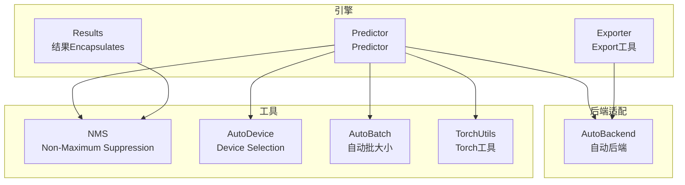
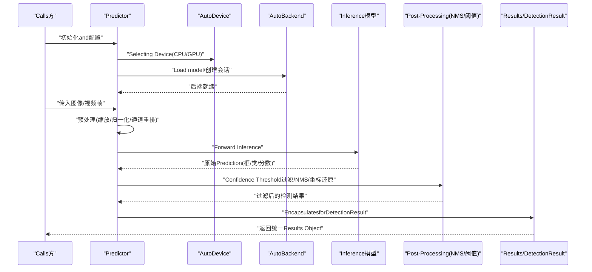
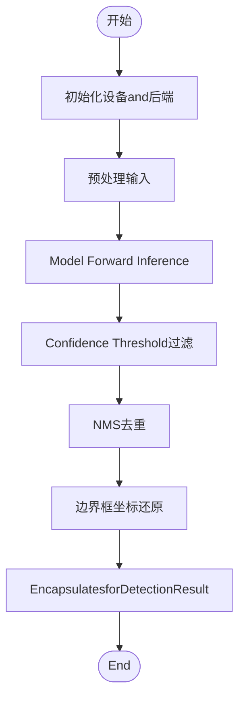
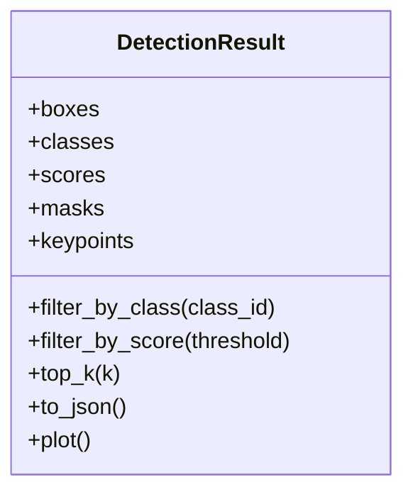
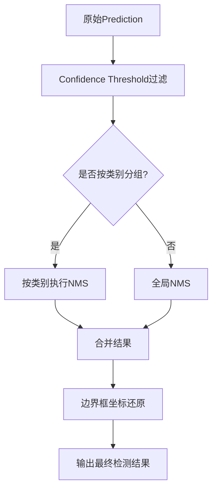
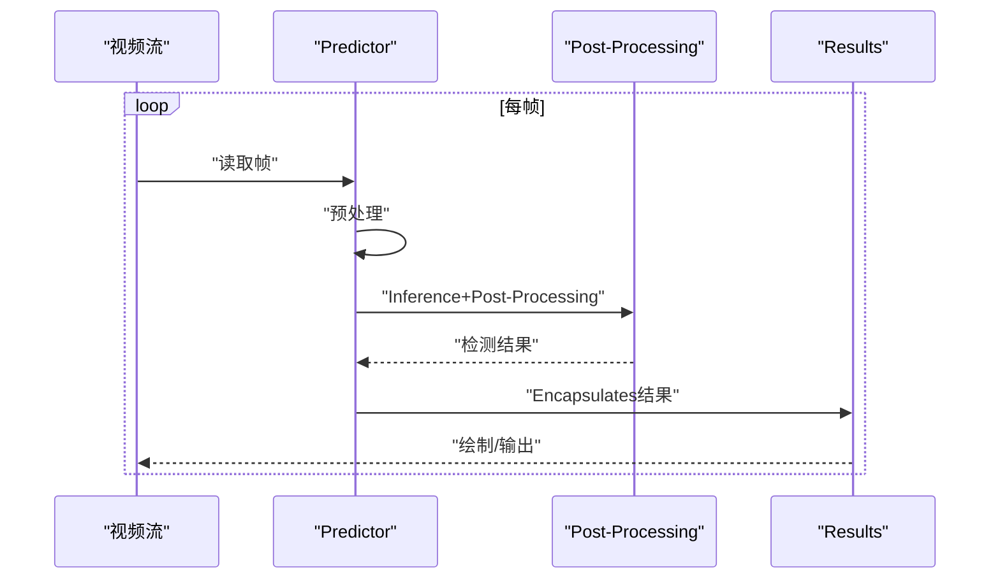
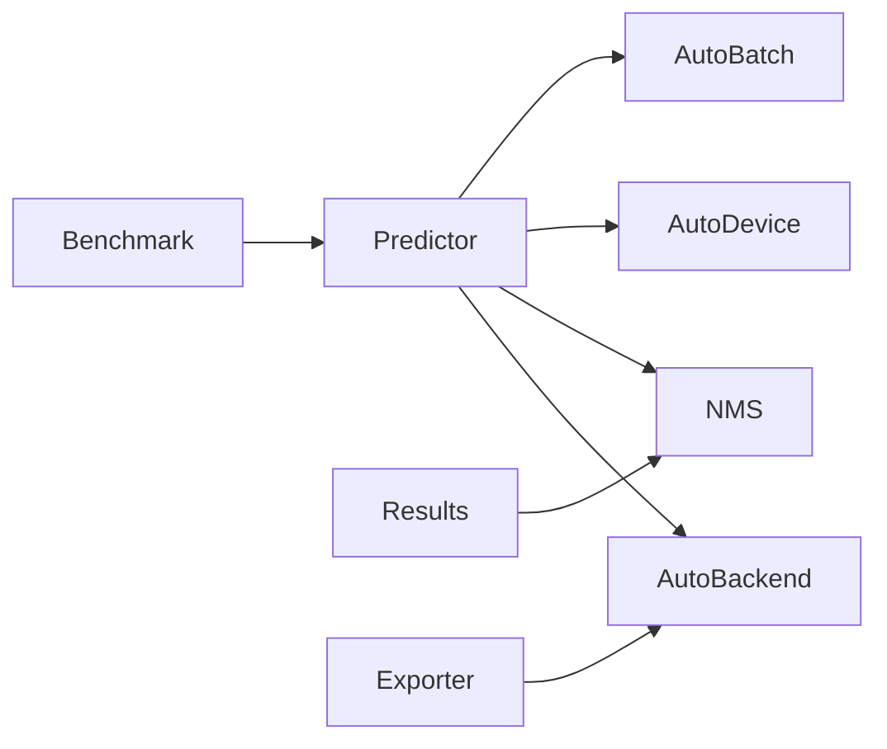

# Inference System

<cite>
**Files Referenced in This Document**
- [predictor.py](file://ultralytics/engine/predictor.py)
- [results.py](file://ultralytics/engine/results.py)
- [nms.py](file://ultralytics/utils/nms.py)
- [autobackend.py](file://ultralytics/nn/autobackend.py)
- [torch_utils.py](file://ultralytics/utils/torch_utils.py)
- [autodevice.py](file://ultralytics/utils/autodevice.py)
- [autobatch.py](file://ultralytics/utils/autobatch.py)
- [exporter.py](file://ultralytics/engine/exporter.py)
- [benchmark_molora_dispatch.py](file://benchmarks/benchmark_molora_dispatch.py)
- [test_autobackend_warmup.py](file://tests/test_autobackend_warmup.py)
</cite>

## Table of Contents
1. [Introduction](#Introduction)
2. [Project Structure](#Project Structure)
3. [Core Components](#Core Components)
4. [Architecture Overview](#Architecture Overview)
5. [Detailed Component Analysis](#Detailed Component Analysis)
6. [Dependency Analysis](#Dependency Analysis)
7. [性能考量](#性能考量)
8. [Troubleshooting Guide](#Troubleshooting Guide)
9. [Conclusion](#Conclusion)
10. [Appendix](#Appendix)

## Introduction
本技术Documentation聚焦于YOLO-Master的Inference子系统，围绕Predictor的工作流、Result Processing机制、不同Inference模式（单图、批量、实时视频）、Post-Processing Algorithms（NMS、Confidence Threshold过滤、边界框解码）、内存and资源Optimization（GPU内存池、对象复用）、统一结果数据结构(DetectionResult)、并发控制（多线程/多进程）、性能Optimization实践（批大小、精度、硬件适配）、错误处理and异常恢复、Centered onandInference缓存and模型预热策略进行系统化说明。Documentation旨while帮助读者快速理解并高效UsesInference引擎，同时for二次开发and部署provides可操作的指导。

## Project Structure
Inference相关代码主要分布whileCentered on下Modules：
- Engine Layer：Predictor、结果Encapsulates、Export工具
- 后端适配：自动选择and初始化Inference后端（such asONNX Runtime、TensorRTetc.）
- 工具层：NMS、Device Selection、自动批大小、Torch工具函数
- 基准and测试：性能基准脚本and预热/兼容性测试

Figure Source
- [predictor.py:1-200](file://ultralytics/engine/predictor.py#L1-L200)
- [results.py:1-200](file://ultralytics/engine/results.py#L1-L200)
- [nms.py:1-200](file://ultralytics/utils/nms.py#L1-L200)
- [autobackend.py:1-200](file://ultralytics/nn/autobackend.py#L1-L200)
- [autodevice.py:1-200](file://ultralytics/utils/autodevice.py#L1-L200)
- [autobatch.py:1-200](file://ultralytics/utils/autobatch.py#L1-L200)
- [torch_utils.py:1-200](file://ultralytics/utils/torch_utils.py#L1-L200)
- [exporter.py:1-200](file://ultralytics/engine/exporter.py#L1-L200)

Section Source
- [predictor.py:1-200](file://ultralytics/engine/predictor.py#L1-L200)
- [results.py:1-200](file://ultralytics/engine/results.py#L1-L200)
- [nms.py:1-200](file://ultralytics/utils/nms.py#L1-L200)
- [autobackend.py:1-200](file://ultralytics/nn/autobackend.py#L1-L200)
- [autodevice.py:1-200](file://ultralytics/utils/autodevice.py#L1-L200)
- [autobatch.py:1-200](file://ultralytics/utils/autobatch.py#L1-L200)
- [torch_utils.py:1-200](file://ultralytics/utils/torch_utils.py#L1-L200)
- [exporter.py:1-200](file://ultralytics/engine/exporter.py#L1-L200)

## Core Components
- Predictor
  - 负责Load model、预处理输入、Executing Inference、Post-Processingand结果Encapsulates。
  - Supporting多种输入源（图像、视频流），并provides单图andBatch Inference接口。
  - 内部协调Device Selection、后端初始化、批大小策略andNMSetc.Post-Processing。
- 结果Encapsulates(Results/DetectionResult)
  - 统一Encapsulates检测输出，包括边界框、类别、置信度、掩码/关键点etc.。
  - providesVisualization、序列化、索引访问and过滤方法。
- 自动后端(AutoBackend)
  - 根据Model Formatand运行环境自动选择最优Inference后端。
  - 管理模型加载、会话/上下文创建、内存分配and预热。
- NMSandNon-Maximum Suppression
  - implementing高效的NMS算法，SupportingIoU阈值、类别维度过滤and批量处理。
- 设备and批大小自适应
  - AutoDevice用于设备探测and选择；AutoBatch用于动态批大小估算。
- Torch工具andExport
  - provides张量操作、精度转换、内存管理etc.通用工具；Exporter用于ExportandValidation。

Section Source
- [predictor.py:1-200](file://ultralytics/engine/predictor.py#L1-L200)
- [results.py:1-200](file://ultralytics/engine/results.py#L1-L200)
- [nms.py:1-200](file://ultralytics/utils/nms.py#L1-L200)
- [autobackend.py:1-200](file://ultralytics/nn/autobackend.py#L1-L200)
- [autodevice.py:1-200](file://ultralytics/utils/autodevice.py#L1-L200)
- [autobatch.py:1-200](file://ultralytics/utils/autobatch.py#L1-L200)
- [torch_utils.py:1-200](file://ultralytics/utils/torch_utils.py#L1-L200)
- [exporter.py:1-200](file://ultralytics/engine/exporter.py#L1-L200)

## Architecture Overview
下图展示了从输入to输出的完整Inference流程，涵盖预处理、模型Inference、Post-Processingand结果Encapsulates的关键环节。

Figure Source
- [predictor.py:1-200](file://ultralytics/engine/predictor.py#L1-L200)
- [autobackend.py:1-200](file://ultralytics/nn/autobackend.py#L1-L200)
- [nms.py:1-200](file://ultralytics/utils/nms.py#L1-L200)
- [results.py:1-200](file://ultralytics/engine/results.py#L1-L200)

## Detailed Component Analysis

### Predictor工作流
- 初始化阶段
  - 解析配置参数（设备、精度、批大小、NMS阈值etc.）。
  - ViaAutoDevice选择目标设备，并ViaAutoBackendLoad modeland创建Inference会话。
  - Optional预热步骤，确保后端稳定and内存布局就绪。
- 单次Inference流程
  - 输入预处理：尺寸调整、归一化、数据类型转换、批次填充。
  - 模型前向：将预处理后的张量送入后端Executing Inference。
  - Post-Processing：Confidence Threshold过滤、NMS去重、边界框坐标还原至原图尺度。
  - 结果Encapsulates：生成DetectionResult对象，包含元数据andVisualization辅助方法。
- 批量and视频流
  - Batch Inference：对多张图像进行并行预处理andInference，合并后统一Post-Processing。
  - 视频流：逐帧读取、增量预处理、连续Inferenceand结果绘制，Supporting丢帧and缓冲策略。

Figure Source
- [predictor.py:1-200](file://ultralytics/engine/predictor.py#L1-L200)
- [nms.py:1-200](file://ultralytics/utils/nms.py#L1-L200)
- [results.py:1-200](file://ultralytics/engine/results.py#L1-L200)

Section Source
- [predictor.py:1-200](file://ultralytics/engine/predictor.py#L1-L200)

### Result Processing机制andDetectionResult
- 统一数据结构
  - DetectionResultEncapsulates了边界框、类别ID、置信度、掩码/关键点etc.字段，并provides索引、切片and过滤方法。
- 操作方法
  - 按类别或置信度筛选、获取Top-K结果、转换forJSON/CSV、叠加绘制to图像。
- andPost-Processing的协作
  - Post-Processing阶段直接写入DetectionResult的对应字段，保证结果一致性。

Figure Source
- [results.py:1-200](file://ultralytics/engine/results.py#L1-L200)

Section Source
- [results.py:1-200](file://ultralytics/engine/results.py#L1-L200)

### Post-Processing Algorithms：NMS、Confidence Threshold过滤and边界框解码
- Confidence Threshold过滤
  - whileNMS之前剔除低置信度Prediction，减少计算量and误检。
- NMS（Non-Maximum Suppression）
  - 基于IoU阈值去除重叠框，Supporting按类别独立执行and批量处理。
- 边界框解码
  - 将模型输出的相对坐标还原for原图绝对坐标，考虑缩放and裁剪信息。

Figure Source
- [nms.py:1-200](file://ultralytics/utils/nms.py#L1-L200)

Section Source
- [nms.py:1-200](file://ultralytics/utils/nms.py#L1-L200)

### Inference模式：单图像、批量and实时视频流
- 单图像Inference
  - 适用于离线分析and调试，延迟优先，批大小for1。
- Batch Inference
  - 提高吞吐，适合离线批处理and评测；需平衡显存占用and延迟。
- 实时视频流
  - 逐帧处理，Combining缓冲and丢帧策略维持稳定帧率；可andTrackingModules联动。

Figure Source
- [predictor.py:1-200](file://ultralytics/engine/predictor.py#L1-L200)
- [results.py:1-200](file://ultralytics/engine/results.py#L1-L200)

Section Source
- [predictor.py:1-200](file://ultralytics/engine/predictor.py#L1-L200)

### 内存管理and资源Optimization
- GPU内存池and对象复用
  - Via后端会话and张量缓冲区复用减少频繁分配and释放开销。
- 自动批大小and精度选择
  - AutoBatch根据设备capabilities估算合适批大小；SupportingFP16/INT8Centered on降低显存and提升吞吐。
- 预热and缓存
  - 首次Inference前进行预热，建立内核缓存and内存布局；对常用输入尺寸进行缓存加速。

Section Source
- [autobackend.py:1-200](file://ultralytics/nn/autobackend.py#L1-L200)
- [autobatch.py:1-200](file://ultralytics/utils/autobatch.py#L1-L200)
- [torch_utils.py:1-200](file://ultralytics/utils/torch_utils.py#L1-L200)
- [test_autobackend_warmup.py:1-200](file://tests/test_autobackend_warmup.py#L1-L200)

### 多线程and多进程Inference
- 线程安全
  - Predictor实例通常不跨线程共享；每个线程持有独立实例Centered on避免状态竞争。
- 进程级并行
  - 多进程分别Load modeland后端，避免GIL限制；注意进程间通信and资源隔离。
- 并发控制
  - Uses队列and信号量控制并发度，防止显存溢出andCPU过载。

Section Source
- [predictor.py:1-200](file://ultralytics/engine/predictor.py#L1-L200)
- [autobackend.py:1-200](file://ultralytics/nn/autobackend.py#L1-L200)

### 错误处理and异常恢复
- 设备and后端异常
  - 捕获设备不可用、模型加载失败、会话创建失败etc.异常，回退至CPU或TipsUser检查环境。
- 输入andPost-Processing异常
  - 校验输入尺寸and类型，处理空结果andNMS退化情况，保证鲁棒性。
- 重试and降级
  - 针对临时性错误（such as显存不足）实施重试或降低批大小/精度的降级策略。

Section Source
- [autobackend.py:1-200](file://ultralytics/nn/autobackend.py#L1-L200)
- [nms.py:1-200](file://ultralytics/utils/nms.py#L1-L200)

### Inference缓存and模型预热策略
- 模型预热
  - 启动时Centered on典型输入尺寸执行若干次Inference，预热内核and内存布局，降低首帧延迟。
- 输入缓存
  - 对重复输入尺寸and预处理参数进行缓存，避免重复计算。
- 后端缓存
  - 利用后端provides的会话and算子缓存，提升后续Inference速度。

Section Source
- [test_autobackend_warmup.py:1-200](file://tests/test_autobackend_warmup.py#L1-L200)
- [autobackend.py:1-200](file://ultralytics/nn/autobackend.py#L1-L200)

## Dependency Analysis
- 组件耦合
  - Predictor强依赖AutoBackendandNMS；Results弱依赖NMS（仅用于结果字段）。
  - AutoDeviceandAutoBatchforPredictorprovides运行时自适应capabilities。
- 外部集成点
  - Export工具ExporterandBenchmark脚本用于Model Exportand性能Evaluation。

Figure Source
- [predictor.py:1-200](file://ultralytics/engine/predictor.py#L1-L200)
- [autobackend.py:1-200](file://ultralytics/nn/autobackend.py#L1-L200)
- [nms.py:1-200](file://ultralytics/utils/nms.py#L1-L200)
- [autodevice.py:1-200](file://ultralytics/utils/autodevice.py#L1-L200)
- [autobatch.py:1-200](file://ultralytics/utils/autobatch.py#L1-L200)
- [exporter.py:1-200](file://ultralytics/engine/exporter.py#L1-L200)
- [benchmark_molora_dispatch.py:1-200](file://benchmarks/benchmark_molora_dispatch.py#L1-L200)

Section Source
- [predictor.py:1-200](file://ultralytics/engine/predictor.py#L1-L200)
- [autobackend.py:1-200](file://ultralytics/nn/autobackend.py#L1-L200)
- [nms.py:1-200](file://ultralytics/utils/nms.py#L1-L200)
- [autodevice.py:1-200](file://ultralytics/utils/autodevice.py#L1-L200)
- [autobatch.py:1-200](file://ultralytics/utils/autobatch.py#L1-L200)
- [exporter.py:1-200](file://ultralytics/engine/exporter.py#L1-L200)
- [benchmark_molora_dispatch.py:1-200](file://benchmarks/benchmark_molora_dispatch.py#L1-L200)

## 性能考量
- 批大小调整
  - 依据显存容量and延迟目标动态调整批大小，避免OOMand抖动。
- 精度选择
  - FP16/INT8可降低显存and提升吞吐，但需Evaluation精度损失and校准质量。
- 硬件适配
  - 针对不同后端（ONNX/TensorRT/OpenVINO）启用相应Optimization选项，such as静态形状、算子融合。
- 预热and缓存
  - 预热减少首帧延迟；输入and后端缓存提升整体吞吐。
- 监控and调优
  - Uses基准脚本收集延迟and吞吐Metrics，定位bottlenecks并进行针对性Optimization。

[本节for通用指导，无需特定文件引用]

## Troubleshooting Guide
- 设备and后端问题
  - 检查设备可用性、drivers are installed版本and后端库安装；必要时回退至CPU。
- 模型加载失败
  - 确认模型路径and格式正确；查看ExportLoggingand兼容性矩阵。
- 显存不足
  - 降低批大小或精度；启用内存池and对象复用；关闭不必要的LoggingandVisualization。
- NMS退化或空结果
  - 调整Confidence ThresholdandIoU阈值；检查预处理and坐标还原逻辑。
- 预热未生效
  - 确认预热输入尺寸and实际一致；检查后端缓存是否启用。

Section Source
- [autobackend.py:1-200](file://ultralytics/nn/autobackend.py#L1-L200)
- [nms.py:1-200](file://ultralytics/utils/nms.py#L1-L200)
- [test_autobackend_warmup.py:1-200](file://tests/test_autobackend_warmup.py#L1-L200)

## Conclusion
YOLO-Master的Inference SystemCentered onPredictorfor核心，CombiningAutoBackend、NMSandResults形成完整的End-to-end pipeline。Via设备and批大小自适应、内存池and对象复用、预热and缓存策略，系统while吞吐and延迟之间取得良好平衡。合理的错误处理and降级策略提升了鲁棒性。建议while生产环境中Combining基准脚本持续监控and调优，并根据硬件特性选择合适的后端and精度。

[本节for总结性内容，无需特定文件引用]

## Appendix
- 最佳实践清单
  - 预热模型and缓存输入尺寸
  - Set appropriately批大小and精度
  - UsesNMSand阈值过滤减少误检
  - 监控显存and延迟，and时降级
  - 定期更新后端anddrivers are installedCentered on获得最新Optimization

[本节for补充信息，无需特定文件引用]