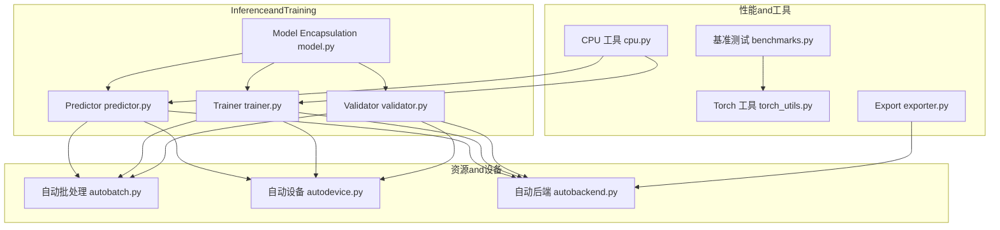
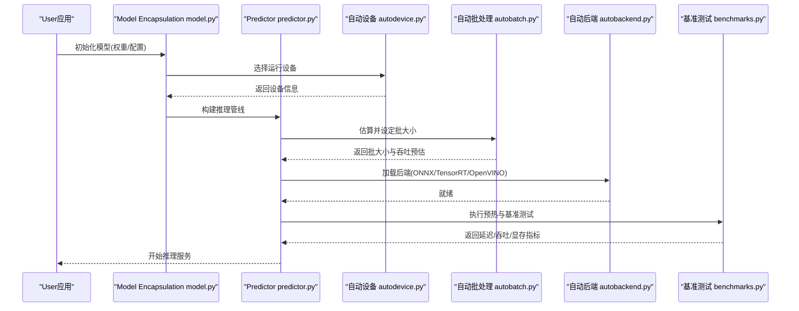
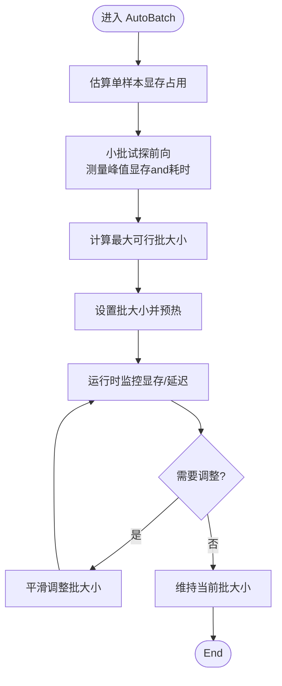
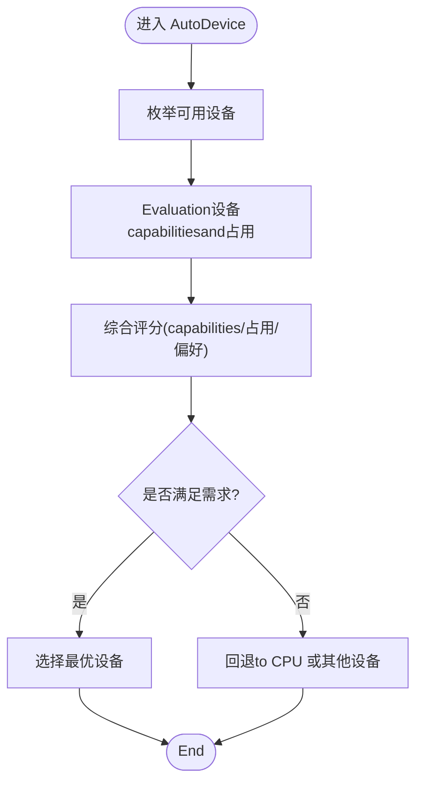
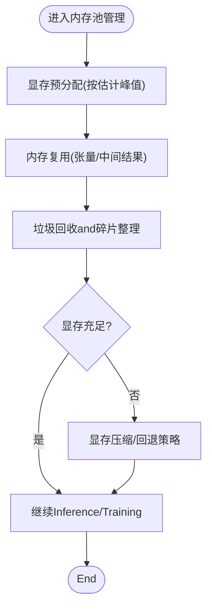
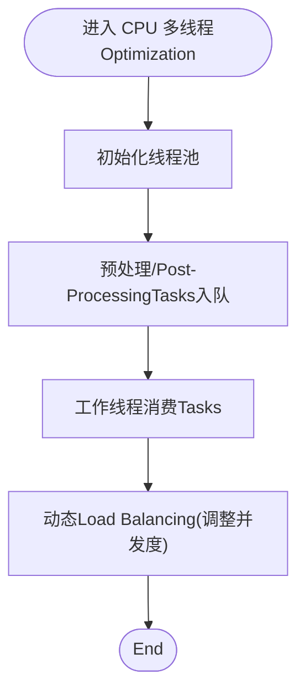
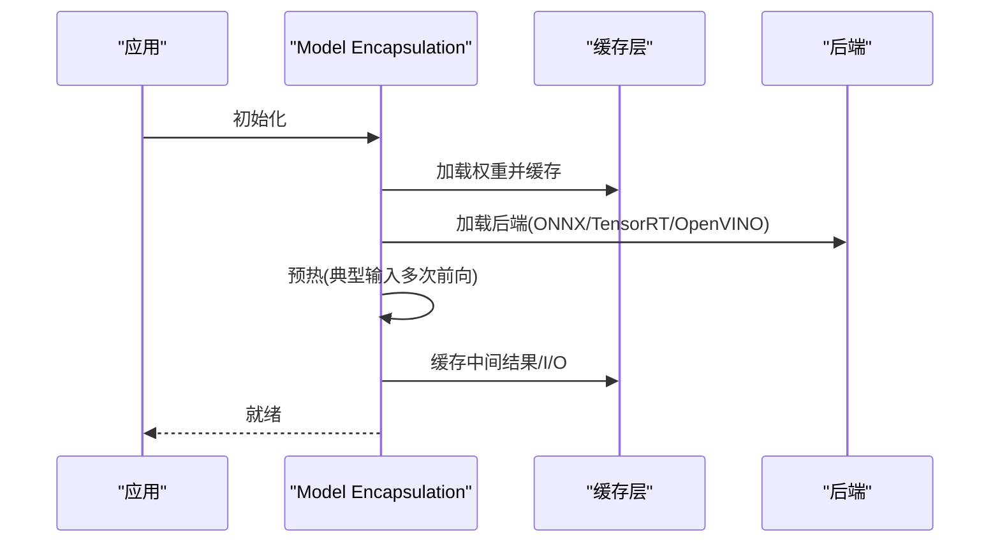
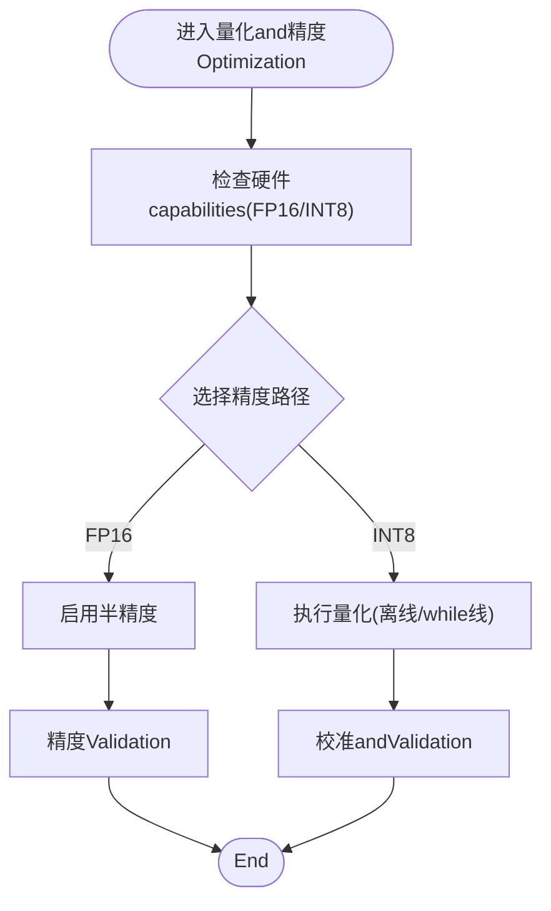
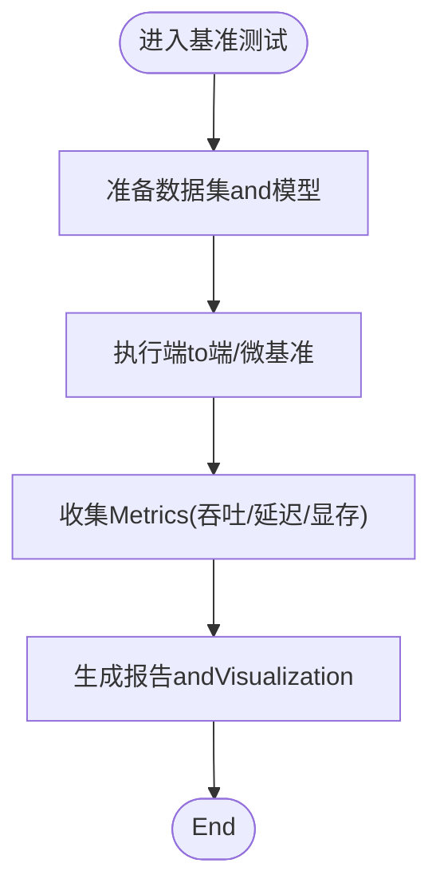
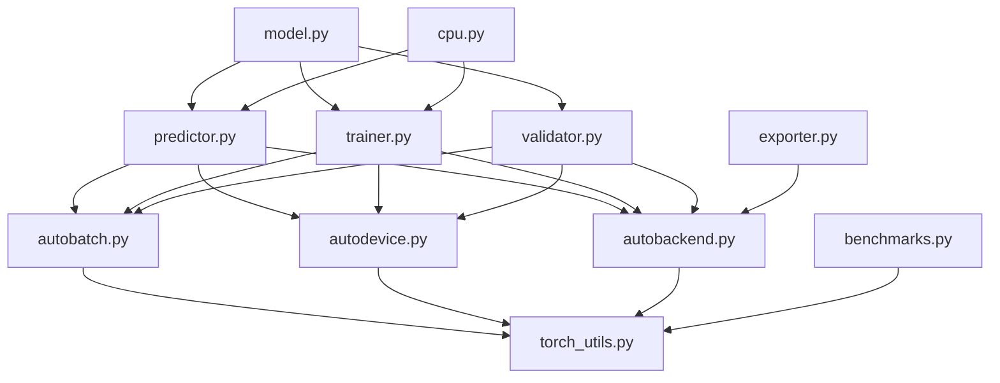

# Performance Optimization and Resource Management

<cite>
**Files Referenced in This Document**
- [autobatch.py](file://ultralytics/utils/autobatch.py)
- [autodevice.py](file://ultralytics/utils/autodevice.py)
- [benchmarks.py](file://ultralytics/utils/benchmarks.py)
- [torch_utils.py](file://ultralytics/utils/torch_utils.py)
- [exporter.py](file://ultralytics/engine/exporter.py)
- [predictor.py](file://ultralytics/engine/predictor.py)
- [trainer.py](file://ultralytics/engine/trainer.py)
- [validator.py](file://ultralytics/engine/validator.py)
- [model.py](file://ultralytics/engine/model.py)
- [autobackend.py](file://ultralytics/nn/autobackend.py)
- [cpu.py](file://ultralytics/utils/cpu.py)
- [test_autobackend_warmup.py](file://tests/test_autobackend_warmup.py)
</cite>

## Table of Contents
1. [Introduction](#Introduction)
2. [Project Structure](#Project Structure)
3. [Core Components](#Core Components)
4. [Architecture Overview](#Architecture Overview)
5. [Detailed Component Analysis](#Detailed Component Analysis)
6. [Dependency Analysis](#Dependency Analysis)
7. [性能考量](#性能考量)
8. [Troubleshooting Guide](#Troubleshooting Guide)
9. [Conclusion](#Conclusion)
10. [Appendix](#Appendix)

## Introduction
本技术Documentation聚焦于 YOLO-Master 的Performance Optimization and Resource Management系统，围绕Centered on下关键主题unfold：
- 自动批处理（AutoBatch）的动态调整机制：内存监控、批大小Optimizationand吞吐量最大化策略。
- Automatic Device Selection（AutoDevice）的智能决策逻辑：硬件capabilitiesEvaluation、显存占用分析and最优Device Selection。
- GPU 内存池管理机制：显存预分配、内存复用and碎片整理。
- CPU 多线程Optimization策略：线程池管理、Task DispatchandLoad Balancing。
- 模型预热and缓存机制：权重缓存、中间结果缓存and I/O 缓存。
- 量化and精度Optimization选项：FP16、INT8 量化的选择and配置。
- 性能基准测试工具的Uses方法andMetrics解读。
- 内存泄漏检测and性能bottlenecks诊断工具。

## Project Structure
and性能Optimization和资源管理相关的核心代码主要分布whileCentered on下Modules：
- 自动批处理andDevice Selection：ultralytics/utils/autobatch.py、ultralytics/utils/autodevice.py
- InferenceandTraining引擎：ultralytics/engine/predictor.py、ultralytics/engine/trainer.py、ultralytics/engine/validator.py、ultralytics/engine/model.py
- 后端适配andExport：ultralytics/nn/autobackend.py、ultralytics/engine/exporter.py
- 性能基准and工具：ultralytics/utils/benchmarks.py、ultralytics/utils/torch_utils.py、ultralytics/utils/cpu.py
- 相关测试用例：tests/test_autobackend_warmup.py

Figure Source
- [predictor.py](file://ultralytics/engine/predictor.py)
- [trainer.py](file://ultralytics/engine/trainer.py)
- [validator.py](file://ultralytics/engine/validator.py)
- [model.py](file://ultralytics/engine/model.py)
- [autobatch.py](file://ultralytics/utils/autobatch.py)
- [autodevice.py](file://ultralytics/utils/autodevice.py)
- [autobackend.py](file://ultralytics/nn/autobackend.py)
- [benchmarks.py](file://ultralytics/utils/benchmarks.py)
- [torch_utils.py](file://ultralytics/utils/torch_utils.py)
- [cpu.py](file://ultralytics/utils/cpu.py)
- [exporter.py](file://ultralytics/engine/exporter.py)

Section Source
- [autobatch.py](file://ultralytics/utils/autobatch.py)
- [autodevice.py](file://ultralytics/utils/autodevice.py)
- [benchmarks.py](file://ultralytics/utils/benchmarks.py)
- [torch_utils.py](file://ultralytics/utils/torch_utils.py)
- [exporter.py](file://ultralytics/engine/exporter.py)
- [predictor.py](file://ultralytics/engine/predictor.py)
- [trainer.py](file://ultralytics/engine/trainer.py)
- [validator.py](file://ultralytics/engine/validator.py)
- [model.py](file://ultralytics/engine/model.py)
- [autobackend.py](file://ultralytics/nn/autobackend.py)
- [cpu.py](file://ultralytics/utils/cpu.py)
- [test_autobackend_warmup.py](file://tests/test_autobackend_warmup.py)

## Core Components
本节对 AutoBatch、AutoDevice、GPU 内存池、CPU 多线程、模型预热and缓存、量化and精度Optimization、基准测试and诊断etc.Core Components进行系统性说明。

- 自动批处理（AutoBatch）
  - 目标：while给定硬件约束下动态调整批大小，Centered on最大化吞吐并避免 OOM。
  - 机制要点：
    - 基于模型规模and输入尺寸估算每样本显存占用。
    - Via试探性前向或轻量级探测获取实际显存峰值。
    - 根据可用显存上限and目标安全余量计算最大可行批大小。
    - Supporting运行时自适应：当检测to显存压力时逐步降批，空闲时逐步升批。
  - 输出：for当前会话provides稳定的 batch_size and预估吞吐。

- Automatic Device Selection（AutoDevice）
  - 目标：while多设备环境下智能选择最佳运行设备（CPU/CUDA/ROCm/MPS etc.）。
  - 机制要点：
    - 枚举可用设备并查询capabilities（such as CUDA 版本、drivers are installed、显存容量、MPS 可用性）。
    - Evaluation各设备的内存占用and历史稳定性，CombiningUser偏好and约束条件打分。
    - 选择得分最高的设备作for默认运行设备；若显存不足则回退to CPU。
  - 输出：确定的 device 对象andOptional的并行策略Tips。

- GPU 内存池管理
  - 目标：减少频繁分配/释放带来的开销and碎片化。
  - 机制要点：
    - 显存预分配：while首次Uses前按估计峰值预留一定比例显存。
    - 内存复用：重用张量缓冲区and中间结果，降低分配次数。
    - 碎片整理：周期性清理未引用张量，必要时触发显存压缩或重启后端。
  - 注意：不同后端（CUDA/TensorRT/OpenVINO）implementing细节存while差异。

- CPU 多线程Optimization
  - 目标：提升数据预处理andPost-Processing的并行度，平衡主线程负载。
  - 机制要点：
    - Uses线程池管理预处理/Post-ProcessingTasks，避免频繁创建销毁线程。
    - Task Dispatch采用队列+工作线程模式，控制并发度Centered on避免上下文切换开销。
    - Load Balancing依据Tasks耗时统计动态调整 worker 数量。

- 模型预热and缓存
  - 目标：消除冷启动抖动，稳定首帧延迟and吞吐。
  - 机制要点：
    - 权重缓存：加载后的权重常驻内存，避免重复 IO。
    - 中间结果缓存：对固定形状输入可缓存部分中间激活（需权衡显存）。
    - I/O 缓存：图像解码、缩放、归一化结果缓存，减少重复计算。
    - 预热流程：Centered on典型输入执行若干次前向，使 JIT/编译器/后端完成Optimization。

- 量化and精度Optimization
  - FP16：whileSupporting的设备上启用半精度Centered on降低带宽and显存占用，提高吞吐。
  - INT8：Via离线或while线量化进一步压缩模型and加速Inference，需校准集保证精度。
  - 选择策略：根据硬件capabilities、精度要求and部署目标决定精度路径。

- 基准测试and诊断
  - 基准：端to端吞吐、延迟分布、显存峰值、CPU/GPU 利用率。
  - 诊断：火焰图、事件追踪、显存快照、Gradient/激活统计。

Section Source
- [autobatch.py](file://ultralytics/utils/autobatch.py)
- [autodevice.py](file://ultralytics/utils/autodevice.py)
- [autobackend.py](file://ultralytics/nn/autobackend.py)
- [benchmarks.py](file://ultralytics/utils/benchmarks.py)
- [torch_utils.py](file://ultralytics/utils/torch_utils.py)
- [cpu.py](file://ultralytics/utils/cpu.py)
- [predictor.py](file://ultralytics/engine/predictor.py)
- [trainer.py](file://ultralytics/engine/trainer.py)
- [validator.py](file://ultralytics/engine/validator.py)
- [model.py](file://ultralytics/engine/model.py)
- [exporter.py](file://ultralytics/engine/exporter.py)
- [test_autobackend_warmup.py](file://tests/test_autobackend_warmup.py)

## Architecture Overview
下图展示了从高层入口to具体Optimization组件的Calls关系and数据流。

Figure Source
- [model.py](file://ultralytics/engine/model.py)
- [predictor.py](file://ultralytics/engine/predictor.py)
- [autodevice.py](file://ultralytics/utils/autodevice.py)
- [autobatch.py](file://ultralytics/utils/autobatch.py)
- [autobackend.py](file://ultralytics/nn/autobackend.py)
- [benchmarks.py](file://ultralytics/utils/benchmarks.py)

## Detailed Component Analysis

### 自动批处理（AutoBatch）动态调整机制
- 设计目标
  - while有限显存下最大化吞吐，同时保持低延迟and稳定性。
- 关键流程
  - 初始估算：基于模型参数量、输入分辨率and通道数估算单样本显存。
  - 试探探测：Centered on小批样本执行前向，测量峰值显存and实际耗时。
  - 批大小计算：根据可用显存and安全余量推导最大可行批大小。
  - 动态调整：运行时监控显存and延迟，向上/向下平滑调整批大小。
- 复杂度and性能
  - 估算阶段近似 O(1)，探测阶段and批大小线性相关。
  - 动态调整引入少量调度开销，但能显著提升整体吞吐。
- 错误处理
  - OOM 保护：超过阈值立即降批并记录告警。
  - 回退策略：若无法达to目标吞吐，回退至较小批或 CPU。

Figure Source
- [autobatch.py](file://ultralytics/utils/autobatch.py)

Section Source
- [autobatch.py](file://ultralytics/utils/autobatch.py)

### Automatic Device Selection（AutoDevice）智能决策逻辑
- 设计目标
  - while多设备环境中选择最合适的运行设备，兼顾性能and稳定性。
- 关键流程
  - 设备枚举：扫描 CPU、CUDA、ROCm、MPS devices。
  - capabilitiesEvaluation：检查drivers are installed版本、算力级别、显存容量、后端Supporting。
  - 占用分析：读取当前显存占用and进程竞争情况。
  - 评分and选择：CombiningUser偏好（such as强制 GPU）、硬件capabilitiesand占用情况打分，选择最优设备。
  - 回退策略：若显存不足或后端不可用，回退to CPU。
- 复杂度and性能
  - 设备枚举andcapabilities查询for O(N)（N for设备数），总体开销极低。
- 错误处理
  - 设备不可用时给出明确错误信息and回退建议。

Figure Source
- [autodevice.py](file://ultralytics/utils/autodevice.py)

Section Source
- [autodevice.py](file://ultralytics/utils/autodevice.py)

### GPU 内存池管理机制
- 设计目标
  - 降低分配/释放开销，减少碎片，提升吞吐and稳定性。
- 关键流程
  - 预分配：while首次Uses前按估计峰值预留显存。
  - 复用：重用张量缓冲区and中间结果，避免频繁分配。
  - 碎片整理：定期清理未引用张量，必要时触发后端压缩或重启。
- 复杂度and性能
  - 预分配and复用while大多数场景下显著降低分配次数。
  - 碎片整理可能带来短暂停顿，应谨慎调度。
- 错误处理
  - 显存不足时尝试回收and降级，失败则抛出清晰错误。

Figure Source
- [autobackend.py](file://ultralytics/nn/autobackend.py)
- [torch_utils.py](file://ultralytics/utils/torch_utils.py)

Section Source
- [autobackend.py](file://ultralytics/nn/autobackend.py)
- [torch_utils.py](file://ultralytics/utils/torch_utils.py)

### CPU 多线程Optimization策略
- 设计目标
  - 提升数据预处理andPost-Processing的并行度，避免阻塞主线程。
- 关键流程
  - 线程池：维护固定数量的工作线程，避免频繁创建销毁。
  - Task Dispatch：将预处理/Post-ProcessingTasks放入队列，由工作线程消费。
  - Load Balancing：根据Tasks耗时统计动态调整并发度。
- 复杂度and性能
  - 线程池开销恒定，Task Dispatchfor O(1)。
  - 合理并发度可显著提升吞吐，过高会导致上下文切换开销。
- 错误处理
  - Tasks异常捕获and重试，避免影响整体流水线。

Figure Source
- [cpu.py](file://ultralytics/utils/cpu.py)

Section Source
- [cpu.py](file://ultralytics/utils/cpu.py)

### 模型预热and缓存机制
- 设计目标
  - 消除冷启动抖动，稳定首帧延迟and吞吐。
- 关键流程
  - 权重缓存：加载后的权重常驻内存，避免重复 IO。
  - 中间结果缓存：对固定形状输入缓存部分中间激活（需权衡显存）。
  - I/O 缓存：图像解码、缩放、归一化结果缓存。
  - 预热流程：Centered on典型输入执行若干次前向，使 JIT/编译器/后端完成Optimization。
- 复杂度and性能
  - 预热阶段有额外开销，但长期收益显著。
  - 缓存命中率高时可大幅降低延迟。
- 错误处理
  - 缓存失效或冲突时重建缓存，确保一致性。

Figure Source
- [predictor.py](file://ultralytics/engine/predictor.py)
- [autobackend.py](file://ultralytics/nn/autobackend.py)
- [test_autobackend_warmup.py](file://tests/test_autobackend_warmup.py)

Section Source
- [predictor.py](file://ultralytics/engine/predictor.py)
- [autobackend.py](file://ultralytics/nn/autobackend.py)
- [test_autobackend_warmup.py](file://tests/test_autobackend_warmup.py)

### 量化and精度Optimization选项
- 设计目标
  - while精度and性能之间取得平衡，满足不同部署场景。
- 关键流程
  - FP16：whileSupporting设备上启用半精度，降低带宽and显存占用。
  - INT8：离线或while线量化，需校准集保证精度。
  - 选择策略：根据硬件capabilities、精度要求and部署目标决定精度路径。
- 复杂度and性能
  - FP16 通常带来吞吐提升and显存下降。
  - INT8 进一步压缩模型and加速Inference，但需校准andValidation。
- 错误处理
  - 精度不达标is available, fall back to更高精度或禁用量化。

Figure Source
- [exporter.py](file://ultralytics/engine/exporter.py)
- [autobackend.py](file://ultralytics/nn/autobackend.py)

Section Source
- [exporter.py](file://ultralytics/engine/exporter.py)
- [autobackend.py](file://ultralytics/nn/autobackend.py)

### 性能基准测试工具Uses方法andMetrics解读
- Uses方法
  - 端to端基准：覆盖Data Loading、预处理、Inference、Post-Processing全流程。
  - 微基准：针对特定算子或Modules进行延迟and吞吐测量。
  - 多设备对比：while不同设备and后端间比较性能。
- Metrics解读
  - 吞吐（FPS）：单位时间内处理的样本数。
  - 延迟（ms）：单次Inference的平均/分位延迟。
  - 显存峰值：Inference过程中的最大显存占用。
  - CPU/GPU 利用率：反映资源利用效率。
- 输出andVisualization
  - 结构化报告：JSON/CSV 格式便于自动化分析。
  - 趋势图：随时间变化的吞吐and延迟曲线。

Figure Source
- [benchmarks.py](file://ultralytics/utils/benchmarks.py)

Section Source
- [benchmarks.py](file://ultralytics/utils/benchmarks.py)

## Dependency Analysis
下图展示了Core Components之间的依赖关系and耦合程度。

Figure Source
- [autobatch.py](file://ultralytics/utils/autobatch.py)
- [autodevice.py](file://ultralytics/utils/autodevice.py)
- [autobackend.py](file://ultralytics/nn/autobackend.py)
- [torch_utils.py](file://ultralytics/utils/torch_utils.py)
- [predictor.py](file://ultralytics/engine/predictor.py)
- [trainer.py](file://ultralytics/engine/trainer.py)
- [validator.py](file://ultralytics/engine/validator.py)
- [model.py](file://ultralytics/engine/model.py)
- [benchmarks.py](file://ultralytics/utils/benchmarks.py)
- [exporter.py](file://ultralytics/engine/exporter.py)
- [cpu.py](file://ultralytics/utils/cpu.py)

Section Source
- [autobatch.py](file://ultralytics/utils/autobatch.py)
- [autodevice.py](file://ultralytics/utils/autodevice.py)
- [autobackend.py](file://ultralytics/nn/autobackend.py)
- [torch_utils.py](file://ultralytics/utils/torch_utils.py)
- [predictor.py](file://ultralytics/engine/predictor.py)
- [trainer.py](file://ultralytics/engine/trainer.py)
- [validator.py](file://ultralytics/engine/validator.py)
- [model.py](file://ultralytics/engine/model.py)
- [benchmarks.py](file://ultralytics/utils/benchmarks.py)
- [exporter.py](file://ultralytics/engine/exporter.py)
- [cpu.py](file://ultralytics/utils/cpu.py)

## 性能考量
- 批大小and延迟的权衡：较大批提升吞吐但增加延迟，需根据业务 SLA 平衡。
- Device Selectionand回退：优先 GPU，显存不足时回退 CPU，避免 OOM。
- 内存池and碎片：合理预分配and定期整理，避免长时间运行导致的碎片累积。
- 多线程and上下文切换：适度并发，避免过多线程导致切换开销。
- 预热and缓存：预热阶段有额外开销，但长期收益显著；缓存需权衡显存占用。
- 量化and精度：FP16 普遍受益，INT8 需严格校准andValidation。

## Troubleshooting Guide
- 常见问题
  - OOM：检查批大小、显存预分配and缓存策略。
  - 设备不可用：确认drivers are installedand后端安装，检查设备枚举and回退逻辑。
  - 吞吐不稳定：观察动态批调整and线程池并发度。
  - 精度下降：检查量化校准集and精度回退策略。
- 诊断工具
  - 基准测试：定位bottlenecksModulesand设备利用率。
  - 事件追踪：分析Calls链and热点函数。
  - 显存快照：识别未释放张量and潜while泄漏。
- 调试步骤
  - 逐步缩小范围：从端to端toModules级，定位问题。
  - LoggingandMetrics：开启详细Logging，采集关键Metrics。
  - 回归Validation：修复后进行回归测试，确保稳定性。

Section Source
- [benchmarks.py](file://ultralytics/utils/benchmarks.py)
- [torch_utils.py](file://ultralytics/utils/torch_utils.py)
- [autobackend.py](file://ultralytics/nn/autobackend.py)
- [test_autobackend_warmup.py](file://tests/test_autobackend_warmup.py)

## Conclusion
YOLO-Master 的Performance Optimization and Resource Management系统Via AutoBatch、AutoDevice、GPU 内存池、CPU 多线程、模型预热and缓存、量化and精度OptimizationCentered onand基准测试and诊断工具，构建了完整的性能调优闭环。while实际部署中，建议Combining业务需求and硬件环境，合理配置各项参数，并Via持续监控and回归测试确保系统稳定性and高效性。

## Appendix
- 术语表
  - AutoBatch：自动批处理，动态调整批大小Centered onOptimization吞吐。
  - AutoDevice：Automatic Device Selection，智能选择最优运行设备。
  - 内存池：用于减少分配/释放开销的显存管理机制。
  - 预热：while正式Inference前执行若干次前向Centered on稳定性能。
  - 量化：将模型权重或激活转换for更低精度Centered on提升性能。
- Refer to链接
  - 相关源码文件路径见“Files Referenced in This Document”列表。