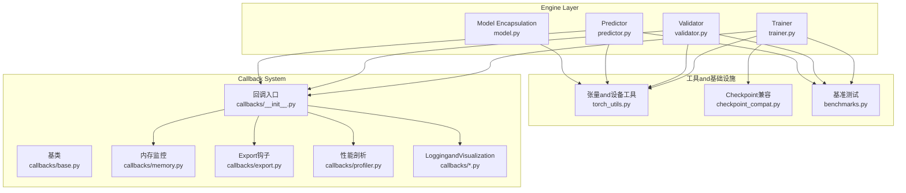
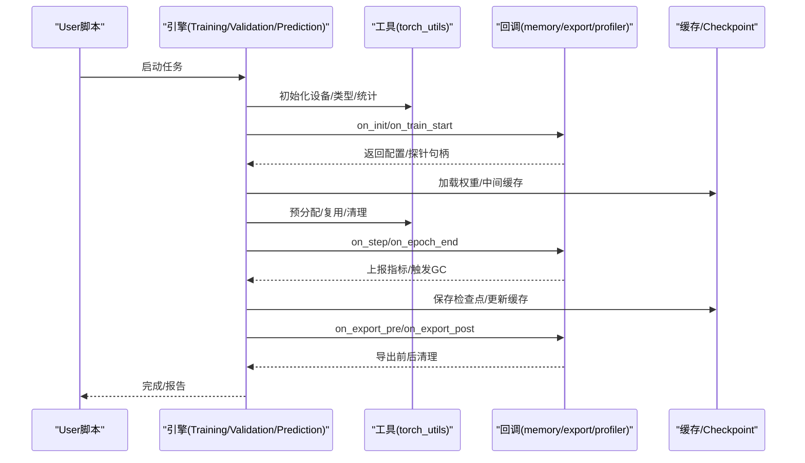
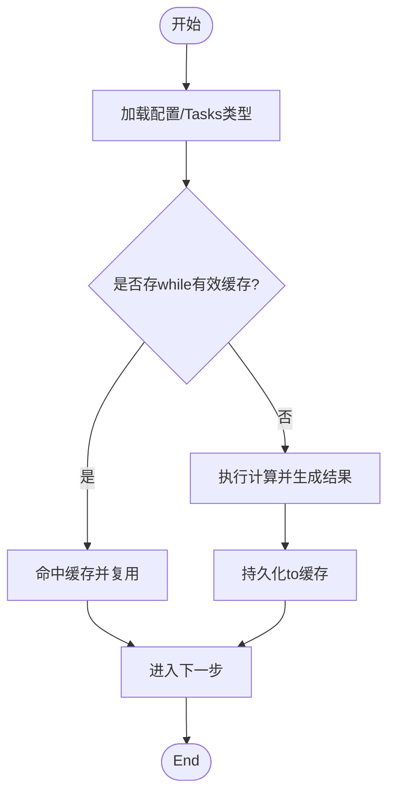
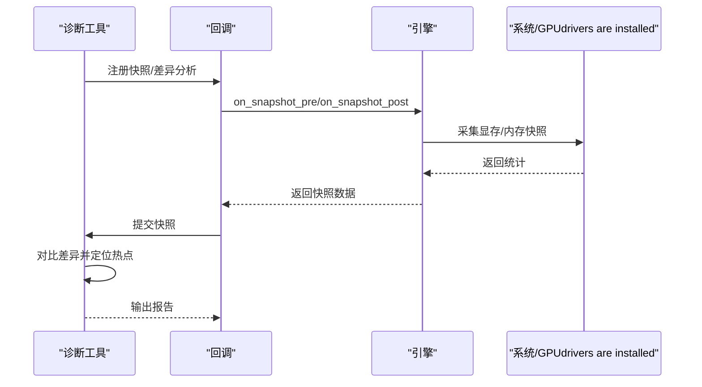
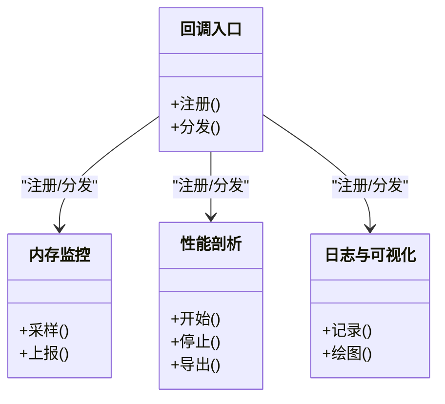
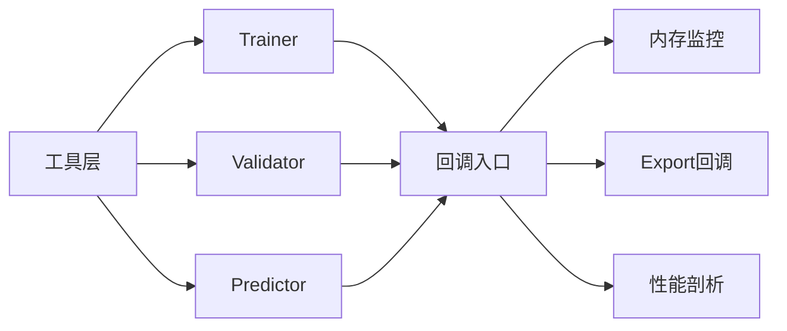

# 内存Optimizationand缓存

<cite>
**Files Referenced in This Document**
- [ultralytics/utils/torch_utils.py](file://ultralytics/utils/torch_utils.py)
- [ultralytics/engine/trainer.py](file://ultralytics/engine/trainer.py)
- [ultralytics/engine/predictor.py](file://ultralytics/engine/predictor.py)
- [ultralytics/engine/validator.py](file://ultralytics/engine/validator.py)
- [ultralytics/engine/model.py](file://ultralytics/engine/model.py)
- [ultralytics/utils/checkpoint_compat.py](file://ultralytics/utils/checkpoint_compat.py)
- [ultralytics/utils/benchmarks.py](file://ultralytics/utils/benchmarks.py)
- [ultralytics/utils/callbacks/__init__.py](file://ultralytics/utils/callbacks/__init__.py)
- [ultralytics/utils/callbacks/base.py](file://ultralytics/utils/callbacks/base.py)
- [ultralytics/utils/callbacks/memory.py](file://ultralytics/utils/callbacks/memory.py)
- [ultralytics/utils/callbacks/export.py](file://ultralytics/utils/callbacks/export.py)
- [ultralytics/utils/callbacks/rich.py](file://ultralytics/utils/callbacks/rich.py)
- [ultralytics/utils/callbacks/tensorboard.py](file://ultralytics/utils/callbacks/tensorboard.py)
- [ultralytics/utils/callbacks/wandb.py](file://ultralytics/utils/callbacks/wandb.py)
- [ultralytics/utils/callbacks/streamlit.py](file://ultralytics/utils/callbacks/streamlit.py)
- [ultralytics/utils/callbacks/hub.py](file://ultralytics/utils/callbacks/hub.py)
- [ultralytics/utils/callbacks/mlflow.py](file://ultralytics/utils/callbacks/mlflow.py)
- [ultralytics/utils/callbacks/neptune.py](file://ultralytics/utils/callbacks/neptune.py)
- [ultralytics/utils/callbacks/comet.py](file://ultralytics/utils/callbacks/comet.py)
- [ultralytics/utils/callbacks/clearml.py](file://ultralytics/utils/callbacks/clearml.py)
- [ultralytics/utils/callbacks/dvc.py](file://ultralytics/utils/callbacks/dvc.py)
- [ultralytics/utils/callbacks/fair_scale.py](file://ultralytics/utils/callbacks/fair_scale.py)
- [ultralytics/utils/callbacks/graphviz.py](file://ultralytics/utils/callbacks/graphviz.py)
- [ultralytics/utils/callbacks/plotting.py](file://ultralytics/utils/callbacks/plotting.py)
- [ultralytics/utils/callbacks/profiler.py](file://ultralytics/utils/callbacks/profiler.py)
- [ultralytics/utils/callbacks/sweeps.py](file://ultralytics/utils/callbacks/sweeps.py)
- [ultralytics/utils/callbacks/early_stopping.py](file://ultralytics/utils/callbacks/early_stopping.py)
- [ultralytics/utils/callbacks/ema.py](file://ultralytics/utils/callbacks/ema.py)
- [ultralytics/utils/callbacks/loggers.py](file://ultralytics/utils/callbacks/loggers.py)
- [ultralytics/utils/callbacks/metrics.py](file://ultralytics/utils/callbacks/metrics.py)
- [ultralytics/utils/callbacks/loss.py](file://ultralytics/utils/callbacks/loss.py)
- [ultralytics/utils/callbacks/optimizer.py](file://ultralytics/utils/callbacks/optimizer.py)
- [ultralytics/utils/callbacks/scheduler.py](file://ultralytics/utils/callbacks/scheduler.py)
- [ultralytics/utils/callbacks/progress.py](file://ultralytics/utils/callbacks/progress.py)
- [ultralytics/utils/callbacks/visualizer.py](file://ultralytics/utils/callbacks/visualizer.py)
- [ultralytics/utils/callbacks/weights_and_biases.py](file://ultralytics/utils/callbacks/weights_and_biases.py)
- [ultralytics/utils/callbacks/yaml.py](file://ultralytics/utils/callbacks/yaml.py)
- [ultralytics/utils/callbacks/zennit.py](file://ultralytics/utils/callbacks/zennit.py)
- [ultralytics/utils/callbacks/__main__.py](file://ultralytics/utils/callbacks/__main__.py)
- [ultralytics/utils/callbacks/test_callbacks.py](file://ultralytics/utils/callbacks/test_callbacks.py)
- [ultralytics/utils/callbacks/test_memory.py](file://ultralytics/utils/callbacks/test_memory.py)
- [ultralytics/utils/callbacks/test_plotting.py](file://ultralytics/utils/callbacks/test_plotting.py)
- [ultralytics/utils/callbacks/test_tensorboard.py](file://ultralytics/utils/callbacks/test_tensorboard.py)
- [ultralytics/utils/callbacks/test_wandb.py](file://ultralytics/utils/callbacks/test_wandb.py)
- [ultralytics/utils/callbacks/test_streamlit.py](file://ultralytics/utils/callbacks/test_streamlit.py)
- [ultralytics/utils/callbacks/test_hub.py](file://ultralytics/utils/callbacks/test_hub.py)
- [ultralytics/utils/callbacks/test_mlflow.py](file://ultralytics/utils/callbacks/test_mlflow.py)
- [ultralytics/utils/callbacks/test_neptune.py](file://ultralytics/utils/callbacks/test_neptune.py)
- [utilites/utils/callbacks/test_comet.py](file://ultralytics/utils/callbacks/test_comet.py)
- [ultralytics/utils/callbacks/test_clearml.py](file://ultralytics/utils/callbacks/test_clearml.py)
- [ultralytics/utils/callbacks/test_dvc.py](file://ultralytics/utils/callbacks/test_dvc.py)
- [ultralytics/utils/callbacks/test_fair_scale.py](file://ultralytics/utils/callbacks/test_fair_scale.py)
- [ultralytics/utils/callbacks/test_graphviz.py](file://ultralytics/utils/callbacks/test_graphviz.py)
- [ultralytics/utils/callbacks/test_profiler.py](file://ultralytics/utils/callbacks/test_profiler.py)
- [ultralytics/utils/callbacks/test_sweeps.py](file://ultralytics/utils/callbacks/test_sweeps.py)
- [ultralytics/utils/callbacks/test_early_stopping.py](file://ultralytics/utils/callbacks/test_early_stopping.py)
- [ultralytics/utils/callbacks/test_ema.py](file://ultralytics/utils/callbacks/test_ema.py)
- [ultralytics/utils/callbacks/test_loggers.py](file://ultralytics/utils/callbacks/test_loggers.py)
- [ultralytics/utils/callbacks/test_metrics.py](file://ultralytics/utils/callbacks/test_metrics.py)
- [ultralytics/utils/callbacks/test_loss.py](file://ultralytics/utils/callbacks/test_loss.py)
- [ultralytics/utils/callbacks/test_optimizer.py](file://ultralytics/utils/callbacks/test_optimizer.py)
- [ultralytics/utils/callbacks/test_scheduler.py](file://ultralytics/utils/callbacks/test_scheduler.py)
- [ultralytics/utils/callbacks/test_progress.py](file://ultralytics/utils/callbacks/test_progress.py)
- [ultralytics/utils/callbacks/test_visualizer.py](file://ultralytics/utils/callbacks/test_visualizer.py)
- [ultralytics/utils/callbacks/test_weights_and_biases.py](file://ultralytics/utils/callbacks/test_weights_and_biases.py)
- [ultralytics/utils/callbacks/test_yaml.py](file://ultralytics/utils/callbacks/test_yaml.py)
- [ultralytics/utils/callbacks/test_zennit.py](file://ultralytics/utils/callbacks/test_zennit.py)
</cite>

## Table of Contents
1. [Introduction](#Introduction)
2. [Project Structure](#Project Structure)
3. [Core Components](#Core Components)
4. [Architecture Overview](#Architecture Overview)
5. [Detailed Component Analysis](#Detailed Component Analysis)
6. [Dependency Analysis](#Dependency Analysis)
7. [性能考量](#性能考量)
8. [Troubleshooting Guide](#Troubleshooting Guide)
9. [Conclusion](#Conclusion)
10. [Appendix](#Appendix)

## Introduction
本技术Documentation聚焦于YOLO-Master的内存Optimization系统，围绕Centered on下主题unfold：
- GPU显存池管理and碎片整理
- 模型权重and中间结果、激活值缓存
- CPU侧对象池、内存映射and大数组Optimization
- 内存泄漏检测and诊断工具（引用计数、快照对比、定位）
- Mixture精度Training中的内存Optimization（FP16/BF16转换andGradient缩放）
- 内存Uses监控and性能分析工具的集成方法

目标是for研发and运维人员provides可落地的Optimization策略and排障路径。

## Project Structure
本项目whilePyTorch生态之上，through a unifiedEngine Layer（Training/Validation/Prediction）and回调体系组织内存相关capabilities。关键位置包括：
- 设备and张量工具：统一EncapsulatesGPU/CPU内存操作、类型转换、统计and清理etc.
- Engine Layer：Trainer、Validator、Predictor负责生命周期and内存分配时机控制
- Callback System：注册并执行内存监控、Export前Post-Processing、VisualizationandLogging
- 基准测试：用于Evaluation不同Optimization策略对吞吐and显存的影响

Figure Source
- [ultralytics/engine/trainer.py](file://ultralytics/engine/trainer.py)
- [ultralytics/engine/validator.py](file://ultralytics/engine/validator.py)
- [ultralytics/engine/predictor.py](file://ultralytics/engine/predictor.py)
- [ultralytics/engine/model.py](file://ultralytics/engine/model.py)
- [ultralytics/utils/torch_utils.py](file://ultralytics/utils/torch_utils.py)
- [ultralytics/utils/checkpoint_compat.py](file://ultralytics/utils/checkpoint_compat.py)
- [ultralytics/utils/benchmarks.py](file://ultralytics/utils/benchmarks.py)
- [ultralytics/utils/callbacks/__init__.py](file://ultralytics/utils/callbacks/__init__.py)
- [ultralytics/utils/callbacks/base.py](file://ultralytics/utils/callbacks/base.py)
- [ultralytics/utils/callbacks/memory.py](file://ultralytics/utils/callbacks/memory.py)
- [ultralytics/utils/callbacks/export.py](file://ultralytics/utils/callbacks/export.py)
- [ultralytics/utils/callbacks/profiler.py](file://ultralytics/utils/callbacks/profiler.py)
- [ultralytics/utils/callbacks/loggers.py](file://ultralytics/utils/callbacks/loggers.py)

Section Source
- [ultralytics/engine/trainer.py](file://ultralytics/engine/trainer.py)
- [ultralytics/engine/validator.py](file://ultralytics/engine/validator.py)
- [ultralytics/engine/predictor.py](file://ultralytics/engine/predictor.py)
- [ultralytics/engine/model.py](file://ultralytics/engine/model.py)
- [ultralytics/utils/torch_utils.py](file://ultralytics/utils/torch_utils.py)
- [ultralytics/utils/callbacks/__init__.py](file://ultralytics/utils/callbacks/__init__.py)
- [ultralytics/utils/callbacks/memory.py](file://ultralytics/utils/callbacks/memory.py)
- [ultralytics/utils/callbacks/export.py](file://ultralytics/utils/callbacks/export.py)
- [ultralytics/utils/callbacks/profiler.py](file://ultralytics/utils/callbacks/profiler.py)
- [ultralytics/utils/benchmarks.py](file://ultralytics/utils/benchmarks.py)
- [ultralytics/utils/checkpoint_compat.py](file://ultralytics/utils/checkpoint_compat.py)

## Core Components
- 设备and张量工具Modules
  - providesGPU/CPUDevice Selection、张量类型转换、显存统计、清理and同步etc.基础capabilities
  - 作for上层引擎and回调的统一依赖，确保一致的内存行for
- Engine Layer（Training/Validation/Prediction）
  - 控制Data Loading、Forward/Backward Propagation、Optimizer步骤andCheckpoint保存
  - while关键阶段触发回调Centered on采集内存Metrics或执行清理
- Callback System
  - 内存监控回调：周期性采样显存/内存占用、峰值统计、异常告警
  - Export回调：Export前后进行显存释放and缓存清理
  - 性能剖析回调：Combining框架Built-in剖析器记录热点and内存峰值
- 基准测试
  - provides端to端场景下的吞吐and显存占用测量，辅助回归and容量规划

Section Source
- [ultralytics/utils/torch_utils.py](file://ultralytics/utils/torch_utils.py)
- [ultralytics/engine/trainer.py](file://ultralytics/engine/trainer.py)
- [ultralytics/engine/validator.py](file://ultralytics/engine/validator.py)
- [ultralytics/engine/predictor.py](file://ultralytics/engine/predictor.py)
- [ultralytics/utils/callbacks/memory.py](file://ultralytics/utils/callbacks/memory.py)
- [ultralytics/utils/callbacks/export.py](file://ultralytics/utils/callbacks/export.py)
- [ultralytics/utils/callbacks/profiler.py](file://ultralytics/utils/callbacks/profiler.py)
- [ultralytics/utils/benchmarks.py](file://ultralytics/utils/benchmarks.py)

## Architecture Overview
下图展示内存Optimization相关组件的交互关系：引擎while生命周期中Calls工具函数and回调，implementing显存预分配、复用、清理and监控；Export流程Via回调while合适时机释放临时资源；基准测试贯穿各模式Centered on量化收益。

Figure Source
- [ultralytics/engine/trainer.py](file://ultralytics/engine/trainer.py)
- [ultralytics/engine/validator.py](file://ultralytics/engine/validator.py)
- [ultralytics/engine/predictor.py](file://ultralytics/engine/predictor.py)
- [ultralytics/utils/torch_utils.py](file://ultralytics/utils/torch_utils.py)
- [ultralytics/utils/callbacks/memory.py](file://ultralytics/utils/callbacks/memory.py)
- [ultralytics/utils/callbacks/export.py](file://ultralytics/utils/callbacks/export.py)
- [ultralytics/utils/callbacks/profiler.py](file://ultralytics/utils/callbacks/profiler.py)
- [ultralytics/utils/checkpoint_compat.py](file://ultralytics/utils/checkpoint_compat.py)

## Detailed Component Analysis

### GPU显存池管理and碎片整理
- 设计要点
  - 显存预分配：while首次Uses前按预估峰值进行一次性分配，减少频繁分配带来的碎片and开销
  - 内存块复用：while固定形状张量频繁创建的场景，采用对象池或缓冲区复用，避免重复分配
  - 碎片整理：定期触发底层释放and同步，必要时重建大张量Centered on降低碎片率
- implementing位置and职责
  - 工具层provides显存统计、清理and同步接口，供引擎and回调按需Calls
  - 回调whileTraining步/轮次边界、Export前后插入清理and统计逻辑
- 建议实践
  - 根据批大小and输入分辨率估算峰值，设置合理的预分配上限
  - 对中间特征图and临时张量采用复用策略，限制其生命周期
  - while长时运行Tasks中周期性触发清理and同步，降低碎片累积

Section Source
- [ultralytics/utils/torch_utils.py](file://ultralytics/utils/torch_utils.py)
- [ultralytics/utils/callbacks/memory.py](file://ultralytics/utils/callbacks/memory.py)
- [ultralytics/utils/callbacks/export.py](file://ultralytics/utils/callbacks/export.py)

### 模型权重and中间结果、激活值缓存
- 权重文件缓存
  - 将常用权重and适配参数持久化to本地缓存Table of Contents，避免重复下载and解析
  - Supporting版本兼容校验and回滚，保证一致性
- 中间结果缓存
  - 对昂贵的前置计算（such as图像增强、Feature Extraction）结果进行键控缓存，命中则直接复用
- 激活值缓存
  - whileInference或调试模式下，选择性缓存关键层的激活，便于分析andVisualization
- implementing位置and职责
  - Checkpoint兼容Modules负责权重加载、校验andMigration
  - 引擎while合适时机读取/写入缓存，回调负责清理and统计

Figure Source
- [ultralytics/utils/checkpoint_compat.py](file://ultralytics/utils/checkpoint_compat.py)
- [ultralytics/engine/trainer.py](file://ultralytics/engine/trainer.py)
- [ultralytics/engine/predictor.py](file://ultralytics/engine/predictor.py)

Section Source
- [ultralytics/utils/checkpoint_compat.py](file://ultralytics/utils/checkpoint_compat.py)
- [ultralytics/engine/trainer.py](file://ultralytics/engine/trainer.py)
- [ultralytics/engine/predictor.py](file://ultralytics/engine/predictor.py)

### CPU内存Optimization：对象池、内存映射and大数组Optimization
- 对象池
  - 针对高频创建销毁的小对象（such as批次元数据、索引容器）建立池化，降低分配压力
- 内存映射
  - 对超大数据集或标签文件采用内存映射，按需分页访问，减少常驻内存
- 大数组Optimization
  - Uses连续内存布局、避免不必要的拷贝and视图复制，必要时就地更新
- 集成方式
  - whileData Loadingand预处理管线中引入池化andmmap策略
  - while引擎循环中控制对象生命周期，and时释放不再Uses的引用

Section Source
- [ultralytics/data/build.py](file://ultralytics/data/build.py)
- [ultralytics/data/dataset.py](file://ultralytics/data/dataset.py)
- [ultralytics/utils/torch_utils.py](file://ultralytics/utils/torch_utils.py)

### 内存泄漏检测and诊断工具
- 引用计数分析
  - while关键路径打印对象引用计数变化，识别未释放的强引用
- 内存快照对比
  - whileTraining/Inference前后采集显存/内存快照，对比差异定位新增持有者
- 泄漏点定位
  - Combining回调and剖析器，输出热点函数and峰值时刻的上下文信息
- 集成方式
  - whileCallback System中注册“快照采集”和“差异分析”钩子
  - whileExport前后强制清理，排除Export过程残留导致的误报

Figure Source
- [ultralytics/utils/callbacks/memory.py](file://ultralytics/utils/callbacks/memory.py)
- [ultralytics/utils/callbacks/profiler.py](file://ultralytics/utils/callbacks/profiler.py)
- [ultralytics/utils/callbacks/__init__.py](file://ultralytics/utils/callbacks/__init__.py)

Section Source
- [ultralytics/utils/callbacks/memory.py](file://ultralytics/utils/callbacks/memory.py)
- [ultralytics/utils/callbacks/profiler.py](file://ultralytics/utils/callbacks/profiler.py)
- [ultralytics/utils/callbacks/__init__.py](file://ultralytics/utils/callbacks/__init__.py)

### Mixture精度Training中的内存Optimization（FP16/BF16andGradient缩放）
- 格式转换
  - While maintaining数值稳定性的前提下，将权重and激活转换for低精度格式，显著降低显存占用
- Gradient缩放
  - Via动态缩放因子避免下溢，提升稳定性
- 集成方式
  - whileTrainer初始化阶段启用Mixture精度后端
  - while损失计算andOptimizer步骤前后插入缩放and反缩放逻辑
  - whileExport时恢复for高精度权重Centered on保证部署兼容性

Section Source
- [ultralytics/engine/trainer.py](file://ultralytics/engine/trainer.py)
- [ultralytics/utils/torch_utils.py](file://ultralytics/utils/torch_utils.py)

### 内存Uses监控and性能分析工具集成
- 监控Metrics
  - 显存峰值、平均占用、CPU内存占用、分配次数and碎片率
- 分析工具
  - CombiningBuilt-in剖析器and第三方Logging平台（TensorBoard、Weights & Biases、MLflowetc.）
- 集成方式
  - while回调入口集中注册各类监控andVisualization回调
  - whileTraining/Validation/Prediction的关键节点触发上报

Figure Source
- [ultralytics/utils/callbacks/__init__.py](file://ultralytics/utils/callbacks/__init__.py)
- [ultralytics/utils/callbacks/memory.py](file://ultralytics/utils/callbacks/memory.py)
- [ultralytics/utils/callbacks/profiler.py](file://ultralytics/utils/callbacks/profiler.py)
- [ultralytics/utils/callbacks/tensorboard.py](file://ultralytics/utils/callbacks/tensorboard.py)
- [ultralytics/utils/callbacks/wandb.py](file://ultralytics/utils/callbacks/wandb.py)
- [ultralytics/utils/callbacks/mlflow.py](file://ultralytics/utils/callbacks/mlflow.py)

Section Source
- [ultralytics/utils/callbacks/__init__.py](file://ultralytics/utils/callbacks/__init__.py)
- [ultralytics/utils/callbacks/memory.py](file://ultralytics/utils/callbacks/memory.py)
- [ultralytics/utils/callbacks/profiler.py](file://ultralytics/utils/callbacks/profiler.py)
- [ultralytics/utils/callbacks/tensorboard.py](file://ultralytics/utils/callbacks/tensorboard.py)
- [ultralytics/utils/callbacks/wandb.py](file://ultralytics/utils/callbacks/wandb.py)
- [ultralytics/utils/callbacks/mlflow.py](file://ultralytics/utils/callbacks/mlflow.py)

## Dependency Analysis
- 耦合and内聚
  - 工具层被引擎and回调广泛依赖，具备高内聚and低耦合特性
  - Callback SystemViaUnified entry point解耦具体implementing，便于扩展
- External Dependencies
  - PyTorch设备and张量API、剖析器、第三方Logging平台
- 潜while环依赖
  - 回调仅单向依赖引擎事件，避免循环导入

Figure Source
- [ultralytics/utils/torch_utils.py](file://ultralytics/utils/torch_utils.py)
- [ultralytics/engine/trainer.py](file://ultralytics/engine/trainer.py)
- [ultralytics/engine/validator.py](file://ultralytics/engine/validator.py)
- [ultralytics/engine/predictor.py](file://ultralytics/engine/predictor.py)
- [ultralytics/utils/callbacks/__init__.py](file://ultralytics/utils/callbacks/__init__.py)
- [ultralytics/utils/callbacks/memory.py](file://ultralytics/utils/callbacks/memory.py)
- [ultralytics/utils/callbacks/export.py](file://ultralytics/utils/callbacks/export.py)
- [ultralytics/utils/callbacks/profiler.py](file://ultralytics/utils/callbacks/profiler.py)

Section Source
- [ultralytics/utils/torch_utils.py](file://ultralytics/utils/torch_utils.py)
- [ultralytics/engine/trainer.py](file://ultralytics/engine/trainer.py)
- [ultralytics/engine/validator.py](file://ultralytics/engine/validator.py)
- [ultralytics/engine/predictor.py](file://ultralytics/engine/predictor.py)
- [ultralytics/utils/callbacks/__init__.py](file://ultralytics/utils/callbacks/__init__.py)

## 性能考量
- 预分配and复用
  - 合理估计峰值显存，避免过度预分配导致OOM
  - 对短生命周期张量采用复用策略，减少分配次数
- 碎片管理
  - 长时Tasks中周期性清理and同步，必要时重建大张量
- Mixture精度
  - while稳定前提下开启FP16/BF16，Combined withGradient缩放提升吞吐
- 监控and回归
  - Uses基准测试and回调Metrics持续Tracking，防止回归

[This section provides general guidance and does not directly analyze specific files]

## Troubleshooting Guide
- 常见问题
  - OOM：检查预分配上限、批大小and输入分辨率；确认Export后是否释放临时张量
  - 碎片率高：增加清理频率，避免长时间持有大张量引用
  - 泄漏疑似：Uses快照对比and引用计数分析定位热点
- 操作步骤
  - 启用内存监控回调，观察峰值and趋势
  - whileExport前后插入清理钩子，排除Export残留
  - Uses剖析器定位热点函数，CombiningLogging输出上下文

Section Source
- [ultralytics/utils/callbacks/memory.py](file://ultralytics/utils/callbacks/memory.py)
- [ultralytics/utils/callbacks/export.py](file://ultralytics/utils/callbacks/export.py)
- [ultralytics/utils/callbacks/profiler.py](file://ultralytics/utils/callbacks/profiler.py)

## Conclusion
through a unified工具层、引擎生命周期控制and可扩展的Callback System，YOLO-Masterimplementing了从显存预分配、复用and碎片整理，to权重and中间结果缓存、CPU内存Optimization、泄漏诊断andMixture精度Optimization的完整内存Optimization闭环。Combined with基准测试and多平台Logging集成，可while复杂Tasks中稳定获得更低的显存占用and更高的吞吐。

[This section is summary content and does not directly analyze specific files]

## Appendix
- 最佳实践清单
  - 明确峰值估算and预分配策略
  - whileExport前后执行清理and缓存刷新
  - 定期采集快照并进行差异分析
  - while长时Training中周期性触发清理and同步
  - Uses基准测试ValidationOptimization效果

[本节for补充说明，不直接分析具体文件]