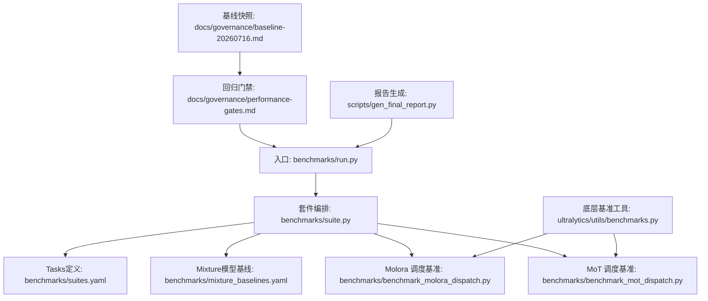
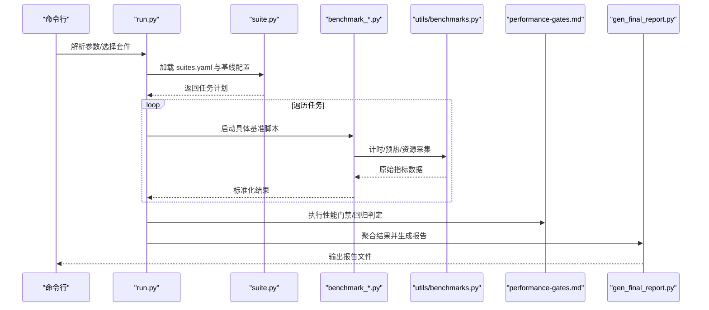
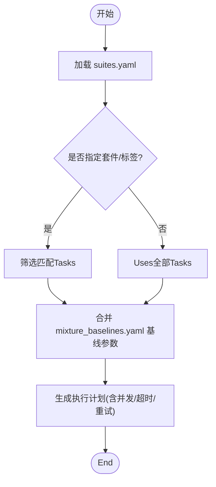
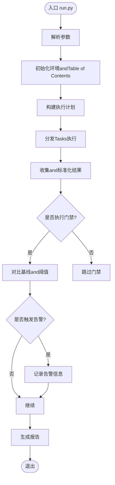
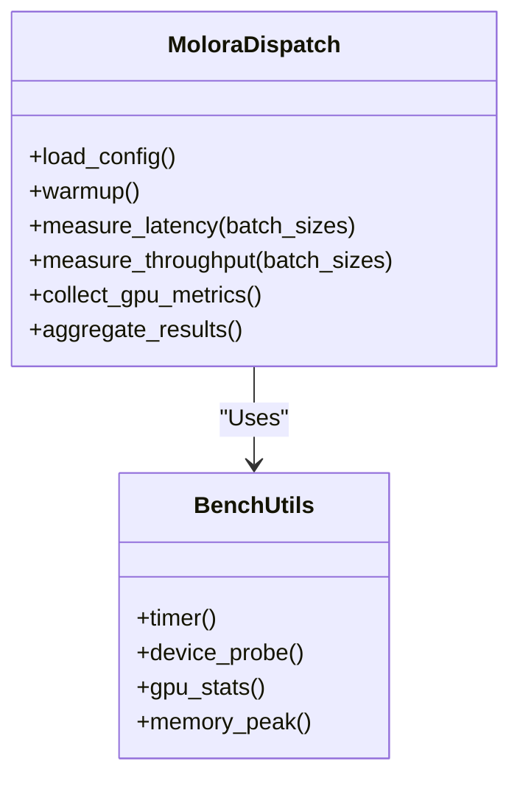
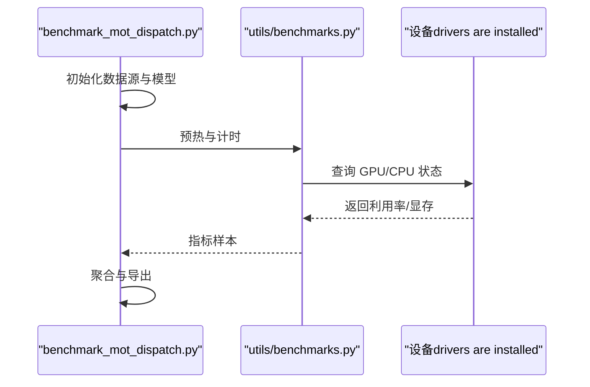
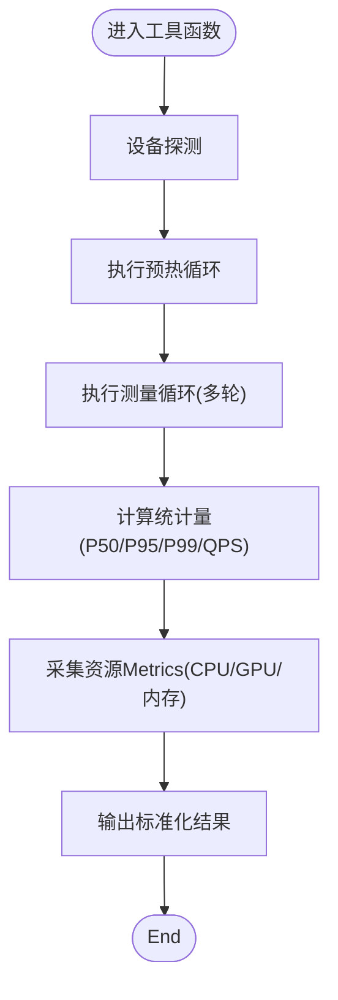
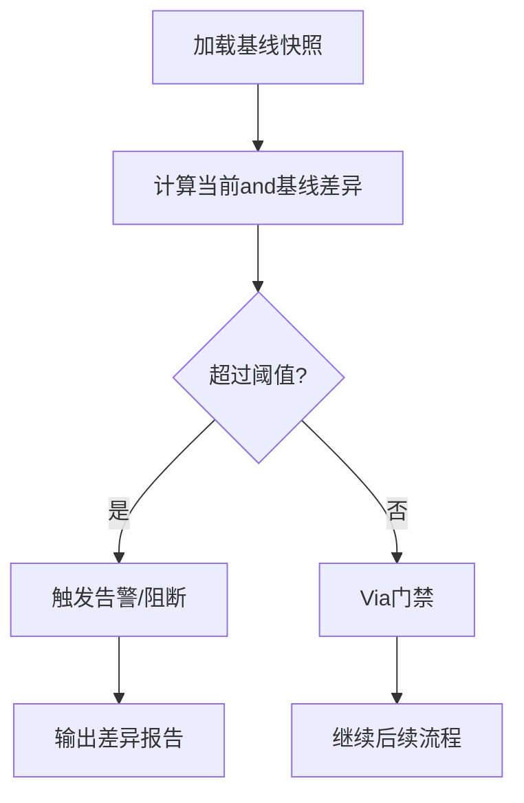
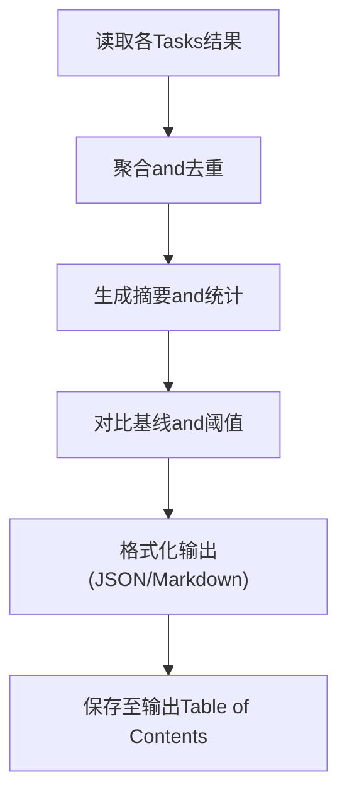
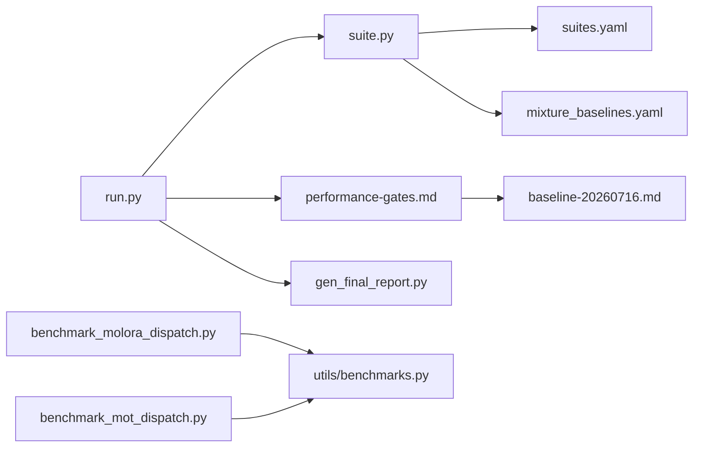

# 性能基准测试

<cite>
**Files Referenced in This Document**
- [benchmarks/run.py](file://benchmarks/run.py)
- [benchmarks/suite.py](file://benchmarks/suite.py)
- [benchmarks/benchmark_molora_dispatch.py](file://benchmarks/benchmark_molora_dispatch.py)
- [benchmarks/benchmark_mot_dispatch.py](file://benchmarks/benchmark_mot_dispatch.py)
- [benchmarks/mixture_baselines.yaml](file://benchmarks/mixture_baselines.yaml)
- [benchmarks/suites.yaml](file://benchmarks/suites.yaml)
- [ultralytics/utils/benchmarks.py](file://ultralytics/utils/benchmarks.py)
- [tests/test_benchmark_suite.py](file://tests/test_benchmark_suite.py)
- [docs/governance/performance-gates.md](file://docs/governance/performance-gates.md)
- [docs/governance/baseline-20260716.md](file://docs/governance/baseline-20260716.md)
- [scripts/gen_final_report.py](file://scripts/gen_final_report.py)
</cite>

## Table of Contents
1. [Introduction](#Introduction)
2. [Project Structure](#Project Structure)
3. [Core Components](#Core Components)
4. [Architecture Overview](#Architecture Overview)
5. [Detailed Component Analysis](#Detailed Component Analysis)
6. [Dependency Analysis](#Dependency Analysis)
7. [性能考量](#性能考量)
8. [Troubleshooting Guide](#Troubleshooting Guide)
9. [Conclusion](#Conclusion)
10. [Appendix](#Appendix)

## Introduction
本技术Documentationtargeting YOLO-Master 的性能基准测试系统，聚焦 Benchmark Modules的测试框架设计、执行引擎and结果聚合机制。Documentation覆盖Centered on下关键主题：
- 测试用例定义、执行引擎and结果聚合
- 多种性能Metrics测量方法（Inference延迟、吞吐量、内存占用、GPU 利用率）
- 自动化基准测试流程（Environment Preparation、批量执行、报告生成）
- 性能回归检测（基线对比、趋势分析、告警机制）
- 分布式基准测试Supporting（多节点测试、结果同步、一致性Validation）
- 自定义基准测试开发and最佳实践
- 不同硬件平台的Optimization建议and调优参数

## Project Structure
Benchmark 相关代码主要位于 benchmarks Table of Contents，配套工具and治理Documentation分布于 ultralytics/utils、tests、docs/governance and scripts etc.位置。整体组织遵循“配置drivers are installed + 套件化 + 可插拔”的设计思路：Via YAML 描述套件andTasks，suite 层负责解析and编排，run 层作for入口协调执行and输出；具体场景的基准脚本Centered on独立Modules形式provides，便于扩展and维护。

Figure Source
- [benchmarks/run.py](file://benchmarks/run.py)
- [benchmarks/suite.py](file://benchmarks/suite.py)
- [benchmarks/suites.yaml](file://benchmarks/suites.yaml)
- [benchmarks/mixture_baselines.yaml](file://benchmarks/mixture_baselines.yaml)
- [benchmarks/benchmark_molora_dispatch.py](file://benchmarks/benchmark_molora_dispatch.py)
- [benchmarks/benchmark_mot_dispatch.py](file://benchmarks/benchmark_mot_dispatch.py)
- [ultralytics/utils/benchmarks.py](file://ultralytics/utils/benchmarks.py)
- [docs/governance/performance-gates.md](file://docs/governance/performance-gates.md)
- [docs/governance/baseline-20260716.md](file://docs/governance/baseline-20260716.md)
- [scripts/gen_final_report.py](file://scripts/gen_final_report.py)

Section Source
- [benchmarks/run.py](file://benchmarks/run.py)
- [benchmarks/suite.py](file://benchmarks/suite.py)
- [benchmarks/suites.yaml](file://benchmarks/suites.yaml)
- [benchmarks/mixture_baselines.yaml](file://benchmarks/mixture_baselines.yaml)
- [benchmarks/benchmark_molora_dispatch.py](file://benchmarks/benchmark_molora_dispatch.py)
- [benchmarks/benchmark_mot_dispatch.py](file://benchmarks/benchmark_mot_dispatch.py)
- [ultralytics/utils/benchmarks.py](file://ultralytics/utils/benchmarks.py)
- [docs/governance/performance-gates.md](file://docs/governance/performance-gates.md)
- [docs/governance/baseline-20260716.md](file://docs/governance/baseline-20260716.md)
- [scripts/gen_final_report.py](file://scripts/gen_final_report.py)

## Core Components
- 套件编排器（suite.py）
  - 职责：加载 suites.yaml and mixture_baselines.yaml，解析Tasks清单、参数and环境约束，构建可执行的测试计划。
  - 关键点：Supporting按套件/标签过滤、并行度控制、失败策略and重试策略。
- 运行入口（run.py）
  - 职责：命令行参数解析、环境初始化、调度 suite 编排器、汇总结果并触发报告生成。
  - 关键点：集成性能门禁检查and基线对比，统一Loggingand产物输出路径。
- 场景基准脚本
  - Molora 调度基准（benchmark_molora_dispatch.py）：针对 MoE/MoA 路由and专家负载的吞吐/延迟Evaluation。
  - MoT 调度基准（benchmark_mot_dispatch.py）：针对Multi-Object TrackingTasks的端to端延迟and吞吐Evaluation。
- 底层基准工具（ultralytics/utils/benchmarks.py）
  - 职责：Encapsulates通用计时、预热、批大小扫描、设备探测、资源采集（CPU/GPU/内存）etc.capabilities。
- 治理and门禁（performance-gates.md, baseline-20260716.md）
  - 职责：定义性能阈值、回归判定规则and告警策略，维护历史基线快照用于对比。
- 报告生成（gen_final_report.py）
  - 职责：聚合各Tasks结果，生成结构化报告（JSON/Markdown），支撑Visualizationand归档。

Section Source
- [benchmarks/suite.py](file://benchmarks/suite.py)
- [benchmarks/run.py](file://benchmarks/run.py)
- [benchmarks/benchmark_molora_dispatch.py](file://benchmarks/benchmark_molora_dispatch.py)
- [benchmarks/benchmark_mot_dispatch.py](file://benchmarks/benchmark_mot_dispatch.py)
- [ultralytics/utils/benchmarks.py](file://ultralytics/utils/benchmarks.py)
- [docs/governance/performance-gates.md](file://docs/governance/performance-gates.md)
- [docs/governance/baseline-20260716.md](file://docs/governance/baseline-20260716.md)
- [scripts/gen_final_report.py](file://scripts/gen_final_report.py)

## Architecture Overview
下图展示了从入口to具体Tasks执行的Calls链路and数据流，包括套件解析、Task Dispatch、Metrics采集and结果汇聚。

Figure Source
- [benchmarks/run.py](file://benchmarks/run.py)
- [benchmarks/suite.py](file://benchmarks/suite.py)
- [benchmarks/benchmark_molora_dispatch.py](file://benchmarks/benchmark_molora_dispatch.py)
- [benchmarks/benchmark_mot_dispatch.py](file://benchmarks/benchmark_mot_dispatch.py)
- [ultralytics/utils/benchmarks.py](file://ultralytics/utils/benchmarks.py)
- [docs/governance/performance-gates.md](file://docs/governance/performance-gates.md)
- [scripts/gen_final_report.py](file://scripts/gen_final_report.py)

## Detailed Component Analysis

### 套件andTasks定义（suites.yaml and mixture_baselines.yaml）
- suites.yaml
  - 定义套件集合、Tasks名、参数模板、设备要求、并发度、超时and重试策略。
  - Supporting按标签筛选、条件启用/禁用、环境变量注入。
- mixture_baselines.yaml
  - 集中管理Mixture模型（such as MoE/MoA）的基线权重、routing strategiesand专家规模etc.关键参数，供基准脚本读取。

Figure Source
- [benchmarks/suites.yaml](file://benchmarks/suites.yaml)
- [benchmarks/mixture_baselines.yaml](file://benchmarks/mixture_baselines.yaml)
- [benchmarks/suite.py](file://benchmarks/suite.py)

Section Source
- [benchmarks/suites.yaml](file://benchmarks/suites.yaml)
- [benchmarks/mixture_baselines.yaml](file://benchmarks/mixture_baselines.yaml)
- [benchmarks/suite.py](file://benchmarks/suite.py)

### 运行入口and执行引擎（run.py）
- 功能要点
  - 解析命令行参数（套件、设备、并发、输出Table of Contents、是否开启门禁）。
  - 初始化Loggingand临时Table of Contents，确保幂etc.and可重复性。
  - Calls suite 编排器获取Tasks计划，按策略分发执行。
  - 收集每个Tasks的原始Metrics，进行标准化and校验。
  - 触发性能门禁and基线对比，必要时记录告警。
  - Calls报告生成器产出最终报告。
- 错误处理
  - 对单个Tasks失败采用隔离策略，不影响其他Tasks。
  - Supporting重试and回退策略，避免偶发性抖动影响整体结果。

Figure Source
- [benchmarks/run.py](file://benchmarks/run.py)
- [docs/governance/performance-gates.md](file://docs/governance/performance-gates.md)
- [scripts/gen_final_report.py](file://scripts/gen_final_report.py)

Section Source
- [benchmarks/run.py](file://benchmarks/run.py)
- [docs/governance/performance-gates.md](file://docs/governance/performance-gates.md)
- [scripts/gen_final_report.py](file://scripts/gen_final_report.py)

### 场景基准脚本：Molora 调度（benchmark_molora_dispatch.py）
- 关注点
  - 路由and专家负载的吞吐/延迟分布、Load Balancing度、热点专家识别。
  - while典型数据集and批大小下的稳定性and抖动。
- Metrics采集
  - Uses底层工具进行多轮预热and统计，计算 P50/P95/P99 延迟、QPS、GPU 显存峰值、GPU 利用率均值and方差。
- 结果输出
  - 输出结构化 JSON，包含Tasks元数据、设备信息、参数组合andMetrics摘要。

Figure Source
- [benchmarks/benchmark_molora_dispatch.py](file://benchmarks/benchmark_molora_dispatch.py)
- [ultralytics/utils/benchmarks.py](file://ultralytics/utils/benchmarks.py)

Section Source
- [benchmarks/benchmark_molora_dispatch.py](file://benchmarks/benchmark_molora_dispatch.py)
- [ultralytics/utils/benchmarks.py](file://ultralytics/utils/benchmarks.py)

### 场景基准脚本：MoT 调度（benchmark_mot_dispatch.py）
- 关注点
  - Multi-Object Tracking端to端延迟、帧率、轨迹质量and资源占用。
  - while不同分辨率、帧率and对象密度下的鲁棒性。
- Metrics采集
  - 视频流或图像序列输入，统计每帧处理时间、队列积压、GPU/CPU 占用。
- 结果输出
  - and Molora 一致的 JSON 结构，便于横向对比and聚合。

Figure Source
- [benchmarks/benchmark_mot_dispatch.py](file://benchmarks/benchmark_mot_dispatch.py)
- [ultralytics/utils/benchmarks.py](file://ultralytics/utils/benchmarks.py)

Section Source
- [benchmarks/benchmark_mot_dispatch.py](file://benchmarks/benchmark_mot_dispatch.py)
- [ultralytics/utils/benchmarks.py](file://ultralytics/utils/benchmarks.py)

### 底层基准工具（ultralytics/utils/benchmarks.py）
- capabilities概述
  - 计时器and预热：Supporting多次预热、剔除冷启动异常值。
  - 设备探测：自动选择 CPU/GPU，检测可用设备数量and类型。
  - 资源采集：CPU 利用率、GPU 利用率、显存峰值、内存占用。
  - 批大小扫描：自动搜索最优批大小，兼顾吞吐and延迟目标。
- 复杂度and性能
  - 采样次数and预热轮次可调，平衡精度and耗时。
  - 资源采集采用非阻塞方式，降低对主流程的影响。

Figure Source
- [ultralytics/utils/benchmarks.py](file://ultralytics/utils/benchmarks.py)

Section Source
- [ultralytics/utils/benchmarks.py](file://ultralytics/utils/benchmarks.py)

### 性能回归检测and门禁（performance-gates.md and baseline-20260716.md）
- 基线管理
  - 维护历史基线快照，包含关键Metricsand设备信息，用于版本间对比。
- 回归判定
  - 基于阈值and相对变化比例进行判断，Supporting按Tasks/套件维度设置不同门槛。
- 告警机制
  - 当检测to显著退化时，记录告警并阻断流水线（Optional），同时输出差异详情。

Figure Source
- [docs/governance/performance-gates.md](file://docs/governance/performance-gates.md)
- [docs/governance/baseline-20260716.md](file://docs/governance/baseline-20260716.md)

Section Source
- [docs/governance/performance-gates.md](file://docs/governance/performance-gates.md)
- [docs/governance/baseline-20260716.md](file://docs/governance/baseline-20260716.md)

### 报告生成（gen_final_report.py）
- 功能要点
  - 聚合各Tasks结果，生成结构化报告（JSON/Markdown）。
  - 包含Tasks元数据、Metrics摘要、差异分析and告警信息。
  - Supporting按套件/设备/日期维度归档，便于趋势分析。

Figure Source
- [scripts/gen_final_report.py](file://scripts/gen_final_report.py)

Section Source
- [scripts/gen_final_report.py](file://scripts/gen_final_report.py)

### 单元测试and契约Validation（test_benchmark_suite.py）
- 作用
  - Validation套件解析、Tasks执行and结果聚合的正确性and健壮性。
  - 覆盖边界条件（空套件、缺失参数、设备不可用etc.）。
- 建议
  - 新增Tasks或变更套件格式时，补充对应用例，确保契约稳定。

Section Source
- [tests/test_benchmark_suite.py](file://tests/test_benchmark_suite.py)

## Dependency Analysis
- 内部依赖
  - run.py 依赖 suite.py 进行Tasks编排，suite.py 依赖 suites.yaml and mixture_baselines.yaml。
  - 场景基准脚本依赖 ultralytics/utils/benchmarks.py provides的通用capabilities。
  - run.py and performance-gates.md、baseline-20260716.md 协作完成回归检测。
  - run.py Calls gen_final_report.py 生成报告。
- External Dependencies
  - 设备drivers are installedand系统监控接口（CPU/GPU/内存）。
  - 可能的第三方库（such as PyTorch、NVIDIA 工具链）由底层工具间接Uses。

Figure Source
- [benchmarks/run.py](file://benchmarks/run.py)
- [benchmarks/suite.py](file://benchmarks/suite.py)
- [benchmarks/suites.yaml](file://benchmarks/suites.yaml)
- [benchmarks/mixture_baselines.yaml](file://benchmarks/mixture_baselines.yaml)
- [benchmarks/benchmark_molora_dispatch.py](file://benchmarks/benchmark_molora_dispatch.py)
- [benchmarks/benchmark_mot_dispatch.py](file://benchmarks/benchmark_mot_dispatch.py)
- [ultralytics/utils/benchmarks.py](file://ultralytics/utils/benchmarks.py)
- [docs/governance/performance-gates.md](file://docs/governance/performance-gates.md)
- [docs/governance/baseline-20260716.md](file://docs/governance/baseline-20260716.md)
- [scripts/gen_final_report.py](file://scripts/gen_final_report.py)

Section Source
- [benchmarks/run.py](file://benchmarks/run.py)
- [benchmarks/suite.py](file://benchmarks/suite.py)
- [benchmarks/suites.yaml](file://benchmarks/suites.yaml)
- [benchmarks/mixture_baselines.yaml](file://benchmarks/mixture_baselines.yaml)
- [benchmarks/benchmark_molora_dispatch.py](file://benchmarks/benchmark_molora_dispatch.py)
- [benchmarks/benchmark_mot_dispatch.py](file://benchmarks/benchmark_mot_dispatch.py)
- [ultralytics/utils/benchmarks.py](file://ultralytics/utils/benchmarks.py)
- [docs/governance/performance-gates.md](file://docs/governance/performance-gates.md)
- [docs/governance/baseline-20260716.md](file://docs/governance/baseline-20260716.md)
- [scripts/gen_final_report.py](file://scripts/gen_final_report.py)

## 性能考量
- Metrics测量方法
  - Inference延迟：多轮预热后统计 P50/P95/P99，剔除冷启动and GC 抖动。
  - 吞吐量：固定时长内累计处理样本数，换算for QPS；Supporting批大小扫描。
  - 内存占用：记录进程and设备显存的峰值and均值，区分分配and释放阶段。
  - GPU 利用率：采样频率and窗口长度需适配设备特性，避免采样开销过大。
- 稳定性and可重复性
  - 固定随机种子、关闭无关后台进程、锁定设备and电源模式。
  - 多次独立运行取中位数，减少噪声影响。
- 批大小and并发
  - 根据目标延迟/吞吐自动搜索批大小；Set appropriately并发度Centered on避免资源争用。
- 平台差异
  - CPU：注意 NUMA and线程亲和性；I/O bottlenecks可能主导端to端延迟。
  - GPU：利用 TensorRT/OpenVINO etc.后端Optimization；关注显存碎片and内核启动开销。
  - 边缘设备：限制并发and批大小，优先保证延迟稳定性。

[This section provides general guidance and does not directly analyze specific files]

## Troubleshooting Guide
- 常见问题
  - 设备不可用或权限不足：检查 CUDA/drivers are installed版本andUser权限。
  - 结果不稳定：增加预热轮次and采样次数，排除系统干扰。
  - 报告缺失或for空：确认输出Table of Contents权限and写入成功。
- 定位步骤
  - 查看Tasks级Loggingand中间产物，核对参数and设备信息。
  - 单独运行问题Tasks，复现并缩小范围。
  - 对比基线快照，定位回归点and差异字段。
- 恢复策略
  - 调整并发and批大小，降低资源压力。
  - 更新drivers are installed/固件或切换后端implementing。
  - 重新生成基线快照（仅while确认可接受时）。

Section Source
- [docs/governance/performance-gates.md](file://docs/governance/performance-gates.md)
- [docs/governance/baseline-20260716.md](file://docs/governance/baseline-20260716.md)
- [scripts/gen_final_report.py](file://scripts/gen_final_report.py)

## Conclusion
YOLO-Master 的基准测试系统Centered on配置drivers are installedfor核心，Combining套件编排and场景化脚本，implementing了可复用、可扩展且可回归检测的性能Evaluation体系。through a unifiedMetrics采集and报告生成，团队能够while多硬件平台上持续追踪性能趋势并and时发现回归。建议while持续集成中常态化运行门禁and报告，形成闭环的质量保障。

[This section is summary content and does not directly analyze specific files]

## Appendix

### 自动化基准测试流程
- Environment Preparation
  - Installing Dependencies、准备数据集and模型权重、校验设备可用性。
- 批量执行
  - Via run.py 指定套件and并发度，自动分发Tasks并收集结果。
- 报告生成
  - 自动生成 JSON/Markdown 报告，归档至输出Table of Contents，便于追溯andVisualization。

Section Source
- [benchmarks/run.py](file://benchmarks/run.py)
- [benchmarks/suite.py](file://benchmarks/suite.py)
- [scripts/gen_final_report.py](file://scripts/gen_final_report.py)

### 性能回归检测and告警
- 基线对比
  - 加载 baseline-20260716.md 中的快照，计算差异。
- 趋势分析
  - 按日期/套件维度聚合，观察长期趋势and异常点。
- 告警机制
  - 超过阈值即触发告警，Optional择阻断流水线并通知相关人员。

Section Source
- [docs/governance/performance-gates.md](file://docs/governance/performance-gates.md)
- [docs/governance/baseline-20260716.md](file://docs/governance/baseline-20260716.md)

### 分布式基准测试Supporting
- 多节点测试
  - Via run.py 的参数and套件配置，将Tasks拆分to多个节点执行。
- 结果同步
  - 各节点输出本地结果，由主控节点聚合and去重。
- 一致性Validation
  - 对比跨节点相同Tasks的Metrics分布，确保一致性and可复现性。

[本节for概念性说明，未直接映射to具体源码文件]

### 自定义基准测试开发指南
- 步骤
  - 新建 benchmark_xxx.py，继承或复用 utils/benchmarks.py 的capabilities。
  - while suites.yaml 中注册Tasksand参数模板。
  - while run.py 中确保新Tasks能被正确调度and报告。
- 最佳实践
  - 明确输入输出契约，保持 JSON 结构一致。
  - provides足够的预热and采样，保证Metrics稳定。
  - 记录设备and环境信息，便于复现and对比。

Section Source
- [benchmarks/suites.yaml](file://benchmarks/suites.yaml)
- [benchmarks/run.py](file://benchmarks/run.py)
- [ultralytics/utils/benchmarks.py](file://ultralytics/utils/benchmarks.py)

### 不同硬件平台的Optimization建议and调优参数
- CPU
  - 调整线程数and批大小，避免上下文切换过多。
  - 关闭不必要的服务，减少 I/O 竞争。
- GPU
  - Uses高效后端（such as TensorRT/OpenVINO），开启Mixture精度。
  - 预分配显存，减少碎片；Set appropriately并发度。
- 边缘设备
  - 限制并发and批大小，优先保证延迟稳定性。
  - 量化and剪枝Centered on降低资源占用。

[This section provides general guidance and does not directly analyze specific files]