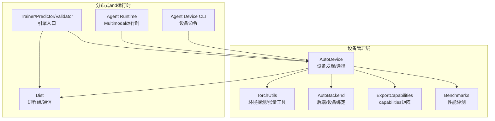
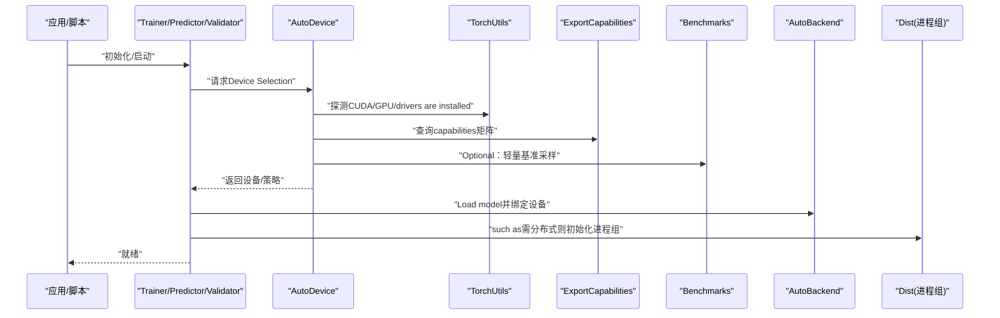
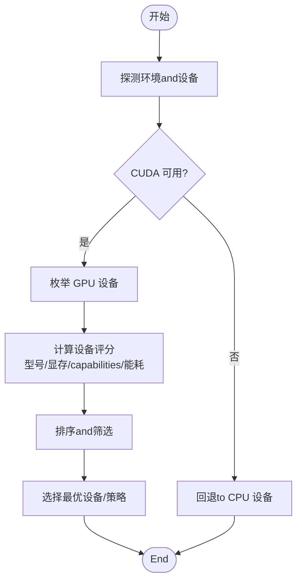
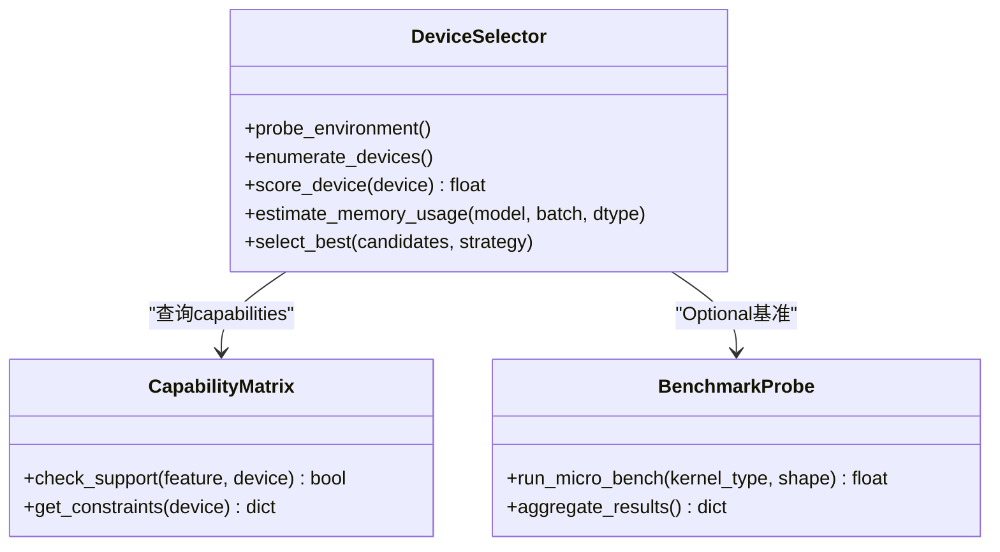
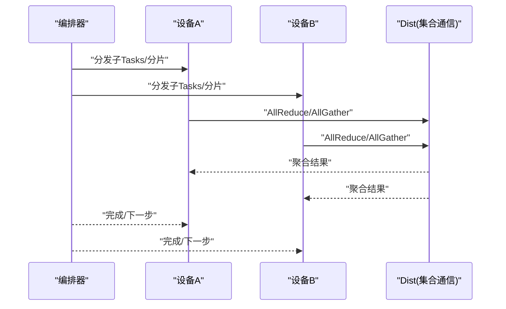
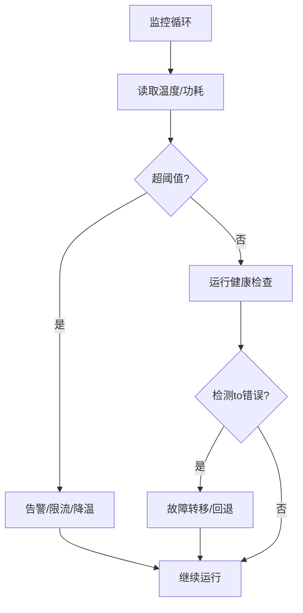
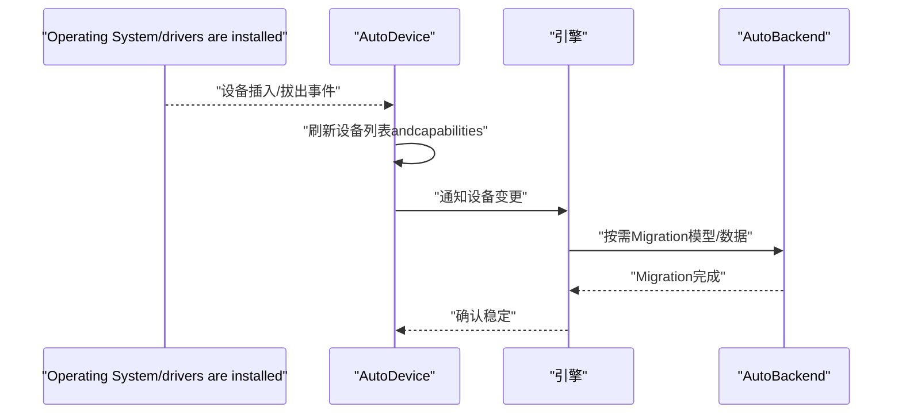
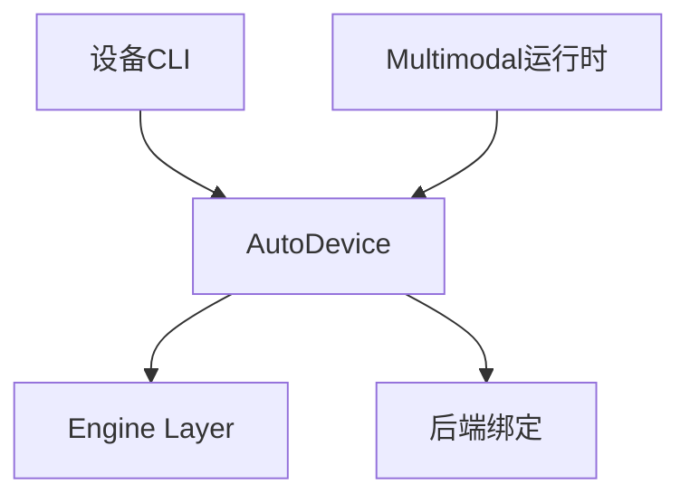
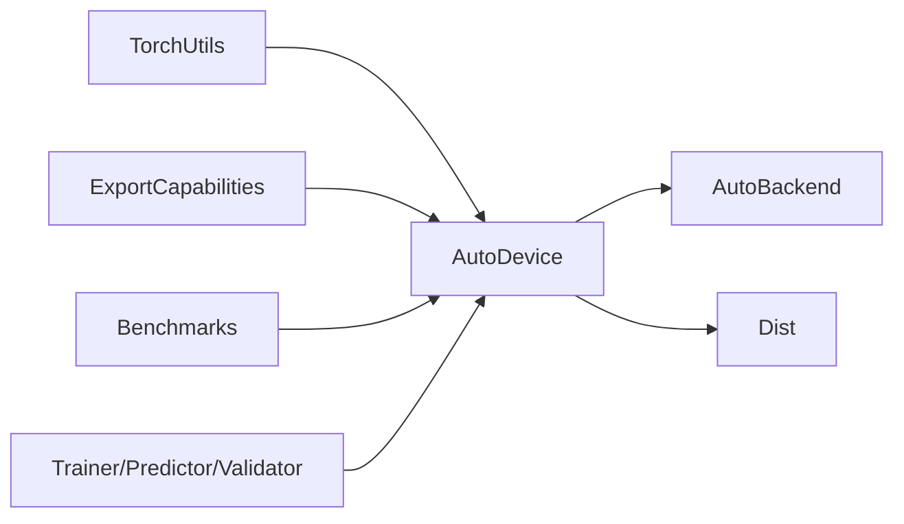

# 智能设备管理

<cite>
**Files Referenced in This Document**
- [autodevice.py](file://ultralytics/utils/autodevice.py)
- [torch_utils.py](file://ultralytics/utils/torch_utils.py)
- [dist.py](file://ultralytics/utils/dist.py)
- [autobackend.py](file://ultralytics/nn/autobackend.py)
- [export_capabilities.py](file://ultralytics/utils/export_capabilities.py)
- [benchmarks.py](file://ultralytics/utils/benchmarks.py)
- [trainer.py](file://ultralytics/engine/trainer.py)
- [predictor.py](file://ultralytics/engine/predictor.py)
- [validator.py](file://ultralytics/engine/validator.py)
- [model.py](file://ultralytics/engine/model.py)
- [runtime.py](file://agent/runtime/multimodal/runtime.py)
- [device.py](file://agent/runtime/cli/device.py)
</cite>

## Table of Contents
1. [Introduction](#Introduction)
2. [Project Structure](#Project Structure)
3. [Core Components](#Core Components)
4. [Architecture Overview](#Architecture Overview)
5. [Detailed Component Analysis](#Detailed Component Analysis)
6. [Dependency Analysis](#Dependency Analysis)
7. [Performance Considerations](#Performance Considerations)
8. [Troubleshooting Guide](#Troubleshooting Guide)
9. [Conclusion](#Conclusion)
10. [Appendix](#Appendix)

## Introduction
本技术Documentation聚焦于 YOLO-Master 的智能设备管理系统，围绕 AutoDevice Modules的设备发现andcapabilities检测、Device Selection算法、多设备协同工作模式、设备状态监控and健康检查、设备切换and热插拔Supporting，Centered onand不同部署环境的配置andOptimization建议进行系统化阐述。目标是帮助读者理解系统such as何自动识别 GPU/CPU、Evaluation CUDA 环境、测量显存容量、while单卡或多卡场景下高效调度Tasks，并while运行期保障稳定性and可恢复性。

## Project Structure
and设备管理相关的核心代码主要分布whileCentered on下位置：
- 设备自动选择and探测：ultralytics/utils/autodevice.py
- 底层 Torch 工具and环境探测：ultralytics/utils/torch_utils.py
- 分布式通信and进程组管理：ultralytics/utils/dist.py
- Inference后端自动适配（含设备绑定）：ultralytics/nn/autobackend.py
- Exportcapabilities矩阵and运行时约束：ultralytics/utils/export_capabilities.py
- 基准测试and吞吐/延迟Evaluation：ultralytics/utils/benchmarks.py
- Training/Validation/Prediction流程中的设备Uses点：engine 层各Modules
- Agent 侧设备 CLI andMultimodal运行时设备协调：agent 子包

Figure Source
- [autodevice.py:1-200](file://ultralytics/utils/autodevice.py#L1-L200)
- [torch_utils.py:1-200](file://ultralytics/utils/torch_utils.py#L1-L200)
- [autobackend.py:1-200](file://ultralytics/nn/autobackend.py#L1-L200)
- [export_capabilities.py:1-200](file://ultralytics/utils/export_capabilities.py#L1-L200)
- [benchmarks.py:1-200](file://ultralytics/utils/benchmarks.py#L1-L200)
- [dist.py:1-200](file://ultralytics/utils/dist.py#L1-L200)
- [trainer.py:1-200](file://ultralytics/engine/trainer.py#L1-L200)
- [predictor.py:1-200](file://ultralytics/engine/predictor.py#L1-L200)
- [validator.py:1-200](file://ultralytics/engine/validator.py#L1-L200)
- [runtime.py:1-200](file://agent/runtime/multimodal/runtime.py#L1-L200)
- [device.py:1-200](file://agent/runtime/cli/device.py#L1-L200)

Section Source
- [autodevice.py:1-200](file://ultralytics/utils/autodevice.py#L1-L200)
- [torch_utils.py:1-200](file://ultralytics/utils/torch_utils.py#L1-L200)
- [autobackend.py:1-200](file://ultralytics/nn/autobackend.py#L1-L200)
- [export_capabilities.py:1-200](file://ultralytics/utils/export_capabilities.py#L1-L200)
- [benchmarks.py:1-200](file://ultralytics/utils/benchmarks.py#L1-L200)
- [dist.py:1-200](file://ultralytics/utils/dist.py#L1-L200)
- [trainer.py:1-200](file://ultralytics/engine/trainer.py#L1-L200)
- [predictor.py:1-200](file://ultralytics/engine/predictor.py#L1-L200)
- [validator.py:1-200](file://ultralytics/engine/validator.py#L1-L200)
- [runtime.py:1-200](file://agent/runtime/multimodal/runtime.py#L1-L200)
- [device.py:1-200](file://agent/runtime/cli/device.py#L1-L200)

## Core Components
- AutoDevice：负责设备发现、capabilities检测、候选设备评分and最终选择；providestargeting上层 API 的便捷接口。
- TorchUtils：Encapsulates PyTorch 环境探测（CUDA 版本、GPU 型号、drivers are installed信息）、张量创建and内存统计etc.基础工具。
- AutoBackend：根据Model Formatand目标平台自动选择执行后端并绑定to具体设备。
- ExportCapabilities：维护Exportcapabilities矩阵，用于判断特定后端/设备组合是否Supporting某类Export或运行特性。
- Benchmarks：provides轻量级基准测试，辅助性能评分and内存占用预估。
- Dist：分布式通信抽象，管理进程组、设备映射and跨设备数据同步。
- Engine Layer（Trainer/Predictor/Validator）：while各自生命周期中CallsDevice Selectionand分配逻辑，确保模型and数据位于合适设备。
- Agent 运行时and CLI：whileMultimodal运行时and命令行工具中集成设备管理capabilities，implementing统一设备视图and操作。

Section Source
- [autodevice.py:1-200](file://ultralytics/utils/autodevice.py#L1-L200)
- [torch_utils.py:1-200](file://ultralytics/utils/torch_utils.py#L1-L200)
- [autobackend.py:1-200](file://ultralytics/nn/autobackend.py#L1-L200)
- [export_capabilities.py:1-200](file://ultralytics/utils/export_capabilities.py#L1-L200)
- [benchmarks.py:1-200](file://ultralytics/utils/benchmarks.py#L1-L200)
- [dist.py:1-200](file://ultralytics/utils/dist.py#L1-L200)
- [trainer.py:1-200](file://ultralytics/engine/trainer.py#L1-L200)
- [predictor.py:1-200](file://ultralytics/engine/predictor.py#L1-L200)
- [validator.py:1-200](file://ultralytics/engine/validator.py#L1-L200)
- [runtime.py:1-200](file://agent/runtime/multimodal/runtime.py#L1-L200)
- [device.py:1-200](file://agent/runtime/cli/device.py#L1-L200)

## Architecture Overview
下图展示了设备管理子系统and上层引擎、后端and分布式层的交互关系。AutoDevice 作for中枢，聚合环境探测、capabilities矩阵and基准评测结果，forEngine Layerprovides“最佳可用设备”决策；AutoBackend 将模型加载and执行绑定to选定设备；Dist 负责多设备间的通信and同步。

Figure Source
- [autodevice.py:1-200](file://ultralytics/utils/autodevice.py#L1-L200)
- [torch_utils.py:1-200](file://ultralytics/utils/torch_utils.py#L1-L200)
- [export_capabilities.py:1-200](file://ultralytics/utils/export_capabilities.py#L1-L200)
- [benchmarks.py:1-200](file://ultralytics/utils/benchmarks.py#L1-L200)
- [autobackend.py:1-200](file://ultralytics/nn/autobackend.py#L1-L200)
- [dist.py:1-200](file://ultralytics/utils/dist.py#L1-L200)
- [trainer.py:1-200](file://ultralytics/engine/trainer.py#L1-L200)
- [predictor.py:1-200](file://ultralytics/engine/predictor.py#L1-L200)
- [validator.py:1-200](file://ultralytics/engine/validator.py#L1-L200)

## Detailed Component Analysis

### AutoDevice 设备发现andcapabilities检测
- 设备发现
  - Via底层工具获取 GPU 数量、型号、PCIe 拓扑、CUDA 版本anddrivers are installed版本，若不可用则回退至 CPU。
  - 对每个候选设备计算可用性标志（such asdrivers are installed/内核匹配、显存阈值）。
- capabilities检测
  - Combiningcapabilities矩阵判断当前后端/设备是否Supporting所需特性（such as半精度、特定算子、Export格式）。
  - 对不Supporting的特性进行降级或Tips。
- 内存容量Evaluation
  - 读取设备显存总量and已用/空闲显存，Combining模型权重and中间激活估算峰值占用，避免 OOM。
- 输出
  - 返回设备列表、优先级排序and推荐策略（such as优先 GPU、按显存大小排序、按功耗/温度加权）。

Figure Source
- [autodevice.py:1-200](file://ultralytics/utils/autodevice.py#L1-L200)
- [torch_utils.py:1-200](file://ultralytics/utils/torch_utils.py#L1-L200)
- [export_capabilities.py:1-200](file://ultralytics/utils/export_capabilities.py#L1-L200)

Section Source
- [autodevice.py:1-200](file://ultralytics/utils/autodevice.py#L1-L200)
- [torch_utils.py:1-200](file://ultralytics/utils/torch_utils.py#L1-L200)
- [export_capabilities.py:1-200](file://ultralytics/utils/export_capabilities.py#L1-L200)

### Device Selection算法：性能评分、内存Predictionand能耗考量
- 性能评分模型
  - 基于 GPU 型号代际、算力Metrics、显存带宽、drivers are installed/库版本兼容性etc.维度加权打分。
  - Optional引入轻量基准（such as小批量矩阵乘或卷积核）Centered on校准实际吞吐。
- 内存占用Prediction
  - 依据模型参数量、数据类型、批大小and输入分辨率估算峰值显存；Combining历史运行记录修正Prediction误差。
- 能耗and温度
  - 若可访问功耗/温度传感器，加入能耗惩罚项，避免while高负载高温环境下长时间运行。
- 决策输出
  - 返回单一设备或设备集合（用于并行），附带策略说明and置信度。

Figure Source
- [autodevice.py:1-200](file://ultralytics/utils/autodevice.py#L1-L200)
- [export_capabilities.py:1-200](file://ultralytics/utils/export_capabilities.py#L1-L200)
- [benchmarks.py:1-200](file://ultralytics/utils/benchmarks.py#L1-L200)

Section Source
- [autodevice.py:1-200](file://ultralytics/utils/autodevice.py#L1-L200)
- [export_capabilities.py:1-200](file://ultralytics/utils/export_capabilities.py#L1-L200)
- [benchmarks.py:1-200](file://ultralytics/utils/benchmarks.py#L1-L200)

### 多设备协同工作模式：数据并行、模型并行and通信Optimization
- 数据并行
  - 将批次切分to多个设备，各设备独立前向/反向，再汇总Gradient或结果。
  - 适用于Trainingand高吞吐Inference。
- 模型并行
  - 将大模型分片放置while不同设备上，减少单卡显存压力，适合超大模型。
- 通信Optimization
  - Uses进程组进行 AllReduce/AllGather etc.集合通信，尽量采用同机 NVLink/PCIe 拓扑感知路由。
  - 控制通信频率and粒度，避免频繁同步导致bottlenecks。

Figure Source
- [dist.py:1-200](file://ultralytics/utils/dist.py#L1-L200)
- [trainer.py:1-200](file://ultralytics/engine/trainer.py#L1-L200)
- [predictor.py:1-200](file://ultralytics/engine/predictor.py#L1-L200)
- [validator.py:1-200](file://ultralytics/engine/validator.py#L1-L200)

Section Source
- [dist.py:1-200](file://ultralytics/utils/dist.py#L1-L200)
- [trainer.py:1-200](file://ultralytics/engine/trainer.py#L1-L200)
- [predictor.py:1-200](file://ultralytics/engine/predictor.py#L1-L200)
- [validator.py:1-200](file://ultralytics/engine/validator.py#L1-L200)

### 设备状态监控and健康检查：温度、错误检测and自动故障转移
- 温度监控
  - 定期采集设备温度，超过阈值触发告警或降频策略。
- 错误检测
  - 捕获 CUDA 错误、OOM、内核崩溃etc.异常，记录上下文and堆栈，便于定位。
- 自动故障转移
  - 当主设备不可用时，自动切换to备用设备或降级to CPU，保证服务连续性。
- 健康检查
  - 周期性自检（such as简单算子执行、显存读写），输出健康状态and诊断信息。

Figure Source
- [autodevice.py:1-200](file://ultralytics/utils/autodevice.py#L1-L200)
- [torch_utils.py:1-200](file://ultralytics/utils/torch_utils.py#L1-L200)

Section Source
- [autodevice.py:1-200](file://ultralytics/utils/autodevice.py#L1-L200)
- [torch_utils.py:1-200](file://ultralytics/utils/torch_utils.py#L1-L200)

### 设备切换and热插拔Supporting机制
- 动态重选
  - while运行期重新扫描设备，更新候选集and评分，必要时触发Migration。
- 热插拔处理
  - 监听设备插入/拔出事件，and时刷新设备表；对正while运行的Tasks进行优雅Migration或暂停。
- 一致性保障
  - while切换过程中保持模型状态and缓存的一致性，避免数据损坏。
- User可见行for
  - providesLoggingand回调，通知上层关于设备变更andMigration进度。

Figure Source
- [autodevice.py:1-200](file://ultralytics/utils/autodevice.py#L1-L200)
- [autobackend.py:1-200](file://ultralytics/nn/autobackend.py#L1-L200)

Section Source
- [autodevice.py:1-200](file://ultralytics/utils/autodevice.py#L1-L200)
- [autobackend.py:1-200](file://ultralytics/nn/autobackend.py#L1-L200)

### Agent 侧设备管理andMultimodal运行时集成
- 设备 CLI
  - provides查看设备信息、选择默认设备、运行诊断etc.命令。
- Multimodal运行时
  - while视频、图像、文本etc.MultimodalTasks中协调设备分配，确保各模态流水线while合适设备上执行。
- 统一设备视图
  - Exposing a consistent设备 API，屏蔽底层差异。

Figure Source
- [device.py:1-200](file://agent/runtime/cli/device.py#L1-L200)
- [runtime.py:1-200](file://agent/runtime/multimodal/runtime.py#L1-L200)
- [autodevice.py:1-200](file://ultralytics/utils/autodevice.py#L1-L200)
- [autobackend.py:1-200](file://ultralytics/nn/autobackend.py#L1-L200)

Section Source
- [device.py:1-200](file://agent/runtime/cli/device.py#L1-L200)
- [runtime.py:1-200](file://agent/runtime/multimodal/runtime.py#L1-L200)
- [autodevice.py:1-200](file://ultralytics/utils/autodevice.py#L1-L200)
- [autobackend.py:1-200](file://ultralytics/nn/autobackend.py#L1-L200)

## Dependency Analysis
- 低耦合设计
  - AutoDevice 依赖 TorchUtils 进行环境探测，依赖 ExportCapabilities 进行capabilities判定，依赖 Benchmarks 进行性能校准，整体职责清晰。
- 关键External Dependencies
  - PyTorch 运行时（CUDA/cuDNN/drivers are installed）、NVIDIA 工具链（nvidia-smi etc.）、分布式通信库（NCCL etc.）。
- Potential Cycles依赖
  - Via分层and接口隔离避免循环；AutoDevice 不直接依赖引擎内部implementing，仅Via约定好的 API 交互。

Figure Source
- [autodevice.py:1-200](file://ultralytics/utils/autodevice.py#L1-L200)
- [torch_utils.py:1-200](file://ultralytics/utils/torch_utils.py#L1-L200)
- [export_capabilities.py:1-200](file://ultralytics/utils/export_capabilities.py#L1-L200)
- [benchmarks.py:1-200](file://ultralytics/utils/benchmarks.py#L1-L200)
- [autobackend.py:1-200](file://ultralytics/nn/autobackend.py#L1-L200)
- [dist.py:1-200](file://ultralytics/utils/dist.py#L1-L200)
- [trainer.py:1-200](file://ultralytics/engine/trainer.py#L1-L200)
- [predictor.py:1-200](file://ultralytics/engine/predictor.py#L1-L200)
- [validator.py:1-200](file://ultralytics/engine/validator.py#L1-L200)

Section Source
- [autodevice.py:1-200](file://ultralytics/utils/autodevice.py#L1-L200)
- [torch_utils.py:1-200](file://ultralytics/utils/torch_utils.py#L1-L200)
- [export_capabilities.py:1-200](file://ultralytics/utils/export_capabilities.py#L1-L200)
- [benchmarks.py:1-200](file://ultralytics/utils/benchmarks.py#L1-L200)
- [autobackend.py:1-200](file://ultralytics/nn/autobackend.py#L1-L200)
- [dist.py:1-200](file://ultralytics/utils/dist.py#L1-L200)
- [trainer.py:1-200](file://ultralytics/engine/trainer.py#L1-L200)
- [predictor.py:1-200](file://ultralytics/engine/predictor.py#L1-L200)
- [validator.py:1-200](file://ultralytics/engine/validator.py#L1-L200)

## Performance Considerations
- 批大小and分辨率调优
  - 根据显存and带宽调整批大小and输入尺寸，平衡吞吐and延迟。
- 数据类型andMixture精度
  - whileSupporting的硬件上启用半精度Centered on降低显存占用and提升吞吐。
- 通信开销控制
  - 合并同步、减少 AllReduce 次数，Set appropriatelyGradient累积步长。
- 预热and缓存
  - 首次运行进行预热，建立算子缓存and内存池，降低冷启动延迟。
- 能耗and温度管理
  - while高负载场景下限制功耗上限，避免过热降频影响稳定性。

[本节for通用指导，无需源码引用]

## Troubleshooting Guide
- 常见问题
  - CUDA 不可用或版本不匹配：检查drivers are installedand CUDA 版本，确认环境变量and路径。
  - 显存不足：降低批大小、分辨率或启用更紧凑的数据类型。
  - 分布式通信失败：检查 NCCL 配置、网络连通性and防火墙规则。
  - 设备热插拔后Tasks中断：确认设备变更回调andMigration逻辑是否正常触发。
- 诊断步骤
  - 打印设备信息andcapabilities矩阵，确认特性Supporting情况。
  - 运行轻量基准，观察吞吐and延迟是否符合预期。
  - 收集错误Loggingand堆栈，定位具体算子或阶段。
- 恢复策略
  - 自动故障转移to备用设备或 CPU。
  - 重启进程组and后端，重建会话and缓存。

Section Source
- [autodevice.py:1-200](file://ultralytics/utils/autodevice.py#L1-L200)
- [torch_utils.py:1-200](file://ultralytics/utils/torch_utils.py#L1-L200)
- [dist.py:1-200](file://ultralytics/utils/dist.py#L1-L200)
- [benchmarks.py:1-200](file://ultralytics/utils/benchmarks.py#L1-L200)

## Conclusion
YOLO-Master 的智能设备管理Centered on AutoDevice for核心，Combining环境探测、capabilities矩阵and基准评测，implementing了从单设备to多设备的自动化选择and协同。Via健康检查、故障转移and热插拔Supporting，系统while复杂部署环境中具备较高的鲁棒性and可维护性。Combined with合理的性能调优策略，可while多种硬件平台上获得稳定高效的InferenceandTraining体验。

[本节for总结，无需源码引用]

## Appendix
- 部署环境配置建议
  - 数据中心 GPU 集群：启用数据并行andMixture精度，Optimization NCCL 参数，开启预热and缓存。
  - 边缘设备（Jetson/嵌入式）：优先选择低功耗模式，降低分辨率and批大小，必要时回退 CPU。
  - 桌面开发环境：灵活切换设备，利用多卡加速实验，注意显存碎片化问题。
- Refer to入口
  - 设备 CLI andMultimodal运行时集成见 agent 子包相关Modules。
  - Engine Layer设备Uses点见 trainer/predictor/validator Modules。

[本节for补充信息，无需源码引用]