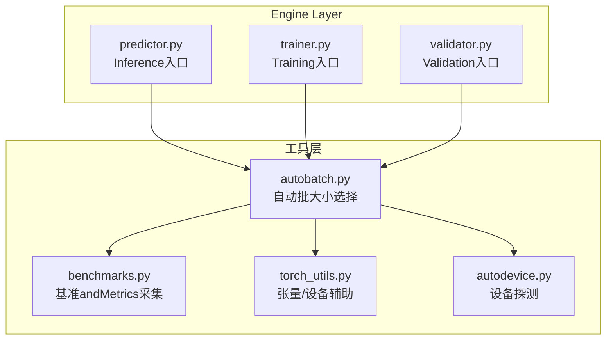
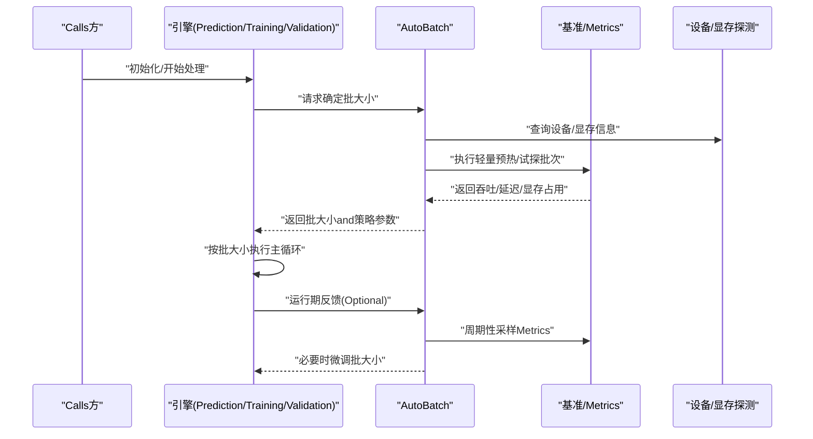
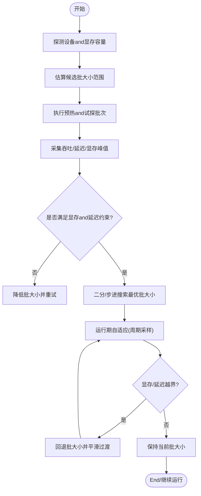
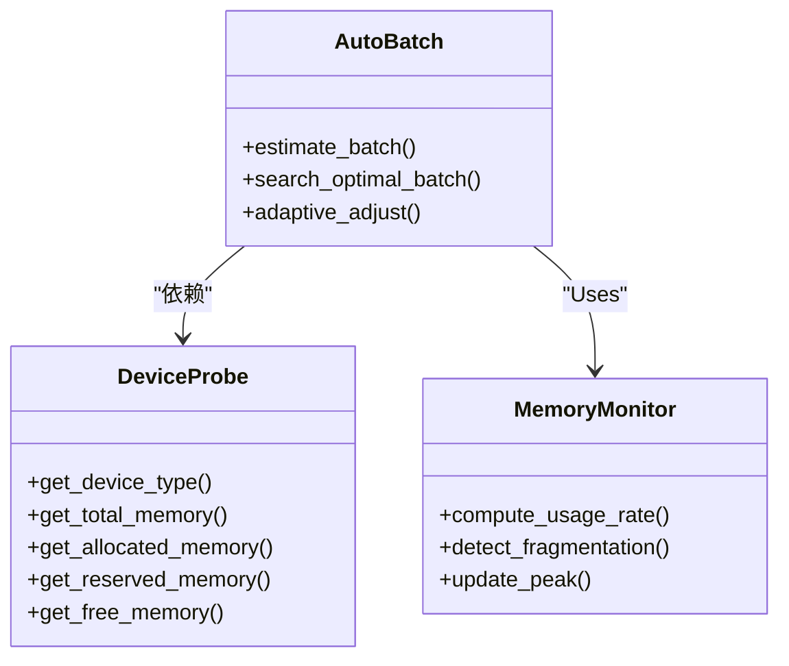
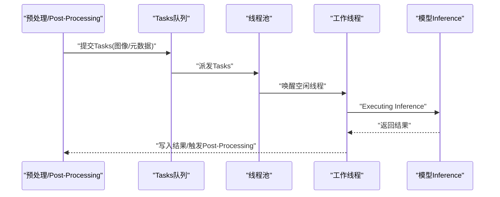
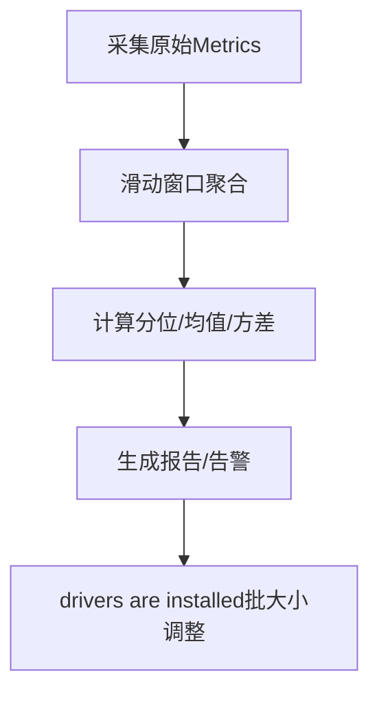
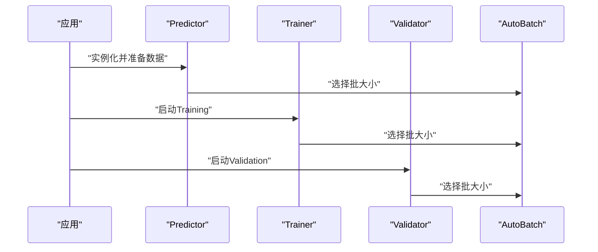
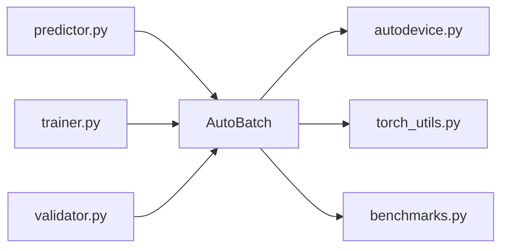

# 自动批处理Optimization

<cite>
**Files Referenced in This Document**
- [autobatch.py](file://ultralytics/utils/autobatch.py)
- [benchmarks.py](file://ultralytics/utils/benchmarks.py)
- [torch_utils.py](file://ultralytics/utils/torch_utils.py)
- [predictor.py](file://ultralytics/engine/predictor.py)
- [trainer.py](file://ultralytics/engine/trainer.py)
- [validator.py](file://ultralytics/engine/validator.py)
- [autodevice.py](file://ultralytics/utils/autodevice.py)
</cite>

## Table of Contents
1. [Introduction](#Introduction)
2. [Project Structure](#Project Structure)
3. [Core Components](#Core Components)
4. [Architecture Overview](#Architecture Overview)
5. [Detailed Component Analysis](#Detailed Component Analysis)
6. [Dependency Analysis](#Dependency Analysis)
7. [性能考量](#性能考量)
8. [Troubleshooting Guide](#Troubleshooting Guide)
9. [Conclusion](#Conclusion)
10. [Appendix](#Appendix)

## Introduction
本技术Documentation聚焦于 YOLO-Master 的自动批处理系统，围绕 AutoBatch Modules的动态批大小调整机制unfold，涵盖内存监控算法、批大小计算策略and吞吐Optimization目标；深入解析 GPU 显存占用分析逻辑（显存Uses率监控、碎片检测and动态阈值）；阐述 CPU 多线程批处理的implementing（线程池管理、Tasks队列调度andLoad Balancing）；并系统化说明批处理性能Metrics收集and分析capabilities（延迟统计、吞吐量and资源利用率）。最后provides不同硬件配置下的Optimization建议and最佳实践，Centered onand异常处理and恢复机制的implementing细节。

## Project Structure
自动批处理相关代码主要位于工具层andEngine Layer的交互处：
- 自动批大小选择and估算：utils/autobatch.py
- 基准测试and吞吐/延迟采集：utils/benchmarks.py
- 设备and显存探测：utils/autodevice.py、utils/torch_utils.py
- Inference/Training/Validation流程对自动批大小的Calls点：engine/predictor.py、engine/trainer.py、engine/validator.py

Figure Source
- [autobatch.py](file://ultralytics/utils/autobatch.py)
- [benchmarks.py](file://ultralytics/utils/benchmarks.py)
- [torch_utils.py](file://ultralytics/utils/torch_utils.py)
- [autodevice.py](file://ultralytics/utils/autodedevice.py)
- [predictor.py](file://ultralytics/engine/predictor.py)
- [trainer.py](file://ultralytics/engine/trainer.py)
- [validator.py](file://ultralytics/engine/validator.py)

Section Source
- [autobatch.py](file://ultralytics/utils/autobatch.py)
- [benchmarks.py](file://ultralytics/utils/benchmarks.py)
- [torch_utils.py](file://ultralytics/utils/torch_utils.py)
- [autodevice.py](file://ultralytics/utils/autodevice.py)
- [predictor.py](file://ultralytics/engine/predictor.py)
- [trainer.py](file://ultralytics/engine/trainer.py)
- [validator.py](file://ultralytics/engine/validator.py)

## Core Components
- AutoBatch 自动批大小选择器
  - 负责while给定模型、输入形状and设备条件下，估算最大可行批大小，并while运行期根据显存and吞吐反馈进行动态调整。
- 基准andMetrics采集器
  - provides吞吐、延迟、GPU/CPU 利用率etc.Metrics的采样and聚合方法，供 AutoBatch 决策Refer to。
- 设备and显存探测
  - 抽象设备类型、显存容量and当前占用，for批大小估算and安全边界provides依据。
- 引擎集成点
  - Inference/Training/Validation入口while启动阶段或运行期触发自动批大小选择and后续执行。

Section Source
- [autobatch.py](file://ultralytics/utils/autobatch.py)
- [benchmarks.py](file://ultralytics/utils/benchmarks.py)
- [torch_utils.py](file://ultralytics/utils/torch_utils.py)
- [autodevice.py](file://ultralytics/utils/autodevice.py)
- [predictor.py](file://ultralytics/engine/predictor.py)
- [trainer.py](file://ultralytics/engine/trainer.py)
- [validator.py](file://ultralytics/engine/validator.py)

## Architecture Overview
下图展示了自动批处理系统whileInference/Training/Validation流程中的位置and数据流：

Figure Source
- [autobatch.py](file://ultralytics/utils/autobatch.py)
- [benchmarks.py](file://ultralytics/utils/benchmarks.py)
- [torch_utils.py](file://ultralytics/utils/torch_utils.py)
- [autodevice.py](file://ultralytics/utils/autodevice.py)
- [predictor.py](file://ultralytics/engine/predictor.py)
- [trainer.py](file://ultralytics/engine/trainer.py)
- [validator.py](file://ultralytics/engine/validator.py)

## Detailed Component Analysis

### AutoBatch 动态批大小调整机制
- 设计目标
  - while满足显存安全边界的前提下，最大化吞吐；同时兼顾端to端延迟上限，避免过度放大批大小导致时延抖动。
- 关键流程
  - 初始估算：基于模型规模、输入分辨率and设备显存容量，给出候选批大小区间。
  - 试探执行：Centered on较小批次进行预热and多次计时，Evaluation吞吐and延迟，并记录显存峰值。
  - 收敛策略：采用二分/步进式搜索，Combining滑动窗口平滑Metrics，逐步逼近最优批大小。
  - 运行期自适应：while长Tasks中周期性采样，若检测to显存增长或延迟超标，则回退批大小；反之可尝试提升。
- 内存监控算法
  - 显存Uses率监控：Via设备接口获取当前已分配and保留显存，计算Uses率and峰值。
  - 内存碎片检测：对比“已分配”and“可用”显存的差值趋势，识别碎片化导致的不可用空间。
  - 动态调整阈值：设置显存Uses率上限and碎片容忍度，当超过阈值时触发降批；低于下限时允许升批。
- 批大小计算策略
  - 目标函数：while约束（显存上限、延迟上限）下最大化吞吐。
  - 搜索方法：优先采用二分搜索快速定位上界，辅Centered on小步长精细调优；引入迟滞and指数平滑减少震荡。
  - 多目标权衡：吞吐优先但受延迟上限约束；while低延迟场景下更保守地控制批大小。
- 吞吐Optimization目标
  - 短期：降低 P95/P99 延迟，稳定吞吐。
  - 长期：while长时间运行中维持稳定的资源利用曲线，避免 OOM and频繁回退。

Figure Source
- [autobatch.py](file://ultralytics/utils/autobatch.py)
- [benchmarks.py](file://ultralytics/utils/benchmarks.py)
- [torch_utils.py](file://ultralytics/utils/torch_utils.py)
- [autodevice.py](file://ultralytics/utils/autodevice.py)

Section Source
- [autobatch.py](file://ultralytics/utils/autobatch.py)
- [benchmarks.py](file://ultralytics/utils/benchmarks.py)
- [torch_utils.py](file://ultralytics/utils/torch_utils.py)
- [autodevice.py](file://ultralytics/utils/autodevice.py)

### GPU 内存占用分析逻辑
- 显存Uses率监控
  - 读取当前已分配and保留显存，计算Uses率and峰值，用于判断是否接近安全边界。
- 内存碎片检测
  - Via比较“已分配”和“可用”显存的差异变化，识别碎片化导致的可用空间不足。
- 动态调整阈值
  - 显存Uses率上限：超过即触发降批。
  - 碎片容忍度：当碎片占比过高时，即使总体Uses率不高也可能提前降批。
  - 迟滞带：避免while阈值附近频繁上下波动。

Figure Source
- [autodevice.py](file://ultralytics/utils/autodevice.py)
- [torch_utils.py](file://ultralytics/utils/torch_utils.py)
- [autobatch.py](file://ultralytics/utils/autobatch.py)

Section Source
- [autodevice.py](file://ultralytics/utils/autodevice.py)
- [torch_utils.py](file://ultralytics/utils/torch_utils.py)
- [autobatch.py](file://ultralytics/utils/autobatch.py)

### CPU 多线程批处理implementing
- 线程池管理
  - 维护固定数量的工作线程，复用上下文，减少创建销毁开销。
  - Supporting动态扩缩容（while负载高时增加线程数，空闲时回收），但需考虑 GIL and I/O Mixture场景。
- Tasks队列调度
  - 生产者-消费者模式：预处理/Post-Processing作for生产者，模型Inference作for消费者。
  - 优先级队列：对低延迟敏感的Tasks优先处理。
- Load Balancing策略
  - 基于队列长度and线程忙闲状态进行分发，避免热点线程。
  - 针对图像尺寸差异较大的情况，采用分桶策略Centered on减少内存抖动。

Figure Source
- [autobatch.py](file://ultralytics/utils/autobatch.py)
- [benchmarks.py](file://ultralytics/utils/benchmarks.py)

Section Source
- [autobatch.py](file://ultralytics/utils/autobatch.py)
- [benchmarks.py](file://ultralytics/utils/benchmarks.py)

### 批处理性能Metrics收集and分析
- 延迟统计
  - 端to端延迟、每样本平均延迟、P50/P95/P99 分位延迟。
- 吞吐量
  - 每秒处理样本数、每秒像素/特征量（视Tasks而定）。
- 资源利用率
  - GPU 显存Uses率、峰值；CPU 利用率；I/O etc.待时间占比。
- Metrics采集方式
  - 高频采样and滑动窗口聚合，避免瞬时噪声影响决策。
  - 异步上报and本地缓存，降低对主路径的影响。

Figure Source
- [benchmarks.py](file://ultralytics/utils/benchmarks.py)
- [autobatch.py](file://ultralytics/utils/autobatch.py)

Section Source
- [benchmarks.py](file://ultralytics/utils/benchmarks.py)
- [autobatch.py](file://ultralytics/utils/autobatch.py)

### 引擎集成点andCalls时序
- Inference入口
  - while初始化阶段Calls自动批大小选择，随后进入Inference主循环。
- Training入口
  - while构建 DataLoader 前后进行批大小估算，确保显存安全and吞吐平衡。
- Validation入口
  - 类似Inference，但whileValidation集上可能更注重稳定性and一致性。

Figure Source
- [predictor.py](file://ultralytics/engine/predictor.py)
- [trainer.py](file://ultralytics/engine/trainer.py)
- [validator.py](file://ultralytics/engine/validator.py)
- [autobatch.py](file://ultralytics/utils/autobatch.py)

Section Source
- [predictor.py](file://ultralytics/engine/predictor.py)
- [trainer.py](file://ultralytics/engine/trainer.py)
- [validator.py](file://ultralytics/engine/validator.py)
- [autobatch.py](file://ultralytics/utils/autobatch.py)

## Dependency Analysis
- 组件耦合
  - AutoBatch 强依赖设备and显存探测、基准采集；弱耦合于Engine Layer，仅Via接口获取/更新批大小。
- External Dependencies
  - Deep Learning Framework的设备 API、CUDA/ROCm 运行时、系统进程监控库（such as psutil，若Uses）。
- Potential Cycles依赖
  - 应避免 AutoBatch 反向依赖引擎具体implementing，防止耦合加深。
- 接口契约
  - 设备探测接口需provides一致的显存and设备信息；基准采集接口需保证Metrics的可比性and稳定性。

Figure Source
- [autobatch.py](file://ultralytics/utils/autobatch.py)
- [autodevice.py](file://ultralytics/utils/autodevice.py)
- [torch_utils.py](file://ultralytics/utils/torch_utils.py)
- [benchmarks.py](file://ultralytics/utils/benchmarks.py)
- [predictor.py](file://ultralytics/engine/predictor.py)
- [trainer.py](file://ultralytics/engine/trainer.py)
- [validator.py](file://ultralytics/engine/validator.py)

Section Source
- [autobatch.py](file://ultralytics/utils/autobatch.py)
- [autodevice.py](file://ultralytics/utils/autodevice.py)
- [torch_utils.py](file://ultralytics/utils/torch_utils.py)
- [benchmarks.py](file://ultralytics/utils/benchmarks.py)
- [predictor.py](file://ultralytics/engine/predictor.py)
- [trainer.py](file://ultralytics/engine/trainer.py)
- [validator.py](file://ultralytics/engine/validator.py)

## 性能考量
- 硬件配置建议
  - 单卡大显存（such as 24GB+）：优先提高批大小Centered on提升吞吐，注意延迟上限。
  - 多卡环境：Combining数据并行and自动批大小，避免跨卡通信成forbottlenecks。
  - 边缘设备（Jetson/嵌入式）：限制批大小and模型尺寸，优先保证低延迟and稳定性。
- 超参and阈值
  - 显存Uses率上限建议设置while 80%-90% 之间，留出余量应对突发峰值。
  - 延迟上限应Combining业务 SLA 设定，避免追求吞吐而牺牲实时性。
- 数据and模型特性
  - 高分辨率/复杂模型：更保守的批大小and更强的碎片检测。
  - 小模型/低分辨率：可适当放宽批大小，关注 CPU 预处理bottlenecks。
- 运行期Optimization
  - 预热阶段充分热身，减少冷启动抖动。
  - Uses指数平滑and迟滞带，避免批大小频繁震荡。

[This section provides general guidance and does not directly analyze specific files]

## Troubleshooting Guide
- 常见问题
  - OOM：检查显存Uses率阈值and碎片检测是否过于宽松；适当降低批大小或启用显存清理。
  - 吞吐不稳定：观察延迟分布and队列积压，调整线程池大小andTasks优先级。
  - 延迟飙升：确认是否存while I/O 阻塞或 CPU 预处理bottlenecks，必要时拆分流水线。
- 诊断步骤
  - 查看Metrics报告：重点关注 P95/P99 延迟and显存峰值。
  - 回放最近一次批大小调整：确认触发条件and回退幅度。
  - 隔离问题：关闭自适应，固定批大小复现问题。
- 恢复机制
  - 自动回退：当显存或延迟越界时，按步长回退批大小并平滑过渡。
  - 健康检查：周期性自检，若连续失败则降级to保守批大小并告警。
  - 持久化策略：保存最近稳定批大小，重启后快速恢复。

Section Source
- [autobatch.py](file://ultralytics/utils/autobatch.py)
- [benchmarks.py](file://ultralytics/utils/benchmarks.py)

## Conclusion
YOLO-Master 的自动批处理系统Via设备and显存探测、基准采集and运行期自适应，implementing了while显存安全边界内最大化吞吐的目标。其核心while于稳健的内存监控算法、合理的批大小搜索策略and完善的Metrics采集体系。while不同硬件环境下，Combining业务 SLA Set appropriately阈值and策略，可获得稳定且高效的批处理性能。

[本节for总结，不直接分析具体文件]

## Appendix
- 术语
  - 批大小：单次Inference/Training/Validation处理的样本数量。
  - 显存碎片：已分配显存中无法被大块请求利用的分散小块。
  - 迟滞带：for避免频繁切换设置的阈值缓冲区间。
- Refer to路径
  - 自动批大小选择：[autobatch.py](file://ultralytics/utils/autobatch.py)
  - 基准andMetrics采集：[benchmarks.py](file://ultralytics/utils/benchmarks.py)
  - 设备and显存探测：[autodevice.py](file://ultralytics/utils/autodevice.py)、[torch_utils.py](file://ultralytics/utils/torch_utils.py)
  - 引擎集成点：[predictor.py](file://ultralytics/engine/predictor.py)、[trainer.py](file://ultralytics/engine/trainer.py)、[validator.py](file://ultralytics/engine/validator.py)