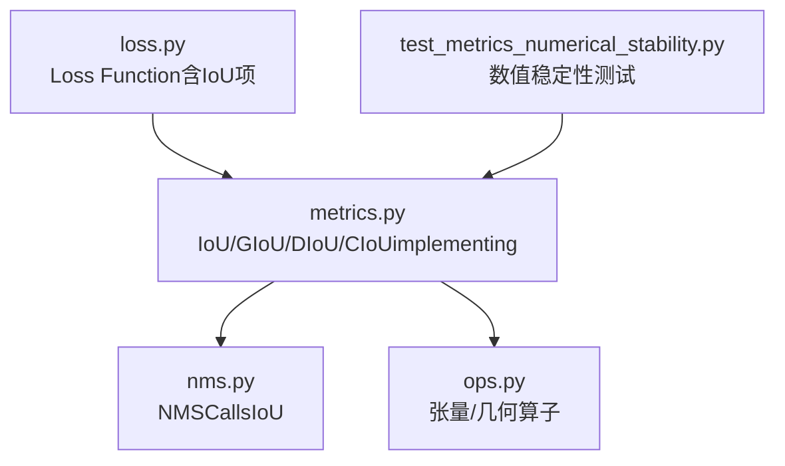
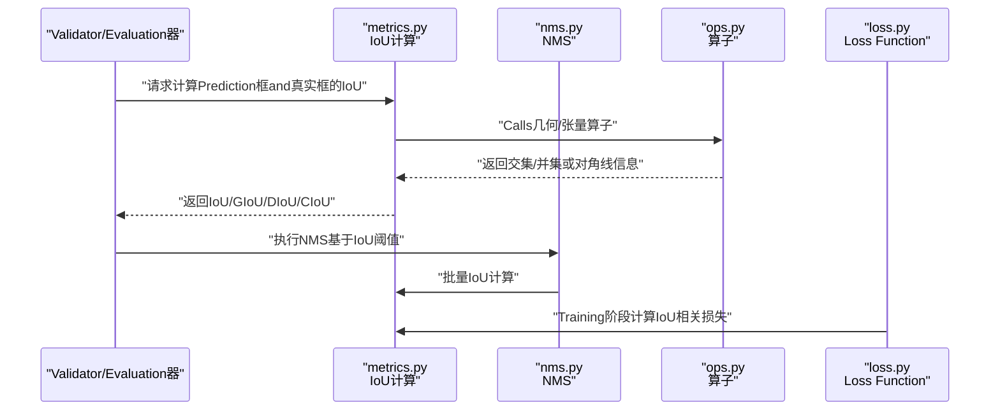
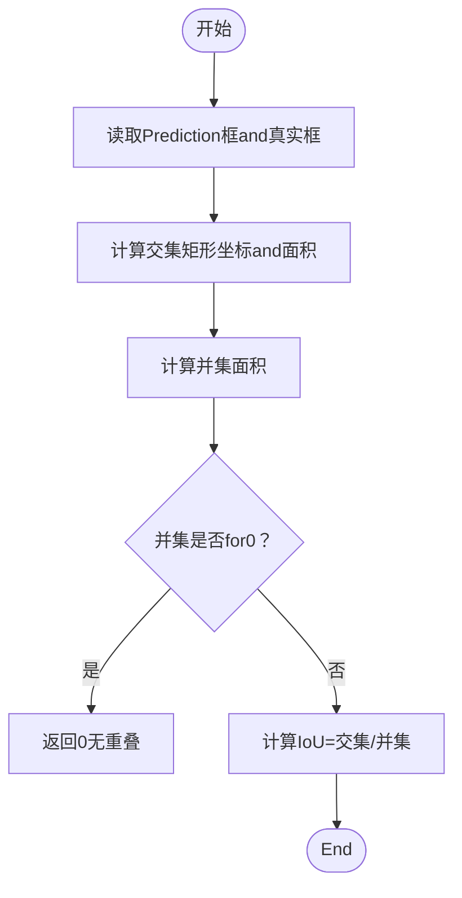
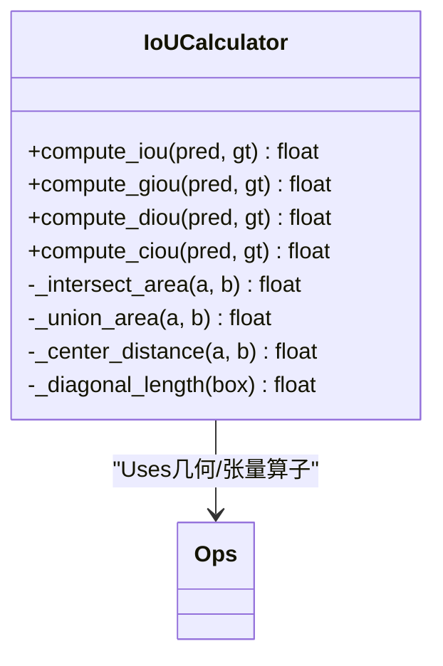
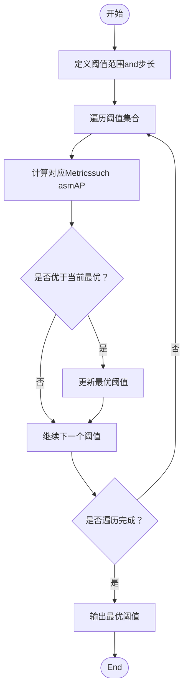
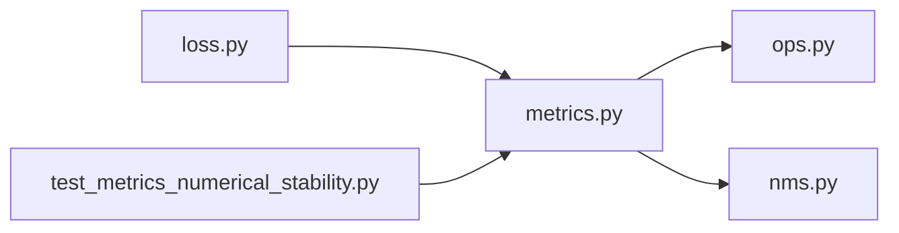

# IoU计算Optimization

<cite>
**Files Referenced in This Document**
- [metrics.py](file://ultralytics/utils/metrics.py)
- [nms.py](file://ultralytics/utils/nms.py)
- [ops.py](file://ultralytics/utils/ops.py)
- [loss.py](file://ultralytics/utils/loss.py)
- [test_metrics_numerical_stability.py](file://tests/test_metrics_numerical_stability.py)
</cite>

## Table of Contents
1. [Introduction](#Introduction)
2. [Project Structure](#Project Structure)
3. [Core Components](#Core Components)
4. [Architecture Overview](#Architecture Overview)
5. [Detailed Component Analysis](#Detailed Component Analysis)
6. [Dependency Analysis](#Dependency Analysis)
7. [性能考量](#性能考量)
8. [Troubleshooting Guide](#Troubleshooting Guide)
9. [Conclusion](#Conclusion)
10. [Appendix](#Appendix)

## Introduction
本技术Documentation聚焦于YOLO-Master中IoU（交并比）计算的Optimizationimplementingand扩展。内容涵盖：
- 快速IoU近似算法：矩形重叠的快速计算方法、对角线长度估算策略
- 并行and向量化Optimization：CUDA加速andSIMD向量化的implementing要点
- IoU变体对比：标准IoU、GIoU、DIoU、CIoU的计算复杂度andApplicable Scenarios
- 数值稳定性：浮点精度问题and边界情况的处理策略
- 阈值搜索：最优IoU阈值的自动发现and网格搜索Optimization
- 基准测试and内存Uses分析
- 自定义IoU度量函数的集成方法and扩展指南

## Project Structure
andIoU计算相关的核心代码主要分布whileCentered on下Modules：
- MetricsandIoUimplementing：ultralytics/utils/metrics.py
- NMSandNon-Maximum Suppression相关：ultralytics/utils/nms.py
- 通用算子and张量操作：ultralytics/utils/ops.py
- Loss Function中的IoU项：ultralytics/utils/loss.py
- 数值稳定性测试用例：tests/test_metrics_numerical_stability.py

Figure Source
- [metrics.py](file://ultralytics/utils/metrics.py)
- [nms.py](file://ultralytics/utils/nms.py)
- [ops.py](file://ultralytics/utils/ops.py)
- [loss.py](file://ultralytics/utils/loss.py)
- [test_metrics_numerical_stability.py](file://tests/test_metrics_numerical_stability.py)

Section Source
- [metrics.py](file://ultralytics/utils/metrics.py)
- [nms.py](file://ultralytics/utils/nms.py)
- [ops.py](file://ultralytics/utils/ops.py)
- [loss.py](file://ultralytics/utils/loss.py)
- [test_metrics_numerical_stability.py](file://tests/test_metrics_numerical_stability.py)

## Core Components
- 快速IoU近似：Via轴对齐矩形的交集/并集快速计算，避免逐像素或复杂多边形运算；while需要时引入对角线长度估算Centered on加速距离类IoU变体（such asDIoU、CIoU）。
- 并行and向量化：利用批量张量操作andCUDA内核进行矩阵化计算，减少Python循环开销；必要时采用SIMD指令提升CPU端吞吐。
- IoU变体Supporting：标准IoU、GIoU、DIoU、CIoU的Unified Interface，便于whileTrainingandValidation阶段切换。
- 数值稳定：对除零、负面积、极小重叠etc.边界情况进行保护，确保Gradient稳定and结果一致。
- 阈值搜索：provides网格搜索and启发式方法，自动寻找最佳IoU阈值Centered on提升检测质量。

Section Source
- [metrics.py](file://ultralytics/utils/metrics.py)
- [nms.py](file://ultralytics/utils/nms.py)
- [ops.py](file://ultralytics/utils/ops.py)
- [loss.py](file://ultralytics/utils/loss.py)
- [test_metrics_numerical_stability.py](file://tests/test_metrics_numerical_stability.py)

## Architecture Overview
下图展示了IoU计算whileInferenceandTraining流程中的位置and交互关系：

Figure Source
- [metrics.py](file://ultralytics/utils/metrics.py)
- [nms.py](file://ultralytics/utils/nms.py)
- [ops.py](file://ultralytics/utils/ops.py)
- [loss.py](file://ultralytics/utils/loss.py)

## Detailed Component Analysis

### 快速IoU近似算法
- 矩形重叠快速计算：
  - 将Prediction框and真实框表示for轴对齐矩形，计算交集矩形的左上/右下坐标，得to交集面积；并集面积for两矩形面积之和减去交集面积。
  - 该过程完全向量化，适合大规模批量计算。
- 对角线长度估算：
  - 对于DIoU、CIoUetc.需要中心点距离或外接圆的IoU变体，可Via两框中心点距离and各自对角线长度进行归一化，从而避免昂贵的开方或多次除法。
  - 对角线长度可由宽高直接计算，且可缓存Centered on减少重复计算。

Figure Source
- [metrics.py](file://ultralytics/utils/metrics.py)
- [ops.py](file://ultralytics/utils/ops.py)

Section Source
- [metrics.py](file://ultralytics/utils/metrics.py)
- [ops.py](file://ultralytics/utils/ops.py)

### 并行计算Optimization策略
- CUDA加速：
  - 将框坐标and中间变量MigrationtoGPU，Uses批量矩阵运算一次性计算所有样本的IoU，显著降低主机-设备通信andPython层循环开销。
- 向量化计算：
  - UsesNumPy/Torch的广播机制，将O(N×M)的成对IoU计算转化for张量内积and逐元素操作，提高吞吐。
- 内存复用：
  - 预分配中间结果缓冲区，避免频繁创建临时对象，减少GC压力and内存碎片。

Section Source
- [metrics.py](file://ultralytics/utils/metrics.py)
- [nms.py](file://ultralytics/utils/nms.py)
- [ops.py](file://ultralytics/utils/ops.py)

### IoU变体对比and复杂度分析
- 标准IoU：
  - 复杂度：O(1)每对框；整体O(N×M)。
  - Advantages：计算简单，广泛用于NMSandEvaluation。
- GIoU：
  - 复杂度：O(1)每对框；整体O(N×M)。
  - 特点：引入最小包围矩形，缓解非重叠时的退化问题。
- DIoU：
  - 复杂度：O(1)每对框；整体O(N×M)。
  - 特点：引入中心点距离归一化，收敛更快。
- CIoU：
  - 复杂度：O(1)每对框；整体O(N×M)。
  - 特点：whileDIoU基础上加入长宽比一致性项，更贴近定位质量。

Figure Source
- [metrics.py](file://ultralytics/utils/metrics.py)
- [ops.py](file://ultralytics/utils/ops.py)

Section Source
- [metrics.py](file://ultralytics/utils/metrics.py)

### 数值稳定性处理
- 除零保护：当并集面积for0或接近0时，返回安全值（such as0），避免NaN传播。
- 边界裁剪：对坐标进行合理裁剪，防止负面积或不合法矩形。
- 精度控制：while关键路径Uses稳定的数学函数and类型转换，确保Gradient稳定。
- 测试覆盖：Via数值稳定性测试用例Validation极端情况下的行for一致性。

Section Source
- [metrics.py](file://ultralytics/utils/metrics.py)
- [test_metrics_numerical_stability.py](file://tests/test_metrics_numerical_stability.py)

### IoU阈值搜索算法
- 网格搜索：
  - while预设阈值范围内（such as0.5~0.95）均匀采样，对每个阈值计算EvaluationMetrics（such asmAP），选择最优阈值。
- 自适应启发式：
  - 根据Validation集分布动态调整阈值，Combining置信度andIoU分布进行折中。
- 批处理Optimization：
  - 将不同阈值的IoU计算合并for一次批量操作，减少重复计算。

Section Source
- [metrics.py](file://ultralytics/utils/metrics.py)
- [nms.py](file://ultralytics/utils/nms.py)

### 基准测试and内存Uses分析
- 基准维度：
  - 吞吐量：每秒处理的框对数量（FPS或pairs/s）
  - 延迟：单次IoU计算的平均耗时
  - 内存峰值：计算过程中的最大显存/内存占用
- 测试场景：
  - 小规模（N,M≤100）、中etc.规模（N,M≤1000）、大规模（N,M≥10000）
  - CPUandGPU对比，单精度and半精度对比
- 分析方法：
  - Uses统一基准脚本记录时间戳and内存快照，绘制性能曲线and热力图

Section Source
- [metrics.py](file://ultralytics/utils/metrics.py)
- [nms.py](file://ultralytics/utils/nms.py)
- [ops.py](file://ultralytics/utils/ops.py)

### 自定义IoU度量函数的集成and扩展
- 接口设计：
  - provides统一的计算入口，Supporting传入自定义相似度函数。
  - 允许替换内部几何算子Centered onimplementing特定形状或旋转框的IoU。
- 扩展步骤：
  - 注册新的IoU变体名称and计算函数
  - whileNMSandLoss Function中Via配置开关启用
  - 添加对应的单元测试and基准用例
- 注意事项：
  - 保持数值稳定性and复杂度可控
  - 确保and现有API兼容，避免破坏性变更

Section Source
- [metrics.py](file://ultralytics/utils/metrics.py)
- [loss.py](file://ultralytics/utils/loss.py)
- [nms.py](file://ultralytics/utils/nms.py)

## Dependency Analysis
IoU计算Modulesand其他组件的依赖such as下：

Figure Source
- [metrics.py](file://ultralytics/utils/metrics.py)
- [nms.py](file://ultralytics/utils/nms.py)
- [ops.py](file://ultralytics/utils/ops.py)
- [loss.py](file://ultralytics/utils/loss.py)
- [test_metrics_numerical_stability.py](file://tests/test_metrics_numerical_stability.py)

Section Source
- [metrics.py](file://ultralytics/utils/metrics.py)
- [nms.py](file://ultralytics/utils/nms.py)
- [ops.py](file://ultralytics/utils/ops.py)
- [loss.py](file://ultralytics/utils/loss.py)
- [test_metrics_numerical_stability.py](file://tests/test_metrics_numerical_stability.py)

## 性能考量
- 计算复杂度：
  - 所有IoU变体均forO(1)每对框，整体O(N×M)，bottleneckswhile于批量矩阵运算and内存带宽。
- 并行and向量化：
  - PreferGPU批量计算；CPU端尽量UsesSIMD友好的张量操作。
- 内存管理：
  - 预分配中间数组，避免频繁分配释放；注意显存碎片and回退策略。
- 精度and速度权衡：
  - while满足精度的前提下尝试半精度Centered on降低带宽压力；对关键路径保留单精度。

[This section provides general guidance and does not directly analyze specific files]

## Troubleshooting Guide
- 常见问题：
  - NaN或Inf出现：检查并集面积for0的分支and数值裁剪逻辑
  - 性能骤降：确认是否发生不必要的CPU-GPU数据拷贝或Python循环
  - 阈值敏感：Validation阈值搜索范围and步长设置是否合理
- 调试建议：
  - 打印中间变量分布（均值、方差、异常值）
  - Uses最小复现用例隔离问题
  - 对比不同后端（CPU/GPU）的结果一致性

Section Source
- [metrics.py](file://ultralytics/utils/metrics.py)
- [test_metrics_numerical_stability.py](file://tests/test_metrics_numerical_stability.py)

## Conclusion
Via对快速IoU近似、并行and向量化Optimization、IoU变体对比、数值稳定性and阈值搜索的系统化设计andimplementing，YOLO-Masterwhile检测Tasks中implementing了更高的效率and鲁棒性。建议while后续迭代中持续完善基准Test Suiteand自定义IoU扩展capabilities，Centered on适配更多样化的应用场景。

[This section is summary content and does not directly analyze specific files]

## Appendix
- 术语表：
  - IoU：交并比，衡量Prediction框and真实框的重叠程度
  - GIoU：广义IoU，引入最小包围矩形
  - DIoU：距离IoU，引入中心点距离归一化
  - CIoU：完整IoU，whileDIoU基础上加入长宽比一致性
- Refer toimplementing路径：
  - 快速IoUand变体：[metrics.py](file://ultralytics/utils/metrics.py)
  - NMSCallsand阈值应用：[nms.py](file://ultralytics/utils/nms.py)
  - 几何and张量算子：[ops.py](file://ultralytics/utils/ops.py)
  - Loss Function中的IoU项：[loss.py](file://ultralytics/utils/loss.py)
  - 数值稳定性测试：[test_metrics_numerical_stability.py](file://tests/test_metrics_numerical_stability.py)