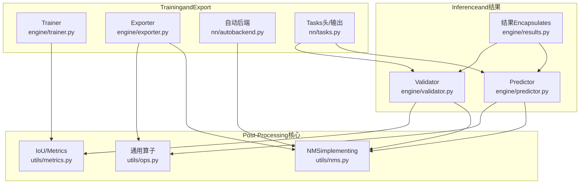
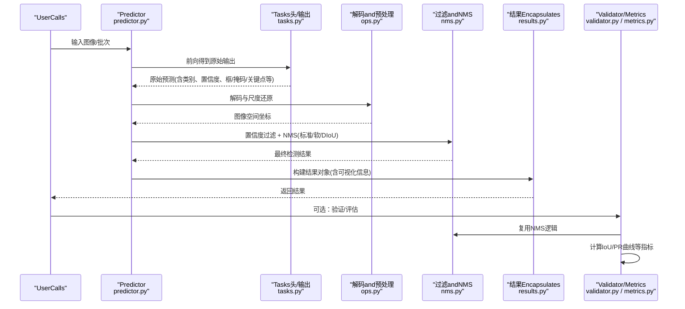
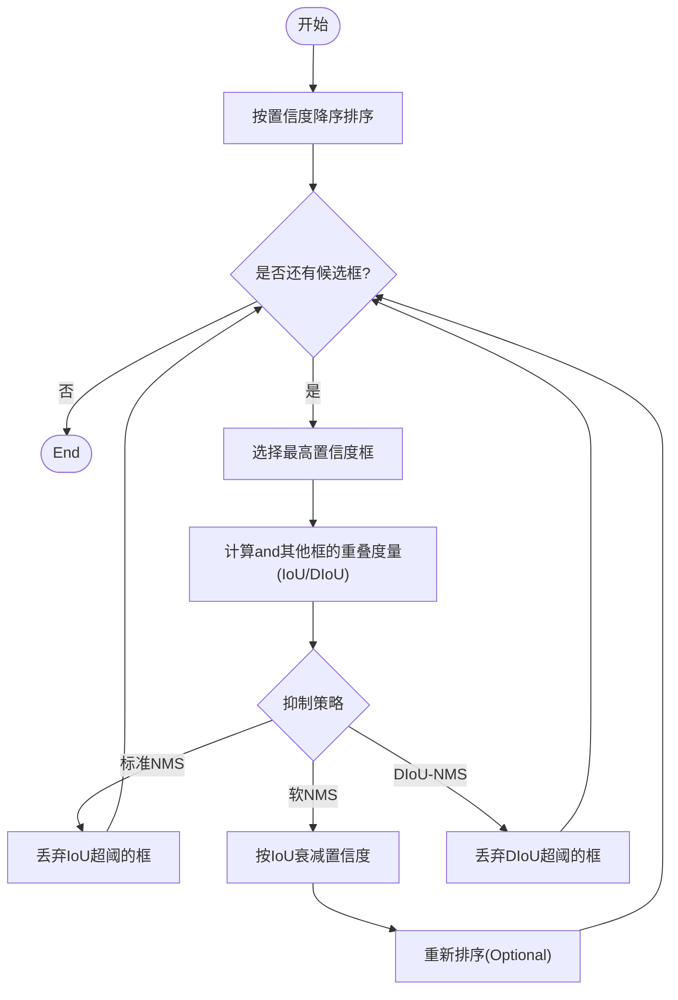
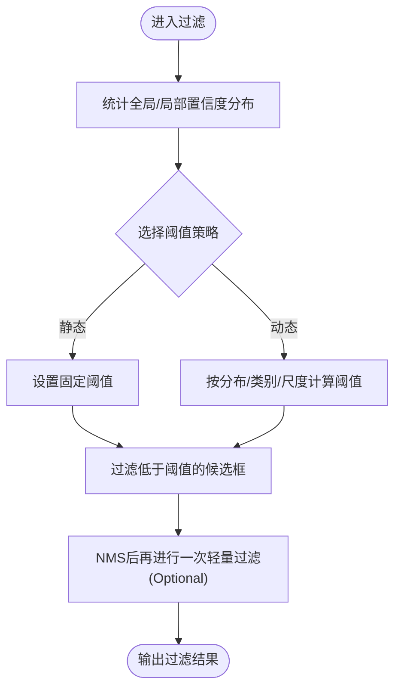
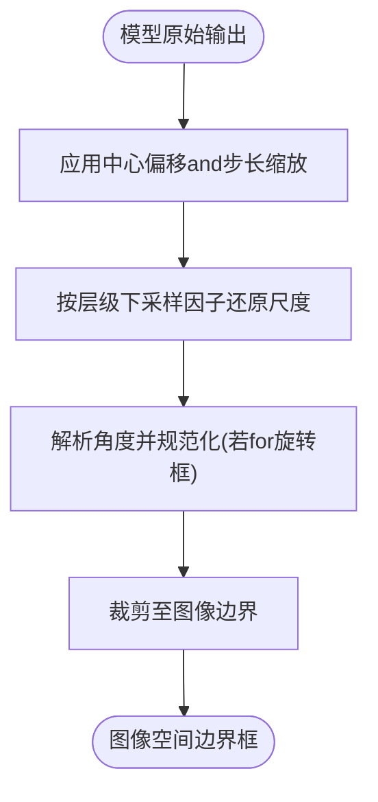
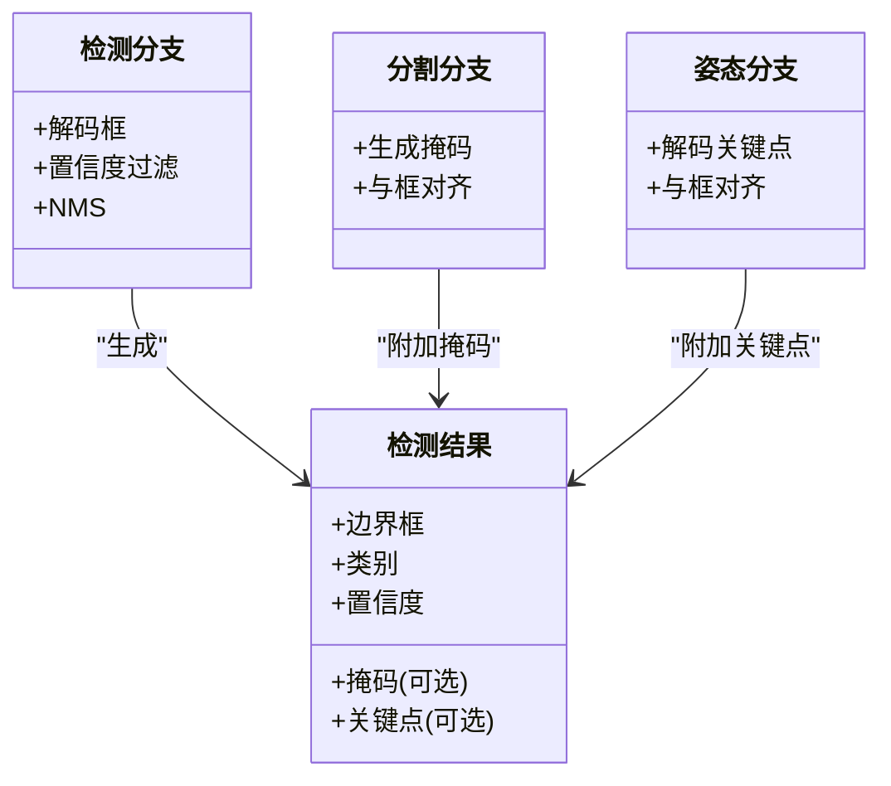
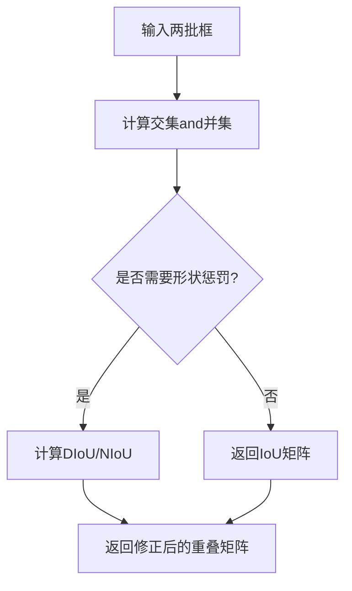
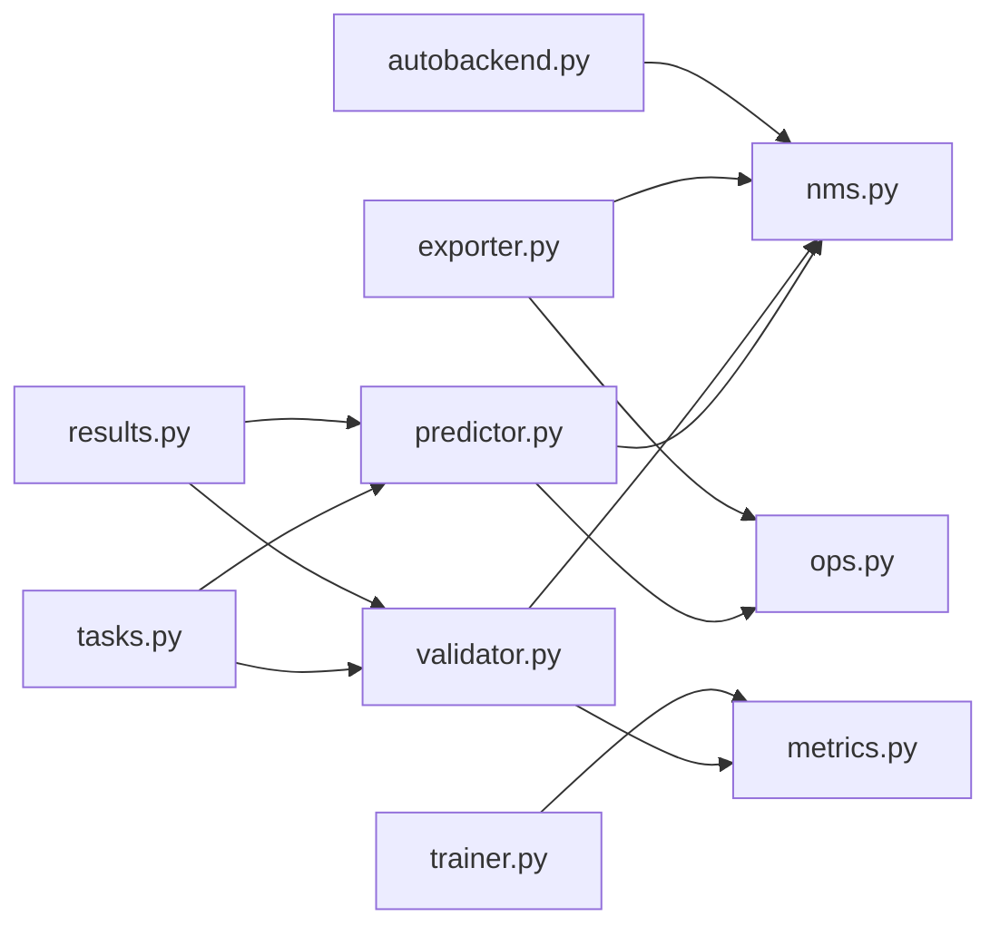

# Post-Processing Algorithms

<cite>
**Files Referenced in This Document**
- [nms.py](file://ultralytics/utils/nms.py)
- [ops.py](file://ultralytics/utils/ops.py)
- [metrics.py](file://ultralytics/utils/metrics.py)
- [results.py](file://ultralytics/engine/results.py)
- [predictor.py](file://ultralytics/engine/predictor.py)
- [validator.py](file://ultralytics/engine/validator.py)
- [trainer.py](file://ultralytics/engine/trainer.py)
- [exporter.py](file://ultralytics/engine/exporter.py)
- [autobackend.py](file://ultralytics/nn/autobackend.py)
- [tasks.py](file://ultralytics/nn/tasks.py)
</cite>

## Table of Contents
1. [Introduction](#Introduction)
2. [Project Structure](#Project Structure)
3. [Core Components](#Core Components)
4. [Architecture Overview](#Architecture Overview)
5. [Detailed Component Analysis](#Detailed Component Analysis)
6. [Dependency Analysis](#Dependency Analysis)
7. [性能考量](#性能考量)
8. [Troubleshooting Guide](#Troubleshooting Guide)
9. [Conclusion](#Conclusion)
10. [Appendix](#Appendix)

## Introduction
本技术Documentation聚焦于YOLO-Master的Post-Processing Algorithms，围绕Non-Maximum Suppression（NMS）and其变体、Confidence Threshold过滤、边界框解码、多Tasks输出融合、IoU计算andOptimization、参数调优and基准测试、Centered onand自定义Post-Processing集成etc.主题unfold。目标是帮助读者从工程implementingand算法原理两个层面理解并高效Uses这些capabilities。

## Project Structure
Post-Processing相关代码主要分布whileCentered on下Modules：
- NMSand基础算子：ultralytics/utils/nms.py、ultralytics/utils/ops.py
- IoUandEvaluationMetrics：ultralytics/utils/metrics.py
- Inference结果EncapsulatesandVisualization：ultralytics/engine/results.py
- Inference流程编排：ultralytics/engine/predictor.py、ultralytics/engine/validator.py、ultralytics/engine/trainer.py
- Exportand后端适配：ultralytics/engine/exporter.py、ultralytics/nn/autobackend.py
- 模型Tasks头and输出定义：ultralytics/nn/tasks.py

Figure Source
- [nms.py](file://ultralytics/utils/nms.py)
- [ops.py](file://ultralytics/utils/ops.py)
- [metrics.py](file://ultralytics/utils/metrics.py)
- [results.py](file://ultralytics/engine/results.py)
- [predictor.py](file://ultralytics/engine/predictor.py)
- [validator.py](file://ultralytics/engine/validator.py)
- [trainer.py](file://ultralytics/engine/trainer.py)
- [exporter.py](file://ultralytics/engine/exporter.py)
- [autobackend.py](file://ultralytics/nn/autobackend.py)
- [tasks.py](file://ultralytics/nn/tasks.py)

Section Source
- [nms.py](file://ultralytics/utils/nms.py)
- [ops.py](file://ultralytics/utils/ops.py)
- [metrics.py](file://ultralytics/utils/metrics.py)
- [results.py](file://ultralytics/engine/results.py)
- [predictor.py](file://ultralytics/engine/predictor.py)
- [validator.py](file://ultralytics/engine/validator.py)
- [trainer.py](file://ultralytics/engine/trainer.py)
- [exporter.py](file://ultralytics/engine/exporter.py)
- [autobackend.py](file://ultralytics/nn/autobackend.py)
- [tasks.py](file://ultralytics/nn/tasks.py)

## Core Components
- NMSand变体：标准NMS、软NMS、DIoU-NMSetc.策略whileUnified Interface下provides，便于while不同Tasksand部署后端中切换。
- Confidence Threshold过滤：whileNMS前对候选框进行置信度筛选，Supporting静态阈值and动态阈值策略。
- 边界框解码：将模型输出的原始坐标变换for图像空间坐标，包含尺度还原and角度计算（针对旋转框）。
- 多Tasks融合：检测、分割、Pose Estimationetc.多Tasks输出whilePost-Processing阶段被统一编码toResults Object中，供下游Uses。
- IoU计算andOptimization：provides多种IoU度量and近似加速方案，兼顾精度and速度。
- 参数调优and基准：provides阈值扫描and性能对比工具，辅助定位最优配置。

Section Source
- [nms.py](file://ultralytics/utils/nms.py)
- [ops.py](file://ultralytics/utils/ops.py)
- [metrics.py](file://ultralytics/utils/metrics.py)
- [results.py](file://ultralytics/engine/results.py)
- [predictor.py](file://ultralytics/engine/predictor.py)
- [validator.py](file://ultralytics/engine/validator.py)
- [trainer.py](file://ultralytics/engine/trainer.py)
- [exporter.py](file://ultralytics/engine/exporter.py)
- [autobackend.py](file://ultralytics/nn/autobackend.py)
- [tasks.py](file://ultralytics/nn/tasks.py)

## Architecture Overview
Post-ProcessingwhileInferenceandValidation流程中的位置such as下：

Figure Source
- [predictor.py](file://ultralytics/engine/predictor.py)
- [tasks.py](file://ultralytics/nn/tasks.py)
- [ops.py](file://ultralytics/utils/ops.py)
- [nms.py](file://ultralytics/utils/nms.py)
- [results.py](file://ultralytics/engine/results.py)
- [validator.py](file://ultralytics/engine/validator.py)
- [metrics.py](file://ultralytics/utils/metrics.py)

## Detailed Component Analysis

### Non-Maximum Suppression（NMS）and变体
- 标准NMS：按置信度降序选择候选框，迭代剔除and当前框IoU超过阈值的其余框。适用于密集重叠场景的常规Object Detection。
- 软NMS：对高IoU候选框的置信度进行衰减而非直接剔除，保留弱响应，适合小目标或遮挡严重场景。
- DIoU-NMS：Centered onDIoU作for排序and抑制依据，对长宽比敏感的目标具有更好的抑制效果，常用于旋转框或细长目标。

Figure Source
- [nms.py](file://ultralytics/utils/nms.py)

Section Source
- [nms.py](file://ultralytics/utils/nms.py)

### Confidence Threshold过滤机制
- 静态阈值：固定阈值过滤低置信度候选框，简单高效，适合稳定数据分布。
- 动态阈值：根据场景复杂度、平均置信度或类别先验自适应调整阈值，提升召回率and精度的平衡。
- 自适应过滤：CombiningNMS前后两次过滤，或while不同尺度层采用差异化阈值，缓解小目标漏检。

Figure Source
- [predictor.py](file://ultralytics/engine/predictor.py)
- [nms.py](file://ultralytics/utils/nms.py)

Section Source
- [predictor.py](file://ultralytics/engine/predictor.py)
- [nms.py](file://ultralytics/utils/nms.py)

### 边界框解码算法
- 坐标变换：将网络输出的相对坐标转换for图像绝对坐标，考虑锚点/网格中心偏移and步长缩放。
- 尺度还原：根据特征图层级对应的下采样因子恢复真实尺度。
- 角度计算：对于旋转框（OBB），解码角度并归一化to合理范围，确保后续IoU/DIoU计算正确。

Figure Source
- [ops.py](file://ultralytics/utils/ops.py)
- [tasks.py](file://ultralytics/nn/tasks.py)

Section Source
- [ops.py](file://ultralytics/utils/ops.py)
- [tasks.py](file://ultralytics/nn/tasks.py)

### 多Tasks输出融合策略
- 检测分支：输出类别概率、置信度and边界框，经解码andNMS得to最终框列表。
- 分割分支：输出掩码系数或像素级Prediction，and检测框对齐后进行实例掩码合成。
- Pose Estimation分支：输出关键点坐标and可见性，and检测框对齐后进行关键点绘制andVisualization。
- 统一Results Object：所有Tasks的输出被Encapsulatesto统一的结果结构中，便于Visualization、Exportand评测。

Figure Source
- [results.py](file://ultralytics/engine/results.py)
- [tasks.py](file://ultralytics/nn/tasks.py)

Section Source
- [results.py](file://ultralytics/engine/results.py)
- [tasks.py](file://ultralytics/nn/tasks.py)

### IoU计算andOptimization算法
- 基础IoU：矩形框交并比，计算开销适中，广泛用于标准NMS。
- DIoU/NIoU：引入中心距离或形状惩罚项，抑制效果更好，适合旋转框或长宽比差异大的目标。
- 快速近似：Via预计算面积、边界裁剪and向量化运算降低重复计算成本；while大规模候选集上显著提速。
- 并行Optimization：利用GPU张量并行and批内并行，减少CPU-GPU往返；whileExport模式下可启用后端特定加速内核。

Figure Source
- [metrics.py](file://ultralytics/utils/metrics.py)
- [ops.py](file://ultralytics/utils/ops.py)

Section Source
- [metrics.py](file://ultralytics/utils/metrics.py)
- [ops.py](file://ultralytics/utils/ops.py)

### Post-Processing参数调优指南
- Confidence Threshold：提高可降误报但可能牺牲召回，建议while小目标或遮挡场景适度降低。
- NMS阈值：标准NMS常用0.45~0.6；DIoU-NMS对重叠更敏感，阈值可略低。
- 软NMS权重：控制衰减强度，过强会保留过多冗余框，过弱则退化for标准NMS。
- 多尺度阈值：对不同分辨率层设置差异化阈值，有助于平衡大小目标的检测质量。
- 性能权衡：更高阈值and更强抑制可降低Post-Processing耗时，但需EvaluationmAP变化。

Section Source
- [nms.py](file://ultralytics/utils/nms.py)
- [predictor.py](file://ultralytics/engine/predictor.py)
- [validator.py](file://ultralytics/engine/validator.py)

### 自定义Post-Processing Algorithms集成方法
- 替换NMS策略：whilePredictor或Exporter中注入自定义NMS函数，保持输入输出契约一致。
- 扩展过滤策略：while解码后插入自定义置信度过滤或规则引擎，Supporting业务先验。
- 多Tasks融合扩展：whileResults Object中添加新字段（such as属性、轨迹ID），并whileVisualizationandExport中兼容。
- 后端适配：while自动后端中注册新的NMSimplementing，确保Exportand部署一致性。

Section Source
- [predictor.py](file://ultralytics/engine/predictor.py)
- [exporter.py](file://ultralytics/engine/exporter.py)
- [autobackend.py](file://ultralytics/nn/autobackend.py)
- [results.py](file://ultralytics/engine/results.py)

### 算法性能基准测试and对比分析
- 基准维度：吞吐（FPS）、延迟（ms/帧）、内存占用、mAP@IoU阈值、每类召回/精确率。
- 对比策略：标准NMS vs 软NMS vs DIoU-NMS；不同Confidence Threshold组合；是否启用快速IoU近似。
- 数据集覆盖：COCO、VisDrone、DOTAetc.典型场景，关注小目标、密集重叠and旋转框。
- 报告输出：汇总表格and曲线（PR曲线、IoU敏感度曲线），便于复现实验and回归检查。

Section Source
- [validator.py](file://ultralytics/engine/validator.py)
- [metrics.py](file://ultralytics/utils/metrics.py)
- [benchmarks](file://benchmarks)

## Dependency Analysis
Post-ProcessingModules之间的耦合and协作such as下：

Figure Source
- [predictor.py](file://ultralytics/engine/predictor.py)
- [nms.py](file://ultralytics/utils/nms.py)
- [ops.py](file://ultralytics/utils/ops.py)
- [validator.py](file://ultralytics/engine/validator.py)
- [metrics.py](file://ultralytics/utils/metrics.py)
- [trainer.py](file://ultralytics/engine/trainer.py)
- [exporter.py](file://ultralytics/engine/exporter.py)
- [autobackend.py](file://ultralytics/nn/autobackend.py)
- [tasks.py](file://ultralytics/nn/tasks.py)
- [results.py](file://ultralytics/engine/results.py)

Section Source
- [predictor.py](file://ultralytics/engine/predictor.py)
- [nms.py](file://ultralytics/utils/nms.py)
- [ops.py](file://ultralytics/utils/ops.py)
- [validator.py](file://ultralytics/engine/validator.py)
- [metrics.py](file://ultralytics/utils/metrics.py)
- [trainer.py](file://ultralytics/engine/trainer.py)
- [exporter.py](file://ultralytics/engine/exporter.py)
- [autobackend.py](file://ultralytics/nn/autobackend.py)
- [tasks.py](file://ultralytics/nn/tasks.py)
- [results.py](file://ultralytics/engine/results.py)

## 性能考量
- 候选框数量控制：while解码and过滤阶段尽早剪枝，减少NMS计算规模。
- 向量化and批处理：尽量Uses张量并行计算IoU/DIoU，避免逐元素循环。
- 后端加速：whileExportand部署时启用平台特定的NMS内核（such asTensorRT/OpenVINO），减少Python解释开销。
- 内存管理：避免中间大矩阵常驻内存，and时释放或分块计算。
- 精度-速度权衡：软NMSandDIoU-NMS通常带来一定延迟，需Combining实际场景Evaluation收益。

[This section provides general guidance and does not directly analyze specific files]

## Troubleshooting Guide
- NMS无结果：检查Confidence Threshold是否过高、NMS阈值是否过大、解码是否正确。
- 大量重复框：降低NMS阈值或改用DIoU-NMS；确认角解码and边界裁剪逻辑。
- 小目标漏检：降低Confidence Threshold、启用软NMS、分层阈值策略。
- 旋转框异常：核对角度归一化andDIoUimplementing，确保角度范围and坐标系一致。
- Export不一致：确认Exporterand运行时后端Uses的NMSimplementing一致，必要时固化种子and数值精度。

Section Source
- [nms.py](file://ultralytics/utils/nms.py)
- [ops.py](file://ultralytics/utils/ops.py)
- [metrics.py](file://ultralytics/utils/metrics.py)
- [predictor.py](file://ultralytics/engine/predictor.py)
- [exporter.py](file://ultralytics/engine/exporter.py)
- [autobackend.py](file://ultralytics/nn/autobackend.py)

## Conclusion
YOLO-Master的Post-Processing体系Centered onNMSfor核心，辅Centered on灵活的阈值过滤、稳健的边界框解码and多Tasks融合策略，并ViaIoUOptimizationand后端适配implementing良好的精度-速度平衡。Via系统化的参数调优and基准测试，可while不同Tasksand部署环境中获得稳定可靠的检测结果。

[This section is summary content and does not directly analyze specific files]

## Appendix
- 术语表
  - NMS：Non-Maximum Suppression
  - IoU：交并比
  - DIoU：距离交并比
  - OBB：旋转边界框
  - FPS：每秒帧数
- Refer to路径
  - NMSimplementing：[nms.py](file://ultralytics/utils/nms.py)
  - 算子and解码：[ops.py](file://ultralytics/utils/ops.py)
  - IoUandMetrics：[metrics.py](file://ultralytics/utils/metrics.py)
  - 结果Encapsulates：[results.py](file://ultralytics/engine/results.py)
  - InferenceandValidation：[predictor.py](file://ultralytics/engine/predictor.py)、[validator.py](file://ultralytics/engine/validator.py)
  - TrainingandExport：[trainer.py](file://ultralytics/engine/trainer.py)、[exporter.py](file://ultralytics/engine/exporter.py)
  - 后端适配：[autobackend.py](file://ultralytics/nn/autobackend.py)
  - Tasks头and输出：[tasks.py](file://ultralytics/nn/tasks.py)

[本节for补充信息，不直接分析具体文件]