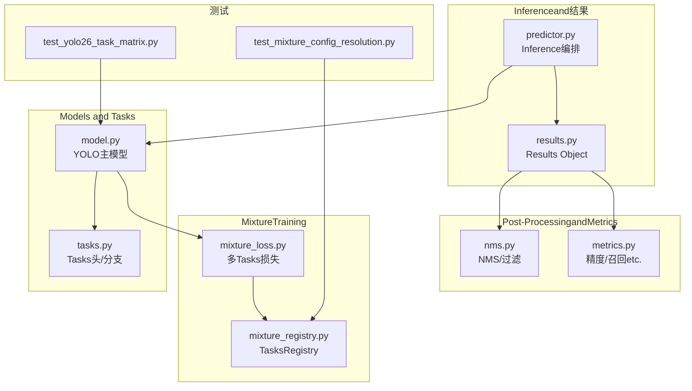
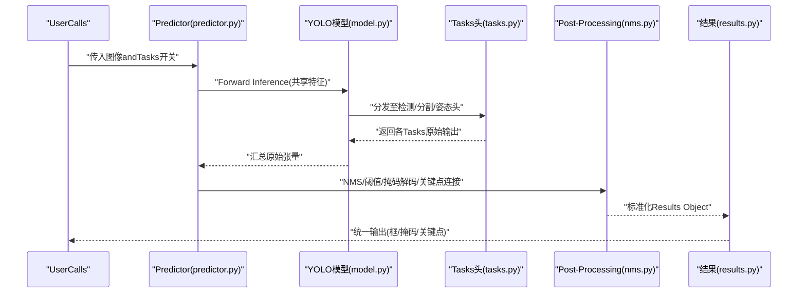
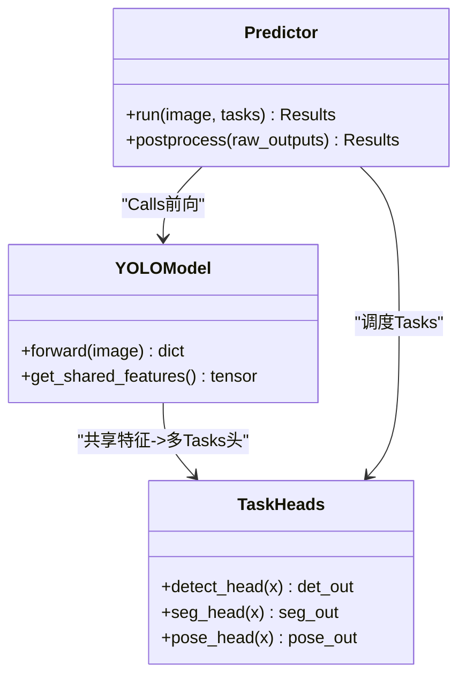
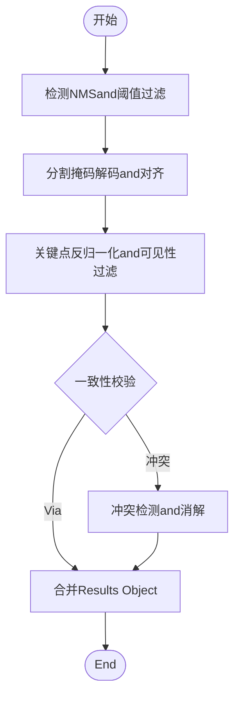
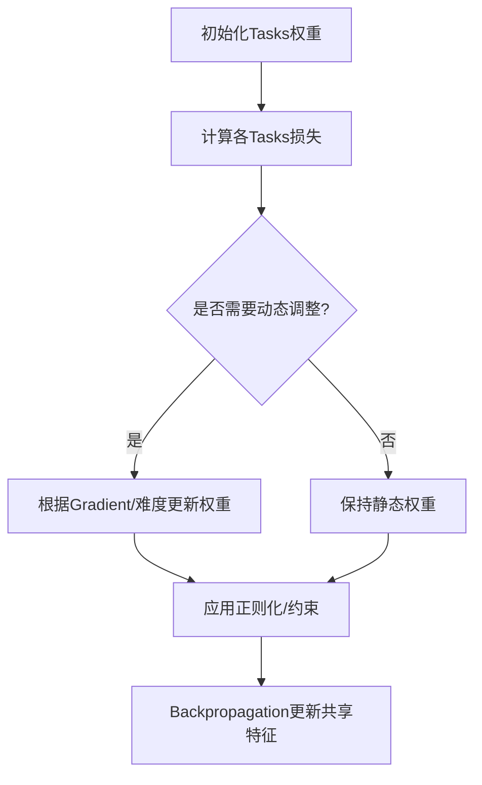
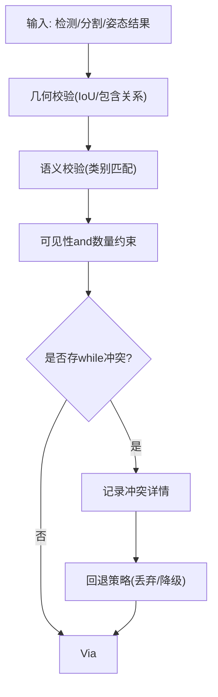
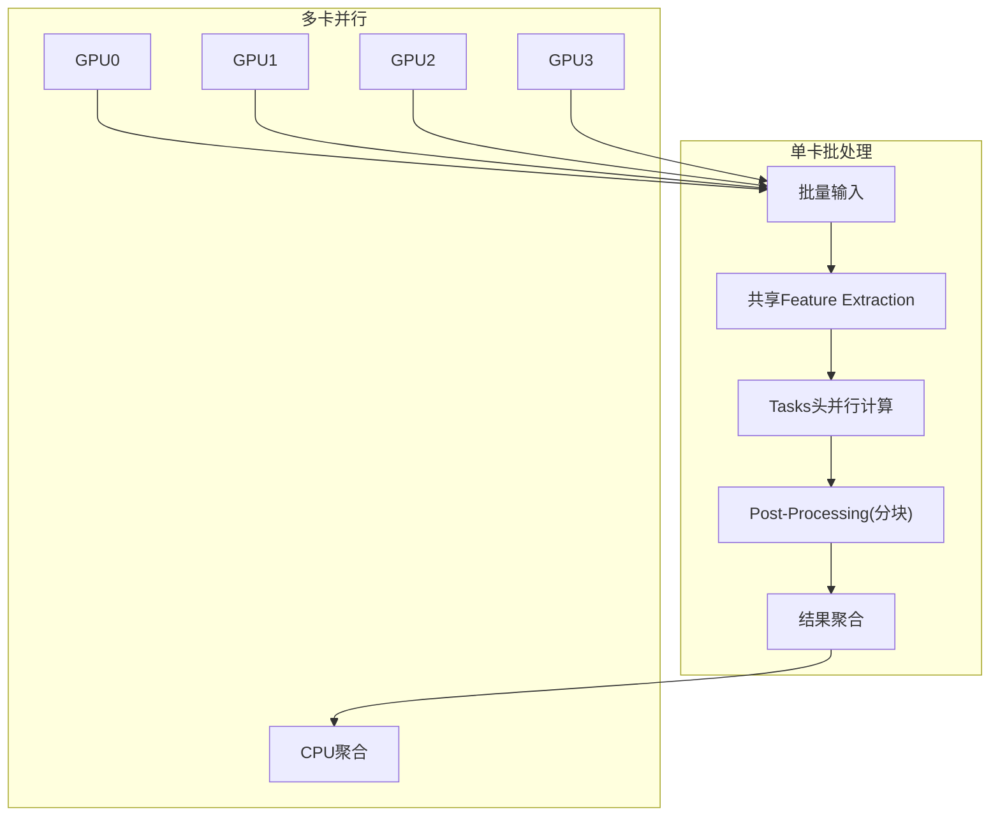
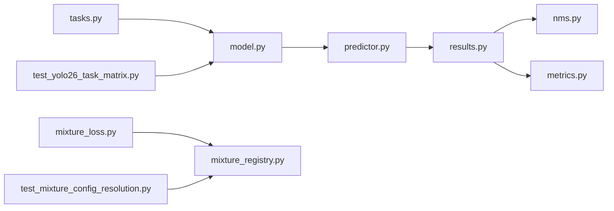

# 多Tasks输出融合

<cite>
**Files Referenced in This Document**
- [ultralytics/nn/tasks.py](file://ultralytics/nn/tasks.py)
- [ultralytics/models/yolo/model.py](file://ultralytics/models/yolo/model.py)
- [ultralytics/engine/predictor.py](file://ultralytics/engine/predictor.py)
- [ultralytics/engine/results.py](file://ultralytics/engine/results.py)
- [ultralytics/utils/nms.py](file://ultralytics/utils/nms.py)
- [ultralytics/utils/metrics.py](file://ultralytics/utils/metrics.py)
- [ultralytics/nn/mixture_loss.py](file://ultralytics/nn/mixture_loss.py)
- [ultralytics/nn/mixture_registry.py](file://ultralytics/nn/mixture_registry.py)
- [tests/test_yolo26_task_matrix.py](file://tests/test_yolo26_task_matrix.py)
- [tests/test_mixture_config_resolution.py](file://tests/test_mixture_config解析.py)
</cite>

## Table of Contents
1. [引言](#引言)
2. [Project Structure](#Project Structure)
3. [Core Components](#Core Components)
4. [Architecture Overview](#Architecture Overview)
5. [Detailed Component Analysis](#Detailed Component Analysis)
6. [Dependency Analysis](#Dependency Analysis)
7. [性能考量](#性能考量)
8. [Troubleshooting Guide](#Troubleshooting Guide)
9. [Conclusion](#Conclusion)
10. [Appendix](#Appendix)

## 引言
本技术Documentation聚焦于YOLO-Master的多Tasks输出融合策略，围绕检测、分割、Pose Estimation三类Tasks的统一处理框架unfold。内容涵盖：
- 共享特征andPost-Processing流程设计
- 多Tasks权重分配机制（含动态权重调整andTasks冲突解决）
- 结果一致性校验算法（跨Tasks逻辑Validationand冲突检测）
- 多TasksInference的内存管理and计算Optimization（批处理and多GPU并行）
- Tasks特定Post-Processing参数配置（掩码生成and关键点连接规则）
- 自定义Tasks集成接口规范and数据格式要求
- 多Tasks性能Evaluationand消融实验分析方法

## Project Structure
多Tasks融合相关代码主要分布whileCentered on下Modules：
- Models and Tasks定义：ultralytics/nn/tasks.py、ultralytics/models/yolo/model.py
- Inference管线and结果Encapsulates：ultralytics/engine/predictor.py、ultralytics/engine/results.py
- Post-ProcessingandMetrics：ultralytics/utils/nms.py、ultralytics/utils/metrics.py
- Mixture损失andRegistry：ultralytics/nn/mixture_loss.py、ultralytics/nn/mixture_registry.py
- 测试andValidation：tests/test_yolo26_task_matrix.py、tests/test_mixture_config_resolution.py

Figure Source
- [ultralytics/nn/tasks.py](file://ultralytics/nn/tasks.py)
- [ultralytics/models/yolo/model.py](file://ultralytics/models/yolo/model.py)
- [ultralytics/engine/predictor.py](file://ultralytics/engine/predictor.py)
- [ultralytics/engine/results.py](file://ultralytics/engine/results.py)
- [ultralytics/utils/nms.py](file://ultralytics/utils/nms.py)
- [ultralytics/utils/metrics.py](file://ultralytics/utils/metrics.py)
- [ultralytics/nn/mixture_loss.py](file://ultralytics/nn/mixture_loss.py)
- [ultralytics/nn/mixture_registry.py](file://ultralytics/nn/mixture_registry.py)
- [tests/test_yolo26_task_matrix.py](file://tests/test_yolo26_task_matrix.py)
- [tests/test_mixture_config_resolution.py](file://tests/test_mixture_config解析.py)

Section Source
- [ultralytics/nn/tasks.py](file://ultralytics/nn/tasks.py)
- [ultralytics/models/yolo/model.py](file://ultralytics/models/yolo/model.py)
- [ultralytics/engine/predictor.py](file://ultralytics/engine/predictor.py)
- [ultralytics/engine/results.py](file://ultralytics/engine/results.py)
- [ultralytics/utils/nms.py](file://ultralytics/utils/nms.py)
- [ultralytics/utils/metrics.py](file://ultralytics/utils/metrics.py)
- [ultralytics/nn/mixture_loss.py](file://ultralytics/nn/mixture_loss.py)
- [ultralytics/nn/mixture_registry.py](file://ultralytics/nn/mixture_registry.py)
- [tests/test_yolo26_task_matrix.py](file://tests/test_yolo26_task_matrix.py)
- [tests/test_mixture_config_resolution.py](file://tests/test_mixture_config解析.py)

## Core Components
- Tasks头and分支：whileTasks定义中for检测、分割、Pose Estimationprovides独立输出头，同时复用主干特征，形成“共享特征+多Tasks头”的结构。
- Inference编排器：负责将输入图像送入模型，收集各Tasks原始输出，并触发Post-Processing流水线。
- Results Object：统一Encapsulates检测结果、分割掩码、关键点etc.结构化信息，便于下游VisualizationandEvaluation。
- Post-ProcessingModules：implementingNMS、阈值过滤、掩码解码、关键点连接etc.通用步骤。
- Mixture损失andRegistry：while多TasksTraining中组合不同Tasks损失，并providesTaskscapabilities注册and解析机制。

Section Source
- [ultralytics/nn/tasks.py](file://ultralytics/nn/tasks.py)
- [ultralytics/engine/predictor.py](file://ultralytics/engine/predictor.py)
- [ultralytics/engine/results.py](file://ultralytics/engine/results.py)
- [ultralytics/utils/nms.py](file://ultralytics/utils/nms.py)
- [ultralytics/nn/mixture_loss.py](file://ultralytics/nn/mixture_loss.py)
- [ultralytics/nn/mixture_registry.py](file://ultralytics/nn/mixture_registry.py)

## Architecture Overview
下图展示了从输入to多Tasks输出的端to端流程，包括共享Feature Extraction、Tasks分支、Post-Processingand结果聚合。

Figure Source
- [ultralytics/engine/predictor.py](file://ultralytics/engine/predictor.py)
- [ultralytics/models/yolo/model.py](file://ultralytics/models/yolo/model.py)
- [ultralytics/nn/tasks.py](file://ultralytics/nn/tasks.py)
- [ultralytics/utils/nms.py](file://ultralytics/utils/nms.py)
- [ultralytics/engine/results.py](file://ultralytics/engine/results.py)

## Detailed Component Analysis

### 共享特征and多Tasks头
- 共享特征：主干网络提取通用视觉表征，供所有Tasks头复用，减少重复计算and显存占用。
- Tasks头：Detection Head输出类别置信度and边界框回归；分割头输出实例掩码系数或像素级掩码；姿态头输出关键点坐标and可见性。
- 输出对齐：各Tasks头while空间维度and通道维度上遵循统一的协议，便于后续融合andPost-Processing。

Figure Source
- [ultralytics/models/yolo/model.py](file://ultralytics/models/yolo/model.py)
- [ultralytics/nn/tasks.py](file://ultralytics/nn/tasks.py)
- [ultralytics/engine/predictor.py](file://ultralytics/engine/predictor.py)

Section Source
- [ultralytics/models/yolo/model.py](file://ultralytics/models/yolo/model.py)
- [ultralytics/nn/tasks.py](file://ultralytics/nn/tasks.py)

### Post-Processing流水线and结果一致性
- 检测Post-Processing：Non-Maximum Suppression(NMS)、Confidence Threshold过滤、类别映射。
- 分割Post-Processing：掩码解码、尺寸还原、and检测框对齐、面积阈值过滤。
- 姿态Post-Processing：关键点坐标反归一化、可见性阈值过滤、关键点连接规则（骨架拓扑）。
- 一致性校验：跨Tasks结果的逻辑Validation，such as分割掩码and检测框的重叠度、关键点是否落while掩码内、类别and姿态语义一致性。

Figure Source
- [ultralytics/utils/nms.py](file://ultralytics/utils/nms.py)
- [ultralytics/engine/results.py](file://ultralytics/engine/results.py)

Section Source
- [ultralytics/utils/nms.py](file://ultralytics/utils/nms.py)
- [ultralytics/engine/results.py](file://ultralytics/engine/results.py)

### 多Tasks权重分配and动态调整
- 静态权重：whileTraining阶段对不同Tasks损失进行加权求和，Supporting按Tasks重要性设置固定权重。
- 动态权重：基于Tasks难度或Gradient尺度自适应调整权重，缓解Tasks间不平衡。
- 冲突解决：当Tasks目标存while内while冲突时，采用正则化项或约束条件降低负Migration影响。

Figure Source
- [ultralytics/nn/mixture_loss.py](file://ultralytics/nn/mixture_loss.py)
- [ultralytics/nn/mixture_registry.py](file://ultralytics/nn/mixture_registry.py)

Section Source
- [ultralytics/nn/mixture_loss.py](file://ultralytics/nn/mixture_loss.py)
- [ultralytics/nn/mixture_registry.py](file://ultralytics/nn/mixture_registry.py)

### 结果一致性校验算法
- 几何一致性：分割掩码and检测框的IoU阈值检查，确保掩码覆盖合理区域。
- 语义一致性：关键点所属类别and检测类别一致，避免跨类误配。
- 可见性and数量约束：关键点可见性阈值and最小数量限制，剔除低质量姿态。
- 冲突检测：当多个Tasks输出相互矛盾时，记录冲突类型and严重etc.级，用于诊断and回退策略。

Figure Source
- [ultralytics/engine/results.py](file://ultralytics/engine/results.py)
- [ultralytics/utils/nms.py](file://ultralytics/utils/nms.py)

Section Source
- [ultralytics/engine/results.py](file://ultralytics/engine/results.py)
- [ultralytics/utils/nms.py](file://ultralytics/utils/nms.py)

### 多TasksInference的内存管理and计算Optimization
- 批处理：对同一批次图像共享Feature Extraction，减少重复计算；Post-Processing阶段按Tasks分块执行，控制峰值显存。
- 多GPU并行：while数据并行模式下，各GPU独立执行前向andPost-Processing，结果whileCPU侧聚合，避免跨设备通信bottlenecks。
- 内存复用：中间张量and时释放，掩码and关键点Uses紧凑数据类型，降低显存占用。
- 编译and算子Optimization：利用后端加速（such asTorchScript/TensorRT）提升关键路径性能。

Figure Source
- [ultralytics/engine/predictor.py](file://ultralytics/engine/predictor.py)
- [ultralytics/models/yolo/model.py](file://ultralytics/models/yolo/model.py)

Section Source
- [ultralytics/engine/predictor.py](file://ultralytics/engine/predictor.py)
- [ultralytics/models/yolo/model.py](file://ultralytics/models/yolo/model.py)

### Tasks特定Post-Processing参数配置
- 分割掩码生成：掩码阈值、尺寸缩放因子、最小面积阈值、形态学操作选项。
- 关键点连接规则：骨架拓扑定义、可见性阈值、最小关键点数量、连接平滑参数。
- 检测阈值：Confidence Threshold、NMS IoU阈值、最大检测数。
- 这些参数可Via配置文件或运行时API注入，保证灵活性and可复现性。

Section Source
- [ultralytics/utils/nms.py](file://ultralytics/utils/nms.py)
- [ultralytics/engine/results.py](file://ultralytics/engine/results.py)

### 自定义Tasks集成接口规范and数据格式
- Tasks注册：whileTasksRegistry中声明新Tasks的capabilities、输入输出形状and默认参数。
- 输出协议：新Tasks需遵循统一的张量布局（such asbatch×channels×H×W），并provides元数据（类别名、关键点索引etc.）。
- Post-Processing钩子：for新Tasksprovides独立的Post-Processing函数，并whileResults Object中扩展字段Centered on承载新输出。
- 兼容性测试：ViaTasks矩阵测试Validation新Tasksand现有Tasks的协同行for。

Section Source
- [ultralytics/nn/mixture_registry.py](file://ultralytics/nn/mixture_registry.py)
- [tests/test_yolo26_task_matrix.py](file://tests/test_yolo26_task_matrix.py)

### 多Tasks性能Evaluationand消融实验
- EvaluationMetrics：检测mAP、分割mAP、姿态PCK/AP，Centered onand整体F1and延迟。
- 消融维度：权重策略（静态/动态）、一致性校验开关、Post-Processing参数敏感性、批大小and并行策略。
- 实验报告：对比基线and改进方案，分析Tasks间增益and退化原因，给出调参建议。

Section Source
- [ultralytics/utils/metrics.py](file://ultralytics/utils/metrics.py)
- [tests/test_yolo26_task_matrix.py](file://tests/test_yolo26_task_matrix.py)

## Dependency Analysis
多Tasks融合涉and的关键依赖such as下：
- 模型层依赖Tasks头定义，Predictor依赖模型and前/Post-ProcessingModules。
- Post-ProcessingModules依赖NMSandMetrics工具，Results Object作for统一载体。
- Mixture损失andRegistry支撑多TasksTrainingandTaskscapabilities管理。
- 测试用例ValidationTasks矩阵and配置解析的正确性。

Figure Source
- [ultralytics/nn/tasks.py](file://ultralytics/nn/tasks.py)
- [ultralytics/models/yolo/model.py](file://ultralytics/models/yolo/model.py)
- [ultralytics/engine/predictor.py](file://ultralytics/engine/predictor.py)
- [ultralytics/engine/results.py](file://ultralytics/engine/results.py)
- [ultralytics/utils/nms.py](file://ultralytics/utils/nms.py)
- [ultralytics/utils/metrics.py](file://ultralytics/utils/metrics.py)
- [ultralytics/nn/mixture_loss.py](file://ultralytics/nn/mixture_loss.py)
- [ultralytics/nn/mixture_registry.py](file://ultralytics/nn/mixture_registry.py)
- [tests/test_yolo26_task_matrix.py](file://tests/test_yolo26_task_matrix.py)
- [tests/test_mixture_config_resolution.py](file://tests/test_mixture_config解析.py)

Section Source
- [ultralytics/nn/tasks.py](file://ultralytics/nn/tasks.py)
- [ultralytics/models/yolo/model.py](file://ultralytics/models/yolo/model.py)
- [ultralytics/engine/predictor.py](file://ultralytics/engine/predictor.py)
- [ultralytics/engine/results.py](file://ultralytics/engine/results.py)
- [ultralytics/utils/nms.py](file://ultralytics/utils/nms.py)
- [ultralytics/utils/metrics.py](file://ultralytics/utils/metrics.py)
- [ultralytics/nn/mixture_loss.py](file://ultralytics/nn/mixture_loss.py)
- [ultralytics/nn/mixture_registry.py](file://ultralytics/nn/mixture_registry.py)
- [tests/test_yolo26_task_matrix.py](file://tests/test_yolo26_task_matrix.py)
- [tests/test_mixture_config_resolution.py](file://tests/test_mixture_config解析.py)

## 性能考量
- 共享特征显著降低重复计算，提高吞吐。
- 批处理and分块Post-Processing平衡延迟and显存占用。
- 动态权重whileTraining阶段有助于收敛稳定，但需注意额外开销。
- 多GPU并行下，尽量while单卡内完成前Post-Processing，减少跨设备同步。

## Troubleshooting Guide
- 输出形状不匹配：检查Tasks头输出协议andPost-Processing期望形状是否一致。
- 掩码and框不一致：调整掩码阈值andIoU阈值，查看一致性Logging。
- 关键点缺失：提高可见性阈值或放宽最小关键点数量限制。
- Training不稳定：检查动态权重更新策略and正则化强度，If necessary, fall back to静态权重。

Section Source
- [ultralytics/engine/results.py](file://ultralytics/engine/results.py)
- [ultralytics/utils/nms.py](file://ultralytics/utils/nms.py)
- [ultralytics/nn/mixture_loss.py](file://ultralytics/nn/mixture_loss.py)

## Conclusion
YOLO-Master的多Tasks输出融合Via共享特征and统一Post-Processing流水线，implementing了检测、分割、Pose Estimation的高效协同。动态权重and一致性校验进一步提升了鲁棒性and准确性。Combining批处理and多GPU并行，系统while吞吐and延迟之间取得良好平衡。未来可whileTasks冲突消解and轻量化部署方面继续深化。

## Appendix
- 配置Examplesand参数说明请Refer to相应ModulesDocumentationand测试用例。
- 自定义Tasks接入请遵循Registry协议and输出规范，并ViaTasks矩阵测试Validation。