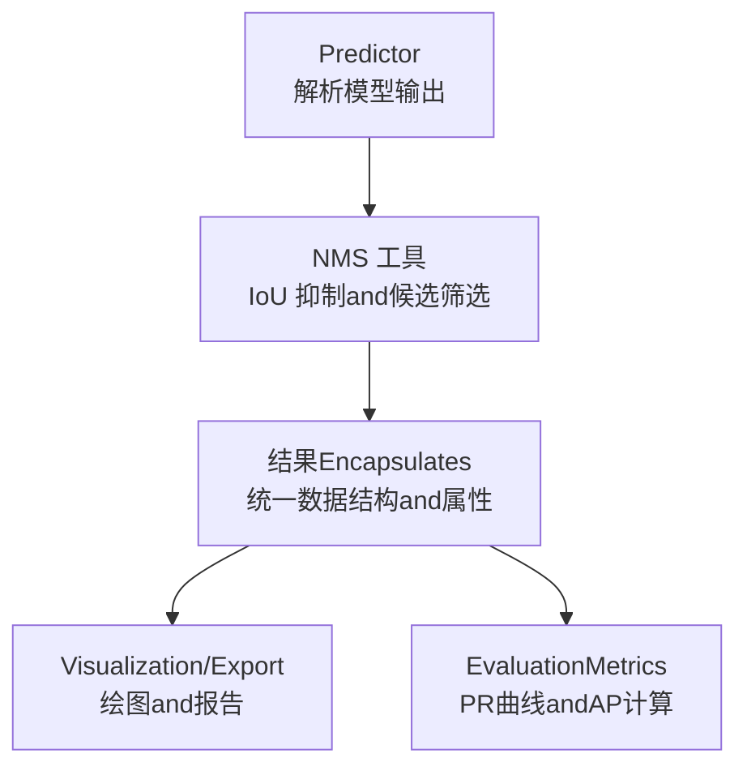
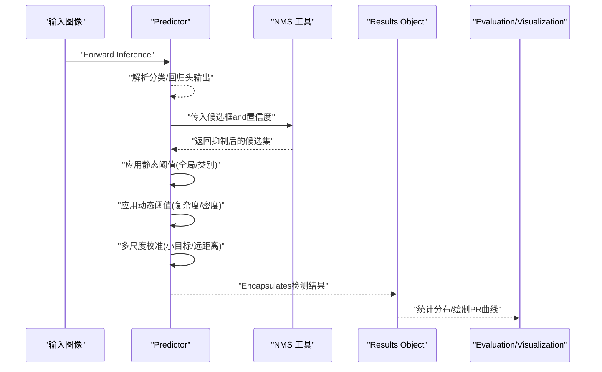
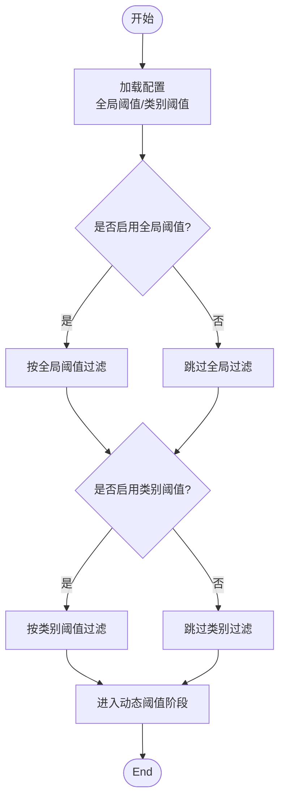
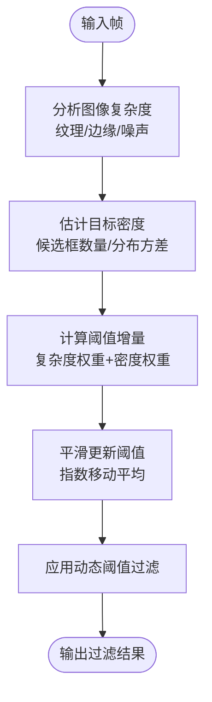
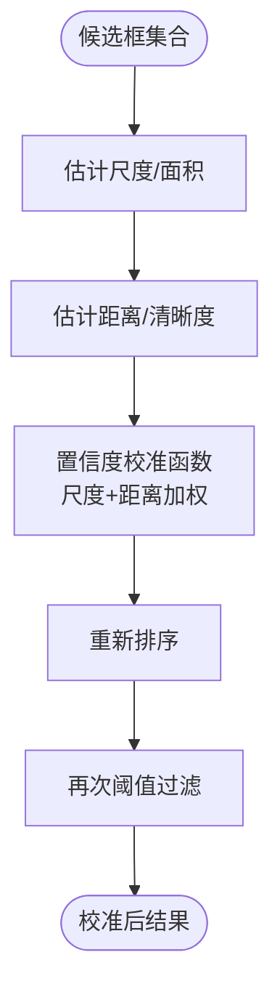
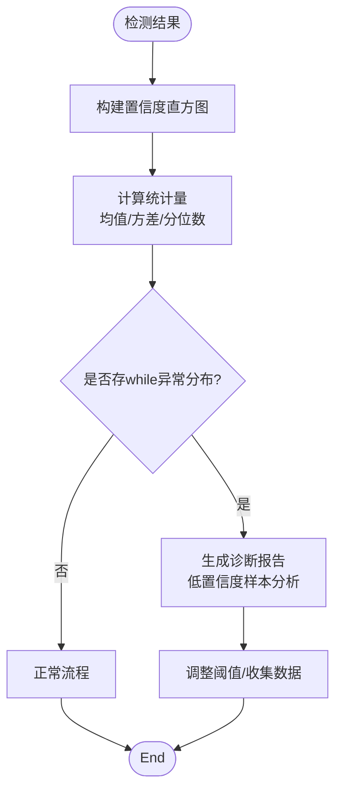
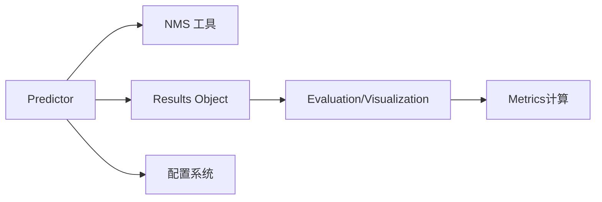

# 置信度过滤机制

<cite>
**Files Referenced in This Document**
- [predict.py](file://ultralytics/engine/predictor.py)
- [results.py](file://ultralytics/engine/results.py)
- [nms.py](file://ultralytics/utils/nms.py)
- [default.yaml](file://ultralytics/cfg/default.yaml)
- [metrics.py](file://ultralytics/utils/metrics.py)
- [plotting.py](file://ultralytics/utils/plotting.py)
- [engine_validator.py](file://ultralytics/engine/validator.py)
- [trainer.py](file://ultralytics/engine/trainer.py)
- [tuner.py](file://ultralytics/engine/tuner.py)
</cite>

## Table of Contents
1. [Introduction](#Introduction)
2. [Project Structure](#Project Structure)
3. [Core Components](#Core Components)
4. [Architecture Overview](#Architecture Overview)
5. [Detailed Component Analysis](#Detailed Component Analysis)
6. [Dependency Analysis](#Dependency Analysis)
7. [性能考量](#性能考量)
8. [Troubleshooting Guide](#Troubleshooting Guide)
9. [Conclusion](#Conclusion)
10. [Appendix](#Appendix)

## Introduction
本技术Documentation聚焦于 YOLO-Master 的置信度过滤机制，系统性阐述静态阈值（全局and类别特定）的implementing原理、动态阈值调整算法（基于图像复杂度and目标密度）、多尺度目标的置信度校准策略（小目标and远距离目标修正），Centered onand置信度分布分析and异常检测。同时provides参数调优指南、自定义过滤策略集成方法and性能影响分析，帮助读者while不同数据集and场景下获得稳定可靠的检测结果。

## Project Structure
YOLO-Master 的InferenceandPost-Processing流程中，置信度过滤主要涉andCentered on下Modules：
- Predictorand结果Encapsulates：负责模型输出解析、NMS and置信度过滤入口
- NMS 工具：implementingNon-Maximum SuppressionandOptional的置信度前置过滤
- 配置系统：provides默认阈值and可调参数
- EvaluationandVisualization：用于置信度分布统计、诊断and调试

**Figure Source**
- [predict.py](file://ultralytics/engine/predictor.py)
- [nms.py](file://ultralytics/utils/nms.py)
- [results.py](file://ultralytics/engine/results.py)
- [plotting.py](file://ultralytics/utils/plotting.py)
- [metrics.py](file://ultralytics/utils/metrics.py)

**Section Source**
- [predict.py](file://ultralytics/engine/predictor.py)
- [nms.py](file://ultralytics/utils/nms.py)
- [results.py](file://ultralytics/engine/results.py)
- [plotting.py](file://ultralytics/utils/plotting.py)
- [metrics.py](file://ultralytics/utils/metrics.py)

## Core Components
- Predictor（Predictor）：Load model、执行Forward Inference、Calls NMS and置信度过滤、EncapsulatesResults Object
- NMS 工具：按 IoU 阈值抑制重复框，Supportingwhile抑制前进行Confidence Threshold过滤
- Results Object（Results）：存储检测框、类别、置信度、掩码etc.，并provides过滤、排序、Visualization接口
- 配置（Default Config）：定义全局Confidence Threshold、IoU 阈值、类别特定阈值etc.关键参数
- EvaluationandVisualization：统计置信度分布、绘制 PR 曲线、生成诊断报告

**Section Source**
- [predict.py](file://ultralytics/engine/predictor.py)
- [nms.py](file://ultralytics/utils/nms.py)
- [results.py](file://ultralytics/engine/results.py)
- [default.yaml](file://ultralytics/cfg/default.yaml)
- [metrics.py](file://ultralytics/utils/metrics.py)
- [plotting.py](file://ultralytics/utils/plotting.py)

## Architecture Overview
下图展示从模型输出to最终过滤结果的完整数据流，包括静态阈值、动态阈值and多尺度校准的关键节点。

**Figure Source**
- [predict.py](file://ultralytics/engine/predictor.py)
- [nms.py](file://ultralytics/utils/nms.py)
- [results.py](file://ultralytics/engine/results.py)
- [metrics.py](file://ultralytics/utils/metrics.py)
- [plotting.py](file://ultralytics/utils/plotting.py)

## Detailed Component Analysis

### 静态Confidence Threshold：全局and类别特定
- 全局阈值：对全部类别的统一置信度门槛，适用于快速过滤低质量Prediction
- 类别特定阈值：针对难分或易误报类别设置更高阈值，提升精确率
- implementing要点：
  - while NMS 之前或之后均可应用；通常先进行 NMS 再按类别阈值过滤，减少冗余计算
  - 类别阈值可Via配置文件或运行时参数覆盖默认值
  - 建议CombiningValidation集上的 PR 曲线选择阈值，平衡召回and精确率

**Figure Source**
- [predict.py](file://ultralytics/engine/predictor.py)
- [default.yaml](file://ultralytics/cfg/default.yaml)

**Section Source**
- [predict.py](file://ultralytics/engine/predictor.py)
- [default.yaml](file://ultralytics/cfg/default.yaml)

### 动态阈值调整：基于图像复杂度and目标密度
- 图像复杂度自适应：
  - Via图像特征（such as纹理复杂度、边缘强度、噪声水平）估计场景难度
  - 复杂场景提高阈值Centered on降低误报，简单场景降低阈值Centered on提升召回
- 目标密度智能过滤：
  - 根据每帧目标数量and分布密度动态调整阈值
  - 高密度场景更严格，低密度场景更宽松
- implementing要点：
  - 复杂度估计可基于预Training的特征网络或轻量级统计量
  - 密度估计可Via初始候选框数量and空间分布方差衡量
  - 动态阈值需平滑更新，避免帧间抖动

**Figure Source**
- [predict.py](file://ultralytics/engine/predictor.py)
- [nms.py](file://ultralytics/utils/nms.py)

**Section Source**
- [predict.py](file://ultralytics/engine/predictor.py)
- [nms.py](file://ultralytics/utils/nms.py)

### 多尺度目标置信度校准：小目标and远距离目标
- 小目标校准：
  - 小目标通常置信度偏低但位置准确，适当降低其阈值或进行置信度提升
  - 可利用尺度感知特征或边界框面积作for校准因子
- 远距离目标校准：
  - 远距离目标受分辨率and模糊影响，置信度不稳定，需Combining尺度and清晰度度量
  - 引入距离估计或深度线索辅助校准
- implementing要点：
  - 校准函数应for单调且可微，便于端to端Optimization
  - 校准后可重新排序并再次应用阈值，确保一致性

**Figure Source**
- [predict.py](file://ultralytics/engine/predictor.py)
- [results.py](file://ultralytics/engine/results.py)

**Section Source**
- [predict.py](file://ultralytics/engine/predictor.py)
- [results.py](file://ultralytics/engine/results.py)

### 置信度分布分析and异常检测
- 分布统计：
  - 统计全局and类别置信度直方图、分位数、均值and方差
  - 识别双峰或多峰分布，Tips阈值不合理或类别不平衡
- 异常检测：
  - 低置信度集中区域可能表示模型未学习to的模式或标注噪声
  - Uses滑动窗口统计置信度漂移，触发告警
- 诊断工具：
  - Visualization PR 曲线and ROC 曲线，定位阈值敏感区间
  - 生成样本级诊断报告，标注低置信度错误类型

**Figure Source**
- [metrics.py](file://ultralytics/utils/metrics.py)
- [plotting.py](file://ultralytics/utils/plotting.py)
- [results.py](file://ultralytics/engine/results.py)

**Section Source**
- [metrics.py](file://ultralytics/utils/metrics.py)
- [plotting.py](file://ultralytics/utils/plotting.py)
- [results.py](file://ultralytics/engine/results.py)

### 置信度过滤参数的调优指南
- 数据集特性：
  - 类别不平衡：for少数类设置更高阈值，避免误报
  - 小目标密集：降低小目标阈值，提升召回
  - 背景复杂：提高全局阈值，抑制背景干扰
- 场景适配：
  - 实时视频：优先精确率，适度牺牲召回
  - 离线批处理：优先召回，允许更多Post-Processing
- 调优方法：
  - 基于Validation集的网格搜索或贝叶斯Optimization
  - Uses PR 曲线选择最佳操作点
  - Combining业务需求设定阈值优先级

**Section Source**
- [default.yaml](file://ultralytics/cfg/default.yaml)
- [metrics.py](file://ultralytics/utils/metrics.py)

### 自定义过滤策略的集成方法
- 扩展点：
  - whilePredictor中插入自定义过滤函数，Supporting按类别、尺度、密度etc.维度
  - 继承Results Object的过滤接口，implementing领域特定的逻辑
- 集成步骤：
  - 定义过滤策略类，implementing统一的输入输出接口
  - 注册toPredictor的过滤器链中，Supporting顺序执行
  - provides配置项，允许运行时切换策略
- 性能影响：
  - 自定义过滤应避免频繁内存分配and CPU-GPU 同步
  - Uses向量化操作and批量处理提升吞吐

**Section Source**
- [predict.py](file://ultralytics/engine/predictor.py)
- [results.py](file://ultralytics/engine/results.py)

## Dependency Analysis
置信度过滤ModulesandCentered on下组件存while紧密耦合：
- Predictor依赖 NMS 工具进行候选框筛选
- Results ObjectEncapsulates过滤后的检测结果，供EvaluationandVisualizationUses
- 配置系统provides阈值参数，影响过滤行for
- EvaluationandVisualizationModules依赖Results Object进行统计分析

**Figure Source**
- [predict.py](file://ultralytics/engine/predictor.py)
- [nms.py](file://ultralytics/utils/nms.py)
- [results.py](file://ultralytics/engine/results.py)
- [default.yaml](file://ultralytics/cfg/default.yaml)
- [metrics.py](file://ultralytics/utils/metrics.py)

**Section Source**
- [predict.py](file://ultralytics/engine/predictor.py)
- [nms.py](file://ultralytics/utils/nms.py)
- [results.py](file://ultralytics/engine/results.py)
- [default.yaml](file://ultralytics/cfg/default.yaml)
- [metrics.py](file://ultralytics/utils/metrics.py)

## 性能考量
- 计算开销：
  - 动态阈值估计应轻量高效，避免成forbottlenecks
  - 多尺度校准can use查表或近似函数加速
- 内存占用：
  - 批量处理时注意中间结果缓存，避免重复计算
  - Uses原地操作减少内存分配
- 并行化：
  - 类别特定阈值可按类别并行应用
  - 图像复杂度估计可多线程或 GPU acceleration

[This section provides general guidance and does not directly analyze specific files]

## Troubleshooting Guide
- 常见问题：
  - 阈值过高导致漏检：检查类别阈值and动态阈值更新逻辑
  - 阈值过低导致误报：增加全局阈值或复杂度权重
  - 小目标召回低：调整小目标校准函数或降低其阈值
- 诊断步骤：
  - 查看置信度直方图and PR 曲线，定位问题区间
  - 生成低置信度样本报告，分析错误类型
  - 逐步关闭动态阈值and校准，隔离问题Modules
- 调试工具：
  - UsesVisualizationModules绘制检测结果and置信度热力图
  - 记录关键中间变量，监控阈值变化轨迹

**Section Source**
- [metrics.py](file://ultralytics/utils/metrics.py)
- [plotting.py](file://ultralytics/utils/plotting.py)
- [results.py](file://ultralytics/engine/results.py)

## Conclusion
YOLO-Master 的置信度过滤机制Via静态阈值、动态调整and多尺度校准的组合，implementing了灵活而强大的检测Post-Processingcapabilities。合理配置and调优可显著提升不同场景下的检测精度and鲁棒性。建议Combining业务需求and数据集特性，采用系统化调优方法and诊断工具，持续Optimization过滤策略。

[This section is summary content and does not directly analyze specific files]

## Appendix
- 相关脚本andExamples：
  - Evaluationand调参脚本可用于自动化搜索最优阈值
  - Visualization脚本Supporting交互式调试and分析
- Refer toDocumentation：
  - 配置说明and参数含义See默认配置文件
  - EvaluationMetricsandVisualization方法Refer to工具Modules

[本节for补充信息，不直接分析具体文件]