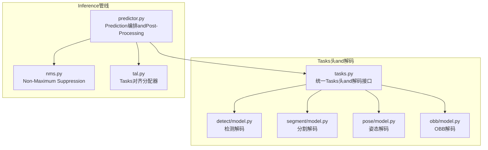
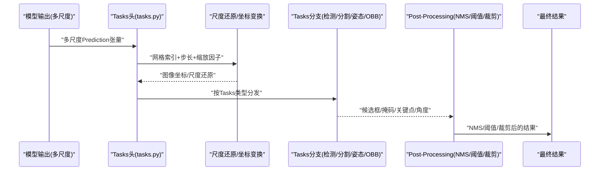
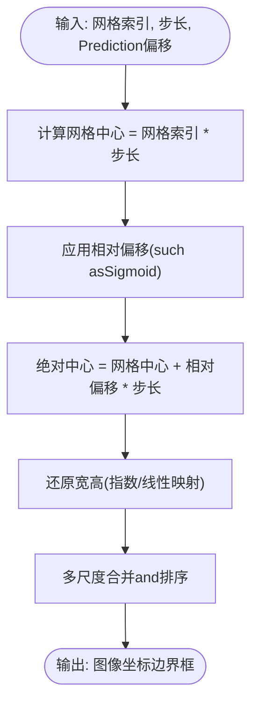
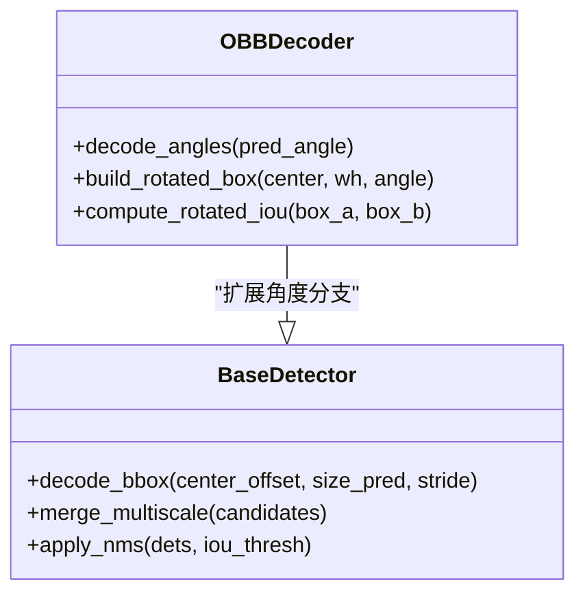
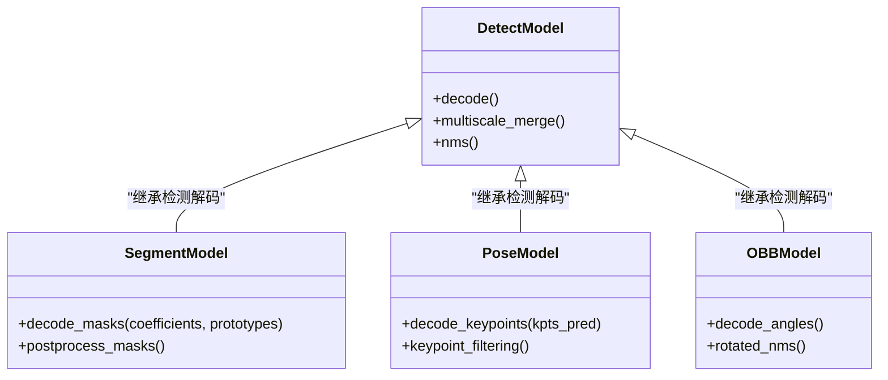
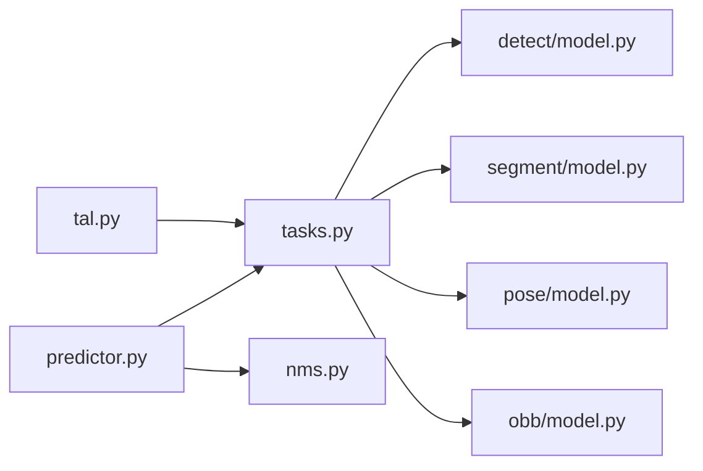

# 边界框解码算法

<cite>
**Files Referenced in This Document**
- [ultralytics/nn/tasks.py](file://ultralytics/nn/tasks.py)
- [ultralytics/engine/predictor.py](file://ultralytics/engine/predictor.py)
- [ultralytics/utils/nms.py](file://ultralytics/utils/nms.py)
- [ultralytics/utils/tal.py](file://ultralytics/utils/tal.py)
- [ultralytics/models/yolo/detect/model.py](file://ultralytics/models/yolo/detect/model.py)
- [ultralytics/models/yolo/segment/model.py](file://ultralytics/models/yolo/segment/model.py)
- [ultralytics/models/yolo/pose/model.py](file://ultralytics/models/yolo/pose/model.py)
- [ultralytics/models/yolo/obb/model.py](file://ultralytics/models/yolo/obb/model.py)
</cite>

## Table of Contents
1. [Introduction](#Introduction)
2. [Project Structure](#Project Structure)
3. [Core Components](#Core Components)
4. [Architecture Overview](#Architecture Overview)
5. [Detailed Component Analysis](#Detailed Component Analysis)
6. [Dependency Analysis](#Dependency Analysis)
7. [性能考量](#性能考量)
8. [Troubleshooting Guide](#Troubleshooting Guide)
9. [Conclusion](#Conclusion)
10. [Appendix](#Appendix)

## Introduction
本技术Documentation聚焦于YOLO-Master的边界框解码算法，系统阐述从模型Predictionto图像坐标的完整转换流程、多尺度特征图上的尺度还原机制、角度计算and旋转边界框（OBB）处理逻辑，Centered onand检测、分割、Pose Estimationetc.不同Tasks的差异化解码策略。同时对比锚框（Anchor-based）and无锚框（Anchor-free）方法的解码差异，并provides解码参数配置指南and精度Validation方法。

## Project Structure
围绕边界框解码的关键代码主要分布whileCentered on下Modules：
- Tasks头and解码入口：负责将网络输出转换for边界框、类别概率、掩码或关键点etc.目标级结果
- Inference管线：whilePrediction阶段组织多尺度输出、执行NMSandNon-Maximum SuppressionPost-Processing
- 工具库：providesNMS、TAL（TaskAlignedAssigner）etc.通用算子and分配策略
- 各Tasks模型：Encapsulates特定Tasks的解码分支（such as分割掩码、姿态关键点、OBB角度）

Figure Source
- [ultralytics/nn/tasks.py](file://ultralytics/nn/tasks.py)
- [ultralytics/models/yolo/detect/model.py](file://ultralytics/models/yolo/detect/model.py)
- [ultralytics/models/yolo/segment/model.py](file://ultralytics/models/yolo/segment/model.py)
- [ultralytics/models/yolo/pose/model.py](file://ultralytics/models/yolo/pose/model.py)
- [ultralytics/models/yolo/obb/model.py](file://ultralytics/models/yolo/obb/model.py)
- [ultralytics/engine/predictor.py](file://ultralytics/engine/predictor.py)
- [ultralytics/utils/nms.py](file://ultralytics/utils/nms.py)
- [ultralytics/utils/tal.py](file://ultralytics/utils/tal.py)

Section Source
- [ultralytics/nn/tasks.py](file://ultralytics/nn/tasks.py)
- [ultralytics/engine/predictor.py](file://ultralytics/engine/predictor.py)
- [ultralytics/utils/nms.py](file://ultralytics/utils/nms.py)
- [ultralytics/utils/tal.py](file://ultralytics/utils/tal.py)
- [ultralytics/models/yolo/detect/model.py](file://ultralytics/models/yolo/detect/model.py)
- [ultralytics/models/yolo/segment/model.py](file://ultralytics/models/yolo/segment/model.py)
- [ultralytics/models/yolo/pose/model.py](file://ultralytics/models/yolo/pose/model.py)
- [ultralytics/models/yolo/obb/model.py](file://ultralytics/models/yolo/obb/model.py)

## Core Components
- 统一Tasks头and解码接口：定义不同Tasks（检测、分割、姿态、OBB）共享的解码入口and数据契约，确保多尺度输出的拼接and归一化一致
- 多尺度融合and尺度还原：将P3/P4/P5etc.多尺度特征图上的Prediction进行上采样and拼接，按步长映射回原图尺寸
- 坐标变换and边界框重建：将网格相对偏移and尺度因子Combining，恢复for图像绝对坐标；对OBB额外引入角度计算
- Tasks差异化解码：
  - 检测：仅输出中心偏移、宽高and类别分数
  - 分割：while检测基础上附加掩码系数，用于重建实例掩码
  - 姿态：while检测基础上附加关键点坐标
  - OBB：while检测基础上附加角度，Supporting旋转框
- Post-Processing：NMS去重、Confidence Threshold过滤、坐标裁剪至图像边界

Section Source
- [ultralytics/nn/tasks.py](file://ultralytics/nn/tasks.py)
- [ultralytics/models/yolo/detect/model.py](file://ultralytics/models/yolo/detect/model.py)
- [ultralytics/models/yolo/segment/model.py](file://ultralytics/models/yolo/segment/model.py)
- [ultralytics/models/yolo/pose/model.py](file://ultralytics/models/yolo/pose/model.py)
- [ultralytics/models/yolo/obb/model.py](file://ultralytics/models/yolo/obb/model.py)

## Architecture Overview
下图展示了从模型输出to最终检测结果的整体流程，包括多尺度解码、坐标还原、NMSandTasks特定分支。

Figure Source
- [ultralytics/nn/tasks.py](file://ultralytics/nn/tasks.py)
- [ultralytics/engine/predictor.py](file://ultralytics/engine/predictor.py)
- [ultralytics/utils/nms.py](file://ultralytics/utils/nms.py)

## Detailed Component Analysis

### 坐标变换and尺度还原
- 网格and步长：每个特征图对应固定步长（stride），网格单元中心位置由网格索引and步长相乘得to
- 相对偏移：Prediction的中心偏移通常Centered onSigmoid或类似函数约束while[0,1]区间，表示相对于网格中心的相对位移
- 尺度还原：将相对偏移and步长相乘并加上网格中心，得to图像绝对坐标；宽高同样Via指数或线性映射还原
- 多尺度融合：将P3/P4/P5etc.尺度的候选框合并，并按置信度排序后进行NMS

Figure Source
- [ultralytics/nn/tasks.py](file://ultralytics/nn/tasks.py)
- [ultralytics/models/yolo/detect/model.py](file://ultralytics/models/yolo/detect/model.py)

Section Source
- [ultralytics/nn/tasks.py](file://ultralytics/nn/tasks.py)
- [ultralytics/models/yolo/detect/model.py](file://ultralytics/models/yolo/detect/model.py)

### 角度计算and旋转边界框（OBB）
- 角度Prediction：OBBwhile检测基础上增加角度通道，角度通常Centered on周期性激活函数（such as正弦/余弦编码）保证连续性
- 旋转框构建：基于中心、宽高and角度生成四个顶点，或while后续Visualization/Evaluation中按需unfold
- 特殊解码逻辑：角度需and方向一致性约束Combined with，避免±π跳变；NMS时需Uses旋转框IoU

Figure Source
- [ultralytics/models/yolo/obb/model.py](file://ultralytics/models/yolo/obb/model.py)
- [ultralytics/nn/tasks.py](file://ultralytics/nn/tasks.py)

Section Source
- [ultralytics/models/yolo/obb/model.py](file://ultralytics/models/yolo/obb/model.py)
- [ultralytics/nn/tasks.py](file://ultralytics/nn/tasks.py)

### Tasks差异化解码策略
- 检测（Detect）：解码中心、宽高and类别分数；多尺度合并andNMS
- 分割（Segment）：while检测基础上解码掩码系数，Combining原型掩码重建实例掩码
- 姿态（Pose）：while检测基础上解码关键点坐标，并进行关键点级别的NMS或筛选
- OBB：while检测基础上解码角度，构建旋转框并采用旋转IoU

Figure Source
- [ultralytics/models/yolo/detect/model.py](file://ultralytics/models/yolo/detect/model.py)
- [ultralytics/models/yolo/segment/model.py](file://ultralytics/models/yolo/segment/model.py)
- [ultralytics/models/yolo/pose/model.py](file://ultralytics/models/yolo/pose/model.py)
- [ultralytics/models/yolo/obb/model.py](file://ultralytics/models/yolo/obb/model.py)

Section Source
- [ultralytics/models/yolo/detect/model.py](file://ultralytics/models/yolo/detect/model.py)
- [ultralytics/models/yolo/segment/model.py](file://ultralytics/models/yolo/segment/model.py)
- [ultralytics/models/yolo/pose/model.py](file://ultralytics/models/yolo/pose/model.py)
- [ultralytics/models/yolo/obb/model.py](file://ultralytics/models/yolo/obb/model.py)

### 锚框机制and无锚框解码差异
- 锚框（Anchor-based）：预定义一组先验框，解码时Prediction相对偏移and类别；优势while于对小目标更稳定，但需要调参且可能引入冗余
- 无锚框（Anchor-free）：直接Prediction中心偏移and宽高，无需先验框；简化了超参数量，提升泛化性，适合端to端Optimization
- YOLO-Master默认采用无锚框策略，减少锚框相关超参，提高部署andTraining稳定性

Section Source
- [ultralytics/nn/tasks.py](file://ultralytics/nn/tasks.py)
- [ultralytics/models/yolo/detect/model.py](file://ultralytics/models/yolo/detect/model.py)

### 解码参数配置指南
- 网格大小and步长：根据特征图分辨率设置，常见步长for8/16/32，分别对应P3/P4/P5
- 缩放因子：控制宽高还原的尺度范围，影响小目标的敏感度and大目标的覆盖度
- Confidence Threshold：过滤低置信度候选框，平衡召回and误检
- IoU阈值：NMS的去重强度，过大易漏检，过小保留重复框
- 角度阈值（OBB）：旋转框方向一致性约束，避免角度跳变导致的框不稳定

Section Source
- [ultralytics/nn/tasks.py](file://ultralytics/nn/tasks.py)
- [ultralytics/engine/predictor.py](file://ultralytics/engine/predictor.py)

### 解码精度Validationand误差分析
- 坐标误差：比较解码后的中心and宽高and标注的真实框，计算L1/L2误差分布
- IoU误差：统计真实框andPrediction框的IoU偏差，识别系统性偏置
- 角度误差（OBB）：计算角度差（考虑周期性），分析方向一致性
- 多尺度贡献：分解P3/P4/P5的贡献比例，定位尺度选择问题
- 阈值敏感性：扫描置信度andIoU阈值，绘制PR曲线and误差热力图

Section Source
- [ultralytics/utils/nms.py](file://ultralytics/utils/nms.py)
- [ultralytics/utils/tal.py](file://ultralytics/utils/tal.py)

## Dependency Analysis
- tasks.py作for统一Tasks头，被各Tasks模型引用，provides一致的解码接口
- predictor.pywhileInference阶段CallsTasks头andNMS，组织多尺度输出andPost-Processing
- tal.pyprovidesTasks对齐分配器，辅助Training阶段的正负样本分配，间接影响解码质量

Figure Source
- [ultralytics/nn/tasks.py](file://ultralytics/nn/tasks.py)
- [ultralytics/engine/predictor.py](file://ultralytics/engine/predictor.py)
- [ultralytics/utils/nms.py](file://ultralytics/utils/nms.py)
- [ultralytics/utils/tal.py](file://ultralytics/utils/tal.py)
- [ultralytics/models/yolo/detect/model.py](file://ultralytics/models/yolo/detect/model.py)
- [ultralytics/models/yolo/segment/model.py](file://ultralytics/models/yolo/segment/model.py)
- [ultralytics/models/yolo/pose/model.py](file://ultralytics/models/yolo/pose/model.py)
- [ultralytics/models/yolo/obb/model.py](file://ultralytics/models/yolo/obb/model.py)

Section Source
- [ultralytics/nn/tasks.py](file://ultralytics/nn/tasks.py)
- [ultralytics/engine/predictor.py](file://ultralytics/engine/predictor.py)
- [ultralytics/utils/nms.py](file://ultralytics/utils/nms.py)
- [ultralytics/utils/tal.py](file://ultralytics/utils/tal.py)
- [ultralytics/models/yolo/detect/model.py](file://ultralytics/models/yolo/detect/model.py)
- [ultralytics/models/yolo/segment/model.py](file://ultralytics/models/yolo/segment/model.py)
- [ultralytics/models/yolo/pose/model.py](file://ultralytics/models/yolo/pose/model.py)
- [ultralytics/models/yolo/obb/model.py](file://ultralytics/models/yolo/obb/model.py)

## 性能考量
- 多尺度并行解码：利用GPU并行特性，同时对P3/P4/P5进行解码and合并
- NMSOptimization：采用向量化implementingand近似IoU加速，降低Post-Processing延迟
- 内存管理：and时释放中间张量，避免多尺度合并时的峰值内存
- 精度-速度权衡：调整阈值andIoU，平衡召回率andInference时间

## Troubleshooting Guide
- 坐标越界：检查步长and缩放因子是否匹配输入图像尺寸，确保坐标裁剪正确
- 角度异常（OBB）：确认角度激活函数and周期性约束，避免±π跳变
- NMS失效：检查IoU阈值andConfidence Threshold组合，必要时调整Tasks特定的NMS策略
- 多尺度不平衡：分析P3/P4/P5的贡献，适当调整权重或缩放因子

Section Source
- [ultralytics/utils/nms.py](file://ultralytics/utils/nms.py)
- [ultralytics/models/yolo/obb/model.py](file://ultralytics/models/yolo/obb/model.py)

## Conclusion
YOLO-Master的边界框解码算法Centered on无锚框for核心，Combining多尺度特征图and统一的解码接口，implementing了检测、分割、姿态andOBB的统一框架。Via合理的坐标变换、尺度还原andTasks差异化处理，系统while精度and效率之间取得良好平衡。未来可进一步OptimizationNMSand角度一致性约束，Centered on提升复杂场景下的鲁棒性。

## Appendix
- 术语表：
  - 步长（Stride）：特征图to原图的缩放比例
  - 网格索引（Grid Index）：特征图上每个单元的行列号
  - 相对偏移（Relative Offset）：Prediction的中心偏移，通常约束while[0,1]
  - 旋转框（Rotated Box）：包含角度的边界框，适用于密集排列and倾斜目标
- Refer toimplementing路径：
  - 统一Tasks头and解码接口：[ultralytics/nn/tasks.py](file://ultralytics/nn/tasks.py)
  - 检测解码：[ultralytics/models/yolo/detect/model.py](file://ultralytics/models/yolo/detect/model.py)
  - 分割解码：[ultralytics/models/yolo/segment/model.py](file://ultralytics/models/yolo/segment/model.py)
  - 姿态解码：[ultralytics/models/yolo/pose/model.py](file://ultralytics/models/yolo/pose/model.py)
  - OBB解码：[ultralytics/models/yolo/obb/model.py](file://ultralytics/models/yolo/obb/model.py)
  - Inference编排andPost-Processing：[ultralytics/engine/predictor.py](file://ultralytics/engine/predictor.py)
  - NMSimplementing：[ultralytics/utils/nms.py](file://ultralytics/utils/nms.py)
  - Tasks对齐分配器：[ultralytics/utils/tal.py](file://ultralytics/utils/tal.py)