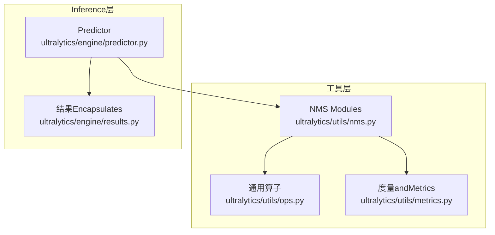
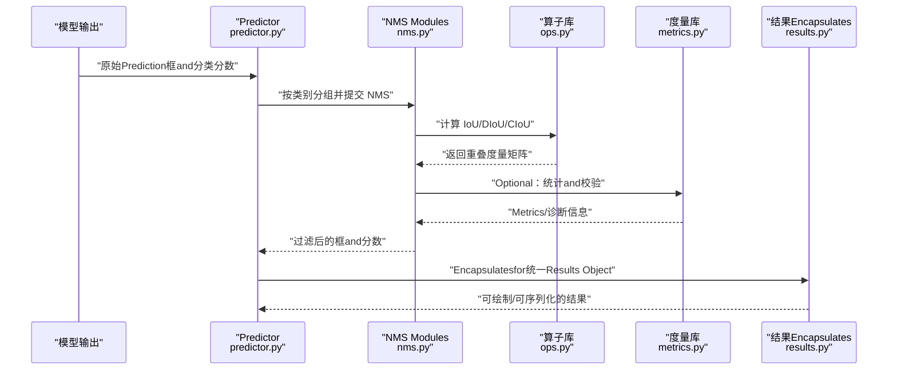
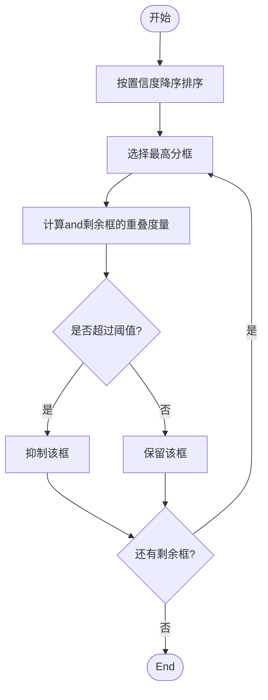
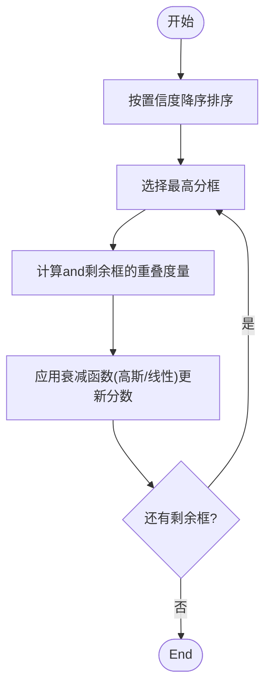
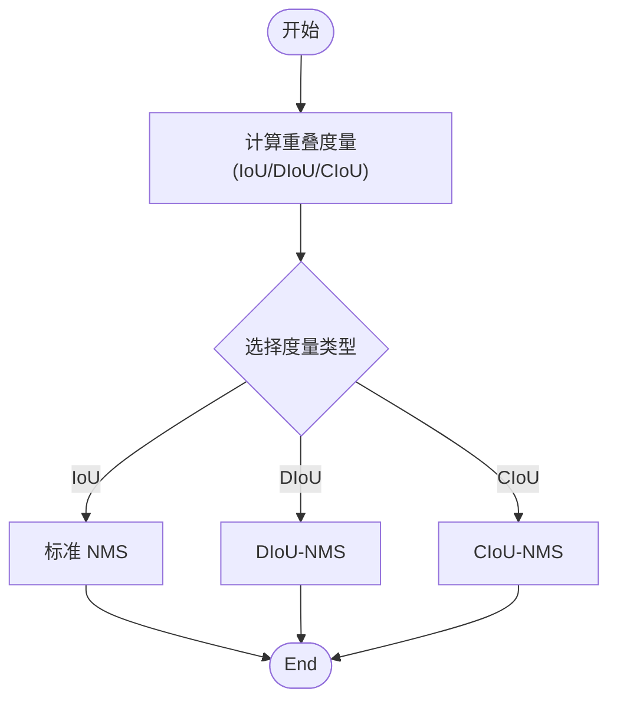
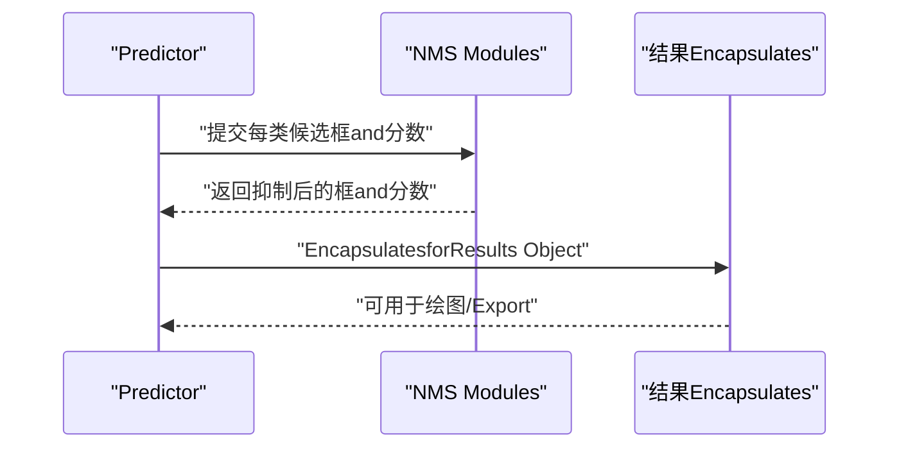
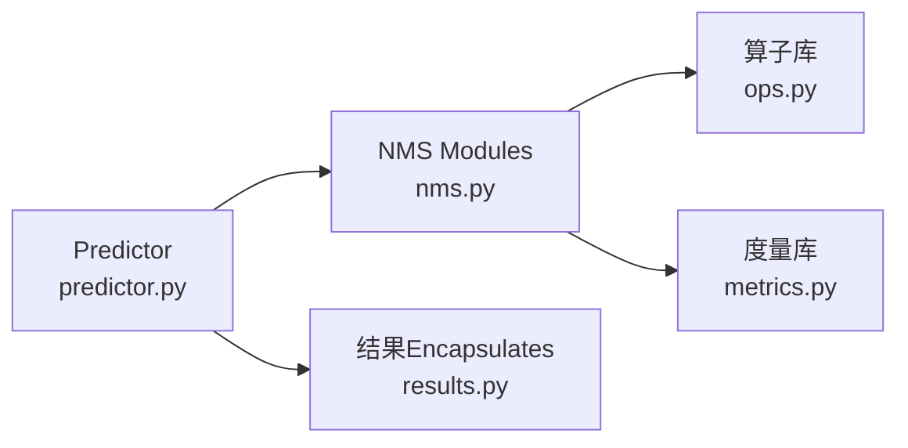

# Non-Maximum Suppression算法

<cite>
**Files Referenced in This Document**
- [nms.py](file://ultralytics/utils/nms.py)
- [ops.py](file://ultralytics/utils/ops.py)
- [metrics.py](file://ultralytics/utils/metrics.py)
- [predictor.py](file://ultralytics/engine/predictor.py)
- [results.py](file://ultralytics/engine/results.py)
</cite>

## Table of Contents
1. [Introduction](#Introduction)
2. [Project Structure](#Project Structure)
3. [Core Components](#Core Components)
4. [Architecture Overview](#Architecture Overview)
5. [Detailed Component Analysis](#Detailed Component Analysis)
6. [Dependency Analysis](#Dependency Analysis)
7. [性能考量](#性能考量)
8. [Troubleshooting Guide](#Troubleshooting Guide)
9. [Conclusion](#Conclusion)
10. [Appendix](#Appendix)

## Introduction
本技术Documentation聚焦于 YOLO-Master 中的Non-Maximum Suppression（NMS）相关implementingandUses，覆盖标准 NMS、软 NMS（Soft-NMS）、Centered onand基于距离and形状增强的 IoU 变体（DIoU-NMS、CIoU-NMS）。Documentation从算法原理、代码级流程、参数调优to集成and基准测试provides系统化说明，帮助读者while不同场景（小目标、密集目标etc.）下选择合适的 NMS 策略并Optimization检测质量and速度。

## Project Structure
YOLO-Master 的 NMS 相关逻辑主要位于工具层andInference引擎中：
- 工具层：Encapsulates了 NMS 计算、IoU 度量、批量处理and设备加速etc.通用算子
- Inference层：whilePredictionPost-Processing阶段Calls NMS 进行候选框筛选and融合
- 结果层：对 NMS 输出进行Visualizationand序列化

**Figure Source**
- [nms.py](file://ultralytics/utils/nms.py)
- [ops.py](file://ultralytics/utils/ops.py)
- [metrics.py](file://ultralytics/utils/metrics.py)
- [predictor.py](file://ultralytics/engine/predictor.py)
- [results.py](file://ultralytics/engine/results.py)

**Section Source**
- [nms.py](file://ultralytics/utils/nms.py)
- [ops.py](file://ultralytics/utils/ops.py)
- [metrics.py](file://ultralytics/utils/metrics.py)
- [predictor.py](file://ultralytics/engine/predictor.py)
- [results.py](file://ultralytics/engine/results.py)

## Core Components
- 标准 NMS：按类别分别排序置信度，迭代选择最高分框并抑制and其 IoU 超过阈值的其余框
- 软 NMS（Soft-NMS）：Via衰减函数（高斯或线性）逐步降低重叠框的置信度，避免直接丢弃导致的漏检
- DIoU-NMS / CIoU-NMS：Centered on距离或形状信息增强 IoU，提升对小目标和密集目标的抑制精度
- 批量and设备适配：Supporting CPU/GPU 张量输入，向量化计算Centered on提升吞吐

关键职责划分：
- nms.py：定义 NMS 接口and具体implementing（含 Soft-NMS、DIoU/CIoU 变体）
- ops.py：provides高效的 IoU、坐标变换、掩码/边界框操作etc.底层算子
- metrics.py：providesEvaluationMetricsand IoU 计算辅助方法
- predictor.py：while模型Inference后Calls NMS 完成最终框筛选
- results.py：将 NMS 后的检测结果Encapsulatesfor统一Results Object

**Section Source**
- [nms.py](file://ultralytics/utils/nms.py)
- [ops.py](file://ultralytics/utils/ops.py)
- [metrics.py](file://ultralytics/utils/metrics.py)
- [predictor.py](file://ultralytics/engine/predictor.py)
- [results.py](file://ultralytics/engine/results.py)

## Architecture Overview
下图展示了从模型输出to最终检测结果的端to端流程，重点标注 NMS while其中的位置and数据流向。

**Figure Source**
- [predictor.py](file://ultralytics/engine/predictor.py)
- [nms.py](file://ultralytics/utils/nms.py)
- [ops.py](file://ultralytics/utils/ops.py)
- [metrics.py](file://ultralytics/utils/metrics.py)
- [results.py](file://ultralytics/engine/results.py)

## Detailed Component Analysis

### 标准 NMS 算法
- 输入：每类的候选框集合and其置信度分数
- 步骤：
  - 按置信度降序排序
  - 选取当前最高分框作for保留框
  - 计算该框and其他剩余框的重叠度量（默认 IoU）
  - 若重叠度量超过阈值，则抑制（删除）对应框
  - 重复直至所有框处理完毕
- 复杂度：通常for O(N^2)，可Via批量化and向量化Optimization
- Applicable Scenarios：一般Object Detection、中etc.密度场景

**Figure Source**
- [nms.py](file://ultralytics/utils/nms.py)
- [ops.py](file://ultralytics/utils/ops.py)

**Section Source**
- [nms.py](file://ultralytics/utils/nms.py)
- [ops.py](file://ultralytics/utils/ops.py)

### 软 NMS（Soft-NMS）
- 改进动机：标准 NMS 会直接丢弃高重叠框，易造成漏检；Soft-NMS Via衰减函数逐步降低重叠框的置信度
- 衰减函数：
  - 高斯衰减：随 IoU 增加平滑降低分数，减少“硬截断”带来的误判
  - 线性衰减：简单线性下降，计算开销更低
- 流程差异：不再直接删除框，而是更新其置信度；后续仍按置信度排序继续抑制
- Applicable Scenarios：密集目标、遮挡严重、小目标较多的场景

**Figure Source**
- [nms.py](file://ultralytics/utils/nms.py)
- [ops.py](file://ultralytics/utils/ops.py)

**Section Source**
- [nms.py](file://ultralytics/utils/nms.py)
- [ops.py](file://ultralytics/utils/ops.py)

### DIoU-NMS and CIoU-NMS
- DIoU-NMS：while IoU 基础上引入中心点距离惩罚，使重叠度量更关注框间相对位置，有利于小目标and近距离重叠
- CIoU-NMS：进一步考虑长宽比一致性，综合重叠面积、中心距离and形状相似性，抑制更稳健
- 优势：
  - 对小目标更敏感，能更好区分相邻但不同对象的框
  - while密集场景中减少误抑制，提高召回率
- 代价：计算略高于标准 IoU，需权衡精度and速度

**Figure Source**
- [nms.py](file://ultralytics/utils/nms.py)
- [ops.py](file://ultralytics/utils/ops.py)
- [metrics.py](file://ultralytics/utils/metrics.py)

**Section Source**
- [nms.py](file://ultralytics/utils/nms.py)
- [ops.py](file://ultralytics/utils/ops.py)
- [metrics.py](file://ultralytics/utils/metrics.py)

### Predictorand NMS 的集成
- Predictorwhile模型输出后进行Post-Processing，包括：
  - 按类别分组
  - Calls NMS 执行抑制
  - 将结果Encapsulatesfor统一对象供VisualizationandExport
- 关键点：
  - 类别维度的独立抑制，避免跨类干扰
  - Confidence Thresholdand IoU 阈值的组合控制最终输出数量and质量

**Figure Source**
- [predictor.py](file://ultralytics/engine/predictor.py)
- [nms.py](file://ultralytics/utils/nms.py)
- [results.py](file://ultralytics/engine/results.py)

**Section Source**
- [predictor.py](file://ultralytics/engine/predictor.py)
- [nms.py](file://ultralytics/utils/nms.py)
- [results.py](file://ultralytics/engine/results.py)

## Dependency Analysis
- NMS Modules依赖算子库进行高效几何计算（such as IoU、坐标变换）
- 度量库provides IoU 计算andEvaluationMetrics，便于调试and对比
- Predictor负责编排 NMS Callsand结果Encapsulates
- Results Object承载 NMS 后的检测框、类别and置信度，供下游TasksUses

**Figure Source**
- [predictor.py](file://ultralytics/engine/predictor.py)
- [nms.py](file://ultralytics/utils/nms.py)
- [ops.py](file://ultralytics/utils/ops.py)
- [metrics.py](file://ultralytics/utils/metrics.py)
- [results.py](file://ultralytics/engine/results.py)

**Section Source**
- [predictor.py](file://ultralytics/engine/predictor.py)
- [nms.py](file://ultralytics/utils/nms.py)
- [ops.py](file://ultralytics/utils/ops.py)
- [metrics.py](file://ultralytics/utils/metrics.py)
- [results.py](file://ultralytics/engine/results.py)

## 性能考量
- 时间复杂度：标准 NMS for O(N^2)，Soft-NMS 类似；DIoU/CIoU 相较 IoU 有额外计算开销
- 并行化and向量化：利用 GPU 张量运算and批处理可降低延迟
- 阈值策略：
  - IoU 阈值越高，抑制越激进，可能降低召回
  - Confidence Threshold越高，输出越少，可能影响小目标召回
- 场景建议：
  - 小目标：优先尝试 DIoU/CIoU-NMS and较低 IoU 阈值
  - 密集目标：Soft-NMS Combined with适度 IoU 阈值，平衡召回and误检
  - 实时系统：标准 NMS + 合理阈值，保证速度

[This section provides general guidance and does not directly analyze specific files]

## Troubleshooting Guide
- 常见问题：
  - 输出框过少：检查Confidence Thresholdand IoU 阈值是否过高
  - 同一目标多次出现：降低 IoU 阈值或改用 Soft-NMS
  - 小目标漏检：尝试 DIoU/CIoU-NMS 并调整阈值
- 定位方法：
  - 打印每类候选框数量and抑制前后变化
  - 记录被抑制框的 IoU 分布，观察阈值是否过于严格
  - 对比不同 NMS 变体的 mAP and速度

**Section Source**
- [nms.py](file://ultralytics/utils/nms.py)
- [ops.py](file://ultralytics/utils/ops.py)
- [metrics.py](file://ultralytics/utils/metrics.py)

## Conclusion
YOLO-Master 的 NMS 体系provides了从标准 NMS to Soft-NMS and DIoU/CIoU 变体的完整方案，Combining算子库的高效implementingandPredictor的良好集成，能够覆盖多种检测场景。Via合理的参数调优and变体选择，可while精度and速度之间取得平衡，尤其while小目标and密集目标场景中表现更佳。

[This section is summary content and does not directly analyze specific files]

## Appendix

### 参数调优指南
- IoU 阈值：
  - 标准 NMS：通常 0.45–0.6
  - Soft-NMS：可略低，Combined with衰减系数
  - DIoU/CIoU：可略低于 IoU，因度量更敏感
- Confidence Threshold：
  - 根据数据集and部署需求设定，兼顾召回and误检
- 类别维度：
  - 确保按类别独立抑制，避免跨类干扰

[This section provides general guidance and does not directly analyze specific files]

### 自定义 NMS 集成方法
- while NMS Modules中扩展新的抑制策略（such as加权 NMS、自适应阈值）
- 复用算子库的几何计算capabilities，保持接口一致
- whilePredictor中注册新策略，并while结果Encapsulates中保持一致的输出格式

[This section provides general guidance and does not directly analyze specific files]

### 性能基准测试建议
- Metrics：mAP、FPS、内存占用
- 场景：小目标、密集目标、遮挡严重
- 方法：固定模型权重，仅切换 NMS 变体and参数，记录对比结果

[This section provides general guidance and does not directly analyze specific files]