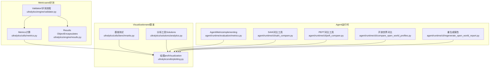
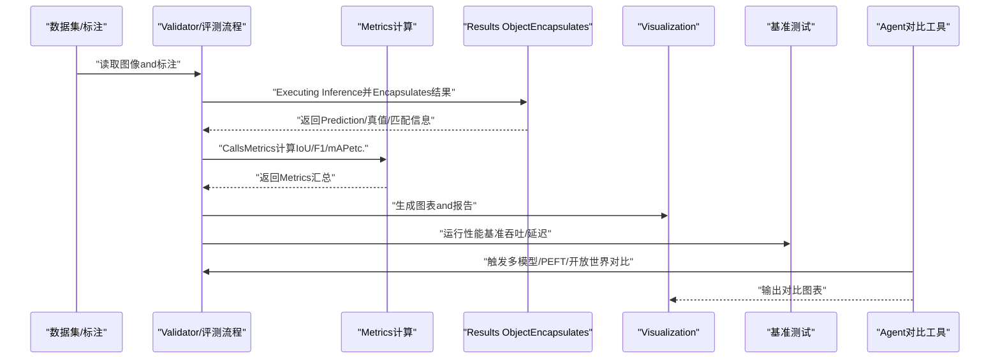
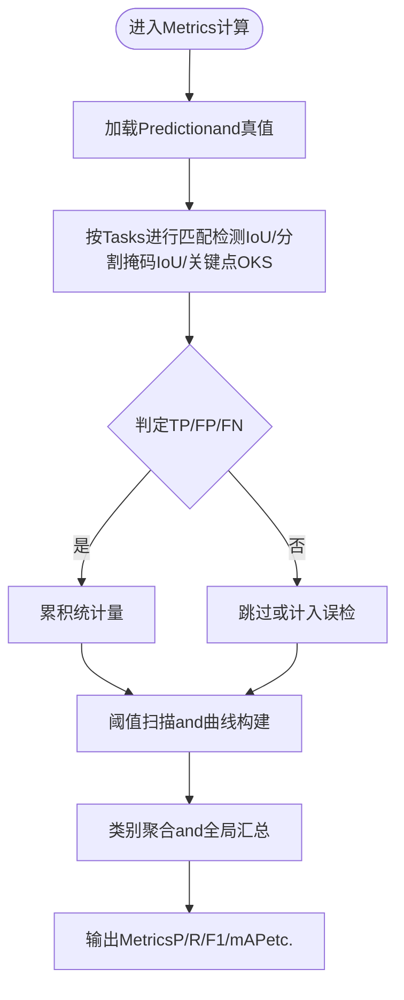
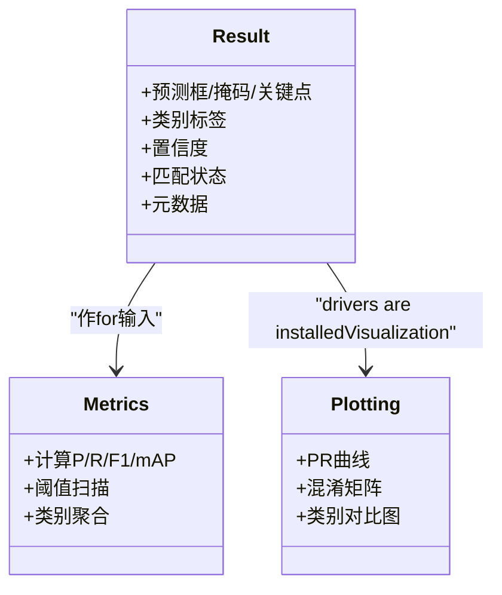
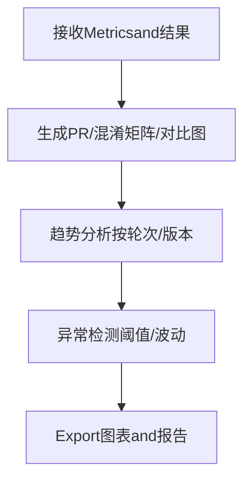
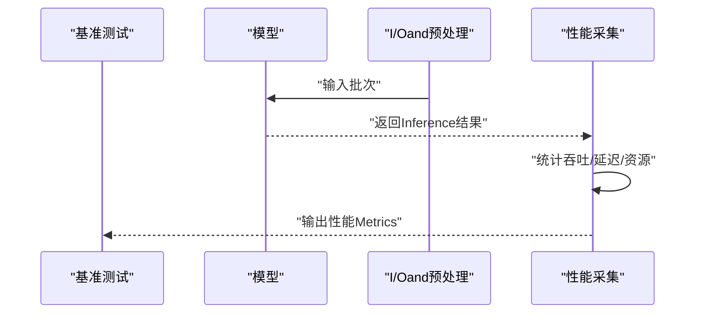
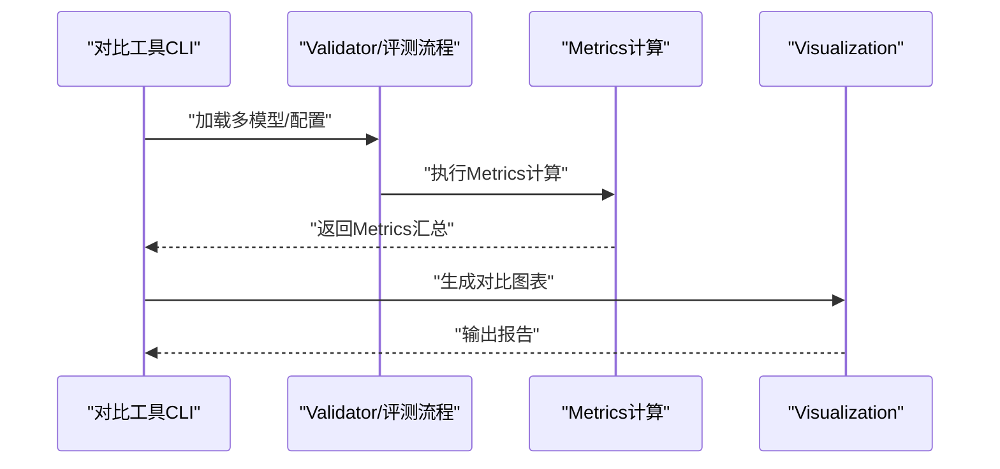
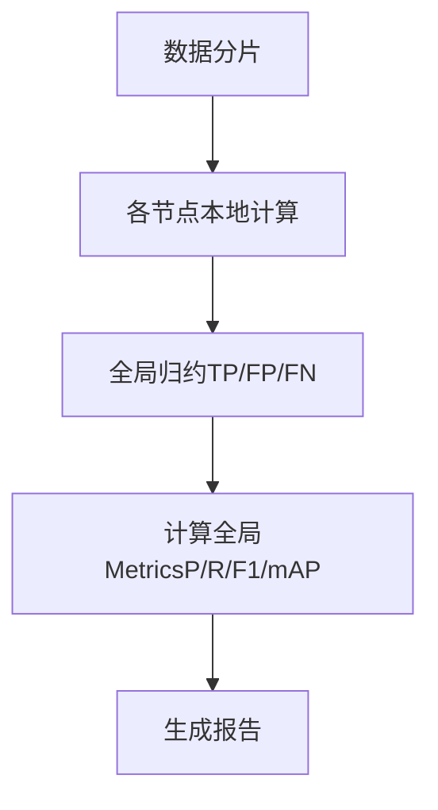
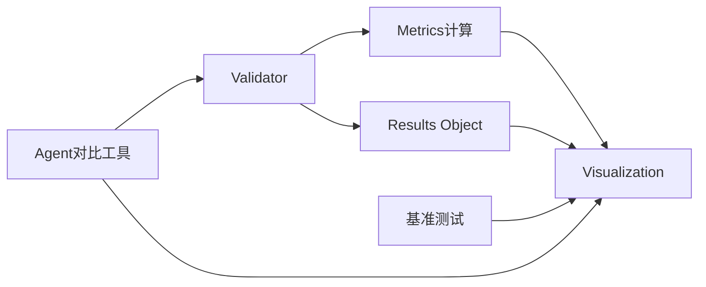

# 分析and统计

<cite>
**Files Referenced in This Document**
- [metrics.py](file://ultralytics/utils/metrics.py)
- [validator.py](file://ultralytics/engine/validator.py)
- [results.py](file://ultralytics/engine/results.py)
- [plotting.py](file://ultralytics/utils/plotting.py)
- [benchmarks.py](file://ultralytics/utils/benchmarks.py)
- [analytics.py](file://ultralytics/solutions/analytics.py)
- [metrics.py](file://agent/runtime/evaluation/metrics.py)
- [sahi_compare.py](file://agent/runtime/cli/sahi_compare.py)
- [peft_compare.py](file://agent/runtime/cli/peft_compare.py)
- [compare_open_world_profiles.py](file://agent/runtime/cli/compare_open_world_profiles.py)
- [regenerate_open_world_report.py](file://agent/runtime/cli/regenerate_open_world_report.py)
</cite>

## Table of Contents
1. [Introduction](#Introduction)
2. [Project Structure](#Project Structure)
3. [Core Components](#Core Components)
4. [Architecture Overview](#Architecture Overview)
5. [Detailed Component Analysis](#Detailed Component Analysis)
6. [Dependency Analysis](#Dependency Analysis)
7. [性能考量](#性能考量)
8. [Troubleshooting Guide](#Troubleshooting Guide)
9. [Conclusion](#Conclusion)
10. [Appendix](#Appendix)

## Introduction
本技术Documentation聚焦于YOLO-Master的结果分析and统计系统，围绕Centered on下目标unfold：
- 结果统计分析的核心功能：准确率、召回率、F1分数andmAPMetrics计算
- 不同检测Tasks的评价Metrics体系：Object Detection的IoU、Instance Segmentation的像素级精度、Pose Estimation的关键点匹配
- 结果对比分析工具：多模型比较and性能基准测试
- 统计数据Visualization：图表生成、趋势分析and异常检测
- 自定义评价Metrics开发接口：targeting业务场景的Evaluation标准扩展
- 大规模数据集的分布式统计计算：MapReduce模式and并行聚合
- 结果质量Evaluationand置信度校准工具
- 统计显著性检验and假设Validation方法

## Project Structure
and“分析and统计”相关的代码主要分布whilesuch as下Modules：
- Metrics计算and评测引擎：ultralytics/utils/metrics.py、ultralytics/engine/validator.py
- Inference结果EncapsulatesandPost-Processing：ultralytics/engine/results.py
- Visualizationand绘图：ultralytics/utils/plotting.py
- 基准测试and速度评测：ultralytics/utils/benchmarks.py
- 解决方案层分析工具：ultralytics/solutions/analytics.py
- Agent运行时Evaluationand对比脚本：agent/runtime/evaluation/metrics.py、agent/runtime/cli/*

Figure Source
- [metrics.py](file://ultralytics/utils/metrics.py)
- [validator.py](file://ultralytics/engine/validator.py)
- [results.py](file://ultralytics/engine/results.py)
- [plotting.py](file://ultralytics/utils/plotting.py)
- [benchmarks.py](file://ultralytics/utils/benchmarks.py)
- [analytics.py](file://ultralytics/solutions/analytics.py)
- [metrics.py](file://agent/runtime/evaluation/metrics.py)
- [sahi_compare.py](file://agent/runtime/cli/sahi_compare.py)
- [peft_compare.py](file://agent/runtime/cli/peft_compare.py)
- [compare_open_world_profiles.py](file://agent/runtime/cli/compare_open_world_profiles.py)
- [regenerate_open_world_report.py](file://agent/runtime/cli/regenerate_open_world_report.py)

Section Source
- [metrics.py](file://ultralytics/utils/metrics.py)
- [validator.py](file://ultralytics/engine/validator.py)
- [results.py](file://ultralytics/engine/results.py)
- [plotting.py](file://ultralytics/utils/plotting.py)
- [benchmarks.py](file://ultralytics/utils/benchmarks.py)
- [analytics.py](file://ultralytics/solutions/analytics.py)
- [metrics.py](file://agent/runtime/evaluation/metrics.py)
- [sahi_compare.py](file://agent/runtime/cli/sahi_compare.py)
- [peft_compare.py](file://agent/runtime/cli/peft_compare.py)
- [compare_open_world_profiles.py](file://agent/runtime/cli/compare_open_world_profiles.py)
- [regenerate_open_world_report.py](file://agent/runtime/cli/regenerate_open_world_report.py)

## Core Components
本节概述结果分析and统计系统的核心capabilitiesand职责划分。

- Metrics计算and评测引擎
  - 负责各类Tasks的Metrics计算：Object Detection（Precision、Recall、F1、mAP）、Instance Segmentation（像素级IoU、mAP）、Pose Estimation（关键点匹配、OKSetc.）
  - provides阈值扫描、类别聚合、跨数据集汇总etc.capabilities
  - Refer to路径：[Metrics计算](file://ultralytics/utils/metrics.py)、[Validator/评测流程](file://ultralytics/engine/validator.py)

- Results ObjectEncapsulates
  - 统一EncapsulatesPrediction结果、真值标注、匹配状态、置信度分布etc.
  - for后续Metrics计算andVisualizationprovides结构化输入
  - Refer to路径：[Results ObjectEncapsulates](file://ultralytics/engine/results.py)

- Visualizationand绘图
  - 生成PR曲线、混淆矩阵、类别对比图、趋势图etc.
  - Supporting批量Exportand交互式展示
  - Refer to路径：[绘图andVisualization](file://ultralytics/utils/plotting.py)

- 基准测试and速度评测
  - provides吞吐、延迟、内存占用etc.性能基准
  - andMetrics结果联动，形成“质量+性能”的综合报告
  - Refer to路径：[基准测试](file://ultralytics/utils/benchmarks.py)

- 解决方案层分析工具
  - targeting具体业务场景的分析and洞察（such as计数、区域统计、热力图etc.）
  - Refer to路径：[分析工具（Solutions）](file://ultralytics/solutions/analytics.py)

- Agent运行时Evaluationand对比工具
  - provides多模型对比、PEFT对比、开放世界配置对比、报告重生成etc.
  - Refer to路径：
    - [AgentMetricsimplementing](file://agent/runtime/evaluation/metrics.py)
    - [SAHI对比工具](file://agent/runtime/cli/sahi_compare.py)
    - [PEFT对比工具](file://agent/runtime/cli/peft_compare.py)
    - [开放世界对比](file://agent/runtime/cli/compare_open_world_profiles.py)
    - [重生成报告](file://agent/runtime/cli/regenerate_open_world_report.py)

Section Source
- [metrics.py](file://ultralytics/utils/metrics.py)
- [validator.py](file://ultralytics/engine/validator.py)
- [results.py](file://ultralytics/engine/results.py)
- [plotting.py](file://ultralytics/utils/plotting.py)
- [benchmarks.py](file://ultralytics/utils/benchmarks.py)
- [analytics.py](file://ultralytics/solutions/analytics.py)
- [metrics.py](file://agent/runtime/evaluation/metrics.py)
- [sahi_compare.py](file://agent/runtime/cli/sahi_compare.py)
- [peft_compare.py](file://agent/runtime/cli/peft_compare.py)
- [compare_open_world_profiles.py](file://agent/runtime/cli/compare_open_world_profiles.py)
- [regenerate_open_world_report.py](file://agent/runtime/cli/regenerate_open_world_report.py)

## Architecture Overview
下图展示了从Data Loading、Inference、Metrics计算toVisualization的端to端流程，Centered onand对比and基准工具的集成位置。

Figure Source
- [validator.py](file://ultralytics/engine/validator.py)
- [metrics.py](file://ultralytics/utils/metrics.py)
- [results.py](file://ultralytics/engine/results.py)
- [plotting.py](file://ultralytics/utils/plotting.py)
- [benchmarks.py](file://ultralytics/utils/benchmarks.py)
- [sahi_compare.py](file://agent/runtime/cli/sahi_compare.py)
- [peft_compare.py](file://agent/runtime/cli/peft_compare.py)
- [compare_open_world_profiles.py](file://agent/runtime/cli/compare_open_world_profiles.py)

## Detailed Component Analysis

### Metrics计算and评测引擎
- Object DetectionMetrics
  - IoU阈值扫描and匹配策略：用于判定正负样本，支撑Precision、Recall、F1andmAP计算
  - 类别维度聚合and全局mAP汇总
- Instance SegmentationMetrics
  - 像素级掩码IoUand类别平均mAP
- Pose EstimationMetrics
  - 关键点匹配andOKS（Object Keypoint Similarity）etc.度量
- 置信度and阈值管理
  - Supporting动态阈值选择and置信度校准接口（见“置信度校准”小节）

Figure Source
- [metrics.py](file://ultralytics/utils/metrics.py)
- [validator.py](file://ultralytics/engine/validator.py)
- [results.py](file://ultralytics/engine/results.py)

Section Source
- [metrics.py](file://ultralytics/utils/metrics.py)
- [validator.py](file://ultralytics/engine/validator.py)
- [results.py](file://ultralytics/engine/results.py)

### Results ObjectEncapsulates
- 统一数据结构
  - 包含Prediction框/掩码/关键点、类别标签、置信度、匹配状态etc.
- andMetrics计算的契约
  - provides标准化的输入格式，确保不同Tasks的一致性and可复用性
- andVisualization的对接
  - 直接drivers are installed绘图Modules生成图表

Figure Source
- [results.py](file://ultralytics/engine/results.py)
- [metrics.py](file://ultralytics/utils/metrics.py)
- [plotting.py](file://ultralytics/utils/plotting.py)

Section Source
- [results.py](file://ultralytics/engine/results.py)
- [metrics.py](file://ultralytics/utils/metrics.py)
- [plotting.py](file://ultralytics/utils/plotting.py)

### Visualizationand图表生成
- PR曲线and混淆矩阵
  - Supporting多类别叠加and阈值标注
- 趋势分析and异常检测
  - 基于时间序列或迭代轮次的Metrics变化，识别退化或突变
- 批量Exportand报告整合
  - 将图表嵌入综合报告，便于归档and分享

Figure Source
- [plotting.py](file://ultralytics/utils/plotting.py)
- [analytics.py](file://ultralytics/solutions/analytics.py)

Section Source
- [plotting.py](file://ultralytics/utils/plotting.py)
- [analytics.py](file://ultralytics/solutions/analytics.py)

### 基准测试and性能评测
- 吞吐and延迟
  - while相同硬件and批大小下测量Inference耗时and吞吐量
- 资源占用
  - 记录显存/CPUUses峰值，辅助容量规划
- andMetrics联动
  - 将“质量Metrics+性能Metrics”合并呈现，形成完整评测报告

Figure Source
- [benchmarks.py](file://ultralytics/utils/benchmarks.py)

Section Source
- [benchmarks.py](file://ultralytics/utils/benchmarks.py)

### 结果对比分析工具
- SAHI切片Inference对比
  - 对比不同切片策略对Metrics的影响
- PEFT微调对比
  - 对比不同LoRA/Adapter配置下的Metrics差异
- 开放世界配置对比
  - 对比不同分类体系或Tips模板的效果
- 报告重生成
  - 基于新配置或新数据重新生成对比报告

Figure Source
- [sahi_compare.py](file://agent/runtime/cli/sahi_compare.py)
- [peft_compare.py](file://agent/runtime/cli/peft_compare.py)
- [compare_open_world_profiles.py](file://agent/runtime/cli/compare_open_world_profiles.py)
- [regenerate_open_world_report.py](file://agent/runtime/cli/regenerate_open_world_report.py)
- [validator.py](file://ultralytics/engine/validator.py)
- [metrics.py](file://ultralytics/utils/metrics.py)
- [plotting.py](file://ultralytics/utils/plotting.py)

Section Source
- [sahi_compare.py](file://agent/runtime/cli/sahi_compare.py)
- [peft_compare.py](file://agent/runtime/cli/peft_compare.py)
- [compare_open_world_profiles.py](file://agent/runtime/cli/compare_open_world_profiles.py)
- [regenerate_open_world_report.py](file://agent/runtime/cli/regenerate_open_world_report.py)
- [validator.py](file://ultralytics/engine/validator.py)
- [metrics.py](file://ultralytics/utils/metrics.py)
- [plotting.py](file://ultralytics/utils/plotting.py)

### 自定义评价Metrics开发接口
- 设计原则
  - Centered onResult对象for输入，Centered onMetrics字典for输出，保持and现有评测流程兼容
- 扩展点
  - whileMetrics计算Modules中注册新的度量函数，并whileValidator中启用
- Examples路径
  - Refer to现有Metricsimplementing的结构and契约，新增业务特定Metrics（such as领域内特殊匹配规则）

Section Source
- [metrics.py](file://ultralytics/utils/metrics.py)
- [validator.py](file://ultralytics/engine/validator.py)
- [results.py](file://ultralytics/engine/results.py)

### 大规模数据集的分布式统计计算
- MapReduce模式
  - 将数据集分片，while各节点独立计算局部Metrics，再汇聚全局结果
- 并行聚合
  - Via集合通信或进程间通信完成TP/FP/FNetc.统计量的归约
- 一致性保障
  - 确保不同节点上的匹配策略and阈值一致，避免偏差

Section Source
- [metrics.py](file://ultralytics/utils/metrics.py)
- [validator.py](file://ultralytics/engine/validator.py)

### 结果质量Evaluationand置信度校准
- 质量Evaluation
  - CombiningMetricsandVisualization，识别弱项类别and困难样本
- 置信度校准
  - Uses温度缩放或Platt缩放etc.方法调整置信度分布，提升可靠性
- 工具集成
  - whileValidator中插入校准步骤，使Metrics计算基于校准后的置信度

Section Source
- [validator.py](file://ultralytics/engine/validator.py)
- [metrics.py](file://ultralytics/utils/metrics.py)
- [plotting.py](file://ultralytics/utils/plotting.py)

### 统计显著性检验and假设Validation
- 常用方法
  - t检验、Mann-Whitney U检验、Bootstrap置信区间
- 应用场景
  - 对比两个模型或两种配置的Metrics差异是否显著
- 集成方式
  - while对比工具中自动执行显著性检验，并while报告中展示p值and效应量

Section Source
- [peft_compare.py](file://agent/runtime/cli/peft_compare.py)
- [compare_open_world_profiles.py](file://agent/runtime/cli/compare_open_world_profiles.py)
- [regenerate_open_world_report.py](file://agent/runtime/cli/regenerate_open_world_report.py)

## Dependency Analysis
- 组件耦合
  - Validator依赖Metrics计算andResults Object；Visualization依赖Metricsand结果；基准测试独立但可andValidator协作
- External Dependencies
  - 数值计算库（such asNumPy/Torch）、绘图库（such asMatplotlib/Plotly）
- Potential Cycles依赖
  - 建议Via接口抽象and事件回调解耦，避免紧耦合

Figure Source
- [validator.py](file://ultralytics/engine/validator.py)
- [metrics.py](file://ultralytics/utils/metrics.py)
- [results.py](file://ultralytics/engine/results.py)
- [plotting.py](file://ultralytics/utils/plotting.py)
- [benchmarks.py](file://ultralytics/utils/benchmarks.py)
- [sahi_compare.py](file://agent/runtime/cli/sahi_compare.py)
- [peft_compare.py](file://agent/runtime/cli/peft_compare.py)
- [compare_open_world_profiles.py](file://agent/runtime/cli/compare_open_world_profiles.py)

Section Source
- [validator.py](file://ultralytics/engine/validator.py)
- [metrics.py](file://ultralytics/utils/metrics.py)
- [results.py](file://ultralytics/engine/results.py)
- [plotting.py](file://ultralytics/utils/plotting.py)
- [benchmarks.py](file://ultralytics/utils/benchmarks.py)
- [sahi_compare.py](file://agent/runtime/cli/sahi_compare.py)
- [peft_compare.py](file://agent/runtime/cli/peft_compare.py)
- [compare_open_world_profiles.py](file://agent/runtime/cli/compare_open_world_profiles.py)

## 性能考量
- Metrics计算复杂度
  - 匹配阶段通常forO(N^2)或近似线性Optimization（排序/索引），需关注大场景下的开销
- 阈值扫描
  - 多阈值重复计算可Via缓存或向量化Optimization
- Visualization渲染
  - 大数据集下建议按需采样或降分辨率
- 基准测试
  - 预热and多次采样取稳健统计（均值/方差）

## Troubleshooting Guide
- 常见问题
  - Metrics异常：检查匹配阈值、类别映射and标注格式
  - Visualization缺失：确认Results Object字段完整性and绘图依赖
  - 对比不一致：核对不同模型的预处理andPost-Processing参数
- 定位手段
  - 启用详细Logging，输出中间统计量（TP/FP/FN）
  - Uses最小复现数据集快速Validation

Section Source
- [validator.py](file://ultralytics/engine/validator.py)
- [metrics.py](file://ultralytics/utils/metrics.py)
- [plotting.py](file://ultralytics/utils/plotting.py)

## Conclusion
YOLO-Master的结果分析and统计系统provides了覆盖多Tasks、多Metrics的完整评测capabilities，并ViaVisualizationand对比工具形成闭环。建议while工程实践中：
- 建立统一的Metrics契约andResults Object规范
- 引入置信度校准and显著性检验，提升Evaluation严谨性
- 采用分布式计算and缓存策略，应对大规模数据and高并发场景

## Appendix
- 术语表
  - IoU：交并比
  - mAP：平均精度均值
  - OKS：关键点相似度
  - PR曲线：精确率-召回率曲线
- Refer to路径
  - Metricsand评测：[Metrics计算](file://ultralytics/utils/metrics.py)、[Validator](file://ultralytics/engine/validator.py)
  - 结果andVisualization：[Results Object](file://ultralytics/engine/results.py)、[绘图](file://ultralytics/utils/plotting.py)
  - 基准and对比：[基准测试](file://ultralytics/utils/benchmarks.py)、[SAHI对比](file://agent/runtime/cli/sahi_compare.py)、[PEFT对比](file://agent/runtime/cli/peft_compare.py)、[开放世界对比](file://agent/runtime/cli/compare_open_world_profiles.py)、[报告重生成](file://agent/runtime/cli/regenerate_open_world_report.py)