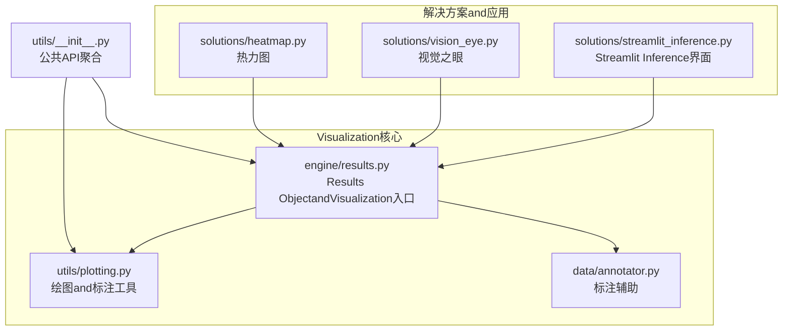
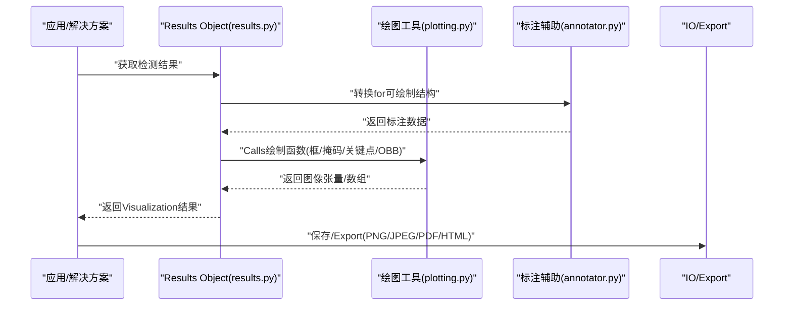
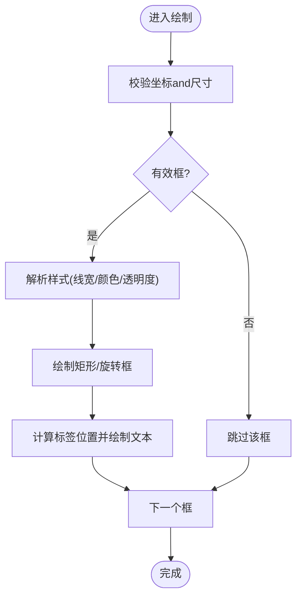
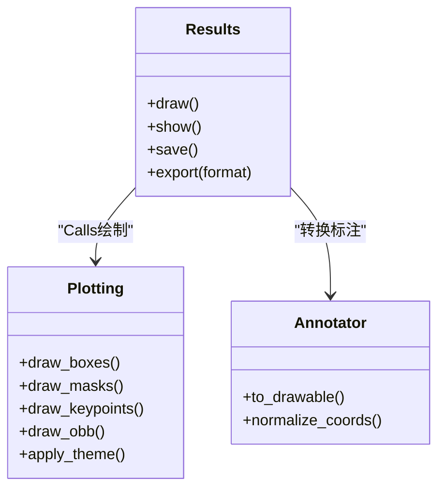
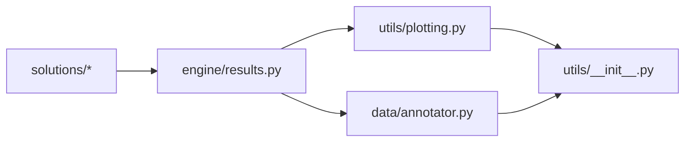

# Visualization渲染系统

<cite>
**Files Referenced in This Document**
- [ultralytics/utils/plotting.py](file://ultralytics/utils/plotting.py)
- [ultralytics/engine/results.py](file://ultralytics/engine/results.py)
- [ultralytics/solutions/streamlit_inference.py](file://ultralytics/solutions/streamlit_inference.py)
- [ultralytics/solutions/vision_eye.py](file://ultralytics/solutions/vision_eye.py)
- [ultralytics/solutions/heatmap.py](file://ultralytics/solutions/heatmap.py)
- [ultralytics/data/annotator.py](file://ultralytics/data/annotator.py)
- [ultralytics/utils/__init__.py](file://ultralytics/utils/__init__.py)
</cite>

## Table of Contents
1. [Introduction](#Introduction)
2. [Project Structure](#Project Structure)
3. [Core Components](#Core Components)
4. [Architecture Overview](#Architecture Overview)
5. [Detailed Component Analysis](#Detailed Component Analysis)
6. [Dependency Analysis](#Dependency Analysis)
7. [Performance Considerations](#Performance Considerations)
8. [Troubleshooting Guide](#Troubleshooting Guide)
9. [Conclusion](#Conclusion)
10. [Appendix](#Appendix)

## Introduction
本技术Documentation聚焦于 YOLO-Master 的Visualization渲染子系统，系统性阐述结果Visualization的核心capabilitiesandimplementing要点。内容覆盖：
- 边界框绘制引擎、标签显示系统and颜色映射机制
- 多Tasks适配：Object Detection、Instance Segmentation、Pose Estimation、旋转边界框（OBB）
- Visualization配置项：线条粗细、字体大小、颜色方案、透明度etc.
- 实时渲染Optimization：GPU acceleration渲染and批量绘制Optimization
- 交互式Visualization接口：缩放、平移、动态过滤
- Export格式：PNG、JPEG、PDF and HTML 报告生成
- 自定义样式and主题配置
- 多线程安全的渲染模式and错误处理机制

## Project Structure
Visualization渲染相关代码主要分布whileCentered on下Modules：
- 绘图and标注工具：ultralytics/utils/plotting.py
- Inference结果EncapsulatesandVisualization入口：ultralytics/engine/results.py
- 数据层标注辅助：ultralytics/data/annotator.py
- 解决方案级Visualization应用：ultralytics/solutions/*（such as Streamlit Inference、视觉之眼、热力图etc.）
- 公共 API 聚合：ultralytics/utils/__init__.py

Figure Source
- [ultralytics/utils/plotting.py](file://ultralytics/utils/plotting.py)
- [ultralytics/engine/results.py](file://ultralytics/engine/results.py)
- [ultralytics/data/annotator.py](file://ultralytics/data/annotator.py)
- [ultralytics/solutions/streamlit_inference.py](file://ultralytics/solutions/streamlit_inference.py)
- [ultralytics/solutions/vision_eye.py](file://ultralytics/solutions/vision_eye.py)
- [ultralytics/solutions/heatmap.py](file://ultralytics/solutions/heatmap.py)
- [ultralytics/utils/__init__.py](file://ultralytics/utils/__init__.py)

Section Source
- [ultralytics/utils/plotting.py](file://ultralytics/utils/plotting.py)
- [ultralytics/engine/results.py](file://ultralytics/engine/results.py)
- [ultralytics/data/annotator.py](file://ultralytics/data/annotator.py)
- [ultralytics/solutions/streamlit_inference.py](file://ultralytics/solutions/streamlit_inference.py)
- [ultralytics/solutions/vision_eye.py](file://ultralytics/solutions/vision_eye.py)
- [ultralytics/solutions/heatmap.py](file://ultralytics/solutions/heatmap.py)
- [ultralytics/utils/__init__.py](file://ultralytics/utils/__init__.py)

## Core Components
- 边界框绘制引擎
  - 负责绘制矩形框、旋转框、多边形轮廓、关键点骨架etc.基础图形元素
  - Supporting按类别或置信度选择颜色，Supporting半透明填充and描边
- 标签显示系统
  - while框角或关键点旁渲染类别名and置信度
  - Supporting字体大小、背景色、圆角、阴影etc.样式选项
- 颜色映射机制
  - 基于类别索引或语义信息生成稳定配色
  - provides预设主题and自定义调色板扩展点
- 多Tasks适配
  - Object Detection：轴对齐矩形框
  - Instance Segmentation：多边形掩码叠加and轮廓描边
  - Pose Estimation：关键点连线and关节标记
  - 旋转边界框（OBB）：角度化矩形绘制and方向指示
- 配置and主题
  - 统一配置对象管理线条粗细、字体大小、透明度、颜色方案etc.
  - Supporting运行时切换主题and局部覆盖
- Exportand交互
  - Exporting to PNG/JPEG/PDF etc.格式
  - Via解决方案层集成缩放、平移、动态过滤etc.交互capabilities

Section Source
- [ultralytics/utils/plotting.py](file://ultralytics/utils/plotting.py)
- [ultralytics/engine/results.py](file://ultralytics/engine/results.py)
- [ultralytics/data/annotator.py](file://ultralytics/data/annotator.py)

## Architecture Overview
Visualization渲染采用“Results Objectdrivers are installed + 绘图工具库”的分层架构：
- 上层：InferenceResults Object（results.py）持有检测结果、分割掩码、关键点、旋转框etc.结构化数据，并provides统一的Visualization方法
- 中层：绘图工具库（plotting.py）provides通用绘制原语（线、面、文本、颜色映射），并Encapsulates多Tasks绘制逻辑
- 下层：标注辅助（annotator.py）provides数据to绘图的中间表示转换
- Application Layer：解决方案（solutions/*）将Visualization嵌入to Streamlit、Web 或批处理流程中，provides交互andExportcapabilities

Figure Source
- [ultralytics/engine/results.py](file://ultralytics/engine/results.py)
- [ultralytics/utils/plotting.py](file://ultralytics/utils/plotting.py)
- [ultralytics/data/annotator.py](file://ultralytics/data/annotator.py)

## Detailed Component Analysis

### 边界框绘制引擎
- 功能要点
  - 绘制轴对齐矩形框and旋转矩形框（OBB）
  - Supporting边框宽度、颜色、透明度、是否填充
  - 自动计算文本位置and背景遮罩，避免遮挡关键区域
- 复杂度andOptimization
  - 批量绘制时Prefer向量化操作减少 Python 循环开销
  - 对高分辨率图像进行按需缩放Centered on降低内存占用
- 错误处理
  - 坐标越界裁剪and无效框过滤
  - 缺失类别或置信度时的降级策略

Figure Source
- [ultralytics/utils/plotting.py](file://ultralytics/utils/plotting.py)

Section Source
- [ultralytics/utils/plotting.py](file://ultralytics/utils/plotting.py)

### 标签显示系统
- 功能要点
  - 根据类别and置信度生成标签文本
  - Supporting字体大小、背景色、圆角、阴影etc.样式
  - 自适应布局Centered on避免重叠and溢出
- 主题and配色
  - 从颜色映射器获取类别色
  - SupportingUser自定义主题字典覆盖默认样式
- 性能考量
  - 文本渲染缓存and复用
  - 批量文本绘制合并Centered on减少后端Calls次数

Section Source
- [ultralytics/utils/plotting.py](file://ultralytics/utils/plotting.py)

### 颜色映射机制
- 功能要点
  - 基于类别索引生成稳定且区分度高的颜色
  - Supporting连续色带and离散色板
  - provides主题切换and随机种子控制Centered on保证一致性
- Extensibility
  - 允许注册新的调色板and映射规则
  - Supporting按Tasks维度（检测/分割/姿态）差异化配色

Section Source
- [ultralytics/utils/plotting.py](file://ultralytics/utils/plotting.py)

### 多TasksVisualization适配
- Object Detection
  - 绘制轴对齐矩形框and标签
- Instance Segmentation
  - 绘制多边形轮廓and半透明掩码叠加
- Pose Estimation
  - 绘制关键点and骨架连线，Supporting关节权重Visualization
- 旋转边界框（OBB）
  - 绘制旋转矩形and方向指示，Supporting角度标注

Figure Source
- [ultralytics/engine/results.py](file://ultralytics/engine/results.py)
- [ultralytics/utils/plotting.py](file://ultralytics/utils/plotting.py)
- [ultralytics/data/annotator.py](file://ultralytics/data/annotator.py)

Section Source
- [ultralytics/engine/results.py](file://ultralytics/engine/results.py)
- [ultralytics/utils/plotting.py](file://ultralytics/utils/plotting.py)
- [ultralytics/data/annotator.py](file://ultralytics/data/annotator.py)

### Visualization配置选项
- 线条粗细：全局and按Tasks覆盖
- 字体大小：全局and按分辨率自适应
- 颜色方案：预设主题and自定义调色板
- 透明度：掩码and标签背景的可控不透明度
- 其他：是否显示置信度、是否显示类别名、是否启用阴影etc.

Section Source
- [ultralytics/utils/plotting.py](file://ultralytics/utils/plotting.py)

### 实时渲染Optimization
- GPU acceleration渲染
  - whileSupporting的设备上将图像and绘制缓冲区移至 GPU，减少 CPU-GPU 拷贝
  - 利用批量内核执行降低绘制开销
- 批量绘制Optimization
  - 合并多次绘制Calls，减少后端状态切换
  - 预分配缓冲区and重用纹理资源
- 流式处理
  - 针对视频帧逐帧渲染，采用增量更新and区域重绘

Section Source
- [ultralytics/utils/plotting.py](file://ultralytics/utils/plotting.py)
- [ultralytics/engine/results.py](file://ultralytics/engine/results.py)

### 交互式Visualization接口
- 缩放and平移
  - while Streamlit 或 Web 应用中provides滑块and拖拽控件
- 动态过滤
  - 按类别、Confidence Threshold、时间窗口筛选显示
- 图层控制
  - 开关不同图层（框、掩码、关键点、热力图）

Section Source
- [ultralytics/solutions/streamlit_inference.py](file://ultralytics/solutions/streamlit_inference.py)
- [ultralytics/solutions/vision_eye.py](file://ultralytics/solutions/vision_eye.py)

### Export格式and报告生成
- 图像格式
  - PNG、JPEG etc.位图Export，Supporting质量and压缩参数
- 矢量格式
  - PDF Export用于高质量打印and出版
- HTML 报告
  - 生成包含多图、统计信息and交互控件的报告页面

Section Source
- [ultralytics/solutions/streamlit_inference.py](file://ultralytics/solutions/streamlit_inference.py)
- [ultralytics/solutions/heatmap.py](file://ultralytics/solutions/heatmap.py)

### 自定义样式and主题
- 主题字典
  - 定义颜色、字体、线宽、透明度etc.键值
- 主题注册and切换
  - Supporting运行时加载新主题并应用to当前会话
- Tasks级覆盖
  - 针对不同Tasks（检测/分割/姿态/OBB）设置独立样式

Section Source
- [ultralytics/utils/plotting.py](file://ultralytics/utils/plotting.py)

### 多线程安全and错误处理
- 线程安全
  - 共享绘图上下文加锁保护
  - 每线程独立缓冲区避免竞态条件
- 错误处理
  - 输入校验失败时的回退策略
  - 设备不可用时的降级路径（CPU 回退）
  - 异常捕获andLogging，便于定位问题

Section Source
- [ultralytics/utils/plotting.py](file://ultralytics/utils/plotting.py)
- [ultralytics/engine/results.py](file://ultralytics/engine/results.py)

## Dependency Analysis
- 组件耦合
  - results.py 依赖 plotting.py and annotator.py，形成清晰分层
  - solutions/* 依赖 results.py provides的Visualization接口
- External Dependencies
  - 图像处理and绘图后端（such as OpenCV、Pillow、Matplotlib）
  - Optional GPU acceleration库（such as CUDA Supporting的绘图内核）
- Potential Cycles依赖
  - Via抽象接口and回调避免直接循环引用

Figure Source
- [ultralytics/engine/results.py](file://ultralytics/engine/results.py)
- [ultralytics/utils/plotting.py](file://ultralytics/utils/plotting.py)
- [ultralytics/data/annotator.py](file://ultralytics/data/annotator.py)
- [ultralytics/utils/__init__.py](file://ultralytics/utils/__init__.py)

Section Source
- [ultralytics/engine/results.py](file://ultralytics/engine/results.py)
- [ultralytics/utils/plotting.py](file://ultralytics/utils/plotting.py)
- [ultralytics/data/annotator.py](file://ultralytics/data/annotator.py)
- [ultralytics/utils/__init__.py](file://ultralytics/utils/__init__.py)

## Performance Considerations
- 批量绘制优于逐条绘制，减少后端Callsand状态切换
- 高分辨率图像建议先缩放再绘制，必要时分块渲染
- 掩码and关键点渲染can use GPU acceleration内核
- 文本渲染缓存and字体资源复用
- Export时选择合适的压缩级别and分辨率平衡文件大小and质量

## Troubleshooting Guide
- 常见问题
  - 坐标越界导致绘制异常：检查归一化and裁剪逻辑
  - 颜色冲突难Centered on区分：调整主题或增加对比度
  - 文本遮挡严重：调整标签位置and背景遮罩
  - 渲染卡顿：启用批量绘制and GPU acceleration
- 诊断步骤
  - 开启详细Logging输出，定位异常来源
  - 逐步关闭图层Centered on隔离问题
  - Uses小样本Validation配置and主题是否正确加载

Section Source
- [ultralytics/utils/plotting.py](file://ultralytics/utils/plotting.py)
- [ultralytics/engine/results.py](file://ultralytics/engine/results.py)

## Conclusion
YOLO-Master 的Visualization渲染系统Centered onResults Objectfor核心，Combining绘图工具库and标注辅助，implementing了多Tasks、高可配置、高性能的Visualizationcapabilities。Via主题化、批量绘制and GPU accelerationetc.技术，系统while实时性and质量之间取得良好平衡；同时provides丰富的Exportand交互capabilities，满足从离线分析towhile线监控的多场景需求。

## Appendix
- 最佳实践
  - while生产环境启用批量绘制and GPU acceleration
  - for不同Tasks配置独立的主题and样式
  - 对高频更新的场景采用增量渲染and区域重绘
- Refer to路径
  - 绘图and标注工具：[ultralytics/utils/plotting.py](file://ultralytics/utils/plotting.py)
  - Results ObjectandVisualization入口：[ultralytics/engine/results.py](file://ultralytics/engine/results.py)
  - 标注辅助：[ultralytics/data/annotator.py](file://ultralytics/data/annotator.py)
  - 解决方案Examples：[ultralytics/solutions/streamlit_inference.py](file://ultralytics/solutions/streamlit_inference.py)、[ultralytics/solutions/vision_eye.py](file://ultralytics/solutions/vision_eye.py)、[ultralytics/solutions/heatmap.py](file://ultralytics/solutions/heatmap.py)
  - 公共 API 聚合：[ultralytics/utils/__init__.py](file://ultralytics/utils/__init__.py)