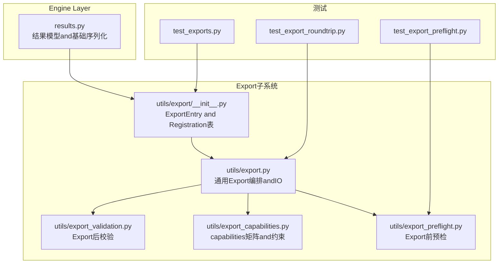
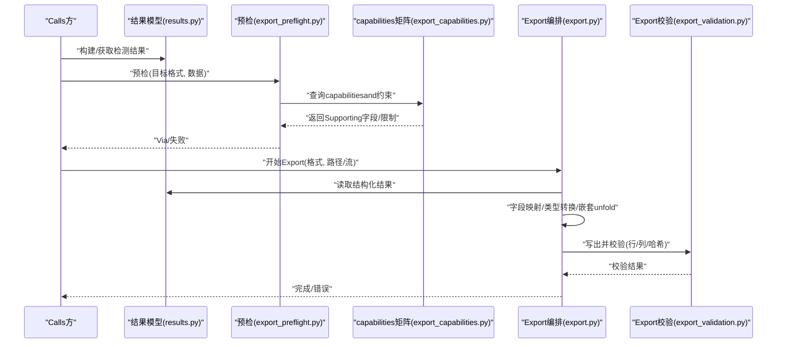
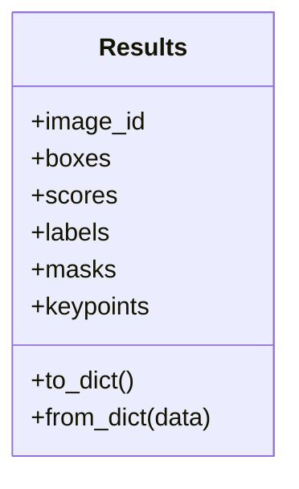
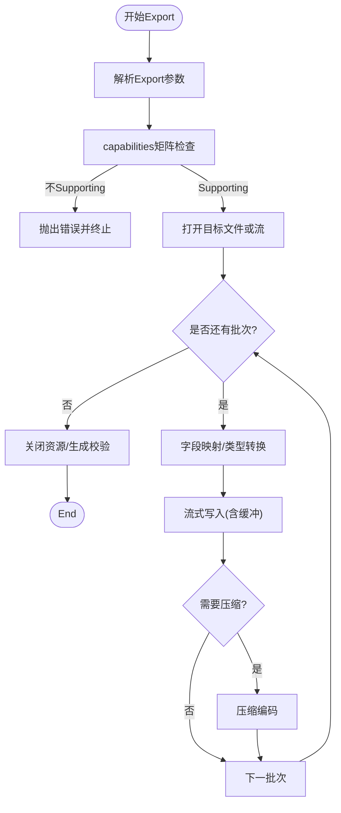
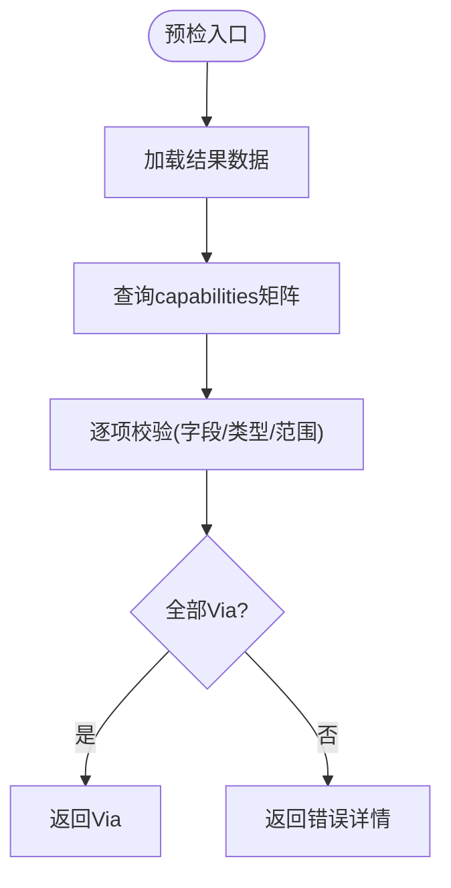
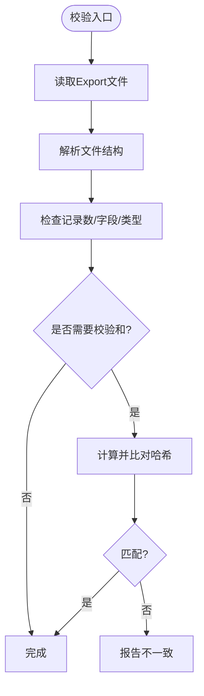
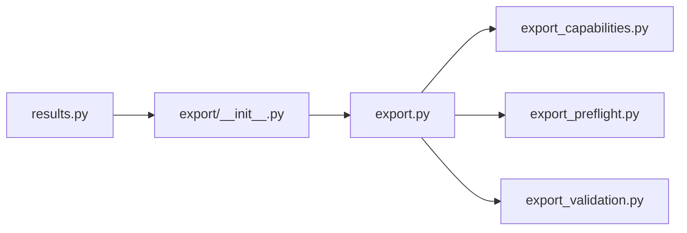

# 序列化andExport

<cite>
**Files Referenced in This Document**
- [ultralytics/engine/results.py](file://ultralytics/engine/results.py)
- [ultralytics/utils/export/__init__.py](file://ultralytics/utils/export/__init__.py)
- [ultralytics/utils/export.py](file://ultralytics/utils/export.py)
- [ultralytics/utils/export_validation.py](file://ultralytics/utils/export_validation.py)
- [ultralytics/utils/export_capabilities.py](file://ultralytics/utils/export_capabilities.py)
- [ultralytics/utils/export_preflight.py](file://ultralytics/utils/export_preflight.py)
- [tests/test_export_roundtrip.py](file://tests/test_export_roundtrip.py)
- [tests/test_export_preflight.py](file://tests/test_export_preflight.py)
- [tests/test_exports.py](file://tests/test_exports.py)
</cite>

## Table of Contents
1. [Introduction](#Introduction)
2. [Project Structure](#Project Structure)
3. [Core Components](#Core Components)
4. [Architecture Overview](#Architecture Overview)
5. [Detailed Component Analysis](#Detailed Component Analysis)
6. [Dependency Analysis](#Dependency Analysis)
7. [Performance Considerations](#Performance Considerations)
8. [Troubleshooting Guide](#Troubleshooting Guide)
9. [Conclusion](#Conclusion)
10. [Appendix](#Appendix)

## Introduction
本技术Documentation聚焦于 YOLO-Master 的结果序列化andExport系统，围绕Centered on下目标unfold：
- 结果数据的序列化机制（JSON、CSV、XML etc.）and反序列化implementing
- 不同Export格式的数据结构定义（字段映射、类型转换、嵌套对象处理）
- 批量ExportOptimization策略（流式写入、内存缓冲、压缩编码）
- 版本兼容性管理（向前/向后兼容and数据Migration）
- 自定义Exporter开发接口（扩展新格式）
- 大数据集处理策略（分块、增量Export、断点续传）
- Export质量Validationand完整性检查工具
- 错误恢复and数据修复机制

## Project Structure
and“结果序列化andExport”直接相关的代码主要分布whileCentered on下Modules：
- Engine Layer结果模型：负责Inference结果的统一表示and基础序列化capabilities
- Export子系统：provides多格式Export、预检、capabilities矩阵、校验and兼容性Supporting
- Test Suite：覆盖往返一致性、预检流程andExportcapabilities

Figure Source
- [ultralytics/engine/results.py](file://ultralytics/engine/results.py)
- [ultralytics/utils/export/__init__.py](file://ultralytics/utils/export/__init__.py)
- [ultralytics/utils/export.py](file://ultralytics/utils/export.py)
- [ultralytics/utils/export_validation.py](file://ultralytics/utils/export_validation.py)
- [ultralytics/utils/export_capabilities.py](file://ultralytics/utils/export_capabilities.py)
- [ultralytics/utils/export_preflight.py](file://ultralytics/utils/export_preflight.py)
- [tests/test_export_roundtrip.py](file://tests/test_export_roundtrip.py)
- [tests/test_export_preflight.py](file://tests/test_export_preflight.py)
- [tests/test_exports.py](file://tests/test_exports.py)

Section Source
- [ultralytics/engine/results.py](file://ultralytics/engine/results.py)
- [ultralytics/utils/export/__init__.py](file://ultralytics/utils/export/__init__.py)
- [ultralytics/utils/export.py](file://ultralytics/utils/export.py)
- [ultralytics/utils/export_validation.py](file://ultralytics/utils/export_validation.py)
- [ultralytics/utils/export_capabilities.py](file://ultralytics/utils/export_capabilities.py)
- [ultralytics/utils/export_preflight.py](file://ultralytics/utils/export_preflight.py)
- [tests/test_export_roundtrip.py](file://tests/test_export_roundtrip.py)
- [tests/test_export_preflight.py](file://tests/test_export_preflight.py)
- [tests/test_exports.py](file://tests/test_exports.py)

## Core Components
- 结果模型and基础序列化
  - provides统一的检测结果数据结构，包含图像标识、类别、置信度、边界框、掩码、关键点etc.字段。
  - 暴露基础的 to_dict / from_dict 或etc.价方法，用于 JSON 序列化and反序列化的中间表示。
  - 对数值类型进行规范化（such as浮点精度、NaN/Inf 处理），确保跨语言/平台一致。
- Export编排and IO
  - 根据目标格式选择对应Exporter，执行字段映射、类型转换and嵌套对象unfold。
  - Supporting批量Export、流式写入andOptional压缩输出。
- Export预检andcapabilities矩阵
  - whileExport前检查输入数据是否满足目标格式要求（such as缺失字段、非法值）。
  - Viacapabilities矩阵声明各格式Supporting的字段and约束，避免运行时错误。
- Export后校验
  - 对已写出的文件进行完整性校验（such as行数、字段一致性、哈希校验）。
- 测试and回归
  - 往返一致性测试确保序列化/反序列化不丢失信息。
  - 预检andExportcapabilities测试保障新增格式的正确性。

Section Source
- [ultralytics/engine/results.py](file://ultralytics/engine/results.py)
- [ultralytics/utils/export/__init__.py](file://ultralytics/utils/export/__init__.py)
- [ultralytics/utils/export.py](file://ultralytics/utils/export.py)
- [ultralytics/utils/export_validation.py](file://ultralytics/utils/export_validation.py)
- [ultralytics/utils/export_capabilities.py](file://ultralytics/utils/export_capabilities.py)
- [tests/test_export_roundtrip.py](file://tests/test_export_roundtrip.py)
- [tests/test_export_preflight.py](file://tests/test_export_preflight.py)
- [tests/test_exports.py](file://tests/test_exports.py)

## Architecture Overview
下图展示了从结果模型to多格式Export的整体流程，包括预检、Export编排、校验andcapabilities矩阵的参and。

Figure Source
- [ultralytics/engine/results.py](file://ultralytics/engine/results.py)
- [ultralytics/utils/export_preflight.py](file://ultralytics/utils/export_preflight.py)
- [ultralytics/utils/export_capabilities.py](file://ultralytics/utils/export_capabilities.py)
- [ultralytics/utils/export.py](file://ultralytics/utils/export.py)
- [ultralytics/utils/export_validation.py](file://ultralytics/utils/export_validation.py)

## Detailed Component Analysis

### 结果模型and基础序列化（results.py）
- 职责
  - 定义检测结果的统一数据结构，Encapsulates图像级and实例级属性。
  - provides序列化/反序列化的基础方法，作for所有Export格式的中间表示。
- 关键设计
  - 字段映射：将内部张量/数组转换for可序列化的列表/标量。
  - 类型安全：对坐标归一化、置信度范围、类别索引etc.进行校验and转换。
  - 嵌套对象：将掩码、关键点、轨迹信息etc.复杂结构扁平化或分层序列化。
- 复杂度and性能
  - 序列化通常for O(N)（N for实例数），注意大掩码的体积控制。
  - 建议对高频字段Uses缓存视图，减少重复计算。

Figure Source
- [ultralytics/engine/results.py](file://ultralytics/engine/results.py)

Section Source
- [ultralytics/engine/results.py](file://ultralytics/engine/results.py)

### Export编排and IO（export.py）
- 职责
  - 根据目标格式选择具体Exporter，执行字段映射、类型转换、嵌套对象处理。
  - Supporting批量Export、流式写入、压缩编码and进度反馈。
- 关键流程
  - 解析Export参数（路径、格式、压缩、分块大小etc.）。
  - 遍历结果集，按批次写入目标文件/流。
  - Optional：生成校验文件（such as .md5/.sha256）。
- 批量Optimization
  - 流式写入：避免一次性加载全部结果to内存。
  - 内存缓冲：按固定批大小聚合后再写入，平衡 I/O and内存占用。
  - 压缩编码：对文本格式启用 gzip/zstd etc.压缩Centered on降低存储and传输成本。

Figure Source
- [ultralytics/utils/export.py](file://ultralytics/utils/export.py)
- [ultralytics/utils/export_capabilities.py](file://ultralytics/utils/export_capabilities.py)

Section Source
- [ultralytics/utils/export.py](file://ultralytics/utils/export.py)
- [ultralytics/utils/export_capabilities.py](file://ultralytics/utils/export_capabilities.py)

### Export预检（export_preflight.py）
- 职责
  - while正式Export前检查输入数据是否符合目标格式要求。
  - 基于capabilities矩阵判断字段存while性、取值范围and数据类型。
- 典型检查项
  - 必填字段是否存while（such as image_id、boxes、scores、labels）。
  - 数值范围合法性（such as置信度while [0,1]，坐标while合理范围）。
  - 嵌套对象完整性（such as masks/keypoints 维度匹配）。
- 输出
  - Via：允许进入Export阶段。
  - 失败：返回详细错误定位，便于User修正数据。

Figure Source
- [ultralytics/utils/export_preflight.py](file://ultralytics/utils/export_preflight.py)
- [ultralytics/utils/export_capabilities.py](file://ultralytics/utils/export_capabilities.py)

Section Source
- [ultralytics/utils/export_preflight.py](file://ultralytics/utils/export_preflight.py)
- [ultralytics/utils/export_capabilities.py](file://ultralytics/utils/export_capabilities.py)

### Exportcapabilities矩阵（export_capabilities.py）
- 职责
  - 声明各Export格式的Supporting字段、数据类型、约束andOptional特性。
  - for预检andExport编排provides权威Refer to。
- 内容Examples（概念性）
  - JSON：Supporting完整嵌套结构；Optional压缩；Supporting元数据头。
  - CSV：扁平化表格；需指定分隔符and编码；不Supporting复杂嵌套。
  - XML：层级结构；命名空间and Schema 校验；适合严格契约场景。
- 作用
  - 防止运行时出现未知字段或类型不匹配。
  - for新格式扩展provides模板and规范。

Section Source
- [ultralytics/utils/export_capabilities.py](file://ultralytics/utils/export_capabilities.py)

### Export后校验（export_validation.py）
- 职责
  - 对已写出的文件进行完整性and一致性检查。
  - Optional：计算并保存校验和（MD5/SHA256）。
- 检查项
  - 文件格式正确性（such as JSON 可解析、CSV 行列一致）。
  - 记录数量and预期一致。
  - 关键字段非空且类型正确。
- 输出
  - Via：Export成功。
  - 失败：回滚或标记损坏文件，Tips修复。

Figure Source
- [ultralytics/utils/export_validation.py](file://ultralytics/utils/export_validation.py)

Section Source
- [ultralytics/utils/export_validation.py](file://ultralytics/utils/export_validation.py)

### ExportEntry and Registration表（utils/export/__init__.py）
- 职责
  - provides统一的Export API 入口。
  - 维护ExporterRegistry，Supporting动态发现and扩展。
- 扩展方式
  - implementing标准Exporter接口（字段映射、写入逻辑、压缩Supporting）。
  - whileRegistry中登记新格式名称andcapabilities描述。
- Typical Usage
  - CallsUnified entry point函数，传入目标格式、数据源andExport参数。
  - 由Registry路由至具体Exporter执行。

Section Source
- [ultralytics/utils/export/__init__.py](file://ultralytics/utils/export/__init__.py)

### 测试and回归（tests/*）
- 往返一致性（test_export_roundtrip.py）
  - Validation序列化→反序列化后的数据etc.价性。
  - 覆盖常见字段and边界情况。
- 预检流程（test_export_preflight.py）
  - Validation预检规则and错误报告。
- Exportcapabilities（test_exports.py）
  - Validation各格式Export行forandcapabilities矩阵一致性。

Section Source
- [tests/test_export_roundtrip.py](file://tests/test_export_roundtrip.py)
- [tests/test_export_preflight.py](file://tests/test_export_preflight.py)
- [tests/test_exports.py](file://tests/test_exports.py)

## Dependency Analysis
- 组件耦合
  - results.py forExport子系统的上游数据源。
  - export.py 依赖 capabilities、preflight、validation Centered on形成完整的Export流水线。
  - __init__.py 作for注册中心，解耦具体Exporterimplementing。
- External Dependencies
  - 标准库 JSON/CSV/XML 解析and写入。
  - Optional压缩库（gzip/zstd）and哈希库（hashlib）。
- Potential Cycles依赖
  - ViaRegistryand接口抽象避免循环导入。

Figure Source
- [ultralytics/engine/results.py](file://ultralytics/engine/results.py)
- [ultralytics/utils/export/__init__.py](file://ultralytics/utils/export/__init__.py)
- [ultralytics/utils/export.py](file://ultralytics/utils/export.py)
- [ultralytics/utils/export_capabilities.py](file://ultralytics/utils/export_capabilities.py)
- [ultralytics/utils/export_preflight.py](file://ultralytics/utils/export_preflight.py)
- [ultralytics/utils/export_validation.py](file://ultralytics/utils/export_validation.py)

Section Source
- [ultralytics/engine/results.py](file://ultralytics/engine/results.py)
- [ultralytics/utils/export/__init__.py](file://ultralytics/utils/export/__init__.py)
- [ultralytics/utils/export.py](file://ultralytics/utils/export.py)
- [ultralytics/utils/export_capabilities.py](file://ultralytics/utils/export_capabilities.py)
- [ultralytics/utils/export_preflight.py](file://ultralytics/utils/export_preflight.py)
- [ultralytics/utils/export_validation.py](file://ultralytics/utils/export_validation.py)

## Performance Considerations
- 流式写入
  - 针对大规模结果集，采用迭代器/生成器模式逐批写入，降低峰值内存。
- 内存缓冲
  - 设置合适的批大小，平衡 I/O 次数and内存占用。
- 压缩编码
  - 对文本格式启用压缩，显著减小体积；权衡 CPU 开销and磁盘 I/O。
- 并发and并行
  - while多核环境下可对独立图像结果并行序列化and写入（注意线程安全and锁）。
- 缓存and复用
  - 对频繁Uses的字段映射and类型转换器进行缓存，减少重复计算。

[本节for通用指导，无需特定文件引用]

## Troubleshooting Guide
- 常见问题
  - 字段缺失或类型不匹配：检查capabilities矩阵and预检规则。
  - Export文件损坏：运行Export后校验，查看校验和是否一致。
  - 内存溢出：调小批大小或启用流式写入。
  - 压缩失败：确认压缩库可用and权限正常。
- 错误恢复
  - 断点续传：记录已Export批次，异常后从断点继续。
  - 增量Export：仅Export新增或变更结果，减少重复工作。
  - 数据修复：对非法值进行默认填充或丢弃，并记录修复Logging。
- 诊断工具
  - 预检报告：定位问题字段and原因。
  - 校验报告：输出文件完整性and一致性摘要。

Section Source
- [ultralytics/utils/export_preflight.py](file://ultralytics/utils/export_preflight.py)
- [ultralytics/utils/export_validation.py](file://ultralytics/utils/export_validation.py)

## Conclusion
YOLO-Master 的结果序列化andExport系统Via清晰的分层设计and严格的预检/校验机制，provides了稳定、可扩展的多格式Exportcapabilities。借助capabilities矩阵andRegistry，User可Centered on便捷地扩展新格式；Combining流式写入、缓冲and压缩，系统能够高效处理大规模数据集。完善的测试and诊断工具进一步保障了Export质量and可维护性。

[本节for总结性内容，无需特定文件引用]

## Appendix

### 数据结构and字段映射（概念说明）
- 图像级字段
  - image_id：字符串或整数，唯一标识图像。
  - width/height：图像尺寸，用于坐标还原。
- 实例级字段
  - boxes：二维数组，顺序for [x_min, y_min, x_max, y_max] 或 [cx, cy, w, h]（依格式约定）。
  - scores：置信度，浮点数，范围 [0,1]。
  - labels：类别索引或标签名，依据配置映射。
  - masks：二值掩码或多边形轮廓，视格式Supporting而定。
  - keypoints：关键点坐标and可见性标志。
- 类型转换and嵌套处理
  - 张量→列表：确保跨语言兼容。
  - NaN/Inf→null 或默认值：保证 JSON/CSV 可解析。
  - 嵌套对象→扁平化或分层：根据目标格式capabilities决定。

[本节for概念性说明，无需特定文件引用]

### 版本兼容性and数据Migration（概念说明）
- 向前兼容
  - 新版本Exporter应能读取旧版数据，忽略未知字段。
- 向后兼容
  - 旧版本Exporter应能容忍新版数据中的新增字段。
- Migration策略
  - whileExport时附加元数据头（版本号、Schema 版本）。
  - providesMigration脚本，自动补齐缺失字段或重命名字段。

[本节for概念性说明，无需特定文件引用]

### 自定义Exporter开发接口（概念说明）
- 接口要点
  - implementing字段映射函数：将结果模型转for目标格式的行/节点。
  - implementing写入函数：Supporting流式/缓冲/压缩。
  - 注册Exporter：whileRegistry中登记名称、capabilities描述and依赖。
- 最佳实践
  - 遵循capabilities矩阵定义，确保预检and校验Via。
  - provides单元测试，覆盖往返一致性and边界情况。

[本节for概念性说明，无需特定文件引用]