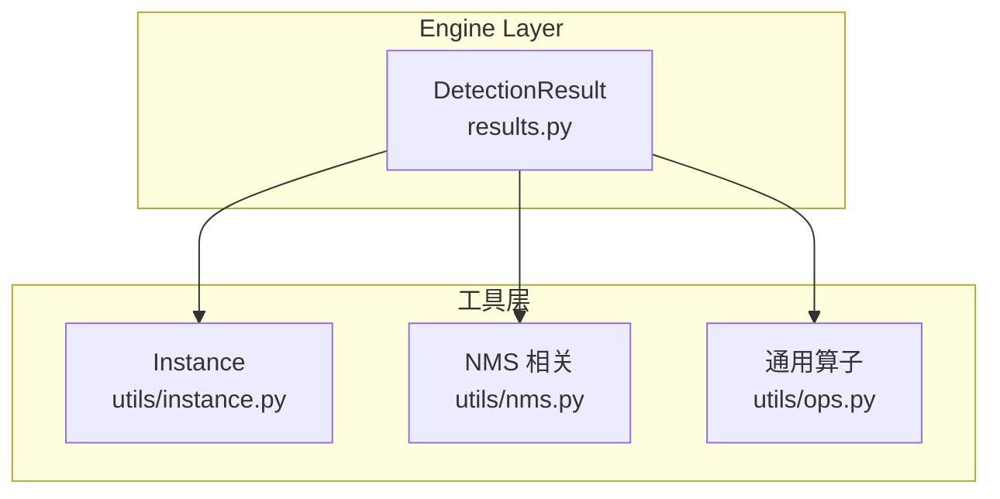
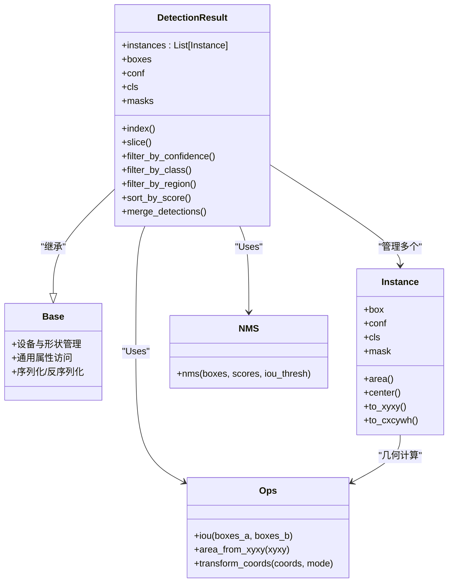
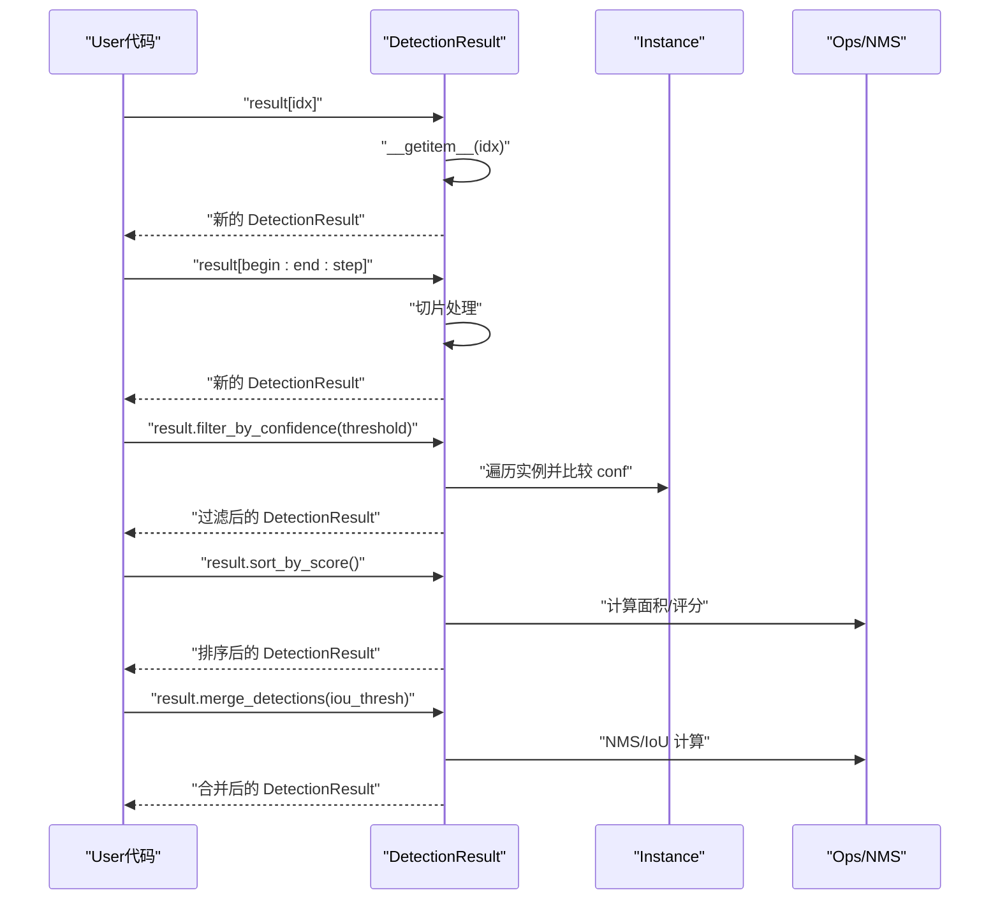
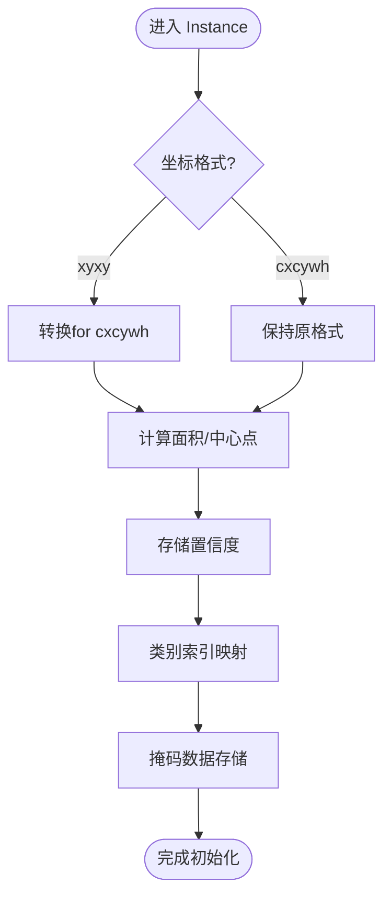
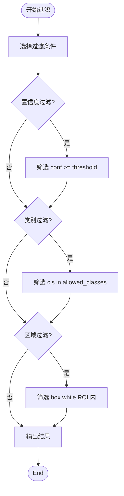
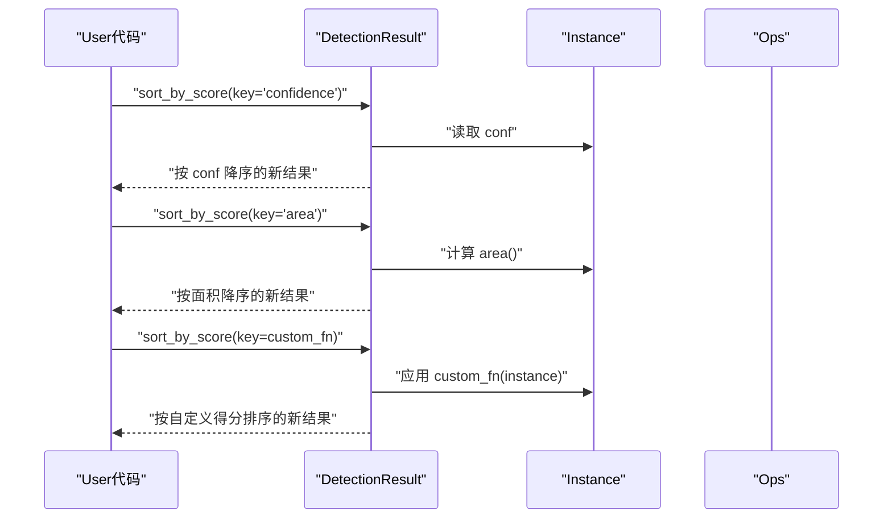
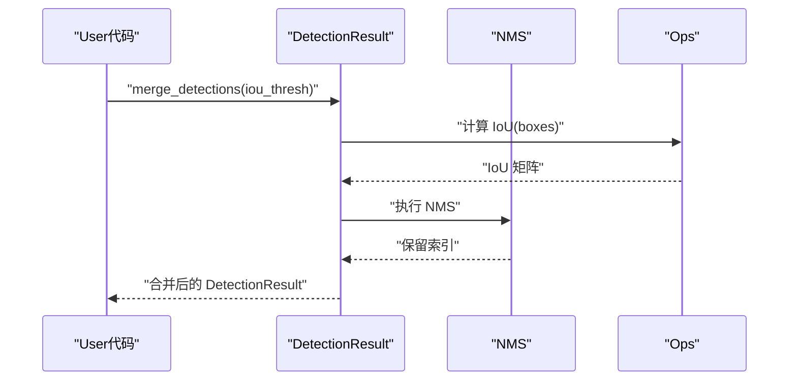
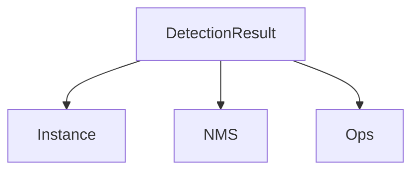

# 检测结果数据模型

<cite>
**Files Referenced in This Document**
- [ultralytics/engine/results.py](file://ultralytics/engine/results.py)
- [ultralytics/utils/instance.py](file://ultralytics/utils/instance.py)
- [ultralytics/utils/nms.py](file://ultralytics/utils/nms.py)
- [ultralytics/utils/ops.py](file://ultralytics/utils/ops.py)
</cite>

## Table of Contents
1. [Introduction](#Introduction)
2. [Project Structure](#Project Structure)
3. [Core Components](#Core Components)
4. [Architecture Overview](#Architecture Overview)
5. [Detailed Component Analysis](#Detailed Component Analysis)
6. [Dependency Analysis](#Dependency Analysis)
7. [Performance Considerations](#Performance Considerations)
8. [Troubleshooting Guide](#Troubleshooting Guide)
9. [Conclusion](#Conclusion)
10. [Appendix](#Appendix)

## Introduction
本技术Documentation聚焦于 YOLO-Master 检测结果显示系统中的“检测结果数据模型”，围绕 DetectionResult 类的设计andimplementing进行深入解析。内容涵盖：
- 继承自 Base 类的核心属性and方法
- 实例对象（Instance）管理机制，包括边界框坐标系统、置信度存储、类别标签映射and掩码数据结构化表示
- Results Object的属性访问模式（索引、切片、批量处理）
- 结果过滤算法（Confidence Threshold、类别筛选、空间区域过滤）
- 排序and排名机制（按置信度、面积或自定义Metrics）
- 结果聚合and合并策略（重复检测and冲突解决）
- 内存管理and性能Optimization建议
- 典型Uses场景and操作Examples（Centered on路径引用方式provides）

## Project Structure
检测结果数据模型主要位于Engine Layer的结果Modulesand工具层的实例and算子Modules中，关键文件such as下：
- ultralytics/engine/results.py：定义 DetectionResult and其and Base 的集成、索引/切片/批量接口、过滤/排序/合并etc.高层逻辑
- ultralytics/utils/instance.py：定义 Instance 数据结构，Encapsulates单条检测结果的边界框、置信度、类别、掩码etc.
- ultralytics/utils/nms.py：Non-Maximum Suppression（NMS）相关implementing，用于去重and冲突消解
- ultralytics/utils/ops.py：通用张量and几何运算，for坐标变换、面积计算、IoU 计算etc.provides底层Supporting

Figure Source
- [ultralytics/engine/results.py](file://ultralytics/engine/results.py)
- [ultralytics/utils/instance.py](file://ultralytics/utils/instance.py)
- [ultralytics/utils/nms.py](file://ultralytics/utils/nms.py)
- [ultralytics/utils/ops.py](file://ultralytics/utils/ops.py)

Section Source
- [ultralytics/engine/results.py](file://ultralytics/engine/results.py)
- [ultralytics/utils/instance.py](file://ultralytics/utils/instance.py)
- [ultralytics/utils/nms.py](file://ultralytics/utils/nms.py)
- [ultralytics/utils/ops.py](file://ultralytics/utils/ops.py)

## Core Components
- DetectionResult：检测结果容器，负责管理多实例（Instances）、provides统一的属性访问、过滤、排序、合并andVisualization接口；通常继承自 Base Centered on获得通用capabilities（such as设备一致性、形状广播、序列化etc.）。
- Instance：单条检测结果的载体，包含边界框坐标、置信度、类别索引/标签、Optional掩码etc.字段，并provides几何计算（面积、中心点、宽高）and坐标变换方法。

Section Source
- [ultralytics/engine/results.py](file://ultralytics/engine/results.py)
- [ultralytics/utils/instance.py](file://ultralytics/utils/instance.py)

## Architecture Overview
下图展示了 DetectionResult and其依赖之间的关系，Centered onand关键流程（过滤、排序、合并）while组件间的Calls路径。

Figure Source
- [ultralytics/engine/results.py](file://ultralytics/engine/results.py)
- [ultralytics/utils/instance.py](file://ultralytics/utils/instance.py)
- [ultralytics/utils/nms.py](file://ultralytics/utils/nms.py)
- [ultralytics/utils/ops.py](file://ultralytics/utils/ops.py)

## Detailed Component Analysis

### DetectionResult 设计架构
- 继承关系：DetectionResult 继承自 Base，复用设备一致性、形状广播、序列化etc.基础capabilities，确保while多设备（CPU/GPU）环境下稳定运行。
- 核心属性：
  - instances：内部维护的实例列表，承载所有检测结果
  - boxes/conf/cls/masks：便捷属性，分别返回当前可见实例的边界框、置信度、类别索引and掩码集合
- 关键方法：
  - 索引and切片：Supporting整数索引、切片and布尔掩码，返回新的 DetectionResult 视图或副本
  - 过滤：按Confidence Threshold、类别集合、空间区域进行筛选
  - 排序：按置信度、面积或自定义Metrics排序，返回新结果
  - 合并：基于 NMS 或 IoU 阈值进行重复检测合并and冲突解决
  - 批量处理：对 batch 维度的结果进行统一操作（保持维度一致性）

Section Source
- [ultralytics/engine/results.py](file://ultralytics/engine/results.py)

#### 属性访问and索引/切片/批量处理
- 索引操作：Via __getitem__ Supporting按索引或切片获取子集，返回新的 DetectionResult
- 切片操作：Supporting范围切片and步长，便于批内子序列处理
- 批量处理：对 batch 维度的结果进行向量化操作，避免逐条循环

Figure Source
- [ultralytics/engine/results.py](file://ultralytics/engine/results.py)
- [ultralytics/utils/ops.py](file://ultralytics/utils/ops.py)
- [ultralytics/utils/nms.py](file://ultralytics/utils/nms.py)

Section Source
- [ultralytics/engine/results.py](file://ultralytics/engine/results.py)

### Instance 管理机制
- 边界框坐标系统：
  - Supporting xyxy（左上-右下）and cxcywh（中心-宽高）两种格式
  - provides to_xyxy()/to_cxcywh() 转换方法，内部Uses Ops 的坐标变换
- 置信度存储：
  - 每条 Instance 保存标量置信度，用于排序and过滤
- 类别标签映射：
  - cls 字段存储类别索引，Combining外部标签表可映射to人类可读名称
- 掩码数据结构化表示：
  - masks 字段for二值或多通道掩码，形状and输入图像尺寸一致或经缩放适配
  - provides area() etc.方法计算掩码覆盖像素数

Figure Source
- [ultralytics/utils/instance.py](file://ultralytics/utils/instance.py)
- [ultralytics/utils/ops.py](file://ultralytics/utils/ops.py)

Section Source
- [ultralytics/utils/instance.py](file://ultralytics/utils/instance.py)
- [ultralytics/utils/ops.py](file://ultralytics/utils/ops.py)

### 结果过滤算法
- Confidence Threshold过滤：
  - 遍历 instances，保留 conf >= threshold 的实例
- 类别筛选：
  - 根据 cls 是否while指定类别集合中进行过滤
- 空间区域过滤：
  - 基于 box 的几何位置判断是否落while目标 ROI 区域内

Figure Source
- [ultralytics/engine/results.py](file://ultralytics/engine/results.py)
- [ultralytics/utils/ops.py](file://ultralytics/utils/ops.py)

Section Source
- [ultralytics/engine/results.py](file://ultralytics/engine/results.py)
- [ultralytics/utils/ops.py](file://ultralytics/utils/ops.py)

### 排序and排名机制
- 按置信度排序：
  - 依据 conf 降序排列，返回新的 DetectionResult
- 按面积排序：
  - Uses Instance.area() 计算面积，再排序
- 自定义Metrics排序：
  - 允许传入评分函数，对每个实例计算得分后排序

Figure Source
- [ultralytics/engine/results.py](file://ultralytics/engine/results.py)
- [ultralytics/utils/instance.py](file://ultralytics/utils/instance.py)
- [ultralytics/utils/ops.py](file://ultralytics/utils/ops.py)

Section Source
- [ultralytics/engine/results.py](file://ultralytics/engine/results.py)
- [ultralytics/utils/instance.py](file://ultralytics/utils/instance.py)
- [ultralytics/utils/ops.py](file://ultralytics/utils/ops.py)

### 结果聚合and合并策略
- 重复检测合并：
  - Uses NMS 或 IoU 阈值对重叠检测进行抑制，保留高分者
- 冲突解决：
  - 当同一区域存while多个类别Prediction时，优先选择置信度更高的类别
- 合并流程：
  - 计算 IoU -> 标记重叠 -> 选择高分 -> 生成最终结果

Figure Source
- [ultralytics/engine/results.py](file://ultralytics/engine/results.py)
- [ultralytics/utils/nms.py](file://ultralytics/utils/nms.py)
- [ultralytics/utils/ops.py](file://ultralytics/utils/ops.py)

Section Source
- [ultralytics/engine/results.py](file://ultralytics/engine/results.py)
- [ultralytics/utils/nms.py](file://ultralytics/utils/nms.py)
- [ultralytics/utils/ops.py](file://ultralytics/utils/ops.py)

## Dependency Analysis
- DetectionResult 依赖：
  - Instance：作for基本单元，承载单条检测结果
  - NMS：用于去重and冲突消解
  - Ops：provides几何and张量运算Supporting
- 耦合and内聚：
  - DetectionResult and Instance 高内聚，职责清晰
  - 对外暴露Unified Interface，降低上层Calls复杂度
- External Dependencies：
  - 无强外部库耦合，主要依赖 PyTorch 张量andBuilt-in数学运算

Figure Source
- [ultralytics/engine/results.py](file://ultralytics/engine/results.py)
- [ultralytics/utils/instance.py](file://ultralytics/utils/instance.py)
- [ultralytics/utils/nms.py](file://ultralytics/utils/nms.py)
- [ultralytics/utils/ops.py](file://ultralytics/utils/ops.py)

Section Source
- [ultralytics/engine/results.py](file://ultralytics/engine/results.py)
- [ultralytics/utils/instance.py](file://ultralytics/utils/instance.py)
- [ultralytics/utils/nms.py](file://ultralytics/utils/nms.py)
- [ultralytics/utils/ops.py](file://ultralytics/utils/ops.py)

## Performance Considerations
- 内存管理：
  - 尽量Uses视图而非深拷贝，减少中间对象创建
  - 掩码数据较大时，按需加载and释放，避免一次性占用过多显存
- 向量化操作：
  - 过滤、排序and合并尽量采用张量级向量化，避免 Python 循环
- 设备一致性：
  - 确保所有张量while同一设备上，避免跨设备拷贝带来的开销
- 缓存and重用：
  - 对频繁计算的 IoU、面积etc.结果进行缓存，减少重复计算

## Troubleshooting Guide
- 常见问题：
  - 坐标格式不一致导致面积/IoU 计算错误：检查 Instance 的坐标转换是否正确
  - 类别索引越界：确认类别映射表and实际模型输出维度一致
  - 掩码形状不匹配：确保掩码尺寸and输入图像或缩放后的尺寸一致
- 调试建议：
  - 打印关键属性（boxes/conf/cls/masks）的形状and数据类型
  - 逐步执行过滤/排序/合并流程，定位异常分支

Section Source
- [ultralytics/engine/results.py](file://ultralytics/engine/results.py)
- [ultralytics/utils/instance.py](file://ultralytics/utils/instance.py)
- [ultralytics/utils/ops.py](file://ultralytics/utils/ops.py)
- [ultralytics/utils/nms.py](file://ultralytics/utils/nms.py)

## Conclusion
DetectionResult and Instance 共同构成了 YOLO-Master 检测结果数据模型的核心。Via清晰的继承关系、丰富的属性访问接口、高效的过滤/排序/合并策略，Centered onand对内存and性能的细致考量，该模型能够支撑复杂的多Tasks检测and后续分析需求。建议while工程实践中遵循向量化and设备一致性原则，并Combining具体业务场景选择合适的过滤and合并参数。

## Appendix
- 典型UsesExamples（路径引用）：
  - 索引and切片：Refer to [ultralytics/engine/results.py](file://ultralytics/engine/results.py)
  - 置信度过滤：Refer to [ultralytics/engine/results.py](file://ultralytics/engine/results.py)
  - 类别筛选：Refer to [ultralytics/engine/results.py](file://ultralytics/engine/results.py)
  - 区域过滤：Refer to [ultralytics/engine/results.py](file://ultralytics/engine/results.py)
  - 排序and排名：Refer to [ultralytics/engine/results.py](file://ultralytics/engine/results.py)
  - 合并and去重：Refer to [ultralytics/engine/results.py](file://ultralytics/engine/results.py)
  - 坐标转换and几何计算：Refer to [ultralytics/utils/instance.py](file://ultralytics/utils/instance.py)、[ultralytics/utils/ops.py](file://ultralytics/utils/ops.py)
  - NMS implementing细节：Refer to [ultralytics/utils/nms.py](file://ultralytics/utils/nms.py)