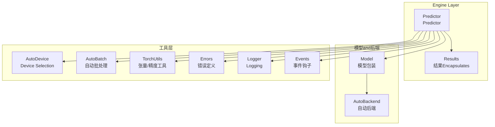
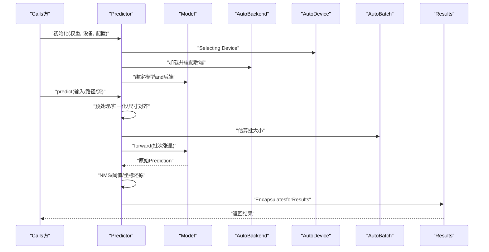
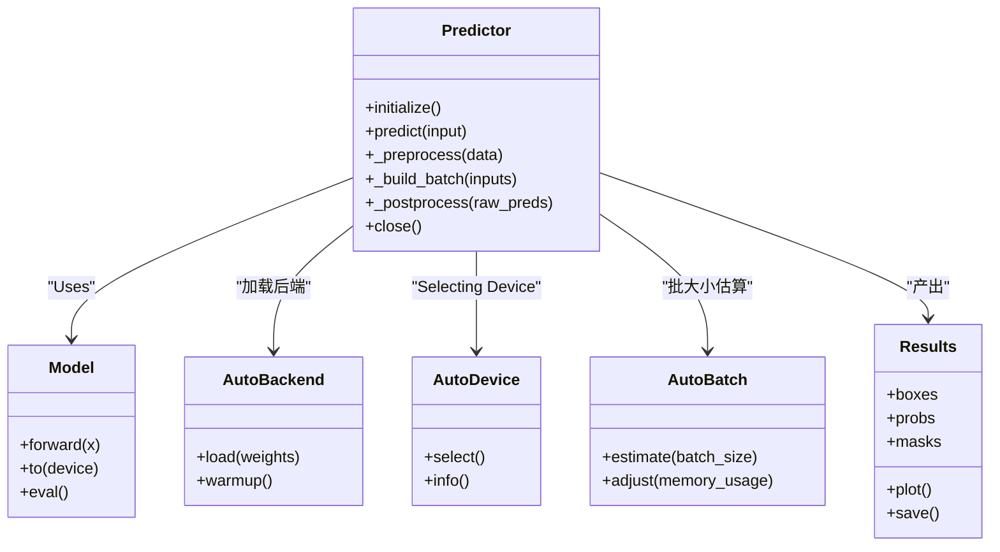
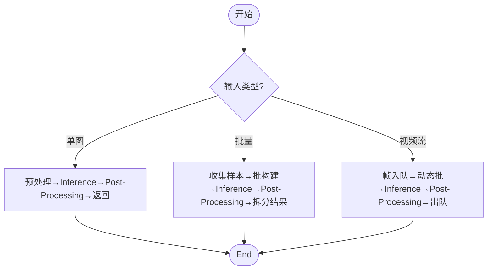
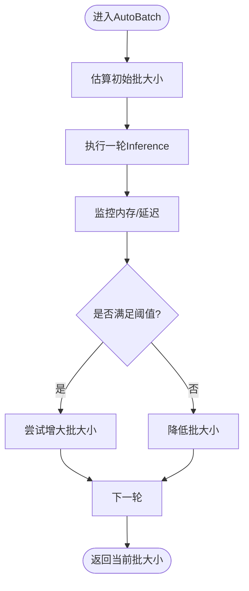
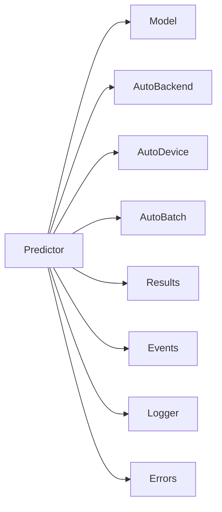

# Predictor引擎

<cite>
**Files Referenced in This Document**
- [predictor.py](file://ultralytics/engine/predictor.py)
- [model.py](file://ultralytics/engine/model.py)
- [autobackend.py](file://ultralytics/nn/autobackend.py)
- [autodevice.py](file://ultralytics/utils/autodevice.py)
- [autobatch.py](file://ultralytics/utils/autobatch.py)
- [results.py](file://ultralytics/engine/results.py)
- [torch_utils.py](file://ultralytics/utils/torch_utils.py)
- [errors.py](file://ultralytics/utils/errors.py)
- [logger.py](file://ultralytics/utils/logger.py)
- [events.py](file://ultralytics/utils/events.py)
</cite>

## Table of Contents
1. [Introduction](#Introduction)
2. [Project Structure](#Project Structure)
3. [Core Components](#Core Components)
4. [Architecture Overview](#Architecture Overview)
5. [Detailed Component Analysis](#Detailed Component Analysis)
6. [Dependency Analysis](#Dependency Analysis)
7. [性能考量](#性能考量)
8. [Troubleshooting Guide](#Troubleshooting Guide)
9. [Conclusion](#Conclusion)
10. [Appendix](#Appendix)

## Introduction
本文件targetingYOLO-Master的Predictor引擎，聚焦Predictor类的Core ArchitectureandInference生命周期。内容涵盖：
- 初始化流程、模型加载机制andDevice Selection策略
- 单图像、批量and视频流三种Inference模式的调度策略
- 自动批处理(AutoBatch)的动态批大小调整and内存Optimization
- 设备管理and硬件适配（GPU/CPU自动检测and切换）
- Inference状态管理and会话控制
- 错误处理and异常恢复机制
- 性能监控and调试工具Uses方法
- 多线程Inferenceimplementing细节and并发控制策略

## Project Structure
Predictor引擎位于ultralytics.engineModules中，围绕Predictor类组织，并andautobackend、autodevice、autobatchetc.工具协同工作，形成“前端编排 + 后端执行”的清晰分层。

Figure Source
- [predictor.py](file://ultralytics/engine/predictor.py)
- [model.py](file://ultralytics/engine/model.py)
- [autobackend.py](file://ultralytics/nn/autobackend.py)
- [autodevice.py](file://ultralytics/utils/autodevice.py)
- [autobatch.py](file://ultralytics/utils/autobatch.py)
- [results.py](file://ultralytics/engine/results.py)
- [torch_utils.py](file://ultralytics/utils/torch_utils.py)
- [errors.py](file://ultralytics/utils/errors.py)
- [logger.py](file://ultralytics/utils/logger.py)
- [events.py](file://ultralytics/utils/events.py)

Section Source
- [predictor.py](file://ultralytics/engine/predictor.py)
- [model.py](file://ultralytics/engine/model.py)
- [autobackend.py](file://ultralytics/nn/autobackend.py)
- [autodevice.py](file://ultralytics/utils/autodevice.py)
- [autobatch.py](file://ultralytics/utils/autobatch.py)
- [results.py](file://ultralytics/engine/results.py)
- [torch_utils.py](file://ultralytics/utils/torch_utils.py)
- [errors.py](file://ultralytics/utils/errors.py)
- [logger.py](file://ultralytics/utils/logger.py)
- [events.py](file://ultralytics/utils/events.py)

## Core Components
- Predictor：Predictor主类，负责输入预处理、批构建、Inference调度、Post-Processingand结果Encapsulates；管理会话生命周期and线程安全。
- Model：模型包装器，统一不同TasksandExport格式的前向接口，屏蔽后端差异。
- AutoBackend：根据权重and运行时环境自动选择最优Inference后端（such asONNX/TensorRT/OpenVINOetc.）。
- AutoDevice：设备探测and选择（CPU/GPU），并处理显存/算力约束。
- AutoBatch：动态批大小估算and调整，Combining内存上限and延迟目标进行自适应。
- Results：标准化Inference输出容器，SupportingVisualization、序列化andMetrics计算。
- TorchUtils：张量转换、精度/类型管理、设备一致性校验etc.通用工具。
- Errors/Logger/Events：统一的错误体系、结构化Loggingand可插拔事件钩子。

Section Source
- [predictor.py](file://ultralytics/engine/predictor.py)
- [model.py](file://ultralytics/engine/model.py)
- [autobackend.py](file://ultralytics/nn/autobackend.py)
- [autodevice.py](file://ultralytics/utils/autodevice.py)
- [autobatch.py](file://ultralytics/utils/autobatch.py)
- [results.py](file://ultralytics/engine/results.py)
- [torch_utils.py](file://ultralytics/utils/torch_utils.py)
- [errors.py](file://ultralytics/utils/errors.py)
- [logger.py](file://ultralytics/utils/logger.py)
- [events.py](file://ultralytics/utils/events.py)

## Architecture Overview
Predictor作for编排中心，将“Data Preparation—批构建—Inference—Post-Processing—结果Encapsulates”串联成完整流水线。其关键交互such as下：

Figure Source
- [predictor.py](file://ultralytics/engine/predictor.py)
- [model.py](file://ultralytics/engine/model.py)
- [autobackend.py](file://ultralytics/nn/autobackend.py)
- [autodevice.py](file://ultralytics/utils/autodevice.py)
- [autobatch.py](file://ultralytics/utils/autobatch.py)
- [results.py](file://ultralytics/engine/results.py)

## Detailed Component Analysis

### Predictor类：初始化、模型加载andInference生命周期
- 初始化阶段
  - 解析配置参数（置信度、IoU阈值、图像尺寸、半精度etc.）
  - ViaAutoDevice确定目标设备，If necessary, fall back toCPU
  - ViaAutoBackend加载权重并选择最优Inference后端
  - 建立Model实例，完成模型图构建and预热
- Inference生命周期
  - 进入前：触发“开始”事件，记录时间戳and资源占用
  - 预处理：读取/解码图像或帧，统一尺寸、归一化、通道顺序转换
  - 批构建：依据AutoBatch建议and队列长度决定实际batch
  - Inference：CallsModel.forward，获取原始Prediction
  - Post-Processing：NMS、类别过滤、边界框缩放至原图尺度
  - 结果Encapsulates：生成Results对象，附加元数据（设备、耗时、形状etc.）
  - 退出后：触发“End”事件，更新统计信息
- 会话控制
  - providesopen/close语义，确保后端资源释放and设备状态复位
  - Supportingwhile长时运行中重置内部缓存and预热状态

Section Source
- [predictor.py](file://ultralytics/engine/predictor.py)
- [model.py](file://ultralytics/engine/model.py)
- [autobackend.py](file://ultralytics/nn/autobackend.py)
- [autodevice.py](file://ultralytics/utils/autodevice.py)
- [events.py](file://ultralytics/utils/events.py)

#### 类关系图（代码级）

Figure Source
- [predictor.py](file://ultralytics/engine/predictor.py)
- [model.py](file://ultralytics/engine/model.py)
- [autobackend.py](file://ultralytics/nn/autobackend.py)
- [autodevice.py](file://ultralytics/utils/autodevice.py)
- [autobatch.py](file://ultralytics/utils/autobatch.py)
- [results.py](file://ultralytics/engine/results.py)

### Inference模式and调度策略
- 单图像Inference
  - 直接预处理→单次forward→Post-Processing→返回Results
  - 适合低延迟场景，避免批开销
- Batch Inference
  - 将多张图像按AutoBatch建议合并for批次
  - Via一次forward吞吐多个样本，提升整体吞吐
  - 注意内存峰值and延迟权衡
- 视频流处理
  - Centered on帧for单位入队，采用滑动窗口或固定容量队列
  - 根据队列长度andAutoBatch动态调整批大小
  - Supporting丢帧策略and超时保护，保证实时性

Figure Source
- [predictor.py](file://ultralytics/engine/predictor.py)
- [autobatch.py](file://ultralytics/utils/autobatch.py)

Section Source
- [predictor.py](file://ultralytics/engine/predictor.py)
- [autobatch.py](file://ultralytics/utils/autobatch.py)

### 自动批处理(AutoBatch)：动态批大小and内存Optimization
- 工作原理
  - 基于模型输入形状、数据类型and设备显存上限估算最大可行批大小
  - 运行时监测内存占用，若接近阈值则降低批大小，反之逐步提升
  - Combining延迟目标and吞吐目标进行多目标Optimization
- 关键策略
  - 渐进式放大：从保守批大小起步，随空闲显存增加而扩大
  - 快速回落：当检测toOOM或延迟超标时迅速降批
  - 分片策略：对超大请求进行分片，避免一次性占满内存
- Applicable Scenarios
  - 高吞吐离线Inference
  - 边缘设备受限内存下的稳定Inference

Figure Source
- [autobatch.py](file://ultralytics/utils/autobatch.py)

Section Source
- [autobatch.py](file://ultralytics/utils/autobatch.py)

### 设备管理and硬件适配：GPU/CPU自动检测and切换
- Device Selection
  - 优先选择可用GPU，若无则回退CPU
  - 考虑显存容量、drivers are installed版本and后端兼容性
- 精度and类型
  - 根据设备capabilitiesand后端Supporting选择半精度/整型
  - 统一张量类型and设备，避免跨设备拷贝
- 热切换
  - 运行时可while安全点切换设备（需重建后端and预热）
  - 切换前清理缓存，防止残留状态影响新设备

Section Source
- [autodevice.py](file://ultralytics/utils/autodevice.py)
- [autobackend.py](file://ultralytics/nn/autobackend.py)
- [torch_utils.py](file://ultralytics/utils/torch_utils.py)

### Inference状态管理and会话控制
- 状态机
  - 未初始化 → 已加载 → 运行中 → 关闭
- 会话控制
  - open：完成后端加载、预热and资源分配
  - close：释放后端句柄、清空缓存、复位设备状态
- 线程安全
  - 内部锁保护共享状态（such as批队列、统计信息）
  - 同一会话内允许多线程并发Inference，但需避免跨会话共享可变状态

Section Source
- [predictor.py](file://ultralytics/engine/predictor.py)

### 错误处理and异常恢复
- 错误分类
  - 设备不可用/显存不足
  - 后端加载失败/模型不兼容
  - 输入格式错误/尺寸不一致
- 恢复策略
  - 自动降级：GPU→CPU、高精度→低精度、大batch→小batch
  - 重试and熔断：对瞬时错误进行有限次重试，失败则熔断并上报
  - 诊断信息：附带堆栈、设备信息、内存占用and最后输入摘要

Section Source
- [errors.py](file://ultralytics/utils/errors.py)
- [logger.py](file://ultralytics/utils/logger.py)
- [predictor.py](file://ultralytics/engine/predictor.py)

### 性能监控and调试工具
- Built-inMetrics
  - 端to端耗时、各阶段耗时、吞吐、批大小变化曲线
  - 设备利用率、显存峰值、温度（若可用）
- 事件钩子
  - Via事件系统订阅“开始/End/错误”etc.事件，接入外部监控系统
- 调试开关
  - 启用详细Logging、保存中间张量形状and设备信息
  - VisualizationResults（框、掩码、概率分布）

Section Source
- [events.py](file://ultralytics/utils/events.py)
- [logger.py](file://ultralytics/utils/logger.py)
- [results.py](file://ultralytics/engine/results.py)

### 多线程Inferenceand并发控制
- 并发模型
  - 单会话内多线程并发：共享模型and后端，内部加锁保护批队列and统计
  - 多会话并行：每个会话独立设备/后端，适合多进程或多GPU
- 同步策略
  - 读写分离：只读共享状态无需锁，写操作加锁
  - 无锁队列：用于帧/样本入队，减少锁竞争
- 背压and限流
  - 队列满时阻塞或丢弃旧帧
  - 根据延迟目标限制并发度，避免过载

Section Source
- [predictor.py](file://ultralytics/engine/predictor.py)

## Dependency Analysis
Predictor强依赖ModelandAutoBackend，间接依赖AutoDeviceandAutoBatch；输出统一forResults；错误、Loggingand事件贯穿全链路。

Figure Source
- [predictor.py](file://ultralytics/engine/predictor.py)
- [model.py](file://ultralytics/engine/model.py)
- [autobackend.py](file://ultralytics/nn/autobackend.py)
- [autodevice.py](file://ultralytics/utils/autodevice.py)
- [autobatch.py](file://ultralytics/utils/autobatch.py)
- [results.py](file://ultralytics/engine/results.py)
- [events.py](file://ultralytics/utils/events.py)
- [logger.py](file://ultralytics/utils/logger.py)
- [errors.py](file://ultralytics/utils/errors.py)

Section Source
- [predictor.py](file://ultralytics/engine/predictor.py)
- [model.py](file://ultralytics/engine/model.py)
- [autobackend.py](file://ultralytics/nn/autobackend.py)
- [autodevice.py](file://ultralytics/utils/autodevice.py)
- [autobatch.py](file://ultralytics/utils/autobatch.py)
- [results.py](file://ultralytics/engine/results.py)
- [events.py](file://ultralytics/utils/events.py)
- [logger.py](file://ultralytics/utils/logger.py)
- [errors.py](file://ultralytics/utils/errors.py)

## 性能考量
- 批大小调优：while高吞吐场景下优先提升批大小，while低延迟场景下保持较小批
- 精度选择：whileGPUand合适后端Supporting下Prefer半精度，注意数值稳定性
- 预热策略：首次Inference前进行若干次空跑，消除冷启动抖动
- I/OOptimization：预取下一帧/图像，减少etc.待时间
- 内存管理：and时释放中间张量，避免碎片化

## Troubleshooting Guide
- 常见问题
  - OOM：降低批大小、减小输入分辨率、切换toCPU或更低精度
  - 后端加载失败：检查权重格式and后端Supporting矩阵，必要时重新Export
  - 设备切换异常：确保while安全点切换，先关闭再打开新会话
- 定位手段
  - 开启详细Logging，关注“开始/End/错误”事件
  - 打印设备信息and内存占用，确认资源bottlenecks
  - 保存最小复现输入and配置，便于回归测试

Section Source
- [errors.py](file://ultralytics/utils/errors.py)
- [logger.py](file://ultralytics/utils/logger.py)
- [events.py](file://ultralytics/utils/events.py)
- [predictor.py](file://ultralytics/engine/predictor.py)

## Conclusion
PredictorCentered on清晰的编排职责and可扩展的后端抽象，implementing了从单图to视频流的统一Inference体验。借助AutoBatchandAutoDevice，系统while吞吐、延迟and资源之间取得良好平衡。Combined with完善的错误处理、事件系统and调试工具，可支撑生产环境的稳定运行and持续Optimization。

## Appendix
- 最佳实践
  - for不同部署目标预设配置模板（边缘/云端/服务器）
  - while生产环境启用事件上报andMetrics采集
  - 定期EvaluationAutoBatch策略and后端选择效果
- Refer to路径
  - Predictor入口and生命周期：[predictor.py](file://ultralytics/engine/predictor.py)
  - 模型包装and前向接口：[model.py](file://ultralytics/engine/model.py)
  - 自动后端选择：[autobackend.py](file://ultralytics/nn/autobackend.py)
  - Device Selectionand回退：[autodevice.py](file://ultralytics/utils/autodevice.py)
  - 自动批处理：[autobatch.py](file://ultralytics/utils/autobatch.py)
  - 结果EncapsulatesandVisualization：[results.py](file://ultralytics/engine/results.py)
  - 张量and精度工具：[torch_utils.py](file://ultralytics/utils/torch_utils.py)
  - 错误andLogging：[errors.py](file://ultralytics/utils/errors.py), [logger.py](file://ultralytics/utils/logger.py)
  - 事件钩子：[events.py](file://ultralytics/utils/events.py)