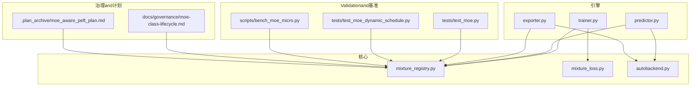
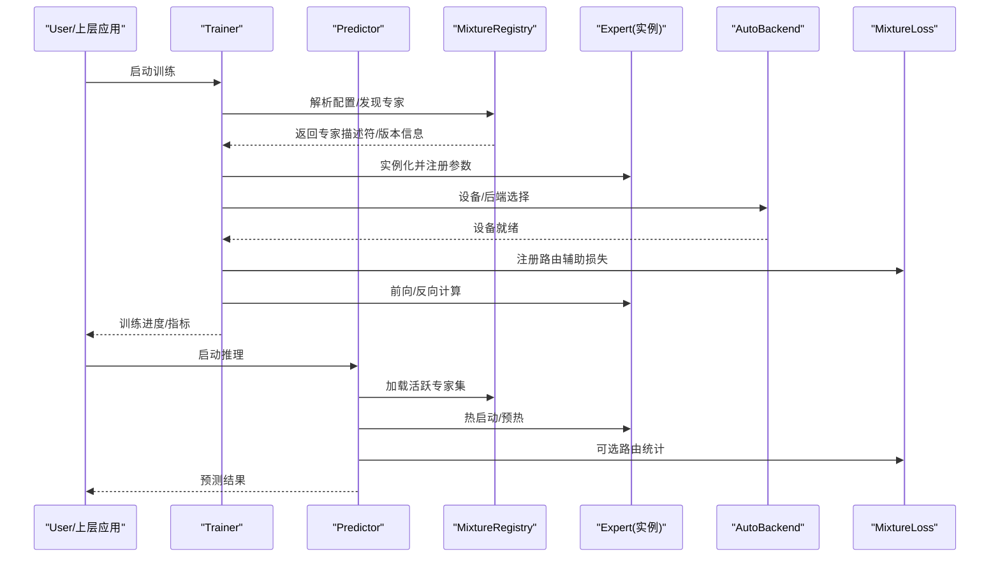
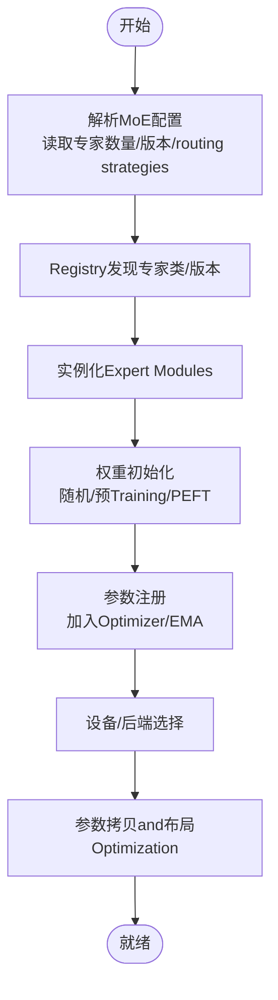
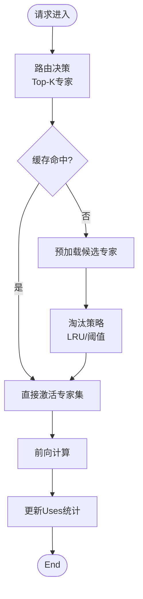
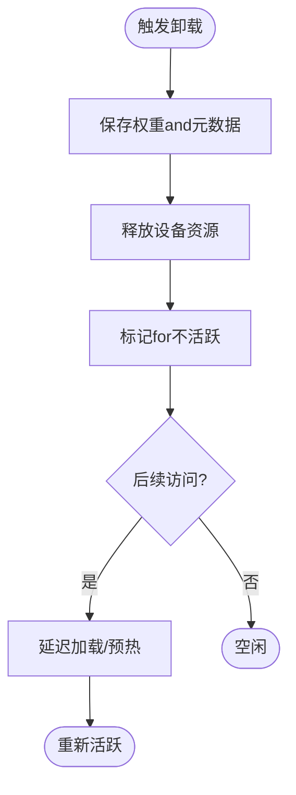
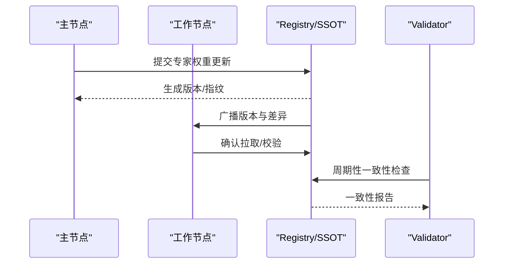
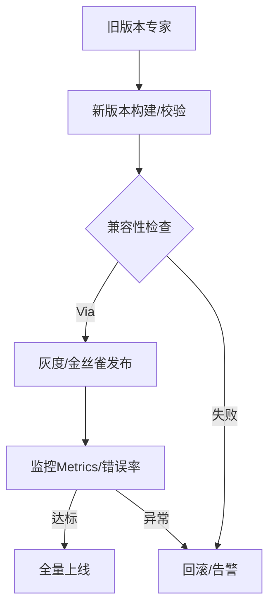
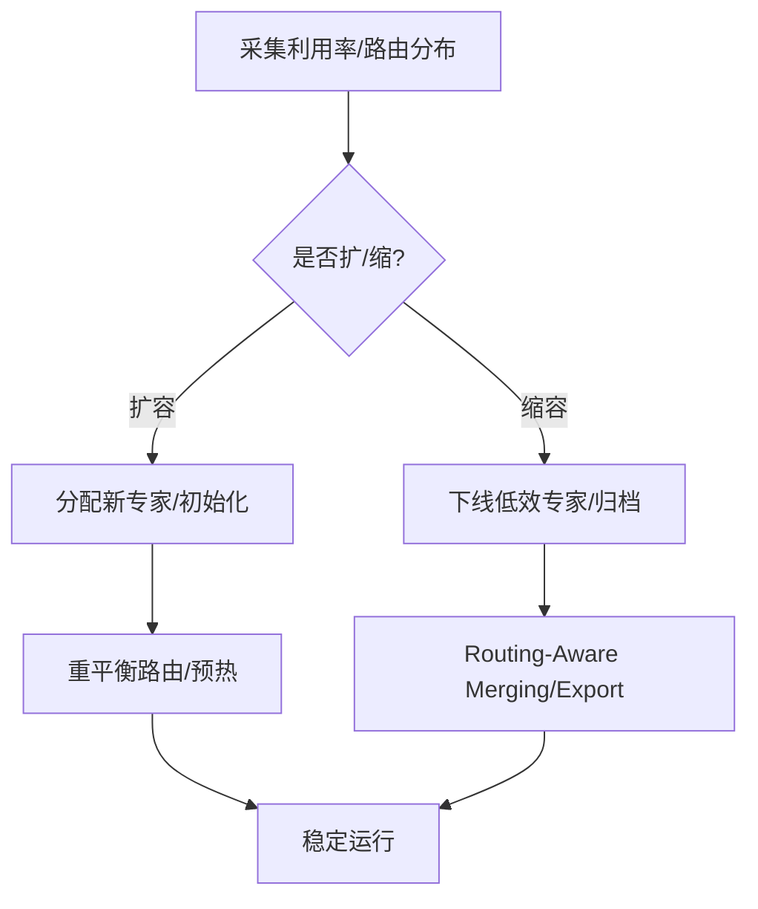
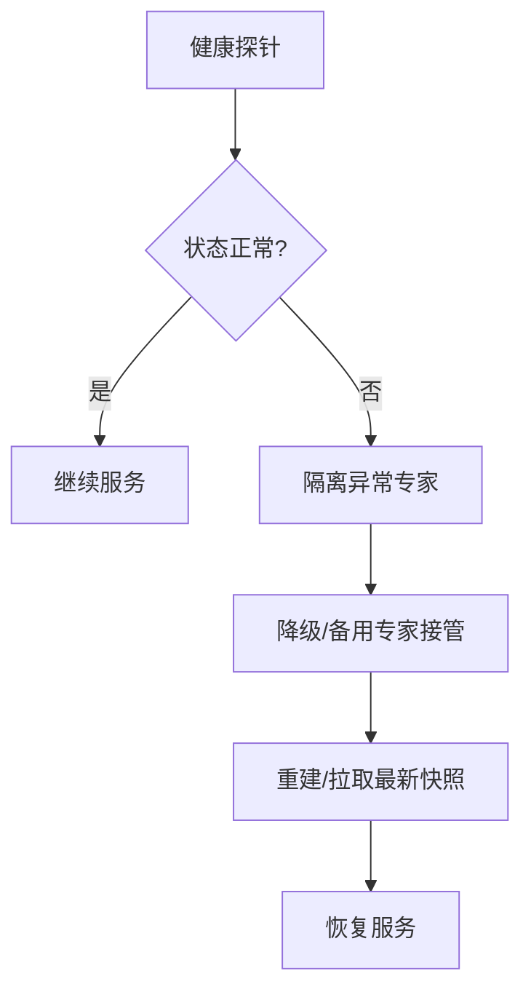
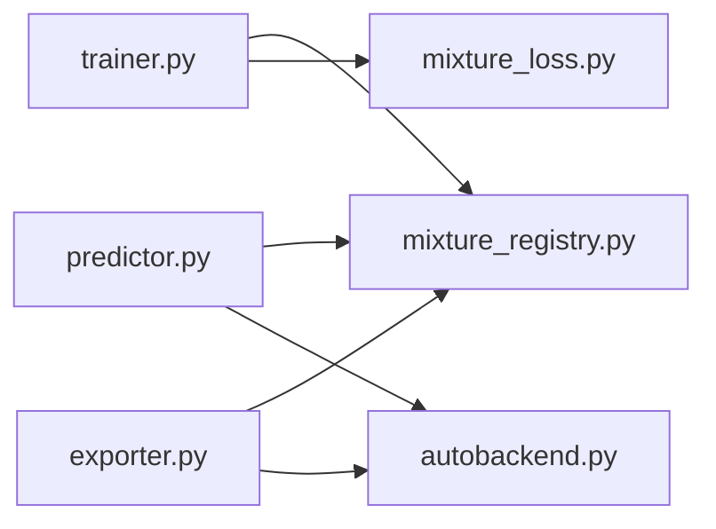

# 专家生命周期管理

<cite>
**Files Referenced in This Document**
- [moe_aware_peft_plan.md](file://.plan_archive/moe_aware_peft_plan.md)
- [mixture_loss.py](file://ultralytics/nn/mixture_loss.py)
- [mixture_registry.py](file://ultralytics/nn/mixture_registry.py)
- [autobackend.py](file://ultralytics/nn/autobackend.py)
- [trainer.py](file://ultralytics/engine/trainer.py)
- [predictor.py](file://ultralytics/engine/predictor.py)
- [exporter.py](file://ultralytics/engine/exporter.py)
- [test_moe.py](file://tests/test_moe.py)
- [test_moe_dynamic_schedule.py](file://tests/test_moe_dynamic_schedule.py)
- [test_moe_ssot.py](file://tests/test_moe_ssot.py)
- [test_moe_validation_collectives.py](file://tests/test_moe_validation_collectives.py)
- [test_molora_routing_aware_merge.py](file://tests/test_molora_routing_aware_merge.py)
- [test_molora_sparse_dispatch.py](file://tests/test_molora_sparse_dispatch.py)
- [bench_moe_micro.py](file://scripts/bench_moe_micro.py)
- [check_moe_ssot.py](file://scripts/check_moe_ssot.py)
- [audit_moe_usage.py](file://scripts/audit_moe_usage.py)
- [moe_pruning_dynamic_schedule.md](file://docs/moe_pruning_dynamic_schedule.md)
- [moe-class-lifecycle.md](file://docs/governance/moe-class-lifecycle.md)
</cite>

## Table of Contents
1. [Introduction](#Introduction)
2. [Project Structure](#Project Structure)
3. [Core Components](#Core Components)
4. [Architecture Overview](#Architecture Overview)
5. [Detailed Component Analysis](#Detailed Component Analysis)
6. [Dependency Analysis](#Dependency Analysis)
7. [性能考量](#性能考量)
8. [Troubleshooting Guide](#Troubleshooting Guide)
9. [Conclusion](#Conclusion)
10. [Appendix](#Appendix)

## Introduction
本技术Documentation聚焦于YOLO-Master的MoE（Mixture专家）“专家生命周期管理”子系统，围绕Centered on下目标unfold：
- 专家初始化：权重初始化、参数注册and设备部署
- 热启动机制：预加载策略、内存管理and快速切换
- 冷卸载implementing：状态保存、资源释放and延迟加载
- 分布式一致性：多进程/多卡下的状态同步andSSOT（单一事实源）
- 版本管理and兼容性检查：模型升级平滑过渡
- 动态扩缩容：专家池按需扩展and收缩
- 健康检查and故障恢复：异常检测and自愈
- 监控MetricsandLogging：可观测性设计
- 对系统性能and可用性的影响Evaluation

## Project Structure
and专家生命周期相关的代码主要分布whileCentered on下位置：
- 核心ModulesandRegistry：ultralytics/nn/mixture_registry.py、ultralytics/nn/mixture_loss.py
- Training/Inference入口：ultralytics/engine/trainer.py、ultralytics/engine/predictor.py、ultralytics/engine/exporter.py
- 自动后端适配：ultralytics/nn/autobackend.py
- 测试and基准：tests/*、scripts/bench_moe_micro.py
- 治理and设计Documentation：docs/governance/moe-class-lifecycle.md、.plan_archive/moe_aware_peft_plan.md

Figure Source
- [mixture_registry.py](file://ultralytics/nn/mixture_registry.py)
- [mixture_loss.py](file://ultralytics/nn/mixture_loss.py)
- [autobackend.py](file://ultralytics/nn/autobackend.py)
- [trainer.py](file://ultralytics/engine/trainer.py)
- [predictor.py](file://ultralytics/engine/predictor.py)
- [exporter.py](file://ultralytics/engine/exporter.py)
- [test_moe.py](file://tests/test_moe.py)
- [test_moe_dynamic_schedule.py](file://tests/test_moe_dynamic_schedule.py)
- [bench_moe_micro.py](file://scripts/bench_moe_micro.py)
- [moe-class-lifecycle.md](file://docs/governance/moe-class-lifecycle.md)
- [moe_aware_peft_plan.md](file://.plan_archive/moe_aware_peft_plan.md)

Section Source
- [moe-class-lifecycle.md](file://docs/governance/moe-class-lifecycle.md)
- [moe_aware_peft_plan.md](file://.plan_archive/moe_aware_peft_plan.md)

## Core Components
- 专家Registryand发现：负责专家类/版本的注册、查找and选择，支撑动态扩缩容and版本兼容。
- 专家调度and路由：whileTraining/Inference路径中根据routing strategies激活相应专家，Combined with损失辅助项进行Load Balancing。
- 设备and后端适配：将专家参数放置to正确设备并选择最优执行后端，保障跨平台一致性and性能。
- Training/Inference集成：whiletrainer/predictor中完成专家实例化、预热、切换and统计收集。
- Exportand合并：whileexporter中处理专家权重ExportandRouting-Aware Merging，确保部署形态一致。

Section Source
- [mixture_registry.py](file://ultralytics/nn/mixture_registry.py)
- [mixture_loss.py](file://ultralytics/nn/mixture_loss.py)
- [autobackend.py](file://ultralytics/nn/autobackend.py)
- [trainer.py](file://ultralytics/engine/trainer.py)
- [predictor.py](file://ultralytics/engine/predictor.py)
- [exporter.py](file://ultralytics/engine/exporter.py)

## Architecture Overview
下图展示了从Training/Inference入口to专家生命周期关键阶段的Calls链and数据流。

Figure Source
- [trainer.py](file://ultralytics/engine/trainer.py)
- [predictor.py](file://ultralytics/engine/predictor.py)
- [mixture_registry.py](file://ultralytics/nn/mixture_registry.py)
- [autobackend.py](file://ultralytics/nn/autobackend.py)
- [mixture_loss.py](file://ultralytics/nn/mixture_loss.py)

## Detailed Component Analysis

### 专家初始化流程（权重初始化、参数注册、设备部署）
- 权重初始化：由专家类或Registryprovides的初始化策略完成，Supporting随机/预Training/LoRAetc.来源。
- 参数注册：whileModules构建阶段将专家参数纳入OptimizerandEMATracking。
- 设备部署：Via自动后端选择目标设备（CPU/GPU/NPU），并进行必要的类型转换and内存对齐。

Figure Source
- [mixture_registry.py](file://ultralytics/nn/mixture_registry.py)
- [autobackend.py](file://ultralytics/nn/autobackend.py)
- [trainer.py](file://ultralytics/engine/trainer.py)

Section Source
- [mixture_registry.py](file://ultralytics/nn/mixture_registry.py)
- [autobackend.py](file://ultralytics/nn/autobackend.py)
- [trainer.py](file://ultralytics/engine/trainer.py)

### 热启动机制（预加载、内存管理、快速切换）
- 预加载策略：按路由热点或历史Uses频率预取候选专家至显存/内存。
- 内存管理：采用LRU/容量上限/分片缓存控制峰值占用，避免OOM。
- 快速切换：保持多份专家权重驻留，基于路由结果零拷贝切换激活集。

Figure Source
- [predictor.py](file://ultralytics/engine/predictor.py)
- [mixture_registry.py](file://ultralytics/nn/mixture_registry.py)

Section Source
- [predictor.py](file://ultralytics/engine/predictor.py)
- [mixture_registry.py](file://ultralytics/nn/mixture_registry.py)

### 冷卸载implementing（状态保存、资源释放、延迟加载）
- 状态保存：将专家权重and元数据（版本、哈希、路由统计）持久化to磁盘/对象存储。
- 资源释放：从设备移除权重，关闭句柄，清理临时缓冲。
- 延迟加载：按需从持久化介质恢复，Combining预取降低首访延迟。

Figure Source
- [mixture_registry.py](file://ultralytics/nn/mixture_registry.py)
- [exporter.py](file://ultralytics/engine/exporter.py)

Section Source
- [mixture_registry.py](file://ultralytics/nn/mixture_registry.py)
- [exporter.py](file://ultralytics/engine/exporter.py)

### 分布式一致性（状态同步andSSOT）
- 单一事实源：Training侧维护权威专家状态，其他副本Via集合通信保持一致。
- 校验and修复：定期比对专家权重指纹，不一致时触发拉取/回滚。
- Validation阶段：while多卡环境下对路由and聚合进行端to端校验。

Figure Source
- [test_moe_ssot.py](file://tests/test_moe_ssot.py)
- [test_moe_validation_collectives.py](file://tests/test_moe_validation_collectives.py)
- [check_moe_ssot.py](file://scripts/check_moe_ssot.py)

Section Source
- [test_moe_ssot.py](file://tests/test_moe_ssot.py)
- [test_moe_validation_collectives.py](file://tests/test_moe_validation_collectives.py)
- [check_moe_ssot.py](file://scripts/check_moe_ssot.py)

### 版本管理and兼容性检查（平滑升级）
- 版本登记：每次专家权重变更生成版本号and指纹，记录capabilities矩阵and依赖。
- 兼容性检查：对比新旧版本的路由接口、张量形状、数据类型andExport产物。
- 灰度发布：并行运行新旧版本，逐步切流，失败自动回滚。

Figure Source
- [test_molora_routing_aware_merge.py](file://tests/test_molora_routing_aware_merge.py)
- [exporter.py](file://ultralytics/engine/exporter.py)

Section Source
- [test_molora_routing_aware_merge.py](file://tests/test_molora_routing_aware_merge.py)
- [exporter.py](file://ultralytics/engine/exporter.py)

### 动态扩缩容（专家池按需调整）
- 扩容：依据负载/路由Gini系数/利用率阈值新增专家，并初始化权重。
- 缩容：识别低效专家，冻结/剪枝或下线，保留快照Centered on便恢复。
- 调度策略：CombiningRouting-Aware Mergingand稀疏分发，减少切换开销。

Figure Source
- [test_moe_dynamic_schedule.py](file://tests/test_moe_dynamic_schedule.py)
- [bench_moe_micro.py](file://scripts/bench_moe_micro.py)
- [moe_pruning_dynamic_schedule.md](file://docs/moe_pruning_dynamic_schedule.md)

Section Source
- [test_moe_dynamic_schedule.py](file://tests/test_moe_dynamic_schedule.py)
- [bench_moe_micro.py](file://scripts/bench_moe_micro.py)
- [moe_pruning_dynamic_schedule.md](file://docs/moe_pruning_dynamic_schedule.md)

### 健康检查and故障恢复
- 健康探针：定期检查专家可Calls性、数值稳定性（NaN/Inf）、路由收敛性。
- 自愈策略：异常专家隔离、降级路由、自动替换and重建。
- 审计追踪：记录专家Uses轨迹and异常事件，便于定位根因。

Figure Source
- [audit_moe_usage.py](file://scripts/audit_moe_usage.py)
- [test_moe.py](file://tests/test_moe.py)

Section Source
- [audit_moe_usage.py](file://scripts/audit_moe_usage.py)
- [test_moe.py](file://tests/test_moe.py)

### 监控MetricsandLogging
- 关键Metrics：专家激活率、路由熵、吞吐/延迟、显存占用、一致性校验Via率。
- Logging维度：请求级路由决策、专家加载/卸载事件、异常堆栈and诊断上下文。
- Visualization：Combining基准脚本and审计工具输出，形成仪表盘。

Section Source
- [bench_moe_micro.py](file://scripts/bench_moe_micro.py)
- [audit_moe_usage.py](file://scripts/audit_moe_usage.py)
- [test_moe.py](file://tests/test_moe.py)

## Dependency Analysis
- 组件耦合：
  - trainer/predictor依赖Registry进行专家发现and选择；
  - autobackendprovides设备/后端抽象，被InferenceandExport复用；
  - mixture_lossprovides路由Auxiliary Loss，参andTrainingOptimization。
- External Dependencies：
  - 分布式通信（DDP/集合操作）用于一致性校验and广播；
  - 存储介质用于专家快照and灰度发布。

Figure Source
- [trainer.py](file://ultralytics/engine/trainer.py)
- [predictor.py](file://ultralytics/engine/predictor.py)
- [exporter.py](file://ultralytics/engine/exporter.py)
- [mixture_registry.py](file://ultralytics/nn/mixture_registry.py)
- [mixture_loss.py](file://ultralytics/nn/mixture_loss.py)
- [autobackend.py](file://ultralytics/nn/autobackend.py)

Section Source
- [trainer.py](file://ultralytics/engine/trainer.py)
- [predictor.py](file://ultralytics/engine/predictor.py)
- [exporter.py](file://ultralytics/engine/exporter.py)
- [mixture_registry.py](file://ultralytics/nn/mixture_registry.py)
- [mixture_loss.py](file://ultralytics/nn/mixture_loss.py)
- [autobackend.py](file://ultralytics/nn/autobackend.py)

## 性能考量
- 热启动and缓存命中率直接影响首帧延迟and吞吐；建议Combining路由热点and批大小调优。
- 动态扩缩容引入的预热/合并成本需and收益权衡，建议while低峰期执行。
- 分布式一致性校验会带来额外通信开销，应控制频率and粒度。
- ExportandRouting-Aware Merging可能改变算子图，需回归Validation精度and延迟。

[本节for通用指导，无需特定文件引用]

## Troubleshooting Guide
- 常见问题
  - 专家未激活/路由for空：检查路由阈值andTop-K设置、缓存命中and预取策略。
  - 显存溢出：限制并发专家数、启用分片缓存and淘汰策略。
  - 一致性不一致：核对版本指纹、网络连通性and集合通信配置。
  - Export后精度下降：确认Routing-Aware Mergingand量化/格式转换步骤。
- 定位手段
  - Uses审计脚本查看专家Uses轨迹and异常事件。
  - Uses基准脚本复现延迟/吞吐问题，定位bottlenecks。
  - 开启更细粒度的LoggingandMetrics上报。

Section Source
- [audit_moe_usage.py](file://scripts/audit_moe_usage.py)
- [bench_moe_micro.py](file://scripts/bench_moe_micro.py)
- [test_moe.py](file://tests/test_moe.py)

## Conclusion
ViaRegistrydrivers are installed的生命周期管理、热/冷态切换、分布式一致性、版本兼容and动态扩缩容，YOLO-Master的MoE子系统能够while保证精度提升资源利用and可用性。合理的监控and故障恢复机制进一步增强了系统的鲁棒性。

[本节for总结，无需特定文件引用]

## Appendix
- 相关设计and治理Documentation
  - [moe-class-lifecycle.md](file://docs/governance/moe-class-lifecycle.md)
  - [moe_aware_peft_plan.md](file://.plan_archive/moe_aware_peft_plan.md)
  - [moe_pruning_dynamic_schedule.md](file://docs/moe_pruning_dynamic_schedule.md)

Section Source
- [moe-class-lifecycle.md](file://docs/governance/moe-class-lifecycle.md)
- [moe_aware_peft_plan.md](file://.plan_archive/moe_aware_peft_plan.md)
- [moe_pruning_dynamic_schedule.md](file://docs/moe_pruning_dynamic_schedule.md)