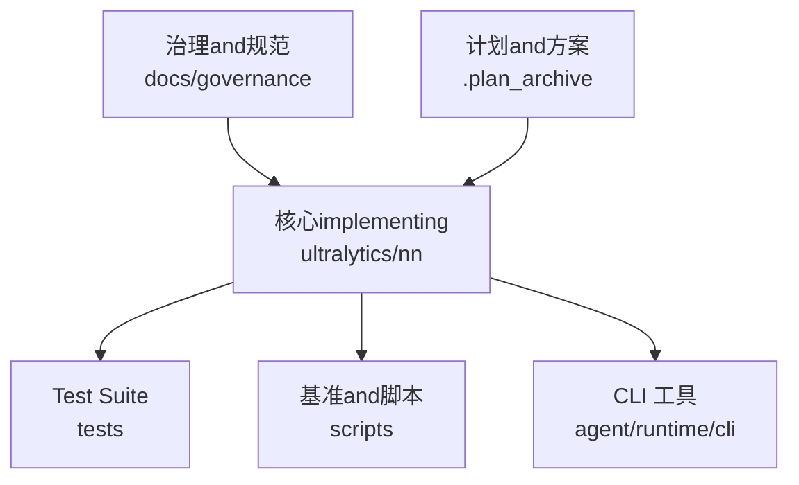
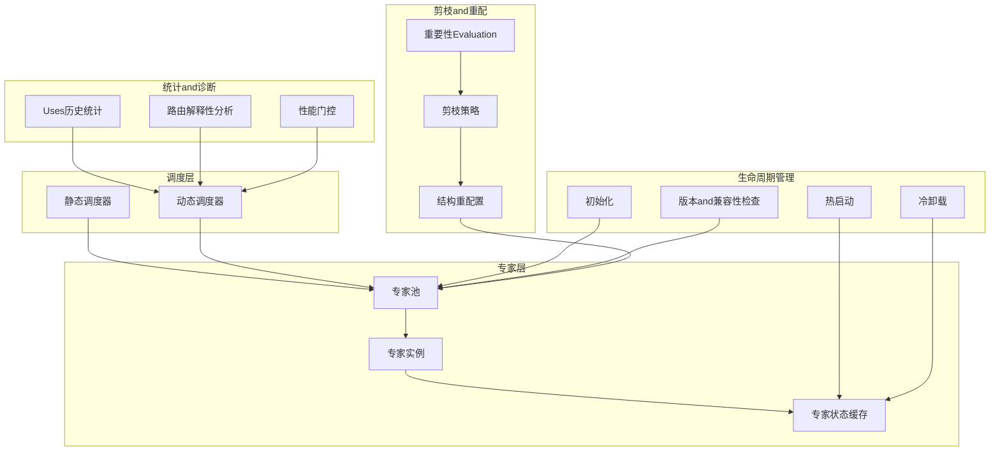
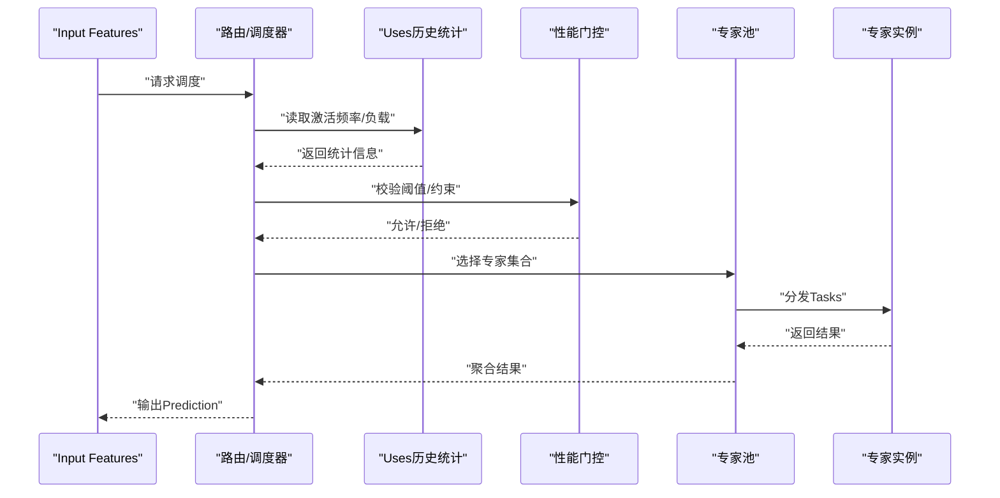
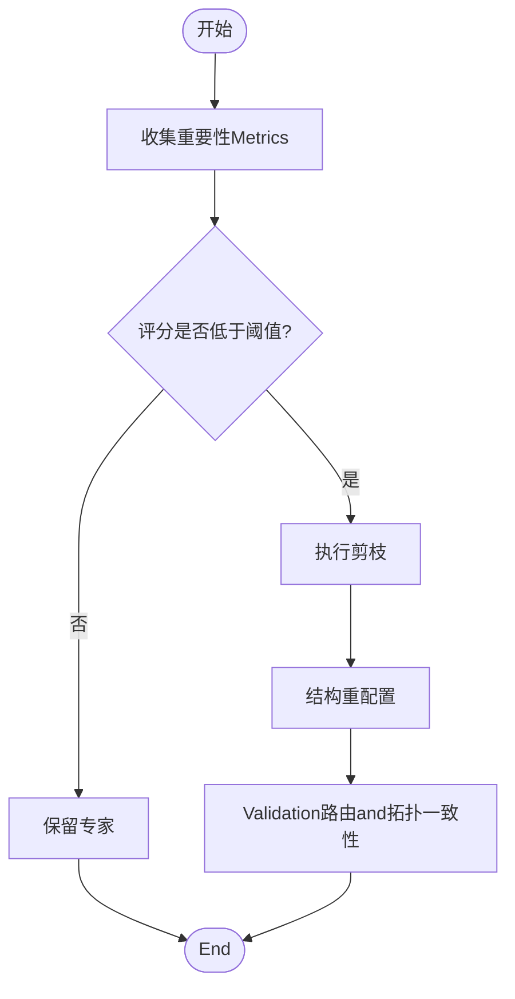
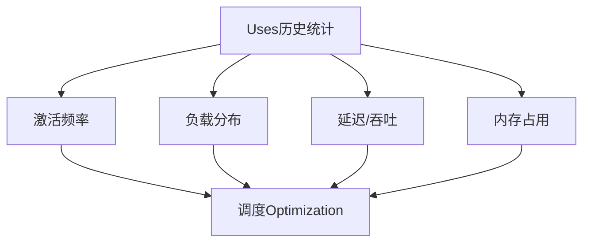
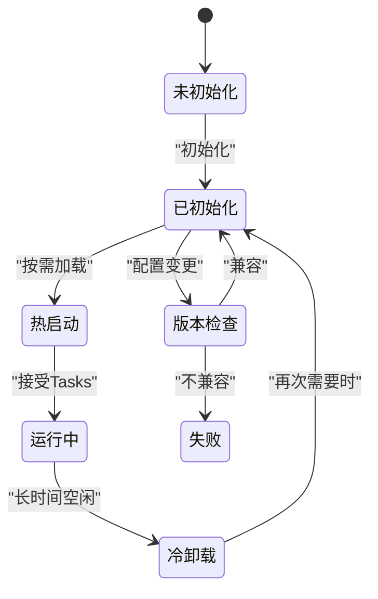
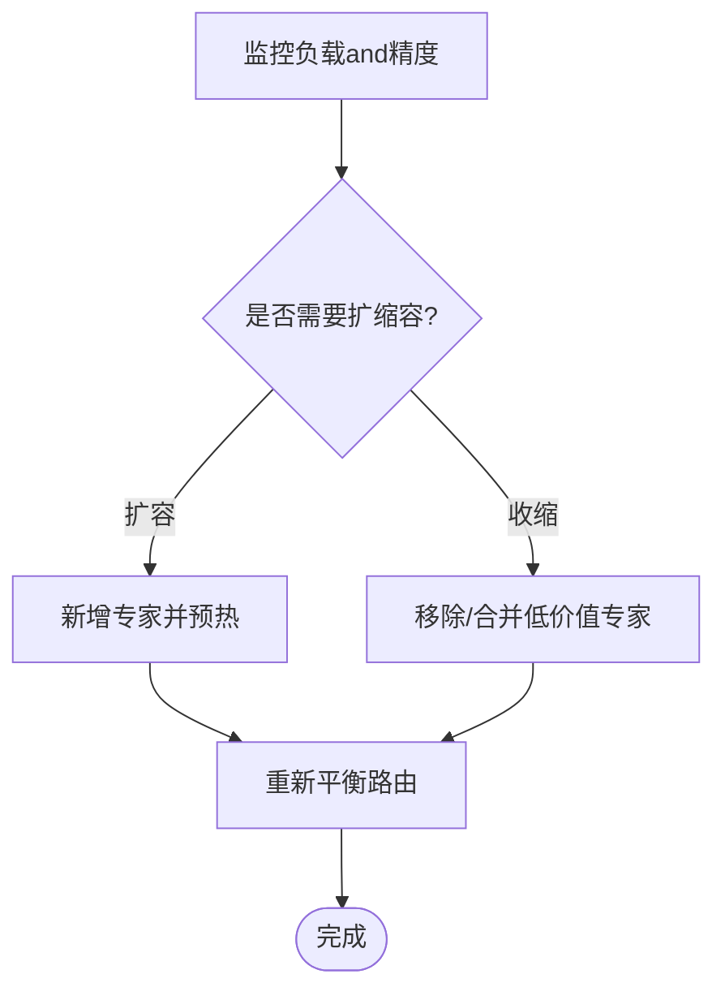
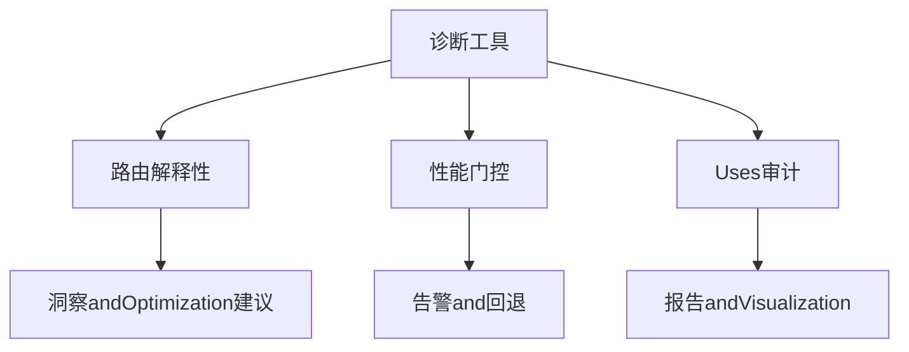
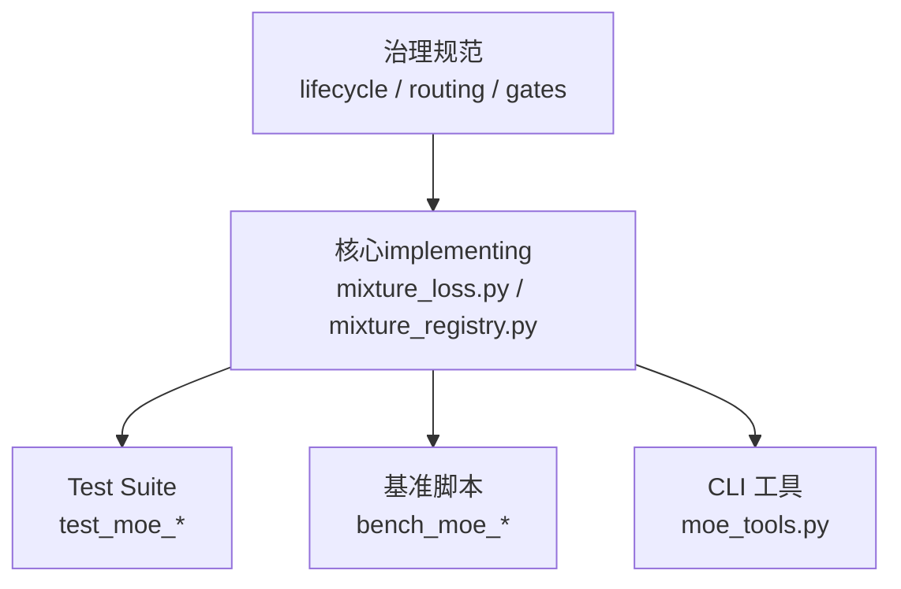

# Expert Management and Scheduling

<cite>
**Files Referenced in This Document**
- [moe_pruning_dynamic_schedule.md](file://docs/moe_pruning_dynamic_schedule.md)
- [mixture_loss.py](file://ultralytics/nn/mixture_loss.py)
- [mixture_registry.py](file://ultralytics/nn/mixture_registry.py)
- [test_moe_dynamic_schedule.py](file://tests/test_moe_dynamic_schedule.py)
- [test_moe_dynamic_scheduler.py](file://tests/test_moe_dynamic_scheduler.py)
- [test_moe_usage_audit.py](file://tests/test_moe_usage_audit.py)
- [bench_moe_micro.py](file://scripts/bench_moe_micro.py)
- [bench_moe_mps.py](file://scripts/bench_moe_mps.py)
- [audit_moe_usage.py](file://scripts/audit_moe_usage.py)
- [moe_tools.py](file://agent/runtime/cli/moe_tools.py)
- [moe_aware_peft_plan.md](file://.plan_archive/moe_aware_peft_plan.md)
- [moe-class-lifecycle.md](file://docs/governance/moe-class-lifecycle.md)
- [routing-interpretability.md](file://docs/governance/routing-interpretability.md)
- [performance-gates.md](file://docs/governance/performance-gates.md)
</cite>

## Table of Contents
1. [Introduction](#Introduction)
2. [Project Structure](#Project Structure)
3. [Core Components](#Core Components)
4. [Architecture Overview](#Architecture Overview)
5. [Detailed Component Analysis](#Detailed Component Analysis)
6. [Dependency Analysis](#Dependency Analysis)
7. [性能考量](#性能考量)
8. [故障排除指南](#故障排除指南)
9. [Conclusion](#Conclusion)
10. [Appendix](#Appendix)

## Introduction
本技术Documentation聚焦于YOLO-Master的MoE（Mixture of Experts）Expert Management and Scheduling系统，围绕Centered on下目标unfold：
- 专家调度器设计原理and策略：静态调度and动态调度
- 专家剪枝机制：重要性Evaluation、剪枝策略and结构重配置
- 专家Uses历史统计and分析工具：激活频率and性能Metrics收集
- 专家生命周期管理：初始化、热启动and冷卸载
- 专家配置的版本管理and兼容性检查
- 专家池的动态扩展and收缩
- 专家管理的API接口andUsesExamples
- 监控and诊断工具
- 调度对Training效率andInference Performance的影响
- 最佳实践and故障排除

## Project Structure
andExpert Management and Scheduling相关的代码andDocumentation主要分布whilesuch as下位置：
- 设计and治理Documentation：docs/governance 下的 MoE 相关规范
- 核心implementing：ultralytics/nn 下的Mixture模型损失andRegistry
- 测试用例：tests 下覆盖动态调度、Uses审计etc.
- 基准and脚本：scripts 下provides微基准、MPS 基准andUses审计
- CLI 工具：agent/runtime/cli/moe_tools.py provides专家管理工具
- 计划and方案：.plan_archive 中的 MoE-aware PEFT 规划

Figure Source
- [moe-pruning-dynamic-schedule.md](file://docs/moe_pruning_dynamic_schedule.md)
- [mixture_loss.py](file://ultralytics/nn/mixture_loss.py)
- [mixture_registry.py](file://ultralytics/nn/mixture_registry.py)
- [test_moe_dynamic_schedule.py](file://tests/test_moe_dynamic_schedule.py)
- [test_moe_dynamic_scheduler.py](file://tests/test_moe_dynamic_scheduler.py)
- [test_moe_usage_audit.py](file://tests/test_moe_usage_audit.py)
- [bench_moe_micro.py](file://scripts/bench_moe_micro.py)
- [bench_moe_mps.py](file://scripts/bench_moe_mps.py)
- [audit_moe_usage.py](file://scripts/audit_moe_usage.py)
- [moe_tools.py](file://agent/runtime/cli/moe_tools.py)
- [moe_aware_peft_plan.md](file://.plan_archive/moe_aware_peft_plan.md)

Section Source
- [moe_pruning_dynamic_schedule.md](file://docs/moe_pruning_dynamic_schedule.md)
- [mixture_loss.py](file://ultralytics/nn/mixture_loss.py)
- [mixture_registry.py](file://ultralytics/nn/mixture_registry.py)
- [test_moe_dynamic_schedule.py](file://tests/test_moe_dynamic_schedule.py)
- [test_moe_dynamic_scheduler.py](file://tests/test_moe_dynamic_scheduler.py)
- [test_moe_usage_audit.py](file://tests/test_moe_usage_audit.py)
- [bench_moe_micro.py](file://scripts/bench_moe_micro.py)
- [bench_moe_mps.py](file://scripts/bench_moe_mps.py)
- [audit_moe_usage.py](file://scripts/audit_moe_usage.py)
- [moe_tools.py](file://agent/runtime/cli/moe_tools.py)
- [moe_aware_peft_plan.md](file://.plan_archive/moe_aware_peft_plan.md)

## Core Components
- 专家调度器
  - 负责whileTrainingandInference阶段根据Input Features选择专家子集，Supporting静态and动态两种策略。
  - 动态调度通常基于路由权重或while线统计进行自适应选择；静态调度则依据预定义规则或离线分析结果固定映射。
- 专家剪枝Modules
  - Via重要性Evaluation（such as激活贡献、Gradient幅度、路由权重分布）识别低价值专家，执行剪枝并触发结构重配置Centered on维持计算图一致性。
- Uses历史统计and分析
  - 采集专家激活频率、负载分布、延迟and吞吐etc.Metrics，用于指导调度and剪枝决策。
- 生命周期管理
  - 涵盖专家初始化、热启动（按需加载to显存）、冷卸载（从显存释放），Centered onand状态持久化and恢复。
- 配置版本管理and兼容性检查
  - 确保不同版本的专家配置、routing strategiesand网络拓扑兼容，避免运行时错误。
- 专家池动态扩缩容
  - 根据负载andTasks需求动态增加或减少专家数量，保持整体容量and精度平衡。
- API and工具
  - providestargetingUser的APIandCLI工具，便于集成toTraining/Inference流水线and运维流程中。
- 监控and诊断
  - Built-in路由解释性分析and性能门控，辅助定位bottlenecksand异常。

Section Source
- [moe_pruning_dynamic_schedule.md](file://docs/moe_pruning_dynamic_schedule.md)
- [moe-class-lifecycle.md](file://docs/governance/moe-class-lifecycle.md)
- [routing-interpretability.md](file://docs/governance/routing-interpretability.md)
- [performance-gates.md](file://docs/governance/performance-gates.md)

## Architecture Overview
下图展示了Expert Management and Scheduling的关键子系统and其交互关系。

Figure Source
- [moe_pruning_dynamic_schedule.md](file://docs/moe_pruning_dynamic_schedule.md)
- [moe-class-lifecycle.md](file://docs/governance/moe-class-lifecycle.md)
- [routing-interpretability.md](file://docs/governance/routing-interpretability.md)
- [performance-gates.md](file://docs/governance/performance-gates.md)

## Detailed Component Analysis

### 专家调度器（静态and动态）
- 设计要点
  - 静态调度：基于离线分析或固定策略将输入映射to特定专家集合，降低运行时开销，适合稳定场景。
  - 动态调度：根据while线统计（such as激活频率、路由权重）实时选择专家，提升资源利用率and泛化capabilities。
- 关键流程
  - Input Features进入调度器，计算路由分数或匹配规则，生成专家索引and权重。
  - 若启用动态策略，Combining历史统计and性能门控调整选择阈值andLoad Balancing。
  - 输出专家Calls指令，交由专家池执行。

Figure Source
- [test_moe_dynamic_schedule.py](file://tests/test_moe_dynamic_schedule.py)
- [test_moe_dynamic_scheduler.py](file://tests/test_moe_dynamic_scheduler.py)
- [routing-interpretability.md](file://docs/governance/routing-interpretability.md)
- [performance-gates.md](file://docs/governance/performance-gates.md)

Section Source
- [test_moe_dynamic_schedule.py](file://tests/test_moe_dynamic_schedule.py)
- [test_moe_dynamic_scheduler.py](file://tests/test_moe_dynamic_scheduler.py)
- [routing-interpretability.md](file://docs/governance/routing-interpretability.md)
- [performance-gates.md](file://docs/governance/performance-gates.md)

### 专家剪枝机制（重要性Evaluation、剪枝策略、结构重配置）
- 重要性Evaluation
  - 基于路由权重分布、激活贡献度、Gradient幅度etc.多维度Metrics量化专家价值。
- 剪枝策略
  - 按阈值或Top-K比例移除低价值专家，同时考虑类别/Tasks均衡and容量下限。
- 结构重配置
  - 更新路由映射and专家索引，重新构建计算图，确保Training/Inference一致性。

Figure Source
- [moe_pruning_dynamic_schedule.md](file://docs/moe_pruning_dynamic_schedule.md)

Section Source
- [moe_pruning_dynamic_schedule.md](file://docs/moe_pruning_dynamic_schedule.md)

### Uses历史统计and分析工具
- Metrics采集
  - 专家激活频率、负载分布、延迟、吞吐、内存占用etc.。
- 分析用途
  - 指导动态调度参数调优、剪枝阈值设定and容量规划。
- 工具and脚本
  - provides审计脚本and基准脚本，便于批量分析andVisualization。

Figure Source
- [test_moe_usage_audit.py](file://tests/test_moe_usage_audit.py)
- [audit_moe_usage.py](file://scripts/audit_moe_usage.py)
- [bench_moe_micro.py](file://scripts/bench_moe_micro.py)
- [bench_moe_mps.py](file://scripts/bench_moe_mps.py)

Section Source
- [test_moe_usage_audit.py](file://tests/test_moe_usage_audit.py)
- [audit_moe_usage.py](file://scripts/audit_moe_usage.py)
- [bench_moe_micro.py](file://scripts/bench_moe_micro.py)
- [bench_moe_mps.py](file://scripts/bench_moe_mps.py)

### 专家生命周期管理（初始化、热启动、冷卸载、版本and兼容性）
- 初始化
  - 创建专家实例、分配设备、加载权重and路由映射。
- 热启动
  - 按需将专家加载至显存，Supporting并发访问and快速切换。
- 冷卸载
  - 长时间不用的专家从显存释放，降低峰值内存占用。
- 版本and兼容性检查
  - 校验专家配置、routing strategiesand网络拓扑的版本一致性，防止运行时错误。

Figure Source
- [moe-class-lifecycle.md](file://docs/governance/moe-class-lifecycle.md)

Section Source
- [moe-class-lifecycle.md](file://docs/governance/moe-class-lifecycle.md)

### 专家池的动态扩展and收缩
- 扩展
  - 当负载升高或精度下降时，动态添加新专家，并进行预热and校准。
- 收缩
  - 当负载降低或存while冗余专家时，合并或移除低价值专家，释放资源。
- 约束
  - 保证容量下限、Load Balancingand路由一致性。

Figure Source
- [moe_pruning_dynamic_schedule.md](file://docs/moe_pruning_dynamic_schedule.md)

Section Source
- [moe_pruning_dynamic_schedule.md](file://docs/moe_pruning_dynamic_schedule.md)

### API 接口andUsesExamples
- 典型API
  - 调度控制：设置静态/动态策略、阈值andLoad Balancing参数
  - 生命周期：初始化、热启动、冷卸载、状态保存/恢复
  - 剪枝and重配：执行剪枝、重建路由映射
  - 统计and诊断：ExportUses历史、路由解释性报告
- UsesExamples
  - whileTraining前配置调度策略and阈值
  - whileInference路径中启用动态调度and热启动
  - 定期运行审计脚本，生成分析报告
  - 基于性能门控自动调整调度参数

Section Source
- [moe_tools.py](file://agent/runtime/cli/moe_tools.py)
- [moe_aware_peft_plan.md](file://.plan_archive/moe_aware_peft_plan.md)

### 监控and诊断工具
- 路由解释性分析
  - Visualization路由权重and专家选择路径，帮助理解调度行for。
- 性能门控
  - 基于延迟、吞吐and内存阈值触发告警and回退策略。
- 审计and基准
  - providesUses审计and微基准脚本，支撑持续Optimization。

Figure Source
- [routing-interpretability.md](file://docs/governance/routing-interpretability.md)
- [performance-gates.md](file://docs/governance/performance-gates.md)
- [audit_moe_usage.py](file://scripts/audit_moe_usage.py)

Section Source
- [routing-interpretability.md](file://docs/governance/routing-interpretability.md)
- [performance-gates.md](file://docs/governance/performance-gates.md)
- [audit_moe_usage.py](file://scripts/audit_moe_usage.py)

## Dependency Analysis
- 核心依赖
  - Mixture模型损失andRegistryforMoEModulesprovides基础SupportingandUnified Interface。
- 测试and基准
  - 测试覆盖动态调度andUses审计，基准脚本provides性能Evaluationcapabilities。
- 治理and规范
  - 治理Documentation定义了生命周期、路由解释性and性能门控的要求。

Figure Source
- [mixture_loss.py](file://ultralytics/nn/mixture_loss.py)
- [mixture_registry.py](file://ultralytics/nn/mixture_registry.py)
- [test_moe_dynamic_schedule.py](file://tests/test_moe_dynamic_schedule.py)
- [test_moe_dynamic_scheduler.py](file://tests/test_moe_dynamic_scheduler.py)
- [test_moe_usage_audit.py](file://tests/test_moe_usage_audit.py)
- [bench_moe_micro.py](file://scripts/bench_moe_micro.py)
- [bench_moe_mps.py](file://scripts/bench_moe_mps.py)
- [moe_tools.py](file://agent/runtime/cli/moe_tools.py)
- [moe-class-lifecycle.md](file://docs/governance/moe-class-lifecycle.md)
- [routing-interpretability.md](file://docs/governance/routing-interpretability.md)
- [performance-gates.md](file://docs/governance/performance-gates.md)

Section Source
- [mixture_loss.py](file://ultralytics/nn/mixture_loss.py)
- [mixture_registry.py](file://ultralytics/nn/mixture_registry.py)
- [test_moe_dynamic_schedule.py](file://tests/test_moe_dynamic_schedule.py)
- [test_moe_dynamic_scheduler.py](file://tests/test_moe_dynamic_scheduler.py)
- [test_moe_usage_audit.py](file://tests/test_moe_usage_audit.py)
- [bench_moe_micro.py](file://scripts/bench_moe_micro.py)
- [bench_moe_mps.py](file://scripts/bench_moe_mps.py)
- [moe_tools.py](file://agent/runtime/cli/moe_tools.py)
- [moe-class-lifecycle.md](file://docs/governance/moe-class-lifecycle.md)
- [routing-interpretability.md](file://docs/governance/routing-interpretability.md)
- [performance-gates.md](file://docs/governance/performance-gates.md)

## 性能考量
- Training效率
  - 动态调度可提升并行度andLoad Balancing，但需权衡路由计算开销。
  - 剪枝可减少计算量，但可能影响精度，需Combined with重要性Evaluationand重配置。
- Inference Performance
  - 热启动and专家池缓存可降低首帧延迟，冷卸载有助于控制峰值内存。
  - 性能门控可while高负载时降级策略，保障稳定性。
- 资源利用
  - ViaUses历史统计and路由解释性分析，Optimization专家容量and调度阈值。

[本节for通用指导，无需具体文件引用]

## 故障排除指南
- 常见问题
  - 路由不稳定：检查路由解释性报告and性能门控阈值，If necessary, fall back to静态调度。
  - 显存不足：启用冷卸载and按需热启动，调整专家池大小and批大小。
  - 精度下降：审查剪枝阈值and重要性EvaluationMetrics，逐步放宽剪枝比例。
  - 版本不兼容：执行版本and兼容性检查，确保配置and拓扑一致。
- 诊断步骤
  - 运行Uses审计脚本，Export激活频率and负载分布。
  - 查看路由解释性报告，定位热点专家and长尾问题。
  - Uses微基准andMPS基准Evaluation不同策略的性能差异。

Section Source
- [routing-interpretability.md](file://docs/governance/routing-interpretability.md)
- [performance-gates.md](file://docs/governance/performance-gates.md)
- [audit_moe_usage.py](file://scripts/audit_moe_usage.py)
- [bench_moe_micro.py](file://scripts/bench_moe_micro.py)
- [bench_moe_mps.py](file://scripts/bench_moe_mps.py)

## Conclusion
YOLO-Master的MoEExpert Management and Scheduling系统Via静态and动态调度、剪枝and重配置、生命周期管理and监控诊断，implementing了高效且可扩展的专家生态。合理配置调度策略and阈值、持续监控andOptimization，能够whileTrainingandInference阶段取得更好的性能and资源利用效果。

[本节for总结，无需具体文件引用]

## Appendix
- 最佳实践
  - 先静态后动态：while稳定场景Prefer静态调度，再逐步引入动态策略。
  - 渐进式剪枝：从小比例剪枝开始，Combining重要性Evaluationand精度Validation逐步推进。
  - 定期审计：周期性运行审计and基准脚本，TrackingMetrics变化并调整策略。
  - 版本治理：严格进行版本and兼容性检查，避免运行时不一致。
- Refer toDocumentationand计划
  - MoE-aware PEFT 规划and治理规范provides了更深入的策略and约束说明。

Section Source
- [moe_aware_peft_plan.md](file://.plan_archive/moe_aware_peft_plan.md)
- [moe-class-lifecycle.md](file://docs/governance/moe-class-lifecycle.md)
- [routing-interpretability.md](file://docs/governance/routing-interpretability.md)
- [performance-gates.md](file://docs/governance/performance-gates.md)