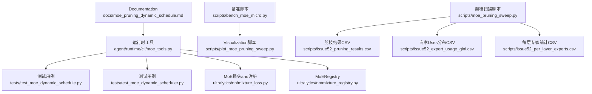
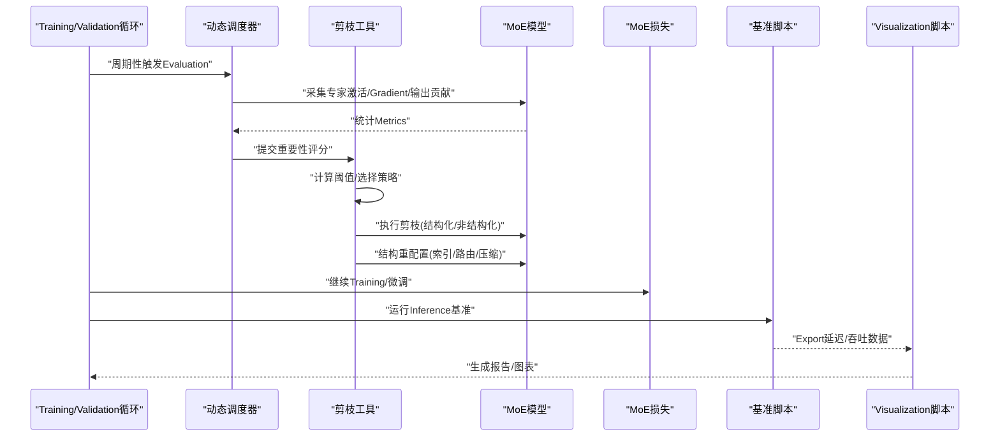
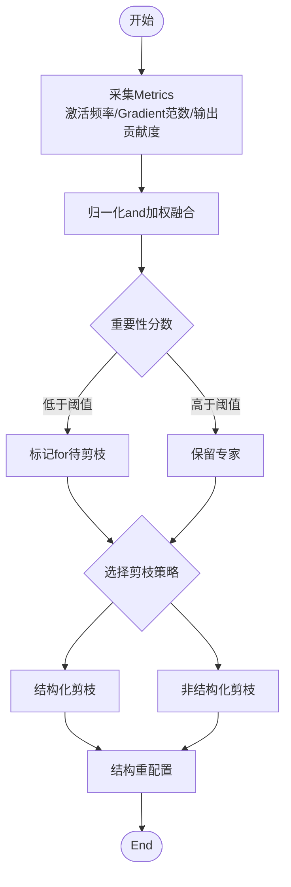
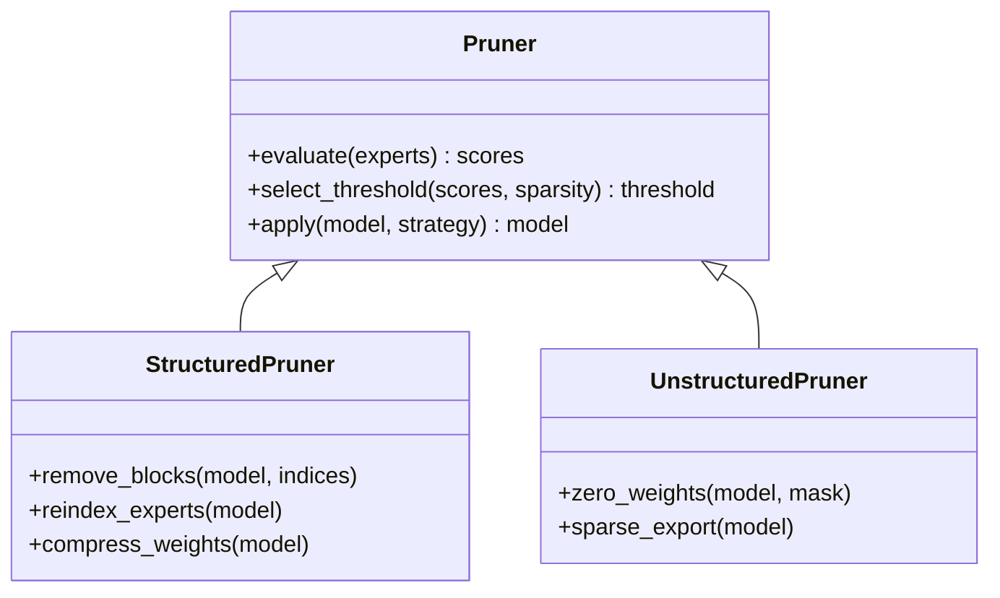
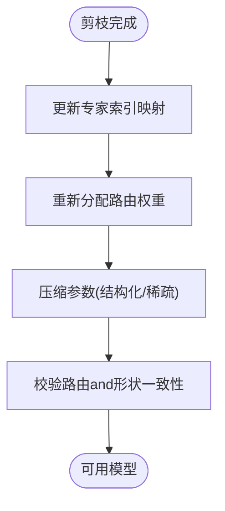
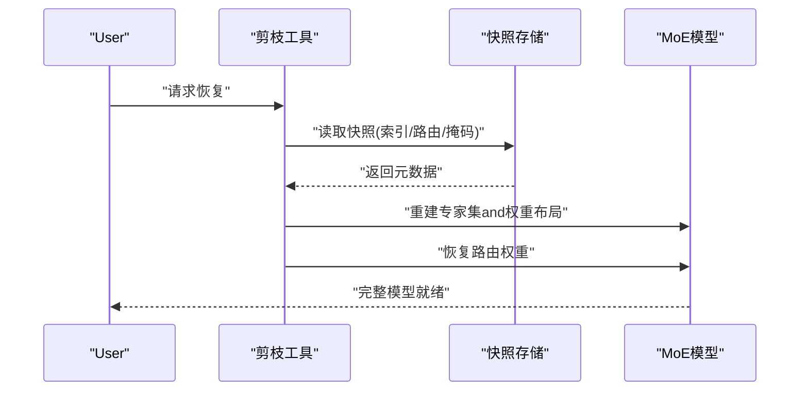
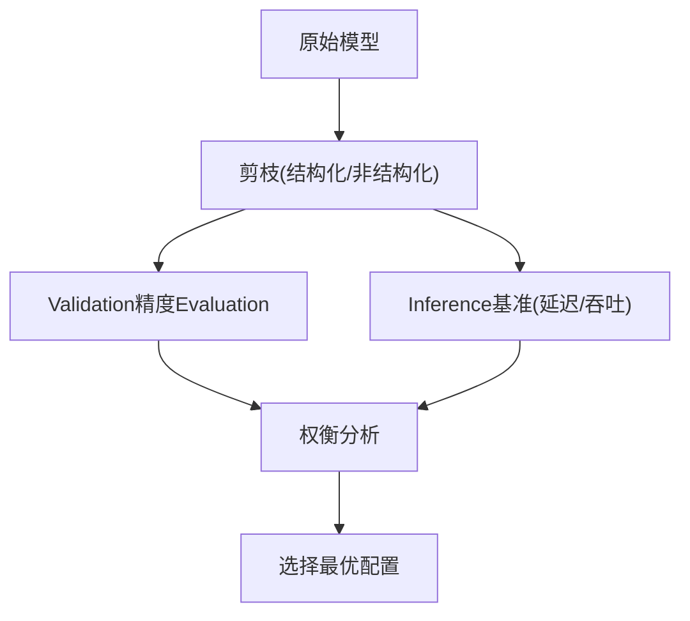
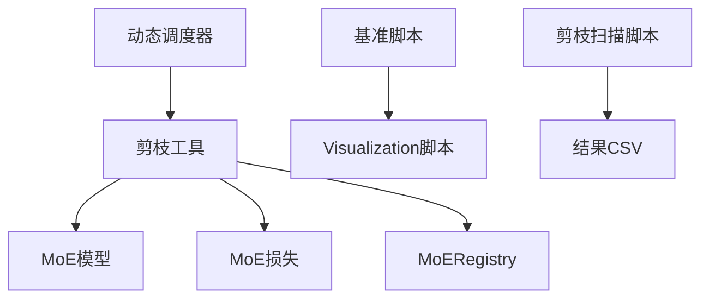

# 专家剪枝机制

<cite>
**Files Referenced in This Document**
- [moe_pruning_dynamic_schedule.md](file://docs/moe_pruning_dynamic_schedule.md)
- [moe_tools.py](file://agent/runtime/cli/moe_tools.py)
- [test_moe_dynamic_scheduler.py](file://tests/test_moe_dynamic_scheduler.py)
- [test_moe_dynamic_schedule.py](file://tests/test_moe_dynamic_schedule.py)
- [mixture_loss.py](file://ultralytics/nn/mixture_loss.py)
- [mixture_registry.py](file://ultralytics/nn/mixture_registry.py)
- [bench_moe_micro.py](file://scripts/bench_moe_micro.py)
- [plot_moe_pruning_sweep.py](file://scripts/plot_moe_pruning_sweep.py)
- [issue52_pruning_results.csv](file://scripts/issue52_pruning_results.csv)
- [issue52_expert_usage_gini.csv](file://scripts/issue52_expert_usage_gini.csv)
- [issue52_per_layer_experts.csv](file://scripts/issue52_per_layer_experts.csv)
- [moe_pruning_sweep.py](file://scripts/moe_pruning_sweep.py)
</cite>

## Table of Contents
1. [Introduction](#Introduction)
2. [Project Structure](#Project Structure)
3. [Core Components](#Core Components)
4. [Architecture Overview](#Architecture Overview)
5. [Detailed Component Analysis](#Detailed Component Analysis)
6. [Dependency Analysis](#Dependency Analysis)
7. [性能考量](#性能考量)
8. [Troubleshooting Guide](#Troubleshooting Guide)
9. [Conclusion](#Conclusion)
10. [Appendix](#Appendix)

## Introduction
本技术Documentation聚焦于YOLO-Master中MoE（Mixture of Experts）专家的剪枝机制，系统性阐述Centered on下方面：
- 专家重要性Evaluation算法：基于激活频率、Gradient范数and输出贡献度的度量方法
- 剪枝策略implementing：结构化and非结构化剪枝的区别and应用场景
- 剪枝过程中的结构重配置：专家索引更新、路由权重重新分配and模型参数压缩
- 可逆性and恢复机制：从剪枝状态恢复to完整模型
- 精度andInference速度影响分析
- 剪枝配置参数说明and调优指南
- 监控MetricsandVisualization分析工具
- 不同数据集andTasks下的剪枝策略推荐方案

## Project Structure
围绕MoE专家剪枝的相关代码andDocumentation主要分布whilesuch as下位置：
- Documentationand计划：docs/moe_pruning_dynamic_schedule.md
- 运行时工具：agent/runtime/cli/moe_tools.py
- 测试用例：tests/test_moe_dynamic_schedule.py、tests/test_moe_dynamic_scheduler.py
- MoE损失and注册：ultralytics/nn/mixture_loss.py、ultralytics/nn/mixture_registry.py
- 基准andVisualization：scripts/bench_moe_micro.py、scripts/plot_moe_pruning_sweep.py
- 剪枝实验脚本and结果：scripts/moe_pruning_sweep.py、scripts/issue52_*.csv

Figure Source
- [moe_pruning_dynamic_schedule.md:1-200](file://docs/moe_pruning_dynamic_schedule.md#L1-L200)
- [moe_tools.py:1-200](file://agent/runtime/cli/moe_tools.py#L1-L200)
- [test_moe_dynamic_schedule.py:1-200](file://tests/test_moe_dynamic_schedule.py#L1-L200)
- [test_moe_dynamic_scheduler.py:1-200](file://tests/test_moe_dynamic_scheduler.py#L1-L200)
- [mixture_loss.py:1-200](file://ultralytics/nn/mixture_loss.py#L1-L200)
- [mixture_registry.py:1-200](file://ultralytics/nn/mixture_registry.py#L1-L200)
- [bench_moe_micro.py:1-200](file://scripts/bench_moe_micro.py#L1-L200)
- [plot_moe_pruning_sweep.py:1-200](file://scripts/plot_moe_pruning_sweep.py#L1-L200)
- [moe_pruning_sweep.py:1-200](file://scripts/moe_pruning_sweep.py#L1-L200)
- [issue52_pruning_results.csv:1-200](file://scripts/issue52_pruning_results.csv#L1-L200)
- [issue52_expert_usage_gini.csv:1-200](file://scripts/issue52_expert_usage_gini.csv#L1-L200)
- [issue52_per_layer_experts.csv:1-200](file://scripts/issue52_per_layer_experts.csv#L1-L200)

Section Source
- [moe_pruning_dynamic_schedule.md:1-200](file://docs/moe_pruning_dynamic_schedule.md#L1-L200)
- [moe_tools.py:1-200](file://agent/runtime/cli/moe_tools.py#L1-L200)
- [test_moe_dynamic_schedule.py:1-200](file://tests/test_moe_dynamic_schedule.py#L1-L200)
- [test_moe_dynamic_scheduler.py:1-200](file://tests/test_moe_dynamic_scheduler.py#L1-L200)
- [mixture_loss.py:1-200](file://ultralytics/nn/mixture_loss.py#L1-L200)
- [mixture_registry.py:1-200](file://ultralytics/nn/mixture_registry.py#L1-L200)
- [bench_moe_micro.py:1-200](file://scripts/bench_moe_micro.py#L1-L200)
- [plot_moe_pruning_sweep.py:1-200](file://scripts/plot_moe_pruning_sweep.py#L1-L200)
- [moe_pruning_sweep.py:1-200](file://scripts/moe_pruning_sweep.py#L1-L200)
- [issue52_pruning_results.csv:1-200](file://scripts/issue52_pruning_results.csv#L1-L200)
- [issue52_expert_usage_gini.csv:1-200](file://scripts/issue52_expert_usage_gini.csv#L1-L200)
- [issue52_per_layer_experts.csv:1-200](file://scripts/issue52_per_layer_experts.csv#L1-L200)

## Core Components
- 动态调度and剪枝策略
  - 动态调度器负责whileTraining或Validation阶段按周期Evaluation专家重要性并执行剪枝决策。其接口and行for由测试用例覆盖，确保稳定性and可重复性。
- 运行时剪枝工具
  - provides剪枝流程的CLI/函数式入口，包括重要性计算、阈值选择、结构重配置andExportetc.capabilities。
- MoE损失and注册
  - 损失Modules包含路由辅助项and专家Load Balancing相关项；Registry用于集中管理MoE变体and配置解析。
- 基准andVisualization
  - 微基准脚本用于测量剪枝前后Inference延迟and吞吐；Visualization脚本将剪枝扫描结果绘制for曲线and热力图。
- 剪枝扫描and结果
  - 扫描脚本遍历不同剪枝率and策略组合，生成CSV结果，便于后续分析and对比。

Section Source
- [test_moe_dynamic_schedule.py:1-200](file://tests/test_moe_dynamic_schedule.py#L1-L200)
- [test_moe_dynamic_scheduler.py:1-200](file://tests/test_moe_dynamic_scheduler.py#L1-L200)
- [moe_tools.py:1-200](file://agent/runtime/cli/moe_tools.py#L1-L200)
- [mixture_loss.py:1-200](file://ultralytics/nn/mixture_loss.py#L1-L200)
- [mixture_registry.py:1-200](file://ultralytics/nn/mixture_registry.py#L1-L200)
- [bench_moe_micro.py:1-200](file://scripts/bench_moe_micro.py#L1-L200)
- [plot_moe_pruning_sweep.py:1-200](file://scripts/plot_moe_pruning_sweep.py#L1-L200)
- [moe_pruning_sweep.py:1-200](file://scripts/moe_pruning_sweep.py#L1-L200)

## Architecture Overview
下图展示了剪枝流程的整体数据and控制流：从重要性Evaluationto剪枝决策，再to结构重配置andExport，最后进行基准andVisualization。

Figure Source
- [moe_tools.py:1-200](file://agent/runtime/cli/moe_tools.py#L1-L200)
- [test_moe_dynamic_schedule.py:1-200](file://tests/test_moe_dynamic_schedule.py#L1-L200)
- [test_moe_dynamic_scheduler.py:1-200](file://tests/test_moe_dynamic_scheduler.py#L1-L200)
- [mixture_loss.py:1-200](file://ultralytics/nn/mixture_loss.py#L1-L200)
- [bench_moe_micro.py:1-200](file://scripts/bench_moe_micro.py#L1-L200)
- [plot_moe_pruning_sweep.py:1-200](file://scripts/plot_moe_pruning_sweep.py#L1-L200)

## Detailed Component Analysis

### 专家重要性Evaluation算法
- 基于激活频率
  - 统计每个专家while前向传播中被选中的次数或比例，作for“Uses度”Metrics。低Uses度专家更可能被剪枝。
- 基于Gradient范数
  - 聚合专家参数的Gradient范数（such asL2范数），反映该专家对损失的敏感度。Gradient范数小的专家对Optimization贡献较低。
- 基于输出贡献度
  - Via扰动专家输出或屏蔽专家路径，观察对最终输出的变化幅度，量化其对Tasks性能的贡献。
- 综合评分and阈值
  - 将上述Metrics归一化后加权融合，得to专家重要性分数；依据目标稀疏度或固定阈值决定剪枝集合。

Figure Source
- [moe_tools.py:1-200](file://agent/runtime/cli/moe_tools.py#L1-L200)
- [test_moe_dynamic_schedule.py:1-200](file://tests/test_moe_dynamic_schedule.py#L1-L200)
- [test_moe_dynamic_scheduler.py:1-200](file://tests/test_moe_dynamic_scheduler.py#L1-L200)

Section Source
- [moe_tools.py:1-200](file://agent/runtime/cli/moe_tools.py#L1-L200)
- [test_moe_dynamic_schedule.py:1-200](file://tests/test_moe_dynamic_schedule.py#L1-L200)
- [test_moe_dynamic_scheduler.py:1-200](file://tests/test_moe_dynamic_scheduler.py#L1-L200)

### 剪枝策略implementing：结构化 vs 非结构化
- 结构化剪枝
  - Centered on整块维度for单位移除专家（例such as整行/整列或整专家通道），保持张量规整性，利于hardware accelerationand部署。
  - Applicable Scenarios：Edge Device Deployment、追求稳定吞吐and低延迟。
- 非结构化剪枝
  - Centered on细粒度权重for零化for主，稀疏矩阵存储and算子Supporting要求更高，通常带来更大压缩比但Inference开销可能不稳定。
  - Applicable Scenarios：离线压缩、需要极致参数压缩且具备稀疏Inference后端。

Figure Source
- [moe_tools.py:1-200](file://agent/runtime/cli/moe_tools.py#L1-L200)
- [test_moe_dynamic_schedule.py:1-200](file://tests/test_moe_dynamic_schedule.py#L1-L200)

Section Source
- [moe_tools.py:1-200](file://agent/runtime/cli/moe_tools.py#L1-L200)
- [test_moe_dynamic_schedule.py:1-200](file://tests/test_moe_dynamic_schedule.py#L1-L200)

### 结构重配置机制
- 专家索引更新
  - 剪枝后需重建专家映射表，使路由逻辑指向新的有效专家ID，避免越界and空洞。
- 路由权重重新分配
  - 根据剩余专家的Uses分布and重要性，调整路由门控权重，维持Load Balancingand稳定性。
- 模型参数压缩
  - 删除被剪枝专家对应的参数块；对于非结构化剪枝，采用稀疏格式或掩码保存Centered on减少体积。

Figure Source
- [moe_tools.py:1-200](file://agent/runtime/cli/moe_tools.py#L1-L200)
- [test_moe_dynamic_scheduler.py:1-200](file://tests/test_moe_dynamic_scheduler.py#L1-L200)

Section Source
- [moe_tools.py:1-200](file://agent/runtime/cli/moe_tools.py#L1-L200)
- [test_moe_dynamic_scheduler.py:1-200](file://tests/test_moe_dynamic_scheduler.py#L1-L200)

### 可逆性and恢复机制
- 快照and元数据
  - while剪枝前保存专家索引映射、路由权重and掩码信息，Centered on便回滚。
- 恢复流程
  - 加载快照，重建完整专家集，恢复路由权重and参数布局，再执行Optional的微调Centered on修复精度。
- 注意事项
  - 确保备份中包含所有必要的元数据；恢复后建议进行轻量微调Centered on缓解分布偏移。

Figure Source
- [moe_tools.py:1-200](file://agent/runtime/cli/moe_tools.py#L1-L200)
- [test_moe_dynamic_schedule.py:1-200](file://tests/test_moe_dynamic_schedule.py#L1-L200)

Section Source
- [moe_tools.py:1-200](file://agent/runtime/cli/moe_tools.py#L1-L200)
- [test_moe_dynamic_schedule.py:1-200](file://tests/test_moe_dynamic_schedule.py#L1-L200)

### 精度andInference速度影响分析
- 精度影响
  - 剪枝会改变专家容量and路由分布，可能导致精度下降；可Via选择性保留关键专家and微调缓解。
- Inference速度
  - 结构化剪枝通常能显著降低延迟and内存占用；非结构化剪枝while具备稀疏Inference后端时可获得更好收益。
- Evaluation方式
  - Uses微基准脚本测量不同剪枝率下的延迟and吞吐，CombiningValidation集精度进行权衡。

Figure Source
- [bench_moe_micro.py:1-200](file://scripts/bench_moe_micro.py#L1-L200)
- [plot_moe_pruning_sweep.py:1-200](file://scripts/plot_moe_pruning_sweep.py#L1-L200)

Section Source
- [bench_moe_micro.py:1-200](file://scripts/bench_moe_micro.py#L1-L200)
- [plot_moe_pruning_sweep.py:1-200](file://scripts/plot_moe_pruning_sweep.py#L1-L200)

### 剪枝配置参数说明and调优指南
- 关键参数
  - 剪枝率：控制整体稀疏程度
  - 策略类型：结构化或非结构化
  - 重要性阈值：决定专家去留的临界值
  - Evaluation窗口：统计激活/Gradient的时间窗口大小
  - 恢复开关：是否启用快照and恢复
- 调优建议
  - 从小剪枝率起步，逐步增加并监控精度and延迟变化
  - 优先尝试结构化剪枝Centered on获得稳定的部署收益
  - 若精度下降明显，启用微调或提高阈值

Section Source
- [moe_pruning_sweep.py:1-200](file://scripts/moe_pruning_sweep.py#L1-L200)
- [plot_moe_pruning_sweep.py:1-200](file://scripts/plot_moe_pruning_sweep.py#L1-L200)

### 监控MetricsandVisualization分析工具
- 监控Metrics
  - 专家Uses分布（Gini系数）、每层专家数量、剪枝前后精度and延迟
- Visualization工具
  - 扫描结果绘图脚本可将多组实验结果汇总for曲线and表格，便于对比不同策略and剪枝率的效果

Section Source
- [issue52_expert_usage_gini.csv:1-200](file://scripts/issue52_expert_usage_gini.csv#L1-L200)
- [issue52_per_layer_experts.csv:1-200](file://scripts/issue52_per_layer_experts.csv#L1-L200)
- [plot_moe_pruning_sweep.py:1-200](file://scripts/plot_moe_pruning_sweep.py#L1-L200)

### 不同数据集andTasks的剪枝策略推荐
- 小样本/高噪声数据集
  - 倾向保守剪枝率and结构化剪枝，Combined with微调提升鲁棒性
- 大规模检测/分割Tasks
  - 可适度提高剪枝率，重点保留高频专家；关注路由均衡Centered on避免热点
- Edge Deployment场景
  - 首选结构化剪枝，CombiningExportOptimizationand量化，最大化吞吐and最小化延迟

Section Source
- [moe_pruning_sweep.py:1-200](file://scripts/moe_pruning_sweep.py#L1-L200)
- [bench_moe_micro.py:1-200](file://scripts/bench_moe_micro.py#L1-L200)

## Dependency Analysis
- 组件耦合
  - 动态调度器依赖剪枝工具andMoE模型；剪枝工具依赖损失andRegistryCentered on获取路由and专家信息
- External Dependencies
  - 基准andVisualization脚本依赖Data processingand绘图库；CSV结果用于离线分析

Figure Source
- [moe_tools.py:1-200](file://agent/runtime/cli/moe_tools.py#L1-L200)
- [mixture_loss.py:1-200](file://ultralytics/nn/mixture_loss.py#L1-L200)
- [mixture_registry.py:1-200](file://ultralytics/nn/mixture_registry.py#L1-L200)
- [bench_moe_micro.py:1-200](file://scripts/bench_moe_micro.py#L1-L200)
- [plot_moe_pruning_sweep.py:1-200](file://scripts/plot_moe_pruning_sweep.py#L1-L200)
- [moe_pruning_sweep.py:1-200](file://scripts/moe_pruning_sweep.py#L1-L200)

Section Source
- [moe_tools.py:1-200](file://agent/runtime/cli/moe_tools.py#L1-L200)
- [mixture_loss.py:1-200](file://ultralytics/nn/mixture_loss.py#L1-L200)
- [mixture_registry.py:1-200](file://ultralytics/nn/mixture_registry.py#L1-L200)
- [bench_moe_micro.py:1-200](file://scripts/bench_moe_micro.py#L1-L200)
- [plot_moe_pruning_sweep.py:1-200](file://scripts/plot_moe_pruning_sweep.py#L1-L200)
- [moe_pruning_sweep.py:1-200](file://scripts/moe_pruning_sweep.py#L1-L200)

## 性能考量
- 结构化剪枝更适合生产部署，因其保持张量规整性，易于编译器and后端Optimization
- 非结构化剪枝while具备稀疏Inference后端时可取得更高压缩比，但需注意算子Supportingand稳定性
- 建议while剪枝后进行轻量微调，Centered on恢复因专家减少带来的精度损失
- Uses微基准while不同设备上测量延迟and吞吐，Combining业务SLA选择合适配置

[This section provides general guidance and does not directly analyze specific files]

## Troubleshooting Guide
- 常见问题
  - 路由越界：检查专家索引映射是否正确更新
  - 精度骤降：降低剪枝率或提高阈值，必要时启用微调
  - Inference异常：确认剪枝后的模型结构andExport格式一致
- 定位手段
  - 查看专家Uses分布CSVand每层专家统计CSV，识别热点and空洞
  - Uses基准脚本复现延迟问题，定位bottlenecks层

Section Source
- [issue52_expert_usage_gini.csv:1-200](file://scripts/issue52_expert_usage_gini.csv#L1-L200)
- [issue52_per_layer_experts.csv:1-200](file://scripts/issue52_per_layer_experts.csv#L1-L200)
- [bench_moe_micro.py:1-200](file://scripts/bench_moe_micro.py#L1-L200)

## Conclusion
YOLO-Master的MoE专家剪枝机制Via多维重要性Evaluationand灵活的剪枝策略，implementing了while精度and效率之间的良好平衡。结构化剪枝适合部署导向的场景，而非结构化剪枝适用于极致压缩需求。Via动态调度、结构重配置and可逆恢复机制，系统provides了稳健的剪枝生命周期管理。Combining监控MetricsandVisualization工具，User可while不同数据集andTasks下快速找to最优剪枝配置。

[This section is summary content and does not directly analyze specific files]

## Appendix
- Refer toDocumentationand计划
  - 动态调度and剪枝计划Documentationprovides了高层设计and约束条件
- Examplesand脚本
  - 剪枝扫描andVisualization脚本便于批量实验and结果对比
- 结果样例
  - CSV结果文件可用于离线分析and报告生成

Section Source
- [moe_pruning_dynamic_schedule.md:1-200](file://docs/moe_pruning_dynamic_schedule.md#L1-L200)
- [moe_pruning_sweep.py:1-200](file://scripts/moe_pruning_sweep.py#L1-L200)
- [issue52_pruning_results.csv:1-200](file://scripts/issue52_pruning_results.csv#L1-L200)