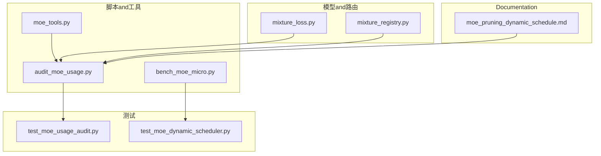
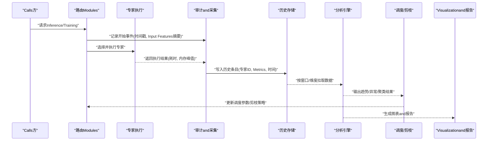
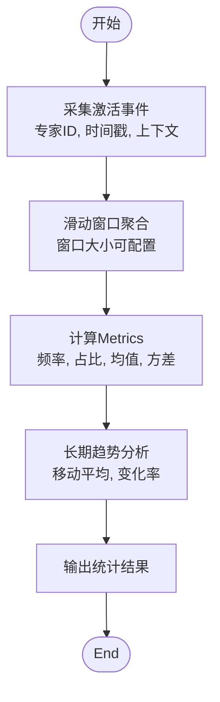
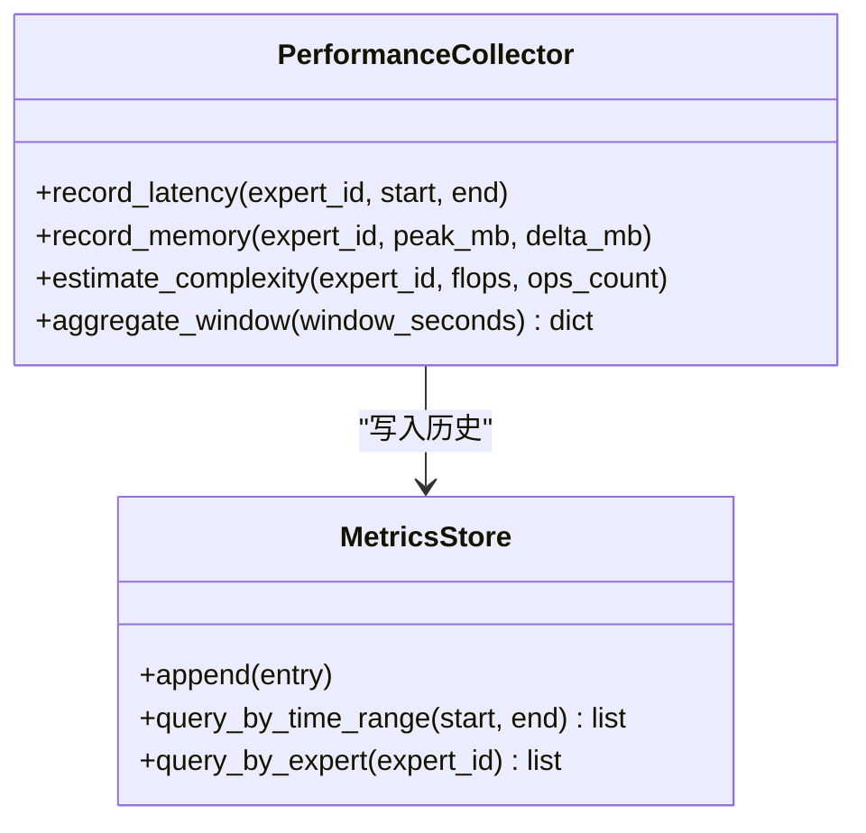
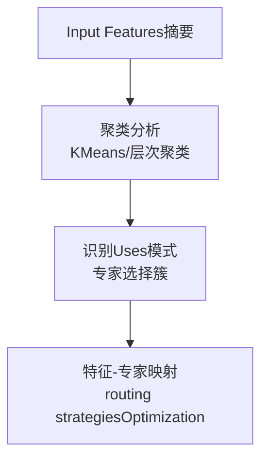
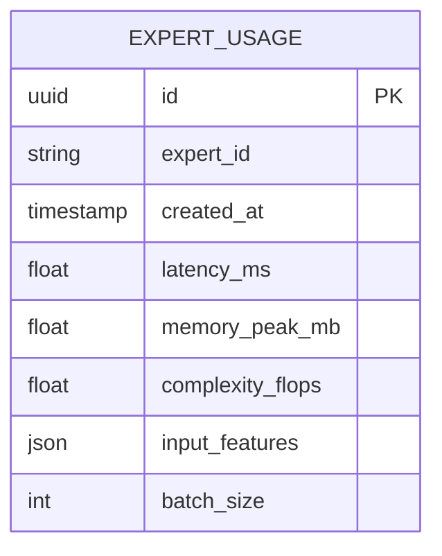
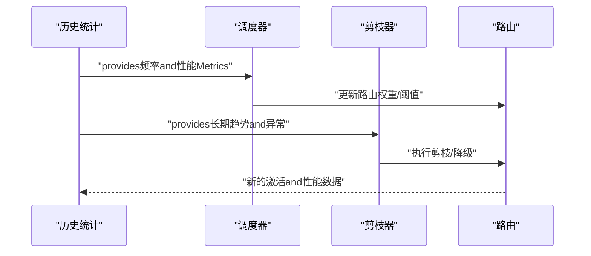
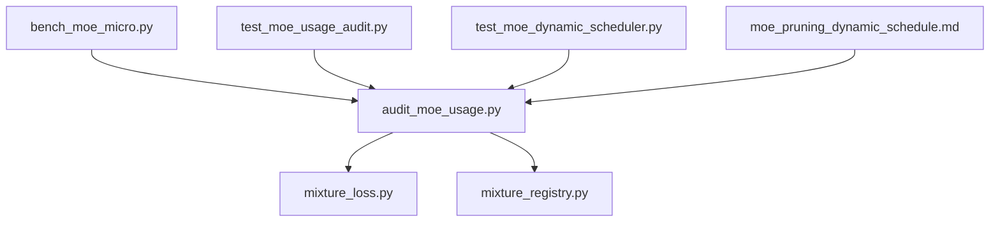

# 专家Uses历史统计

<cite>
**Files Referenced in This Document**
- [moe_pruning_dynamic_schedule.md](file://docs/moe_pruning_dynamic_schedule.md)
- [audit_moe_usage.py](file://scripts/audit_moe_usage.py)
- [bench_moe_micro.py](file://scripts/bench_moe_micro.py)
- [test_moe_usage_audit.py](file://tests/test_moe_usage_audit.py)
- [test_moe_dynamic_scheduler.py](file://tests/test_moe_dynamic_scheduler.py)
- [mixture_loss.py](file://ultralytics/nn/mixture_loss.py)
- [mixture_registry.py](file://ultralytics/nn/mixture_registry.py)
- [moe_tools.py](file://agent/runtime/cli/moe_tools.py)
</cite>

## Table of Contents
1. [Introduction](#Introduction)
2. [Project Structure](#Project Structure)
3. [Core Components](#Core Components)
4. [Architecture Overview](#Architecture Overview)
5. [Detailed Component Analysis](#Detailed Component Analysis)
6. [Dependency Analysis](#Dependency Analysis)
7. [性能考量](#性能考量)
8. [Troubleshooting Guide](#Troubleshooting Guide)
9. [Conclusion](#Conclusion)
10. [Appendix](#Appendix)

## Introduction
本技术Documentation聚焦于YOLO-Master的MoE（Mixture of Experts）专家Uses历史统计系统，围绕Centered on下目标unfold：
- 专家激活频率统计的implementing原理：实时收集、滑动窗口计算and长期趋势分析
- 专家性能Metrics采集and分析：响应时间、内存占用、计算复杂度
- 专家Uses模式识别and聚类分析：Input Featuresand专家选择的关联
- 历史数据存储格式and查询接口：Supporting时间序列分析and批量统计
- 历史统计对专家调度and剪枝决策的Supporting
- 历史数据Visualization工具and报告生成器
- 历史数据管理and维护策略：清理and归档
- 基于历史分析的Optimization建议

## Project Structure
and“专家Uses历史统计”直接相关的代码andDocumentation主要分布whilesuch as下位置：
- 脚本层：用于审计、基准测试and动态调度Evaluation
- 测试层：覆盖审计and动态调度逻辑的正确性and稳定性
- 模型and路由层：providesMixture路由and损失相关的基础设施
- Documentation层：包含动态调度and剪枝策略的设计说明

Figure Source
- [audit_moe_usage.py:1-200](file://scripts/audit_moe_usage.py#L1-L200)
- [bench_moe_micro.py:1-200](file://scripts/bench_moe_micro.py#L1-L200)
- [moe_tools.py:1-200](file://agent/runtime/cli/moe_tools.py#L1-L200)
- [test_moe_usage_audit.py:1-200](file://tests/test_moe_usage_audit.py#L1-L200)
- [test_moe_dynamic_scheduler.py:1-200](file://tests/test_moe_dynamic_scheduler.py#L1-L200)
- [mixture_loss.py:1-200](file://ultralytics/nn/mixture_loss.py#L1-L200)
- [mixture_registry.py:1-200](file://ultralytics/nn/mixture_registry.py#L1-L200)
- [moe_pruning_dynamic_schedule.md:1-200](file://docs/moe_pruning_dynamic_schedule.md#L1-L200)

Section Source
- [audit_moe_usage.py:1-200](file://scripts/audit_moe_usage.py#L1-L200)
- [bench_moe_micro.py:1-200](file://scripts/bench_moe_micro.py#L1-L200)
- [moe_tools.py:1-200](file://agent/runtime/cli/moe_tools.py#L1-L200)
- [test_moe_usage_audit.py:1-200](file://tests/test_moe_usage_audit.py#L1-L200)
- [test_moe_dynamic_scheduler.py:1-200](file://tests/test_moe_dynamic_scheduler.py#L1-L200)
- [mixture_loss.py:1-200](file://ultralytics/nn/mixture_loss.py#L1-L200)
- [mixture_registry.py:1-200](file://ultralytics/nn/mixture_registry.py#L1-L200)
- [moe_pruning_dynamic_schedule.md:1-200](file://docs/moe_pruning_dynamic_schedule.md#L1-L200)

## Core Components
- 审计and采集Modules：负责whileInference或Training过程中捕获专家选择、激活次数、耗时and资源消耗etc.Metrics，并写入历史存储。
- 滑动窗口and趋势分析：基于时间窗口聚合近期统计，同时维护长期趋势Centered on识别冷热点专家and漂移现象。
- 动态调度and剪枝策略：依据历史统计结果调整专家权重、路由阈值或执行剪枝计划，提升吞吐and能效。
- Visualizationand报告：将历史统计结果输出for图表and报告，辅助运维and算法Engineers进行诊断and调优。

Section Source
- [audit_moe_usage.py:1-200](file://scripts/audit_moe_usage.py#L1-L200)
- [bench_moe_micro.py:1-200](file://scripts/bench_moe_micro.py#L1-L200)
- [moe_pruning_dynamic_schedule.md:1-200](file://docs/moe_pruning_dynamic_schedule.md#L1-L200)

## Architecture Overview
整体流程从数据采集to分析再to决策闭环，关键路径such as下：
- 数据采集：while路由and专家执行前后埋点，记录专家ID、激活时间戳、耗时、内存峰值、Input Features摘要etc.
- 存储and索引：按时间序列组织数据，Supporting按专家、时间范围、Tasks类型etc.多维查询
- 分析引擎：滑动窗口聚合、长期趋势拟合、异常检测and模式聚类
- 决策and执行：根据分析结果更新调度参数或触发剪枝动作
- Visualizationand报告：生成时序图、热力图、分布图and文本报告

Figure Source
- [audit_moe_usage.py:1-200](file://scripts/audit_moe_usage.py#L1-L200)
- [bench_moe_micro.py:1-200](file://scripts/bench_moe_micro.py#L1-L200)
- [moe_pruning_dynamic_schedule.md:1-200](file://docs/moe_pruning_dynamic_schedule.md#L1-L200)

## Detailed Component Analysis

### 专家激活频率统计
- 实时收集：while路由阶段and专家执行阶段埋点，记录每次激活的时间戳、专家IDand上下文信息
- 滑动窗口计算：按固定时间窗口（such asMinutes/小时）聚合激活计数，计算窗口内频率and占比
- 长期趋势分析：维护滚动均值、方差and变化率，识别冷热点转移and周期性波动

Figure Source
- [audit_moe_usage.py:1-200](file://scripts/audit_moe_usage.py#L1-L200)
- [bench_moe_micro.py:1-200](file://scripts/bench_moe_micro.py#L1-L200)

Section Source
- [audit_moe_usage.py:1-200](file://scripts/audit_moe_usage.py#L1-L200)
- [bench_moe_micro.py:1-200](file://scripts/bench_moe_micro.py#L1-L200)

### 专家性能Metrics采集and分析
- 响应时间：记录专家执行的起止时间差，Supporting分位数统计（P50/P90/P99）
- 内存占用：采集专家执行期间的内存峰值and增量，Combining批大小and输入尺寸归一化
- 计算复杂度：估算FLOPs或算子数量，Combining硬件利用率Evaluation效率

Figure Source
- [bench_moe_micro.py:1-200](file://scripts/bench_moe_micro.py#L1-L200)
- [audit_moe_usage.py:1-200](file://scripts/audit_moe_usage.py#L1-L200)

Section Source
- [bench_moe_micro.py:1-200](file://scripts/bench_moe_micro.py#L1-L200)
- [audit_moe_usage.py:1-200](file://scripts/audit_moe_usage.py#L1-L200)

### 专家Uses模式识别and聚类分析
- 特征工程：提取Input Features摘要（such as类别分布、图像尺寸、场景标签）and专家选择向量
- 聚类方法：Uses无监督聚类（such asKMeans或层次聚类）发现典型Uses模式
- 关联分析：建立Input Features簇and专家选择模式的映射，指导routing strategiesOptimization

Figure Source
- [audit_moe_usage.py:1-200](file://scripts/audit_moe_usage.py#L1-L200)
- [bench_moe_micro.py:1-200](file://scripts/bench_moe_micro.py#L1-L200)

Section Source
- [audit_moe_usage.py:1-200](file://scripts/audit_moe_usage.py#L1-L200)
- [bench_moe_micro.py:1-200](file://scripts/bench_moe_micro.py#L1-L200)

### 历史数据存储格式and查询接口
- 存储格式：每条记录包含专家ID、时间戳、Metrics字典（延迟、内存、复杂度）、Input Features摘要and批次信息
- 查询接口：Supporting按时间范围、专家ID、Tasks类型、Batch Sizeetc.条件过滤and聚合
- 批量统计：provides窗口聚合、分位数统计、趋势拟合etc.批量分析capabilities

Figure Source
- [audit_moe_usage.py:1-200](file://scripts/audit_moe_usage.py#L1-L200)
- [bench_moe_micro.py:1-200](file://scripts/bench_moe_micro.py#L1-L200)

Section Source
- [audit_moe_usage.py:1-200](file://scripts/audit_moe_usage.py#L1-L200)
- [bench_moe_micro.py:1-200](file://scripts/bench_moe_micro.py#L1-L200)

### 历史统计对专家调度and剪枝决策的Supporting
- 动态调度：依据滑动窗口内的激活频率and性能Metrics，动态调整专家权重或路由阈值
- 剪枝策略：对长期低激活且高延迟的专家进行剪枝或降级，释放资源给热点专家
- 反馈闭环：调度and剪枝结果再次进入历史统计，形成持续Optimization的闭环

Figure Source
- [moe_pruning_dynamic_schedule.md:1-200](file://docs/moe_pruning_dynamic_schedule.md#L1-L200)
- [audit_moe_usage.py:1-200](file://scripts/audit_moe_usage.py#L1-L200)

Section Source
- [moe_pruning_dynamic_schedule.md:1-200](file://docs/moe_pruning_dynamic_schedule.md#L1-L200)
- [audit_moe_usage.py:1-200](file://scripts/audit_moe_usage.py#L1-L200)

### Visualization工具and报告生成器
- Visualization：生成专家激活时序图、延迟分布直方图、内存占用曲线and专家热力图
- 报告：汇总窗口统计、趋势分析、异常检测结果and调度/剪枝建议
- 集成：Via脚本或APIExport图表and报告，便于纳入监控平台

Section Source
- [audit_moe_usage.py:1-200](file://scripts/audit_moe_usage.py#L1-L200)
- [bench_moe_micro.py:1-200](file://scripts/bench_moe_micro.py#L1-L200)

### 历史数据管理and维护策略
- 数据清理：定期删除过期窗口数据，保留长期趋势摘要
- 归档机制：将冷数据压缩归档至低成本存储，保持while线查询性能
- 一致性校验：对历史数据进行完整性and一致性检查，防止脏数据影响分析

Section Source
- [audit_moe_usage.py:1-200](file://scripts/audit_moe_usage.py#L1-L200)
- [bench_moe_micro.py:1-200](file://scripts/bench_moe_micro.py#L1-L200)

### 基于历史分析的Optimization建议
- routing strategies：根据聚类结果and特征-专家映射Optimization路由规则，减少跨域切换
- 资源分配：for热点专家预留更多资源，降低尾延迟
- 模型裁剪：对长尾专家进行LoRA微调或合并，平衡精度and效率

Section Source
- [moe_pruning_dynamic_schedule.md:1-200](file://docs/moe_pruning_dynamic_schedule.md#L1-L200)
- [audit_moe_usage.py:1-200](file://scripts/audit_moe_usage.py#L1-L200)

## Dependency Analysis
- 审计and基准脚本依赖路由and损失Modulesprovides的上下文andMetrics
- 测试用例Validation审计and动态调度的正确性
- Documentationdrivers are installed调度and剪枝策略的设计and演进

Figure Source
- [audit_moe_usage.py:1-200](file://scripts/audit_moe_usage.py#L1-L200)
- [bench_moe_micro.py:1-200](file://scripts/bench_moe_micro.py#L1-L200)
- [test_moe_usage_audit.py:1-200](file://tests/test_moe_usage_audit.py#L1-L200)
- [test_moe_dynamic_scheduler.py:1-200](file://tests/test_moe_dynamic_scheduler.py#L1-L200)
- [mixture_loss.py:1-200](file://ultralytics/nn/mixture_loss.py#L1-L200)
- [mixture_registry.py:1-200](file://ultralytics/nn/mixture_registry.py#L1-L200)
- [moe_pruning_dynamic_schedule.md:1-200](file://docs/moe_pruning_dynamic_schedule.md#L1-L200)

Section Source
- [audit_moe_usage.py:1-200](file://scripts/audit_moe_usage.py#L1-L200)
- [bench_moe_micro.py:1-200](file://scripts/bench_moe_micro.py#L1-L200)
- [test_moe_usage_audit.py:1-200](file://tests/test_moe_usage_audit.py#L1-L200)
- [test_moe_dynamic_scheduler.py:1-200](file://tests/test_moe_dynamic_scheduler.py#L1-L200)
- [mixture_loss.py:1-200](file://ultralytics/nn/mixture_loss.py#L1-L200)
- [mixture_registry.py:1-200](file://ultralytics/nn/mixture_registry.py#L1-L200)
- [moe_pruning_dynamic_schedule.md:1-200](file://docs/moe_pruning_dynamic_schedule.md#L1-L200)

## 性能考量
- 采样and降频：while高吞吐场景下采用采样策略降低审计开销
- 异步写入：将历史数据写入操作异步化，避免阻塞主路径
- 窗口大小权衡：较短窗口提高灵敏度但噪声较大，较长窗口平滑但滞后明显
- 内存控制：限制历史数据缓存大小，and时淘汰旧窗口数据

## Troubleshooting Guide
- Metrics缺失：检查埋点是否生效，确认路由and专家执行边界是否正确
- 数据不一致：核对时间戳对齐and批次信息一致性，确保聚合口径统一
- 调度失效：Validation分析结果to调度参数的映射逻辑，检查阈值and权重更新
- 报告异常：确认Visualizationand报告生成器的输入数据完整and格式正确

Section Source
- [test_moe_usage_audit.py:1-200](file://tests/test_moe_usage_audit.py#L1-L200)
- [test_moe_dynamic_scheduler.py:1-200](file://tests/test_moe_dynamic_scheduler.py#L1-L200)

## Conclusion
专家Uses历史统计系统Via实时采集、滑动窗口and长期趋势分析，forMoE的动态调度and剪枝provides了可靠的数据基础。CombiningVisualizationand报告工具，运维and算法团队能够高效定位bottlenecks、Optimizationrouting strategiesand资源配置，implementing精度and效率的平衡。

## Appendix
- 术语表：专家、路由、滑动窗口、动态调度、剪枝
- Refer toDocumentation：动态调度and剪枝策略设计说明
- Examples脚本：审计and基准测试入口