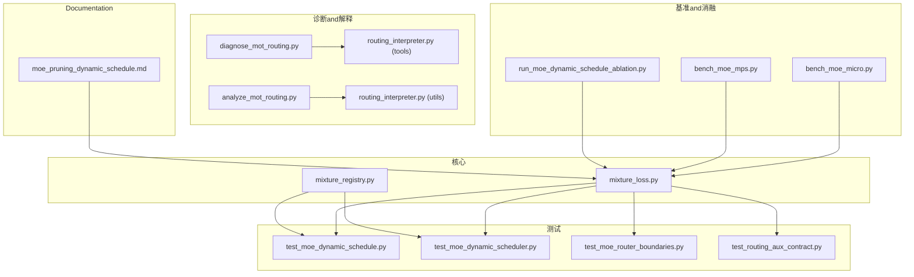
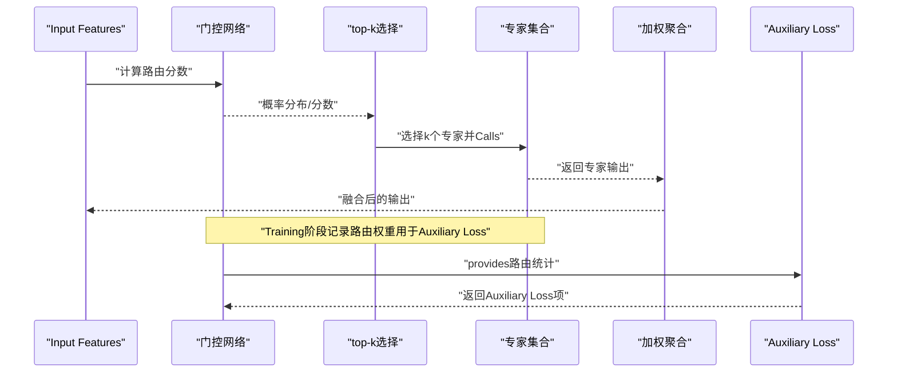
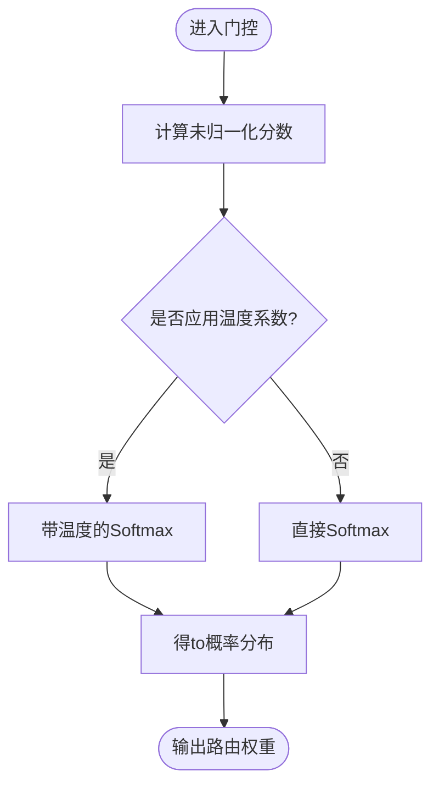
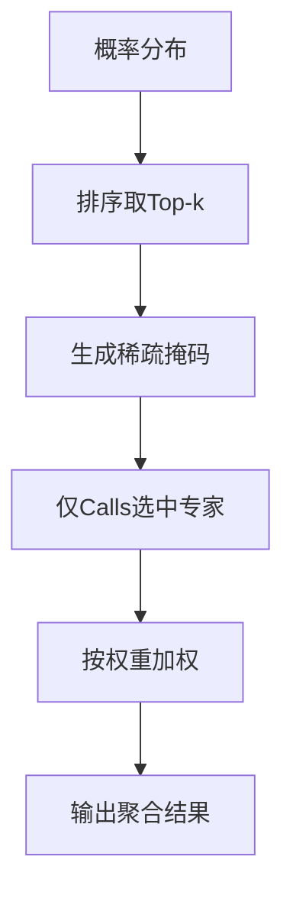
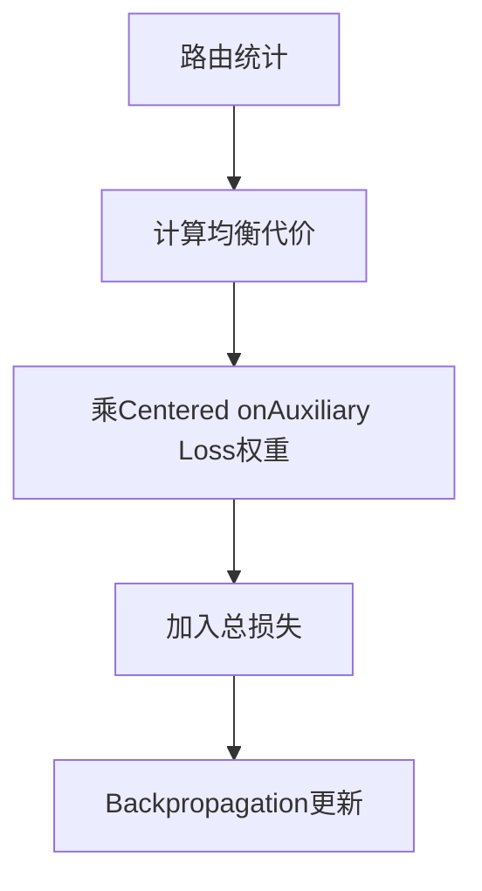
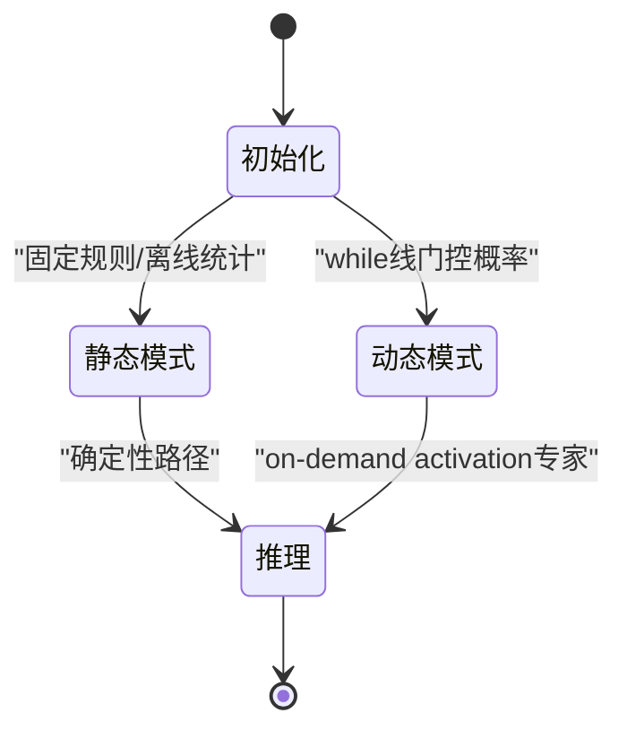
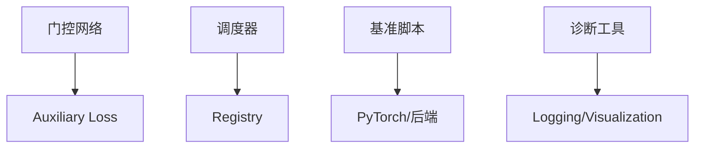

# 专家调度器

<cite>
**Files Referenced in This Document**
- [mixture_loss.py](file://ultralytics/nn/mixture_loss.py)
- [mixture_registry.py](file://ultralytics/nn/mixture_registry.py)
- [test_moe_dynamic_schedule.py](file://tests/test_moe_dynamic_schedule.py)
- [test_moe_dynamic_scheduler.py](file://tests/test_moe_dynamic_scheduler.py)
- [test_moe_router_boundaries.py](file://tests/test_moe_router_boundaries.py)
- [test_routing_aux_contract.py](file://tests/test_routing_aux_contract.py)
- [bench_moe_micro.py](file://scripts/bench_moe_micro.py)
- [bench_moe_mps.py](file://scripts/bench_moe_mps.py)
- [run_moe_dynamic_schedule_ablation.py](file://scripts/run_moe_dynamic_schedule_ablation.py)
- [diagnose_mot_routing.py](file://scripts/diagnose_mot_routing.py)
- [analyze_mot_routing.py](file://scripts/analyze_mot_routing.py)
- [routing_interpreter.py](file://tools/routing_interpreter.py)
- [routing_interpreter.py](file://ultralytics/utils/routing_interpreter.py)
- [moe_pruning_dynamic_schedule.md](file://docs/moe_pruning_dynamic_schedule.md)
</cite>

## Table of Contents
1. [Introduction](#Introduction)
2. [Project Structure](#Project Structure)
3. [Core Components](#Core Components)
4. [Architecture Overview](#Architecture Overview)
5. [Detailed Component Analysis](#Detailed Component Analysis)
6. [Dependency Analysis](#Dependency Analysis)
7. [性能考量](#性能考量)
8. [Troubleshooting Guide](#Troubleshooting Guide)
9. [Conclusion](#Conclusion)
10. [Appendix](#Appendix)

## Introduction
本技术Documentation聚焦于YOLO-Master的MoE（Mixture专家）专家调度器，系统阐述静态and动态调度策略的implementing原理、门控网络设计、基于路由权重的专家选择算法、Load Balancing机制andAuxiliary Loss。Documentation同时覆盖TrainingandInference阶段的行for差异、配置参数（top-k、Auxiliary Loss权重、温度系数）、性能Optimization（专家预加载、缓存、并行处理）、API接口andUsesExamples、监控Metricsand调试工具，Centered onand调度策略对模型性能andTraining稳定性的影响和最佳实践建议。

## Project Structure
围绕MoE调度器的关键代码and资源分布such as下：
- 核心implementingandRegistry
  - Mixture损失and路由Auxiliary Loss：[mixture_loss.py](file://ultralytics/nn/mixture_loss.py)
  - MixtureModulesRegistryand契约：[mixture_registry.py](file://ultralytics/nn/mixture_registry.py)
- 测试andValidation
  - 动态调度and边界约束：[test_moe_dynamic_schedule.py](file://tests/test_moe_dynamic_schedule.py)、[test_moe_dynamic_scheduler.py](file://tests/test_moe_dynamic_scheduler.py)、[test_moe_router_boundaries.py](file://tests/test_moe_router_boundaries.py)
  - 路由Auxiliary Loss契约：[test_routing_aux_contract.py](file://tests/test_routing_aux_contract.py)
- 基准and消融
  - 微基准andMPS平台基准：[bench_moe_micro.py](file://scripts/bench_moe_micro.py)、[bench_moe_mps.py](file://scripts/bench_moe_mps.py)
  - 动态调度消融脚本：[run_moe_dynamic_schedule_ablation.py](file://scripts/run_moe_dynamic_schedule_ablation.py)
- 诊断and解释
  - MOT场景路由诊断and分析：[diagnose_mot_routing.py](file://scripts/diagnose_mot_routing.py)、[analyze_mot_routing.py](file://scripts/analyze_mot_routing.py)
  - 路由Explainer（工具and运行时）：[routing_interpreter.py](file://tools/routing_interpreter.py)、[routing_interpreter.py](file://ultralytics/utils/routing_interpreter.py)
- Documentation
  - 动态调度and剪枝说明：[moe_pruning_dynamic_schedule.md](file://docs/moe_pruning_dynamic_schedule.md)

**Figure Source**
- [mixture_loss.py](file://ultralytics/nn/mixture_loss.py)
- [mixture_registry.py](file://ultralytics/nn/mixture_registry.py)
- [test_moe_dynamic_schedule.py](file://tests/test_moe_dynamic_schedule.py)
- [test_moe_dynamic_scheduler.py](file://tests/test_moe_dynamic_scheduler.py)
- [test_moe_router_boundaries.py](file://tests/test_moe_router_boundaries.py)
- [test_routing_aux_contract.py](file://tests/test_routing_aux_contract.py)
- [bench_moe_micro.py](file://scripts/bench_moe_micro.py)
- [bench_moe_mps.py](file://scripts/bench_moe_mps.py)
- [run_moe_dynamic_schedule_ablation.py](file://scripts/run_moe_dynamic_schedule_ablation.py)
- [diagnose_mot_routing.py](file://scripts/diagnose_mot_routing.py)
- [analyze_mot_routing.py](file://scripts/analyze_mot_routing.py)
- [routing_interpreter.py](file://tools/routing_interpreter.py)
- [routing_interpreter.py](file://ultralytics/utils/routing_interpreter.py)
- [moe_pruning_dynamic_schedule.md](file://docs/moe_pruning_dynamic_schedule.md)

**Section Source**
- [mixture_loss.py](file://ultralytics/nn/mixture_loss.py)
- [mixture_registry.py](file://ultralytics/nn/mixture_registry.py)
- [test_moe_dynamic_schedule.py](file://tests/test_moe_dynamic_schedule.py)
- [test_moe_dynamic_scheduler.py](file://tests/test_moe_dynamic_scheduler.py)
- [test_moe_router_boundaries.py](file://tests/test_moe_router_boundaries.py)
- [test_routing_aux_contract.py](file://tests/test_routing_aux_contract.py)
- [bench_moe_micro.py](file://scripts/bench_moe_micro.py)
- [bench_moe_mps.py](file://scripts/bench_moe_mps.py)
- [run_moe_dynamic_schedule_ablation.py](file://scripts/run_moe_dynamic_schedule_ablation.py)
- [diagnose_mot_routing.py](file://scripts/diagnose_mot_routing.py)
- [analyze_mot_routing.py](file://scripts/analyze_mot_routing.py)
- [routing_interpreter.py](file://tools/routing_interpreter.py)
- [routing_interpreter.py](file://ultralytics/utils/routing_interpreter.py)
- [moe_pruning_dynamic_schedule.md](file://docs/moe_pruning_dynamic_schedule.md)

## Core Components
- 路由and门控网络
  - 负责将Input Features映射to专家概率分布，Supporting温度系数调节选择锐度。
  - whileTraining时输出软路由权重；whileInference时可切换for硬选择或近似硬选择Centered on提升吞吐。
- 专家选择and聚合
  - top-k选择策略：从门控概率中选择k个专家进行计算并加权求和。
  - 稀疏激活：仅激活被选中的专家，降低计算量。
- Load BalancingandAuxiliary Loss
  - ViaAuxiliary Loss鼓励各专家均匀Uses，避免“专家坍缩”。
  - Auxiliary Loss权重可配置，Centered on平衡主Tasks损失and均衡目标。
- 静态and动态调度
  - 静态调度：按固定规则或离线统计分配专家，适合部署期确定性路径。
  - 动态调度：while线根据Input Features的门控概率选择专家，灵活适配数据分布变化。
- 注册and契约
  - ViaRegistry管理不同MoE变体androuting strategies，确保Training/Inference一致性and可Extensibility。

**Section Source**
- [mixture_loss.py](file://ultralytics/nn/mixture_loss.py)
- [mixture_registry.py](file://ultralytics/nn/mixture_registry.py)
- [test_moe_dynamic_schedule.py](file://tests/test_moe_dynamic_schedule.py)
- [test_moe_dynamic_scheduler.py](file://tests/test_moe_dynamic_scheduler.py)
- [test_moe_router_boundaries.py](file://tests/test_moe_router_boundaries.py)
- [test_routing_aux_contract.py](file://tests/test_routing_aux_contract.py)

## Architecture Overview
下图展示调度器whileTrainingandInference阶段的整体交互流程，包括门控网络、top-k选择、专家执行and结果聚合，Centered onandAuxiliary Loss的注入点。

**Figure Source**
- [mixture_loss.py](file://ultralytics/nn/mixture_loss.py)
- [mixture_registry.py](file://ultralytics/nn/mixture_registry.py)

## Detailed Component Analysis

### 门控网络and路由权重
- 功能要点
  - Input Features经线性变换后得to未归一化分数，再ViaSoftmax（受温度系数控制）得to概率分布。
  - 温度系数越大，分布越平滑；越小则更尖锐，接近硬选择。
- TrainingandInference差异
  - Training：保留完整概率分布Centered on计算Auxiliary Loss。
  - Inference：可启用近似硬选择Centered on降低开销，或whileExport后采用静态路径。
- 相关implementingRefer to
  - 路由Auxiliary Lossand统计收集：[mixture_loss.py](file://ultralytics/nn/mixture_loss.py)
  - 路由契约and注册：[mixture_registry.py](file://ultralytics/nn/mixture_registry.py)

**Figure Source**
- [mixture_loss.py](file://ultralytics/nn/mixture_loss.py)

**Section Source**
- [mixture_loss.py](file://ultralytics/nn/mixture_loss.py)
- [mixture_registry.py](file://ultralytics/nn/mixture_registry.py)

### top-k选择and稀疏激活
- 功能要点
  - 依据概率分布选取前k个专家，其余专家置零，形成稀疏激活模式。
  - k值越大，计算量越高但表达capabilities更强；k值越小，速度更快但可能欠拟合。
- TrainingandInference差异
  - Training：通常保持稳定的k值Centered on保证Gradient稳定。
  - Inference：可根据延迟预算动态调整k或采用近似硬选择。
- 相关implementingRefer to
  - 动态调度行forand边界约束测试：[test_moe_dynamic_schedule.py](file://tests/test_moe_dynamic_schedule.py)、[test_moe_dynamic_scheduler.py](file://tests/test_moe_dynamic_scheduler.py)

**Figure Source**
- [test_moe_dynamic_schedule.py](file://tests/test_moe_dynamic_schedule.py)
- [test_moe_dynamic_scheduler.py](file://tests/test_moe_dynamic_scheduler.py)

**Section Source**
- [test_moe_dynamic_schedule.py](file://tests/test_moe_dynamic_schedule.py)
- [test_moe_dynamic_scheduler.py](file://tests/test_moe_dynamic_scheduler.py)

### Load BalancingandAuxiliary Loss
- 功能要点
  - Auxiliary Loss基于路由统计（such as各专家被选择的频率）构建，促使专家Uses均衡。
  - Auxiliary Loss权重控制均衡目标的强度，过大可能导致主Tasks性能下降。
- TrainingandInference差异
  - Training：必须启用Auxiliary LossCentered on维持长期稳定性。
  - Inference：不计算Auxiliary Loss，仅Uses路由选择and聚合。
- 相关implementingRefer to
  - Auxiliary Loss契约and数值稳定性测试：[test_routing_aux_contract.py](file://tests/test_routing_aux_contract.py)
  - 路由边界and鲁棒性测试：[test_moe_router_boundaries.py](file://tests/test_moe_router_boundaries.py)

**Figure Source**
- [test_routing_aux_contract.py](file://tests/test_routing_aux_contract.py)
- [test_moe_router_boundaries.py](file://tests/test_moe_router_boundaries.py)

**Section Source**
- [test_routing_aux_contract.py](file://tests/test_routing_aux_contract.py)
- [test_moe_router_boundaries.py](file://tests/test_moe_router_boundaries.py)

### 静态调度and动态调度
- 静态调度
  - 特点：专家选择规则固定或离线确定，Inference路径确定性强，便于Exportand部署。
  - 适用：边缘设备、低延迟场景、需要可重复行for的流水线。
- 动态调度
  - 特点：while线根据Input Features的门控概率选择专家，适应数据分布变化。
  - 适用：通用检测、开放世界Tasks、Multimodal场景。
- 相关implementingRefer to
  - 动态调度消融and对比：[run_moe_dynamic_schedule_ablation.py](file://scripts/run_moe_dynamic_schedule_ablation.py)
  - 动态调度and剪枝Documentation：[moe_pruning_dynamic_schedule.md](file://docs/moe_pruning_dynamic_schedule.md)

**Figure Source**
- [run_moe_dynamic_schedule_ablation.py](file://scripts/run_moe_dynamic_schedule_ablation.py)
- [moe_pruning_dynamic_schedule.md](file://docs/moe_pruning_dynamic_schedule.md)

**Section Source**
- [run_moe_dynamic_schedule_ablation.py](file://scripts/run_moe_dynamic_schedule_ablation.py)
- [moe_pruning_dynamic_schedule.md](file://docs/moe_pruning_dynamic_schedule.md)

### 配置参数说明
- top-k
  - 描述：每次选择的前k个专家数量。
  - 影响：k越大，精度潜力更高但延迟增加；k越小，速度更快但可能牺牲capabilities。
  - 建议：whileValidation集上扫描k值，Combining延迟预算选择。
- Auxiliary Loss权重
  - 描述：控制Load Balancing目标的强度。
  - 影响：过大导致主Tasks学习受阻；过小无法抑制专家坍缩。
  - 建议：从小值开始逐步增大，观察专家Uses分布and主TasksMetrics。
- 温度系数
  - 描述：控制门控概率分布的锐度。
  - 影响：温度高→分布平滑→更多专家参and；温度低→分布尖锐→更接近硬选择。
  - 建议：Training时Uses适中温度；Inference时可尝试更低温度Centered on获得更确定的路径。

**Section Source**
- [mixture_loss.py](file://ultralytics/nn/mixture_loss.py)
- [moe_pruning_dynamic_schedule.md](file://docs/moe_pruning_dynamic_schedule.md)

### TrainingandInference阶段行for差异
- Training阶段
  - 门控网络输出完整概率分布，用于Auxiliary Loss计算。
  - 动态调度while线选择专家，记录路由统计Centered ondrivers are installed均衡。
- Inference阶段
  - Optional择近似硬选择或静态路径Centered on减少开销。
  - 不计算Auxiliary Loss，仅执行路由选择and专家聚合。
- 相关implementingRefer to
  - 动态调度行forand契约：[test_moe_dynamic_schedule.py](file://tests/test_moe_dynamic_schedule.py)、[test_routing_aux_contract.py](file://tests/test_routing_aux_contract.py)

**Section Source**
- [test_moe_dynamic_schedule.py](file://tests/test_moe_dynamic_schedule.py)
- [test_routing_aux_contract.py](file://tests/test_routing_aux_contract.py)

### 性能Optimization技术
- 专家预加载
  - while批内或序列级预取即将Uses的专家权重，减少访存etc.待。
- 缓存机制
  - 缓存门控结果或中间路由统计，避免重复计算。
- 并行处理
  - 利用多进程或多GPU并行执行被选中的专家，提升吞吐。
- 相关implementingRefer to
  - 微基准andMPS平台基准：[bench_moe_micro.py](file://scripts/bench_moe_micro.py)、[bench_moe_mps.py](file://scripts/bench_moe_mps.py)

**Section Source**
- [bench_moe_micro.py](file://scripts/bench_moe_micro.py)
- [bench_moe_mps.py](file://scripts/bench_moe_mps.py)

### API接口andUsesExamples
- 典型接口
  - 路由配置对象：包含top-k、温度系数、Auxiliary Loss权重etc.字段。
  - 调度器实例：providesforward方法，whileTraining/Inference模式下自动切换行for。
  - Registry查询：ViaRegistry获取特定MoE变体的默认配置。
- UsesExamples（概念性步骤）
  - 创建路由配置并设置top-k、温度系数andAuxiliary Loss权重。
  - 初始化调度器并绑定专家集合。
  - whileTraining循环中Callsforward，记录Auxiliary Loss。
  - whileInference阶段关闭Auxiliary Loss，必要时启用近似硬选择。
- 相关implementingRefer to
  - Registryand契约：[mixture_registry.py](file://ultralytics/nn/mixture_registry.py)
  - 路由Auxiliary Loss：[mixture_loss.py](file://ultralytics/nn/mixture_loss.py)

**Section Source**
- [mixture_registry.py](file://ultralytics/nn/mixture_registry.py)
- [mixture_loss.py](file://ultralytics/nn/mixture_loss.py)

### 监控Metricsand调试工具
- 监控Metrics
  - 专家Uses分布：各专家被选择的频率and占比。
  - 路由熵：衡量门控分布的不确定性。
  - Auxiliary Loss值：反映Load Balancing效果。
  - 延迟and吞吐：每层或全局的Inference耗时and样本/秒。
- 调试工具
  - 路由Explainer（工具版）：[routing_interpreter.py](file://tools/routing_interpreter.py)
  - 路由Explainer（运行时）：[routing_interpreter.py](file://ultralytics/utils/routing_interpreter.py)
  - MOT场景诊断and分析：[diagnose_mot_routing.py](file://scripts/diagnose_mot_routing.py)、[analyze_mot_routing.py](file://scripts/analyze_mot_routing.py)
- 相关implementingRefer to
  - 路由Explainerand诊断脚本：见上述文件

**Section Source**
- [routing_interpreter.py](file://tools/routing_interpreter.py)
- [routing_interpreter.py](file://ultralytics/utils/routing_interpreter.py)
- [diagnose_mot_routing.py](file://scripts/diagnose_mot_routing.py)
- [analyze_mot_routing.py](file://scripts/analyze_mot_routing.py)

### 调度策略对性能and稳定性的影响
- 性能
  - 动态调度while复杂数据上更具适应性，但引入额外门控计算。
  - 静态调度while部署期更稳定且易于Optimization，但泛化capabilities受限。
- 稳定性
  - Auxiliary Loss权重过高可能导致主Tasks收敛缓慢。
  - 温度系数过低易造成专家坍缩，需Combined with均衡目标and正则化。
- 相关implementingRefer to
  - 路由边界and鲁棒性测试：[test_moe_router_boundaries.py](file://tests/test_moe_router_boundaries.py)
  - 动态调度消融：[run_moe_dynamic_schedule_ablation.py](file://scripts/run_moe_dynamic_schedule_ablation.py)

**Section Source**
- [test_moe_router_boundaries.py](file://tests/test_moe_router_boundaries.py)
- [run_moe_dynamic_schedule_ablation.py](file://scripts/run_moe_dynamic_schedule_ablation.py)

### 最佳实践and场景配置
- 通用检测
  - 推荐：动态调度，中etc.top-k（such as3-5），适度温度系数（such as0.8-1.2），Auxiliary Loss权重较小（such as0.01-0.05）。
- 开放世界/Multimodal
  - 推荐：动态调度，较高top-k（such as5-7），较低温度系数Centered on增强确定性，适当提高Auxiliary Loss权重。
- Edge Deployment
  - 推荐：静态调度或近似硬选择，固定top-k，关闭Auxiliary Loss，启用专家预加载and缓存。
- 相关implementingRefer to
  - 动态调度and剪枝Documentation：[moe_pruning_dynamic_schedule.md](file://docs/moe_pruning_dynamic_schedule.md)

**Section Source**
- [moe_pruning_dynamic_schedule.md](file://docs/moe_pruning_dynamic_schedule.md)

## Dependency Analysis
- 组件耦合
  - 路由and损失强耦合：Auxiliary Loss依赖路由统计。
  - 调度器andRegistry松耦合：ViaRegistry获取配置and变体。
- External Dependencies
  - 基准脚本依赖PyTorchand平台后端（such asCUDA/MPS）。
  - 诊断工具依赖LoggingandVisualization库。
- Potential Cycles依赖
  - Registry应避免直接导入具体调度器implementing，保持Extensibility。

**Figure Source**
- [mixture_loss.py](file://ultralytics/nn/mixture_loss.py)
- [mixture_registry.py](file://ultralytics/nn/mixture_registry.py)
- [bench_moe_micro.py](file://scripts/bench_moe_micro.py)
- [diagnose_mot_routing.py](file://scripts/diagnose_mot_routing.py)

**Section Source**
- [mixture_loss.py](file://ultralytics/nn/mixture_loss.py)
- [mixture_registry.py](file://ultralytics/nn/mixture_registry.py)
- [bench_moe_micro.py](file://scripts/bench_moe_micro.py)
- [diagnose_mot_routing.py](file://scripts/diagnose_mot_routing.py)

## 性能考量
- 延迟and吞吐权衡
  - top-kand温度系数直接影响激活规模and门控计算量。
  - 近似硬选择whileInference阶段显著降低开销。
- 内存and访存
  - 专家预加载可减少跨设备/跨存储的访问延迟。
  - 缓存门控结果避免重复计算。
- 并行and分布式
  - while多GPU环境下，合理划分专家and路由计算，避免通信bottlenecks。
- 相关implementingRefer to
  - 微基准andMPS基准：[bench_moe_micro.py](file://scripts/bench_moe_micro.py)、[bench_moe_mps.py](file://scripts/bench_moe_mps.py)

**Section Source**
- [bench_moe_micro.py](file://scripts/bench_moe_micro.py)
- [bench_moe_mps.py](file://scripts/bench_moe_mps.py)

## Troubleshooting Guide
- 常见问题
  - 专家坍缩：部分专家长期未被选择。检查Auxiliary Loss权重and温度系数。
  - 路由NaN：门控数值不稳定。检查输入归一化and数值裁剪。
  - 延迟异常：确认是否启用了不必要的动态计算或缓存失效。
- 定位方法
  - Uses路由Explainer查看专家Uses分布and路由熵。
  - 运行MOT诊断脚本分析场景特定的路由偏差。
- 相关implementingRefer to
  - 路由Explainerand诊断脚本：见前述文件

**Section Source**
- [routing_interpreter.py](file://tools/routing_interpreter.py)
- [routing_interpreter.py](file://ultralytics/utils/routing_interpreter.py)
- [diagnose_mot_routing.py](file://scripts/diagnose_mot_routing.py)

## Conclusion
YOLO-Master的MoE专家调度器Via门控网络、top-k选择andAuxiliary Lossimplementing了灵活的动态调度and高效的稀疏激活。静态调度适用于部署期的确定性andOptimization，动态调度则while复杂场景中展现更强的适应性。合理配置top-k、温度系数andAuxiliary Loss权重，并Combining专家预加载、缓存and并行处理，可while精度、延迟and稳定性之间取得良好平衡。借助路由Explainerand诊断工具，可有效监控and调优调度策略。

## Appendix
- 术语
  - 门控网络：将输入映射to专家概率分布的网络。
  - top-k选择：选择概率最高的k个专家进行计算。
  - Auxiliary Loss：用于均衡专家Uses的正则项。
  - 温度系数：控制门控概率分布锐度的超参数。
- Refer toimplementing路径
  - 路由and损失：[mixture_loss.py](file://ultralytics/nn/mixture_loss.py)
  - Registryand契约：[mixture_registry.py](file://ultralytics/nn/mixture_registry.py)
  - 动态调度测试：[test_moe_dynamic_schedule.py](file://tests/test_moe_dynamic_schedule.py)、[test_moe_dynamic_scheduler.py](file://tests/test_moe_dynamic_scheduler.py)
  - 路由边界测试：[test_moe_router_boundaries.py](file://tests/test_moe_router_boundaries.py)
  - Auxiliary Loss契约：[test_routing_aux_contract.py](file://tests/test_routing_aux_contract.py)
  - 基准脚本：[bench_moe_micro.py](file://scripts/bench_moe_micro.py)、[bench_moe_mps.py](file://scripts/bench_moe_mps.py)
  - 消融脚本：[run_moe_dynamic_schedule_ablation.py](file://scripts/run_moe_dynamic_schedule_ablation.py)
  - 诊断and解释：[diagnose_mot_routing.py](file://scripts/diagnose_mot_routing.py)、[analyze_mot_routing.py](file://scripts/analyze_mot_routing.py)、[routing_interpreter.py](file://tools/routing_interpreter.py)、[routing_interpreter.py](file://ultralytics/utils/routing_interpreter.py)
  - Documentation：[moe_pruning_dynamic_schedule.md](file://docs/moe_pruning_dynamic_schedule.md)