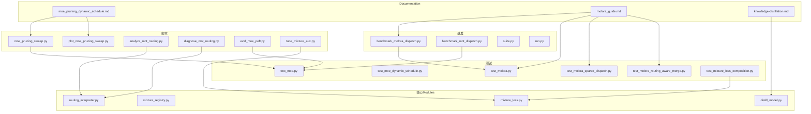
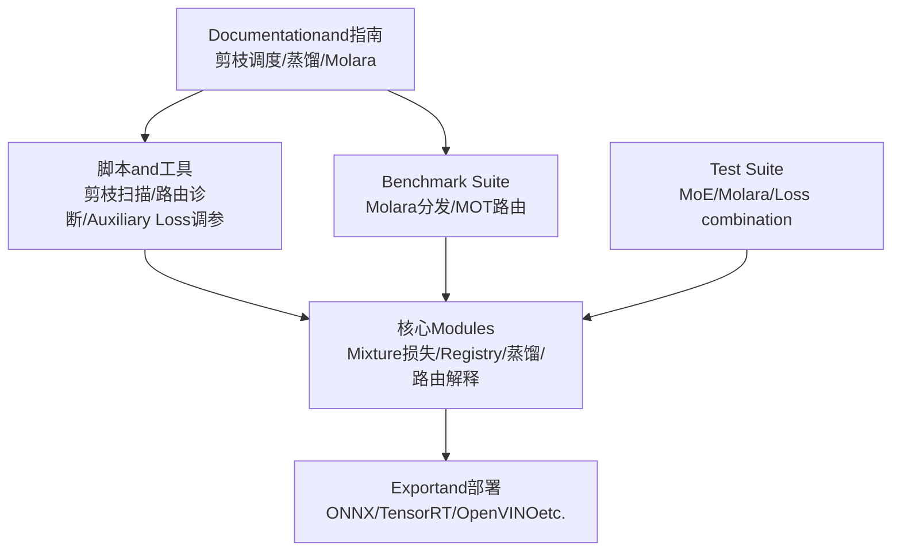
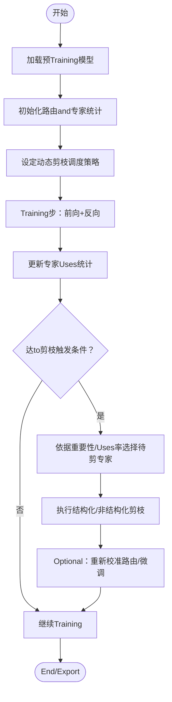
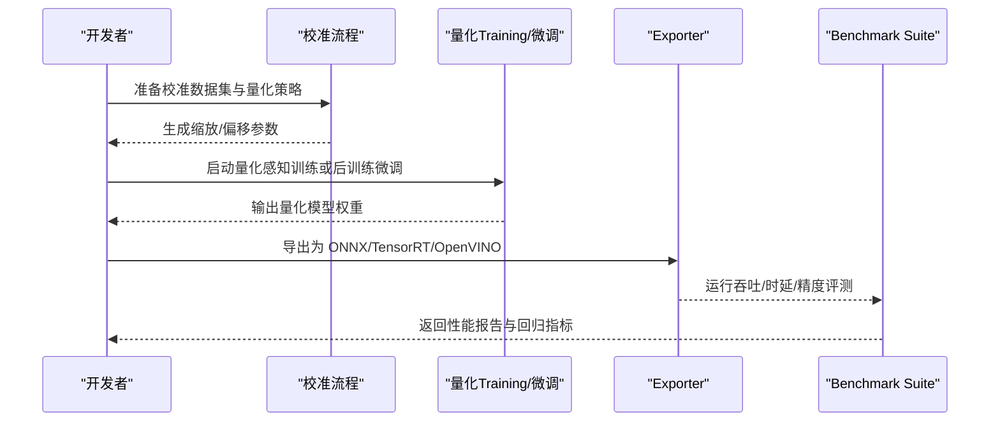
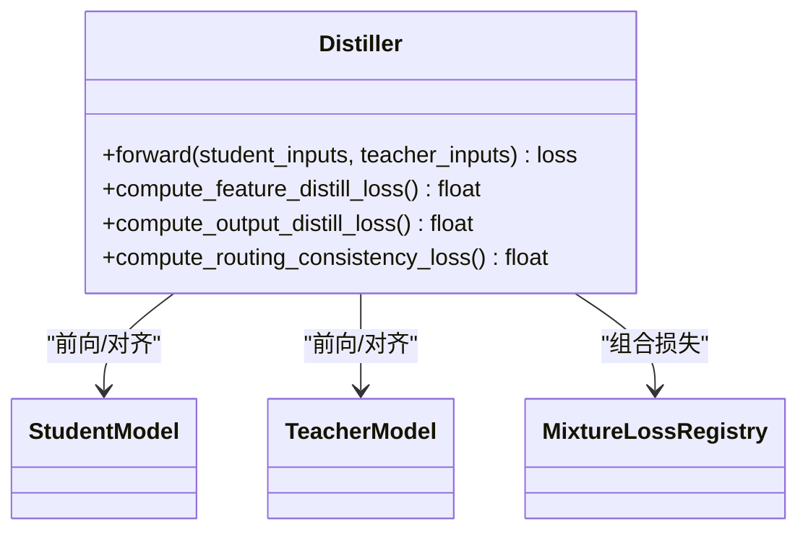
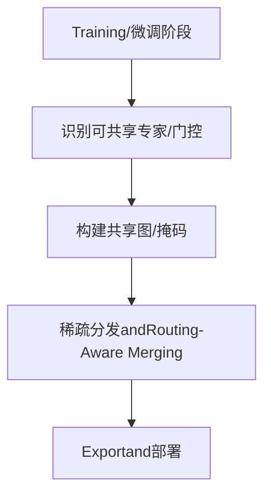
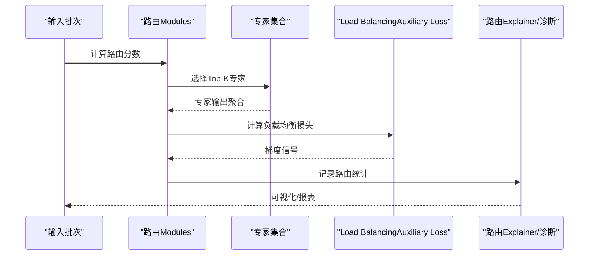
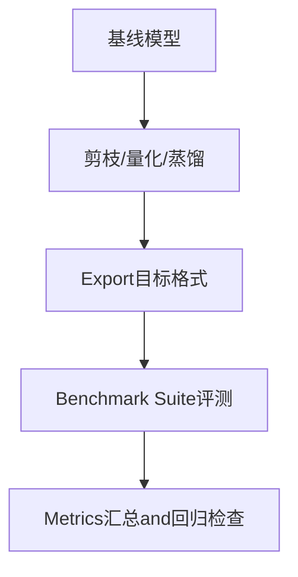
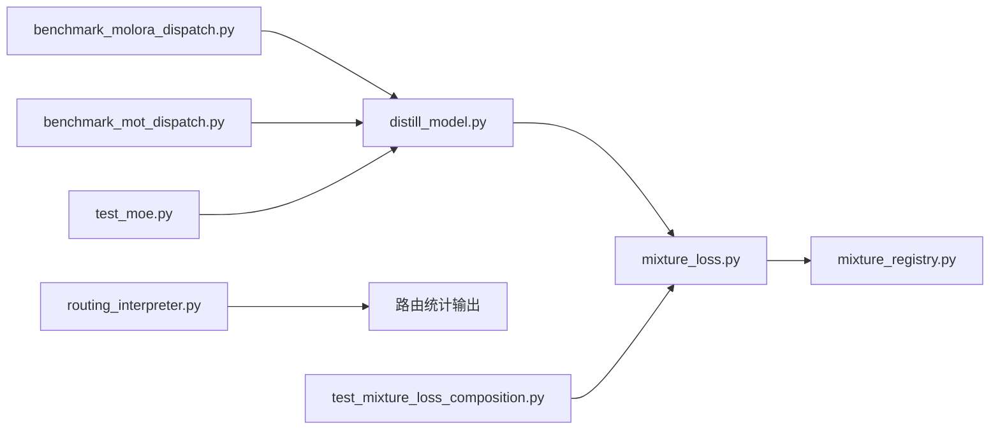

# 高级专家特性

<cite>
**Files Referenced in This Document**
- [moe_pruning_dynamic_schedule.md](file://docs/moe_pruning_dynamic_schedule.md)
- [molora_guide.md](file://docs/molora_guide.md)
- [knowledge-distillation.md](file://docs/en/guides/knowledge-distillation.md)
- [benchmark_molora_dispatch.py](file://benchmarks/benchmark_molora_dispatch.py)
- [benchmark_mot_dispatch.py](file://benchmarks/benchmark_mot_dispatch.py)
- [suite.py](file://benchmarks/suite.py)
- [run.py](file://benchmarks/run.py)
- [test_moe.py](file://tests/test_moe.py)
- [test_moe_dynamic_schedule.py](file://tests/test_moe_dynamic_schedule.py)
- [test_molora.py](file://tests/test_molora.py)
- [test_molora_sparse_dispatch.py](file://tests/test_molora_sparse_dispatch.py)
- [test_molora_routing_aware_merge.py](file://tests/test_molora_routing_aware_merge.py)
- [test_mixture_loss_composition.py](file://tests/test_mixture_loss_composition.py)
- [mixture_loss.py](file://ultralytics/nn/mixture_loss.py)
- [mixture_registry.py](file://ultralytics/nn/mixture_registry.py)
- [distill_model.py](file://ultralytics/nn/distill_model.py)
- [routing_interpreter.py](file://tools/routing_interpreter.py)
- [analyze_mot_routing.py](file://scripts/analyze_mot_routing.py)
- [diagnose_mot_routing.py](file://scripts/diagnose_mot_routing.py)
- [moe_pruning_sweep.py](file://scripts/moe_pruning_sweep.py)
- [plot_moe_pruning_sweep.py](file://scripts/plot_moe_pruning_sweep.py)
- [eval_moe_peft.py](file://scripts/eval_moe_peft.py)
- [tune_mixture_aux.py](file://scripts/tune_mixture_aux.py)
</cite>

## Table of Contents
1. [引言](#引言)
2. [Project Structure](#Project Structure)
3. [Core Components](#Core Components)
4. [Architecture Overview](#Architecture Overview)
5. [Detailed Component Analysis](#Detailed Component Analysis)
6. [Dependency Analysis](#Dependency Analysis)
7. [性能考量](#性能考量)
8. [Troubleshooting Guide](#Troubleshooting Guide)
9. [Conclusion](#Conclusion)
10. [Appendix](#Appendix)

## 引言
本技术Documentation聚焦于 YOLO-Master 的高级专家特性，围绕Centered on下主题unfold：
- 专家剪枝（结构化and非结构化）的原理、implementingand效果Evaluation
- 专家量化（INT8、动态量化、静态量化）的配置方法and性能影响
- 专家蒸馏机制（教师-学生模型知识Migration、Loss Function设计）
- 专家压缩and稀疏化（权重共享、参数共享策略）
- 专家自适应调整（动态专家选择、Load Balancing）
- 配置Examplesand调优指南
- 性能基准测试and效果Evaluation方法

## Project Structure
本项目whileDocumentation、基准、脚本and测试中provides了丰富的 MoE/MoA 相关capabilitiesand工具链。and“高级专家特性”直接相关的组织方式such as下：
- Documentation层：MoE 剪枝调度、Molara 指南、Knowledge Distillation指南etc.
- 基准层：针对路由分发、Multi-Object Tracking场景的Benchmark Suite
- 脚本层：剪枝扫描、路由诊断、Auxiliary Loss调参、PEFT Evaluationetc.
- 测试层：覆盖 MoE、Molara、Routing-Aware Merging、MixtureLoss combinationetc.关键路径
- 核心Modules层：Mixture损失、Registry、蒸馏模型etc.

Figure Source
- [moe_pruning_dynamic_schedule.md:1-200](file://docs/moe_pruning_dynamic_schedule.md#L1-L200)
- [molora_guide.md:1-200](file://docs/molora_guide.md#L1-L200)
- [knowledge-distillation.md:1-200](file://docs/en/guides/knowledge-distillation.md#L1-L200)
- [benchmark_molora_dispatch.py:1-200](file://benchmarks/benchmark_molora_dispatch.py#L1-L200)
- [benchmark_mot_dispatch.py:1-200](file://benchmarks/benchmark_mot_dispatch.py#L1-L200)
- [suite.py:1-200](file://benchmarks/suite.py#L1-L200)
- [run.py:1-200](file://benchmarks/run.py#L1-L200)
- [moe_pruning_sweep.py:1-200](file://scripts/moe_pruning_sweep.py#L1-L200)
- [plot_moe_pruning_sweep.py:1-200](file://scripts/plot_moe_pruning_sweep.py#L1-L200)
- [analyze_mot_routing.py:1-200](file://scripts/analyze_mot_routing.py#L1-L200)
- [diagnose_mot_routing.py:1-200](file://scripts/diagnose_mot_routing.py#L1-L200)
- [eval_moe_peft.py:1-200](file://scripts/eval_moe_peft.py#L1-L200)
- [tune_mixture_aux.py:1-200](file://scripts/tune_mixture_aux.py#L1-L200)
- [test_moe.py:1-200](file://tests/test_moe.py#L1-L200)
- [test_moe_dynamic_schedule.py:1-200](file://tests/test_moe_dynamic_schedule.py#L1-L200)
- [test_molora.py:1-200](file://tests/test_molora.py#L1-L200)
- [test_molora_sparse_dispatch.py:1-200](file://tests/test_molora_sparse_dispatch.py#L1-L200)
- [test_molora_routing_aware_merge.py:1-200](file://tests/test_molora_routing_aware_merge.py#L1-L200)
- [test_mixture_loss_composition.py:1-200](file://tests/test_mixture_loss_composition.py#L1-L200)
- [mixture_loss.py:1-200](file://ultralytics/nn/mixture_loss.py#L1-L200)
- [mixture_registry.py:1-200](file://ultralytics/nn/mixture_registry.py#L1-L200)
- [distill_model.py:1-200](file://ultralytics/nn/distill_model.py#L1-L200)
- [routing_interpreter.py:1-200](file://tools/routing_interpreter.py#L1-L200)

Section Source
- [moe_pruning_dynamic_schedule.md:1-200](file://docs/moe_pruning_dynamic_schedule.md#L1-L200)
- [molora_guide.md:1-200](file://docs/molora_guide.md#L1-L200)
- [knowledge-distillation.md:1-200](file://docs/en/guides/knowledge-distillation.md#L1-L200)
- [benchmark_molora_dispatch.py:1-200](file://benchmarks/benchmark_molora_dispatch.py#L1-L200)
- [benchmark_mot_dispatch.py:1-200](file://benchmarks/benchmark_mot_dispatch.py#L1-L200)
- [suite.py:1-200](file://benchmarks/suite.py#L1-L200)
- [run.py:1-200](file://benchmarks/run.py#L1-L200)
- [moe_pruning_sweep.py:1-200](file://scripts/moe_pruning_sweep.py#L1-L200)
- [plot_moe_pruning_sweep.py:1-200](file://scripts/plot_moe_pruning_sweep.py#L1-L200)
- [analyze_mot_routing.py:1-200](file://scripts/analyze_mot_routing.py#L1-L200)
- [diagnose_mot_routing.py:1-200](file://scripts/diagnose_mot_routing.py#L1-L200)
- [eval_moe_peft.py:1-200](file://scripts/eval_moe_peft.py#L1-L200)
- [tune_mixture_aux.py:1-200](file://scripts/tune_mixture_aux.py#L1-L200)
- [test_moe.py:1-200](file://tests/test_moe.py#L1-L200)
- [test_moe_dynamic_schedule.py:1-200](file://tests/test_moe_dynamic_schedule.py#L1-L200)
- [test_molora.py:1-200](file://tests/test_molora.py#L1-L200)
- [test_molora_sparse_dispatch.py:1-200](file://tests/test_molora_sparse_dispatch.py#L1-L200)
- [test_molora_routing_aware_merge.py:1-200](file://tests/test_molora_routing_aware_merge.py#L1-L200)
- [test_mixture_loss_composition.py:1-200](file://tests/test_mixture_loss_composition.py#L1-L200)
- [mixture_loss.py:1-200](file://ultralytics/nn/mixture_loss.py#L1-L200)
- [mixture_registry.py:1-200](file://ultralytics/nn/mixture_registry.py#L1-L200)
- [distill_model.py:1-200](file://ultralytics/nn/distill_model.py#L1-L200)
- [routing_interpreter.py:1-200](file://tools/routing_interpreter.py#L1-L200)

## Core Components
- Mixture损失andRegistry：provides MoE/MoA Training所需的Auxiliary Loss、路由约束andLoss combination接口，并ViaRegistry管理不同Tasks/变体的损失策略。
- 蒸馏模型：Encapsulates教师-学生模型的蒸馏流程andLoss combination，Supporting特征级and输出级对齐。
- 路由Explainerand诊断：对路由决策进行Visualizationand统计，帮助定位负载不均衡and热点专家。
- Benchmark Suite：targeting Molara 路由分发and MOT 场景的路由效率and吞吐评测。
- 剪枝and调度：provides动态剪枝策略and扫描脚本，Supporting按层/按专家的稀疏化and再Training。
- Test Suite：覆盖 MoE 行for、动态调度、Molara 稀疏分发、Routing-Aware MergingandMixtureLoss combination的正确性and数值稳定性。

Section Source
- [mixture_loss.py:1-200](file://ultralytics/nn/mixture_loss.py#L1-L200)
- [mixture_registry.py:1-200](file://ultralytics/nn/mixture_registry.py#L1-L200)
- [distill_model.py:1-200](file://ultralytics/nn/distill_model.py#L1-L200)
- [routing_interpreter.py:1-200](file://tools/routing_interpreter.py#L1-L200)
- [benchmark_molora_dispatch.py:1-200](file://benchmarks/benchmark_molora_dispatch.py#L1-L200)
- [benchmark_mot_dispatch.py:1-200](file://benchmarks/benchmark_mot_dispatch.py#L1-L200)
- [moe_pruning_sweep.py:1-200](file://scripts/moe_pruning_sweep.py#L1-L200)
- [test_moe.py:1-200](file://tests/test_moe.py#L1-L200)
- [test_molora.py:1-200](file://tests/test_molora.py#L1-L200)
- [test_molora_sparse_dispatch.py:1-200](file://tests/test_molora_sparse_dispatch.py#L1-L200)
- [test_molora_routing_aware_merge.py:1-200](file://tests/test_molora_routing_aware_merge.py#L1-L200)
- [test_mixture_loss_composition.py:1-200](file://tests/test_mixture_loss_composition.py#L1-L200)

## Architecture Overview
下图展示了“高级专家特性”的关键子系统and其交互关系：Documentationand指南drivers are installed脚本and基准；脚本and基准Via核心Modules（损失、Registry、蒸馏、路由解释）完成Training、Evaluationand诊断；测试保障各子系统的正确性。

Figure Source
- [moe_pruning_dynamic_schedule.md:1-200](file://docs/moe_pruning_dynamic_schedule.md#L1-L200)
- [molora_guide.md:1-200](file://docs/molora_guide.md#L1-L200)
- [knowledge-distillation.md:1-200](file://docs/en/guides/knowledge-distillation.md#L1-L200)
- [moe_pruning_sweep.py:1-200](file://scripts/moe_pruning_sweep.py#L1-L200)
- [analyze_mot_routing.py:1-200](file://scripts/analyze_mot_routing.py#L1-L200)
- [diagnose_mot_routing.py:1-200](file://scripts/diagnose_mot_routing.py#L1-L200)
- [benchmark_molora_dispatch.py:1-200](file://benchmarks/benchmark_molora_dispatch.py#L1-L200)
- [benchmark_mot_dispatch.py:1-200](file://benchmarks/benchmark_mot_dispatch.py#L1-L200)
- [mixture_loss.py:1-200](file://ultralytics/nn/mixture_loss.py#L1-L200)
- [mixture_registry.py:1-200](file://ultralytics/nn/mixture_registry.py#L1-L200)
- [distill_model.py:1-200](file://ultralytics/nn/distill_model.py#L1-L200)
- [routing_interpreter.py:1-200](file://tools/routing_interpreter.py#L1-L200)
- [test_moe.py:1-200](file://tests/test_moe.py#L1-L200)
- [test_molora.py:1-200](file://tests/test_molora.py#L1-L200)
- [test_mixture_loss_composition.py:1-200](file://tests/test_mixture_loss_composition.py#L1-L200)

## Detailed Component Analysis

### 专家剪枝（结构化and非结构化）
- 原理概述
  - 结构化剪枝：按通道/头/专家粒度移除整块计算单元，保持张量形状规整，利于加速Inferenceand部署。
  - 非结构化剪枝：对细粒度权重置零，获得高稀疏度，但需要稀疏算子或Post-ProcessingCentered on发挥收益。
- implementing要点
  - 动态剪枝调度：根据Training阶段逐步提高稀疏率，Combining路由Uses频率and重要性Metrics进行专家淘汰。
  - 剪枝扫描：遍历稀疏率、阈值、保留比例etc.超参，生成可复现实验结果and曲线。
- 应用效果
  - While maintaining精度的前提下显著降低计算量and内存占用；Combined withExportOptimization可获得端to端时延下降。
- 配置and调优建议
  - 从低稀疏率起步，观察路由分布and精度变化，逐步提升；对热点专家采用更保守的阈值。
  - CombiningAuxiliary Loss（such asLoad Balancing项）稳定Training。

Figure Source
- [moe_pruning_dynamic_schedule.md:1-200](file://docs/moe_pruning_dynamic_schedule.md#L1-L200)
- [moe_pruning_sweep.py:1-200](file://scripts/moe_pruning_sweep.py#L1-L200)
- [plot_moe_pruning_sweep.py:1-200](file://scripts/plot_moe_pruning_sweep.py#L1-L200)
- [test_moe.py:1-200](file://tests/test_moe.py#L1-L200)
- [test_moe_dynamic_schedule.py:1-200](file://tests/test_moe_dynamic_schedule.py#L1-L200)

Section Source
- [moe_pruning_dynamic_schedule.md:1-200](file://docs/moe_pruning_dynamic_schedule.md#L1-L200)
- [moe_pruning_sweep.py:1-200](file://scripts/moe_pruning_sweep.py#L1-L200)
- [plot_moe_pruning_sweep.py:1-200](file://scripts/plot_moe_pruning_sweep.py#L1-L200)
- [test_moe.py:1-200](file://tests/test_moe.py#L1-L200)
- [test_moe_dynamic_schedule.py:1-200](file://tests/test_moe_dynamic_schedule.py#L1-L200)

### 专家量化（INT8、动态量化、静态量化）
- 原理概述
  - INT8 量化：将权重/激活映射to 8bit 整数域，减少存储and带宽压力。
  - 动态量化：while运行时按批次统计范围，便于快速部署但可能引入额外开销。
  - 静态量化：离线校准数据上统计范围，Inference时固定缩放因子，延迟更低。
- 配置方法
  - 量化目标：优先量化专家内部线性层and门控层，避免破坏路由判别capabilities。
  - 校准集：Uses代表性样本覆盖长尾类别and复杂场景，确保分布估计准确。
  - 回退策略：对不稳定层（such as小维度或高频层）回退至 FP16/FP32。
- 性能影响
  - 通常带来显存and带宽下降，Inference吞吐提升；需关注精度回落并Combined with微调恢复。
- and剪枝协同
  - 先剪枝后量化更易收敛；量化后再做结构化剪枝可进一步压缩。

Figure Source
- [benchmark_molora_dispatch.py:1-200](file://benchmarks/benchmark_molora_dispatch.py#L1-L200)
- [benchmark_mot_dispatch.py:1-200](file://benchmarks/benchmark_mot_dispatch.py#L1-L200)
- [suite.py:1-200](file://benchmarks/suite.py#L1-L200)
- [run.py:1-200](file://benchmarks/run.py#L1-L200)

Section Source
- [benchmark_molora_dispatch.py:1-200](file://benchmarks/benchmark_molora_dispatch.py#L1-L200)
- [benchmark_mot_dispatch.py:1-200](file://benchmarks/benchmark_mot_dispatch.py#L1-L200)
- [suite.py:1-200](file://benchmarks/suite.py#L1-L200)
- [run.py:1-200](file://benchmarks/run.py#L1-L200)

### 专家蒸馏（教师-学生模型and损失设计）
- 知识Migration
  - 特征级蒸馏：对齐中间层表示，增强学生模型的特征表达capabilities。
  - 输出级蒸馏：对齐Prediction分布，提升分类/检测质量。
- Loss Function设计
  - 组合损失：主Tasks损失 + 蒸馏损失（KL/余弦/对比etc.），可按阶段调节权重。
  - 路由蒸馏：对学生路由and教师路由的一致性施加约束，促进专家分工稳定。
- Training流程
  - 冻结教师或联合微调；分阶段切换蒸馏强度；Combining课程学习逐步增加难度。

Figure Source
- [distill_model.py:1-200](file://ultralytics/nn/distill_model.py#L1-L200)
- [mixture_loss.py:1-200](file://ultralytics/nn/mixture_loss.py#L1-L200)
- [mixture_registry.py:1-200](file://ultralytics/nn/mixture_registry.py#L1-L200)
- [test_mixture_loss_composition.py:1-200](file://tests/test_mixture_loss_composition.py#L1-L200)

Section Source
- [knowledge-distillation.md:1-200](file://docs/en/guides/knowledge-distillation.md#L1-L200)
- [distill_model.py:1-200](file://ultralytics/nn/distill_model.py#L1-L200)
- [mixture_loss.py:1-200](file://ultralytics/nn/mixture_loss.py#L1-L200)
- [mixture_registry.py:1-200](file://ultralytics/nn/mixture_registry.py#L1-L200)
- [test_mixture_loss_composition.py:1-200](file://tests/test_mixture_loss_composition.py#L1-L200)

### 专家压缩and稀疏化（权重共享and参数共享）
- 权重共享
  - 跨Tasks/跨阶段的专家权重复用，减少冗余参数，适合多Tasks或Multimodal场景。
- 参数共享策略
  - 路由门控参数共享：while多分支结构中共享门控网络，降低路由复杂度。
  - 专家内部参数共享：对相似Tasks的专家共享部分层，仅微调差异部分。
- 稀疏化andRouting-Aware Merging
  - 基于路由重要性的稀疏分发and合并，避免无关专家参and计算，提升吞吐。

Figure Source
- [molora_guide.md:1-200](file://docs/molora_guide.md#L1-L200)
- [test_molora_sparse_dispatch.py:1-200](file://tests/test_molora_sparse_dispatch.py#L1-L200)
- [test_molora_routing_aware_merge.py:1-200](file://tests/test_molora_routing_aware_merge.py#L1-L200)

Section Source
- [molora_guide.md:1-200](file://docs/molora_guide.md#L1-L200)
- [test_molora_sparse_dispatch.py:1-200](file://tests/test_molora_sparse_dispatch.py#L1-L200)
- [test_molora_routing_aware_merge.py:1-200](file://tests/test_molora_routing_aware_merge.py#L1-L200)

### 专家自适应调整（动态专家选择andLoad Balancing）
- 动态专家选择
  - 根据Input Featuresand历史路由统计，动态选择 Top-K 专家，减少无效计算。
- Load Balancing
  - ViaAuxiliary Loss惩罚热点专家，鼓励均匀分配；Combining动态调度whileTraining中逐步放宽/收紧约束。
- 监控and诊断
  - Uses路由Explainerand诊断脚本统计专家Uses率、Gini 系数、路由熵etc.Metrics，指导调参。

Figure Source
- [moe_pruning_dynamic_schedule.md:1-200](file://docs/moe_pruning_dynamic_schedule.md#L1-L200)
- [routing_interpreter.py:1-200](file://tools/routing_interpreter.py#L1-L200)
- [analyze_mot_routing.py:1-200](file://scripts/analyze_mot_routing.py#L1-L200)
- [diagnose_mot_routing.py:1-200](file://scripts/diagnose_mot_routing.py#L1-L200)
- [test_moe_dynamic_schedule.py:1-200](file://tests/test_moe_dynamic_schedule.py#L1-L200)

Section Source
- [moe_pruning_dynamic_schedule.md:1-200](file://docs/moe_pruning_dynamic_schedule.md#L1-L200)
- [routing_interpreter.py:1-200](file://tools/routing_interpreter.py#L1-L200)
- [analyze_mot_routing.py:1-200](file://scripts/analyze_mot_routing.py#L1-L200)
- [diagnose_mot_routing.py:1-200](file://scripts/diagnose_mot_routing.py#L1-L200)
- [test_moe_dynamic_schedule.py:1-200](file://tests/test_moe_dynamic_schedule.py#L1-L200)

### 配置Examplesand调优指南
- 剪枝
  - 起始稀疏率：建议从较低值开始，逐步提升；关注路由分布and精度曲线。
  - 触发频率：按 epoch 或 step 触发，CombiningValidation集Metrics早停。
- 量化
  - 校准集规模：覆盖主要类别and困难样本；必要时分层设置量化策略。
  - 回退层：对不稳定层回退至更高精度，平衡速度and精度。
- 蒸馏
  - 损失权重：随Training阶段递增蒸馏权重；对路由一致性损失适度加权。
  - 教师模型：Optional择更大规模或同构更强版本，保证知识质量。
- 自适应
  - Load Balancing系数：初始较小，逐步增大；Combining路由熵监控避免过度平滑。
  - Top-K 选择：根据Tasks复杂度and资源限制调整。

Section Source
- [moe_pruning_dynamic_schedule.md:1-200](file://docs/moe_pruning_dynamic_schedule.md#L1-L200)
- [molora_guide.md:1-200](file://docs/molora_guide.md#L1-L200)
- [knowledge-distillation.md:1-200](file://docs/en/guides/knowledge-distillation.md#L1-L200)
- [tune_mixture_aux.py:1-200](file://scripts/tune_mixture_aux.py#L1-L200)

### 性能基准测试and效果Evaluation方法
- Benchmark Suite
  - Molara 路由分发基准：Evaluation不同routing strategies下的吞吐and时延。
  - MOT 路由基准：whileMulti-Object Tracking场景下Evaluation路由效率and精度。
- EvaluationMetrics
  - 精度：mAP、召回率、F1 and other tasksMetrics。
  - 效率：吞吐（FPS）、时延（ms）、显存占用、能耗。
  - 路由健康度：专家Uses分布、Gini 系数、路由熵。
- 实验流程
  - 基线Training → 剪枝/量化/蒸馏 → Export → 基准评测 → 回归检查。

Figure Source
- [benchmark_molora_dispatch.py:1-200](file://benchmarks/benchmark_molora_dispatch.py#L1-L200)
- [benchmark_mot_dispatch.py:1-200](file://benchmarks/benchmark_mot_dispatch.py#L1-L200)
- [suite.py:1-200](file://benchmarks/suite.py#L1-L200)
- [run.py:1-200](file://benchmarks/run.py#L1-L200)
- [eval_moe_peft.py:1-200](file://scripts/eval_moe_peft.py#L1-L200)

Section Source
- [benchmark_molora_dispatch.py:1-200](file://benchmarks/benchmark_molora_dispatch.py#L1-L200)
- [benchmark_mot_dispatch.py:1-200](file://benchmarks/benchmark_mot_dispatch.py#L1-L200)
- [suite.py:1-200](file://benchmarks/suite.py#L1-L200)
- [run.py:1-200](file://benchmarks/run.py#L1-L200)
- [eval_moe_peft.py:1-200](file://scripts/eval_moe_peft.py#L1-L200)

## Dependency Analysis
- Modules耦合
  - Mixture损失andRegistry被蒸馏and MoE Training广泛依赖，形成稳定的核心契约。
  - 路由Explainerand诊断脚本依赖路由统计输出，用于Visualizationand问题定位。
  - Benchmark SuiteandTest Suite共同保障功能正确性and性能回归。
- External Dependencies
  - Exporter对接多种后端（ONNX/TensorRT/OpenVINO etc.），受平台capabilities矩阵约束。
- Potential Cycles依赖
  - ViaRegistryand接口抽象解耦，避免直接循环导入。

Figure Source
- [mixture_loss.py:1-200](file://ultralytics/nn/mixture_loss.py#L1-L200)
- [mixture_registry.py:1-200](file://ultralytics/nn/mixture_registry.py#L1-L200)
- [distill_model.py:1-200](file://ultralytics/nn/distill_model.py#L1-L200)
- [routing_interpreter.py:1-200](file://tools/routing_interpreter.py#L1-L200)
- [benchmark_molora_dispatch.py:1-200](file://benchmarks/benchmark_molora_dispatch.py#L1-L200)
- [benchmark_mot_dispatch.py:1-200](file://benchmarks/benchmark_mot_dispatch.py#L1-L200)
- [test_mixture_loss_composition.py:1-200](file://tests/test_mixture_loss_composition.py#L1-L200)
- [test_moe.py:1-200](file://tests/test_moe.py#L1-L200)

Section Source
- [mixture_loss.py:1-200](file://ultralytics/nn/mixture_loss.py#L1-L200)
- [mixture_registry.py:1-200](file://ultralytics/nn/mixture_registry.py#L1-L200)
- [distill_model.py:1-200](file://ultralytics/nn/distill_model.py#L1-L200)
- [routing_interpreter.py:1-200](file://tools/routing_interpreter.py#L1-L200)
- [benchmark_molora_dispatch.py:1-200](file://benchmarks/benchmark_molora_dispatch.py#L1-L200)
- [benchmark_mot_dispatch.py:1-200](file://benchmarks/benchmark_mot_dispatch.py#L1-L200)
- [test_mixture_loss_composition.py:1-200](file://tests/test_mixture_loss_composition.py#L1-L200)
- [test_moe.py:1-200](file://tests/test_moe.py#L1-L200)

## 性能考量
- 路由开销：Top-K 选择and聚合while大批次下可能成forbottlenecks，可Via批内并行and缓存Optimization。
- 稀疏计算：非结构化稀疏需依赖稀疏内核或Post-Processing，结构化剪枝更易落地。
- 量化误差：校准集代表性不足会导致精度波动，建议分层量化and回退策略。
- 蒸馏稳定性：蒸馏权重过大易导致过拟合教师，建议课程式递增and早停。
- ExportOptimization：Combining目标后端特性（such as TensorRT 插件、OpenVINO IR Optimization）进一步提升吞吐。

[本节for通用指导，无需特定文件引用]

## Troubleshooting Guide
- 路由异常
  - 现象：某专家长期未被选择或过载。
  - 排查：Uses路由Explainerand诊断脚本查看Uses分布and熵；调整Load Balancing系数and Top-K。
- 精度回退
  - 现象：剪枝/量化后 mAP 下降明显。
  - 排查：检查稀疏率/量化策略是否过于激进；进行微调或回退不稳定层。
- Training不稳定
  - 现象：损失震荡或 NaN。
  - 排查：检查蒸馏损失权重and路由一致性损失；减小Learning Rate或启用Gradient裁剪。
- Export Failure
  - 现象：Exportto目标后端报错。
  - 排查：核对Exportcapabilities矩阵and算子Supporting；简化自定义算子或Uses兼容模式。

Section Source
- [routing_interpreter.py:1-200](file://tools/routing_interpreter.py#L1-L200)
- [analyze_mot_routing.py:1-200](file://scripts/analyze_mot_routing.py#L1-L200)
- [diagnose_mot_routing.py:1-200](file://scripts/diagnose_mot_routing.py#L1-L200)
- [test_moe.py:1-200](file://tests/test_moe.py#L1-L200)
- [test_molora.py:1-200](file://tests/test_molora.py#L1-L200)
- [test_mixture_loss_composition.py:1-200](file://tests/test_mixture_loss_composition.py#L1-L200)

## Conclusion
YOLO-Master 的高级专家特性Via剪枝、量化、蒸馏、压缩and自适应调整etc.多维手段，implementing了while精度、效率and部署友好性之间的良好平衡。借助完善的Benchmark Suite、诊断工具and测试覆盖，User可while不同Tasksand平台上快速迭代并获得可复现的性能收益。建议while工程实践中遵循“先剪枝后量化、蒸馏渐进、路由健康监控”的策略，Centered on获得稳健的端to端效果。

[本节for总结，无需特定文件引用]

## Appendix
- 术语
  - MoE：Mixture of Experts，专家Mixture模型
  - MoA：Mixture of Attention，注意力Mixture
  - Molara：路由感知的稀疏分发and合并方案
  - PEFT：Parameter-Efficient Fine-Tuning
- Refer to
  - 剪枝调度Documentation、Molara 指南、Knowledge Distillation指南、Benchmark Suiteand测试用例

[本节for补充信息，无需特定文件引用]