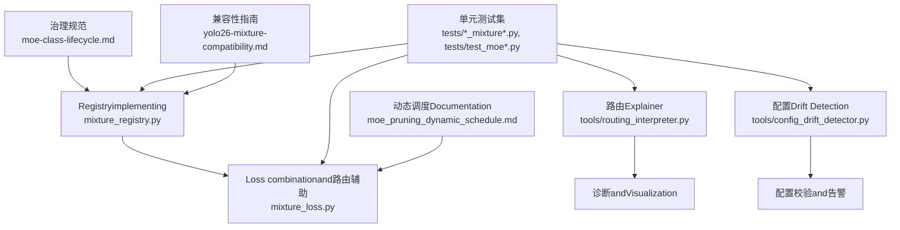
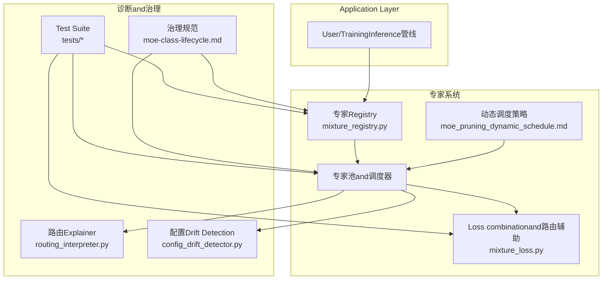
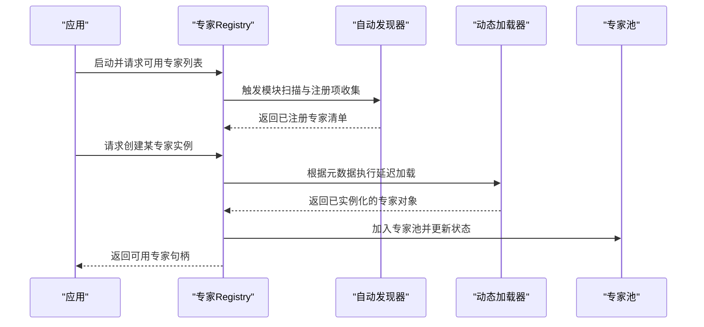
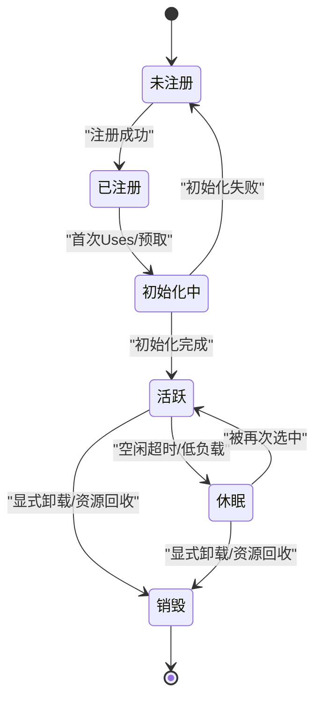
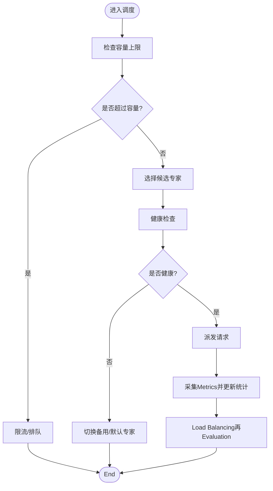
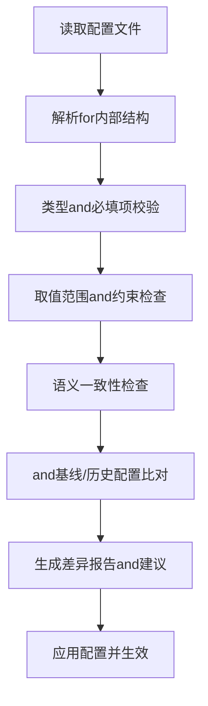
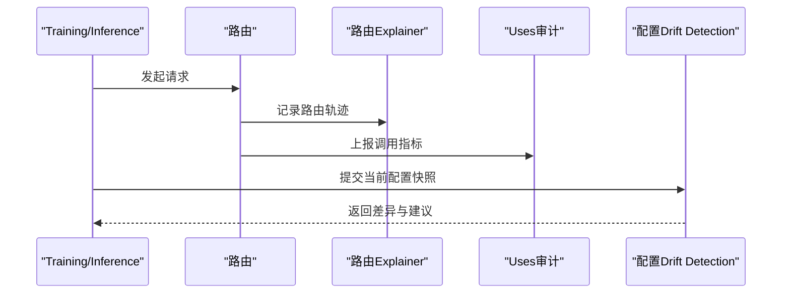
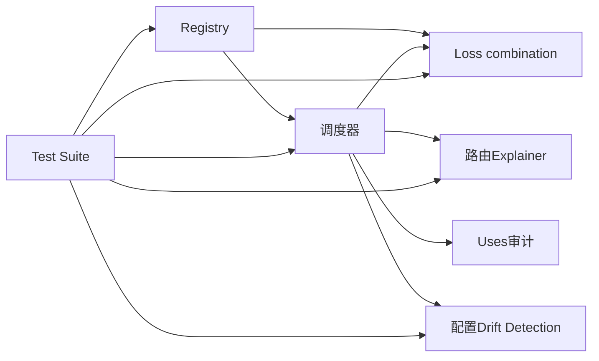

# 专家管理and注册

<cite>
**Files Referenced in This Document**
- [moe-class-lifecycle.md](file://docs/governance/moe-class-lifecycle.md)
- [mixture_registry.py](file://ultralytics/nn/mixture_registry.py)
- [mixture_loss.py](file://ultralytics/nn/mixture_loss.py)
- [test_mixture_config_registry.py](file://tests/test_mixture_config_registry.py)
- [test_mixture_model_registry.py](file://tests/test_mixture_model_registry.py)
- [test_moe.py](file://tests/test_moe.py)
- [test_moe_dynamic_scheduler.py](file://tests/test_moe_dynamic_scheduler.py)
- [test_moe_usage_audit.py](file://tests/test_moe_usage_audit.py)
- [routing_interpreter.py](file://tools/routing_interpreter.py)
- [routing_interpreter.py](file://ultralytics/utils/routing_interpreter.py)
- [config_drift_detector.py](file://tools/config_drift_detector.py)
- [test_config_drift_detector.py](file://tests/test_config_drift_detector.py)
- [moe_pruning_dynamic_schedule.md](file://docs/moe_pruning_dynamic_schedule.md)
- [yolo26-mixture-compatibility.md](file://docs/en/guides/yolo26-mixture-compatibility.md)
</cite>

## Table of Contents
1. [Introduction](#Introduction)
2. [Project Structure](#Project Structure)
3. [Core Components](#Core Components)
4. [Architecture Overview](#Architecture Overview)
5. [Detailed Component Analysis](#Detailed Component Analysis)
6. [Dependency Analysis](#Dependency Analysis)
7. [性能考量](#性能考量)
8. [Troubleshooting Guide](#Troubleshooting Guide)
9. [Conclusion](#Conclusion)
10. [Appendix](#Appendix)

## Introduction
本技术Documentation聚焦于 YOLO-Master 的“专家管理and注册系统”，围绕Centered on下目标unfold：
- 专家注册机制and自动发现、动态加载流程
- 专家生命周期管理（初始化、激活、休眠、销毁）
- 专家池管理策略（容量控制、Load Balancing、故障恢复）
- 配置解析andValidation机制（配置文件格式、参数检查）
- 版本兼容性andMigration策略
- 自定义专家的注册and集成指南
- 监控and诊断工具Uses方法
- 专家管理的 API 接口and编程模式

## Project Structure
and专家管理and注册相关的代码andDocumentation主要分布whilesuch as下位置：
- 治理and规范：docs/governance/moe-class-lifecycle.md
- 运行时RegistryandLoss combination：ultralytics/nn/mixture_registry.py、ultralytics/nn/mixture_loss.py
- 路由Explainerand配置Drift Detection：tools/routing_interpreter.py、tools/config_drift_detector.py
- 单元测试覆盖注册、调度、审计and兼容性：tests/*_mixture*.py、tests/test_moe*.py、tests/test_config_drift_detector.py
- Documentationand指南：docs/moe_pruning_dynamic_schedule.md、docs/en/guides/yolo26-mixture-compatibility.md

Figure Source
- [moe-class-lifecycle.md](file://docs/governance/moe-class-lifecycle.md)
- [mixture_registry.py](file://ultralytics/nn/mixture_registry.py)
- [mixture_loss.py](file://ultralytics/nn/mixture_loss.py)
- [routing_interpreter.py](file://tools/routing_interpreter.py)
- [config_drift_detector.py](file://tools/config_drift_detector.py)
- [test_mixture_config_registry.py](file://tests/test_mixture_config_registry.py)
- [test_mixture_model_registry.py](file://tests/test_mixture_model_registry.py)
- [test_moe.py](file://tests/test_moe.py)
- [test_moe_dynamic_scheduler.py](file://tests/test_moe_dynamic_scheduler.py)
- [test_moe_usage_audit.py](file://tests/test_moe_usage_audit.py)
- [test_config_drift_detector.py](file://tests/test_config_drift_detector.py)
- [moe_pruning_dynamic_schedule.md](file://docs/moe_pruning_dynamic_schedule.md)
- [yolo26-mixture-compatibility.md](file://docs/en/guides/yolo26-mixture-compatibility.md)

Section Source
- [moe-class-lifecycle.md](file://docs/governance/moe-class-lifecycle.md)
- [mixture_registry.py](file://ultralytics/nn/mixture_registry.py)
- [mixture_loss.py](file://ultralytics/nn/mixture_loss.py)
- [routing_interpreter.py](file://tools/routing_interpreter.py)
- [config_drift_detector.py](file://tools/config_drift_detector.py)
- [test_mixture_config_registry.py](file://tests/test_mixture_config_registry.py)
- [test_mixture_model_registry.py](file://tests/test_mixture_model_registry.py)
- [test_moe.py](file://tests/test_moe.py)
- [test_moe_dynamic_scheduler.py](file://tests/test_moe_dynamic_scheduler.py)
- [test_moe_usage_audit.py](file://tests/test_moe_usage_audit.py)
- [test_config_drift_detector.py](file://tests/test_config_drift_detector.py)
- [moe_pruning_dynamic_schedule.md](file://docs/moe_pruning_dynamic_schedule.md)
- [yolo26-mixture-compatibility.md](file://docs/en/guides/yolo26-mixture-compatibility.md)

## Core Components
- 专家Registry（Mixture Registry）
  - 负责专家类的集中注册、查找and实例化，Supporting按Tasks或Modules维度进行分组。
  - provides元数据描述（such ascapabilities标签、版本约束、资源需求），用于后续调度and兼容性检查。
- Loss combinationand路由辅助（Mixture Loss）
  - 将多个专家输出进行加权融合，计算组合损失；同时for路由provides可微或启发式信号。
- 路由Explainer（Routing Interpreter）
  - 对路由决策进行解释andVisualization，便于定位负载倾斜、冷热点分布and异常路径。
- 配置Drift Detection（Config Drift Detector）
  - 对比当前配置and基线/历史配置，识别不兼容变更并给出修复建议。
- Test Suite
  - 覆盖Registry行for、动态调度策略、Uses审计、配置校验etc.关键路径，保障稳定性and可演进性。

Section Source
- [mixture_registry.py](file://ultralytics/nn/mixture_registry.py)
- [mixture_loss.py](file://ultralytics/nn/mixture_loss.py)
- [routing_interpreter.py](file://tools/routing_interpreter.py)
- [config_drift_detector.py](file://tools/config_drift_detector.py)
- [test_mixture_config_registry.py](file://tests/test_mixture_config_registry.py)
- [test_mixture_model_registry.py](file://tests/test_mixture_model_registry.py)
- [test_moe.py](file://tests/test_moe.py)
- [test_moe_dynamic_scheduler.py](file://tests/test_moe_dynamic_scheduler.py)
- [test_moe_usage_audit.py](file://tests/test_moe_usage_audit.py)

## Architecture Overview
下图展示了专家管理and注册系统的整体架构and交互关系。

Figure Source
- [mixture_registry.py](file://ultralytics/nn/mixture_registry.py)
- [mixture_loss.py](file://ultralytics/nn/mixture_loss.py)
- [routing_interpreter.py](file://tools/routing_interpreter.py)
- [config_drift_detector.py](file://tools/config_drift_detector.py)
- [moe-pruning-dynamic-schedule.md](file://docs/moe_pruning_dynamic_schedule.md)
- [moe-class-lifecycle.md](file://docs/governance/moe-class-lifecycle.md)
- [test_mixture_config_registry.py](file://tests/test_mixture_config_registry.py)
- [test_mixture_model_registry.py](file://tests/test_mixture_model_registry.py)
- [test_moe.py](file://tests/test_moe.py)
- [test_moe_dynamic_scheduler.py](file://tests/test_moe_dynamic_scheduler.py)
- [test_moe_usage_audit.py](file://tests/test_moe_usage_audit.py)

## Detailed Component Analysis

### 专家注册and自动发现
- 注册入口
  - ViaRegistryprovides的装饰器或显式注册函数，将专家类and其元数据绑定to全局命名空间。
  - Supporting按Tasks/Modules维度进行分组，便于后续路由and选择。
- 自动发现
  - 启动时扫描已导入Modules中的注册标记，构建索引；若采用插件式扩展，可Via约定Table of Contents或包名进行扫描。
- 动态加载
  - 按需延迟加载专家权重and后端资源，避免冷启动开销；首次访问时完成实例化and预热。
- 元数据契约
  - 包含capabilities标签、输入输出签名、设备要求、版本约束、资源预算etc.，供调度器and校验器Uses。

Figure Source
- [mixture_registry.py](file://ultralytics/nn/mixture_registry.py)
- [test_mixture_model_registry.py](file://tests/test_mixture_model_registry.py)
- [test_mixture_config_registry.py](file://tests/test_mixture_config_registry.py)

Section Source
- [mixture_registry.py](file://ultralytics/nn/mixture_registry.py)
- [test_mixture_model_registry.py](file://tests/test_mixture_model_registry.py)
- [test_mixture_config_registry.py](file://tests/test_mixture_config_registry.py)

### 专家生命周期管理
- 阶段定义
  - 初始化：加载权重、分配内存、建立缓存and统计信息。
  - 激活：进入就绪态，参andRouting and Scheduling。
  - 休眠：长时间无Calls或达to阈值后释放部分资源，保留轻量上下文。
  - 销毁：彻底释放资源并从池中移除。
- 状态机
  - 各阶段转换需满足前置条件（such as预热完成、健康检查Via）。
  - 异常路径需具备回退and重试策略，确保系统稳定。

Figure Source
- [moe-class-lifecycle.md](file://docs/governance/moe-class-lifecycle.md)

Section Source
- [moe-class-lifecycle.md](file://docs/governance/moe-class-lifecycle.md)

### 专家池管理策略
- 容量控制
  - 基于最大并发、内存/显存上限and优先级队列限制池大小，防止过载。
- Load Balancing
  - Combining路由权重and实时Metrics（QPS、延迟、错误率）进行再平衡，避免热点专家拥塞。
- 故障恢复
  - 健康探针定期检测专家状态；失败则隔离并重试，必要时降级至备用专家或默认路径。
- 动态调度
  - 依据Tasks特征and历史Uses分布，动态调整专家集合androuting strategies，提升吞吐and能效。

Figure Source
- [moe_pruning_dynamic_schedule.md](file://docs/moe_pruning_dynamic_schedule.md)
- [test_moe_dynamic_scheduler.py](file://tests/test_moe_dynamic_scheduler.py)

Section Source
- [moe_pruning_dynamic_schedule.md](file://docs/moe_pruning_dynamic_schedule.md)
- [test_moe_dynamic_scheduler.py](file://tests/test_moe_dynamic_scheduler.py)

### 配置解析andValidation机制
- 配置来源
  - Supporting YAML/JSON etc.结构化配置，描述专家集合、routing strategies、资源配额and兼容性约束。
- 解析流程
  - 读取配置 -> 类型校验 -> 默认值填充 -> 语义校验（such as互斥字段、范围检查）-> 生成不可变配置对象。
- Drift Detection
  - and基线/历史版本对比，识别破坏性变更并给出Migration建议。
- 测试覆盖
  - 针对Registry配置、模型注册配置、Drift Detectionetc.进行端to端断言。

Figure Source
- [config_drift_detector.py](file://tools/config_drift_detector.py)
- [test_config_drift_detector.py](file://tests/test_config_drift_detector.py)
- [test_mixture_config_registry.py](file://tests/test_mixture_config_registry.py)
- [test_mixture_model_registry.py](file://tests/test_mixture_model_registry.py)

Section Source
- [config_drift_detector.py](file://tools/config_drift_detector.py)
- [test_config_drift_detector.py](file://tests/test_config_drift_detector.py)
- [test_mixture_config_registry.py](file://tests/test_mixture_config_registry.py)
- [test_mixture_model_registry.py](file://tests/test_mixture_model_registry.py)

### 版本兼容性andMigration策略
- 兼容性矩阵
  - 明确不同版本间专家接口、权重格式and路由协议的变化点。
- Migration步骤
  - 向后兼容优先；必要时providesAdapter或转换器；灰度发布and回滚策略。
- 自动化校验
  - while CI 中运行兼容性测试，确保升级路径可靠。

Section Source
- [yolo26-mixture-compatibility.md](file://docs/en/guides/yolo26-mixture-compatibility.md)

### 自定义专家注册and集成指南
- 开发步骤
  - implementing专家接口（输入输出签名、capabilities标签、资源声明）。
  - whileModules中完成注册（装饰器或显式注册函数）。
  - 编写单元测试覆盖注册、加载、调度and错误路径。
- 集成要点
  - 遵循元数据契约，确保Routing and Scheduling器能正确理解and选择。
  - provides健康检查andLogging埋点，便于监控and排障。
- Refer to用例
  - 查看现有测试中对Registryand模型注册的用法，作for最佳实践Refer to。

Section Source
- [test_mixture_model_registry.py](file://tests/test_mixture_model_registry.py)
- [test_mixture_config_registry.py](file://tests/test_mixture_config_registry.py)
- [test_moe.py](file://tests/test_moe.py)

### 监控and诊断工具
- 路由Explainer
  - 输出路由决策的可解释视图，包括专家选择比例、路径长度、异常分支etc.。
- Uses审计
  - 记录专家Calls频次、耗时、错误率，支撑容量规划andOptimization。
- 配置Drift Detection
  - 持续监控配置变化，提前预警潜while风险。

Figure Source
- [routing_interpreter.py](file://tools/routing_interpreter.py)
- [routing_interpreter.py](file://ultralytics/utils/routing_interpreter.py)
- [test_moe_usage_audit.py](file://tests/test_moe_usage_audit.py)
- [config_drift_detector.py](file://tools/config_drift_detector.py)

Section Source
- [routing_interpreter.py](file://tools/routing_interpreter.py)
- [routing_interpreter.py](file://ultralytics/utils/routing_interpreter.py)
- [test_moe_usage_audit.py](file://tests/test_moe_usage_audit.py)
- [config_drift_detector.py](file://tools/config_drift_detector.py)

### API 接口and编程模式
- Registry API
  - provides查询、注册、实例化and批量操作接口，Supporting按标签/版本筛选。
- Loss combination API
  - 暴露组合策略and权重更新接口，便于while线调优。
- 编程模式
  - 推荐Centered on“声明式注册 + 命令式Calls”的方式组织代码，保持清晰边界and可测试性。

Section Source
- [mixture_registry.py](file://ultralytics/nn/mixture_registry.py)
- [mixture_loss.py](file://ultralytics/nn/mixture_loss.py)

## Dependency Analysis
- 组件耦合
  - Registryfor核心枢纽，被调度器、Loss combinationandTest Suite共同依赖。
  - 路由Explainerand配置Drift Detectionfor横向支撑，降低耦合度。
- External Dependencies
  - 配置解析库、序列化andLogging框架etc.通用基础设施。
- 循环依赖
  - Via分层and接口抽象避免直接循环引用。

Figure Source
- [mixture_registry.py](file://ultralytics/nn/mixture_registry.py)
- [mixture_loss.py](file://ultralytics/nn/mixture_loss.py)
- [routing_interpreter.py](file://tools/routing_interpreter.py)
- [config_drift_detector.py](file://tools/config_drift_detector.py)
- [test_mixture_config_registry.py](file://tests/test_mixture_config_registry.py)
- [test_mixture_model_registry.py](file://tests/test_mixture_model_registry.py)
- [test_moe.py](file://tests/test_moe.py)
- [test_moe_dynamic_scheduler.py](file://tests/test_moe_dynamic_scheduler.py)
- [test_moe_usage_audit.py](file://tests/test_moe_usage_audit.py)

Section Source
- [mixture_registry.py](file://ultralytics/nn/mixture_registry.py)
- [mixture_loss.py](file://ultralytics/nn/mixture_loss.py)
- [routing_interpreter.py](file://tools/routing_interpreter.py)
- [config_drift_detector.py](file://tools/config_drift_detector.py)
- [test_mixture_config_registry.py](file://tests/test_mixture_config_registry.py)
- [test_mixture_model_registry.py](file://tests/test_mixture_model_registry.py)
- [test_moe.py](file://tests/test_moe.py)
- [test_moe_dynamic_scheduler.py](file://tests/test_moe_dynamic_scheduler.py)
- [test_moe_usage_audit.py](file://tests/test_moe_usage_audit.py)

## 性能考量
- 延迟and吞吐
  - Via懒加载、批处理and缓存减少首帧延迟；利用并行路由提升吞吐。
- 资源占用
  - 设置专家池上限and淘汰策略，避免 OOM；对热点专家进行分片and副本化。
- 路由效率
  - Uses轻量级路由打分and近似最近邻检索，降低选择开销。
- 观测and调优
  - 借助路由ExplainerandUses审计定位bottlenecks，Combining动态调度策略持续Optimization。

## Troubleshooting Guide
- 常见问题
  - 注册失败：检查Modules导入顺序and注册装饰器是否正确。
  - 加载失败：确认权重路径、设备可用性and权限。
  - 路由异常：查看路由Explainer输出，定位热点and死锁路径。
  - 配置冲突：Uses配置Drift Detection生成差异报告并按建议修复。
- 定位步骤
  - 启用详细Loggingand审计；复现最小用例；逐步缩小范围。
- 恢复策略
  - 隔离故障专家、切换to备用路径；必要时回滚配置and版本。

Section Source
- [routing_interpreter.py](file://tools/routing_interpreter.py)
- [config_drift_detector.py](file://tools/config_drift_detector.py)
- [test_moe_usage_audit.py](file://tests/test_moe_usage_audit.py)
- [test_config_drift_detector.py](file://tests/test_config_drift_detector.py)

## Conclusion
YOLO-Master 的专家管理and注册系统Via清晰的Registry、稳健的生命周期管理、灵活的调度策略Centered onand完善的诊断and治理工具，implementing了高内聚、低耦合and可扩展的专家生态。Combined with严格的配置校验and兼容性策略，系统while演进过程中保持了稳定性and可维护性。

## Appendix
- 术语
  - 专家：具备特定capabilities的可插拔Modules。
  - 路由：根据Input Featuresand上下文选择专家的策略。
  - 专家池：承载专家实例and其状态的容器。
- Refer toDocumentation
  - 治理规范、动态调度说明and兼容性指南See对应文件。