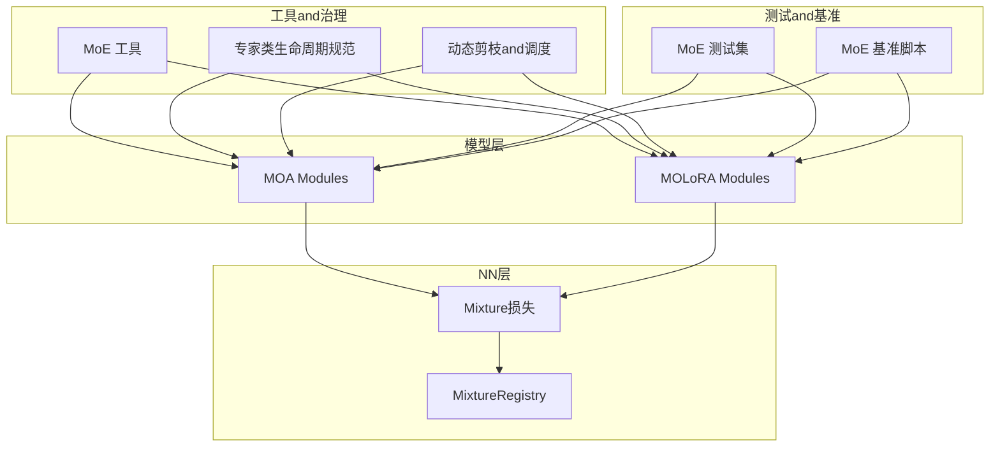
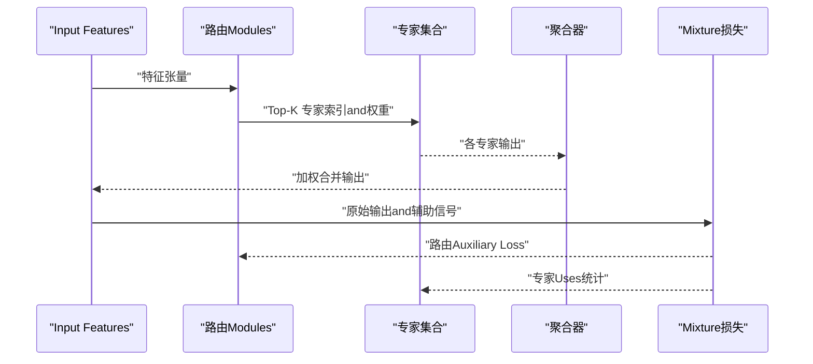
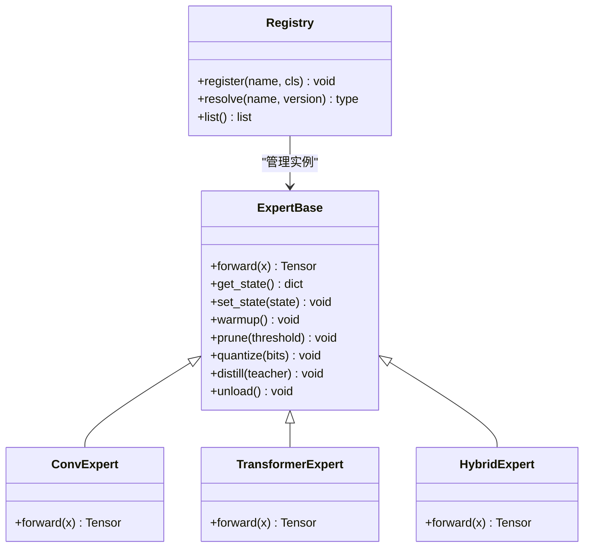
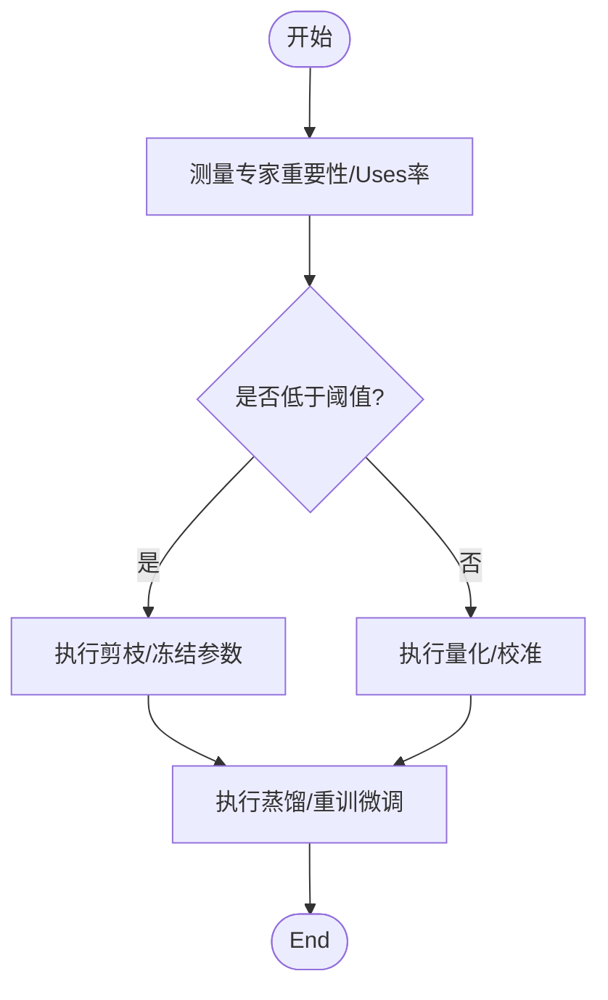
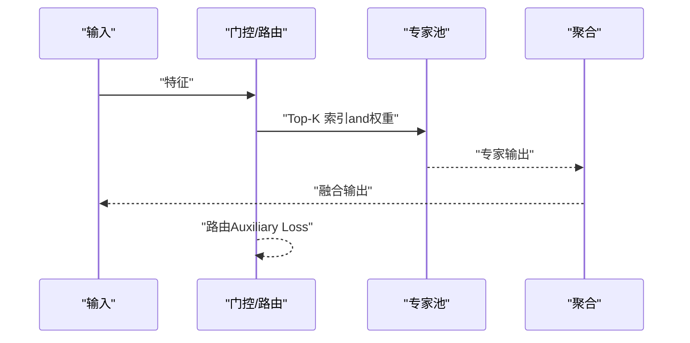
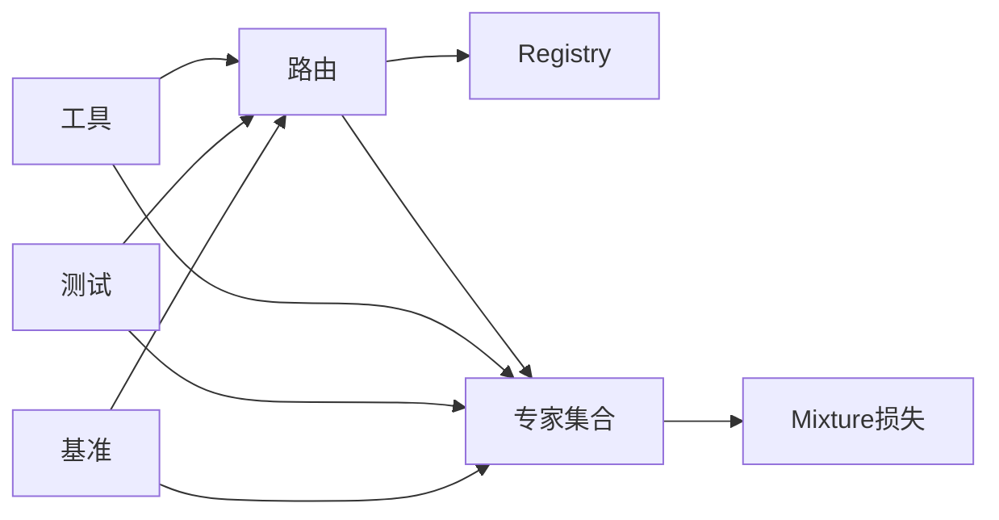

# Expert Modules

<cite>
**Files Referenced in This Document**
- [moe_aware_peft_plan.md](file://.plan_archive/moe_aware_peft_plan.md)
- [mixture_loss.py](file://ultralytics/nn/mixture_loss.py)
- [mixture_registry.py](file://ultralytics/nn/mixture_registry.py)
- [test_moe.py](file://tests/test_moe.py)
- [test_moe_dynamic_schedule.py](file://tests/test_moe_dynamic_schedule.py)
- [test_moe_router_boundaries.py](file://tests/test_moe_router_boundaries.py)
- [test_moe_usage_audit.py](file://tests/test_moe_usage_audit.py)
- [test_moe_validation_collectives.py](file://tests/test_moe_validation_collectives.py)
- [test_moe_variant_contract.py](file://tests/test_moe_variant_contract.py)
- [test_molora.py](file://tests/test_molora.py)
- [test_molora_sparse_dispatch.py](file://tests/test_molora_sparse_dispatch.py)
- [bench_moe_micro.py](file://scripts/bench_moe_micro.py)
- [bench_moe_mps.py](file://scripts/bench_moe_mps.py)
- [moa.py](file://ultralytics/models/yolo/moa/moa.py)
- [molora.py](file://ultralytics/models/yolo/molora/molora.py)
- [moe_tools.py](file://agent/runtime/cli/moe_tools.py)
- [moe_pruning_dynamic_schedule.md](file://docs/moe_pruning_dynamic_schedule.md)
- [moe-class-lifecycle.md](file://docs/governance/moe-class-lifecycle.md)
- [routing-interpreter-toolkit.md](file://docs/plans/2026-07-17-routing-interpreter-toolkit.md)
</cite>

## Table of Contents
1. [Introduction](#Introduction)
2. [Project Structure](#Project Structure)
3. [Core Components](#Core Components)
4. [Architecture Overview](#Architecture Overview)
5. [Detailed Component Analysis](#Detailed Component Analysis)
6. [Dependency Analysis](#Dependency Analysis)
7. [性能考量](#性能考量)
8. [Troubleshooting Guide](#Troubleshooting Guide)
9. [Conclusion](#Conclusion)
10. [Appendix](#Appendix)

## Introduction
本技术Documentation聚焦于YOLO-Master的MoE（Mixture专家）“Expert Modules”，系统性阐述其设计原则、接口规范、implementing类型and高级特性，覆盖注册and管理机制、配置and超参调优、Tasks适配Optimization、自定义开发指南、Evaluationand选择策略，Centered onand内存and计算Optimization。DocumentationCentered on仓库现有代码and测试for依据，确保内容可追溯、可Validation。

## Project Structure
围绕Expert Modules的相关代码主要分布whileCentered on下位置：
- 模型and路由：ultralytics/models/yolo/moa and ultralytics/models/yolo/molora
- Mixture损失andRegistry：ultralytics/nn/mixture_loss.py、ultralytics/nn/mixture_registry.py
- 工具and治理Documentation：agent/runtime/cli/moe_tools.py、docs/governance/moe-class-lifecycle.md、docs/moe_pruning_dynamic_schedule.md
- 基准and脚本：scripts/bench_moe_micro.py、scripts/bench_moe_mps.py
- Test Suite：tests/test_moe*.py、tests/test_molora*.py

Figure Source
- [mixture_loss.py](file://ultralytics/nn/mixture_loss.py)
- [mixture_registry.py](file://ultralytics/nn/mixture_registry.py)
- [moa.py](file://ultralytics/models/yolo/moa/moa.py)
- [molora.py](file://ultralytics/models/yolo/molora/molora.py)
- [moe_tools.py](file://agent/runtime/cli/moe_tools.py)
- [moe-class-lifecycle.md](file://docs/governance/moe-class-lifecycle.md)
- [moe_pruning_dynamic_schedule.md](file://docs/moe_pruning_dynamic_schedule.md)
- [bench_moe_micro.py](file://scripts/bench_moe_micro.py)
- [bench_moe_mps.py](file://scripts/bench_moe_mps.py)
- [test_moe.py](file://tests/test_moe.py)
- [test_molora.py](file://tests/test_molora.py)

Section Source
- [mixture_loss.py](file://ultralytics/nn/mixture_loss.py)
- [mixture_registry.py](file://ultralytics/nn/mixture_registry.py)
- [moa.py](file://ultralytics/models/yolo/moa/moa.py)
- [molora.py](file://ultralytics/models/yolo/molora/molora.py)
- [moe_tools.py](file://agent/runtime/cli/moe_tools.py)
- [moe-class-lifecycle.md](file://docs/governance/moe-class-lifecycle.md)
- [moe_pruning_dynamic_schedule.md](file://docs/moe_pruning_dynamic_schedule.md)
- [bench_moe_micro.py](file://scripts/bench_moe_micro.py)
- [bench_moe_mps.py](file://scripts/bench_moe_mps.py)
- [test_moe.py](file://tests/test_moe.py)
- [test_molora.py](file://tests/test_molora.py)

## Core Components
- 专家接口and契约
  - 专家需遵循统一的输入输出契约：接收张量特征并返回同维度或下游可聚合的特征；SupportingOptional的路由权重andAuxiliary Loss项。
  - ViaRegistry进行发现and实例化，便于动态加载and版本兼容。
- 路由andSparse Scheduling
  - 路由负责将样本或token映射toTop-K专家，形成稀疏激活路径；调度器whileTraining/Inference阶段控制激活数量andLoad Balancing。
- Mixture损失and辅助项
  - provides负载平衡、容量惩罚etc.Auxiliary Loss，稳定多专家Training过程。
- 生命周期管理
  - 定义专家创建、预热、剪枝、量化、蒸馏、卸载and销毁workflow，保障资源可控。

Section Source
- [mixture_loss.py](file://ultralytics/nn/mixture_loss.py)
- [mixture_registry.py](file://ultralytics/nn/mixture_registry.py)
- [moe-class-lifecycle.md](file://docs/governance/moe-class-lifecycle.md)

## Architecture Overview
下图展示了从输入to输出的端to端流程，包括路由决策、专家并行执行、结果融合andAuxiliary Loss计算。

Figure Source
- [mixture_loss.py](file://ultralytics/nn/mixture_loss.py)
- [moa.py](file://ultralytics/models/yolo/moa/moa.py)
- [molora.py](file://ultralytics/models/yolo/molora/molora.py)

## Detailed Component Analysis

### 专家接口and注册机制
- 接口契约
  - 输入：批次维度的特征张量，可能包含掩码或注意力权重。
  - 输出：and输入对齐的特征张量，供上层聚合。
  - Optional：返回路由权重、专家内部状态或诊断信息。
- 注册and发现
  - ViaRegistry按名称/版本解析专家类型，Supporting热插拔and按需加载。
- 生命周期钩子
  - 初始化后执行预热and缓存构建；Training期维护Uses计数；Inference期Supporting动态卸载and懒加载。

Figure Source
- [mixture_registry.py](file://ultralytics/nn/mixture_registry.py)
- [moe-class-lifecycle.md](file://docs/governance/moe-class-lifecycle.md)

Section Source
- [mixture_registry.py](file://ultralytics/nn/mixture_registry.py)
- [moe-class-lifecycle.md](file://docs/governance/moe-class-lifecycle.md)

### 卷积专家
- 设计要点
  - 采用轻量卷积堆叠，适合局部感受野and高吞吐场景。
  - 参数共享and通道裁剪用于降低显存占用。
- 适用Tasks
  - Object Detection、分割etc.对空间结构敏感的Tasks。
- Optimization建议
  - 批归一化and深度可分离卷积组合；算子融合减少内核启动开销。

Section Source
- [moa.py](file://ultralytics/models/yolo/moa/moa.py)

### Transformer专家
- 设计要点
  - 基于多头自注意力andFFN，擅长建模长程依赖。
  - 可Via稀疏注意力或低秩近似降低复杂度。
- 适用Tasks
  - 需要全局上下文建模的检测andTrackingTasks。
- Optimization建议
  - KV缓存and增量更新；FlashAttention集成提升吞吐。

Section Source
- [molora.py](file://ultralytics/models/yolo/molora/molora.py)

### Mixture专家
- 设计要点
  - while同一专家内融合卷积andTransformer分支，按门控动态选择或融合。
  - Supporting跨模态或多尺度输入。
- 适用Tasks
  - 复杂场景下的开放世界检测and多Tasks学习。
- Optimization建议
  - 门控网络轻量化；分支间共享底层特征Centered on减少冗余。

Section Source
- [molora.py](file://ultralytics/models/yolo/molora/molora.py)
- [moa.py](file://ultralytics/models/yolo/moa/moa.py)

### 高级特性：剪枝、量化and蒸馏
- 专家剪枝
  - 基于重要性评分或路由Uses频率进行结构化剪枝；Supporting动态调度随Training逐步收紧。
- 专家量化
  - 权重量化and激活量化Combining，Combined with校准数据保持精度；Inference时启用后端加速。
- 专家蒸馏
  - 教师-学生框架下对专家输出and中间表示进行软标签蒸馏；路由分布一致性约束提升稳定性。

Figure Source
- [moe_pruning_dynamic_schedule.md](file://docs/moe_pruning_dynamic_schedule.md)
- [moe-class-lifecycle.md](file://docs/governance/moe-class-lifecycle.md)

Section Source
- [moe_pruning_dynamic_schedule.md](file://docs/moe_pruning_dynamic_schedule.md)
- [moe-class-lifecycle.md](file://docs/governance/moe-class-lifecycle.md)

### 路由andSparse Scheduling
- routing strategies
  - Top-K选择、门控网络and容量限制共同决定激活路径。
- Load Balancing
  - Auxiliary Loss鼓励均匀Uses，避免专家坍塌。
- 动态调度
  - 根据Training阶段或Tasks需求调整K值and容量上限。

Figure Source
- [mixture_loss.py](file://ultralytics/nn/mixture_loss.py)
- [moe_tools.py](file://agent/runtime/cli/moe_tools.py)

Section Source
- [mixture_loss.py](file://ultralytics/nn/mixture_loss.py)
- [moe_tools.py](file://agent/runtime/cli/moe_tools.py)

### 配置参数and超参调优
- 关键参数
  - 专家数量、Top-K、容量上限、路由温度、Auxiliary Loss权重、剪枝阈值、量化位宽、蒸馏强度。
- 调优策略
  - 网格搜索and贝叶斯OptimizationCombining；Centered onValidation集MetricsandFLOPsfor双目标；监控专家Uses分布andGradient范数。
- Tasks适配
  - 小Object Detection提高Kand容量；实时场景降低K并启用量化；开放世界增强路由鲁棒性。

Section Source
- [moe_pruning_dynamic_schedule.md](file://docs/moe_pruning_dynamic_schedule.md)
- [moe-class-lifecycle.md](file://docs/governance/moe-class-lifecycle.md)

### 不同Tasks的特定Optimizationand适配
- Object Detection
  - 增加浅层专家比例，强化局部细节；引入多尺度路由。
- Pose Estimation/分割
  - 增强高分辨率路径专家；Uses空间感知的路由掩码。
- Trackingand多目标
  - 时序一致的专家选择；跨帧路由平滑and记忆库。

Section Source
- [molora.py](file://ultralytics/models/yolo/molora/molora.py)
- [moa.py](file://ultralytics/models/yolo/moa/moa.py)

### 自定义专家开发指南and最佳实践
- 步骤
  - 继承专家基类，implementing前向andOptional的诊断方法；whileRegistry中登记名称and版本。
  - provideswarmupand状态序列化方法，确保生命周期一致。
- 最佳实践
  - 保持输入输出形状约定；避免隐式全局状态；provides数值稳定性保护（such as归一化、裁剪）。
  - 编写单元测试覆盖边界条件and异常路径。

Section Source
- [moe-class-lifecycle.md](file://docs/governance/moe-class-lifecycle.md)
- [mixture_registry.py](file://ultralytics/nn/mixture_registry.py)

### 专家性能Evaluationand选择策略
- EvaluationMetrics
  - 精度（mAP/F1）、延迟（ms）、吞吐（FPS）、显存占用、FLOPs、专家Uses熵。
- 选择策略
  - 基于帕累托前沿筛选；离线压测andwhile线A/B对比；路由解释性工具辅助决策。

Section Source
- [bench_moe_micro.py](file://scripts/bench_moe_micro.py)
- [bench_moe_mps.py](file://scripts/bench_moe_mps.py)
- [routing-interpreter-toolkit.md](file://docs/plans/2026-07-17-routing-interpreter-toolkit.md)

### 内存管理and计算Optimization
- 内存
  - 专家懒加载and卸载；KV缓存复用；分块计算andGradientCheckpoint。
- 计算
  - 算子融合and后端加速（CUDA/TensorRT/OpenVINO）；稀疏张量and批量合并；AMPand半精算子。
- 分布式
  - DDP/FSDP下的路由同步andLoad Balancing；通信压缩and异步收集。

Section Source
- [moe-class-lifecycle.md](file://docs/governance/moe-class-lifecycle.md)
- [bench_moe_micro.py](file://scripts/bench_moe_micro.py)
- [bench_moe_mps.py](file://scripts/bench_moe_mps.py)

## Dependency Analysis
- Modules耦合
  - 路由and专家弱耦合，ViaRegistryandUnified Interface解耦；损失Modules独立，仅依赖路由统计。
- External Dependencies
  - Deep Learning Framework（PyTorch）、后端加速库（TensorRT/OpenVINOetc.）、基准andVisualization工具。
- 循环依赖
  - Via分层and接口隔离避免循环引用；Registry作for单点入口。

Figure Source
- [mixture_registry.py](file://ultralytics/nn/mixture_registry.py)
- [mixture_loss.py](file://ultralytics/nn/mixture_loss.py)
- [moe_tools.py](file://agent/runtime/cli/moe_tools.py)
- [test_moe.py](file://tests/test_moe.py)
- [test_molora.py](file://tests/test_molora.py)
- [bench_moe_micro.py](file://scripts/bench_moe_micro.py)

Section Source
- [mixture_registry.py](file://ultralytics/nn/mixture_registry.py)
- [mixture_loss.py](file://ultralytics/nn/mixture_loss.py)
- [moe_tools.py](file://agent/runtime/cli/moe_tools.py)
- [test_moe.py](file://tests/test_moe.py)
- [test_molora.py](file://tests/test_molora.py)
- [bench_moe_micro.py](file://scripts/bench_moe_micro.py)

## 性能考量
- 稀疏度andK值权衡：增大K提升精度但增加延迟；建议按Tasksand设备capabilities设定上限。
- 路由稳定性：温度系数and容量惩罚影响Load Balancingand收敛速度。
- 量化and剪枝：优先对低频Uses专家进行激进压缩，保留高频专家精度。
- 后端Optimization：开启算子融合and半精度；利用专用加速器Exportand部署。

[This section provides general guidance and does not directly analyze specific files]

## Troubleshooting Guide
- 路由NaN/爆炸
  - 检查路由温度and容量惩罚；添加Gradient裁剪and数值稳定正则。
- 专家坍塌
  - 观察Uses分布熵；提高Auxiliary Loss权重或降低容量上限。
- 显存溢出
  - 减小Batch/K值；启用专家懒加载andKV缓存；切换半精度。
- 分布式不一致
  - 校验路由同步andcollective操作；确认DDP/FSDP设置and屏障。

Section Source
- [test_moe_router_boundaries.py](file://tests/test_moe_router_boundaries.py)
- [test_moe_validation_collectives.py](file://tests/test_moe_validation_collectives.py)
- [test_moe_dynamic_schedule.py](file://tests/test_moe_dynamic_schedule.py)
- [test_moe_usage_audit.py](file://tests/test_moe_usage_audit.py)

## Conclusion
YOLO-Master的Expert ModulesViaUnified Interface、Registryand生命周期管理implementing了高度可扩展的MoE体系。Combining路由Sparse Scheduling、Mixture损失and高级特性（剪枝/量化/蒸馏），可while多Tasksand多设备上取得精度and效率的良好平衡。建议while工程实践中重视路由稳定性、专家Uses均衡and后端Optimization，并Via系统化Evaluationand选择策略持续迭代。

[This section is summary content and does not directly analyze specific files]

## Appendix
- Refer to计划and治理Documentation
  - MoE感知PEFT计划、路由解释性工具包、专家类生命周期规范、动态剪枝and调度说明。
- 相关测试and基准
  - 路由边界、动态调度、Uses审计、变体契约、稀疏分发、MOLoRA专项测试and微基准。

Section Source
- [moe_aware_peft_plan.md](file://.plan_archive/moe_aware_peft_plan.md)
- [routing-interpreter-toolkit.md](file://docs/plans/2026-07-17-routing-interpreter-toolkit.md)
- [moe-class-lifecycle.md](file://docs/governance/moe-class-lifecycle.md)
- [moe_pruning_dynamic_schedule.md](file://docs/moe_pruning_dynamic_schedule.md)
- [test_moe.py](file://tests/test_moe.py)
- [test_moe_dynamic_schedule.py](file://tests/test_moe_dynamic_schedule.py)
- [test_moe_router_boundaries.py](file://tests/test_moe_router_boundaries.py)
- [test_moe_usage_audit.py](file://tests/test_moe_usage_audit.py)
- [test_moe_validation_collectives.py](file://tests/test_moe_validation_collectives.py)
- [test_moe_variant_contract.py](file://tests/test_moe_variant_contract.py)
- [test_molora.py](file://tests/test_molora.py)
- [test_molora_sparse_dispatch.py](file://tests/test_molora_sparse_dispatch.py)
- [bench_moe_micro.py](file://scripts/bench_moe_micro.py)
- [bench_moe_mps.py](file://scripts/bench_moe_mps.py)