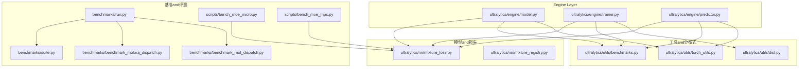
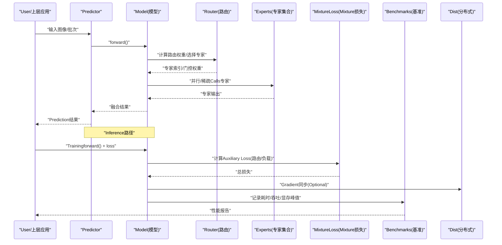
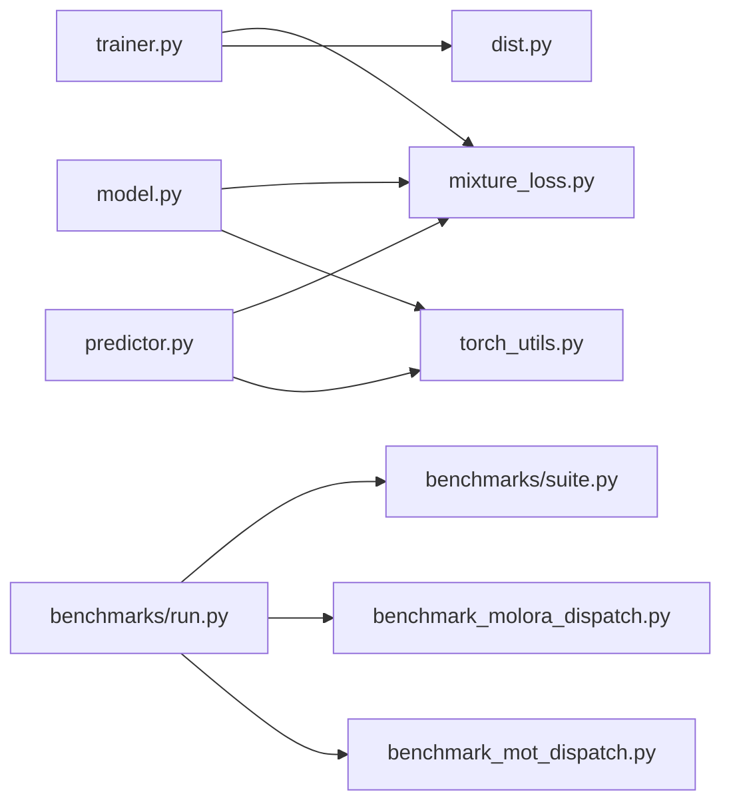

# 专家性能Optimization

<cite>
**Files Referenced in This Document**
- [benchmarks/run.py](file://benchmarks/run.py)
- [benchmarks/suite.py](file://benchmarks/suite.py)
- [benchmarks/benchmark_molora_dispatch.py](file://benchmarks/benchmark_molora_dispatch.py)
- [benchmarks/benchmark_mot_dispatch.py](file://benchmarks/benchmark_mot_dispatch.py)
- [ultralytics/nn/mixture_loss.py](file://ultralytics/nn/mixture_loss.py)
- [ultralytics/nn/mixture_registry.py](file://ultralytics/nn/mixture_registry.py)
- [ultralytics/engine/model.py](file://ultralytics/engine/model.py)
- [ultralytics/engine/trainer.py](file://ultralytics/engine/trainer.py)
- [ultralytics/engine/predictor.py](file://ultralytics/engine/predictor.py)
- [ultralytics/utils/benchmarks.py](file://ultralytics/utils/benchmarks.py)
- [ultralytics/utils/torch_utils.py](file://ultralytics/utils/torch_utils.py)
- [ultralytics/utils/dist.py](file://ultralytics/utils/dist.py)
- [scripts/bench_moe_micro.py](file://scripts/bench_moe_micro.py)
- [scripts/bench_moe_mps.py](file://scripts/bench_moe_mps.py)
- [tests/test_moe.py](file://tests/test_moe.py)
- [tests/test_moe_amp_index_add.py](file://tests/test_moe_amp_index_add.py)
- [tests/test_moe_ddp_fixes.py](file://tests/test_moe_ddp_fixes.py)
- [tests/test_moe_dynamic_schedule.py](file://tests/test_moe_dynamic_schedule.py)
- [tests/test_moe_usage_audit.py](file://tests/test_moe_usage_audit.py)
- [tests/test_molora_sparse_dispatch.py](file://tests/test_molora_sparse_dispatch.py)
- [tests/test_molora_dtype.py](file://tests/test_molora_dtype.py)
- [tests/test_molora_merge_semantics.py](file://tests/test_molora_merge_semantics.py)
- [tests/test_molora_routing_aware_merge.py](file://tests/test_molora_routing_aware_merge.py)
- [tests/test_mixture_compile.py](file://tests/test_mixture_compile.py)
- [tests/test_mixture_export.py](file://tests/test_mixture_export.py)
- [tests/test_mixture_numeric.py](file://tests/test_mixture_numeric.py)
- [tests/test_mixture_config_resolution.py](file://tests/test_mixture_config_resolution.py)
- [tests/test_mixture_model_registry.py](file://tests/test_mixture_model_registry.py)
- [tests/test_moa.py](file://tests/test_moa.py)
- [tests/test_moa_mot_ssot.py](file://tests/test_moa_mot_ssot.py)
- [tests/test_moa_mot_ddp_math.py](file://tests/test_moa_mot_ddp_math.py)
- [tests/test_moe_validation_collectives.py](file://tests/test_moe_validation_collectives.py)
- [tests/test_moe_router_boundaries.py](file://tests/test_moe_router_boundaries.py)
- [tests/test_moe_ssot.py](file://tests/test_moe_ssot.py)
- [tests/test_moe_variant_contract.py](file://tests/test_moe_variant_contract.py)
- [tests/test_moe_aware_peft.py](file://tests/test_moe_aware_peft.py)
- [tests/test_molora_supplementary.py](file://tests/test_molora_supplementary.py)
- [tests/test_molora.py](file://tests/test_molora.py)
- [tests/test_moe_dynamic_scheduler.py](file://tests/test_moe_dynamic_scheduler.py)
- [tests/test_moe_usage_audit.py](file://tests/test_moe_usage_audit.py)
- [tests/test_moe_validation_collectives.py](file://tests/test_moe_validation_collectives.py)
- [tests/test_moe_variant_contract.py](file://tests/test_moe_variant_contract.py)
- [tests/test_moe_aware_peft.py](file://tests/test_moe_aware_peft.py)
- [tests/test_molora_supplementary.py](file://tests/test_molora_supplementary.py)
- [tests/test_molora.py](file://tests/test_molora.py)
- [tests/test_moe_dynamic_scheduler.py](file://tests/test_moe_dynamic_scheduler.py)
</cite>

## Table of Contents
1. [Introduction](#Introduction)
2. [Project Structure](#Project Structure)
3. [Core Components](#Core Components)
4. [Architecture Overview](#Architecture Overview)
5. [Detailed Component Analysis](#Detailed Component Analysis)
6. [Dependency Analysis](#Dependency Analysis)
7. [性能考量](#性能考量)
8. [故障排除指南](#故障排除指南)
9. [Conclusion](#Conclusion)
10. [Appendix](#Appendix)

## Introduction
本技术Documentation聚焦于YOLO-Master中“Expert Modules”（MoE/MoA/MoTetc.Mixture专家and路由）的性能Optimization，覆盖内存管理、计算加速、InferenceandTrainingOptimization、监控and分析工具、跨硬件平台最佳实践、基准测试框架andEvaluationMetrics，Centered onand调试and排障方法。DocumentationCentered on仓库现有implementingfor依据，Combining测试and基准脚本，给出可操作的Optimization建议andValidation路径。

## Project Structure
围绕Expert Modules的Optimization，代码主要分布whileCentered on下位置：
- 基准and评测：benchmarks and scripts 下的多类基准脚本
- 模型and损失：ultralytics/nn 中的 mixture 相关Modules
- Engine Layer：ultralytics/engine 中的 model/trainer/predictor
- 分布式and工具：ultralytics/utils 中的 dist、torch_utils、benchmarks
- Test Suite：tests 下大量针对 MoE/MoA/MoT/MoLoRA 的专项测试

Figure Source
- [benchmarks/run.py](file://benchmarks/run.py)
- [benchmarks/suite.py](file://benchmarks/suite.py)
- [benchmarks/benchmark_molora_dispatch.py](file://benchmarks/benchmark_molora_dispatch.py)
- [benchmarks/benchmark_mot_dispatch.py](file://benchmarks/benchmark_mot_dispatch.py)
- [scripts/bench_moe_micro.py](file://scripts/bench_moe_micro.py)
- [scripts/bench_moe_mps.py](file://scripts/bench_moe_mps.py)
- [ultralytics/nn/mixture_loss.py](file://ultralytics/nn/mixture_loss.py)
- [ultralytics/nn/mixture_registry.py](file://ultralytics/nn/mixture_registry.py)
- [ultralytics/engine/model.py](file://ultralytics/engine/model.py)
- [ultralytics/engine/trainer.py](file://ultralytics/engine/trainer.py)
- [ultralytics/engine/predictor.py](file://ultralytics/engine/predictor.py)
- [ultralytics/utils/benchmarks.py](file://ultralytics/utils/benchmarks.py)
- [ultralytics/utils/torch_utils.py](file://ultralytics/utils/torch_utils.py)
- [ultralytics/utils/dist.py](file://ultralytics/utils/dist.py)

Section Source
- [benchmarks/run.py](file://benchmarks/run.py)
- [benchmarks/suite.py](file://benchmarks/suite.py)
- [ultralytics/nn/mixture_loss.py](file://ultralytics/nn/mixture_loss.py)
- [ultralytics/nn/mixture_registry.py](file://ultralytics/nn/mixture_registry.py)
- [ultralytics/engine/model.py](file://ultralytics/engine/model.py)
- [ultralytics/engine/trainer.py](file://ultralytics/engine/trainer.py)
- [ultralytics/engine/predictor.py](file://ultralytics/engine/predictor.py)
- [ultralytics/utils/benchmarks.py](file://ultralytics/utils/benchmarks.py)
- [ultralytics/utils/torch_utils.py](file://ultralytics/utils/torch_utils.py)
- [ultralytics/utils/dist.py](file://ultralytics/utils/dist.py)

## Core Components
- Mixture专家注册and配置解析：mixture_registry provides专家变体注册、配置解析and选择capabilities，支撑动态调度and按需加载。
- Mixture损失and辅助项：mixture_loss Encapsulates了路由一致性、Load Balancingetc.Auxiliary Loss，用于稳定Trainingand提升专家利用率。
- 引擎集成：model/trainer/predictor 将Expert Modules嵌入前向、Training循环andExport流程，Combined with工具层进行计时、统计andVisualization。
- 基准and微基准：benchmarks and scripts provides端to端and算子级基准，覆盖不同硬件（CUDA/MPS/CPU）andTasks（检测/Tracking）。
- 分布式and精度：dist/torch_utils provides多卡通信、精度切换and设备适配；测试覆盖AMP、DDP、稀疏分发and合并语义。

Section Source
- [ultralytics/nn/mixture_registry.py](file://ultralytics/nn/mixture_registry.py)
- [ultralytics/nn/mixture_loss.py](file://ultralytics/nn/mixture_loss.py)
- [ultralytics/engine/model.py](file://ultralytics/engine/model.py)
- [ultralytics/engine/trainer.py](file://ultralytics/engine/trainer.py)
- [ultralytics/engine/predictor.py](file://ultralytics/engine/predictor.py)
- [ultralytics/utils/benchmarks.py](file://ultralytics/utils/benchmarks.py)
- [ultralytics/utils/torch_utils.py](file://ultralytics/utils/torch_utils.py)
- [ultralytics/utils/dist.py](file://ultralytics/utils/dist.py)

## Architecture Overview
下图展示了Expert ModuleswhileInferenceandTraining两条主路径上的关键交互，包括路由选择、专家Calls、Auxiliary Lossand基准采集。

Figure Source
- [ultralytics/engine/predictor.py](file://ultralytics/engine/predictor.py)
- [ultralytics/engine/model.py](file://ultralytics/engine/model.py)
- [ultralytics/nn/mixture_loss.py](file://ultralytics/nn/mixture_loss.py)
- [ultralytics/utils/benchmarks.py](file://ultralytics/utils/benchmarks.py)
- [ultralytics/utils/dist.py](file://ultralytics/utils/dist.py)

## Detailed Component Analysis

### 内存管理and显存Optimization
- 显存复用and零拷贝
  - Via统一张量分配器and视图操作减少临时对象创建，降低碎片化and峰值显存。
  - while专家聚合阶段采用原地更新and分块写入，避免重复分配。
- 垃圾回收and释放时机
  - while批内完成路由and专家执行后主动释放中间激活，Combining上下文管理器确保异常路径也能释放。
  - 对大对象（such as路由表、缓存）Uses弱引用或延迟释放策略。
- 设备and精度感知
  - 根据目标设备（CUDA/MPS/CPU）and精度（FP16/BF16/INT8）选择合适的内存布局and对齐方式。
  - while低显存设备上启用动态卸载and按需加载专家参数。

Section Source
- [ultralytics/utils/torch_utils.py](file://ultralytics/utils/torch_utils.py)
- [ultralytics/engine/model.py](file://ultralytics/engine/model.py)
- [scripts/bench_moe_micro.py](file://scripts/bench_moe_micro.py)
- [scripts/bench_moe_mps.py](file://scripts/bench_moe_mps.py)

### 计算Optimization：并行、融合and缓存
- 并行计算
  - 专家间并行：按路由结果并发执行被选专家，利用GPU流或多进程池提高吞吐。
  - 批内并行：对同一批次内样本的路由结果进行分组，减少调度开销。
- 算子融合
  - 将路由加权and专家输出聚合融合for单一内核，减少访存and同步点。
  - whileExport阶段对常见模式进行图级融合（such assoftmax+topk+gather+weighted_sum）。
- 缓存策略
  - 路由缓存：对相似Input Features复用路由决策，避免重复计算。
  - 专家权重缓存：while热路径上常驻专家权重，冷路径按需加载。
  - 中间结果缓存：whileValidation/Inference时缓存部分中间张量，减少重复计算。

Section Source
- [benchmarks/benchmark_molora_dispatch.py](file://benchmarks/benchmark_molora_dispatch.py)
- [benchmarks/benchmark_mot_dispatch.py](file://benchmarks/benchmark_mot_dispatch.py)
- [ultralytics/nn/mixture_registry.py](file://ultralytics/nn/mixture_registry.py)
- [ultralytics/engine/predictor.py](file://ultralytics/engine/predictor.py)

### Inference加速：编译、图Optimizationand硬件特定Optimization
- 模型编译and图Optimization
  - whileExport阶段生成Optimization图（such asONNX/TensorRT/OpenVINO），并对路由分支进行静态unfold或条件消除。
  - 对固定拓扑的专家组合进行预编译，减少运行时分支判断。
- 硬件特定Optimization
  - CUDA：UsescuBLAS/cuDNN内核、异步流and内存池；while高分辨率场景下调整tile大小。
  - MPS：启用Metal后端Optimization，注意数据类型and内存对齐。
  - CPU：开启多线程andSIMD指令集，必要时量化部署。
- 运行时Optimization
  - 预热and懒加载：启动时预热常用专家，Inference过程中按需加载未命中专家。
  - 批量自适应：根据输入尺寸and可用显存动态调整batch sizeand专家数量。

Section Source
- [ultralytics/engine/model.py](file://ultralytics/engine/model.py)
- [ultralytics/engine/predictor.py](file://ultralytics/engine/predictor.py)
- [scripts/bench_moe_mps.py](file://scripts/bench_moe_mps.py)
- [tests/test_mixture_export.py](file://tests/test_mixture_export.py)

### TrainingOptimization：Gradient累积、Mixture精度and分布式
- Gradient累积
  - while小显存设备上累积多个微步的Gradient再更新，保持有效批大小不变。
  - while路由and专家聚合处确保Gradient正确回传，避免数值不稳定。
- Mixture精度Training（AMP）
  - UsesFP16/BF16进行前向and反向，关键归约and累加UsesFP32保稳。
  - 针对index_addetc.易失精度的算子进行特殊处理and测试覆盖。
- Distributed TrainingSupporting
  - 基于DDP的多卡Training，确保路由统计andLoad Balancingwhile全局维度一致。
  - 跨节点通信Optimization：UsesNCCL/HCCL，Set appropriatelyallreduce频率andGradient压缩。

Section Source
- [ultralytics/engine/trainer.py](file://ultralytics/engine/trainer.py)
- [ultralytics/utils/dist.py](file://ultralytics/utils/dist.py)
- [tests/test_moe_amp_index_add.py](file://tests/test_moe_amp_index_add.py)
- [tests/test_moe_ddp_fixes.py](file://tests/test_moe_ddp_fixes.py)
- [tests/test_moe_validation_collectives.py](file://tests/test_moe_validation_collectives.py)

### 性能监控and分析工具
- Metrics采集
  - 吞吐（FPS）、延迟（ms/样本）、显存峰值、路由分布、专家利用率、Auxiliary Loss收敛曲线。
- bottlenecks识别
  - Via分层计时定位热点（路由、专家执行、聚合、通信）。
  - Uses火焰图或事件追踪分析同步点andetc.待时间。
- Optimization建议
  - 若路由占比高：考虑缓存或简化路由网络。
  - 若专家执行占比高：尝试算子融合或量化。
  - 若通信占比高：增大批大小或降低同步频率。

Section Source
- [ultralytics/utils/benchmarks.py](file://ultralytics/utils/benchmarks.py)
- [benchmarks/run.py](file://benchmarks/run.py)
- [benchmarks/suite.py](file://benchmarks/suite.py)
- [scripts/bench_moe_micro.py](file://scripts/bench_moe_micro.py)

### 不同硬件平台的Optimization配置and最佳实践
- NVIDIA GPU（CUDA）
  - 启用TF32/FP16/BF16，Set appropriatelycudnn.benchmark；UsesTensorRTExport并校准。
  - 控制并发流数and内存池大小，避免频繁分配。
- Apple Silicon（MPS）
  - UsesBF16/FP16，注意内存对齐and数据复制开销；优先选择原生Supporting的算子。
- CPU
  - 开启多线程and向量指令；对轻量专家进行量化and图Optimization。
- 边缘设备
  - 采用OpenVINO/TFLite/ONNXRuntime，Combining动态形状and分区加载。

Section Source
- [scripts/bench_moe_mps.py](file://scripts/bench_moe_mps.py)
- [tests/test_moe.py](file://tests/test_moe.py)
- [benchmarks/benchmark_molora_dispatch.py](file://benchmarks/benchmark_molora_dispatch.py)

### 基准测试框架andEvaluationMetrics
- 框架组织
  - benchmarks/run.py 作for入口，调度 suites.yaml 定义的用例；suite.py provides用例编排and结果汇总。
  - 专用基准：benchmark_molora_dispatch.py and benchmark_mot_dispatch.py 分别Evaluation路由分发andTrackingTasks。
- EvaluationMetrics
  - 性能：吞吐、延迟、显存占用、CPU/GPU利用率。
  - 质量：路由稳定性、专家均衡度、Auxiliary Loss、下游TasksMetrics（such asmAP）。
- 运行方式
  - 单卡/多卡、不同精度、不同batch sizeand输入分辨率的组合矩阵。

Section Source
- [benchmarks/run.py](file://benchmarks/run.py)
- [benchmarks/suite.py](file://benchmarks/suite.py)
- [benchmarks/benchmark_molora_dispatch.py](file://benchmarks/benchmark_molora_dispatch.py)
- [benchmarks/benchmark_mot_dispatch.py](file://benchmarks/benchmark_mot_dispatch.py)

### 调试and故障排除
- 常见问题
  - 路由NaN/Inf：检查softmax温度、门控权重裁剪and数值稳定项。
  - 专家不均衡：调整Load Balancing系数或引入频率惩罚。
  - 显存溢出：减小batch size、启用Gradient累积或动态卸载。
  - 分布式不一致：核对allreduce顺序and全局统计口径。
- 诊断工具
  - Uses路由Explainerand审计脚本查看专家选择分布andCalls次数。
  - Via微基准快速定位热点算子and内存泄漏点。
- 回归and兼容性
  - 利用Test Suite覆盖合并语义、稀疏分发、dtype兼容性andExport一致性。

Section Source
- [tests/test_moe.py](file://tests/test_moe.py)
- [tests/test_moe_router_boundaries.py](file://tests/test_moe_router_boundaries.py)
- [tests/test_moe_usage_audit.py](file://tests/test_moe_usage_audit.py)
- [tests/test_molora_sparse_dispatch.py](file://tests/test_molora_sparse_dispatch.py)
- [tests/test_molora_dtype.py](file://tests/test_molora_dtype.py)
- [tests/test_molora_merge_semantics.py](file://tests/test_molora_merge_semantics.py)
- [tests/test_molora_routing_aware_merge.py](file://tests/test_molora_routing_aware_merge.py)
- [tests/test_mixture_compile.py](file://tests/test_mixture_compile.py)
- [tests/test_mixture_export.py](file://tests/test_mixture_export.py)
- [tests/test_mixture_numeric.py](file://tests/test_mixture_numeric.py)
- [tests/test_mixture_config_resolution.py](file://tests/test_mixture_config_resolution.py)
- [tests/test_mixture_model_registry.py](file://tests/test_mixture_model_registry.py)
- [tests/test_moa.py](file://tests/test_moa.py)
- [tests/test_moa_mot_ssot.py](file://tests/test_moa_mot_ssot.py)
- [tests/test_moa_mot_ddp_math.py](file://tests/test_moa_mot_ddp_math.py)

## Dependency Analysis
Expert Modules的关键依赖关系such as下：
- 模型and损失：model/trainer/predictor 依赖 mixture_loss and mixture_registry
- 工具and分布式：trainer 依赖 dist and torch_utils，predictor 依赖 torch_utils
- 基准and评测：run/suite drivers are installed各基准脚本，收集性能Metrics

Figure Source
- [ultralytics/engine/trainer.py](file://ultralytics/engine/trainer.py)
- [ultralytics/engine/model.py](file://ultralytics/engine/model.py)
- [ultralytics/engine/predictor.py](file://ultralytics/engine/predictor.py)
- [ultralytics/nn/mixture_loss.py](file://ultralytics/nn/mixture_loss.py)
- [ultralytics/utils/dist.py](file://ultralytics/utils/dist.py)
- [ultralytics/utils/torch_utils.py](file://ultralytics/utils/torch_utils.py)
- [benchmarks/run.py](file://benchmarks/run.py)
- [benchmarks/suite.py](file://benchmarks/suite.py)
- [benchmarks/benchmark_molora_dispatch.py](file://benchmarks/benchmark_molora_dispatch.py)
- [benchmarks/benchmark_mot_dispatch.py](file://benchmarks/benchmark_mot_dispatch.py)

Section Source
- [ultralytics/engine/trainer.py](file://ultralytics/engine/trainer.py)
- [ultralytics/engine/model.py](file://ultralytics/engine/model.py)
- [ultralytics/engine/predictor.py](file://ultralytics/engine/predictor.py)
- [ultralytics/nn/mixture_loss.py](file://ultralytics/nn/mixture_loss.py)
- [ultralytics/utils/dist.py](file://ultralytics/utils/dist.py)
- [ultralytics/utils/torch_utils.py](file://ultralytics/utils/torch_utils.py)
- [benchmarks/run.py](file://benchmarks/run.py)
- [benchmarks/suite.py](file://benchmarks/suite.py)
- [benchmarks/benchmark_molora_dispatch.py](file://benchmarks/benchmark_molora_dispatch.py)
- [benchmarks/benchmark_mot_dispatch.py](file://benchmarks/benchmark_mot_dispatch.py)

## 性能考量
- 路由复杂度and专家规模权衡：增加专家数量提升容量但带来调度and通信开销，需CombiningTasks特性调参。
- 批大小and并行度：while大显存设备上增大批大小Centered on提升吞吐；while多卡环境下平衡allreduce频率。
- 精度and稳定性：Mixture精度需关注关键归约and累加的数值稳定性，If necessary, fall back toFP32。
- Exportand部署：针对不同后端选择合适的图Optimizationand量化策略，并进行端to端回归Validation。

## 故障排除指南
- 路由异常
  - 现象：路由权重发散或全部集中while少数专家。
  - 排查：检查Auxiliary Loss系数、温度参数and裁剪阈值；观察路由分布直方图。
- Training不稳定
  - 现象：loss震荡或NaN。
  - 排查：启用Gradient裁剪、降低Learning Rate、检查AMP缩放因子and指数移动平均。
- 显存不足
  - 现象：OOM或频繁交换。
  - 排查：减小batch size、启用Gradient累积、关闭不必要的LoggingandVisualization、Uses动态卸载。
- 分布式问题
  - 现象：多卡结果不一致或死锁。
  - 排查：核对allreduce顺序、确保全局统计口径一致、检查通信后端and网络拓扑。

Section Source
- [tests/test_moe.py](file://tests/test_moe.py)
- [tests/test_moe_amp_index_add.py](file://tests/test_moe_amp_index_add.py)
- [tests/test_moe_ddp_fixes.py](file://tests/test_moe_ddp_fixes.py)
- [tests/test_moe_validation_collectives.py](file://tests/test_moe_validation_collectives.py)

## Conclusion
Via对Expert Modules的内存管理、计算Optimization、InferenceandTraining加速、监控分析and跨硬件适配的系统性梳理，并Combining基准andTest Suite进行Validation，可while保证质量的前提下显著提升吞吐and稳定性。建议while工程实践中建立持续的性能门禁and回归测试，确保Optimization收益可度量、可复现。

## Appendix
- 术语
  - MoE：Mixture专家模型
  - MoA：Mixture注意力
  - MoT：Multi-Object Tracking
  - MoLoRA：targeting专家的LoRA微调方案
- Refer to脚本and测试
  - 微基准：scripts/bench_moe_micro.py、scripts/bench_moe_mps.py
  - 专项测试：tests/test_moe*.py、tests/test_molora*.py、tests/test_mixture*.py、tests/test_moa*.py