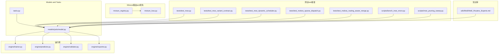
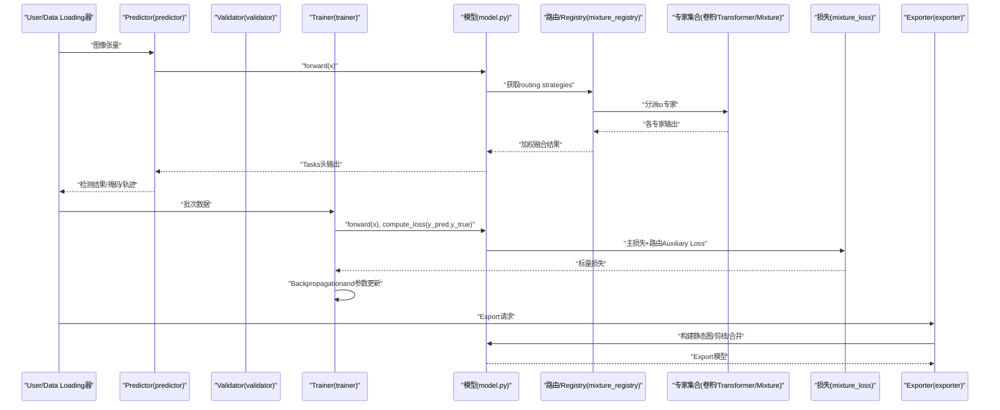
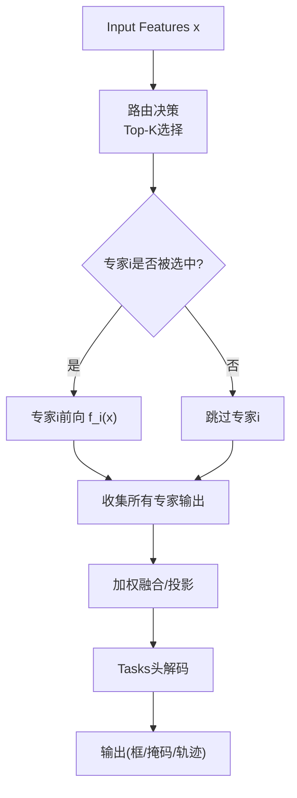
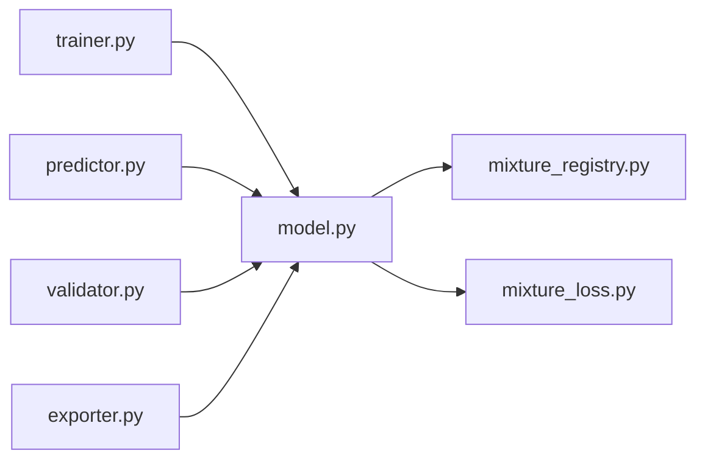

# 专家类型andimplementing

<cite>
**Files Referenced in This Document**
- [mixture_registry.py](file://ultralytics/nn/mixture_registry.py)
- [mixture_loss.py](file://ultralytics/nn/mixture_loss.py)
- [tasks.py](file://ultralytics/nn/tasks.py)
- [yolo.py](file://ultralytics/models/yolo/model.py)
- [train.py](file://ultralytics/engine/trainer.py)
- [predictor.py](file://ultralytics/engine/predictor.py)
- [validator.py](file://ultralytics/engine/validator.py)
- [exporter.py](file://ultralytics/engine/exporter.py)
- [test_moe.py](file://tests/test_moe.py)
- [test_moe_variant_contract.py](file://tests/test_moe_variant_contract.py)
- [test_moe_dynamic_scheduler.py](file://tests/test_moe_dynamic_scheduler.py)
- [test_molora_sparse_dispatch.py](file://tests/test_molora_sparse_dispatch.py)
- [test_molora_routing_aware_merge.py](file://tests/test_molora_routing_aware_merge.py)
- [bench_moe_micro.py](file://scripts/bench_moe_micro.py)
- [moe_pruning_sweep.py](file://scripts/moe_pruning_sweep.py)
- [MoE_Routers_Experts.md](file://wiki/MoE/MoE_Routers_Experts.md)
</cite>

## Table of Contents
1. [Introduction](#Introduction)
2. [Project Structure](#Project Structure)
3. [Core Components](#Core Components)
4. [Architecture Overview](#Architecture Overview)
5. [Detailed Component Analysis](#Detailed Component Analysis)
6. [Dependency Analysis](#Dependency Analysis)
7. [性能考量](#性能考量)
8. [Troubleshooting Guide](#Troubleshooting Guide)
9. [Conclusion](#Conclusion)
10. [Appendix](#Appendix)

## Introduction
本文件聚焦于YOLO-Master中的“专家”体系，系统梳理卷积专家、Transformer专家andMixture专家的设计原理、输入输出格式、计算复杂度and内存占用特征，并给出前向传播逻辑、参数初始化andGradient更新机制的说明。Documentation同时覆盖配置超参（通道数、层数、激活函数etc.）、while不同Tasks（检测、分割、Tracking）中的Optimization策略，Centered onand性能对比and选型建议，并provides代码Examples路径and最佳实践指引。

## Project Structure
围绕专家capabilities的相关代码主要分布whileCentered on下位置：
- Models and Tasks定义：ultralytics/nn/tasks.py、ultralytics/models/yolo/model.py
- Mixture路由and损失：ultralytics/nn/mixture_registry.py、ultralytics/nn/mixture_loss.py
- Training/Validation/Inference/Export流程：ultralytics/engine/{trainer,predictor,validator,exporter}.py
- 测试and基准：tests/*、scripts/bench_moe_micro.py、scripts/moe_pruning_sweep.py
- 知识Documentation：wiki/MoE/MoE_Routers_Experts.md

Figure Source
- [tasks.py](file://ultralytics/nn/tasks.py)
- [model.py](file://ultralytics/models/yolo/model.py)
- [mixture_registry.py](file://ultralytics/nn/mixture_registry.py)
- [mixture_loss.py](file://ultralytics/nn/mixture_loss.py)
- [trainer.py](file://ultralytics/engine/trainer.py)
- [predictor.py](file://ultralytics/engine/predictor.py)
- [validator.py](file://ultralytics/engine/validator.py)
- [exporter.py](file://ultralytics/engine/exporter.py)
- [test_moe.py](file://tests/test_moe.py)
- [test_moe_variant_contract.py](file://tests/test_moe_variant_contract.py)
- [test_moe_dynamic_scheduler.py](file://tests/test_moe_dynamic_scheduler.py)
- [test_molora_sparse_dispatch.py](file://tests/test_molora_sparse_dispatch.py)
- [test_molora_routing_aware_merge.py](file://tests/test_molora_routing_aware_merge.py)
- [bench_moe_micro.py](file://scripts/bench_moe_micro.py)
- [moe_pruning_sweep.py](file://scripts/moe_pruning_sweep.py)
- [MoE_Routers_Experts.md](file://wiki/MoE/MoE_Routers_Experts.md)

Section Source
- [tasks.py](file://ultralytics/nn/tasks.py)
- [model.py](file://ultralytics/models/yolo/model.py)
- [mixture_registry.py](file://ultralytics/nn/mixture_registry.py)
- [mixture_loss.py](file://ultralytics/nn/mixture_loss.py)
- [trainer.py](file://ultralytics/engine/trainer.py)
- [predictor.py](file://ultralytics/engine/predictor.py)
- [validator.py](file://ultralytics/engine/validator.py)
- [exporter.py](file://ultralytics/engine/exporter.py)
- [test_moe.py](file://tests/test_moe.py)
- [test_moe_variant_contract.py](file://tests/test_moe_variant_contract.py)
- [test_moe_dynamic_scheduler.py](file://tests/test_moe_dynamic_scheduler.py)
- [test_molora_sparse_dispatch.py](file://tests/test_molora_sparse_dispatch.py)
- [test_molora_routing_aware_merge.py](file://tests/test_molora_routing_aware_merge.py)
- [bench_moe_micro.py](file://scripts/bench_moe_micro.py)
- [moe_pruning_sweep.py](file://scripts/moe_pruning_sweep.py)
- [MoE_Routers_Experts.md](file://wiki/MoE/MoE_Routers_Experts.md)

## Core Components
- 专家Registryand路由契约：through a unified注册机制管理不同专家变体，provides路由接口and一致性约束，确保whileTraining/Validation/Inference/Export链路中行for一致。
- Mixture路由andAuxiliary Loss：负责将Input Features按门控策略分发to多个专家，并whileTraining阶段引入Load Balancing、容量惩罚etc.辅助项Centered on稳定Training。
- Tasks适配层：while检测、分割、Trackingand other tasks头中，对专家输出的融合andPost-Processing进行适配，保证Tasks特定的精度and效率目标。
- 动态调度and稀疏化：根据Uses频率或重要性Metrics动态选择活跃专家集合，降低Inference成本并保持精度。
- 可插拔专家内核：Supporting卷积专家、Transformer专家andMixture专家三种形态，统一对外接口，便于组合and替换。

Section Source
- [mixture_registry.py](file://ultralytics/nn/mixture_registry.py)
- [mixture_loss.py](file://ultralytics/nn/mixture_loss.py)
- [tasks.py](file://ultralytics/nn/tasks.py)
- [model.py](file://ultralytics/models/yolo/model.py)

## Architecture Overview
下图展示了从输入to输出的端to端流程，包括路由、专家计算、融合andTasks头输出。

Figure Source
- [predictor.py](file://ultralytics/engine/predictor.py)
- [validator.py](file://ultralytics/engine/validator.py)
- [trainer.py](file://ultralytics/engine/trainer.py)
- [model.py](file://ultralytics/models/yolo/model.py)
- [mixture_registry.py](file://ultralytics/nn/mixture_registry.py)
- [mixture_loss.py](file://ultralytics/nn/mixture_loss.py)
- [exporter.py](file://ultralytics/engine/exporter.py)

## Detailed Component Analysis

### 专家类型andApplicable Scenarios
- 卷积专家
  - 设计要点：局部感受野强、计算密集但并行度高，适合提取低中层纹理and几何特征。
  - Applicable Scenarios：小Object Detection、Edge Device Deployment、需要高吞吐的场景。
  - 输入输出：通常forN×C×H×W的特征图；输出保持空间分辨率或下采样后的特征图。
  - 复杂度and内存：FLOPs随通道数平方增长，显存占用and中间激活成正比。
- Transformer专家
  - 设计要点：全局建模capabilities强，适合长程依赖and上下文融合；自注意力开销大。
  - Applicable Scenarios：复杂背景下的细粒度识别、跨尺度语义对齐、Multimodal Fusion。
  - 输入输出：序列或网格化特征；输出维度and通道数由配置决定。
  - 复杂度and内存：自注意力O(N^2·C)，显存峰值较高，需Combined withKV缓存或稀疏注意力Optimization。
- Mixture专家
  - 设计要点：Combining卷积的局部性andTransformer的全局性，采用分层或并联结构。
  - Applicable Scenarios：兼顾精度and效率的多Tasks主干，such as检测+分割联合。
  - 输入输出：and上述两类一致，内部包含分支融合Modules。
  - 复杂度and内存：介于两者之间，可Via门控and稀疏化控制实际计算量。

Section Source
- [tasks.py](file://ultralytics/nn/tasks.py)
- [model.py](file://ultralytics/models/yolo/model.py)
- [MoE_Routers_Experts.md](file://wiki/MoE/MoE_Routers_Experts.md)

### 前向传播逻辑and数据流
- 路由阶段：根据Input Featuresand门控网络，for每个样本/位置选择Top-K专家。
- 专家计算：被选中的专家独立执行前向，得to各自输出。
- 融合阶段：按权重对各专家输出进行加权求和或拼接后接投影层。
- Tasks头：检测/分割/Tracking头对融合特征进行解码andPost-Processing。

Figure Source
- [model.py](file://ultralytics/models/yolo/model.py)
- [mixture_registry.py](file://ultralytics/nn/mixture_registry.py)
- [tasks.py](file://ultralytics/nn/tasks.py)

### 参数初始化andGradient更新
- 初始化策略：卷积专家常用Kaiming/Xavier；Transformer专家对多头注意力和FFN采用标准初始化；路由门控常采用较小方差Centered on避免早期过拟合。
- Gradient更新：
  - 主损失：Tasks相关损失drivers are installed骨干andTasks头参数更新。
  - Auxiliary Loss：路由平衡、容量惩罚、稀疏性etc.辅助项参andBackpropagation，稳定Training。
  - 动态调度：Training过程中可按频率或重要性调整活跃专家集合，影响Gradient累积路径。
- 分布式andAMP：while多卡环境下，路由and专家间可能涉andAllReduce；Mixture精度可减少显存并加速Training。

Section Source
- [mixture_loss.py](file://ultralytics/nn/mixture_loss.py)
- [trainer.py](file://ultralytics/engine/trainer.py)
- [test_moe.py](file://tests/test_moe.py)
- [test_moe_dynamic_scheduler.py](file://tests/test_moe_dynamic_scheduler.py)

### 配置参数and超参
- 通用配置
  - 通道数：控制每层特征宽度，直接影响FLOPsand显存。
  - 层数/深度：决定表达capabilitiesand计算成本。
  - 激活函数：ReLU/GELU/Swishetc.，影响收敛速度and稳定性。
  - 归一化：BN/LN/GroupNorm，影响Training稳定性and跨设备一致性。
- 路由and专家
  - 专家数量andTop-K：控制并行度and计算量。
  - 路由温度/阈值：影响门控分布的平滑度and稀疏性。
  - 容量and丢弃率：防止单专家过载，提升鲁棒性。
- Tasks特定
  - 检测：锚点/无锚策略、IoU阈值、NMS变体。
  - 分割：掩码头通道and上采样倍数。
  - Tracking：ID嵌入维度、ReID头and匹配代价矩阵。

Section Source
- [tasks.py](file://ultralytics/nn/tasks.py)
- [model.py](file://ultralytics/models/yolo/model.py)
- [mixture_registry.py](file://ultralytics/nn/mixture_registry.py)

### Tasks特定Optimization策略
- 检测
  - 多尺度特征融合and高分辨率分支增强小目标召回。
  - 路由while浅层更关注局部细节，深层侧重语义判别。
- 分割
  - 掩码头and专家输出拼接后再上采样，提高边界质量。
  - 对高频区域启用更强专家Centered on提升细节重建。
- Tracking
  - 时序一致性约束融入路由权重，使同一目标while不同帧选择相似专家。
  - Uses轻量专家维持实时性，关键帧切换至更强专家。

Section Source
- [tasks.py](file://ultralytics/nn/tasks.py)
- [model.py](file://ultralytics/models/yolo/model.py)

### 性能对比and选型指南
- 卷积专家
  - Advantages：吞吐高、延迟低、易部署。
  - 缺点：全局建模弱，复杂场景精度受限。
  - 选型：资源受限、小目标for主、实时性优先。
- Transformer专家
  - Advantages：全局建模强，复杂场景精度高。
  - 缺点：计算and显存开销大。
  - 选型：离线/云端、精度优先、复杂背景。
- Mixture专家
  - Advantages：精度and效率折中，灵活可调。
  - 缺点：implementingand调参复杂度更高。
  - 选型：多Tasks、跨域泛化、需要弹性扩展。

Section Source
- [bench_moe_micro.py](file://scripts/bench_moe_micro.py)
- [test_moe.py](file://tests/test_moe.py)
- [MoE_Routers_Experts.md](file://wiki/MoE/MoE_Routers_Experts.md)

### 代码Examplesand最佳实践
- Examples路径
  - 基础MoETrainingandValidation：[test_moe.py](file://tests/test_moe.py)
  - 变体契约and兼容性校验：[test_moe_variant_contract.py](file://tests/test_moe_variant_contract.py)
  - 动态调度策略：[test_moe_dynamic_scheduler.py](file://tests/test_moe_dynamic_scheduler.py)
  - 稀疏分发andRouting-Aware Merging：[test_molora_sparse_dispatch.py](file://tests/test_molora_sparse_dispatch.py)、[test_molora_routing_aware_merge.py](file://tests/test_molora_routing_aware_merge.py)
  - 微基准and压测：[bench_moe_micro.py](file://scripts/bench_moe_micro.py)
  - 剪枝and调度扫描：[moe_pruning_sweep.py](file://scripts/moe_pruning_sweep.py)
- 最佳实践
  - 先训路由再微调专家：预热路由门控，避免早期不稳定。
  - 控制Top-Kand容量：while小批下避免单专家过载。
  - 监控路由熵andGini系数：Evaluation路由多样性andLoad Balancing。
  - Export前做路由合并and算子融合：减少运行时分支，提升部署性能。

Section Source
- [test_moe.py](file://tests/test_moe.py)
- [test_moe_variant_contract.py](file://tests/test_moe_variant_contract.py)
- [test_moe_dynamic_scheduler.py](file://tests/test_moe_dynamic_scheduler.py)
- [test_molora_sparse_dispatch.py](file://tests/test_molora_sparse_dispatch.py)
- [test_molora_routing_aware_merge.py](file://tests/test_molora_routing_aware_merge.py)
- [bench_moe_micro.py](file://scripts/bench_moe_micro.py)
- [moe_pruning_sweep.py](file://scripts/moe_pruning_sweep.py)

## Dependency Analysis
- 组件耦合
  - 模型依赖路由and损失Modules，Training/Validation/Inference均复用同一套专家接口。
  - Exporter基于模型图进行静态化，要求路由and专家具备确定性的形状and类型。
- External Dependencies
  - 分布式通信：多卡Training时路由and专家间的规约操作。
  - 后端Optimization：算子融合、编译Optimization（such astorch.compile/TensorRT）。

Figure Source
- [model.py](file://ultralytics/models/yolo/model.py)
- [mixture_registry.py](file://ultralytics/nn/mixture_registry.py)
- [mixture_loss.py](file://ultralytics/nn/mixture_loss.py)
- [trainer.py](file://ultralytics/engine/trainer.py)
- [predictor.py](file://ultralytics/engine/predictor.py)
- [validator.py](file://ultralytics/engine/validator.py)
- [exporter.py](file://ultralytics/engine/exporter.py)

Section Source
- [model.py](file://ultralytics/models/yolo/model.py)
- [mixture_registry.py](file://ultralytics/nn/mixture_registry.py)
- [mixture_loss.py](file://ultralytics/nn/mixture_loss.py)
- [trainer.py](file://ultralytics/engine/trainer.py)
- [predictor.py](file://ultralytics/engine/predictor.py)
- [validator.py](file://ultralytics/engine/validator.py)
- [exporter.py](file://ultralytics/engine/exporter.py)

## 性能考量
- 计算复杂度
  - 卷积专家：近似O(C^2·HW)；Transformer专家：近似O((HW)^2·C)。
  - 路由and融合：线性于Top-Kand专家数量。
- 显存占用
  - 激活值占大头，尤其是Transformer自注意力中间态；can useGradientCheckpointandKV缓存缓解。
- 吞吐and延迟
  - 小批/边缘设备优先卷积专家；大批/云端可用Transformer或Mixture专家。
- 动态调度收益
  - 按场景自适应选择专家集合，显著降低平均延迟and能耗。

Section Source
- [bench_moe_micro.py](file://scripts/bench_moe_micro.py)
- [moe_pruning_sweep.py](file://scripts/moe_pruning_sweep.py)

## Troubleshooting Guide
- 路由不稳定/NaN
  - 现象：Training初期loss震荡或出现NaN。
  - 排查：检查路由温度、容量惩罚andLearning Rate；确认Auxiliary Loss权重合理。
  - Refer to：[mixture_loss.py](file://ultralytics/nn/mixture_loss.py)、[test_moe.py](file://tests/test_moe.py)
- 单专家过载
  - 现象：某专家Uses率极高，其他几乎闲置。
  - 排查：增大容量上限或增加Top-K；引入Load Balancing项。
  - Refer to：[test_moe_dynamic_scheduler.py](file://tests/test_moe_dynamic_scheduler.py)
- Export Failure或形状不匹配
  - 现象：ExportONNX/TensorRT时报错。
  - 排查：固定Top-Kand专家数量；确保路由分支可静态化。
  - Refer to：[exporter.py](file://ultralytics/engine/exporter.py)
- 多卡不一致
  - 现象：DDP下结果抖动。
  - 排查：检查路由规约andAllReduce同步点；确认随机种子andData Loading一致性。
  - Refer to：[trainer.py](file://ultralytics/engine/trainer.py)

Section Source
- [mixture_loss.py](file://ultralytics/nn/mixture_loss.py)
- [test_moe.py](file://tests/test_moe.py)
- [test_moe_dynamic_scheduler.py](file://tests/test_moe_dynamic_scheduler.py)
- [exporter.py](file://ultralytics/engine/exporter.py)
- [trainer.py](file://ultralytics/engine/trainer.py)

## Conclusion
YOLO-Master的专家体系through a unified路由and注册机制，将卷积、TransformerandMixture专家无缝集成to检测、分割andTrackingTasks中。借助动态调度and稀疏化，可While maintaining精度显著降低计算and显存开销。实践中建议依据Tasks特性and部署环境选择合适的专家类型and配置，并CombiningAuxiliary Lossand路由诊断工具持续Optimization。

## Appendix
- 术语
  - 专家：具有固定结构的子网络，接收相同维度的输入并产生同构输出。
  - 路由：根据输入动态选择专家的机制，通常基于门控网络andTop-K策略。
  - Mixture专家：while同一Modules内组合多种专家形态，并Via融合策略聚合输出。
- Refer toDocumentation
  - MoE路由and专家综述：[MoE_Routers_Experts.md](file://wiki/MoE/MoE_Routers_Experts.md)