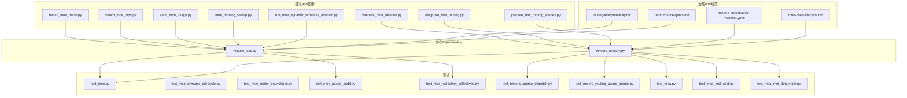
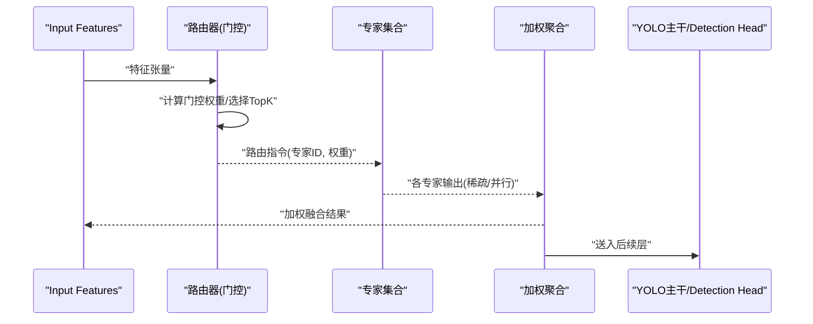
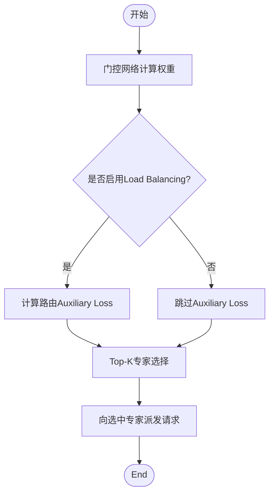
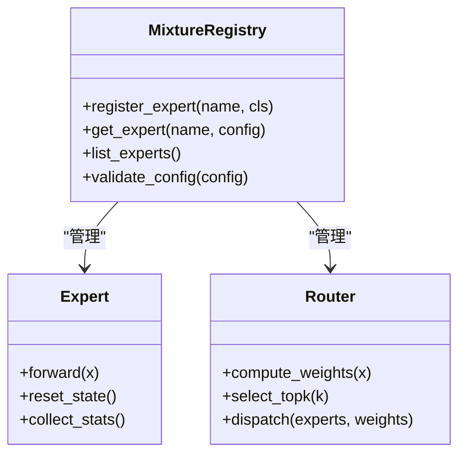
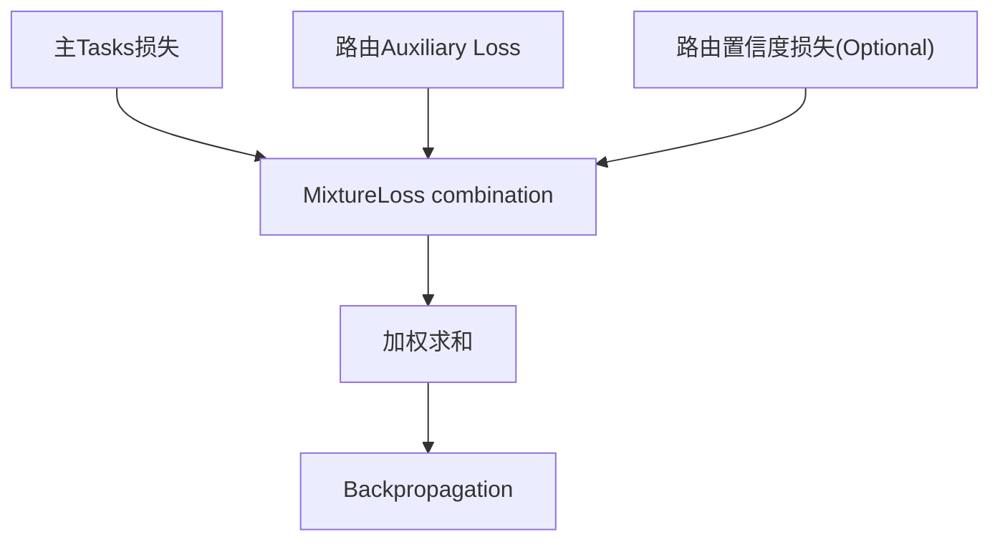
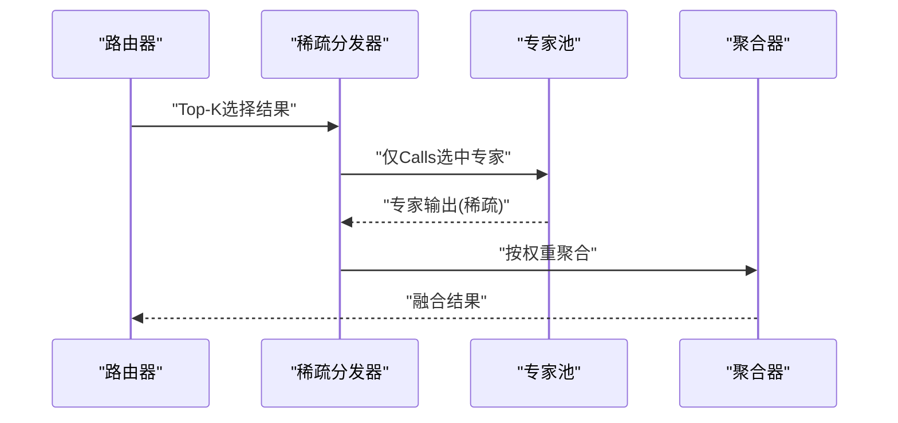
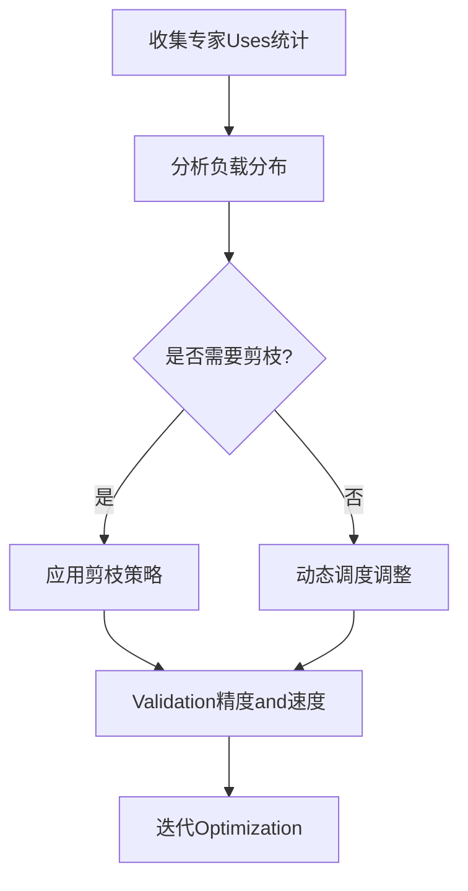
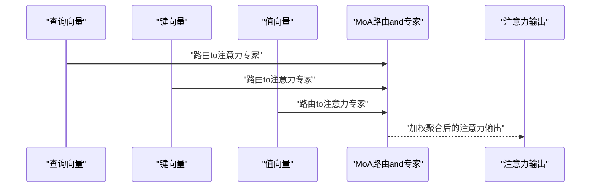
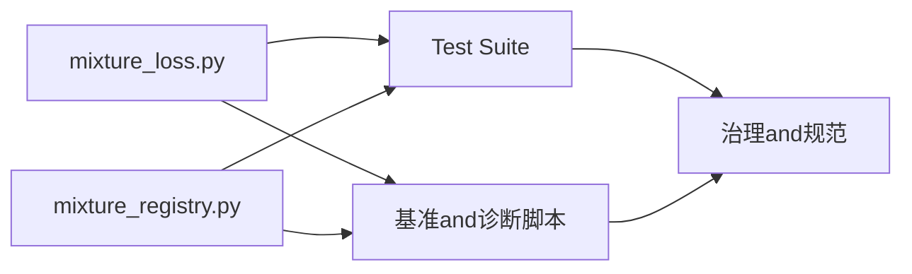

# Mixture of Experts System

<cite>
**Files Referenced in This Document**
- [mixture_loss.py](file://ultralytics/nn/mixture_loss.py)
- [mixture_registry.py](file://ultralytics/nn/mixture_registry.py)
- [test_mixture_config_registry.py](file://tests/test_mixture_config_registry.py)
- [test_mixture_model_registry.py](file://tests/test_mixture_model_registry.py)
- [test_mixture_loss_composition.py](file://tests/test_mixture_loss_composition.py)
- [test_moe.py](file://tests/test_moe.py)
- [test_moe_dynamic_schedule.py](file://tests/test_moe_dynamic_schedule.py)
- [test_moe_dynamic_scheduler.py](file://tests/test_moe_dynamic_scheduler.py)
- [test_moe_router_boundaries.py](file://tests/test_moe_router_boundaries.py)
- [test_moe_usage_audit.py](file://tests/test_moe_usage_audit.py)
- [test_moe_validation_collectives.py](file://tests/test_moe_validation_collectives.py)
- [test_molora_sparse_dispatch.py](file://tests/test_molora_sparse_dispatch.py)
- [test_molora_routing_aware_merge.py](file://tests/test_molora_routing_aware_merge.py)
- [test_moa.py](file://tests/test_moa.py)
- [test_moa_mot_ssot.py](file://tests/test_moa_mot_ssot.py)
- [test_moa_mot_ddp_math.py](file://tests/test_moa_mot_ddp_math.py)
- [bench_moe_micro.py](file://scripts/bench_moe_micro.py)
- [bench_moe_mps.py](file://scripts/bench_moe_mps.py)
- [audit_moe_usage.py](file://scripts/audit_moe_usage.py)
- [moe_pruning_sweep.py](file://scripts/moe_pruning_sweep.py)
- [run_moe_dynamic_schedule_ablation.py](file://scripts/run_moe_dynamic_schedule_ablation.py)
- [compare_moa_ablation.py](file://scripts/compare_moa_ablation.py)
- [diagnose_mot_routing.py](file://scripts/diagnose_mot_routing.py)
- [prepare_mot_routing_scenes.py](file://scripts/prepare_mot_routing_scenes.py)
- [moe_pruning_dynamic_schedule.md](file://docs/moe_pruning_dynamic_schedule.md)
- [molora_guide.md](file://docs/molora_guide.md)
- [mixture-preservation-manifest.yaml](file://docs/governance/mixture-preservation-manifest.yaml)
- [moe-class-lifecycle.md](file://docs/governance/moe-class-lifecycle.md)
- [routing-interpretability.md](file://docs/governance/routing-interpretability.md)
- [performance-gates.md](file://docs/governance/performance-gates.md)
</cite>

## Table of Contents
1. [Introduction](#Introduction)
2. [Project Structure](#Project Structure)
3. [Core Components](#Core Components)
4. [Architecture Overview](#Architecture Overview)
5. [Detailed Component Analysis](#Detailed Component Analysis)
6. [Dependency Analysis](#Dependency Analysis)
7. [性能考量](#性能考量)
8. [Troubleshooting Guide](#Troubleshooting Guide)
9. [Conclusion](#Conclusion)
10. [Appendix](#Appendix)

## Introduction
本技术DocumentationtargetingYOLO-Master的Mixture of Experts System，系统性阐述MoE（Mixture of Experts）andMoA（Mixture of Attention）的架构设计、Routing Mechanism、专家注册and管理、MixtureLoss Function、稀疏计算Optimization、动态调度and剪枝策略、whileYOLO中的集成位置、配置参数and调优建议、Training稳定性and收敛性保障，Centered onandExportand部署注意事项。DocumentationCentered on代码级implementingfor依据，Combining测试and基准脚本，provides可操作的实践指导。

## Project Structure
Mixture of Experts相关capabilities主要分布whileCentered on下Modules：
- 核心implementingandRegistry
  - Mixture损失and路由Auxiliary Loss：[mixture_loss.py](file://ultralytics/nn/mixture_loss.py)
  - 专家and路由注册中心：[mixture_registry.py](file://ultralytics/nn/mixture_registry.py)
- Test Suite
  - MoE/MoA功能and边界用例：见tests下Centered ontest_moe_*、test_moa_*开头的文件
  - 路由解释and审计：见tests下test_moe_usage_audit.pyetc.
- 基准and诊断脚本
  - 微基准and平台适配：scripts/bench_moe_micro.py、scripts/bench_moe_mps.py
  - Uses统计and剪枝扫描：scripts/audit_moe_usage.py、scripts/moe_pruning_sweep.py
  - 动态调度消融and对比：scripts/run_moe_dynamic_schedule_ablation.py、scripts/compare_moa_ablation.py
  - MOT场景路由诊断andData Preparation：scripts/diagnose_mot_routing.py、scripts/prepare_mot_routing_scenes.py
- 治理and规范
  - Mixture保留清单、类生命周期、路由可解释性and性能门禁：docs/governance下相关文件

Figure Source
- [mixture_loss.py](file://ultralytics/nn/mixture_loss.py)
- [mixture_registry.py](file://ultralytics/nn/mixture_registry.py)
- [test_moe.py](file://tests/test_moe.py)
- [test_moe_dynamic_schedule.py](file://tests/test_moe_dynamic_schedule.py)
- [test_moe_router_boundaries.py](file://tests/test_moe_router_boundaries.py)
- [test_moe_usage_audit.py](file://tests/test_moe_usage_audit.py)
- [test_moe_validation_collectives.py](file://tests/test_moe_validation_collectives.py)
- [test_molora_sparse_dispatch.py](file://tests/test_molora_sparse_dispatch.py)
- [test_molora_routing_aware_merge.py](file://tests/test_molora_routing_aware_merge.py)
- [test_moa.py](file://tests/test_moa.py)
- [test_moa_mot_ssot.py](file://tests/test_moa_mot_ssot.py)
- [test_moa_mot_ddp_math.py](file://tests/test_moa_mot_ddp_math.py)
- [bench_moe_micro.py](file://scripts/bench_moe_micro.py)
- [bench_moe_mps.py](file://scripts/bench_moe_mps.py)
- [audit_moe_usage.py](file://scripts/audit_moe_usage.py)
- [moe_pruning_sweep.py](file://scripts/moe_pruning_sweep.py)
- [run_moe_dynamic_schedule_ablation.py](file://scripts/run_moe_dynamic_schedule_ablation.py)
- [compare_moa_ablation.py](file://scripts/compare_moa_ablation.py)
- [diagnose_mot_routing.py](file://scripts/diagnose_mot_routing.py)
- [prepare_mot_routing_scenes.py](file://scripts/prepare_mot_routing_scenes.py)
- [mixture-preservation-manifest.yaml](file://docs/governance/mixture-preservation-manifest.yaml)
- [moe-class-lifecycle.md](file://docs/governance/moe-class-lifecycle.md)
- [routing-interpretability.md](file://docs/governance/routing-interpretability.md)
- [performance-gates.md](file://docs/governance/performance-gates.md)

Section Source
- [mixture_loss.py](file://ultralytics/nn/mixture_loss.py)
- [mixture_registry.py](file://ultralytics/nn/mixture_registry.py)
- [test_moe.py](file://tests/test_moe.py)
- [test_moe_dynamic_schedule.py](file://tests/test_moe_dynamic_schedule.py)
- [test_moe_router_boundaries.py](file://tests/test_moe_router_boundaries.py)
- [test_moe_usage_audit.py](file://tests/test_moe_usage_audit.py)
- [test_moe_validation_collectives.py](file://tests/test_moe_validation_collectives.py)
- [test_molora_sparse_dispatch.py](file://tests/test_molora_sparse_dispatch.py)
- [test_molora_routing_aware_merge.py](file://tests/test_molora_routing_aware_merge.py)
- [test_moa.py](file://tests/test_moa.py)
- [test_moa_mot_ssot.py](file://tests/test_moa_mot_ssot.py)
- [test_moa_mot_ddp_math.py](file://tests/test_moa_mot_ddp_math.py)
- [bench_moe_micro.py](file://scripts/bench_moe_micro.py)
- [bench_moe_mps.py](file://scripts/bench_moe_mps.py)
- [audit_moe_usage.py](file://scripts/audit_moe_usage.py)
- [moe_pruning_sweep.py](file://scripts/moe_pruning_sweep.py)
- [run_moe_dynamic_schedule_ablation.py](file://scripts/run_moe_dynamic_schedule_ablation.py)
- [compare_moa_ablation.py](file://scripts/compare_moa_ablation.py)
- [diagnose_mot_routing.py](file://scripts/diagnose_mot_routing.py)
- [prepare_mot_routing_scenes.py](file://scripts/prepare_mot_routing_scenes.py)
- [mixture-preservation-manifest.yaml](file://docs/governance/mixture-preservation-manifest.yaml)
- [moe-class-lifecycle.md](file://docs/governance/moe-class-lifecycle.md)
- [routing-interpretability.md](file://docs/governance/routing-interpretability.md)
- [performance-gates.md](file://docs/governance/performance-gates.md)

## Core Components
- Mixture损失and路由Auxiliary Loss
  - 负责组合主Tasks损失and路由相关的Auxiliary Loss，Supporting权重平衡and数值稳定处理。
  - Refer to路径：[mixture_loss.py](file://ultralytics/nn/mixture_loss.py)
- 专家and路由注册中心
  - provides专家类型、路由器的统一注册接口，Supporting动态发现and实例化，保证可插拔扩展。
  - Refer to路径：[mixture_registry.py](file://ultralytics/nn/mixture_registry.py)
- 测试and契约
  - 覆盖MoE/MoA基本行for、路由边界条件、DDP一致性、稀疏分发andRouting-Aware Merging、Uses审计and统计etc.。
  - Refer to路径：tests下test_moe_*、test_moa_*系列文件

Section Source
- [mixture_loss.py](file://ultralytics/nn/mixture_loss.py)
- [mixture_registry.py](file://ultralytics/nn/mixture_registry.py)
- [test_mixture_config_registry.py](file://tests/test_mixture_config_registry.py)
- [test_mixture_model_registry.py](file://tests/test_mixture_model_registry.py)
- [test_mixture_loss_composition.py](file://tests/test_mixture_loss_composition.py)
- [test_moe.py](file://tests/test_moe.py)
- [test_moe_dynamic_schedule.py](file://tests/test_moe_dynamic_schedule.py)
- [test_moe_dynamic_scheduler.py](file://tests/test_moe_dynamic_scheduler.py)
- [test_moe_router_boundaries.py](file://tests/test_moe_router_boundaries.py)
- [test_moe_usage_audit.py](file://tests/test_moe_usage_audit.py)
- [test_moe_validation_collectives.py](file://tests/test_moe_validation_collectives.py)
- [test_molora_sparse_dispatch.py](file://tests/test_molora_sparse_dispatch.py)
- [test_molora_routing_aware_merge.py](file://tests/test_molora_routing_aware_merge.py)
- [test_moa.py](file://tests/test_moa.py)
- [test_moa_mot_ssot.py](file://tests/test_moa_mot_ssot.py)
- [test_moa_mot_ddp_math.py](file://tests/test_moa_mot_ddp_math.py)

## Architecture Overview
下图展示MoE/MoAwhileYOLO中的整体交互：Input Features进入路由器，路由器输出专家选择and权重；被选中的专家并行或稀疏执行；结果按权重聚合后回传至主干网络继续Inference或Training。

Figure Source
- [mixture_loss.py](file://ultralytics/nn/mixture_loss.py)
- [mixture_registry.py](file://ultralytics/nn/mixture_registry.py)
- [test_moe.py](file://tests/test_moe.py)
- [test_moa.py](file://tests/test_moa.py)

## Detailed Component Analysis

### Routing Mechanism：门控网络、Load Balancingand专家选择
- 门控网络
  - 根据Input Features生成专家选择概率分布，SupportingTop-K稀疏激活Centered on降低计算开销。
  - 关键implementingRefer to：[mixture_loss.py](file://ultralytics/nn/mixture_loss.py)
- Load Balancing
  - ViaAuxiliary Loss对专家Uses频率进行正则化，避免“赢家通吃”现象。
  - 关键implementingRefer to：[mixture_loss.py](file://ultralytics/nn/mixture_loss.py)
- 专家选择策略
  - SupportingTop-K选择and软/硬routing strategies，兼顾精度and效率。
  - 关键implementingRefer to：[mixture_loss.py](file://ultralytics/nn/mixture_loss.py)

Figure Source
- [mixture_loss.py](file://ultralytics/nn/mixture_loss.py)
- [test_moe_router_boundaries.py](file://tests/test_moe_router_boundaries.py)

Section Source
- [mixture_loss.py](file://ultralytics/nn/mixture_loss.py)
- [test_moe_router_boundaries.py](file://tests/test_moe_router_boundaries.py)

### Expert Modules设计and可插拔架构
- 注册and管理
  - Via注册中心统一管理专家and路由器的类型、配置and实例化流程，Supporting热插拔and版本兼容。
  - 关键implementingRefer to：[mixture_registry.py](file://ultralytics/nn/mixture_registry.py)
- 契约and生命周期
  - 定义专家接口契约、初始化/销毁流程、状态重置and统计收集点。
  - Refer toDocumentation：[moe-class-lifecycle.md](file://docs/governance/moe-class-lifecycle.md)

Figure Source
- [mixture_registry.py](file://ultralytics/nn/mixture_registry.py)
- [moe-class-lifecycle.md](file://docs/governance/moe-class-lifecycle.md)

Section Source
- [mixture_registry.py](file://ultralytics/nn/mixture_registry.py)
- [moe-class-lifecycle.md](file://docs/governance/moe-class-lifecycle.md)

### MixtureLoss Function：主损失、Auxiliary Lossand路由损失
- 组成
  - 主Tasks损失（such as检测损失）、路由Auxiliary Loss（用于Load Balancing）、可能的路由置信度损失。
- 平衡策略
  - Via超参控制Auxiliary Loss权重，确保Training稳定且不牺牲主Tasks性能。
- 数值稳定性
  - 采用归一化and裁剪策略防止Gradient爆炸或NaN传播。

Figure Source
- [mixture_loss.py](file://ultralytics/nn/mixture_loss.py)
- [test_mixture_loss_composition.py](file://tests/test_mixture_loss_composition.py)

Section Source
- [mixture_loss.py](file://ultralytics/nn/mixture_loss.py)
- [test_mixture_loss_composition.py](file://tests/test_mixture_loss_composition.py)

### 动态专家激活and稀疏计算Optimization
- 稀疏分发
  - 仅对被选中的专家执行前向，减少冗余计算。
  - Refer toimplementing：[test_molora_sparse_dispatch.py](file://tests/test_molora_sparse_dispatch.py)
- Routing-Aware Merging
  - whileWeight Merging阶段考虑路由分布，保持模型质量。
  - Refer toimplementing：[test_molora_routing_aware_merge.py](file://tests/test_molora_routing_aware_merge.py)
- 基准Validation
  - 微基准and跨平台（such asMPS）Validation稀疏路径的性能收益。
  - Refer to脚本：[bench_moe_micro.py](file://scripts/bench_moe_micro.py)、[bench_moe_mps.py](file://scripts/bench_moe_mps.py)

Figure Source
- [test_molora_sparse_dispatch.py](file://tests/test_molora_sparse_dispatch.py)
- [test_molora_routing_aware_merge.py](file://tests/test_molora_routing_aware_merge.py)
- [bench_moe_micro.py](file://scripts/bench_moe_micro.py)
- [bench_moe_mps.py](file://scripts/bench_moe_mps.py)

Section Source
- [test_molora_sparse_dispatch.py](file://tests/test_molora_sparse_dispatch.py)
- [test_molora_routing_aware_merge.py](file://tests/test_molora_routing_aware_merge.py)
- [bench_moe_micro.py](file://scripts/bench_moe_micro.py)
- [bench_moe_mps.py](file://scripts/bench_moe_mps.py)

### 专家剪枝and动态调度机制
- Uses统计and审计
  - 收集专家访问频次、负载分布andGini系数etc.Metrics，for剪枝and调度provides依据。
  - Refer to脚本：[audit_moe_usage.py](file://scripts/audit_moe_usage.py)
- 剪枝扫描andEvaluation
  - 自动化扫描不同剪枝比例并Evaluation精度影响。
  - Refer to脚本：[moe_pruning_sweep.py](file://scripts/moe_pruning_sweep.py)
- 动态调度
  - 基于历史Uses统计自适应调整Top-K或路由阈值，提升吞吐and稳定性。
  - Refer to脚本：[run_moe_dynamic_schedule_ablation.py](file://scripts/run_moe_dynamic_schedule_ablation.py)
- Documentation说明
  - 剪枝and动态调度策略详解：[moe_pruning_dynamic_schedule.md](file://docs/moe_pruning_dynamic_schedule.md)

Figure Source
- [audit_moe_usage.py](file://scripts/audit_moe_usage.py)
- [moe_pruning_sweep.py](file://scripts/moe_pruning_sweep.py)
- [run_moe_dynamic_schedule_ablation.py](file://scripts/run_moe_dynamic_schedule_ablation.py)
- [moe_pruning_dynamic_schedule.md](file://docs/moe_pruning_dynamic_schedule.md)

Section Source
- [audit_moe_usage.py](file://scripts/audit_moe_usage.py)
- [moe_pruning_sweep.py](file://scripts/moe_pruning_sweep.py)
- [run_moe_dynamic_schedule_ablation.py](file://scripts/run_moe_dynamic_schedule_ablation.py)
- [moe_pruning_dynamic_schedule.md](file://docs/moe_pruning_dynamic_schedule.md)

### MoEwhileYOLO中的集成方式and位置选择
- 集成位置
  - 通常whileBackbone Network的中间层或颈部结构中插入MoE块，Centered on增强特征表达并保持端to端Training。
- 兼容性
  - Via注册中心and契约保证and现有YOLOModules无缝衔接。
- Refer toimplementingand测试
  - 基础行forand边界用例：[test_moe.py](file://tests/test_moe.py)
  - 路由边界and统计：[test_moe_router_boundaries.py](file://tests/test_moe_router_boundaries.py)、[test_moe_usage_audit.py](file://tests/test_moe_usage_audit.py)

Section Source
- [test_moe.py](file://tests/test_moe.py)
- [test_moe_router_boundaries.py](file://tests/test_moe_router_boundaries.py)
- [test_moe_usage_audit.py](file://tests/test_moe_usage_audit.py)

### MoE配置参数Refer toand调优建议
- 关键参数类别
  - 路由：Top-K、温度系数、Load Balancing权重、路由置信度损失权重
  - 专家：专家数量、维度、激活函数、正则化强度
  - 稀疏：稀疏阈值、缓存策略、内存对齐
  - 调度：动态阈值、滑动窗口长度、重平衡周期
- 调优建议
  - 从较小Top-Kand较低Load Balancing权重起步，逐步增加复杂度；监控专家Uses分布and主TasksMetrics。
  - Combining剪枝and动态调度，while精度and延迟之间寻找平衡点。
- Refer toimplementingand契约
  - 配置解析and校验：[test_mixture_config_registry.py](file://tests/test_mixture_config_registry.py)
  - 模型注册and加载：[test_mixture_model_registry.py](file://tests/test_mixture_model_registry.py)
  - Mixture保留清单and治理：[mixture-preservation-manifest.yaml](file://docs/governance/mixture-preservation-manifest.yaml)

Section Source
- [test_mixture_config_registry.py](file://tests/test_mixture_config_registry.py)
- [test_mixture_model_registry.py](file://tests/test_mixture_model_registry.py)
- [mixture-preservation-manifest.yaml](file://docs/governance/mixture-preservation-manifest.yaml)

### Training稳定性and收敛性保证
- 数值稳定
  - Loss combination中引入归一化and裁剪，避免NaNandGradient爆炸。
  - Refer to：[mixture_loss.py](file://ultralytics/nn/mixture_loss.py)
- 分布式一致性
  - while多卡环境下保证路由统计and集合同步的正确性。
  - Refer to：[test_moe_validation_collectives.py](file://tests/test_moe_validation_collectives.py)
- 性能门禁
  - Via门禁检查Training曲线and资源占用，and时发现问题。
  - Refer to：[performance-gates.md](file://docs/governance/performance-gates.md)

Section Source
- [mixture_loss.py](file://ultralytics/nn/mixture_loss.py)
- [test_moe_validation_collectives.py](file://tests/test_moe_validation_collectives.py)
- [performance-gates.md](file://docs/governance/performance-gates.md)

### MoA（Mixture of Attention）架构andimplementing
- 设计要点
  - while注意力层引入多专家分支，按查询向量动态选择注意力专家，增强上下文建模capabilities。
- 单源事实and数学一致性
  - 确保多设备and多进程下的注意力聚合一致性and数值正确性。
  - Refer to：[test_moa_mot_ssot.py](file://tests/test_moa_mot_ssot.py)、[test_moa_mot_ddp_math.py](file://tests/test_moa_mot_ddp_math.py)
- 消融and对比
  - Via消融实验ValidationMoA对下游Tasks的增益。
  - Refer to：[compare_moa_ablation.py](file://scripts/compare_moa_ablation.py)

Figure Source
- [test_moa.py](file://tests/test_moa.py)
- [test_moa_mot_ssot.py](file://tests/test_moa_mot_ssot.py)
- [test_moa_mot_ddp_math.py](file://tests/test_moa_mot_ddp_math.py)
- [compare_moa_ablation.py](file://scripts/compare_moa_ablation.py)

Section Source
- [test_moa.py](file://tests/test_moa.py)
- [test_moa_mot_ssot.py](file://tests/test_moa_mot_ssot.py)
- [test_moa_mot_ddp_math.py](file://tests/test_moa_mot_ddp_math.py)
- [compare_moa_ablation.py](file://scripts/compare_moa_ablation.py)

### MOT场景路由诊断andVisualization
- 诊断工具
  - 针对Multi-Object Tracking场景的路由行for进行分析andVisualization，定位热点专家andbottlenecks。
  - Refer to脚本：[diagnose_mot_routing.py](file://scripts/diagnose_mot_routing.py)
- Data Preparation
  - 构建典型场景样本，便于复现实验and回归测试。
  - Refer to脚本：[prepare_mot_routing_scenes.py](file://scripts/prepare_mot_routing_scenes.py)

Section Source
- [diagnose_mot_routing.py](file://scripts/diagnose_mot_routing.py)
- [prepare_mot_routing_scenes.py](file://scripts/prepare_mot_routing_scenes.py)

## Dependency Analysis
- 组件耦合
  - Mixture损失and注册中心for核心依赖，测试and脚本围绕其unfold。
- External Dependencies
  - 分布式通信and后端加速库（such asCUDA/MPS）while基准脚本中得toValidation。
- Potential Cycles依赖
  - Via注册中心解耦专家and路由器，降低直接耦合风险。

Figure Source
- [mixture_loss.py](file://ultralytics/nn/mixture_loss.py)
- [mixture_registry.py](file://ultralytics/nn/mixture_registry.py)
- [test_moe.py](file://tests/test_moe.py)
- [bench_moe_micro.py](file://scripts/bench_moe_micro.py)
- [mixture-preservation-manifest.yaml](file://docs/governance/mixture-preservation-manifest.yaml)

Section Source
- [mixture_loss.py](file://ultralytics/nn/mixture_loss.py)
- [mixture_registry.py](file://ultralytics/nn/mixture_registry.py)
- [test_moe.py](file://tests/test_moe.py)
- [bench_moe_micro.py](file://scripts/bench_moe_micro.py)
- [mixture-preservation-manifest.yaml](file://docs/governance/mixture-preservation-manifest.yaml)

## 性能考量
- 稀疏计算收益
  - Top-K稀疏激活显著降低FLOPsand显存占用，适合Edge Deployment。
  - Refer to：[bench_moe_micro.py](file://scripts/bench_moe_micro.py)、[bench_moe_mps.py](file://scripts/bench_moe_mps.py)
- 路由开销
  - 门控网络需轻量设计，避免成forbottlenecks。
- 动态调度
  - 根据负载自适应调整routing strategies，提升吞吐and稳定性。
  - Refer to：[run_moe_dynamic_schedule_ablation.py](file://scripts/run_moe_dynamic_schedule_ablation.py)

Section Source
- [bench_moe_micro.py](file://scripts/bench_moe_micro.py)
- [bench_moe_mps.py](file://scripts/bench_moe_mps.py)
- [run_moe_dynamic_schedule_ablation.py](file://scripts/run_moe_dynamic_schedule_ablation.py)

## Troubleshooting Guide
- 路由异常
  - 检查门控权重分布andTop-K选择逻辑，确认是否存while极端倾斜。
  - Refer to：[test_moe_router_boundaries.py](file://tests/test_moe_router_boundaries.py)
- 数值不稳定
  - 关注Loss combination中的归一化and裁剪设置，必要时降低Learning Rate或增大正则化。
  - Refer to：[mixture_loss.py](file://ultralytics/nn/mixture_loss.py)
- 分布式问题
  - Validation集合同步and统计收集是否正确，确保多卡一致性。
  - Refer to：[test_moe_validation_collectives.py](file://tests/test_moe_validation_collectives.py)
- Uses审计
  - Via审计脚本分析专家Uses分布，定位冷/热专家。
  - Refer to：[audit_moe_usage.py](file://scripts/audit_moe_usage.py)

Section Source
- [test_moe_router_boundaries.py](file://tests/test_moe_router_boundaries.py)
- [mixture_loss.py](file://ultralytics/nn/mixture_loss.py)
- [test_moe_validation_collectives.py](file://tests/test_moe_validation_collectives.py)
- [audit_moe_usage.py](file://scripts/audit_moe_usage.py)

## Conclusion
YOLO-Master的Mixture of Experts SystemViaModules化注册、稀疏路由and动态调度，implementing了高精度and高效率的平衡。Mixture损失and路由Auxiliary Loss的协同确保了Training稳定性，而完善的测试and治理规范for工程落地provides了保障。建议while真实场景中CombiningUses统计and剪枝策略，持续Optimization专家结构and路由参数，Centered on获得最佳性能。

## Appendix
- 路由可解释性
  - ViaVisualization工具分析路由决策过程，提升透明度and可维护性。
  - Refer to：[routing-interpretability.md](file://docs/governance/routing-interpretability.md)
- MoAandMoE综合指南
  - 涵盖架构、Trainingand部署的最佳实践。
  - Refer to：[molora_guide.md](file://docs/molora_guide.md)

Section Source
- [routing-interpretability.md](file://docs/governance/routing-interpretability.md)
- [molora_guide.md](file://docs/molora_guide.md)