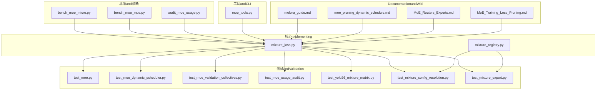
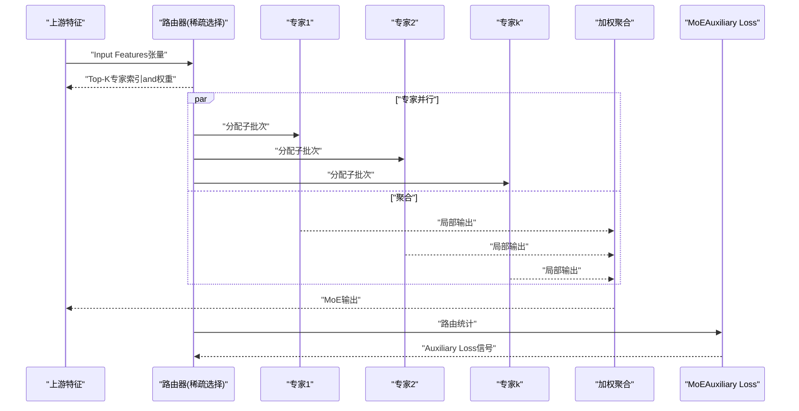
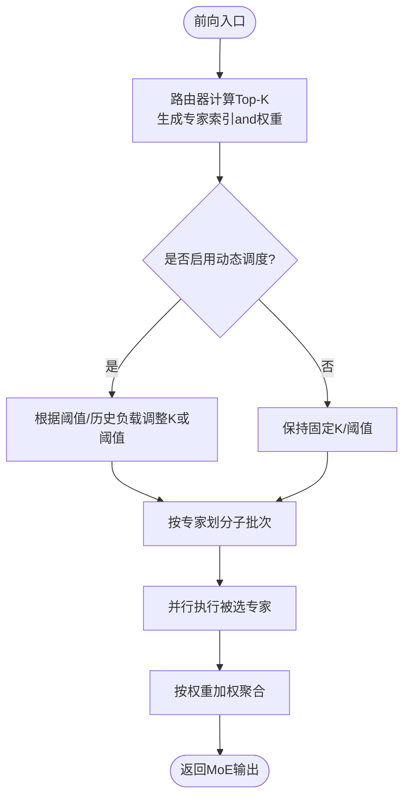
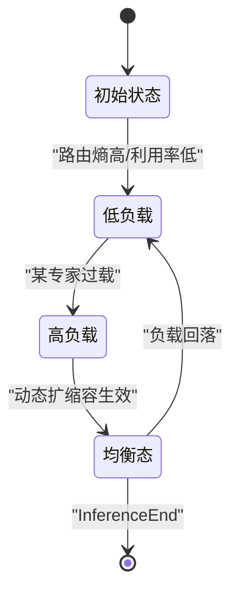
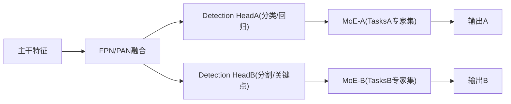
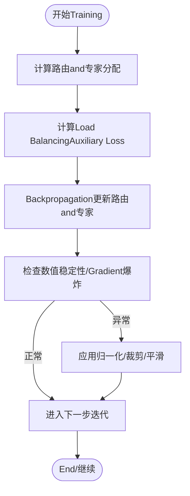
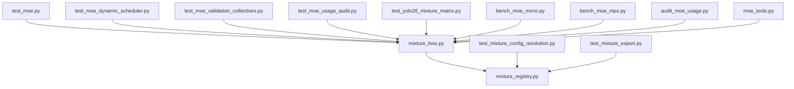

# MoE Architecture Design

<cite>
**Files Referenced in This Document**
- [mixture_loss.py](file://ultralytics/nn/mixture_loss.py)
- [mixture_registry.py](file://ultralytics/nn/mixture_registry.py)
- [test_moe.py](file://tests/test_moe.py)
- [test_moe_dynamic_scheduler.py](file://tests/test_moe_dynamic_scheduler.py)
- [test_moe_validation_collectives.py](file://tests/test_moe_validation_collectives.py)
- [test_moe_usage_audit.py](file://tests/test_moe_usage_audit.py)
- [bench_moe_micro.py](file://scripts/bench_moe_micro.py)
- [bench_moe_mps.py](file://scripts/bench_moe_mps.py)
- [audit_moe_usage.py](file://scripts/audit_moe_usage.py)
- [moe_tools.py](file://agent/runtime/cli/moe_tools.py)
- [yolo26_mixture_matrix.py](file://tests/test_yolo26_mixture_matrix.py)
- [test_mixture_config_resolution.py](file://tests/test_mixture_config_resolution.py)
- [test_mixture_export.py](file://tests/test_mixture_export.py)
- [molora_guide.md](file://docs/molora_guide.md)
- [moe_pruning_dynamic_schedule.md](file://docs/moe_pruning_dynamic_schedule.md)
- [MoE_Routers_Experts.md](file://wiki/MoE/MoE_Routers_Experts.md)
- [MoE_Training_Loss_Pruning.md](file://wiki/MoE/MoE_Training_Loss_Pruning.md)
</cite>

## Table of Contents
1. [引言](#引言)
2. [Project Structure](#Project Structure)
3. [Core Components](#Core Components)
4. [Architecture Overview](#Architecture Overview)
5. [Detailed Component Analysis](#Detailed Component Analysis)
6. [Dependency Analysis](#Dependency Analysis)
7. [性能and内存Optimization](#性能and内存Optimization)
8. [Troubleshooting Guide](#Troubleshooting Guide)
9. [Conclusion](#Conclusion)
10. [Appendix：配置参数and最佳实践](#Appendix配置参数and最佳实践)

## 引言
本文件targetingYOLO-Master的Mixture专家（Mixture of Experts, MoE）架构，系统性阐述其设计理念、implementing要点and工程化落地。内容覆盖：
- 专家并行、稀疏激活andLoad Balancing的核心思想
- 基础MoEModules的前向流程、路由选择and输出聚合
- 动态MoE的运行时专家选择and自适应路由
- whileYOLODetection Head中的集成方式（特征融合andTasks特定专家）
- Training稳定性and收敛性保障机制
- 性能Optimizationand内存管理策略
- and标准YOLO的对比分析andApplicable Scenarios建议

## Project Structure
仓库中andMoE相关的代码andDocumentation分布whileCentered on下位置：
- 核心implementingandRegistry：ultralytics/nn/mixture_loss.py、ultralytics/nn/mixture_registry.py
- 测试andValidation：tests/test_moe*.py、tests/test_yolo26_mixture_matrix.py、tests/test_mixture_*.py
- 基准and诊断脚本：scripts/bench_moe_micro.py、scripts/bench_moe_mps.py、scripts/audit_moe_usage.py
- 工具andCLI：agent/runtime/cli/moe_tools.py
- DocumentationandWiki：docs/molora_guide.md、docs/moe_pruning_dynamic_schedule.md、wiki/MoE/*.md

Figure Source
- [mixture_loss.py](file://ultralytics/nn/mixture_loss.py)
- [mixture_registry.py](file://ultralytics/nn/mixture_registry.py)
- [test_moe.py](file://tests/test_moe.py)
- [test_moe_dynamic_scheduler.py](file://tests/test_moe_dynamic_scheduler.py)
- [test_moe_validation_collectives.py](file://tests/test_moe_validation_collectives.py)
- [test_moe_usage_audit.py](file://tests/test_moe_usage_audit.py)
- [test_yolo26_mixture_matrix.py](file://tests/test_yolo26_mixture_matrix.py)
- [test_mixture_config_resolution.py](file://tests/test_mixture_config_resolution.py)
- [test_mixture_export.py](file://tests/test_mixture_export.py)
- [bench_moe_micro.py](file://scripts/bench_moe_micro.py)
- [bench_moe_mPS.py](file://scripts/bench_moe_mps.py)
- [audit_moe_usage.py](file://scripts/audit_moe_usage.py)
- [moe_tools.py](file://agent/runtime/cli/moe_tools.py)
- [molora_guide.md](file://docs/molora_guide.md)
- [moe_pruning_dynamic_schedule.md](file://docs/moe_pruning_dynamic_schedule.md)
- [MoE_Routers_Experts.md](file://wiki/MoE/MoE_Routers_Experts.md)
- [MoE_Training_Loss_Pruning.md](file://wiki/MoE/MoE_Training_Loss_Pruning.md)

Section Source
- [mixture_loss.py](file://ultralytics/nn/mixture_loss.py)
- [mixture_registry.py](file://ultralytics/nn/mixture_registry.py)
- [test_moe.py](file://tests/test_moe.py)
- [test_moe_dynamic_scheduler.py](file://tests/test_moe_dynamic_scheduler.py)
- [test_moe_validation_collectives.py](file://tests/test_moe_validation_collectives.py)
- [test_moe_usage_audit.py](file://tests/test_moe_usage_audit.py)
- [bench_moe_micro.py](file://scripts/bench_moe_micro.py)
- [bench_moe_mps.py](file://scripts/bench_moe_mps.py)
- [audit_moe_usage.py](file://scripts/audit_moe_usage.py)
- [moe_tools.py](file://agent/runtime/cli/moe_tools.py)
- [molora_guide.md](file://docs/molora_guide.md)
- [moe_pruning_dynamic_schedule.md](file://docs/moe_pruning_dynamic_schedule.md)
- [MoE_Routers_Experts.md](file://wiki/MoE/MoE_Routers_Experts.md)
- [MoE_Training_Loss_Pruning.md](file://wiki/MoE/MoE_Training_Loss_Pruning.md)

## Core Components
- 损失and辅助项
  - 组合式MoE损失and辅助项计算，用于控制路由分布and负载平衡。
  - Refer to路径：[mixture_loss.py](file://ultralytics/nn/mixture_loss.py)
- Registryand配置解析
  - providesMoE相关Modules、routing strategiesand专家配置的注册and解析capabilities。
  - Refer to路径：[mixture_registry.py](file://ultralytics/nn/mixture_registry.py)
- Test Suite
  - 覆盖MoE前向、动态调度、分布式校验、Uses审计、Exportand配置解析etc.关键路径。
  - Refer to路径：
    - [test_moe.py](file://tests/test_moe.py)
    - [test_moe_dynamic_scheduler.py](file://tests/test_moe_dynamic_scheduler.py)
    - [test_moe_validation_collectives.py](file://tests/test_moe_validation_collectives.py)
    - [test_moe_usage_audit.py](file://tests/test_moe_usage_audit.py)
    - [test_yolo26_mixture_matrix.py](file://tests/test_yolo26_mixture_matrix.py)
    - [test_mixture_config_resolution.py](file://tests/test_mixture_config_resolution.py)
    - [test_mixture_export.py](file://tests/test_mixture_export.py)
- 基准and诊断
  - 微基准and设备侧（such asMPS）性能Evaluation；Uses审计and路由解释工具链。
  - Refer to路径：
    - [bench_moe_micro.py](file://scripts/bench_moe_micro.py)
    - [bench_moe_mps.py](file://scripts/bench_moe_mps.py)
    - [audit_moe_usage.py](file://scripts/audit_moe_usage.py)
- CLIand工具
  - providesMoE运行期工具capabilities（such as路由统计、专家裁剪、动态调度开关etc.）。
  - Refer to路径：[moe_tools.py](file://agent/runtime/cli/moe_tools.py)
- DocumentationandWiki
  - 路由and专家说明、Training损失and剪枝策略、动态调度andMolora指南。
  - Refer to路径：
    - [MoE_Routers_Experts.md](file://wiki/MoE/MoE_Routers_Experts.md)
    - [MoE_Training_Loss_Pruning.md](file://wiki/MoE/MoE_Training_Loss_Pruning.md)
    - [molora_guide.md](file://docs/molora_guide.md)
    - [moe_pruning_dynamic_schedule.md](file://docs/moe_pruning_dynamic_schedule.md)

Section Source
- [mixture_loss.py](file://ultralytics/nn/mixture_loss.py)
- [mixture_registry.py](file://ultralytics/nn/mixture_registry.py)
- [test_moe.py](file://tests/test_moe.py)
- [test_moe_dynamic_scheduler.py](file://tests/test_moe_dynamic_scheduler.py)
- [test_moe_validation_collectives.py](file://tests/test_moe_validation_collectives.py)
- [test_moe_usage_audit.py](file://tests/test_moe_usage_audit.py)
- [test_yolo26_mixture_matrix.py](file://tests/test_yolo26_mixture_matrix.py)
- [test_mixture_config_resolution.py](file://tests/test_mixture_config_resolution.py)
- [test_mixture_export.py](file://tests/test_mixture_export.py)
- [bench_moe_micro.py](file://scripts/bench_moe_micro.py)
- [bench_moe_mps.py](file://scripts/bench_moe_mps.py)
- [audit_moe_usage.py](file://scripts/audit_moe_usage.py)
- [moe_tools.py](file://agent/runtime/cli/moe_tools.py)
- [MoE_Routers_Experts.md](file://wiki/MoE/MoE_Routers_Experts.md)
- [MoE_Training_Loss_Pruning.md](file://wiki/MoE/MoE_Training_Loss_Pruning.md)
- [molora_guide.md](file://docs/molora_guide.md)
- [moe_pruning_dynamic_schedule.md](file://docs/moe_pruning_dynamic_schedule.md)

## Architecture Overview
下图展示MoEwhileYOLO-Master中的整体定位and交互：Input Features进入MoE层，由路由器进行稀疏选择，多个专家并行处理，最终按权重聚合输出，并计算Auxiliary LossCentered on维持Load Balancing。

Figure Source
- [mixture_loss.py](file://ultralytics/nn/mixture_loss.py)
- [test_moe.py](file://tests/test_moe.py)
- [test_moe_dynamic_scheduler.py](file://tests/test_moe_dynamic_scheduler.py)
- [test_moe_validation_collectives.py](file://tests/test_moe_validation_collectives.py)
- [moe_tools.py](file://agent/runtime/cli/moe_tools.py)

## Detailed Component Analysis

### 基础MoEModules：前向传播、路由and聚合
- 前向流程
  - 接收上游特征，经路由器生成稀疏路由（Top-K），将样本分派to对应专家。
  - 各专家独立计算后，按路由权重对输出进行加权求和得to最终结果。
- 路由选择机制
  - SupportingTop-K稀疏激活，Kfor可配超参；路由权重通常来自门控网络或相似度打分。
  - 动态模式下，路由阈值andK可whileTraining/Inference阶段自适应调整。
- 输出聚合策略
  - 采用加权聚合，保证Gradient回传时各专家贡献可导且稳定。
- 关键implementingRefer to
  - 损失and辅助项：[mixture_loss.py](file://ultralytics/nn/mixture_loss.py)
  - 路由and注册：[mixture_registry.py](file://ultralytics/nn/mixture_registry.py)
  - 行forValidation用例：[test_moe.py](file://tests/test_moe.py)

Figure Source
- [test_moe.py](file://tests/test_moe.py)
- [test_moe_dynamic_scheduler.py](file://tests/test_moe_dynamic_scheduler.py)
- [moe_tools.py](file://agent/runtime/cli/moe_tools.py)

Section Source
- [mixture_loss.py](file://ultralytics/nn/mixture_loss.py)
- [mixture_registry.py](file://ultralytics/nn/mixture_registry.py)
- [test_moe.py](file://tests/test_moe.py)
- [test_moe_dynamic_scheduler.py](file://tests/test_moe_dynamic_scheduler.py)
- [moe_tools.py](file://agent/runtime/cli/moe_tools.py)

### 动态MoE：运行时专家选择and自适应路由
- 设计思想
  - whileTraining或Inference过程中依据当前样本难度、历史负载and路由置信度动态调整专家数量and阈值，提升吞吐and精度权衡。
- 自适应策略
  - 基于路由熵/Confidence Threshold触发扩容或收缩；Combining全局负载统计进行再平衡。
- Validationand工具
  - 动态调度测试：[test_moe_dynamic_scheduler.py](file://tests/test_moe_dynamic_scheduler.py)
  - Uses审计andVisualization：[audit_moe_usage.py](file://scripts/audit_moe_usage.py)、[moe_tools.py](file://agent/runtime/cli/moe_tools.py)
  - DocumentationRefer to：[moe_pruning_dynamic_schedule.md](file://docs/moe_pruning_dynamic_schedule.md)

Figure Source
- [test_moe_dynamic_scheduler.py](file://tests/test_moe_dynamic_scheduler.py)
- [moe_tools.py](file://agent/runtime/cli/moe_tools.py)
- [moe_pruning_dynamic_schedule.md](file://docs/moe_pruning_dynamic_schedule.md)

Section Source
- [test_moe_dynamic_scheduler.py](file://tests/test_moe_dynamic_scheduler.py)
- [audit_moe_usage.py](file://scripts/audit_moe_usage.py)
- [moe_tools.py](file://agent/runtime/cli/moe_tools.py)
- [moe_pruning_dynamic_schedule.md](file://docs/moe_pruning_dynamic_schedule.md)

### whileYOLODetection Head中的集成：特征融合andTasks特定专家
- 集成方式
  - 将MoE替换或嵌入至Detection Head的多尺度特征融合分支，使不同Tasks（分类、回归、分割etc.）拥有专属专家集合，增强Tasks特化capabilities。
- 矩阵and兼容性
  - YOLO26Mixture矩阵andTasks矩阵Validation用例：[test_yolo26_mixture_matrix.py](file://tests/test_yolo26_mixture_matrix.py)
- 路由and专家说明
  - WikiDocumentationprovides路由and专家设计的背景and约束：[MoE_Routers_Experts.md](file://wiki/MoE/MoE_Routers_Experts.md)

Figure Source
- [test_yolo26_mixture_matrix.py](file://tests/test_yolo26_mixture_matrix.py)
- [MoE_Routers_Experts.md](file://wiki/MoE/MoE_Routers_Experts.md)

Section Source
- [test_yolo26_mixture_matrix.py](file://tests/test_yolo26_mixture_matrix.py)
- [MoE_Routers_Experts.md](file://wiki/MoE/MoE_Routers_Experts.md)

### Training稳定性and收敛性保障
- Auxiliary LossandLoad Balancing
  - ViaAuxiliary Loss惩罚路由集中度过高的情况，促使专家间更均匀地参and计算。
  - Refer to：[mixture_loss.py](file://ultralytics/nn/mixture_loss.py)、[MoE_Training_Loss_Pruning.md](file://wiki/MoE/MoE_Training_Loss_Pruning.md)
- 分布式一致性校验
  - while多卡环境下确保路由统计and聚合的一致性，避免数据并行导致的偏差。
  - Refer to：[test_moe_validation_collectives.py](file://tests/test_moe_validation_collectives.py)
- 数值稳定性
  - 路由权重归一化、指数平滑and防NaN保护etc.技巧while测试中覆盖。
  - Refer to：[test_moe.py](file://tests/test_moe.py)

Figure Source
- [mixture_loss.py](file://ultralytics/nn/mixture_loss.py)
- [test_moe_validation_collectives.py](file://tests/test_moe_validation_collectives.py)
- [MoE_Training_Loss_Pruning.md](file://wiki/MoE/MoE_Training_Loss_Pruning.md)

Section Source
- [mixture_loss.py](file://ultralytics/nn/mixture_loss.py)
- [test_moe_validation_collectives.py](file://tests/test_moe_validation_collectives.py)
- [test_moe.py](file://tests/test_moe.py)
- [MoE_Training_Loss_Pruning.md](file://wiki/MoE/MoE_Training_Loss_Pruning.md)

### 配置参数and解析
- 关键参数
  - 专家数量、Top-K、routing strategies（such assoftmax温度、阈值）、Load Balancing系数、动态调度开关and阈值。
- 配置解析andExport
  - 配置解析andExport兼容性的测试用例：
    - [test_mixture_config_resolution.py](file://tests/test_mixture_config_resolution.py)
    - [test_mixture_export.py](file://tests/test_mixture_export.py)
- Registry
  - 路由and专家的注册and查找逻辑位于Registry中。
  - Refer to：[mixture_registry.py](file://ultralytics/nn/mixture_registry.py)

Section Source
- [test_mixture_config_resolution.py](file://tests/test_mixture_config_resolution.py)
- [test_mixture_export.py](file://tests/test_mixture_export.py)
- [mixture_registry.py](file://ultralytics/nn/mixture_registry.py)

## Dependency Analysis
- Modules耦合
  - mixture_loss.pyandmixture_registry.pyfor核心依赖，其他测试and脚本围绕二者unfold。
- External Dependencies
  - 分布式通信and设备后端（such asCUDA/MPS）while基准and测试中被覆盖。
- Potential Cycles依赖
  - ViaRegistry解耦路由and专家的具体implementing，降低直接耦合风险。

Figure Source
- [mixture_loss.py](file://ultralytics/nn/mixture_loss.py)
- [mixture_registry.py](file://ultralytics/nn/mixture_registry.py)
- [test_moe.py](file://tests/test_moe.py)
- [test_moe_dynamic_scheduler.py](file://tests/test_moe_dynamic_scheduler.py)
- [test_moe_validation_collectives.py](file://tests/test_moe_validation_collectives.py)
- [test_moe_usage_audit.py](file://tests/test_moe_usage_audit.py)
- [test_yolo26_mixture_matrix.py](file://tests/test_yolo26_mixture_matrix.py)
- [test_mixture_config_resolution.py](file://tests/test_mixture_config_resolution.py)
- [test_mixture_export.py](file://tests/test_mixture_export.py)
- [bench_moe_micro.py](file://scripts/bench_moe_micro.py)
- [bench_moe_mps.py](file://scripts/bench_moe_mps.py)
- [audit_moe_usage.py](file://scripts/audit_moe_usage.py)
- [moe_tools.py](file://agent/runtime/cli/moe_tools.py)

Section Source
- [mixture_loss.py](file://ultralytics/nn/mixture_loss.py)
- [mixture_registry.py](file://ultralytics/nn/mixture_registry.py)
- [test_moe.py](file://tests/test_moe.py)
- [test_moe_dynamic_scheduler.py](file://tests/test_moe_dynamic_scheduler.py)
- [test_moe_validation_collectives.py](file://tests/test_moe_validation_collectives.py)
- [test_moe_usage_audit.py](file://tests/test_moe_usage_audit.py)
- [test_yolo26_mixture_matrix.py](file://tests/test_yolo26_mixture_matrix.py)
- [test_mixture_config_resolution.py](file://tests/test_mixture_config_resolution.py)
- [test_mixture_export.py](file://tests/test_mixture_export.py)
- [bench_moe_micro.py](file://scripts/bench_moe_micro.py)
- [bench_moe_mps.py](file://scripts/bench_moe_mps.py)
- [audit_moe_usage.py](file://scripts/audit_moe_usage.py)
- [moe_tools.py](file://agent/runtime/cli/moe_tools.py)

## 性能and内存Optimization
- 稀疏激活and批内并行
  - 仅激活Top-K专家，减少计算量；利用GPU并行执行被选专家。
- 路由开销控制
  - 路由计算应轻量，必要时缓存历史路由统计Centered on降低重复计算。
- 内存复用and零拷贝
  - 尽量复用中间张量，避免不必要的复制；while专家间共享只读权重。
- 设备侧Optimization
  - 针对MPS/CUDAdevices进行算子级Optimizationand内核融合；Refer to基准脚本。
- 动态调度收益
  - whileInference阶段按需扩缩专家，兼顾延迟and吞吐。

Section Source
- [bench_moe_micro.py](file://scripts/bench_moe_micro.py)
- [bench_moe_mps.py](file://scripts/bench_moe_mps.py)
- [moe_tools.py](file://agent/runtime/cli/moe_tools.py)
- [molora_guide.md](file://docs/molora_guide.md)

## Troubleshooting Guide
- 路由不稳定或NaN
  - 检查路由权重归一化and温度参数；查看Auxiliary Loss是否过大导致Gradient异常。
  - Refer to：[test_moe.py](file://tests/test_moe.py)、[mixture_loss.py](file://ultralytics/nn/mixture_loss.py)
- Load Balancing失效
  - 观察专家Uses率分布，适当增大Load Balancing系数或引入动态调度。
  - Refer to：[audit_moe_usage.py](file://scripts/audit_moe_usage.py)、[moe_tools.py](file://agent/runtime/cli/moe_tools.py)
- 分布式不一致
  - 确认collective操作顺序and同步点；Refer to一致性校验用例。
  - Refer to：[test_moe_validation_collectives.py](file://tests/test_moe_validation_collectives.py)
- 配置漂移或Export Failure
  - 核对配置解析andExport兼容性；Refer to配置andExport测试。
  - Refer to：[test_mixture_config_resolution.py](file://tests/test_mixture_config_resolution.py)、[test_mixture_export.py](file://tests/test_mixture_export.py)

Section Source
- [test_moe.py](file://tests/test_moe.py)
- [mixture_loss.py](file://ultralytics/nn/mixture_loss.py)
- [audit_moe_usage.py](file://scripts/audit_moe_usage.py)
- [moe_tools.py](file://agent/runtime/cli/moe_tools.py)
- [test_moe_validation_collectives.py](file://tests/test_moe_validation_collectives.py)
- [test_mixture_config_resolution.py](file://tests/test_mixture_config_resolution.py)
- [test_mixture_export.py](file://tests/test_mixture_export.py)

## Conclusion
YOLO-Master的MoE架构Via稀疏激活andLoad BalancingAuxiliary Loss，While maintaining高效显著增强了模型容量andTasks特化capabilities。动态调度进一步提升了部署灵活性。Combined with完善的测试、基准and工具链，MoEwhile复杂视觉Tasks中具有良好Extensibilityand工程可用性。

## Appendix：配置参数and最佳实践
- 推荐参数范围
  - 专家数量：根据Tasks复杂度and显存预算设定；小Tasks可少而精，大Tasks可多而专。
  - Top-K：1~3常见，兼顾稀疏性and表达capabilities。
  - 路由温度：较低温度更尖锐，较高温度更平滑，需andAuxiliary Loss系数协同调优。
  - Load Balancing系数：过小易导致“赢家通吃”，过大可能抑制学习。
  - 动态调度阈值：依据路由熵and历史负载设置，避免频繁抖动。
- 最佳实践
  - 先固定Kandrouting strategies，逐步引入动态调度；监控专家Uses率andAuxiliary Loss曲线。
  - whileDetection Head中for不同Tasks配置专属专家集，提高Tasks分离度。
  - Uses基准脚本while不同设备上Validation延迟and吞吐，CombiningExport流程确保部署一致。

Section Source
- [molora_guide.md](file://docs/molora_guide.md)
- [moe_pruning_dynamic_schedule.md](file://docs/moe_pruning_dynamic_schedule.md)
- [test_mixture_config_resolution.py](file://tests/test_mixture_config_resolution.py)
- [test_mixture_export.py](file://tests/test_mixture_export.py)
- [bench_moe_micro.py](file://scripts/bench_moe_micro.py)
- [bench_moe_mps.py](file://scripts/bench_moe_mps.py)