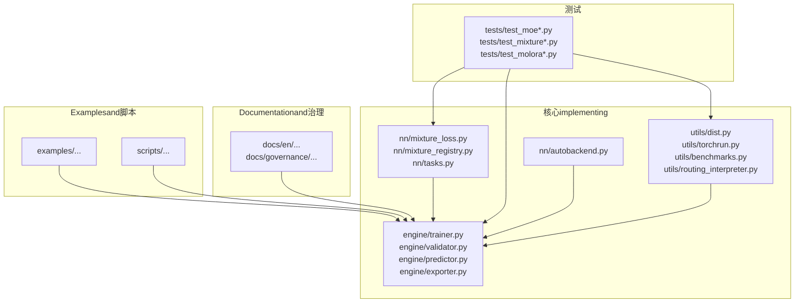
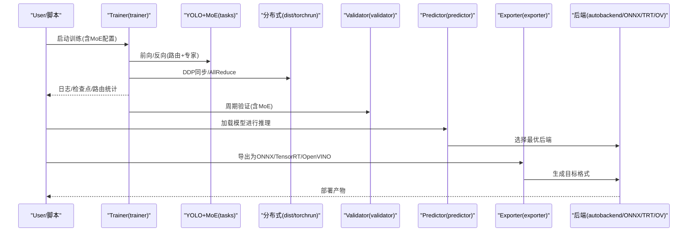
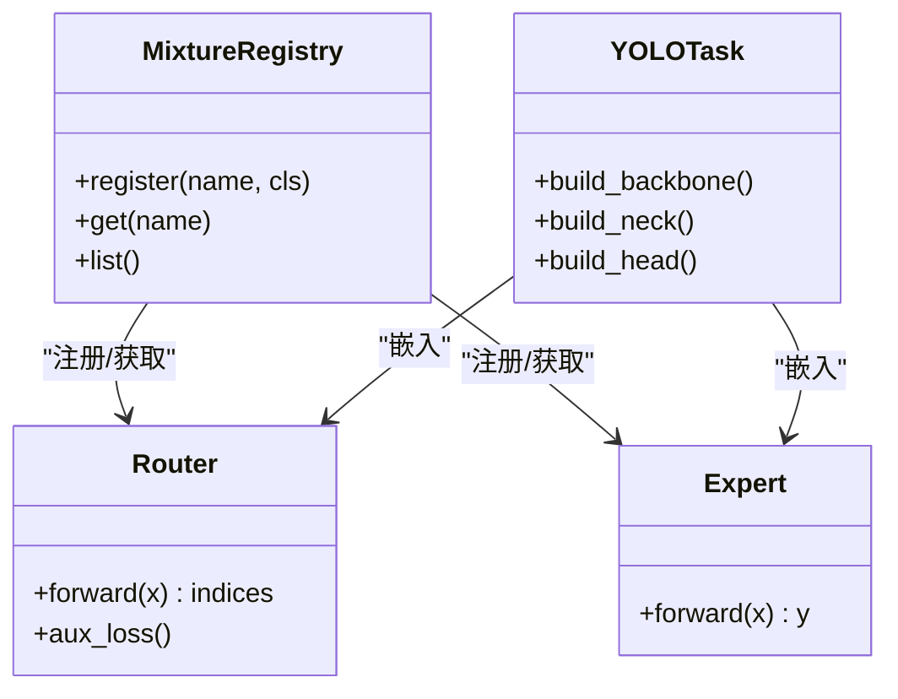
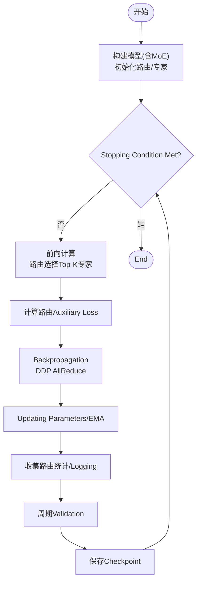
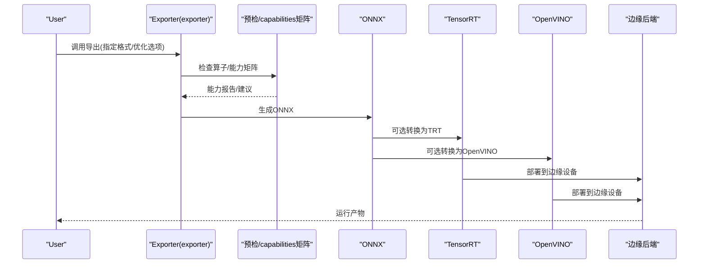
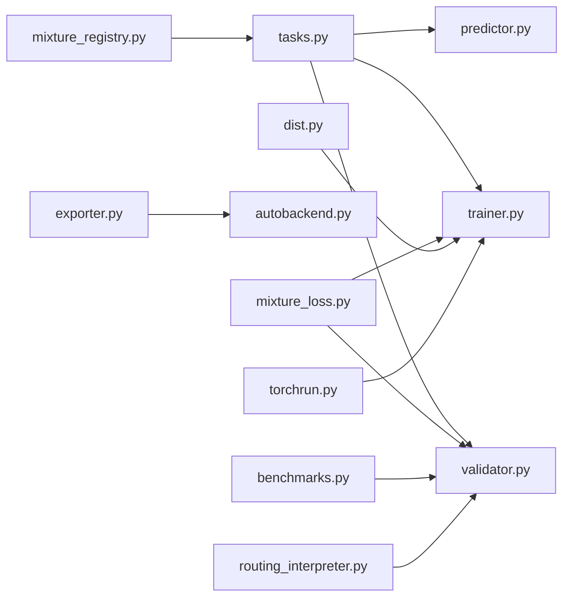

# MoE集成and部署

<cite>
**Files Referenced in This Document**
- [mixture_loss.py](file://ultralytics/nn/mixture_loss.py)
- [mixture_registry.py](file://ultralytics/nn/mixture_registry.py)
- [autobackend.py](file://ultralytics/nn/autobackend.py)
- [exporter.py](file://ultralytics/engine/exporter.py)
- [trainer.py](file://ultralytics/engine/trainer.py)
- [validator.py](file://ultralytics/engine/validator.py)
- [predictor.py](file://ultralytics/engine/predictor.py)
- [tasks.py](file://ultralytics/nn/tasks.py)
- [dist.py](file://ultralytics/utils/dist.py)
- [torchrun.py](file://ultralytics/utils/torchrun.py)
- [benchmarks.py](file://ultralytics/utils/benchmarks.py)
- [routing_interpreter.py](file://ultralytics/utils/routing_interpreter.py)
- [test_moe.py](file://tests/test_moe.py)
- [test_moe_ddp_fixes.py](file://tests/test_moe_ddp_fixes.py)
- [test_moe_dynamic_schedule.py](file://tests/test_moe_dynamic_schedule.py)
- [test_molora.py](file://tests/test_molora.py)
- [test_molora_sparse_dispatch.py](file://tests/test_molora_sparse_dispatch.py)
- [test_molora_routing_aware_merge.py](file://tests/test_molora_routing_aware_merge.py)
- [test_export_capability_matrix.py](file://tests/test_export_capability_matrix.py)
- [test_onnx_export_fix.py](file://tests/test_onnx_export_fix.py)
- [test_mixture_export.py](file://tests/test_mixture_export.py)
- [test_mixture_config_resolution.py](file://tests/test_mixture_config_resolution.py)
- [test_mixture_numeric.py](file://tests/test_mixture_numeric.py)
- [test_mixture_aux_loss.py](file://tests/test_mixture_aux_loss.py)
- [test_mixture_compile.py](file://tests/test_mixture_compile.py)
- [test_mixture_model_registry.py](file://tests/test_mixture_model_registry.py)
- [test_mixture_config_registry.py](file://tests/test_mixture_config_registry.py)
- [test_mixture_loss_composition.py](file://tests/test_mixture_loss_composition.py)
- [test_mixture_fixes.py](file://tests/test_mixture_fixes.py)
- [test_moe_usage_audit.py](file://tests/test_moe_usage_audit.py)
- [test_moe_validation_collectives.py](file://tests/test_moe_validation_collectives.py)
- [test_moe_variant_contract.py](file://tests/test_moe_variant_contract.py)
- [test_moe_router_boundaries.py](file://tests/test_moe_router_boundaries.py)
- [test_moe_ssot.py](file://tests/test_moe_ssot.py)
- [test_moe_amp_index_add.py](file://tests/test_moe_amp_index_add.py)
- [test_moe_aware_peft.py](file://tests/test_moe_aware_peft.py)
- [test_molora_dtype.py](file://tests/test_molora_dtype.py)
- [test_molora_merge_semantics.py](file://tests/test_molora_merge_semantics.py)
- [test_molora_supplementary.py](file://tests/test_molora_supplementary.py)
- [test_yolo26_mixture_matrix.py](file://tests/test_yolo26_mixture_matrix.py)
- [test_yolo26_task_matrix.py](file://tests/test_yolo26_task_matrix.py)
- [yolo26.md](file://docs/en/models/yolo26.md)
- [yolo26-mixture-compatibility.md](file://docs/en/guides/yolo26-mixture-compatibility.md)
- [model-deployment-options.md](file://docs/en/guides/model-deployment-options.md)
- [model-deployment-practices.md](file://docs/en/guides/model-deployment-practices.md)
- [model-monitoring-and-maintenance.md](file://docs/en/guides/model-monitoring-and-maintenance.md)
- [yolo-performance-metrics.md](file://docs/en/guides/yolo-performance-metrics.md)
- [yolo-common-issues.md](file://docs/en/guides/yolo-common-issues.md)
- [onnx.md](file://docs/en/integrations/onnx.md)
- [tensorrt.md](file://docs/en/integrations/tensorrt.md)
- [openvino.md](file://docs/en/integrations/openvino.md)
- [edge-tpu.md](file://docs/en/integrations/edge-tpu.md)
- [nvidia-jetson.md](file://docs/en/guides/nvidia-jetson.md)
- [deepstream-nvidia-jetson.md](file://docs/en/guides/deepstream-nvidia-jetson.md)
- [triton-inference-server.md](file://docs/en/guides/triton-inference-server.md)
- [benchmark.md](file://docs/en/modes/benchmark.md)
- [export.md](file://docs/en/modes/export.md)
- [train.md](file://docs/en/modes/train.md)
- [val.md](file://docs/en/modes/val.md)
- [predict.md](file://docs/en/modes/predict.md)
- [molora_guide.md](file://docs/molora_guide.md)
- [moe_pruning_dynamic_schedule.md](file://docs/moe_pruning_dynamic_schedule.md)
- [governance/moe-class-lifecycle.md](file://docs/governance/moe-class-lifecycle.md)
- [governance/performance-gates.md](file://docs/governance/performance-gates.md)
- [governance/routing-interpretability.md](file://docs/governance/routing-interpretability.md)
- [governance/config-drift-detection.md](file://docs/governance/config-drift-detection.md)
- [governance/export-capability-matrix.yaml](file://docs/governance/export-capability-matrix.yaml)
- [governance/mixture-preservation-manifest.yaml](file://docs/governance/mixture-preservation-manifest.yaml)
- [scripts/bench_moe_micro.py](file://scripts/bench_moe_micro.py)
- [scripts/bench_moe_mps.py](file://scripts/bench_moe_mps.py)
- [scripts/audit_moe_usage.py](file://scripts/audit_moe_usage.py)
- [scripts/run_moe_dynamic_schedule_ablation.py](file://scripts/run_moe_dynamic_schedule_ablation.py)
- [scripts/eval_moe_peft.py](file://scripts/eval_moe_peft.py)
- [scripts/compare_moe_coco128.py](file://scripts/compare_moe_coco128.py)
- [scripts/compare_moe_v0_12_voc.py](file://scripts/compare_moe_v0_12_voc.py)
- [scripts/compare_moe_v0_13_15_voc.py](file://scripts/compare_moe_v0_13_15_voc.py)
- [scripts/moe_pruning_sweep.py](file://scripts/moe_pruning_sweep.py)
- [scripts/validate_routed_export.py](file://scripts/validate_routed_export.py)
- [examples/YOLO-Master-EsMoE-VisDrone-Edge/README.md](file://examples/YOLO-Master-EsMoE-VisDrone-Edge/README.md)
- [examples/YOLO-Master-Edge-Deployment/README.md](file://examples/YOLO-Master-Edge-Deployment/README.md)
- [examples/YOLO-Master-Cross-Platform-Edge-Deployment/README.md](file://examples/YOLO-Master-Cross-Platform-Edge-Deployment/README.md)
</cite>

## Table of Contents
1. [Introduction](#Introduction)
2. [Project Structure](#Project Structure)
3. [Core Components](#Core Components)
4. [Architecture Overview](#Architecture Overview)
5. [Detailed Component Analysis](#Detailed Component Analysis)
6. [Dependency Analysis](#Dependency Analysis)
7. [性能考量](#性能考量)
8. [Troubleshooting Guide](#Troubleshooting Guide)
9. [Conclusion](#Conclusion)
10. [Appendix](#Appendix)

## Introduction
本技术Documentation聚焦于YOLO-Master的Mixture-of-Experts（MoE）集成and部署，覆盖Centered on下关键主题：
- MoEwhileYOLO骨干、颈部andDetection Head的嵌入方式and契约
- Training流程and配置，包括Distributed Trainingand数据并行策略
- Model ExportandOptimization：ONNX、TensorRTandEdge Device Deployment
- 服务化部署：Batch Inference、流式处理and资源管理
- 监控and维护：性能监控、异常检测and自动扩缩容
- 基准测试andEvaluation方法
- 最佳实践and常见问题解决方案
- Migrationand升级指南
- and现有YOLO生态系统的兼容性and互操作性

## Project Structure
仓库围绕“核心implementing + 工具脚本 + Documentation + Examples + 测试”组织。andMoE相关的核心代码集中whilenn层（MixtureModules、路由、损失）、engine层（Training/Validation/Prediction/Export）、utils层（分布式、基准、路由Explainer），Centered onand大量针对MoE的测试and治理Documentation。

Figure Source
- [mixture_loss.py](file://ultralytics/nn/mixture_loss.py)
- [mixture_registry.py](file://ultralytics/nn/mixture_registry.py)
- [tasks.py](file://ultralytics/nn/tasks.py)
- [trainer.py](file://ultralytics/engine/trainer.py)
- [validator.py](file://ultralytics/engine/validator.py)
- [predictor.py](file://ultralytics/engine/predictor.py)
- [exporter.py](file://ultralytics/engine/exporter.py)
- [autobackend.py](file://ultralytics/nn/autobackend.py)
- [dist.py](file://ultralytics/utils/dist.py)
- [torchrun.py](file://ultralytics/utils/torchrun.py)
- [benchmarks.py](file://ultralytics/utils/benchmarks.py)
- [routing_interpreter.py](file://ultralytics/utils/routing_interpreter.py)

Section Source
- [mixture_loss.py](file://ultralytics/nn/mixture_loss.py)
- [mixture_registry.py](file://ultralytics/nn/mixture_registry.py)
- [tasks.py](file://ultralytics/nn/tasks.py)
- [trainer.py](file://ultralytics/engine/trainer.py)
- [validator.py](file://ultralytics/engine/validator.py)
- [predictor.py](file://ultralytics/engine/predictor.py)
- [exporter.py](file://ultralytics/engine/exporter.py)
- [autobackend.py](file://ultralytics/nn/autobackend.py)
- [dist.py](file://ultralytics/utils/dist.py)
- [torchrun.py](file://ultralytics/utils/torchrun.py)
- [benchmarks.py](file://ultralytics/utils/benchmarks.py)
- [routing_interpreter.py](file://ultralytics/utils/routing_interpreter.py)

## Core Components
- MixtureModulesRegistryand契约：provides统一的Expert Networkand路由器接口，Supporting动态调度、稀疏激活and可插拔专家。
- 路由andAuxiliary Loss：包含Load Balancing、门控权重统计and路由可解释性Metrics，确保多专家均衡Uses。
- Tasks装配：将MoEModules注入toYOLO主干、颈部或Detection Head位置，保持原有Tasks接口不变。
- Training/Validation/Prediction引擎：对MoE进行端to端Supporting，包括DDP通信、EMA、AMPand路由统计收集。
- Exportand后端：统一Export入口，适配ONNX/TensorRT/OpenVINOetc.后端，并保证路由逻辑whileExport后正确执行。
- 分布式and基准：基于torchrunand自定义分布式工具，provides微基准andMPS/CPU/GPU跨平台基准。

Section Source
- [mixture_registry.py](file://ultralytics/nn/mixture_registry.py)
- [mixture_loss.py](file://ultralytics/nn/mixture_loss.py)
- [tasks.py](file://ultralytics/nn/tasks.py)
- [trainer.py](file://ultralytics/engine/trainer.py)
- [validator.py](file://ultralytics/engine/validator.py)
- [predictor.py](file://ultralytics/engine/predictor.py)
- [exporter.py](file://ultralytics/engine/exporter.py)
- [autobackend.py](file://ultralytics/nn/autobackend.py)
- [dist.py](file://ultralytics/utils/dist.py)
- [torchrun.py](file://ultralytics/utils/torchrun.py)
- [benchmarks.py](file://ultralytics/utils/benchmarks.py)

## Architecture Overview
下图展示从TrainingtoInference/Export的完整链路，标注了MoEwhile各阶段的参and点。

Figure Source
- [trainer.py](file://ultralytics/engine/trainer.py)
- [tasks.py](file://ultralytics/nn/tasks.py)
- [dist.py](file://ultralytics/utils/dist.py)
- [torchrun.py](file://ultralytics/utils/torchrun.py)
- [validator.py](file://ultralytics/engine/validator.py)
- [predictor.py](file://ultralytics/engine/predictor.py)
- [exporter.py](file://ultralytics/engine/exporter.py)
- [autobackend.py](file://ultralytics/nn/autobackend.py)

## Detailed Component Analysis

### 组件A：MoEModulesand路由（骨干/颈部/Detection Head嵌入）
- 嵌入位置：ViaTasks装配将MoE插入to主干Feature Extraction、颈部融合或Detection Head分支中，保持输入输出张量形状andTasks语义一致。
- Routing Mechanism：每层OptionalTop-K专家激活，CombiningLoad BalancingAuxiliary Loss，避免专家倾斜。
- 契约and注册：ViaRegistry统一管理专家类型、routing strategiesand参数，便于扩展新专家and路由算法。
- 兼容性：while不改变上层接口的前提下，Centered on“透明替换”的方式接入YOLO各阶段。

Figure Source
- [mixture_registry.py](file://ultralytics/nn/mixture_registry.py)
- [tasks.py](file://ultralytics/nn/tasks.py)

Section Source
- [mixture_registry.py](file://ultralytics/nn/mixture_registry.py)
- [tasks.py](file://ultralytics/nn/tasks.py)

### 组件B：Training流程and分布式策略
- Training主循环：构建模型andData Pipeline，执行前向/反向，累积路由统计andAuxiliary Loss，周期性保存Checkpoint。
- Distributed Training：基于torchrunand自定义分布式工具，SupportingDDP；对MoE的路由统计andGradient进行AllReduce聚合。
- AMPandEMA：启用Mixture精度加速Training，指数移动平均提升稳定性。
- Validationand早停：按间隔执行Validation，记录mAP、F1、延迟etc.Metrics，Combining路由健康度进行决策。

Figure Source
- [trainer.py](file://ultralytics/engine/trainer.py)
- [dist.py](file://ultralytics/utils/dist.py)
- [torchrun.py](file://ultralytics/utils/torchrun.py)
- [mixture_loss.py](file://ultralytics/nn/mixture_loss.py)

Section Source
- [trainer.py](file://ultralytics/engine/trainer.py)
- [dist.py](file://ultralytics/utils/dist.py)
- [torchrun.py](file://ultralytics/utils/torchrun.py)
- [mixture_loss.py](file://ultralytics/nn/mixture_loss.py)

### 组件C：ExportandOptimization（ONNX/TensorRT/OpenVINO/边缘）
- Export入口：统一ExportAPI，Supporting动态轴、算子capabilities矩阵and预检。
- 路由固化：whileExport时Optional择将路由逻辑固化for静态图，或while运行时保留Dynamic Routing。
- 后端Optimization：根据目标平台选择ONNX Runtime、TensorRT、OpenVINOetc.后端，并进行量化and内核融合。
- Edge Deployment：targetingJetson、EdgeTPUetc.平台provides专用脚本and说明。

Figure Source
- [exporter.py](file://ultralytics/engine/exporter.py)
- [autobackend.py](file://ultralytics/nn/autobackend.py)
- [test_export_capability_matrix.py](file://tests/test_export_capability_matrix.py)
- [test_onnx_export_fix.py](file://tests/test_onnx_export_fix.py)
- [test_mixture_export.py](file://tests/test_mixture_export.py)

Section Source
- [exporter.py](file://ultralytics/engine/exporter.py)
- [autobackend.py](file://ultralytics/nn/autobackend.py)
- [test_export_capability_matrix.py](file://tests/test_export_capability_matrix.py)
- [test_onnx_export_fix.py](file://tests/test_onnx_export_fix.py)
- [test_mixture_export.py](file://tests/test_mixture_export.py)

### 组件D：服务化部署（批量/流式/资源管理）
- Batch Inference：ViaPredictor批处理输入，Combining后端Optimization提升吞吐。
- 流式处理：Combining视频流and切片Inference，降低延迟。
- 资源管理：依据设备capabilitiesand负载动态调整批大小、并发数and内存占用。
- 服务端集成：providesandTritonetc.Inference服务器的对接指南。

Section Source
- [predictor.py](file://ultralytics/engine/predictor.py)
- [autobackend.py](file://ultralytics/nn/autobackend.py)
- [triton-inference-server.md](file://docs/en/guides/triton-inference-server.md)
- [model-deployment-options.md](file://docs/en/guides/model-deployment-options.md)
- [model-deployment-practices.md](file://docs/en/guides/model-deployment-practices.md)

### 组件E：监控and维护（性能/异常/扩缩容）
- 性能监控：采集延迟、吞吐、GPU利用率、路由专家Uses分布etc.Metrics。
- 异常检测：检测NaN/Inf、路由崩溃、专家过载etc.异常模式。
- 自动扩缩容：基于Metrics阈值触发实例增减，保障SLA。
- 路由可解释性：利用路由Explainer分析专家选择路径and场景相关性。

Section Source
- [routing_interpreter.py](file://ultralytics/utils/routing_interpreter.py)
- [benchmarks.py](file://ultralytics/utils/benchmarks.py)
- [model-monitoring-and-maintenance.md](file://docs/en/guides/model-monitoring-and-maintenance.md)
- [governance/routing-interpretability.md](file://docs/governance/routing-interpretability.md)

### 组件F：基准测试andEvaluation
- Benchmark Suite：provides端to端基准and微基准，覆盖不同硬件and后端。
- EvaluationMetrics：mAP、F1、延迟、吞吐、显存占用、路由健康度。
- 对比实验：and基线或非MoE版本进行对比，Validation收益and代价。

Section Source
- [benchmarks.py](file://ultralytics/utils/benchmarks.py)
- [benchmark.md](file://docs/en/modes/benchmark.md)
- [yolo-performance-metrics.md](file://docs/en/guides/yolo-performance-metrics.md)
- [scripts/bench_moe_micro.py](file://scripts/bench_moe_micro.py)
- [scripts/bench_moe_mps.py](file://scripts/bench_moe_mPS.py)

### 组件G：PEFTandMoE协同（LoRA/MoLaRa）
- PEFT感知：whileMoE上下文中应用LoRAetc.Parameter-Efficient Fine-Tuning，避免破坏路由and专家结构。
- MoLaRa：路由感知的合并策略，兼顾性能and效率。
- Evaluationand消融：provides脚本and测试Validation不同策略的效果。

Section Source
- [test_moe_aware_peft.py](file://tests/test_moe_aware_peft.py)
- [test_molora.py](file://tests/test_molora.py)
- [test_molora_sparse_dispatch.py](file://tests/test_molora_sparse_dispatch.py)
- [test_molora_routing_aware_merge.py](file://tests/test_molora_routing_aware_merge.py)
- [test_molora_dtype.py](file://tests/test_molora_dtype.py)
- [test_molora_merge_semantics.py](file://tests/test_molora_merge_semantics.py)
- [test_molora_supplementary.py](file://tests/test_molora_supplementary.py)
- [molora_guide.md](file://docs/molora_guide.md)

## Dependency Analysis
- 内部耦合：
  - tasks负责装配MoEtoYOLO各阶段，trainer/validator/predictor依赖其接口。
  - mixture_registryandmixture_lossforMoE核心，被tasksandTraining/Validation流程广泛Uses。
  - exporterandautobackend共同决定Exportand运行时后端行for。
- External Dependencies：
  - torchrunanddist用于Distributed Training。
  - ONNX/TensorRT/OpenVINOetc.后端用于Exportand部署。
  - 基准and路由Explainer用于分析and诊断。

Figure Source
- [tasks.py](file://ultralytics/nn/tasks.py)
- [trainer.py](file://ultralytics/engine/trainer.py)
- [validator.py](file://ultralytics/engine/validator.py)
- [predictor.py](file://ultralytics/engine/predictor.py)
- [mixture_registry.py](file://ultralytics/nn/mixture_registry.py)
- [mixture_loss.py](file://ultralytics/nn/mixture_loss.py)
- [exporter.py](file://ultralytics/engine/exporter.py)
- [autobackend.py](file://ultralytics/nn/autobackend.py)
- [dist.py](file://ultralytics/utils/dist.py)
- [torchrun.py](file://ultralytics/utils/torchrun.py)
- [benchmarks.py](file://ultralytics/utils/benchmarks.py)
- [routing_interpreter.py](file://ultralytics/utils/routing_interpreter.py)

Section Source
- [tasks.py](file://ultralytics/nn/tasks.py)
- [trainer.py](file://ultralytics/engine/trainer.py)
- [validator.py](file://ultralytics/engine/validator.py)
- [predictor.py](file://ultralytics/engine/predictor.py)
- [mixture_registry.py](file://ultralytics/nn/mixture_registry.py)
- [mixture_loss.py](file://ultralytics/nn/mixture_loss.py)
- [exporter.py](file://ultralytics/engine/exporter.py)
- [autobackend.py](file://ultralytics/nn/autobackend.py)
- [dist.py](file://ultralytics/utils/dist.py)
- [torchrun.py](file://ultralytics/utils/torchrun.py)
- [benchmarks.py](file://ultralytics/utils/benchmarks.py)
- [routing_interpreter.py](file://ultralytics/utils/routing_interpreter.py)

## 性能考量
- 路由开销：Top-K选择and专家激活带来额外计算，需权衡K值and专家规模。
- Load Balancing：Auxiliary Lossand路由统计有助于避免专家倾斜，但会引入通信and统计成本。
- ExportOptimization：whileONNX/TensorRT/OpenVINO中进行算子融合and量化，显著降低延迟。
- 批大小and并发：while服务端根据设备capabilities调优批大小and线程/进程数。
- 硬件差异：CPU/GPU/NPU/Jetsonetc.不同平台的算子Supportingand内存带宽差异较大，需针对性Optimization。

[This section provides general guidance and does not directly analyze specific files]

## Troubleshooting Guide
- Training不稳定：检查路由Auxiliary Loss权重、Learning RateandAMP设置；关注路由统计and专家Uses分布。
- Export Failure：核对算子capabilities矩阵and预检报告，必要时降级或替换不Supporting的算子。
- Inference错误：确认后端选择andModel Format匹配，检查动态轴and输入形状。
- 分布式问题：ValidationDDP初始化、环境变量and节点通信；定位AllReduce异常。
- 路由异常：Uses路由Explainer分析专家选择路径，识别热点and冷专家。

Section Source
- [test_moe_ddp_fixes.py](file://tests/test_moe_ddp_fixes.py)
- [test_moe_dynamic_schedule.py](file://tests/test_moe_dynamic_schedule.py)
- [test_moe_router_boundaries.py](file://tests/test_moe_router_boundaries.py)
- [test_moe_ssot.py](file://tests/test_moe_ssot.py)
- [test_moe_amp_index_add.py](file://tests/test_moe_amp_index_add.py)
- [test_moe_validation_collectives.py](file://tests/test_moe_validation_collectives.py)
- [test_moe_variant_contract.py](file://tests/test_moe_variant_contract.py)
- [test_moe_usage_audit.py](file://tests/test_moe_usage_audit.py)
- [test_mixture_aux_loss.py](file://tests/test_mixture_aux_loss.py)
- [test_mixture_numeric.py](file://tests/test_mixture_numeric.py)
- [test_mixture_compile.py](file://tests/test_mixture_compile.py)
- [test_mixture_model_registry.py](file://tests/test_mixture_model_registry.py)
- [test_mixture_config_registry.py](file://tests/test_mixture_config_registry.py)
- [test_mixture_loss_composition.py](file://tests/test_mixture_loss_composition.py)
- [test_mixture_fixes.py](file://tests/test_mixture_fixes.py)
- [test_moe.py](file://tests/test_moe.py)
- [routing_interpreter.py](file://ultralytics/utils/routing_interpreter.py)
- [dist.py](file://ultralytics/utils/dist.py)
- [torchrun.py](file://ultralytics/utils/torchrun.py)

## Conclusion
YOLO-Master的MoE集成While maintaining原有Tasks接口，provides了灵活的路由and专家机制，并Via完善的Training、Export、部署and监控工具链，implementing了从研发to生产的全链路Supporting。建议while工程中优先关注路由健康度、Exportcapabilities矩阵and服务端资源管理，Centered on获得稳定且高效的部署效果。

[本节for总结，不直接分析具体文件]

## Appendix

### A. Trainingand配置要点
- Training模式：Refer toTraining模式Documentationand治理中的性能门禁。
- 配置解析：确保Mixture配置解析andRegistry一致性。
- 动态调度and剪枝：Combining动态调度and专家剪枝策略，平衡性能and容量。

Section Source
- [train.md](file://docs/en/modes/train.md)
- [governance/performance-gates.md](file://docs/governance/performance-gates.md)
- [test_mixture_config_resolution.py](file://tests/test_mixture_config_resolution.py)
- [moe_pruning_dynamic_schedule.md](file://docs/moe_pruning_dynamic_schedule.md)
- [scripts/run_moe_dynamic_schedule_ablation.py](file://scripts/run_moe_dynamic_schedule_ablation.py)

### B. ExportandOptimization清单
- Export模式：Refer toExport模式Documentationandcapabilities矩阵。
- ONNX/TensorRT/OpenVINO：遵循对应集成Documentation进行转换andOptimization。
- Edge Deployment：Refer toEdge DeploymentExamplesand指南。

Section Source
- [export.md](file://docs/en/modes/export.md)
- [test_export_capability_matrix.py](file://tests/test_export_capability_matrix.py)
- [onnx.md](file://docs/en/integrations/onnx.md)
- [tensorrt.md](file://docs/en/integrations/tensorrt.md)
- [openvino.md](file://docs/en/integrations/openvino.md)
- [edge-tpu.md](file://docs/en/integrations/edge-tpu.md)
- [nvidia-jetson.md](file://docs/en/guides/nvidia-jetson.md)
- [deepstream-nvidia-jetson.md](file://docs/en/guides/deepstream-nvidia-jetson.md)
- [examples/YOLO-Master-EsMoE-VisDrone-Edge/README.md](file://examples/YOLO-Master-EsMoE-VisDrone-Edge/README.md)
- [examples/YOLO-Master-Edge-Deployment/README.md](file://examples/YOLO-Master-Edge-Deployment/README.md)
- [examples/YOLO-Master-Cross-Platform-Edge-Deployment/README.md](file://examples/YOLO-Master-Cross-Platform-Edge-Deployment/README.md)

### C. 服务化and监控
- 服务模式：Refer toTritonand部署实践Documentation。
- 监控维护：Refer to监控and维护指南。
- 路由可解释性：Refer to治理Documentationand路由Explainer。

Section Source
- [triton-inference-server.md](file://docs/en/guides/triton-inference-server.md)
- [model-deployment-options.md](file://docs/en/guides/model-deployment-options.md)
- [model-deployment-practices.md](file://docs/en/guides/model-deployment-practices.md)
- [model-monitoring-and-maintenance.md](file://docs/en/guides/model-monitoring-and-maintenance.md)
- [governance/routing-interpretability.md](file://docs/governance/routing-interpretability.md)
- [routing_interpreter.py](file://ultralytics/utils/routing_interpreter.py)

### D. 基准andEvaluation
- 基准模式：Refer to基准模式Documentationand性能Metrics指南。
- Evaluation脚本：Usesprovides的基准and对比脚本。

Section Source
- [benchmark.md](file://docs/en/modes/benchmark.md)
- [yolo-performance-metrics.md](file://docs/en/guides/yolo-performance-metrics.md)
- [scripts/bench_moe_micro.py](file://scripts/bench_moe_micro.py)
- [scripts/bench_moe_mPS.py](file://scripts/bench_moe_mPS.py)
- [scripts/compare_moe_coco128.py](file://scripts/compare_moe_coco128.py)
- [scripts/compare_moe_v0_12_voc.py](file://scripts/compare_moe_v0_12_voc.py)
- [scripts/compare_moe_v0_13_15_voc.py](file://scripts/compare_moe_v0_13_15_voc.py)
- [scripts/moe_pruning_sweep.py](file://scripts/moe_pruning_sweep.py)
- [scripts/eval_moe_peft.py](file://scripts/eval_moe_peft.py)

### E. Migrationand升级
- 版本兼容：Refer toYOLO26Mixture兼容性and治理清单。
- 类生命周期：遵循MoE类生命周期规范。
- 配置Drift Detection：Uses治理工具检测配置漂移。

Section Source
- [yolo26.md](file://docs/en/models/yolo26.md)
- [yolo26-mixture-compatibility.md](file://docs/en/guides/yolo26-mixture-compatibility.md)
- [governance/moe-class-lifecycle.md](file://docs/governance/moe-class-lifecycle.md)
- [governance/config-drift-detection.md](file://docs/governance/config-drift-detection.md)
- [governance/export-capability-matrix.yaml](file://docs/governance/export-capability-matrix.yaml)
- [governance/mixture-preservation-manifest.yaml](file://docs/governance/mixture-preservation-manifest.yaml)

### F. 最佳实践and常见问题
- 最佳实践：Set appropriatelyTop-Kand专家规模；启用路由Auxiliary Loss；定期校准路由；Export前进行capabilities矩阵校验。
- 常见问题：Refer to常见问题Documentationand相关测试用例。

Section Source
- [yolo-common-issues.md](file://docs/en/guides/yolo-common-issues.md)
- [test_moe.py](file://tests/test_moe.py)
- [test_moe_ddp_fixes.py](file://tests/test_moe_ddp_fixes.py)
- [test_moe_dynamic_schedule.py](file://tests/test_moe_dynamic_schedule.py)
- [test_moe_router_boundaries.py](file://tests/test_moe_router_boundaries.py)
- [test_moe_ssot.py](file://tests/test_moe_ssot.py)
- [test_moe_amp_index_add.py](file://tests/test_moe_amp_index_add.py)
- [test_moe_validation_collectives.py](file://tests/test_moe_validation_collectives.py)
- [test_moe_variant_contract.py](file://tests/test_moe_variant_contract.py)
- [test_moe_usage_audit.py](file://tests/test_moe_usage_audit.py)

### G. andYOLO生态的兼容性and互操作
- Tasks矩阵：确保MoEwhile不同Tasks下的兼容性。
- Exportcapabilities矩阵：遵循capabilities矩阵and预检流程。
- 审计and回归：Uses审计脚本and回归测试保障一致性。

Section Source
- [test_yolo26_task_matrix.py](file://tests/test_yolo26_task_matrix.py)
- [test_yolo26_mixture_matrix.py](file://tests/test_yolo26_mixture_matrix.py)
- [test_export_capability_matrix.py](file://tests/test_export_capability_matrix.py)
- [scripts/audit_moe_usage.py](file://scripts/audit_moe_usage.py)
- [scripts/validate_routed_export.py](file://scripts/validate_routed_export.py)